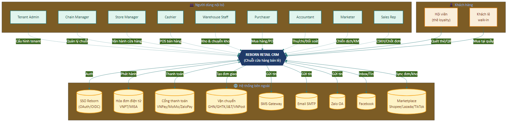
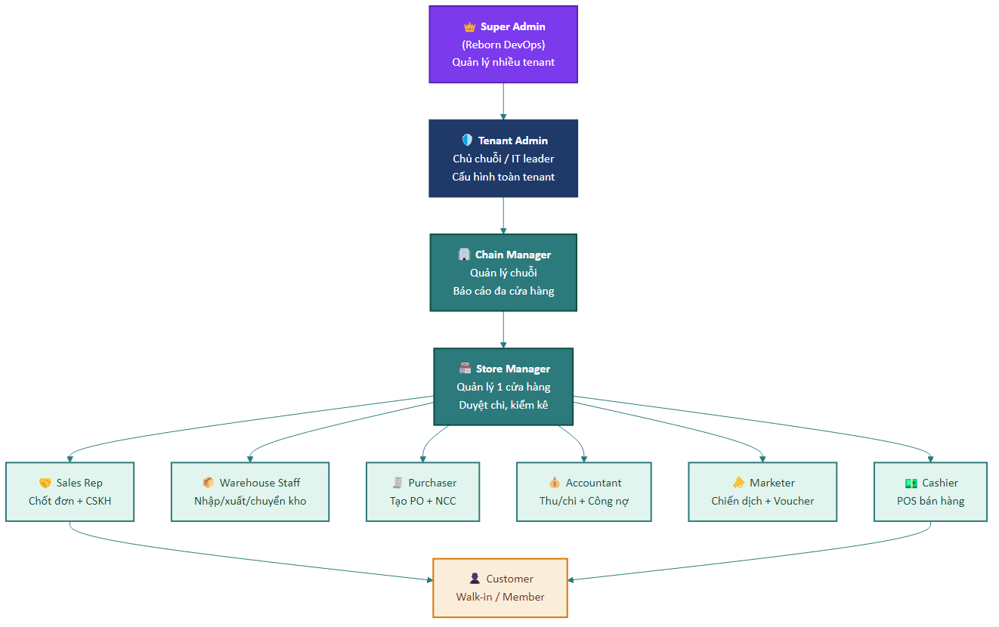

# Part 00 — Giới thiệu & Tổng quan

## 1. Mục đích tài liệu

Tài liệu **User Requirement Document (URD)** này mô tả **đầy đủ các yêu cầu nghiệp vụ và chức năng** mà hệ thống **Reborn Retail CRM** — biến thể *Cửa hàng bán lẻ / Chuỗi / Multi-channel POS* — phải đáp ứng. Tài liệu được biên soạn ngược (reverse-engineered) từ:

1. **Source code** hiện có trong repository `cloud-crm` nhánh `reborn-retail` (React + TypeScript, 167+ page modules).
2. **Hành vi thực tế** quan sát được khi vận hành hệ thống tại tenant test (`localhost:4000` + SSO `localhost:8080`).
3. **Cấu hình menu + routes** trong `src/configs/routes.tsx` — 103 menu entries.
4. **Services layer** — 240+ file service trong `src/services/`.

URD KHÔNG hướng dẫn thao tác (đó là việc của HDSD). URD trả lời câu hỏi **"Hệ thống PHẢI làm được những gì?"** ở mức yêu cầu nghiệp vụ và chức năng, kèm tiêu chí nghiệm thu rõ ràng.

## 2. Phạm vi hệ thống

### 2.1. Trong phạm vi (In-scope)

Reborn Retail CRM phục vụ các loại hình kinh doanh bán lẻ sau:

- **Cửa hàng bán lẻ đơn lẻ** — 1 điểm bán, quản lý POS + kho + khách.
- **Chuỗi cửa hàng** — nhiều chi nhánh dùng chung tồn kho + CRM + báo cáo tập trung.
- **Cửa hàng đa kênh** — offline (POS) kết hợp online (web/app/marketplace) với đồng bộ đơn và tồn.
- **Cửa hàng có dịch vụ kèm** — sản phẩm chính + dịch vụ phụ (lắp đặt, bảo hành, gia công).
- **Đại lý / phân phối** — bán sỉ kết hợp lẻ, quản lý công nợ NCC và KH.
- **Cửa hàng F&B có POS** — quản lý bàn/món/hoá đơn từng lượt khách.

Hệ thống bao phủ các nhóm chức năng:

1. Quản lý khách hàng (CRM cốt lõi, phân khúc, loyalty)
2. **POS — Bán hàng tại quầy** (ưu tiên số 1 cho retail)
3. Quản lý ca làm việc, quỹ tiền mặt, đối soát cuối ca
4. Quản lý đơn hàng (offline + online đa kênh)
5. **Hoá đơn VAT** điện tử (phát hành, tra cứu, huỷ)
6. **Quản lý kho nhiều chi nhánh** — nhập, xuất, chuyển, điều chỉnh, kiểm kê
7. **Mua hàng & Nhà cung cấp** — purchase order, nhập kho, công nợ NCC
8. **Vận chuyển & Logistics** — tích hợp đối tác vận chuyển, quản lý cước phí
9. Tài chính & Công nợ (khách + NCC)
10. Marketing automation đa kênh (SMS / Email / Zalo / Facebook)
11. Loyalty, khuyến mãi, voucher, tích điểm
12. Báo cáo phân tích kinh doanh (doanh thu, khách, kho, khuyến mãi)
13. Cấu hình tenant đa cơ sở, phân quyền, tích hợp
14. **BPM engine** — cấu hình quy trình, business rules, form động

### 2.2. Ngoài phạm vi (Out-of-scope)

URD này KHÔNG bao phủ:

- Hệ thống **kế toán đầy đủ** theo chuẩn VN (chỉ ghi nhận thu chi cơ bản, không đáp ứng báo cáo tài chính theo TT200/TT133).
- **HRM / chấm công** đầy đủ (chỉ có ca làm việc cơ bản, không tính lương theo công thức phức tạp).
- **ERP sản xuất** (chỉ có nhập xuất tồn, không có MRP / BOM phức tạp cho sản xuất chuỗi cung ứng).
- **Mobile app cho khách hàng** (chỉ có giao diện web + POS terminal).
- **AI / ML** dự đoán tồn kho, gợi ý sản phẩm (có thể ở phiên bản tương lai).
- **Hệ thống cashier hardware** cụ thể (máy in, két tiền, scanner) — chỉ có driver API chuẩn.
- **Quản lý bất động sản / mặt bằng** (xem biến thể Reborn TNPM).
- **Sự kiện, lớp học, check-in cộng đồng** (xem biến thể Reborn Community Hub).

## 3. Stakeholders & Actors

### 3.1. Stakeholders (bên liên quan)

| Stakeholder | Vai trò trong dự án | Mối quan tâm chính |
|-------------|---------------------|--------------------|
| **Chủ cửa hàng / Founder** | Người đầu tư, quyết định mua/thuê | ROI, doanh thu/ngày, mức tự động hoá |
| **Quản lý cửa hàng / Store Manager** | Vận hành hằng ngày, điều phối ca | Báo cáo doanh thu, tồn kho, KPI nhân viên |
| **Nhân viên thu ngân (Cashier)** | Người dùng chính tại quầy POS | Tốc độ thao tác, dễ dùng, ít lỗi |
| **Nhân viên kho (Warehouse staff)** | Nhập/xuất/kiểm kê | Phiếu nhập-xuất dễ dùng, quét mã nhanh |
| **Nhân viên bán hàng (Sales rep)** | Đối chiếu khách + tư vấn | CRM khách, lịch sử mua |
| **Kế toán cửa hàng (Accountant)** | Thu chi, đối soát, công nợ | Sổ chính xác, xuất báo cáo Excel |
| **Marketing / CSKH** | Chiến dịch, chăm sóc khách | Phân khúc, automation, chuyển đổi |
| **Purchaser / Nhân viên mua hàng** | Đặt hàng NCC, nhập kho | Purchase order, công nợ NCC |
| **Đội triển khai Reborn** | Setup tenant, đào tạo | Cài đặt linh hoạt, template ngành |
| **Đội phát triển Reborn** | Bảo trì, nâng cấp | Kiến trúc rõ, dễ mở rộng |

### 3.2. Sơ đồ ngữ cảnh hệ thống

Sơ đồ dưới đây minh họa Reborn Retail CRM ở vị trí trung tâm, kết nối với các nhóm người dùng nội bộ, khách hàng và các hệ thống bên ngoài.

### 3.3. Actors (vai trò trong hệ thống)

URD dùng các Actor sau xuyên suốt:

| Actor | Mô tả | Quyền cốt lõi |
|-------|-------|---------------|
| **Khách (Guest)** | Người chưa đăng nhập | Không có (chỉ thấy trang login / landing public) |
| **Khách hàng cuối (Customer)** | Người mua — thường không login CRM | Xem điểm tích luỹ qua link share, nhận SMS/email |
| **Nhân viên (Staff)** | Đăng nhập với vai trò thường | Bán hàng, xem khách |
| **Thu ngân (Cashier)** | Staff chuyên trực POS | + mở/đóng ca, in hoá đơn, nhận thanh toán |
| **Nhân viên kho (Warehouse)** | Staff quản lý kho | + nhập-xuất-chuyển-kiểm kho |
| **Nhân viên mua hàng (Purchaser)** | Staff phụ trách NCC | + tạo PO, nhận hàng, công nợ NCC |
| **Kế toán (Accountant)** | Staff phụ trách tài chính | + thu chi, công nợ, đối soát |
| **Marketing (Marketer)** | Staff phụ trách MKT | + tạo campaign, automation, gửi mass msg |
| **Quản lý cửa hàng (Store Manager)** | Quản lý cấp cơ sở | + xem báo cáo cửa hàng, duyệt phiếu, điều phối ca |
| **Quản lý chuỗi (Chain Manager)** | Quản lý nhiều cơ sở | + so sánh cơ sở, chuyển kho giữa chi nhánh |
| **Tenant Admin** | Admin của đơn vị thuê | + cấu hình toàn cục, phân quyền, tích hợp |
| **Super Admin (Reborn)** | Đội Reborn vận hành SaaS | + quản lý nhiều tenant, monitor hệ thống |
| **Hệ thống (System)** | Tác nhân tự động (cron, automation) | Chạy job định kỳ, auto close shift, sync order |
| **Bên thứ ba (Third-party)** | API ngoại — payment, VNPost, e-invoice, SMS | Webhook, callback |

### 3.4. Sơ đồ phân cấp Actor

Mỗi cấp **kế thừa quyền** của cấp dưới (cấu hình ở Part 12).

## 4. Glossary — Thuật ngữ

| Thuật ngữ | Định nghĩa |
|-----------|------------|
| **Tenant** | Một đơn vị thuê hệ thống (1 doanh nghiệp khách hàng), dữ liệu cô lập |
| **Cơ sở / Chi nhánh (Branch)** | Một điểm bán vật lý. 1 tenant có thể có nhiều chi nhánh |
| **Ca làm việc (Shift)** | Khoảng thời gian thu ngân trực POS có ghi nhận dòng tiền độc lập |
| **POS** | Point of Sale — màn hình bán hàng tại quầy |
| **SKU** | Stock Keeping Unit — mã định danh sản phẩm độc nhất |
| **Kho (Warehouse)** | Kho vật lý chứa hàng, có thể gắn với 1 cơ sở hoặc kho trung tâm |
| **Tồn kho (Stock)** | Số lượng sản phẩm hiện có trong 1 kho cụ thể |
| **Purchase Order (PO)** | Đơn đặt hàng gửi cho nhà cung cấp |
| **Sales Order (SO)** | Đơn bán cho khách hàng |
| **Return Invoice** | Phiếu trả hàng (khách trả về cửa hàng) |
| **Điều chuyển kho** | Chuyển hàng giữa 2 kho nội bộ |
| **Điều chỉnh kho** | Hiệu chỉnh số lượng tồn kho do mất mát / thừa |
| **Kiểm kê (Stock take)** | Đếm thực tế vs số hệ thống, tạo phiếu chênh lệch |
| **NCC** | Nhà cung cấp |
| **NVL** | Nguyên vật liệu |
| **Multi-channel** | Bán qua nhiều kênh (offline + online + marketplace) |
| **Marketplace** | Shopee, Lazada, Tiki, TikTok Shop… |
| **AOV** | Average Order Value — giá trị đơn trung bình |
| **Hạng thẻ (Tier)** | Cấp độ loyalty (Basic/Silver/Gold/Diamond) |
| **Voucher** | Phiếu giảm giá dùng 1 lần / nhiều lần |
| **VAT** | Thuế giá trị gia tăng |
| **HDDT** | Hoá đơn điện tử (theo TT78/NĐ123) |
| **MST** | Mã số thuế |
| **BPM** | Business Process Management — cấu hình quy trình nghiệp vụ |
| **SLA** | Service Level Agreement |
| **SSO** | Single Sign-On |
| **CRUD** | Create / Read / Update / Delete |
| **MoSCoW** | Phương pháp ưu tiên: Must / Should / Could / Won't |

## 5. Giả định & Ràng buộc

### 5.1. Giả định (Assumptions)

| ID | Giả định |
|----|----------|
| AS-01 | Mỗi tenant có ít nhất 1 cơ sở vật lý hoặc 1 cơ sở "ảo" để gán dữ liệu |
| AS-02 | Người dùng có máy tính / POS terminal chạy trình duyệt hiện đại (Chrome ≥ v110) |
| AS-03 | Có internet ổn định khi vận hành (hệ thống không hỗ trợ offline mode đầy đủ) |
| AS-04 | Số điện thoại VN là phương tiện định danh chính của khách hàng |
| AS-05 | Tiền tệ mặc định là VND, có thể đổi sang USD/EUR cho tenant quốc tế |
| AS-06 | Mọi dữ liệu nhạy cảm (mật khẩu, token, API key) được mã hoá khi lưu |
| AS-07 | Dữ liệu được backup định kỳ bởi đội Reborn (không phải tenant tự backup) |
| AS-08 | Thiết bị POS có máy in hoá đơn nhiệt + scanner mã vạch gắn vào |
| AS-09 | Mỗi cơ sở có tài khoản ngân hàng riêng để đối soát thanh toán điện tử |

### 5.2. Ràng buộc (Constraints)

| ID | Ràng buộc | Lý do |
|----|-----------|-------|
| CN-01 | Số điện thoại trong cùng 1 cơ sở phải duy nhất | Dùng làm khoá định danh khách |
| CN-02 | SKU trong cùng 1 tenant phải duy nhất | Tránh trùng trong báo cáo tồn kho |
| CN-03 | Một nhân viên không thể mở 2 ca cùng lúc trên cùng cơ sở | Tránh tranh chấp quỹ |
| CN-04 | Đơn hàng đã thanh toán không thể xoá, chỉ hoàn / huỷ | Bảo toàn audit trail |
| CN-05 | Hoá đơn VAT đã phát hành không sửa được, chỉ huỷ + phát hành lại | TT78 / NĐ123 |
| CN-06 | Mật khẩu phải ≥ 8 ký tự, có chữ hoa + thường + số | Chính sách bảo mật |
| CN-07 | Phiếu đối soát thanh toán đã chốt không sửa được trong cùng kỳ | Audit |
| CN-08 | Tồn kho không được âm (trừ khi cấu hình cho phép pre-order) | Nghiệp vụ |
| CN-09 | Chuyển kho giữa 2 chi nhánh phải có phiếu tách rời xuất-nhập | Truy vết |
| CN-10 | Giá bán không được thấp hơn giá vốn (warning, có override) | Bảo vệ lợi nhuận |
| CN-11 | Giới hạn số cơ sở / nhân viên / SKU theo gói SaaS đã thuê | Mô hình thương mại |

## 6. Cấu trúc tài liệu

URD chia thành **15 part**, được phân nhóm như sau:

- **Tổng quan** (Part này): mục đích, scope, actor, glossary
- **Chức năng cốt lõi retail** (Part 01–07): truy cập, POS, khách, đơn, kho, mua hàng, vận chuyển
- **Chức năng hỗ trợ** (Part 08–12): tài chính, marketing, loyalty, báo cáo, cài đặt
- **Kỹ thuật & mở rộng** (Part 13–14): BPM engine, NFR, tích hợp & dữ liệu

Mỗi Part chức năng mở đầu bằng **mô tả phân hệ + danh sách actor liên quan**, rồi liệt kê **các yêu cầu (UR)** theo template chuẩn (xem README).

## 7. Ưu tiên phân hệ (MoSCoW Map)

Bảng tóm tắt mức ưu tiên toàn hệ thống:

| Phân hệ | Ưu tiên | Lý do |
|---|---|---|
| POS bán hàng | **Must** | Cốt lõi retail — không có = không vận hành được |
| Kho nhiều chi nhánh | **Must** | Điều kiện cần của chuỗi bán lẻ |
| Quản lý khách hàng | **Must** | CRM cơ bản + định danh |
| Hoá đơn VAT điện tử | **Must** | Quy định pháp luật VN |
| Tài chính cơ bản | **Must** | Thu chi, công nợ tối thiểu |
| Mua hàng NCC | **Should** | Có thể nhập kho thủ công nếu thiếu |
| Vận chuyển | **Should** | Cần cho đa kênh, bỏ qua được nếu chỉ bán tại quầy |
| Multi-channel sales | **Should** | Kết nối với Shopee/Lazada |
| Loyalty & khuyến mãi | **Should** | Tăng lifetime value |
| Marketing automation | **Could** | Gửi tin nhắn hàng loạt tự động |
| Báo cáo phân tích | **Should** | Tối thiểu cần doanh thu, tồn kho |
| BPM engine | **Could** | Nâng cao, không cần cho cơ sở nhỏ |
| Multi-tenant | **Must** | SaaS model |
| Mobile app khách | **Won't (v1)** | Để phiên bản sau |

## 8. Lịch sử phiên bản

| Phiên bản | Ngày | Người soạn | Mô tả |
|-----------|------|------------|-------|
| 1.0 | 2026-04-15 | Reborn (reverse-engineered từ codebase + routes.tsx) | Bản đầu tiên, biên soạn ngược từ hệ thống đang chạy trên nhánh `reborn-retail` |

## 9. Phê duyệt

| Vai trò | Họ tên | Chữ ký | Ngày |
|---------|--------|--------|------|
| Đại diện Khách hàng | | | |
| PM Reborn | | | |
| Tech Lead Reborn | | | |
| QA Lead Reborn | | | |

---

*Hết Part 00.*
