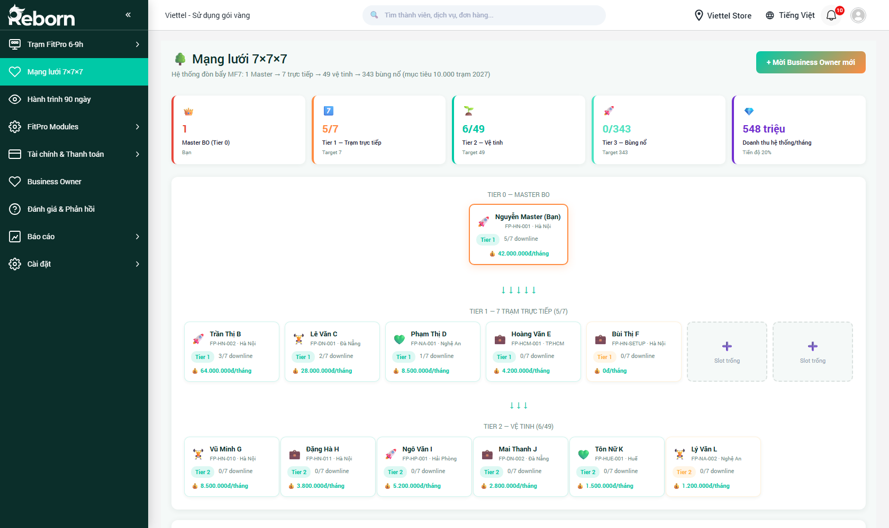

# Part 13 — Mạng lưới 7×7×7

*Phiên bản 0.6 — Tenant "FitPro"*

Phân hệ **Mạng lưới 7×7×7** là "xương sống" tăng trưởng của mô hình FitPro: biến mỗi Business Owner (BO) trở thành "điểm bùng nổ" kéo thêm 7 BO cấp dưới, tạo thành cây mạng lưới 3 tầng với mục tiêu **10.000 trạm vào năm 2027**.

> **Đối tượng đọc:**
> - **Master BO (Tier 0)**: người đứng đầu mạng lưới — xem tổng thể toàn bộ cây, mời BO mới.
> - **Ban giám đốc tenant**: giám sát tiến độ toàn mạng lưới, can thiệp khi nhánh nào phát triển chậm.

**Đường dẫn:** Sidebar → **Mạng lưới 7×7×7**
**URL:** `/crm/fp_network_tree`

---

## Mục lục

- [1. Khái niệm 7×7×7 & MF7](#1-khái-niệm-7×7×7--mf7)
- [2. Mở màn hình & đọc KPI](#2-mở-màn-hình--đọc-kpi)
- [3. Xem cây mạng lưới](#3-xem-cây-mạng-lưới)
- [4. Xem chi tiết một BO / một nhánh](#4-xem-chi-tiết-một-bo--một-nhánh)
- [5. Mời Business Owner mới](#5-mời-business-owner-mới)
- [6. Theo dõi tiến độ & cảnh báo](#6-theo-dõi-tiến-độ--cảnh-báo)
- [7. Các câu hỏi thường gặp](#7-các-câu-hỏi-thường-gặp)

---

## 1. Khái niệm 7×7×7 & MF7

### 1.1. Mô hình 3 tầng

**7×7×7** là cấu trúc nhân bản mạng lưới theo 3 tầng, mỗi tầng gấp 7 lần tầng trên:

| Tầng | Mã | Ý nghĩa | Số lượng mục tiêu |
|------|----|---------|------------------|
| **Tier 0** | Master BO | Người sáng lập mạng lưới, tầng đỉnh | 1 |
| **Tier 1** | Trạm trực tiếp | 7 BO do Master trực tiếp mời + đào tạo | 7 |
| **Tier 2** | Vệ tinh | Mỗi Tier 1 lại mời 7 BO → 7 × 7 = 49 | 49 |
| **Tier 3** | Bùng nổ | Mỗi Tier 2 mời 7 BO → 7 × 7 × 7 = 343 | 343 |

Tổng cộng 1 + 7 + 49 + 343 = **400 BO** trong 1 cây hoàn chỉnh. Với 25 cây hoàn chỉnh → **10.000 trạm** (mục tiêu 2027).

### 1.2. Triết lý MF7 (Master-Force-7)

FitPro vận hành theo triết lý **MF7 — "Master-Force-Leverage-7"**:

- **M (Mastery)** — BO phải làm chủ công việc, sức khỏe và vận mệnh của bản thân trước khi lan tỏa sang người khác.
- **F (Force)** — BO đứng trên vai người khổng lồ (Herbalife, Medlatec, hệ thống kỹ thuật của Reborn) để có sức bẩy.
- **7 (Leverage x7)** — sử dụng **1% nỗ lực của 10.000 trạm** thay vì 100% nỗ lực của chính mình. Mỗi BO nhân bản ra 7 BO cùng chí hướng.

Chi tiết đào tạo lộ trình MF7 xem [Part 15.9 — Onboarding MF7](part-15-fitpro-modules.md#onboarding-mf7).

---

## 2. Mở màn hình & đọc KPI

Bấm vào **Mạng lưới 7×7×7** trên sidebar. Màn hình hiển thị **5 thẻ KPI** ngang đầu trang:

| # | Thẻ | Ý nghĩa | Ví dụ |
|---|-----|---------|-------|
| 1 | 👑 **Master BO (Tier 0)** | Số lượng Master — luôn = 1 trong 1 mạng lưới | `1` |
| 2 | 🏢 **Tier 1 — Trạm trực tiếp** | Số BO đã có / Target 7 | `5/7` |
| 3 | 🌱 **Tier 2 — Vệ tinh** | Số BO đã có / Target 49 | `6/49` |
| 4 | 🚀 **Tier 3 — Bùng nổ** | Số BO đã có / Target 343 | `0/343` |
| 5 | 💎 **Doanh thu hệ thống/tháng** | Tổng doanh thu của toàn cây quy về tháng + tiến độ % so với target 10.000 trạm | `548 triệu` · Tiến độ 20% |

> **Cách đọc:** Nếu Tier 1 chưa đủ 7/7 mà Tier 2 đã bắt đầu có số → nhánh nào đó đang phát triển nhanh hơn trung bình. Ngược lại, Tier 1 đủ 7 mà Tier 2 vẫn 0 → mạng lưới đang "kẹt ở tầng 2".

### 2.1. Dòng phụ đề

Dưới tiêu đề có dòng mô tả cấu trúc: *"Hệ thống đòn bẩy MF7: 1 Master → 7 trực tiếp → 49 vệ tinh → 343 bùng nổ (mục tiêu 10.000 trạm 2027)"*.

---

## 3. Xem cây mạng lưới

Phần thân màn hình hiển thị **cây mạng lưới dạng sơ đồ** (organization chart), từ trên xuống dưới theo 3 tầng.

### 3.1. Tier 0 — Master BO

Node duy nhất ở đỉnh, viền **cam** nổi bật:

Mỗi node hiển thị:
- **Tên BO** (ví dụ: *Nguyễn Master (Bạn)*)
- **Mã trạm** + **địa điểm** (ví dụ: `FP-HN-001 · Hà Nội`)
- **Badge tier** (`Tier 1`)
- **Số downline** (ví dụ: `5/7 downline` — 5 trong số 7 slot đã có BO, còn 2 slot trống)
- **Doanh thu/tháng** (ví dụ: `💰 42.000.000đ/tháng`)

### 3.2. Tier 1 — 7 trạm trực tiếp

Dưới Master là **7 ô** — mỗi ô là một trạm trực tiếp. Các ô đã có BO hiển thị đầy đủ thông tin; các ô **Slot trống** hiển thị nét đứt với dấu **+** và chữ *"Slot trống"* — bấm vào để mời BO mới vào vị trí đó.

Các icon đầu node chỉ tình trạng "sức khỏe" của nhánh:
- 🚀 — nhánh đang tăng trưởng mạnh
- 🏆 — nhánh đã hoàn thành target downline
- 💚 — nhánh ổn định
- 💼 — mới thành lập, chưa có downline
- 🌱 — seeding giai đoạn đầu

### 3.3. Tier 2 — 49 vệ tinh

Dưới mỗi Tier 1 là 7 ô Tier 2. Tổng cộng 7 × 7 = 49 ô. Các ô vệ tinh nhỏ hơn, chỉ hiển thị thông tin cô đọng (tên, mã trạm, tier, số downline, doanh thu).

### 3.4. Tier 3 — 343 bùng nổ

Tier 3 mặc định **thu gọn** vì số lượng rất lớn. Khi 1 Tier 2 đã có downline Tier 3, bấm vào node Tier 2 để **mở rộng cây** xuống tầng 3 của nhánh đó.

---

## 4. Xem chi tiết một BO / một nhánh

**Bấm vào ô BO** bất kỳ trên cây để mở **Panel chi tiết BO** bên phải:

Nội dung panel gồm:

| Khu vực | Nội dung |
|---------|----------|
| **Thông tin BO** | Họ tên, số điện thoại, email, ngày gia nhập |
| **Trạm** | Mã trạm, loại trạm (Home / Co-Working — xem [Part 15.1](part-15-fitpro-modules.md#cấu-hình-loại-trạm)), địa chỉ, giờ mở |
| **Chỉ số tháng này** | Thành viên mới, lượt tập, doanh thu, hoa hồng trả upline |
| **Downline** | Danh sách các BO mà người này đã mời + tier của họ |
| **Timeline** | Mốc lịch sử: gia nhập mạng lưới, hoàn thành onboarding MF7, mời downline #1, #2... |

Có 3 nút hành động:
- **💬 Chat** — mở cửa sổ chat trực tiếp với BO đó.
- **🎯 Đặt mục tiêu** — giao KPI tháng cho BO.
- **⚠ Gửi cảnh báo** — nếu BO hoạt động dưới ngưỡng, gửi nhắc nhở đến họ + upline.

---

## 5. Mời Business Owner mới

**Mục đích:** Lấp slot trống hoặc mở rộng cây xuống tầng tiếp theo.

**Các cách mời:**

### Cách A — Từ slot trống trên cây

1. Tìm ô **+ Slot trống** (nét đứt) trên cây ở tầng bạn muốn thêm.
2. Bấm vào ô đó.
3. Form **"Mời BO mới"** mở ra.

### Cách B — Từ nút "+ Mời Business Owner mới" góc trên phải

1. Bấm nút xanh **+ Mời Business Owner mới** ở góc trên phải màn hình.
2. Chọn **Upline** — ai là người trực tiếp dẫn dắt BO mới này (mặc định là bạn).
3. Hệ thống tự đặt tier dựa trên tier của upline (upline Tier 0 → BO mới Tier 1, upline Tier 1 → BO mới Tier 2...).

### 5.1. Form mời BO mới

Điền thông tin cơ bản:

| Trường | Bắt buộc | Ghi chú |
|--------|----------|---------|
| **Họ tên** | ✅ |  |
| **Số điện thoại** | ✅ | Hệ thống sẽ gửi SMS lời mời |
| **Email** | Khuyên dùng | Gửi link onboarding MF7 |
| **Địa điểm dự kiến đặt trạm** | ✅ | Tỉnh/thành + quận/huyện |
| **Loại trạm dự kiến** | ✅ | Home FitPro / Co-Working FitPro (xem [Part 15.1](part-15-fitpro-modules.md#cấu-hình-loại-trạm)) |
| **Ngày dự kiến khai trương** | Khuyên | Để hệ thống nhắc lịch |
| **Ghi chú** |  | Lý do giới thiệu, hồ sơ sơ lược |

Bấm **Gửi lời mời**. BO mới sẽ nhận SMS + email với link kích hoạt tài khoản + bắt đầu lộ trình **Onboarding MF7 7 ngày** (xem [Part 15.9](part-15-fitpro-modules.md#onboarding-mf7)).

### 5.2. Trạng thái lời mời

Sau khi gửi, slot trên cây chuyển sang trạng thái **"Đang chờ xác nhận"** (màu xám). Khi BO kích hoạt tài khoản và bắt đầu Onboarding, slot chuyển sang **"Đang onboard"** (màu xanh nhạt). Hoàn thành Onboarding MF7 → slot chuyển sang **"Active"** với đầy đủ thông tin.

> **Lưu ý:** Mỗi BO chỉ được mời đúng **7 downline trực tiếp**. Khi đủ 7, nút "+ Slot trống" dưới BO đó biến mất.

---

## 6. Theo dõi tiến độ & cảnh báo

### 6.1. Bộ lọc & tìm kiếm

Trên đầu cây có thanh lọc:

- **Tỉnh / Thành phố** — lọc cây theo địa lý.
- **Tier** — chỉ xem 1 tầng cụ thể.
- **Trạng thái** — Active / Đang onboard / Chờ xác nhận / Ngừng hoạt động.
- **Tìm kiếm** — nhập tên hoặc mã trạm.

### 6.2. Cảnh báo tự động

Hệ thống tự phát hiện các BO có vấn đề và highlight bằng màu/icon:

| Dấu hiệu | Ý nghĩa | Hành động đề xuất |
|----------|---------|-------------------|
| 🔴 Viền đỏ | BO không check-in / không phát sinh doanh thu trong 30 ngày | Upline cần liên hệ + hỗ trợ |
| ⚠️ Icon cảnh báo | BO đang vi phạm SOP (điểm tuân thủ < 70) | Master gửi audit, xem [Part 15.4 — Tuân thủ SOP](part-15-fitpro-modules.md#tuân-thủ-sop) |
| 📉 Tiến độ tụt | Downline tháng này < downline tháng trước | Review với BO đó |
| 🕒 Onboarding quá hạn | BO được mời hơn 14 ngày nhưng chưa hoàn thành 7 ngày MF7 | Nhắc lại / chuyển slot |

### 6.3. Xuất báo cáo mạng lưới

Bấm **📥 Xuất Excel** (góc phải) để xuất toàn bộ cây mạng lưới dưới dạng bảng phẳng. File xuất gồm các cột: Tier, Mã trạm, BO, Upline, Doanh thu tháng, Số downline, Trạng thái, Ngày gia nhập.

---

## 7. Các câu hỏi thường gặp

**Q: Nếu một BO Tier 1 ngừng hoạt động, cả nhánh dưới họ có bị ảnh hưởng?**

A: Không. Các BO Tier 2/3 vẫn giữ dữ liệu và hoạt động độc lập. Master có thể **reassign upline** bằng cách vào panel chi tiết BO cấp dưới → **Chuyển upline** → chọn BO upline mới. Lịch sử hoa hồng cũ vẫn được giữ.

**Q: Master tôi có thể giám sát chi tiết việc BO Tier 3 đang làm gì không?**

A: Có. Master có quyền xem toàn bộ cây. Bấm vào BO Tier 3 bất kỳ → panel chi tiết. Nhưng chỉ **upline trực tiếp** mới can thiệp (đặt mục tiêu, gửi cảnh báo). Master có thể bỏ qua upline khi cần xử lý khẩn cấp.

**Q: Tại sao target Tier 3 là 343 mà target Master chỉ là "10.000 trạm 2027"?**

A: 10.000 trạm là **mục tiêu toàn hệ thống** (tổng của ~25 cây 7×7×7). Một cây hoàn chỉnh chỉ góp 400 trạm (1 + 7 + 49 + 343). Khi 1 cây đạt 343 Tier 3, một trong các Tier 3 đó sẽ tách ra làm **Master mới** của cây thứ 2 — bắt đầu chu kỳ nhân bản.

**Q: Doanh thu hệ thống/tháng tính thế nào?**

A: Tổng doanh thu **của tất cả trạm trong cây** (bán gói tập + phụ trợ) trong tháng hiện tại. Không tính doanh thu các cây khác.

**Q: Làm sao để invite BO mà không gửi SMS + email?**

A: Dùng **Cách B** → bỏ tick "Gửi thông báo tự động" → slot được tạo ở trạng thái "Draft". Sau đó bạn tự chia sẻ link kích hoạt qua kênh khác (Zalo, gặp trực tiếp).

---

> **Liên quan:**
> - [Part 14 — Hành trình 90 ngày](part-14-hanh-trinh-90-ngay.md) — chu trình 90 ngày của từng thành viên (member), khác với tăng trưởng mạng lưới.
> - [Part 15.6 — Hoa hồng hệ thống](part-15-fitpro-modules.md#hoa-hồng-hệ-thống) — dashboard hoa hồng 5% × 3 tầng từ Herbalife.
> - [Part 15.9 — Onboarding MF7](part-15-fitpro-modules.md#onboarding-mf7) — lộ trình 7 ngày đào tạo BO mới.
