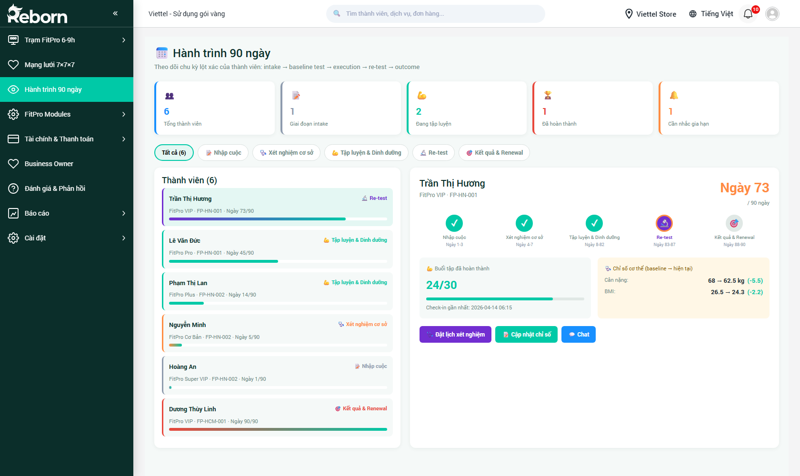

# Part 14 — Hành trình 90 ngày

*Phiên bản 0.6 — Tenant "FitPro"*

Phân hệ **Hành trình 90 ngày** là công cụ chăm sóc từng **thành viên** (member) theo chu kỳ 90 ngày — giai đoạn vàng để hội viên đi từ **đăng ký gói** đến **đạt được kết quả cụ thể** (giảm cân, tăng cơ, cải thiện chỉ số huyết áp / đường huyết / cholesterol...). Sau 90 ngày, nếu kết quả tốt → gia hạn; nếu không → phải review để tránh hội viên rời bỏ.

> **Đối tượng đọc:**
> - **Business Owner (BO)**: theo dõi từng hội viên của trạm mình.
> - **Huấn luyện viên / lễ tân trạm**: biết hôm nay cần nhắc ai, xếp lịch xét nghiệm cho ai.
> - **Ban giám đốc**: tổng quan tỷ lệ hoàn thành 90 ngày của toàn mạng lưới.

**Đường dẫn:** Sidebar → **Hành trình 90 ngày**
**URL:** `/crm/fp_journey`

---

## Mục lục

- [1. Khái niệm & 6 giai đoạn](#1-khái-niệm--6-giai-đoạn)
- [2. Đọc bảng KPI tổng quan](#2-đọc-bảng-kpi-tổng-quan)
- [3. Danh sách thành viên & bộ lọc giai đoạn](#3-danh-sách-thành-viên--bộ-lọc-giai-đoạn)
- [4. Xem chi tiết một thành viên](#4-xem-chi-tiết-một-thành-viên)
- [5. Các hành động nhanh](#5-các-hành-động-nhanh)
- [6. Luồng làm việc của BO / HLV theo ngày](#6-luồng-làm-việc-của-bo--hlv-theo-ngày)
- [7. Renewal (gia hạn) cuối chu kỳ](#7-renewal-gia-hạn-cuối-chu-kỳ)
- [8. Các câu hỏi thường gặp](#8-các-câu-hỏi-thường-gặp)

---

## 1. Khái niệm & 6 giai đoạn

Một hội viên sau khi mua gói FitPro sẽ đi qua 6 giai đoạn trong 90 ngày:

| Mốc | Giai đoạn | Ngày | Hoạt động chính |
|-----|-----------|------|-----------------|
| 1 | **Nhập cuộc (Intake)** | Ngày 1-3 | Tư vấn ban đầu, set mục tiêu, chụp ảnh "trước" |
| 2 | **Xét nghiệm cơ sở (Baseline)** | Ngày 4-7 | Lấy mẫu máu Medlatec tại nhà/trạm, đo chỉ số cơ thể lần 1 |
| 3 | **Tập luyện & Dinh dưỡng** | Ngày 8-82 | Check-in trạm, theo giáo trình Herbalife, tương tác với HLV |
| 4 | **Re-test** | Ngày 83-85 | Lấy mẫu máu lần 2, đo lại chỉ số, so với baseline |
| 5 | **Kết quả & Renewal** | Ngày 86-90 | Review kết quả, quyết định gia hạn/không |
| 6 | **Cần nhắc gia hạn** | Ngày 91+ | Trạng thái quá hạn chưa renew, cần chủ động liên hệ |

> **Hình dung:** 90 ngày là "chu trình bán hàng tự động". Hệ thống nhắc lịch, nhắc xét nghiệm, nhắc chỉ số. BO chỉ cần xử lý các cảnh báo được đẩy lên đầu danh sách.

---

## 2. Đọc bảng KPI tổng quan

Mở **Hành trình 90 ngày**. Phần đầu trang có dòng giới thiệu + **5 thẻ KPI** tương ứng 5 giai đoạn chính (không tính giai đoạn 6 — gộp vào cần nhắc gia hạn):



| # | Thẻ | Ý nghĩa | Ví dụ |
|---|-----|---------|-------|
| 1 | 👥 **Tổng thành viên** | Tất cả hội viên đang trong chu kỳ 90 ngày tại các trạm bạn quản lý | `6` |
| 2 | 📋 **Giai đoạn intake** | Đang ở ngày 1-3 | `1` |
| 3 | 👍 **Đang tập luyện** | Đang ở ngày 8-82 (giai đoạn dài nhất) | `2` |
| 4 | 🏆 **Đã hoàn thành** | Đã đến ngày 90, chờ quyết định renewal | `1` |
| 5 | 🔔 **Cần nhắc gia hạn** | Quá ngày 90 nhưng chưa renew | `1` |

Dưới 5 thẻ là dòng breadcrumb mô tả chu kỳ: *"Theo dõi chu kỳ kết xác của hội viên: intake → baseline test → execution → re-test → outcome"*.

---

## 3. Danh sách thành viên & bộ lọc giai đoạn

Phần thân màn hình chia **2 cột**:
- **Cột trái (35%)** — Danh sách thành viên kèm bộ lọc giai đoạn.
- **Cột phải (65%)** — Chi tiết 1 thành viên được chọn.

### 3.1. Bộ lọc giai đoạn (chip tabs)

Ngay trên danh sách, dòng chip cho phép lọc theo giai đoạn:

- **Tất cả (N)** — toàn bộ hội viên.
- **Nhập cuộc** — chỉ giai đoạn 1.
- **Xét nghiệm cơ sở** — chỉ giai đoạn 2.
- **Tập luyện & Dinh dưỡng** — chỉ giai đoạn 3.
- **Re-test** — chỉ giai đoạn 4.
- **Kết quả & Renewal** — giai đoạn 5 + 6.

Bấm chip để lọc. Chip đang chọn có màu tô đậm + viền primary.

### 3.2. Cấu trúc 1 card thành viên

Mỗi hội viên trong danh sách hiển thị dạng card đứng:

```
┌─────────────────────────────────┐
│ 🟢 Trần Thị Hương               │  ← tên + chip giai đoạn màu
│    FitPro VIP · FP-HN-001 · Ngày 73/90  │
│                        [Re-test]  │  ← chip giai đoạn hiện tại (góc phải)
└─────────────────────────────────┘
```

Các thông tin chính:
- **Tên** + **icon giai đoạn** (màu thay đổi theo giai đoạn).
- **Gói đã mua** + **Mã trạm**.
- **Ngày X/90** — đã đi qua bao nhiêu ngày trong chu trình.
- **Chip giai đoạn** ở góc phải — VD `Re-test`, `Kết quả & Renewal`, `Tập luyện & Dinh dưỡng`, `Nhập cuộc`.

Bấm card để load chi tiết vào cột phải.

---

## 4. Xem chi tiết một thành viên

Cột phải hiển thị **dashboard cá nhân hóa** cho hội viên được chọn.

### 4.1. Header

- **Tên đầy đủ** (lớn).
- **Gói đã mua** + **Mã trạm**: ví dụ *"FitPro VIP · FP-HN-001"*.
- **Ngày X/90** (lớn, màu cam) — đếm ngày đang ở đâu trong chu kỳ.

### 4.2. Timeline 5 mốc

Thanh timeline ngang hiển thị **5 bước** với 3 trạng thái:

| Icon | Trạng thái | Ý nghĩa |
|------|------------|---------|
| ✅ Xanh | Đã hoàn thành | Mốc đã trôi qua + hoàn thành |
| 🔁 Cam sáng (icon refresh) | Đang làm | Mốc hiện tại |
| ⬜ Xám | Chưa đến | Mốc tương lai |

Ví dụ với hội viên ở Ngày 73:
- Nhập cuộc: ✅ Ngày 1-3
- Xét nghiệm cơ sở: ✅ Ngày 4-7
- Tập luyện & Dinh dưỡng: ✅ Ngày 8-82
- Re-test: 🔁 Ngày 83-85 (đang chờ đặt lịch)
- Kết quả & Renewal: ⬜ Ngày 86-90

### 4.3. Hộp thống kê giữa chu trình

Dưới timeline có 2 panel:

**Panel trái — Buổi tập hoàn thành:**

Hiển thị số lớn `24/30` và ngày check-in gần nhất. `30` là số buổi trong gói, `24` là đã dùng. Ngày check-in gần nhất giúp phát hiện hội viên đang "chững lại" (VD: ngày gần nhất là 2026-04-14 trong khi hôm nay 2026-04-24 → 10 ngày không đến trạm → cảnh báo).

**Panel phải — Chỉ số cơ thể:**

So sánh **baseline ↔ hiện tại** với delta:

| Chỉ số | Baseline | Hiện tại | Thay đổi |
|--------|----------|----------|----------|
| Cân nặng | 68 kg | 62.5 kg | **-5.5 kg** (xanh) |
| BMI | 26.5 | 24.3 | **-2.2** (xanh) |

Màu:
- **Xanh** nếu chỉ số đi đúng hướng mục tiêu (giảm cân giảm / tăng cơ tăng).
- **Đỏ** nếu đi ngược hướng.
- **Xám** nếu chưa có baseline hoặc chưa đo lại.

Chi tiết đầy đủ các chỉ số (Body Fat, Cholesterol, Huyết áp, Đường huyết) xem [Part 15.3 — Chỉ số cơ thể](part-15-fitpro-modules.md#chỉ-số-cơ-thể).

### 4.4. 3 nút hành động nhanh (dưới các chỉ số)

- 🗓️ **Đặt lịch xét nghiệm** — mở modal đặt Medlatec đến nhà/trạm.
- 📊 **Cập nhật chỉ số** — điền số đo mới (cân, BMI, body fat, huyết áp...) thủ công nếu không dùng Medlatec.
- 💬 **Chat** — mở cửa sổ chat trực tiếp với hội viên (qua Zalo hoặc chat in-app).

---

## 5. Các hành động nhanh

### 5.1. Đặt lịch xét nghiệm

**Khi dùng:** Hội viên đến gần mốc Baseline (ngày 4-7) hoặc Re-test (ngày 83-85).

**Các bước:**
1. Bấm **🗓️ Đặt lịch xét nghiệm**.
2. Modal hiện ra với form:
   - **Thành viên**: tự fill tên.
   - **Loại xét nghiệm**: Baseline / Re-test (tự chọn theo ngày hiện tại).
   - **Ngày giờ mong muốn**: chọn slot trống.
   - **Địa điểm**: Tại nhà / Tại trạm (hệ thống tự xác định địa chỉ từ hồ sơ hội viên hoặc mã trạm).
3. Bấm **Xác nhận**. Hệ thống tự kết nối Medlatec API và đặt lịch.
4. Hội viên nhận SMS xác nhận + được nhắc trước 1 ngày.

### 5.2. Cập nhật chỉ số thủ công

**Khi dùng:** Khi HLV tự đo chỉ số ở trạm (cân điện tử, thước đo vòng eo...).

**Các bước:**
1. Bấm **📊 Cập nhật chỉ số**.
2. Form hiện:
   - **Ngày đo** (mặc định hôm nay).
   - **Các chỉ số**: Cân nặng, Vòng eo, Vòng hông, % Body fat, BMI (tự tính), Nhịp tim nghỉ, Huyết áp...
3. Chỉ số nào không đo để trống — không bắt buộc điền hết.
4. Bấm **Lưu**. Panel Chỉ số cơ thể của hội viên cập nhật ngay.

### 5.3. Chat với hội viên

**Khi dùng:** Nhắc hội viên đến trạm, hỏi thăm sau buổi tập, động viên đạt mục tiêu.

**Các bước:**
1. Bấm **💬 Chat**.
2. Cửa sổ chat mở ra với lịch sử trao đổi trước đó.
3. Gõ tin nhắn → Enter để gửi.
4. Hệ thống tự đẩy tin đến Zalo / app mobile của hội viên.

> **Mẹo:** Có các **template nhắn sẵn** ở dưới ô nhập — VD *"Chào anh/chị, em thấy mình chưa đến trạm 3 ngày nay, mọi thứ có ổn không ạ?"*. Bấm template để tự điền nhanh.

---

## 6. Luồng làm việc của BO / HLV theo ngày

Mỗi buổi sáng khi đến trạm, HLV / BO nên dành **5-10 phút** mở **Hành trình 90 ngày** và làm các việc sau:

### Bước 1 — Xem ai cần hành động gấp hôm nay

Lọc theo chip **Nhập cuộc** → xem ai vừa ký gói hôm qua → chuẩn bị tư vấn kế hoạch 90 ngày.

Lọc theo chip **Xét nghiệm cơ sở** → ai đến mốc baseline → đặt lịch Medlatec ngay nếu chưa có.

Lọc **Re-test** → ai đến mốc re-test → nhắc họ nghỉ ăn đúng giờ trước xét nghiệm.

Lọc **Kết quả & Renewal** → ai đã qua ngày 85 → chuẩn bị bài tư vấn gia hạn.

### Bước 2 — Duyệt danh sách "Cần nhắc gia hạn"

Đây là nhóm ưu tiên cao nhất. Mỗi hội viên trong nhóm này cần:
- Gọi điện / chat trong ngày.
- Ghi chú kết quả vào hồ sơ.
- Nếu đồng ý gia hạn → tạo đơn gói mới (xem [Part 02.B — Bán hàng tại quầy](part-02-le-tan.md#b-bán-hàng-tại-quầy-pos)).

### Bước 3 — Cập nhật chỉ số cho hội viên tập hôm qua

Nếu HLV có đo cân hoặc theo dõi chỉ số cho ai, vào hồ sơ và bấm **Cập nhật chỉ số** để ghi nhận.

### Bước 4 — Theo dõi tiến độ tổng thể

Nhìn bảng KPI tổng quan ở đầu trang. Nếu **Cần nhắc gia hạn** > 20% tổng thành viên → trạm đang có vấn đề giữ chân, cần họp đội ngũ.

---

## 7. Renewal (gia hạn) cuối chu kỳ

### 7.1. Tại sao renewal quan trọng?

FitPro là mô hình **gói dài hạn**. Một hội viên giữ chân 2-3 chu kỳ 90 ngày = 6-9 tháng → LTV (lifetime value) cao gấp 3 lần hội viên chỉ mua 1 gói. Do đó 5 ngày cuối (ngày 86-90) là "cửa sổ vàng" cho việc upsell.

### 7.2. Luồng renewal tiêu chuẩn

1. **Ngày 83-85 (Re-test):** hội viên đi xét nghiệm máu lần 2 + đo chỉ số.
2. **Ngày 86-87:** HLV xem kết quả, chuẩn bị slide so sánh "Trước ↔ Sau".
3. **Ngày 88:** HLV hẹn hội viên lên trạm → trình bày kết quả → đề xuất gói gia hạn (có thể upgrade lên gói cao hơn).
4. **Ngày 89-90:** hội viên quyết định.
5. **Ngày 91+:** nếu chưa renew → hội viên tự động vào nhóm **Cần nhắc gia hạn**. Hệ thống gửi SMS + Zalo nhắc trong 3 ngày liên tiếp.

### 7.3. Tạo đơn gia hạn

Từ hồ sơ hội viên, bấm **Gia hạn gói** (nút xuất hiện từ ngày 83 trở đi):

1. Form chọn gói mới — hệ thống đề xuất gói giống hoặc cao hơn dựa trên kết quả đạt được.
2. Chọn phương thức thanh toán.
3. Bấm **Tạo đơn**. Hệ thống tự reset chu trình về ngày 1 của 90 ngày mới + gán baseline = kết quả re-test vừa có.

---

## 8. Các câu hỏi thường gặp

**Q: Một hội viên có thể đang ở nhiều giai đoạn cùng lúc không?**

A: Không. Mỗi hội viên tại một thời điểm chỉ ở **một giai đoạn duy nhất**, xác định bởi ngày đã trôi qua từ khi mua gói.

**Q: Nếu hội viên bỏ giữa chừng (ngày 50 không đến nữa) thì sao?**

A: Hệ thống đánh dấu **"Đang tập luyện"** nhưng hiển thị cảnh báo 🔴 nếu > 14 ngày không check-in. HLV cần liên hệ chủ động. Nếu hội viên xác nhận dừng, chuyển trạng thái sang **"Cancelled"** và ghi lý do vào ghi chú.

**Q: Khi baseline trễ (VD hội viên ngày 20 mới đi xét nghiệm), chu trình có bị xê dịch không?**

A: Có. Hệ thống tính **"Ngày Baseline thực tế"** và bắt đầu tính ngày 1 của giai đoạn Tập luyện từ đó. Các mốc re-test và renewal cũng xê dịch theo. Ngày X/90 trên danh sách hiển thị theo **ngày từ baseline**, không phải từ ngày mua.

**Q: Ai có thể xem/chỉnh Hành trình 90 ngày?**

A:
- **Master BO**: xem toàn bộ mạng lưới.
- **Business Owner Tier 1/2/3**: chỉ xem hội viên của trạm mình + trạm downline.
- **Huấn luyện viên**: chỉ xem hội viên được gán.
- **Lễ tân trạm**: xem được nhưng không chỉnh chỉ số.

Phân quyền cấu hình ở [Part 12 — Tổ chức & phân quyền](part-12-cai-dat-nang-cao.md).

**Q: Khi nào hệ thống tự tạo Hành trình 90 ngày cho một hội viên?**

A: Ngay sau khi đơn mua **gói FitPro** được confirm (trạng thái "Đã xác nhận" trong Part 02 / 04). Không cần tạo thủ công.

---

> **Liên quan:**
> - [Part 03 — Thành viên](part-03-thanh-vien.md) — hồ sơ gốc của hội viên (thông tin cá nhân, liên hệ, nhóm).
> - [Part 15.3 — Chỉ số cơ thể](part-15-fitpro-modules.md#chỉ-số-cơ-thể) — chi tiết các chỉ số đo + Medlatec integration.
> - [Part 11 — Gói FitPro](part-11-cai-dat-co-ban.md) — cấu hình các gói dịch vụ với chu trình 90 ngày.
