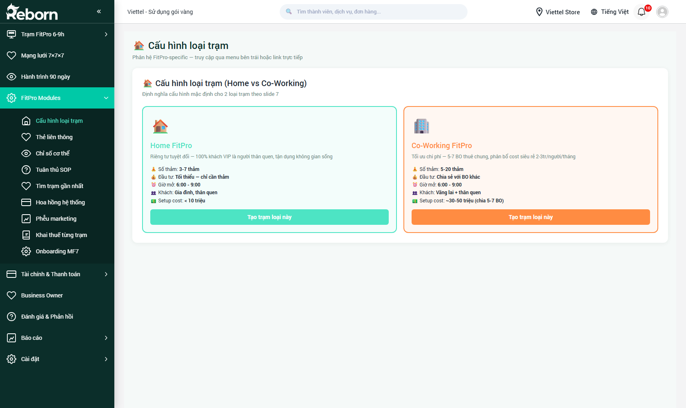
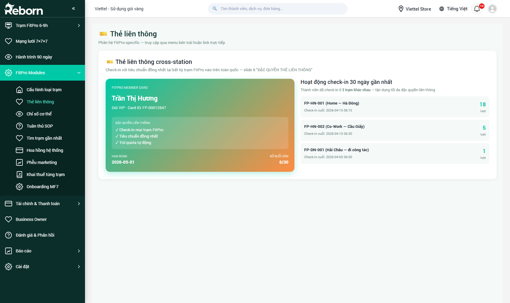
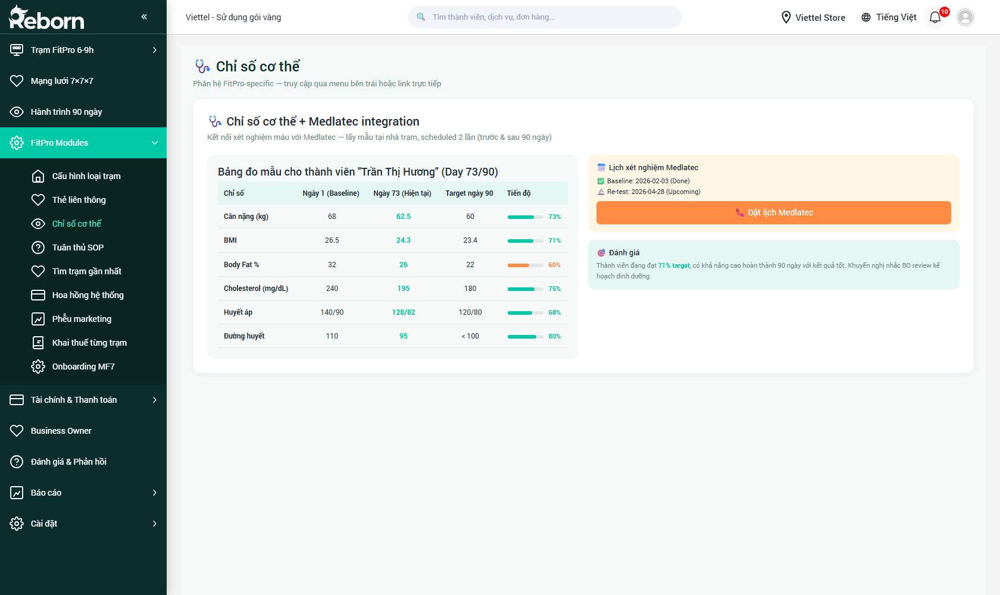
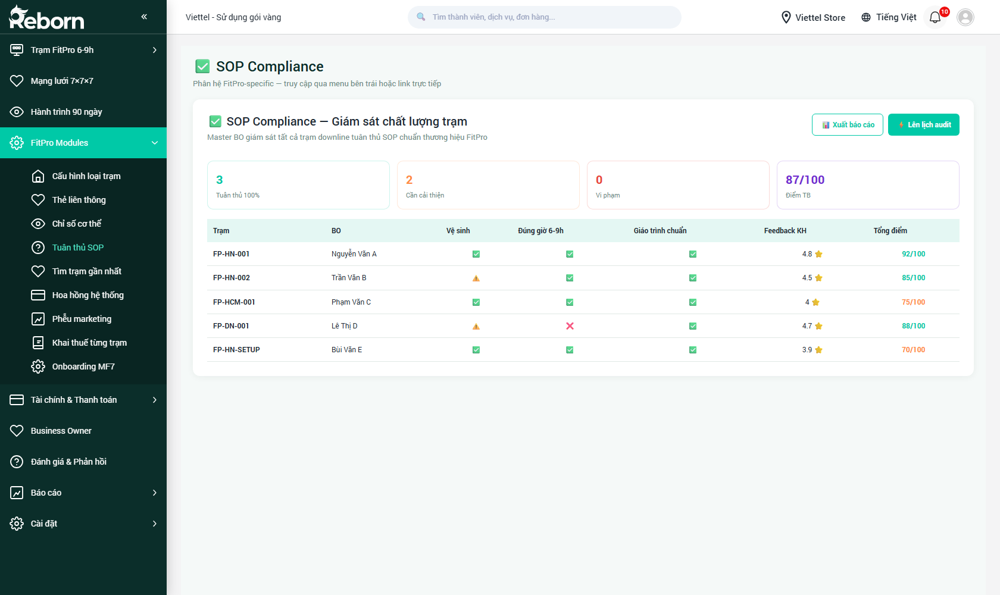
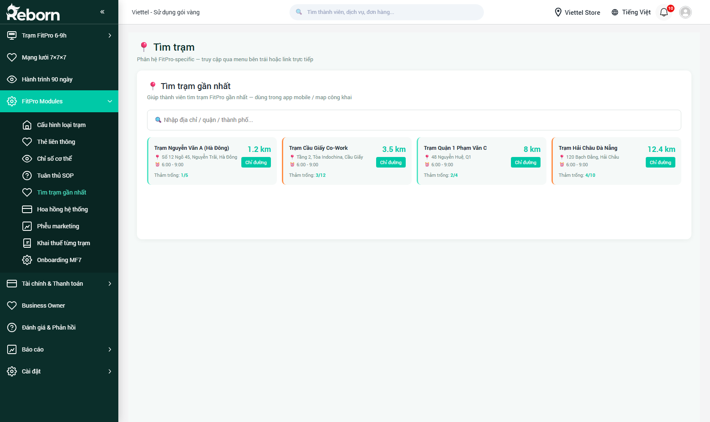
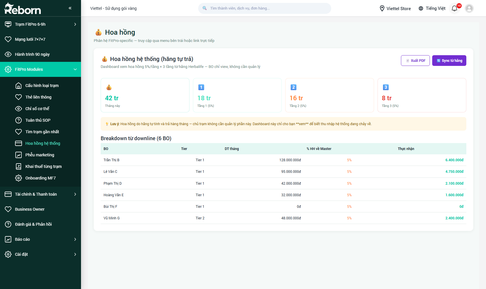
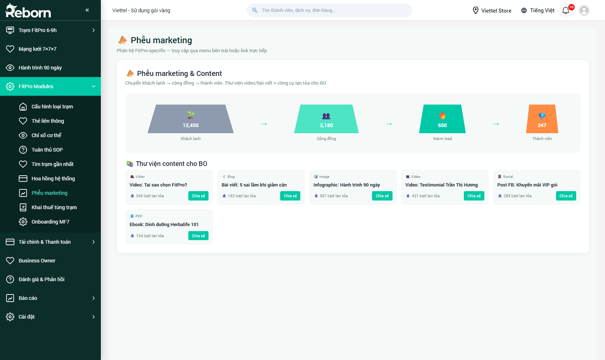
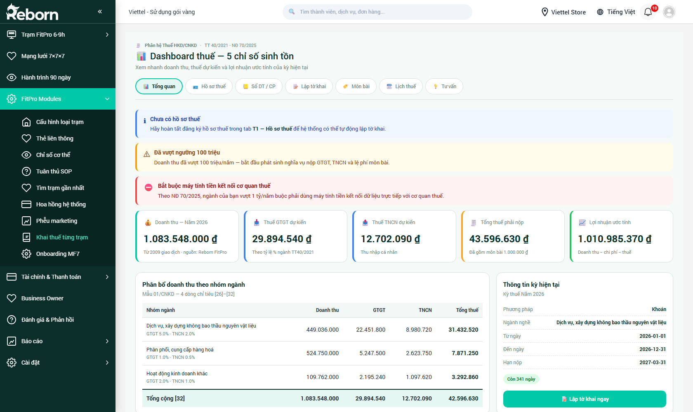
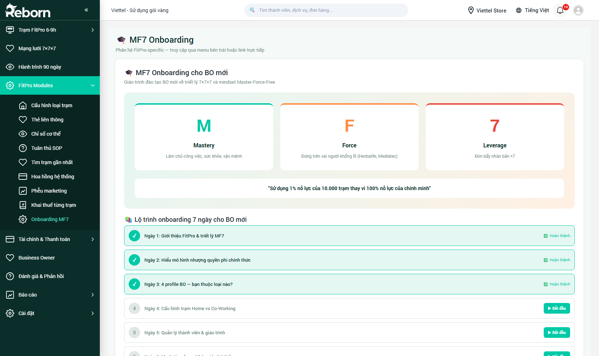

# Part 15 — FitPro Modules

*Phiên bản 0.6 — Tenant "FitPro"*

**FitPro Modules** là nhóm 9 module đặc thù cho mô hình chuỗi trạm FitPro. Đây là các công cụ hỗ trợ Business Owner vận hành trạm, đảm bảo chất lượng, tăng trưởng mạng lưới và tối ưu dòng tiền — không có trên các tenant CRM khác.

> **Đối tượng đọc:**
> - **Master BO** & **Business Owner**: tất cả 9 module.
> - **HLV / lễ tân trạm**: chủ yếu quan tâm `Chỉ số cơ thể` + `Tuân thủ SOP` + `Thẻ liên thông`.
> - **Kế toán**: `Hoa hồng hệ thống` + `Khai thuế từng trạm`.

**Đường dẫn:** Sidebar → **FitPro Modules** (nhấp để mở dropdown).

---

## Danh sách 9 module

| # | Module | URL | Đối tượng dùng | Tần suất |
|---|--------|-----|----------------|----------|
| 1 | [Cấu hình loại trạm](#cấu-hình-loại-trạm) | `/crm/fp_station_type` | Master BO | Một lần |
| 2 | [Thẻ liên thông](#thẻ-liên-thông) | `/crm/fp_cross_card` | BO + Lễ tân | Hàng ngày |
| 3 | [Chỉ số cơ thể](#chỉ-số-cơ-thể) | `/crm/fp_body_metrics` | HLV + Hội viên | Mỗi chu kỳ |
| 4 | [Tuân thủ SOP](#tuân-thủ-sop) | `/crm/fp_sop` | Master BO | Hàng tuần |
| 5 | [Tìm trạm gần nhất](#tìm-trạm-gần-nhất) | `/crm/fp_finder` | Hội viên (app / web) | Khi cần |
| 6 | [Hoa hồng hệ thống](#hoa-hồng-hệ-thống) | `/crm/fp_commission` | BO + Kế toán | Hàng tháng |
| 7 | [Phễu marketing](#phễu-marketing) | `/crm/fp_funnel` | Master BO + BO | Hàng tuần |
| 8 | [Khai thuế từng trạm](#khai-thuế-từng-trạm) | `/crm/fp_tax` | Kế toán + BO | Hàng quý |
| 9 | [Onboarding MF7](#onboarding-mf7) | `/crm/fp_mf7` | BO mới | 7 ngày đầu |

---

## Cấu hình loại trạm

**URL:** `/crm/fp_station_type`

Module định nghĩa **2 loại trạm chuẩn** trong hệ thống FitPro. Khi Master BO mời một BO mới (xem [Part 13](part-13-mang-luoi-7x7x7.md#5-mời-business-owner-mới)), hệ thống yêu cầu chọn 1 trong 2 loại — dựa trên quỹ đầu tư và không gian BO có sẵn.

### Home FitPro (thẻ xanh)

Dành cho BO **sở hữu sẵn nhà riêng** và muốn tận dụng không gian.

| Tiêu chí | Giá trị |
|----------|---------|
| 🧘 Số thảm | 3–7 thảm |
| 💰 Đầu tư | **Tối thiểu** — chỉ cần thảm |
| 🕒 Giờ mở | 6:00 – 9:00 |
| 👥 Đối tượng khách | Gia đình, người thân quen của BO |
| 🏗 Setup cost | **< 10 triệu** |

> **Phù hợp:** BO mới vào mạng lưới, chưa có vốn lớn, hoặc muốn thử sức giai đoạn đầu trước khi nâng cấp.

**Thao tác:** Bấm nút **Tạo trạm loại này** (màu xanh). Hệ thống tự mở form tạo trạm Home FitPro với các trường preset (số thảm 5, giờ mở 6:00–9:00...).

### Co-Working FitPro (thẻ cam)

Dành cho BO **đầu tư nghiêm túc** với mô hình chia sẻ không gian giữa 5-7 BO.

| Tiêu chí | Giá trị |
|----------|---------|
| 🧘 Số thảm | 5–20 thảm |
| 💰 Đầu tư | Chia sẻ với 5-7 BO khác |
| 🕒 Giờ mở | 6:00 – 9:00 |
| 👥 Đối tượng khách | Vãng lai + thân quen |
| 🏗 Setup cost | **~30-50 triệu** (chia 5-7 BO) |

> **Phù hợp:** Nhóm 5-7 BO góp vốn thuê mặt bằng, chia sẻ setup + vận hành. Mô hình này cho phép kết nối nhiều BO trong cùng khu vực → dễ phát triển mạng lưới downline.

**Thao tác:** Bấm **Tạo trạm loại này** (màu cam). Form tạo trạm có thêm trường *"Danh sách 5-7 BO góp vốn"*.

> **Lưu ý:** Cấu hình này áp dụng **hệ thống**. Nếu muốn tùy biến cho 1 trạm cụ thể (VD Home FitPro 10 thảm thay vì 7), BO chỉnh trong hồ sơ trạm sau khi tạo.

---

## Thẻ liên thông

**URL:** `/crm/fp_cross_card`

Module cho phép 1 hội viên **tập được ở nhiều trạm khác nhau** trong hệ thống, không bó buộc trạm gốc — tính năng "cross-station" đặc thù của FitPro.

### Cách hoạt động

- Hội viên mua gói tại **trạm gốc** (ví dụ: `FP-HN-001 · Hà Nội`).
- Khi hội viên công tác / du lịch đến thành phố khác, có thể check-in vào bất kỳ trạm FitPro nào cùng mạng lưới.
- **Trạm đón tiếp** trừ buổi tập từ gói của hội viên, thu phí service fee nhỏ để bù chi phí vận hành.
- Hệ thống tự động đối soát: trạm gốc trả % chia sẻ cho trạm đón tiếp vào cuối tháng.

### Màn hình

**Panel trái — Thẻ liên thông cross-station:**

Hiển thị thông tin 1 hội viên đang active thẻ liên thông: tên, mã, gói, ngày hết hạn, trạm đang sinh sống (home station).

**Panel phải — Hoạt động check-in trong 30 ngày gần nhất:**

Danh sách các lần check-in liên thông gần đây:

| Cột | Nội dung |
|-----|----------|
| Trạm đón tiếp | Mã trạm + địa điểm |
| Ngày | Ngày check-in |
| Buổi trừ | Số buổi bị trừ khỏi gói |
| Service fee | Phí dịch vụ trạm đón tiếp thu (nhỏ, 20-50k) |

Dưới danh sách có **3 KPI tổng** cho hội viên đó:
- Tổng lượt check-in liên thông (30 ngày): VD `18` lượt
- Tổng buổi đã trừ: VD `9` buổi
- Tổng service fee: VD `1` triệu

### Sử dụng hàng ngày tại trạm

Khi một hội viên "lạ" (không thuộc trạm bạn) đến check-in:

1. Hội viên đưa thẻ / quét QR.
2. Hệ thống nhận diện: đây là hội viên của trạm khác → hiển thị **modal "Thẻ liên thông"** kèm thông tin:
   - Trạm gốc: `FP-HN-001`
   - Gói hiện tại + số buổi còn lại.
   - Phí service fee: VD 30.000đ (thu tiền mặt / chuyển khoản).
3. Lễ tân bấm **Xác nhận check-in**.
4. Buổi tập bị trừ khỏi gói hội viên + 1 entry được thêm vào bảng đối soát cross-station.

### Cấu hình (chỉ Master BO)

Vào **Thẻ liên thông** → tab **Cài đặt**, Master BO có thể:
- Bật / tắt tính năng cho từng tier trạm.
- Đặt ngưỡng tối đa số lượt cross-station / tháng cho 1 hội viên (mặc định 30).
- Đặt service fee mặc định (mặc định 30k/buổi).
- Đặt tỷ lệ chia sẻ giữa trạm gốc và trạm đón tiếp (mặc định 50/50).

---

## Chỉ số cơ thể

**URL:** `/crm/fp_body_metrics`

Module tích hợp với **Medlatec** để theo dõi 6 chỉ số sinh học của hội viên theo chu kỳ 90 ngày. Đây là "bằng chứng khoa học" giúp BO tự tin upsell gói gia hạn.

### Bảng đo mẫu cho thành viên

Tiêu đề panel ví dụ: *"Bảng đo mẫu cho thành viên 'Trần Thị Hương' (Day 73/90)"*.

Gồm 4 cột:

| Cột | Ý nghĩa |
|-----|---------|
| **Chỉ số** | Tên chỉ số (Cân nặng, BMI, Body Fat %, Cholesterol, Huyết áp, Đường huyết) |
| **Ngày 1 (Baseline)** | Giá trị đầu chu kỳ (ngày 4-7) |
| **Ngày X (Hiện tại)** | Giá trị đo gần nhất (VD `62.5` kg khi baseline `68`) |
| **Target ngày 90** | Mục tiêu cuối chu kỳ do HLV đặt (VD `60` kg) |
| **Tiến độ** | Progress bar + % (VD 73%) |

**Các chỉ số chuẩn:**

| Chỉ số | Đơn vị | Nguồn |
|--------|--------|-------|
| Cân nặng | kg | Cân tại trạm |
| BMI | — | Tự tính từ cân + chiều cao |
| Body Fat % | % | Cân điện tử tại trạm hoặc máy Inbody |
| Cholesterol | mg/dL | Xét nghiệm Medlatec |
| Huyết áp | mmHg (systolic/diastolic) | Máy đo tại trạm |
| Đường huyết | mg/dL | Xét nghiệm Medlatec |

### Panel Medlatec integration (phải)

**📅 Lịch xét nghiệm Medlatec:**
- ✅ Baseline: ngày đã lấy mẫu (VD `2026-02-03 (Done)`).
- 🗓️ Re-test: ngày đã đặt / dự kiến (VD `2026-04-28 (Upcoming)`).

**🗓️ Nút "Đặt lịch Medlatec"** (lớn, màu cam):
- Bấm để mở modal đặt Medlatec gọi API.
- Chọn: loại xét nghiệm (Baseline / Re-test / Bổ sung), ngày, giờ, địa điểm (tại nhà hội viên / tại trạm).
- Hệ thống gửi request sang Medlatec → nhận xác nhận → tự đánh dấu upcoming.

**🎯 Đánh giá:**

Hệ thống tự đưa ra đánh giá: *"Thành viên đang đạt 71% target, có khả năng cao hoàn thành 90 ngày với kết quả tốt. Khuyến nghị nhắc BO review kế hoạch dinh dưỡng"*.

### Cách sử dụng

1. Mở hồ sơ 1 hội viên từ [Part 14 — Hành trình 90 ngày](part-14-hanh-trinh-90-ngay.md) hoặc vào trực tiếp module này + chọn tên.
2. Xem bảng so sánh để hiểu hội viên đang đi đúng hướng chưa.
3. Nếu hội viên chưa đo baseline → bấm **Đặt lịch Medlatec** chọn *Baseline*.
4. Ngày 83-85 → đặt lịch *Re-test*.
5. Khi có kết quả từ Medlatec → hệ thống tự đổ data vào cột "Ngày X (Hiện tại)".
6. HLV đo thủ công (cân, huyết áp) → vào module này → bấm **Thêm đo thủ công** → điền ngày + giá trị.

### Set target lúc nào?

Ngay sau khi có baseline (ngày 4-7). HLV và hội viên cùng thống nhất target dựa trên:
- Mục tiêu hội viên (giảm cân, tăng cơ, cải thiện sức khỏe...).
- Chuẩn y khoa (giảm cân không quá 1kg/tuần an toàn).
- Giáo trình Herbalife phù hợp.

---

## Tuân thủ SOP

**URL:** `/crm/fp_sop`

Module dashboard giám sát **chất lượng tuân thủ chuẩn thương hiệu** của tất cả trạm trong mạng lưới. Master BO dùng để biết trạm nào đang vi phạm và can thiệp kịp thời.

### KPI tổng quan (4 thẻ)

| Thẻ | Màu | Ý nghĩa |
|-----|-----|---------|
| **Tuân thủ 100%** | Xanh | Số trạm đạt tuyệt đối 4/4 tiêu chí. VD `3` |
| **Cần cải thiện** | Vàng | Trạm đạt 2-3 tiêu chí, có cảnh báo nhẹ. VD `2` |
| **Vi phạm** | Đỏ | Trạm dưới 2 tiêu chí, cần audit gấp. VD `0` |
| **Điểm TB** | Tím | Điểm trung bình toàn mạng lưới (tổng điểm / số trạm). VD `87/100` |

### 4 tiêu chí đánh giá

Mỗi trạm được chấm theo 4 tiêu chí:

1. **🧽 Vệ sinh** — trạm sạch, thảm không bị bẩn, không có mùi.
2. **⏰ Đúng giờ 6-9h** — trạm mở đúng khung giờ chuẩn (6:00–9:00).
3. **📖 Giáo trình chuẩn** — dạy đúng giáo trình Herbalife được phê duyệt.
4. **⭐ Feedback KH** — điểm trung bình feedback hội viên ≥ 4.0/5.

Mỗi tiêu chí có 3 trạng thái:
- ✅ Xanh: Đạt.
- ⚠️ Cam: Cần cải thiện (đạt 70-90%).
- ❌ Đỏ: Vi phạm (< 70%).

### Bảng chi tiết từng trạm

| Cột | Ví dụ |
|-----|-------|
| Trạm | `FP-HN-001` |
| BO | `Nguyễn Văn A` |
| Vệ sinh | ✅ |
| Đúng giờ 6-9h | ✅ |
| Giáo trình chuẩn | ✅ |
| Feedback KH | `4.8 ⭐` |
| Tổng điểm | `92/100` |

### Hành động của Master BO

**🧾 Xuất báo cáo** (nút cam góc trên phải): xuất file PDF tổng hợp dashboard SOP tháng này.

**📅 Lên lịch audit** (nút xanh): mở modal chọn trạm + ngày để cử người xuống kiểm tra trực tiếp.

**Bấm vào trạm bất kỳ** → mở panel chi tiết với:
- Lịch sử điểm SOP 12 tháng.
- Ảnh audit gần đây (nếu có).
- Ghi chú từ các lần audit.
- Nút **Gửi cảnh báo BO** → gửi SMS + email đến BO của trạm đó yêu cầu cải thiện.

### Quy trình khi trạm vi phạm

1. Master phát hiện trạm điểm < 70 qua dashboard.
2. Gửi cảnh báo chính thức → BO có **7 ngày** để cải thiện.
3. Sau 7 ngày, Master cử người đến audit.
4. Nếu vẫn vi phạm → điều chuyển trạm sang BO khác / đóng trạm tùy mức độ.

---

## Tìm trạm gần nhất

**URL:** `/crm/fp_finder`

Module tra cứu trạm FitPro gần vị trí hiện tại của hội viên. Dùng trong **app mobile** hoặc **bản đồ công khai** trên website fitpro.reborn.vn.

### Giao diện

**Ô tìm kiếm chính:** *"Nhập địa chỉ / quận / thành phố..."*

Sau khi nhập hoặc bấm **Lấy vị trí hiện tại** (nếu trình duyệt cho phép), danh sách **4 trạm gần nhất** hiển thị dạng card ngang, sắp xếp từ gần → xa:

| Cột hiển thị | Ví dụ |
|--------------|-------|
| Tên trạm + phân loại | `Trạm Nguyễn Văn A (Hà Đông)` — Home FitPro |
| Địa chỉ (icon 📍) | `Số 12 Ngõ 45, Nguyễn Trãi, Hà Đông` |
| Giờ mở (icon 🕒) | `6:00 - 9:00` |
| Thảm trống | `1/5` (còn 1 trong 5 thảm) |
| Khoảng cách | `1.2 km` (bên phải, màu xanh / cam / đỏ) |
| Nút hành động | **Chỉ đường** (link Google Maps) |

### Màu khoảng cách

- 🟢 **Xanh** < 3 km — rất gần.
- 🟡 **Vàng** 3-10 km — chấp nhận được.
- 🟠 **Cam** 10-20 km.
- 🔴 **Đỏ** > 20 km — xa, đề xuất tìm trạm khác.

### Dùng ở đâu

1. **App mobile FitPro**: hội viên bật app → tab "Tìm trạm" → hiện bản đồ + danh sách 10 trạm gần nhất quanh mình. Dùng cho thẻ liên thông khi đi công tác.
2. **Website công khai `fitpro.reborn.vn`**: người chưa đăng ký có thể tra cứu trạm để đến tham quan / đăng ký.
3. **Admin CRM (màn hình này)**: BO xem vị trí các trạm trong mạng lưới để lập kế hoạch mở trạm mới (phát hiện vùng trắng không có trạm).

### Cấu hình (chỉ Master BO)

- **Số lượng trạm hiển thị:** mặc định 4 trong admin, 10 trên app mobile.
- **Lọc theo loại trạm:** chỉ Home / chỉ Co-Working / cả 2 (mặc định cả 2).
- **Ẩn trạm đã đóng:** mặc định bật.

---

## Hoa hồng hệ thống

**URL:** `/crm/fp_commission`

Module dashboard **hoa hồng tự động chảy** từ hãng Herbalife qua 3 tầng của mạng lưới BO. Đây là cơ chế động viên BO upline phát triển downline.

### Dòng mô tả

*"Dashboard xem hoa hồng 5%/tầng × 3 tầng từ hãng Herbalife — BO chỉ view, không cần quản lý"*.

### 4 KPI chính (tháng này)

| Thẻ | Màu | Ví dụ |
|-----|-----|-------|
| 💰 **Tháng này** | Xanh | `42 tr` (tổng hoa hồng bạn nhận) |
| **Tầng 1 (5%)** | Xanh lá | `18 tr` |
| **Tầng 2 (5%)** | Cam | `16 tr` |
| **Tầng 3 (5%)** | Hồng | `8 tr` |

Công thức: Hãng Herbalife trả **5% doanh thu** của tất cả downline 3 tầng về upline.

### Hộp lưu ý vàng

*"Lưu ý: Hoa hồng do hãng tự tính và trả hàng tháng — chủ trạm không cần quản lý phần này. Dashboard này chỉ cho bạn **xem** để biết thu nhập hệ thống đang chảy về."*

### Bảng breakdown từ downline

| BO | Tier | DT tháng | % HH về Master | Thực nhận |
|----|------|----------|----------------|-----------|
| Trần Thị B | Tier 1 | 128.000.000đ | 5% | **6.400.000đ** |
| Lê Văn C | Tier 1 | 95.000.000đ | 5% | 4.750.000đ |
| Phạm Thị D | Tier 1 | 42.000.000đ | 5% | 2.100.000đ |
| Hoàng Văn E | Tier 1 | 32.000.000đ | 5% | 1.600.000đ |
| Bùi Thị F | Tier 1 | 0đ | 5% | 0đ |
| Vũ Minh G | Tier 2 | 48.000.000đ | 5% | 2.400.000đ |

(Tier 2/3 cũng được liệt kê tương tự, tổng thu nhập theo từng tầng cộng dồn lại khớp với 4 KPI ở trên.)

### Các thao tác

- **📄 Xuất PDF** (nút góc phải): in báo cáo hoa hồng tháng để lưu hồ sơ thuế cá nhân.
- **🔄 Sync từ hãng** (nút tím góc phải): gọi API hãng để refresh số liệu (thường tự chạy 1 lần/ngày, bấm manual khi nghi ngờ data không khớp).

### Thuế

> **Quan trọng:** Hoa hồng này là thu nhập cá nhân của BO. BO phải tự kê khai thuế TNCN. Module [Khai thuế từng trạm](#khai-thuế-từng-trạm) hỗ trợ kê khai tự động.

---

## Phễu marketing

**URL:** `/crm/fp_funnel`

Module dashboard + thư viện content dùng để **chuyển khách lạnh thành hội viên**. BO không cần tự viết content — hãng đã chuẩn bị thư viện đầy đủ.

### 4 tầng phễu

Hiển thị dạng hình thang thu nhỏ dần từ trái sang phải:

| Tầng | Icon | Tên | Ví dụ con số |
|------|------|-----|--------------|
| 1 | 🌱 | **Khách lạnh** | `12,450` — tiếp cận qua quảng cáo / sự kiện |
| 2 | 👥 | **Cộng đồng** | `2,180` — đã follow kênh / đăng ký zalo group |
| 3 | 🔥 | **Warm lead** | `650` — đã tư vấn 1-1, sẵn sàng mua |
| 4 | 💎 | **Thành viên** | `247` — đã mua gói |

Mũi tên `→` giữa các tầng biểu thị tỷ lệ chuyển đổi. Bấm mũi tên để xem:
- % chuyển đổi (VD 17.5% từ khách lạnh → cộng đồng).
- Benchmark chuẩn ngành (VD 15-20%).
- Gợi ý cải thiện nếu dưới chuẩn.

### 📚 Thư viện content cho BO

Section này liệt kê **các asset marketing** mà hãng đã soạn sẵn + số lượt BO trong mạng lưới đã dùng:

| Loại | Tên | Lượt lan tỏa | Nút |
|------|-----|--------------|-----|
| 🎥 Video | *Tại sao chọn FitPro?* | 345 | Chia sẻ |
| 📝 Blog | *Bài viết: 5 sai lầm khi giảm cân* | 182 | Chia sẻ |
| 🖼 Image | *Infographic: Hành trình 90 ngày* | 567 | Chia sẻ |
| 🎥 Video | *Video: Testimonial Trần Thị Hương* | 421 | Chia sẻ |
| 📱 Social | *Post FB: Khuyến mãi VIP gói* | 289 | Chia sẻ |
| 📄 PDF | *Ebook: Dinh dưỡng Herbalife 101* | 134 | Chia sẻ |

### Các loại asset

- **🎥 Video** — video ngắn TikTok / Reels, hoặc video dài trên YouTube.
- **📝 Blog** — bài viết chuẩn SEO.
- **🖼 Image** — infographic, poster, banner.
- **📱 Social** — post sẵn để BO copy-paste lên Facebook cá nhân / fanpage.
- **📄 PDF** — ebook tặng lead mới.

### Cách sử dụng

1. Mở **Phễu marketing** → chọn asset phù hợp.
2. Bấm **Chia sẻ**. Hệ thống hiện 4 kênh:
   - Link rút gọn (copy paste).
   - QR code (in poster / biển hiệu).
   - Share trực tiếp lên Facebook / Zalo của BO.
   - Gửi qua SMS cho danh sách contact.
3. Link chia sẻ có **UTM tracking** để đo lượt click → conversion → gắn về BO đó.

### Master BO xem toàn mạng lưới

Chuyển tab **Toàn mạng lưới** (mặc định là **Của tôi**) để thấy:
- BO nào share nhiều nhất.
- Asset nào hiệu quả nhất.
- Nguồn lead chất lượng nhất.

---

## Khai thuế từng trạm

**URL:** `/crm/fp_tax`

Module hỗ trợ kê khai thuế **hộ kinh doanh cá nhân** theo NĐ126/2020 — mô hình phổ biến cho BO vận hành trạm FitPro. Tự động ghi nhận doanh thu, tính thuế VAT 5.5% + TNCN, đẩy báo cáo sang công ty kế toán dịch vụ.

### Dashboard thuế — 5 chỉ số sinh tồn

Hiển thị ngang đầu trang:

| Thẻ | Ý nghĩa |
|-----|---------|
| **Tổng doanh thu** | Doanh thu trạm từ đầu năm (YTD). VD `1.083.548.000đ` |
| **VAT 5.5%** | VAT phải nộp. VD `29.894.640đ` |
| **Thuế TNCN** | Thuế thu nhập cá nhân. VD `12.702.090đ` |
| **Tổng phải nộp** | VAT + TNCN. VD `43.596.630đ` |
| **Tổng đã nộp** | Đã đóng bao nhiêu. VD `1.010.985.370đ` |

### Warning badges

- 🟨 *"Chưa có kê khai 100t"* — chưa kê khai tháng hiện tại.
- 🟥 *"Bộ mức ngưỡng 100 trên tháng"* — báo doanh thu vượt ngưỡng cần chuyển mô hình hộ → doanh nghiệp.

### Bảng phân bổ doanh thu theo nhóm ngành

Tách riêng doanh thu theo từng nhóm hoạt động (FitPro gym, thực phẩm chức năng Herbalife, phụ kiện...) — vì mỗi nhóm có mức thuế VAT khác nhau:

| Phân bổ | Doanh thu | VAT % | TNCN % | VAT phải nộp | TNCN phải nộp |
|---------|-----------|-------|--------|--------------|---------------|
| Dịch vụ trạm FitPro (buổi tập) | 445.000.000đ | 5% | 2% | 22.250.000đ | 8.900.000đ |
| Phân bổ dịch vụ Herbalife | 638.548.000đ | 5% | 2% | ... | ... |
| ... | | | | | |
| **Tổng** | `1.083.548.000đ` | | | **29.894.640đ** | **12.702.090đ** |

### Thông tin kê khai kỳ tới (panel phải)

- **Kỳ kê khai sắp tới:** VD *Quý 2/2026* (hạn chót 2026-07-31).
- **Số tiền dự kiến nộp:** VD `43.596.630đ`.
- **Nút 🧾 "Lập tờ khai ngay"** (màu xanh): tạo bản draft tờ khai 01/PPM → xuất PDF để mang lên cơ quan thuế hoặc upload thuế điện tử.

### Cách sử dụng

1. **Đầu tháng:** mở module, kiểm tra dashboard, đảm bảo doanh thu tháng trước đã sync đầy đủ.
2. **Hạn kê khai quý (tháng 4, 7, 10, 1):** bấm **Lập tờ khai ngay**, hệ thống tạo draft.
3. **Review**: kế toán dịch vụ xem qua, điều chỉnh nếu cần (VD có nhân viên thêm thay đổi lương).
4. **Submit**: xuất file XML (theo chuẩn TT80) hoặc PDF → nộp qua trang thuế điện tử / mang bản in.
5. **Ghi nhận đã nộp**: sau khi nộp, bấm **Đánh dấu đã nộp** → hệ thống cập nhật "Tổng đã nộp".

### Lưu ý

> **Quan trọng:** Module này hỗ trợ tính toán và lập draft, nhưng **không thay thế** kế toán chuyên nghiệp. BO nên có 1 kế toán dịch vụ review trước khi nộp. Hệ thống có thể tích hợp với 3 đối tác kế toán (LinkQ, MISA, EasyBooks) — cấu hình ở [Part 12 — Tích hợp](part-12-cai-dat-nang-cao.md).

---

## Onboarding MF7

**URL:** `/crm/fp_mf7`

Module lộ trình đào tạo **7 ngày** cho BO mới vào mạng lưới. Master BO mời BO mới → BO mới nhận link kích hoạt → bắt đầu Onboarding MF7.

### 3 cột giá trị cốt lõi MF7

| Cột | Ý nghĩa chi tiết |
|-----|------------------|
| 🟢 **M (Mastery)** | Làm chủ công việc, sức khỏe, vận mệnh |
| 🟠 **F (Force)** | Đứng trên vai người khổng lồ (Herbalife, Medlatec) |
| 🔴 **7 (Leverage x7)** | Đòn bẩy nhân bản x7 |

> Slogan ở giữa: *"Sử dụng 1% nỗ lực của 10.000 trạm thay vì 100% nỗ lực của chính mình."*

### Lộ trình onboarding 7 ngày

Mỗi ngày là 1 bài học bắt buộc + quiz cuối bài. Phải hoàn thành ngày N mới mở khoá ngày N+1.

| Ngày | Tiêu đề | Mục tiêu | Thời gian |
|------|---------|----------|-----------|
| 1 | Giới thiệu FitPro & triết lý MF7 | Hiểu văn hóa hệ thống | 45 phút |
| 2 | Hiểu mô hình nhượng quyền phi chính thức | Nắm quyền lợi + nghĩa vụ BO | 60 phút |
| 3 | 4 profile BO — bạn thuộc loại nào? | Self-assessment | 30 phút + quiz |
| 4 | Cấu hình trạm Home vs Co-Working | Chọn mô hình phù hợp với mình | 60 phút + thực hành |
| 5 | Quản lý thành viên & giáo trình | Nắm các phân hệ Member + Journey | 90 phút |
| 6 | Marketing & phễu chuyển đổi | Học cách tạo lead | 60 phút |
| 7 | Ngày triển khai — mở trạm + mời hội viên đầu tiên | Tốt nghiệp | 1 ngày thực hành |

### Giao diện

**Danh sách 7 ngày** hiển thị dạng checklist với 3 trạng thái:

- ✅ **Hoàn thành** (màu xanh) — đã xong.
- ▶️ **Bắt đầu** (màu cam) — chưa mở.
- 🔒 **Khoá** — chưa đến lượt.

Bấm vào 1 ngày → mở modal bài học gồm:
- Video (Mastery Library của hãng).
- Slide PDF.
- Quiz 5-10 câu hỏi trắc nghiệm (phải đạt ≥ 80% mới hoàn thành).
- Thực hành: VD ngày 4 yêu cầu BO phải "Tạo thử 1 trạm Home FitPro trong môi trường sandbox".

### Master BO theo dõi

Master có thể xem tiến độ của các BO mới đang onboarding:

- Ai đang ở ngày nào.
- Ai bị kẹt quá 2 ngày không tiến triển.
- Ai đã tốt nghiệp và sẵn sàng hoạt động.

### Sau khi hoàn thành

BO mới nhận **certificate MF7** (PDF có chữ ký Master), được mở quyền:
- Tạo trạm thực sự (không còn sandbox).
- Mời downline của mình (7 slot Tier N+1).
- Xuất hiện công khai trên **Tìm trạm gần nhất**.

---

## Tổng kết

9 module trên là bộ công cụ đầy đủ để BO:

1. **Khởi đầu đúng** (Cấu hình loại trạm, Onboarding MF7).
2. **Vận hành chất lượng** (Tuân thủ SOP, Thẻ liên thông, Chỉ số cơ thể).
3. **Tăng trưởng hội viên** (Phễu marketing, Tìm trạm gần nhất).
4. **Nhân bản mạng lưới** (phối hợp với [Part 13 — Mạng lưới 7×7×7](part-13-mang-luoi-7x7x7.md)).
5. **Tài chính minh bạch** (Hoa hồng hệ thống, Khai thuế từng trạm).

> **Khuyến nghị:** BO mới nên dành **1 tuần đầu** làm quen lần lượt 9 module trên trước khi chạy trạm thực sự. Mỗi module có video giới thiệu 5-10 phút ở ngay tab **Trợ giúp** góc phải.
