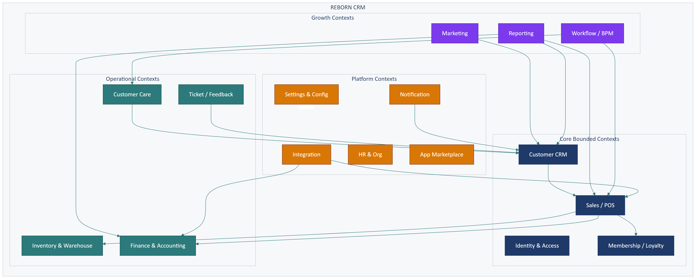
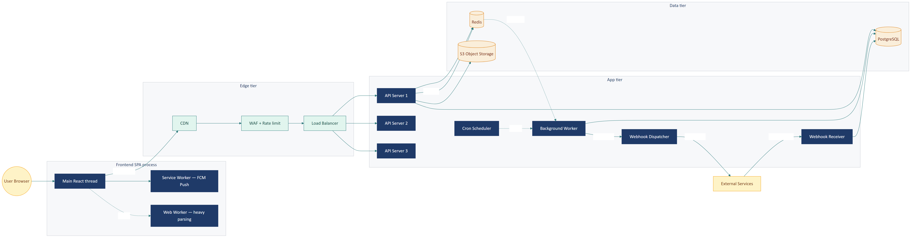
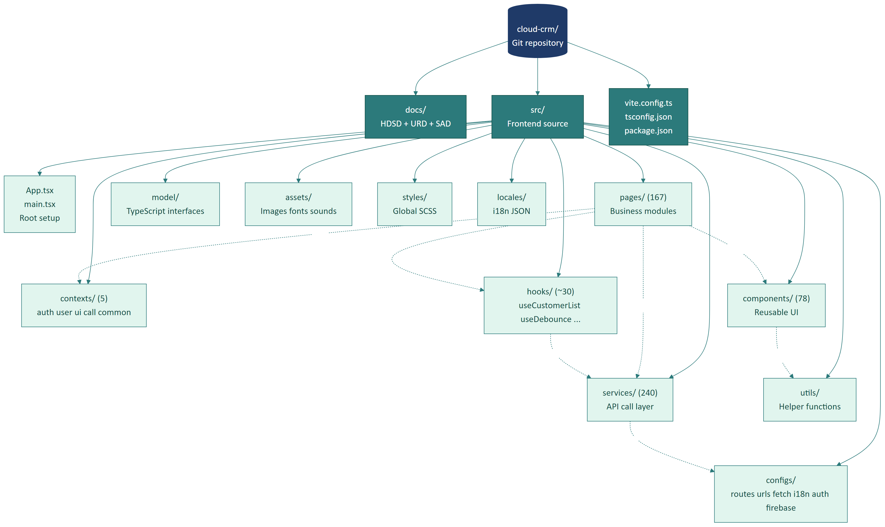
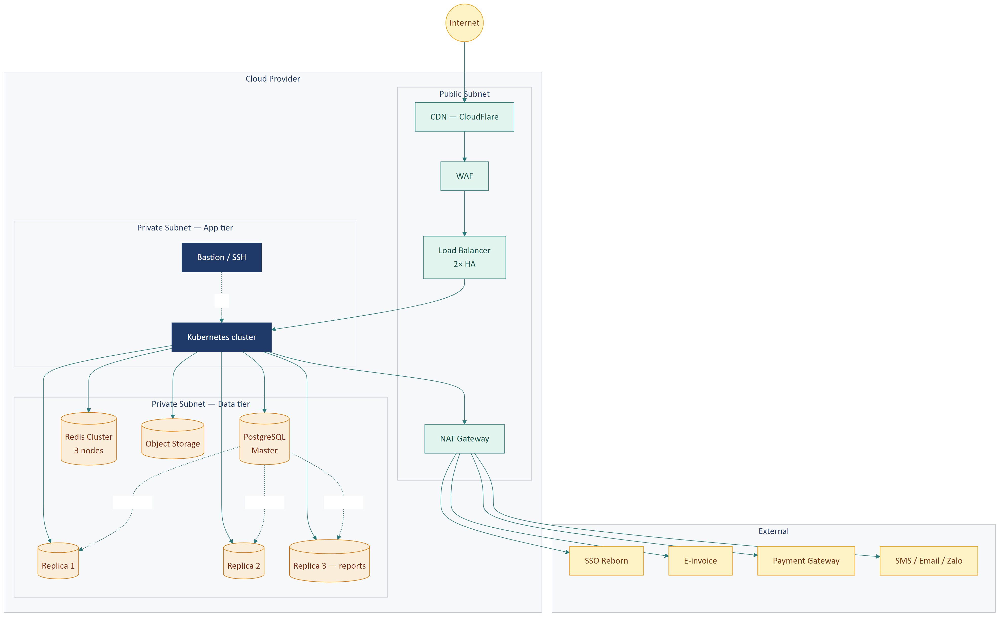
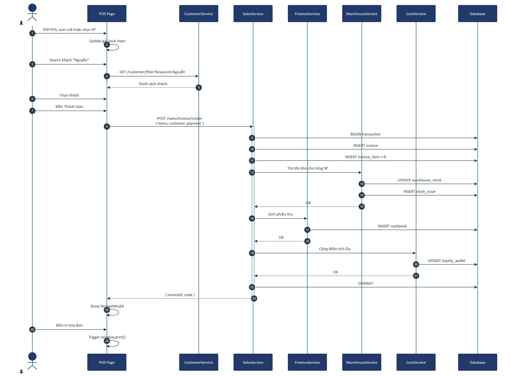
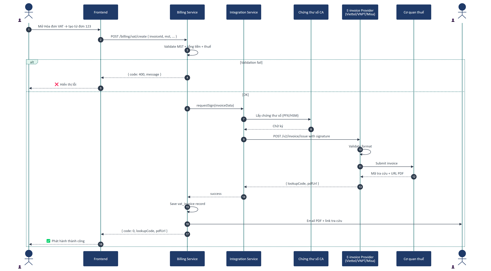

# Part 01 — Kiến trúc tổng thể (4+1 Architectural Views)

## Executive Summary

Reborn CRM được mô tả qua **mô hình 4+1 view của Kruchten**: Logical (cấu trúc module), Process (tương tác runtime), Development (tổ chức source), Physical (deploy), và **+1 Scenario** (use case xuyên suốt). Hệ thống là **multi-tenant SaaS với frontend SPA + backend microservices** giao tiếp qua REST API gateway, cô lập tenant ở mức row-level.

---

## 1. Mô hình 4+1

```
                ┌──────────────────┐
                │   Logical View   │ (cấu trúc tĩnh — module/class)
                └──────────────────┘
                         ▲
                         │
┌──────────────────┐     │     ┌──────────────────┐
│ Development View │◄────┼────►│   Process View   │
│ (cấu trúc code)  │     │     │ (runtime/concur) │
└──────────────────┘     │     └──────────────────┘
                         │
                ┌──────────────────┐
                │   Physical View  │ (deployment/topology)
                └──────────────────┘
                         ▲
                         │
              ┌──────────────────────┐
              │   Scenario (+1)      │ (use case xuyên view)
              └──────────────────────┘
```

Mỗi view phục vụ một bộ stakeholder khác nhau:

| View | Trả lời câu hỏi | Đối tượng |
|------|-----------------|-----------|
| **Logical** | Có những module/component gì? Quan hệ giữa chúng? | Architect, Senior Dev |
| **Process** | Khi chạy thì các process tương tác thế nào? | Tech Lead, DevOps |
| **Development** | Source code tổ chức ra sao? Quy ước? | Developer (mới + cũ) |
| **Physical** | Deploy ở đâu, chạy trên gì, network thế nào? | DevOps, SRE |
| **Scenario** | Một luồng cụ thể chạy qua các view ra sao? | Mọi stakeholder |

---

## 2. Logical View — Kiến trúc logic

### 2.1. Sơ đồ tổng thể logic

Hệ thống được chia thành **các bounded context** theo Domain-Driven Design. Mỗi bounded context là một nhóm chức năng nghiệp vụ độc lập tương đối, có thể trở thành 1 microservice riêng (xem [Part 08](part-08-backend-architecture.md)).



### 2.2. Các bounded context

| Context | Module liên quan trong code | Backend prefix (suy luận) |
|---------|----------------------------|---------------------------|
| **Identity & Access** | `pages/Login`, `contexts/authContext`, `userContext` | `/authenticator` |
| **Customer (CRM Core)** | `pages/CustomerPerson`, `services/CustomerService`, `services/ContactService` | `/api`, `/bizapi/care` |
| **Sales (POS)** | `pages/CounterSales`, `pages/Sell`, `services/InvoiceService`, `services/BoughtProductService`, `services/BoughtServiceService`, `services/BoughtCardService` | `/bizapi/sales` |
| **Membership / Loyalty** | `pages/LoyaltyWallet`, `pages/MembershipClass`, `pages/CommunityHub/Checkin`, `services/CardService`, `services/LoyaltyPointService` | `/bizapi/care` |
| **Inventory & Warehouse** | `pages/ProductImport`, `pages/Sell/SaleInventory`, `services/WarehouseService`, `services/InventoryService` | `/bizapi/inventory`, `/bizapi/warehouse` |
| **Finance** | `pages/Finance`, `pages/CashBook`, `services/CashbookService`, `services/FundService`, `services/DebtService` | `/bizapi/finance` |
| **Marketing** | `pages/CrmCampaign`, `pages/MarketingAutomation`, `pages/Email`, `pages/SMSMarketting`, `pages/ZaloMarketting`, `services/CampaignService`, `services/MarketingAutomationService` | `/bizapi/market` |
| **Customer Care** | `pages/CustomerCarePage`, `pages/CustomerCare`, `pages/CareHistory`, `services/CustomerCareService` | `/bizapi/care` |
| **Ticket / Feedback** | `pages/Ticket`, `pages/FeedbackCustomer`, `services/TicketService` | `/bizapi/cs` |
| **Reporting** | `pages/CommunityHub/Reports`, `pages/JobReport`, `services/ReportService` | `/bizapi/sales` (nhiều endpoint) |
| **Workflow / BPM** | `pages/BPM`, `pages/SettingProcess`, `services/BusinessProcessService` | `/bpmapi` (riêng) |
| **Integration & Webhook** | `pages/IntegratedMonitoring`, `pages/SettingIntegrations`, `services/IntegrationService` | `/bizapi/integration` |
| **Settings & Config** | `pages/Setting*` (~30 trang), `services/Setting*Service` | nhiều prefix tùy module |
| **Notification** | `pages/AppNotifications`, `pages/NotificationList`, `services/NotificationService` | `/bizapi/notification` |
| **HR & Organization** | `pages/SettingOrg`, `pages/User`, `pages/ShiftManagement`, `services/EmployeeService`, `services/RoleService`, `services/ShiftService` | `/api` (đoán) hoặc `/bizapi/hr` |
| **Application Marketplace** | `pages/InstallApplication`, `pages/Extension`, `services/ApplicationService` | `/application` |

### 2.3. Layer phân tầng trong frontend

Mỗi tính năng đi qua các layer theo thứ tự:

```
┌─────────────────────────────────────────────────┐
│  Pages (src/pages/)                             │  ← UI + business logic
│  167 page modules                               │
└────────────────────────┬────────────────────────┘
                         │ uses
┌─────────────────────────────────────────────────┐
│  Components (src/components/)                   │  ← reusable UI
│  78 component folders                           │
└────────────────────────┬────────────────────────┘
                         │ uses
┌─────────────────────────────────────────────────┐
│  Hooks (src/hooks/)                             │  ← logic tái dụng
│  ~30 custom hooks                               │
└────────────────────────┬────────────────────────┘
                         │ uses
┌─────────────────────────────────────────────────┐
│  Contexts (src/contexts/)                       │  ← global state
│  5 contexts: auth, user, ui, call, common       │
└────────────────────────┬────────────────────────┘
                         │ uses
┌─────────────────────────────────────────────────┐
│  Services (src/services/)                       │  ← API call layer
│  240 service files                              │
└────────────────────────┬────────────────────────┘
                         │ uses
┌─────────────────────────────────────────────────┐
│  apiHelper (src/services/apiHelper.ts)          │  ← DRY wrapper for fetch
└────────────────────────┬────────────────────────┘
                         │ wraps
┌─────────────────────────────────────────────────┐
│  fetch + fetch-intercept                        │  ← HTTP layer
│  configs/fetchConfig.ts                         │
└─────────────────────────────────────────────────┘
```

> **Quy ước:** Page **không bao giờ** gọi `fetch()` trực tiếp — luôn qua Service. Service **không bao giờ** ghép URL — luôn lấy từ `urlsApi`. Layer này giúp dễ dàng đổi backend hoặc thêm interceptor mà không phải sửa từng page.

---

## 3. Process View — View runtime/process

### 3.1. Sơ đồ process



### 3.2. Các process chính

#### Frontend (browser-side)

- **Main thread**: React render + event handling
- **Service Worker**: `firebase-messaging-sw.js` — push notification (Firebase Cloud Messaging)
- **Web Worker** (nếu có): xử lý task nặng như parse file Excel, render PDF
- **HTTP requests**: parallel qua fetch, có interceptor

#### Backend (server-side)

> ⚠️ **Mức độ tự tin: Thấp** — phần này được suy luận từ pattern phổ biến.

- **API Server processes**: stateless, scaled horizontally
- **Background workers**: xử lý job dài (gửi mass message, generate report, sync data)
- **Cron scheduler**: chạy job định kỳ (sinh nhật khách, sắp hết hạn gói, đối soát thanh toán)
- **Webhook receiver**: nhận callback từ payment gateway, shipping, e-invoice
- **Webhook dispatcher**: gửi event ra ngoài qua HTTP POST

### 3.3. Communication patterns

| Pattern | Dùng cho | Ví dụ |
|---------|----------|-------|
| **Sync HTTP REST** | Mọi tương tác client ↔ server | Gọi API danh sách khách |
| **Long polling / Server-Sent Events** | Notification real-time | Chuông thông báo trên header |
| **WebSocket** | Call center, chat | Module CallCenter, Chat |
| **Async webhook** | Tích hợp 3rd party | Payment callback, shipping update |
| **Message queue** (suy luận) | Heavy job, retry | Gửi mass SMS, sync e-invoice |

---

## 4. Development View — Tổ chức source code

### 4.1. Cây thư mục chính

```
cloud-crm/
├── docs/                       # Tài liệu
│   ├── userguides/             # HDSD
│   ├── urd/                    # URD
│   └── sa/                     # SAD (this file)
├── public/                     # Static assets
├── src/                        # Frontend source
│   ├── App.tsx                 # Root component
│   ├── main.tsx                # Entry point (Vite)
│   ├── index.html              # HTML template
│   ├── assets/                 # Images, fonts, sounds
│   ├── components/             # Reusable UI components (78)
│   ├── configs/                # App configuration
│   │   ├── routes.tsx          # Sidebar + routes (1179 dòng)
│   │   ├── urls.ts             # API endpoint catalog (3757 dòng)
│   │   ├── fetchConfig.ts      # HTTP interceptor
│   │   ├── authConfig.js       # SSO config
│   │   └── firebaseConfig.js   # FCM config
│   ├── contexts/               # React Context (5)
│   │   ├── authContext.ts
│   │   ├── userContext.ts
│   │   ├── uiContext.ts
│   │   ├── callContext.ts
│   │   └── index.ts
│   ├── exports/                # Excel/PDF export utils
│   ├── hooks/                  # Custom hooks (30+)
│   ├── i18n.ts                 # i18next setup
│   ├── locales/                # Translation files
│   ├── mocks/                  # Mock data (cho dev/demo)
│   ├── model/                  # TypeScript interfaces
│   ├── pages/                  # Page modules (167)
│   ├── services/               # API service files (240)
│   ├── styles/                 # Global SCSS
│   ├── template/               # Email/print templates
│   ├── types/                  # Global type defs
│   ├── utils/                  # Helper functions
│   └── webrtc/                 # SIP/WebRTC (call center)
├── vite.config.ts              # Vite build config
├── tsconfig.json               # TypeScript config
├── package.json                # Dependencies + scripts
└── yarn.lock
```

### 4.2. Quy ước đặt tên

| Loại | Convention | Ví dụ |
|------|------------|-------|
| **Page module** | PascalCase folder | `CustomerPerson/`, `CounterSales/` |
| **Component** | PascalCase folder + `index.tsx` | `Sidebar/sidebar.tsx` |
| **Service** | `<Domain>Service.ts` | `CustomerService.ts`, `InvoiceService.ts` |
| **Hook** | `use<Name>.ts` | `useCustomerList.ts`, `useDebounce.ts` |
| **Context** | `<name>Context.ts` | `userContext.ts`, `authContext.ts` |
| **Model** | `I<Name>RequestModel.ts` / `I<Name>ResponseModel.ts` | `ICustomerRequest`, `IInvoiceResponse` |
| **SCSS** | `.scss` cùng tên file | `Sidebar/sidebar.scss` |
| **Style class** | kebab-case | `.page-shift-tabs`, `.os-banner-icon` |

### 4.3. Phân tích phụ thuộc giữa layer

> Một quy luật vàng: **luồng phụ thuộc đi 1 chiều từ trên xuống dưới** (Page → Component → Hook → Context → Service → apiHelper → fetch). Vi phạm sẽ gây cyclic dependency và khó test.

### 4.4. Sơ đồ phát triển



---

## 5. Physical View — Triển khai vật lý

### 5.1. Sơ đồ deployment tổng quan

> ⚠️ **Mức độ tự tin: Thấp** — sơ đồ dưới là **đề xuất** dựa trên best practice, không phải topology thực tế. Đội DevOps cần xác nhận / bổ sung.



### 5.2. Các tier deploy

| Tier | Thành phần | Số instance đề xuất |
|------|-----------|---------------------|
| **Edge / CDN** | CDN cho static, WAF | 1 (managed service) |
| **Load Balancer** | Nginx / HAProxy / ALB | 2 (HA pair) |
| **API Server** | Container chạy backend stateless | ≥ 3 (auto-scale) |
| **Background Worker** | Container xử lý job dài | ≥ 2 |
| **Database (Master)** | PostgreSQL primary | 1 |
| **Database (Read Replicas)** | PostgreSQL replica | 2-3 (tùy load) |
| **Cache** | Redis cluster | 3 nodes |
| **Object Storage** | S3-compatible | managed |
| **Logging** | ELK / Loki | managed hoặc 3 nodes |
| **Monitoring** | Prometheus + Grafana | managed |

### 5.3. Network topology

> ⚠️ **Phần này hoàn toàn là đề xuất.**

```
Internet
   │
   ▼
[Cloud Provider — Public Subnet]
   │
   ├─ CDN (CloudFlare/CloudFront)
   ├─ WAF
   └─ Load Balancer
   │
   ▼
[Private Subnet — App tier]
   │
   ├─ API Server pods (k8s)
   ├─ Worker pods
   └─ Bastion (SSH access)
   │
   ▼
[Private Subnet — Data tier]
   │
   ├─ PostgreSQL master
   ├─ PostgreSQL replicas
   ├─ Redis cluster
   └─ Backup volume
```

---

## 6. Scenarios (+1) — Use case xuyên view

Để minh họa cách 4 view tương tác, mô tả 3 scenario quan trọng:

### 6.1. Scenario A — Đăng nhập qua SSO

Một nhân viên mở browser, truy cập `https://hub.reborn.vn/crm/`, đăng nhập, được chuyển vào Dashboard.


**Các view tham gia:**

- **Logical**: Identity & Access bounded context, Page `Login`, Context `authContext`
- **Process**: Browser ↔ CRM SPA ↔ SSO server ↔ API server
- **Physical**: Browser → CDN → LB → API → SSO → DB
- **Development**: `pages/Login/`, `contexts/authContext.ts`, `services/EmployeeService.ts`, `configs/authConfig.js`

### 6.2. Scenario B — Bán hàng tại quầy (POS)

Lễ tân tạo đơn cho khách: chọn sản phẩm → chọn khách → áp khuyến mãi → thanh toán → in hóa đơn.



**Các view tham gia:**

- **Logical**: Sales context + Customer context + Marketing (KM) context + Inventory context (trừ tồn) + Finance context (sinh phiếu thu)
- **Process**: Browser fetches sản phẩm → user thao tác → submit → API gateway routes → multiple services + DB transaction → response → in hóa đơn
- **Physical**: Browser → LB → API → 4 services song song → DB → response
- **Development**: `pages/CounterSales/index.tsx`, `services/InvoiceService.ts`, `services/BoughtProductService.ts`, `WarehouseService.ts`, `CashbookService.ts`

### 6.3. Scenario C — Phát hành hóa đơn VAT

Kế toán xuất hóa đơn điện tử cho khách doanh nghiệp.



**Các view tham gia:**

- **Logical**: Billing context + Integration context
- **Process**: SPA → Billing API → Integration service → External CA + E-invoice provider → Tax authority → callback → store
- **Physical**: Cần outbound HTTPS sang nhà cung cấp, cần lưu chứng thư số ở vault
- **Development**: `pages/Sell/InvoiceVat/`, `services/InvoiceVatService.ts`

---

## 7. Bảng truy vết view ↔ Part SAD

| View | Chi tiết ở Part |
|------|-----------------|
| **Logical** | Part 02 (Frontend), Part 05 (Components), Part 08 (Backend) |
| **Process** | Part 06 (Service), Part 09 (Integration), Part 11 (Cross-cutting) |
| **Development** | Part 02 (Frontend), Part 03 (Stack), Part 04 (Routing) |
| **Physical** | Part 12 (Deployment) |
| **Scenario** | Phụ thuộc nội dung — tham chiếu theo từng Part |

---

*Hết Part 01.*
