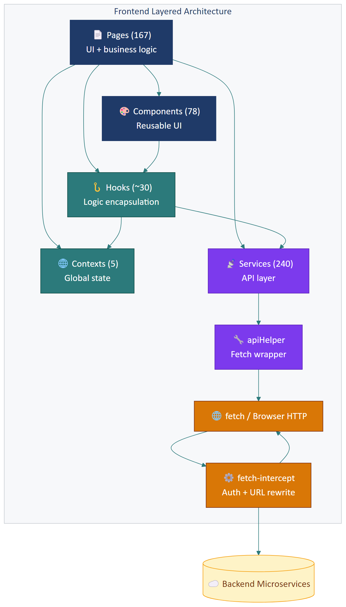

# Part 02 — Frontend Architecture

## Executive Summary

Frontend là **Single Page Application** xây bằng **React 17 + TypeScript 4.5**, build bằng **Vite 8.0** (vừa migrate từ Webpack). Cấu trúc theo **layered pattern** (Pages → Components → Hooks → Contexts → Services → API Helper → fetch). Có **167 page module**, **78 component**, **240 service file**, sử dụng **Context API** (5 contexts) cho global state thay vì Redux. **Lazy load** mọi page qua `React.lazy()`. Routing qua **react-router-dom v6** với cấu hình tập trung trong `configs/routes.tsx` (1179 dòng).

---

## 1. Tech stack chính

| Lớp | Công nghệ | Phiên bản | Vai trò |
|-----|-----------|-----------|---------|
| **Language** | TypeScript | 4.5.4 | Static typing |
| **Framework UI** | React | 17.0.2 | Rendering |
| **Routing** | react-router-dom | 6.x | Client-side routing |
| **Build tool** | Vite | 8.0.7 | Dev server + bundler |
| **Bundler** | Rollup (qua Vite) | — | Production bundle |
| **CSS** | SCSS + global stylesheets | — | Styling |
| **State** | Context API + custom hooks | — | Không dùng Redux |
| **HTTP** | fetch + fetch-intercept | — | API calls |
| **Form** | Custom form pattern + reborn-validation | 1.0.5 | Validation |
| **Date** | moment + date-fns | 2.29 + 4.x | Xử lý ngày giờ |
| **i18n** | react-i18next | 14.x | Đa ngôn ngữ |
| **Notification** | react-toastify | 8.x | Toast |

> Toàn bộ ~120 dependencies xem chi tiết ở [Part 03](part-03-tech-stack.md).

---

## 2. Cấu trúc thư mục `src/`

```
src/
├── App.tsx                  # Root component, setup providers + router
├── main.tsx                 # Vite entry point
├── index.html               # HTML template (Vite injects script)
├── i18n.ts                  # i18next config
├── firebase-config.ts       # FCM client setup
├── firebase-messaging-sw.js # Service worker for FCM
├── serviceWorker.js         # PWA service worker (legacy?)
├── type.d.ts                # Global type declarations
│
├── assets/                  # Static images, fonts, sounds
├── components/              # 78 reusable components
├── configs/                 # 9 config files
├── contexts/                # 5 React contexts
├── exports/                 # Export to Excel/PDF utilities
├── hooks/                   # 30+ custom hooks
├── locales/                 # i18n JSON files
├── mocks/                   # Mock data (community-hub demos)
├── model/                   # 200+ TypeScript interface files
├── pages/                   # 167 page modules
├── services/                # 240 service files
├── styles/                  # Global SCSS + variables
├── template/                # Email/print templates
├── types/                   # Domain type aliases
├── utils/                   # Helper functions
└── webrtc/                  # SIP.js + WebRTC for call center
```

### 2.1. Số lượng từng loại

| Folder | Số lượng | Ghi chú |
|--------|---------|---------|
| `pages/` | **167** modules | Mỗi mục là 1 nghiệp vụ chính |
| `components/` | **78** components | Reusable UI |
| `services/` | **240** services | API call layer |
| `hooks/` | ~30 custom hooks | Logic tái dụng |
| `contexts/` | 5 | Global state |
| `model/` | 200+ interface files | Request/Response shapes |
| `configs/` | 9 | App config |

---

## 3. Layer pattern chi tiết

### 3.1. Page layer (`src/pages/`)

**Trách nhiệm:** Compose UI hoàn chỉnh cho 1 trang nghiệp vụ. Mỗi page là 1 folder gồm `index.tsx` + style + sub-components.

**Quy ước:**
- Mỗi page có `document.title = "..."` ở đầu để set tab browser title
- Page **không** gọi `fetch()` trực tiếp
- Page sử dụng `useContext()` để lấy global state
- Page có thể chia thành nhiều sub-component trong cùng folder (`partials/`)

**Ví dụ cấu trúc 1 page lớn — `CustomerPerson/`:**

```
pages/CustomerPerson/
├── CustomerPersonList.tsx       # Trang chính (3824 dòng)
├── CustomerPersonList.scss
├── partials/                    # Sub-components
│   ├── DetailPerson/
│   ├── AddCustomerPersonModal.tsx
│   ├── AddCustomerCompanyModal.tsx
│   ├── AddBTwoBModal/
│   ├── FilterAdvanceModal/
│   ├── ModalImportCustomer/
│   ├── SplitDataCustomerModal/
│   ├── UpdateCommon.tsx
│   └── ViewOpportunityBTwoB/
├── CustomerSourceAnalysis/
├── ModalAddMA/
└── ModalExportCustomer/
```

**Ví dụ page nhỏ — `CommunityHub/Checkin/`:**

```
pages/CommunityHub/Checkin/
├── index.tsx        # 147 dòng
└── index.scss
```

### 3.2. Component layer (`src/components/`)

**Trách nhiệm:** Cung cấp các UI element tái sử dụng được giữa nhiều page.

**Loại component phổ biến:**

| Nhóm | Ví dụ |
|------|-------|
| **Form controls** | `input/`, `selectCustom/`, `datePicker/`, `numericInput/`, `radioBox/` |
| **Layout** | `sidebar/`, `header/`, `titleAction/`, `breadcrumb/` |
| **Data display** | `table/`, `pagination/`, `card/`, `agGridTable/` |
| **Feedback** | `modal/`, `confirm/`, `loading/`, `tour/` |
| **Specialized** | `icon/`, `avatar/`, `badge/`, `chip/` |

**Quy ước:**
- Component nhận props rõ ràng có TypeScript interface
- Component **không gọi API** trực tiếp (trừ component đặc biệt như `TabMenuList` dùng common API)
- Component **không** đụng vào global context (trừ component layout như Sidebar)

### 3.3. Hooks layer (`src/hooks/`)

**Trách nhiệm:** Đóng gói logic tái sử dụng (data fetching, state, side effect).

**Ví dụ các hook quan sát được:**

| Hook | Mục đích |
|------|---------|
| `useCustomerList` | Load + paginate danh sách khách |
| `useDebounce` | Debounce input |
| `useDashBoard` | Load số liệu Dashboard |
| `useGetDetailInvoice` | Load chi tiết đơn |
| `useGetDetailProduct` | Load chi tiết sản phẩm |
| `useReconciliationList` | Load danh sách đối soát |
| `useOnboarding` | Quản lý tour overlay onboarding |
| `useLA` | Liquidity Analysis (?) |
| `useOmniCXM` | Omni-channel customer experience |
| `useCustomerEnrich` | Bổ sung thông tin khách từ data ngoài |

> **Pattern chuẩn:** Hook trả về `{ data, loading, error, refetch }` để page consume. Tránh để page tự call API + manage loading state.

### 3.4. Context layer (`src/contexts/`)

**Trách nhiệm:** Lưu state toàn cục cho toàn bộ app.

| Context | Loại data | Lý do dùng |
|---------|-----------|------------|
| **userContext** | User hiện tại + dataBranch + permissions + organizationInfo | Mọi page cần info user, tránh prop drilling |
| **authContext** | Token + login state + auth helpers | Toàn bộ app phụ thuộc auth |
| **uiContext** | Sidebar collapsed, theme, modal stack | Cấu hình UI toàn cục |
| **callContext** | Call center session, current call | Module CallCenter chỉ vài page nhưng cần state cross-component |
| **index.ts** | Aggregate / re-export | Convenience |

**Pattern setup ở `App.tsx`:**

```tsx
<AuthContext.Provider value={authState}>
  <UserContext.Provider value={userState}>
    <UIContext.Provider value={uiState}>
      <CallContext.Provider value={callState}>
        <Routes>
          {routes.map(...)}
        </Routes>
      </CallContext.Provider>
    </UIContext.Provider>
  </UserContext.Provider>
</AuthContext.Provider>
```

> **Trade-off:** Context API không tối ưu cho data thay đổi nhiều (mỗi update re-render mọi consumer). Với app này, data trong context tương đối tĩnh (user info, role, ui flags) nên chấp nhận được. Nếu data có throughput cao (vd realtime call state), nên cân nhắc Zustand/Jotai. Xem [ADR-04](part-13-adr.md#adr-04--không-dùng-redux-mà-dùng-context-api).

### 3.5. Service layer (`src/services/`)

**Trách nhiệm:** Đóng gói mọi API call, không có business logic.

**Quy ước cố định:**

```ts
// src/services/CustomerService.ts
import { apiGet, apiPost } from "services/apiHelper";
import { urlsApi } from "configs/urls";
import { ICustomerFilterRequest } from "model/customer/CustomerRequestModel";

export default {
  filter: (params?: ICustomerFilterRequest, signal?: AbortSignal) => {
    return apiGet(urlsApi.customer.filter, params, signal);
  },
  detail: (id: number) => {
    return fetch(`${urlsApi.customer.detail}?id=${id}`, { method: "GET" })
      .then((res) => res.json());
  },
  update: (body: ICustomerRequest) => {
    return apiPost(urlsApi.customer.update, body);
  },
  // ...
};
```

**Nguyên tắc:**
1. **Endpoint URL** luôn lấy từ `urlsApi` (không hardcode)
2. **Request body type** luôn là interface trong `model/`
3. **Response** trả về raw JSON (không transform — page tự xử lý)
4. **Cancellable** qua `AbortSignal` parameter
5. **Service không** ném exception — page tự kiểm tra `response.code === 0`

### 3.6. apiHelper layer (`src/services/apiHelper.ts`)

**Trách nhiệm:** DRY wrapper cho fetch — loại bỏ pattern lặp lại `fetch + JSON.stringify + .then(res => res.json())`.

```ts
// Pseudocode
export const apiGet = (url: string, params?: Record<string, any>, signal?: AbortSignal) => {
  const queryString = convertParamsToString(params);
  return fetch(`${url}${queryString}`, { method: "GET", signal })
    .then((res) => res.json());
};

export const apiPost = (url: string, body: any) => {
  return fetch(url, {
    method: "POST",
    body: JSON.stringify(body),
  }).then((res) => res.json());
};

// Tương tự apiPut, apiDelete...
```

### 3.7. Fetch interceptor (`src/configs/fetchConfig.ts`)

**Trách nhiệm:** Tự động thêm header (Authorization, Selectedrole, Hostname, Content-Type) và rewrite URL theo prefix.

**Logic chính:**

1. **Trước khi gửi request:**
   - Đọc `token` từ cookie → set `Authorization: Bearer <token>`
   - Đọc `SelectedRole` từ localStorage → set header `Selectedrole`
   - Set `Hostname` header (hiện đang **hardcode** `kcn.reborn.vn` cho dev — flag risk!)
   - Set `Content-Type: application/json` (nếu không phải FormData)
   - Rewrite URL prefix:
     - `/bizapi` → `process.env.APP_BIZ_URL + ...`
     - `/api` / `/adminapi` → `process.env.APP_API_URL + ...`
     - Khác → `process.env.APP_AUTHENTICATOR_URL + ...`

2. **Sau khi nhận response:**
   - Nếu `status === 401`:
     - Xóa cookie `user`, `token`
     - Xóa localStorage `permissions`, `user.root`
     - (User sẽ được redirect về login ở lần render tiếp theo)

> ⚠️ **Risk note:** Dòng `config.headers["Hostname"] = "kcn.reborn.vn"` trong [`fetchConfig.ts:42`](../../src/configs/fetchConfig.ts#L42) đang hardcode tenant cho dev. Cần wire lại để lấy từ `location.hostname` trong production. Đây là **bug tiềm ẩn** nếu deploy nhầm.

---

## 4. Build & Bundling

### 4.1. Cấu hình Vite

> Vừa migrate từ Webpack → Vite. Chi tiết quá trình migration ở [ADR-02](part-13-adr.md#adr-02--migrate-từ-webpack-sang-vite).

**File cấu hình:** [`vite.config.ts`](../../vite.config.ts)

**Các điểm quan trọng:**

| Cấu hình | Giá trị | Ý nghĩa |
|----------|---------|---------|
| `base` | `/` | Asset URLs absolute từ root |
| `outDir` | `bundle` | Output folder |
| `entryFileNames` | `crm/js/[name].[hash].js` | Bundle output structure |
| `chunkFileNames` | `crm/js/[name].[hash].js` | Code-split chunks |
| `assetFileNames` | `crm/css/...` / `crm/assets/...` | CSS + assets riêng folder |
| `manualChunks` | `vendor: [react, react-dom]`, `router: [react-router-dom]`, `ui: [emotion, react-toastify, react-select]` | Vendor splitting |
| `minify` | `terser` (production) | Code minification |
| `terserOptions.compress.drop_console` | `true` | Bỏ console.log production |
| `sourcemap` | `true` (dev), `false` (prod) | Debug |

**Dev server:** port 4000, có HMR.

### 4.2. Resolve alias (path mapping)

Vite + tsconfig đều cấu hình alias để import gọn:

```ts
resolve: {
  alias: {
    "@": "src",
    "src": "src",
    "pages": "src/pages",
    "components": "src/components",
    "services": "src/services",
    "configs": "src/configs",
    "contexts": "src/contexts",
    "hooks": "src/hooks",
    "model": "src/model",
    "utils": "src/utils",
    "assets": "src/assets",
    "styles": "src/styles",
    "template": "src/template",
    // ...
  }
}
```

> Cho phép viết `import CustomerService from "services/CustomerService"` thay vì `"../../services/CustomerService"`. Mọi file đều dùng pattern này.

### 4.3. Biến môi trường

- **Vite env**: tiền tố `VITE_*` được expose qua `import.meta.env.VITE_*`
- **Process env**: `process.env.APP_*` được map qua `define` trong vite.config.ts
- **File env**: `.env`, `.env.development`, `.env.production`, `.env.staging`

```ts
define: createProcessEnvDefinitions(env)  // expose APP_API_URL, APP_BIZ_URL, ...
```

> Chi tiết các env var ở [Part 12 — Deployment](part-12-deployment.md).

### 4.4. Output structure

```
bundle/
├── index.html              # HTML chính
└── crm/
    ├── js/
    │   ├── index.<hash>.js     # Entry bundle
    │   ├── vendor.<hash>.js    # React vendor chunk
    │   ├── router.<hash>.js
    │   ├── ui.<hash>.js
    │   └── <PageName>.<hash>.js  # Lazy-loaded page chunks
    ├── css/
    │   └── index.<hash>.css
    └── assets/
        ├── images...
        ├── fonts...
        └── sounds/...
```

> Nginx config phải có fallback `try_files $uri $uri/ /index.html` để SPA routing hoạt động khi user refresh trang sâu.

---

## 5. Module dependency graph



---

## 6. Anti-patterns cần tránh

Quan sát quá codebase, đây là một số pattern **không tốt** cần xử lý dần:

| Anti-pattern | Vị trí ví dụ | Cải thiện |
|--------------|--------------|-----------|
| **Page > 3000 dòng** | `CustomerPersonList.tsx` (3824 dòng) | Tách thành nhiều container/sub-component |
| **Hardcode hostname** | `fetchConfig.ts:42` | Đọc từ env hoặc location.hostname |
| **Service vừa fetch raw vừa qua apiHelper** | `CustomerService.detail` | Dùng nhất quán apiHelper |
| **Comment-out import** | `routes.tsx:933 // CreateOrderSales` | Xóa hẳn nếu không dùng |
| **Mock data trộn vào production** | `mocks/community-hub/*` | Tách mock vào storybook hoặc dev-only |
| **Locale trộn trong bundle** | `locales/*.json` | Có thể lazy load khi đổi ngôn ngữ |
| **CSS conflict tiềm ẩn** | Global SCSS với class name dài giống nhau | Migrate dần sang CSS modules / styled-components |

> Đây là **technical debt list ngắn** — chi tiết ở [Part 14 — Risks](part-14-quality-risks.md).

---

## 7. Performance considerations

### 7.1. Lazy loading pages

Mọi page đều dùng `React.lazy()`:

```ts
const CustomerPersonList = React.lazy(() => import("pages/CustomerPerson/CustomerPersonList"));
```

→ Mỗi page tạo 1 chunk JS riêng, chỉ tải khi user vào URL đó.

### 7.2. Vendor splitting

Vite config có `manualChunks` tách `vendor`, `router`, `ui` ra chunk riêng → lần đầu tải chậm nhưng các lần sau cache hit cao.

### 7.3. Image optimization

- Static assets dùng tên có hash → cache vĩnh viễn
- Ảnh khách hàng upload lưu trên S3 → cấu hình CloudFront/CDN
- Webp/AVIF chưa có (could improve)

### 7.4. ag-grid cho danh sách lớn

Các page có bảng > 100 dòng dùng **ag-grid** thay vì HTML table — virtual scrolling, không re-render mọi cell. Xem [ADR-08](part-13-adr.md#adr-08--ag-grid-cho-bảng-lớn).

### 7.5. Debounce search

Mọi ô tìm kiếm dùng `useDebounce` 300ms để giảm số call API.

---

## 8. Test strategy frontend

> ⚠️ **Mức độ tự tin: Trung bình** — không thấy file test trong repo này. Phần dưới là **đề xuất** dựa trên best practice.

| Loại test | Tool đề xuất | Phạm vi |
|-----------|--------------|---------|
| **Unit** | Vitest | utils, hooks, services |
| **Component** | React Testing Library | Components đơn lẻ |
| **Integration** | RTL + MSW (mock API) | Pages với data fetching |
| **E2E** | Playwright (đã có cho HDSD!) | Critical user flows |
| **Visual regression** | Percy / Chromatic | Pixel-level |

> Hiện tại đã có **Playwright setup trong `docs/userguides/tooling/`** dùng cho việc capture screenshot HDSD. Có thể tái sử dụng infrastructure này cho E2E test thật.

---

*Hết Part 02.*
