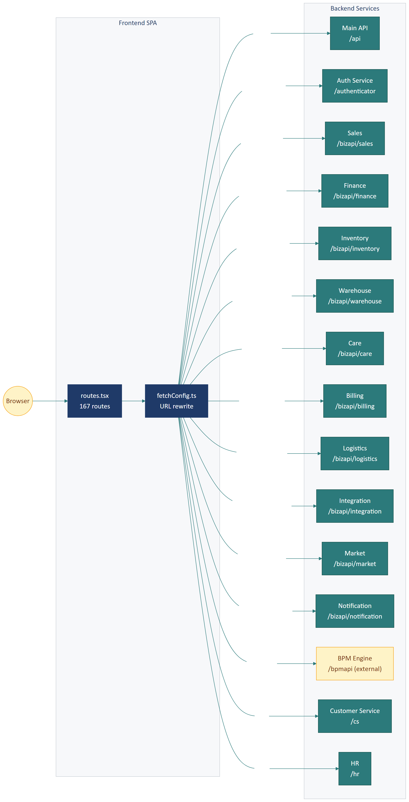

# Part 04 — Routing & Navigation

## Executive Summary

Routing dùng **react-router-dom v6** với cấu hình tập trung trong [`src/configs/routes.tsx`](../../src/configs/routes.tsx) (1179 dòng). Có **167 route**, mỗi page được **lazy load** qua `React.lazy()`. **Sidebar menu** cũng được định nghĩa trong cùng file dưới dạng object tree. Hệ thống hỗ trợ **biến thể tenant** — sidebar có thể khác nhau giữa các dòng sản phẩm (vd biến thể *Cửa hàng / Spa* với prefix `ch_*` so với biến thể CRM B2B truyền thống).

---

## 1. Tổng quan kiến trúc routing

### 1.1. File chính

[`src/configs/routes.tsx`](../../src/configs/routes.tsx) chứa **2 export**:

```ts
// 1) Sidebar menu config (tree)
export const menu = [
  {
    title: "dashboard",
    path: urls.dashboard,
    icon: <Icon name="DashboardMenu" />,
    code: "DASHBOARD",
  },
  {
    title: "chReception",
    path: urls.create_sale_add,
    icon: <Icon name="CounterMenu" />,
    children: [
      { title: "createSalesOrder", path: urls.create_sale_add, ... },
      { title: "chCheckin", path: "/ch_checkin", ... },
      // ...
    ],
  },
  // ... 12 mục lớn
];

// 2) Route table (flat array)
export const routes = [
  { path: urls.dashboard, component: <Dashboard /> },
  { path: "/ch_checkin", component: <CHCheckinPage /> },
  // ... 167 routes
];
```

### 1.2. Nguyên tắc

- **Tách menu khỏi route table**: menu dùng cho sidebar (có icon, children, code), route table dùng cho react-router. Một path có thể xuất hiện ở route table nhưng không xuất hiện ở menu (deep link, modal page).
- **Lazy load mọi page**: dùng `React.lazy(() => import("..."))`
- **URL constants**: mọi path đều lấy từ [`src/configs/urls.ts`](../../src/configs/urls.ts) thay vì hardcode
- **Permission code**: mỗi mục menu có `code` (vd `CUSTOMER`, `SALE_INVOICE`) để khớp với quyền RBAC

---

## 2. Cấu trúc menu sidebar

### 2.1. Hierarchy mặc định (biến thể Cửa hàng & Spa — Community Hub)

Menu hiện tại có **12 nhóm chính** với prefix `ch*`:

```
1. Tổng quan (dashboard)
2. Lễ tân (chReception)
   ├─ Bán hàng tại quầy (createSalesOrder → /create_sale_add)
   ├─ Check-in / Cửa vào (chCheckin → /ch_checkin)
   ├─ Trừ quota dịch vụ (chDeductQuota → /ch_services)
   └─ Quản lý ca làm việc (shiftManagement → /shift_management)
3. Thành viên (customer)
   ├─ Danh sách thành viên (customerList → /customer_list)
   └─ Cài đặt thành viên (settingCustomer → /setting_customer)
4. Giao dịch (chOrders)
   ├─ Hóa đơn bán hàng (salesInvoice → /sale_invoice)
   └─ Hóa đơn VAT (invoiceVAT → /invoiceVAT)
5. Lưu trú (chAccommodation → /ch_accommodation)
6. Tài chính & Thanh toán (financeManagement)
   ├─ Tổng quan (financeDashboard → /finance_management/dashboard)
   ├─ Sổ thu chi (financeCashbook → /finance_management/cashbook)
   ├─ Quản lý quỹ (fundManagement → /finance_management/fund_management)
   ├─ Khoản mục (categoryManagement → /finance_management/category_management)
   ├─ Công nợ (debtManagement → /finance_management/debt_management)
   └─ Đối soát thanh toán (paymentControl → /payment_control)
7. Đối tác (chPartners → /ch_partners)
8. Phản hồi (chFeedback → /ch_feedback)
9. Báo cáo (chReports)
   ├─ Doanh thu (chReportRevenue → /ch_report_revenue)
   ├─ Thành viên (chReportMembers → /ch_report_members)
   ├─ Check-in (chReportCheckin → /ch_report_checkin)
   ├─ Dịch vụ (chReportServices → /ch_report_services)
   ├─ Đối tác (chReportPartners → /ch_report_partners)
   └─ Tài chính (chReportFinance → /ch_report_finance)
10. Marketing (Tiếp thị & Chăm sóc)
    ├─ Khuyến mãi & Voucher (promotionalProgram → /promotional_program)
    ├─ Tích điểm hội viên (loyaltyPoints → /member_list)
    ├─ Chiến dịch marketing (marketingCampaign → /marketing_campaign)
    └─ Chăm sóc thành viên (customerCare → /customer_care_page)
11. Kho & Nguyên vật liệu (warehouse)
    ├─ NVL (managementMaterial → /material)
    ├─ Nhà cung cấp (supplierList → /supplier_list)
    ├─ Danh sách kho (warehouseList → /warehouse)
    ├─ Quản lý kho (warehouseManagement → /inventory)
    ├─ Kiểm kê (warehouseChecking → /inventory_checking)
    └─ Báo cáo kho (reportWarhouse → /report_warehouse)
12. Cài đặt (settings)
    ├─ Cấu hình toàn cục (chTenantConfig → /ch_tenant_config)
    ├─ Danh mục dịch vụ (chServiceCatalogSetting → /setting_sell)
    ├─ Gói thành viên (chMembershipPlans → /ch_membership_plans)
    ├─ Vận hành cơ sở (settingBasis → /setting_basis)
    ├─ Tổ chức & phân quyền (settingOrg → /setting_org)
    ├─ Kênh liên lạc (multiChannelCommunication → /setting_channels)
    ├─ Tích hợp (settingIntegrations → /setting_integrations)
    ├─ Tài khoản & bảo mật (settingPersonal → /setting_account)
    └─ Hỗ trợ thành viên (settingTicket → /setting_ticket)
```

### 2.2. Biến thể tenant

> **Quan sát quan trọng:** Codebase chứa **nhiều biến thể** menu khác nhau cho các loại tenant khác nhau. Ngoài Community Hub (CH), còn thấy các route khác cho biến thể B2B/B2C truyền thống (campaign, opportunity, sales pipeline, contact, project...).

Cấu trúc menu **chỉ kích hoạt theo gói SaaS** mà tenant đang thuê. Ví dụ:

| Biến thể | Menu prefix điển hình | Đối tượng |
|----------|----------------------|-----------|
| **Community Hub** (đang phân tích) | `ch*`, `chReception`, `chOrders`, `chPartners` | Spa, gym, co-working, homestay |
| **B2B Sales** | `campaign`, `opportunity`, `pipeline`, `contact` | Doanh nghiệp B2B |
| **Retail** | `pos`, `inventory`, `barcode` | Cửa hàng bán lẻ |
| **Field Service** | `dispatch`, `route`, `field_management` | Công ty dịch vụ tại nhà |

> **Cơ chế switch biến thể:** Frontend tự đọc cấu hình từ backend (qua API như `getTenantConfig` hoặc gói SaaS) và chỉ render menu items mà tenant này được phép thấy. Code logic chính nằm trong [`src/components/sidebar/sidebar.tsx`](../../src/components/sidebar/sidebar.tsx).

---

## 3. Route table

### 3.1. Pattern 1 route entry

```tsx
{
  path: urls.dashboard,           // "/dashboard"
  component: <Dashboard />,       // lazy-loaded React.lazy()
}
```

### 3.2. Lazy loading

```tsx
const CustomerPersonList = React.lazy(() => import("pages/CustomerPerson/CustomerPersonList"));
const Dashboard = React.lazy(() => import("pages/Dashboard"));
const CounterSales = React.lazy(() => import("pages/CounterSales"));
// ... 167 dòng tương tự
```

→ Mỗi import tạo 1 chunk JS riêng.

### 3.3. Sub-routes (nested routing)

Một số page lớn có **nested routing** trong chính nó (vd `pages/Finance/` có Dashboard / Cashbook / Fund / Category / Debt / Payment Control). Pattern phổ biến:

```tsx
// pages/Finance/index.tsx
<Routes>
  <Route path="/dashboard" element={<FinanceDashboard />} />
  <Route path="/cashbook" element={<Cashbook />} />
  <Route path="/fund_management" element={<FundManagement />} />
  // ...
</Routes>
```

Hoặc dùng tab pattern (như `ShiftTabsPage` ở Part 02 HDSD):

```tsx
const [tab, setTab] = useState<TabKey>("preopen");

return (
  <div>
    <ul className="menu-list">
      <li onClick={() => setTab("preopen")}>Chưa vào ca</li>
      <li onClick={() => setTab("open")}>Vào ca</li>
      // ...
    </ul>
    <div className="tab-body">
      {tab === "preopen" && <NotOpenShiftTab />}
      {tab === "open" && <OpenShiftTab />}
      // ...
    </div>
  </div>
);
```

### 3.4. Dynamic route params

Các route có ID động dùng cú pháp react-router v6:

```
/detail_person/customerId/:customerId
/detail_person/customerId/:customerId/:tab
/detail_invoice/:invoiceId
/edit_marketing_automation/:id
```

Page đọc params qua `useParams()` hoặc helper `getSearchParameters()` từ `reborn-util`.

---

## 4. Sidebar component

### 4.1. File

[`src/components/sidebar/sidebar.tsx`](../../src/components/sidebar/sidebar.tsx)

### 4.2. Logic chính

```tsx
import { menu } from "configs/routes";
import { Navigation } from "./Navigation";

export default function Sidebar() {
  const { permissions } = useContext(UserContext);
  const filteredMenu = filterMenuByPermission(menu, permissions);
  
  return (
    <div className="sidebar">
      <CustomScrollbar>
        <Navigation menuItemList={filteredMenu} />
      </CustomScrollbar>
    </div>
  );
}
```

### 4.3. Nguyên tắc lọc menu

1. Lấy menu config gốc
2. Với mỗi item, kiểm tra `code` có nằm trong `permissions` của user không
3. Với group có `children`, recursive filter các children — group bị ẩn nếu không có child nào còn lại
4. Render bằng `Navigation` component (custom) hỗ trợ collapsed state, active highlight, hover dropdown

### 4.4. State sidebar

| State | Lưu ở | Mục đích |
|-------|-------|----------|
| **Collapsed/Expanded** | UIContext | Toggle khi user bấm `«` / `»` |
| **Active item** | useLocation() | Tự highlight theo URL hiện tại |
| **Open groups** | localStorage | Nhớ những nhóm user đã mở |

---

## 5. Routing trong App.tsx

```tsx
// App.tsx (giản lược)
import { Routes, Route } from "react-router-dom";
import { routes } from "./configs/routes";
import LayoutPage from "pages/layout";
import Login from "./pages/Login/index";

function App() {
  // ...auth setup, contexts, fetch interceptor...
  
  return (
    <Routes>
      <Route path="/login" element={<Login />} />
      <Route path="/*" element={
        <LayoutPage>
          <Routes>
            {routes.map(({ path, component }) => (
              <Route key={path} path={path} element={
                <Suspense fallback={<Loading />}>
                  {component}
                </Suspense>
              } />
            ))}
          </Routes>
        </LayoutPage>
      } />
    </Routes>
  );
}
```

> **Suspense** wrap mỗi route để hiển thị loading khi chunk JS đang tải. Layout chung chứa Sidebar + Header.

---

## 6. URL constants (`src/configs/urls.ts`)

File này chứa **2 nhóm**:

### 6.1. Frontend URLs

```ts
const urls = {
  dashboard: "/dashboard",
  customer: "/customer",
  customer_list: "/customer_list",
  create_sale_add: "/create_sale_add",
  shift_management: "/shift_management",
  // ... ~200 URL
};
```

### 6.2. Backend API URLs

```ts
export const urlsApi = {
  customer: {
    filter: prefixApi + "/customer/filter",
    detail: prefixApi + "/customer/detail",
    update: prefixApi + "/customer/update",
    delete: prefixApi + "/customer/delete",
    // ...
  },
  invoice: {
    create: prefixSales + "/invoice/create",
    filter: prefixSales + "/invoice/filter",
    cancel: prefixSales + "/invoice/cancel",
    // ...
  },
  shift: {
    open: prefixSales + "/shift/open",
    close: prefixSales + "/shift/close",
    // ...
  },
  // ... hàng nghìn endpoint
};
```

> File này có **3757 dòng** — là single source of truth cho mọi URL backend. Service files chỉ reference vào `urlsApi.<domain>.<method>`, không bao giờ ghép URL trực tiếp.

### 6.3. Prefix routing

```ts
const prefixApi = "/api";              // Main API
const prefixAdmin = "/adminapi";       // Admin API
const prefixBiz = "/bizapi";           // Business APIs (root)
const prefixSales = prefixBiz + "/sales";       // Sales microservice
const prefixFinance = prefixBiz + "/finance";   // Finance microservice
const prefixInventory = prefixBiz + "/inventory";
const prefixWarehouse = prefixBiz + "/warehouse";
const prefixCare = prefixBiz + "/care";          // Customer Care
const prefixBilling = prefixBiz + "/billing";    // E-invoice
const prefixLogistics = prefixBiz + "/logistics";
const prefixIntegration = prefixBiz + "/integration";
const prefixMarket = prefixBiz + "/market";      // Marketing
const prefixNotification = prefixBiz + "/notification";
const prefixCs = "/cs";                          // Customer service / Ticket
const prefixHr = "/hr";                          // HR
const prefixSystem = "/system";
const prefixApplication = "/application";
const prefixBpm = process.env.APP_BPM_URL + "/bpmapi";  // BPM (external service)
const prefixAuthenticator = "/authenticator";    // Auth/SSO
```

> **Backend là microservices** — mỗi prefix tương ứng 1 service riêng. Frontend routes traffic đến đúng service qua interceptor (xem [Part 06](part-06-service-api.md)).

---

## 7. Sơ đồ routing



---

## 8. Edge cases

### 8.1. Public routes (không cần auth)

Các route public thường có URL chứa `/public/`. Fetch interceptor không thêm `Authorization` header:

```ts
const isPublic = url.includes("/public/");
if (token && !isPublic) {
  config.headers["Authorization"] = `Bearer ${token}`;
}
```

### 8.2. 404 handling

```tsx
const Page404 = React.lazy(() => import("pages/404"));
// ...
{ path: "*", component: <Page404 /> }
```

### 8.3. Redirect sau login

Khi login thành công, redirect về URL ban đầu user yêu cầu (lưu trong query param `redirect_uri`):

```
http://localhost:8080/?redirect_uri=http://localhost:4000/crm/login
```

Sau khi xác thực, SSO redirect ngược về `/crm/login`, frontend đọc query param và navigate đến URL gốc.

### 8.4. Deep link

Một số page có thể được mở từ link bên ngoài (email notification, SMS với link):

```
https://hub.reborn.vn/crm/detail_invoice/12345
```

Frontend phải:
1. Check auth → nếu chưa login, redirect tới SSO với `redirect_uri` chứa URL này
2. Sau auth, restore URL gốc

---

## 9. Permission gating

Mỗi route lý tưởng nên có guard kiểm tra quyền truy cập:

```tsx
function PrivateRoute({ requiredPermission, children }) {
  const { permissions } = useContext(UserContext);
  if (!permissions.includes(requiredPermission)) {
    return <Page403 />;
  }
  return children;
}

// Sử dụng
<Route path="/customer_list" element={
  <PrivateRoute requiredPermission="CUSTOMER">
    <CustomerPersonList />
  </PrivateRoute>
} />
```

> ⚠️ **Quan sát hiện tại:** Codebase **chưa có** explicit `PrivateRoute` wrapper cho mọi route. Phân quyền chủ yếu dựa vào việc **ẩn menu item** trong sidebar. Người dùng có thể type URL trực tiếp để bypass — đây là **security gap nhỏ**, cần fix bằng cách thêm permission check ở mỗi page hoặc middle layout.

---

## 10. Best practice & quy ước

| Quy tắc | Lý do |
|---------|-------|
| Mọi page mới **phải** lazy load qua `React.lazy()` | Giảm bundle initial |
| Mọi URL **phải** lấy từ `urls` / `urlsApi` | Tránh hardcode, dễ maintain |
| Mọi menu item **phải** có `code` permission | Để phân quyền hoạt động |
| Page test mở deep link **phải** không bị blank | Đảm bảo SSR-safe |
| Sub-routes trong page phức tạp **nên** dùng tab thay vì nested Routes | Đơn giản hơn |
| **Không** dùng `<a href>` cho nội bộ | Dùng `<Link to>` của react-router |

---

*Hết Part 04.*
