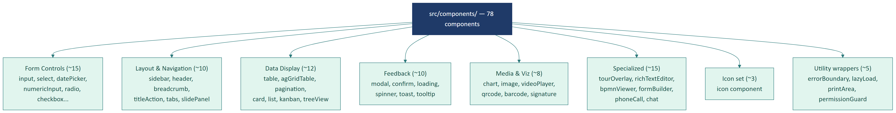

# Part 05 — Component & Module Architecture

## Executive Summary

Frontend Reborn CRM tổ chức theo **layered architecture** với 78 component tái sử dụng + 167 page module + 30+ custom hooks + 5 React Context. Pattern chính: **Page = Container** (gọi service, quản lý local state), **Component = Presentational** (nhận props, không biết về API), **Hook = Logic encapsulation** (tái dụng giữa các page), **Context = Global state** (auth, user, ui).

---

## 1. Phân loại component

### 1.1. Sơ đồ phân loại 78 component



### 1.2. Bảng phân loại

| Nhóm | Số component | Ví dụ |
|------|:------------:|-------|
| **Form Controls** | ~15 | `input/`, `selectCustom/`, `datePicker/`, `numericInput/`, `radioBox/`, `checkbox/`, `textarea/`, `slider/`, `colorPicker/`, `fileUpload/` |
| **Layout & Navigation** | ~10 | `sidebar/`, `header/`, `breadcrumb/`, `titleAction/`, `tabs/`, `slidePanel/` |
| **Data Display** | ~12 | `table/`, `agGridTable/`, `pagination/`, `card/`, `list/`, `kanbanBpm/`, `treeView/`, `timeline/`, `avatar/`, `badge/`, `chip/`, `statistic/` |
| **Feedback** | ~10 | `modal/`, `confirm/`, `loading/`, `spinner/`, `progressBar/`, `toast/`, `tooltip/`, `alert/`, `empty/`, `skeleton/` |
| **Media & Visualization** | ~8 | `chart/`, `image/`, `videoPlayer/`, `audioPlayer/`, `qrcode/`, `barcode/`, `map/`, `signature/` |
| **Specialized** | ~15 | `tourOverlay/`, `richTextEditor/`, `bpmnViewer/`, `formBuilder/`, `phoneCall/`, `chat/`, `comment/`, `attachment/` |
| **Icon set** | ~3 | `icon/` (1 component, render hàng trăm icon name) |
| **Utility wrappers** | ~5 | `errorBoundary/`, `lazyLoad/`, `printArea/`, `permissionGuard/` |

---

## 2. Pattern: Container vs Presentational

### 2.1. Container component (Page)

**Trách nhiệm:**
- Gọi service để lấy data
- Quản lý state (loading, error, data)
- Xử lý event business
- Truyền data + callbacks xuống presentational components

**Ví dụ:**

```tsx
// pages/CustomerPerson/CustomerPersonList.tsx
function CustomerPersonList() {
  const [customers, setCustomers] = useState([]);
  const [loading, setLoading] = useState(false);
  const [filter, setFilter] = useState({});
  
  useEffect(() => {
    setLoading(true);
    CustomerService.filter(filter)
      .then(res => setCustomers(res.result.items))
      .finally(() => setLoading(false));
  }, [filter]);

  return (
    <Layout>
      <FilterBar value={filter} onChange={setFilter} />
      <Loading active={loading}>
        <Table data={customers} columns={columns} />
      </Loading>
    </Layout>
  );
}
```

### 2.2. Presentational component (Component)

**Trách nhiệm:**
- Nhận props
- Render UI
- Gọi callback prop khi user tương tác
- **Không biết** về API, không gọi context, không có business logic

**Ví dụ:**

```tsx
// components/table/Table.tsx
interface TableProps {
  data: any[];
  columns: ColumnDef[];
  onRowClick?: (row: any) => void;
}

export default function Table({ data, columns, onRowClick }: TableProps) {
  return (
    <table>
      <thead>{/* render columns */}</thead>
      <tbody>
        {data.map((row, i) => (
          <tr key={i} onClick={() => onRowClick?.(row)}>
            {columns.map(col => <td key={col.key}>{row[col.key]}</td>)}
          </tr>
        ))}
      </tbody>
    </table>
  );
}
```

### 2.3. Khi nào break rule

Một số presentational component **được phép** truy cập context vì lý do practical:

- **Sidebar, Header**: cần `UserContext` để biết user đang login
- **PermissionGuard**: cần `UserContext.permissions`
- **TabMenuList**: tự load data từ API common (không qua page)

---

## 3. Custom hooks pattern

### 3.1. Mục đích

- **DRY**: Logic load data dùng ở nhiều page → đóng gói thành hook
- **Separation of concerns**: Page chỉ render UI, hook lo logic
- **Testable**: Hook test độc lập với UI

### 3.2. Anatomy của 1 hook

```ts
// hooks/useCustomerList.ts
export function useCustomerList(initialFilter: ICustomerFilterRequest) {
  const [data, setData] = useState({ items: [], total: 0 });
  const [loading, setLoading] = useState(false);
  const [error, setError] = useState<Error | null>(null);
  const [filter, setFilter] = useState(initialFilter);

  const refetch = useCallback(async () => {
    setLoading(true);
    setError(null);
    try {
      const res = await CustomerService.filter(filter);
      if (res.code === 0) {
        setData(res.result);
      } else {
        setError(new Error(res.message));
      }
    } catch (e) {
      setError(e as Error);
    } finally {
      setLoading(false);
    }
  }, [filter]);

  useEffect(() => { refetch(); }, [refetch]);

  return { data, loading, error, filter, setFilter, refetch };
}

// Sử dụng trong page:
const { data, loading, filter, setFilter, refetch } = useCustomerList({ branchId });
```

### 3.3. Bảng hook quan sát được

| Hook | File | Phạm vi sử dụng |
|------|------|-----------------|
| `useCustomerList` | `hooks/useCustomerList.ts` | Mọi page list khách |
| `useCustomerEnrich` | `hooks/useCustomerEnrich.ts` | Bổ sung thông tin khách |
| `useDashBoard` | `hooks/useDashBoard.ts` | Dashboard page |
| `useDebounce` | `hooks/useDebounce.ts` | Mọi ô search có debounce |
| `useGetDetailInvoice` | `hooks/useGetDetailInvoice.ts` | Detail invoice modal |
| `useGetDetailProduct` | `hooks/useGetDetailProduct.ts` | Detail product modal |
| `useLA` | `hooks/useLA.ts` | Liquidity Analysis |
| `useOmniCXM` | `hooks/useOmniCXM.ts` | Omni-channel customer experience |
| `useOnboarding` | `hooks/useOnboarding.ts` | Tour overlay first-time user |
| `useReconciliationList` | `hooks/useReconciliationList.ts` | Đối soát thanh toán |
| ... | | |

---

## 4. Context API: Global State

### 4.1. Sơ đồ context tree

```
<AuthProvider>           ← contexts/authContext.ts
  <UserProvider>         ← contexts/userContext.ts
    <UIProvider>         ← contexts/uiContext.ts
      <CallProvider>     ← contexts/callContext.ts
        <App />
      </CallProvider>
    </UIProvider>
  </UserProvider>
</AuthProvider>
```

### 4.2. Chi tiết từng context

#### authContext

```ts
interface AuthContextType {
  isAuthenticated: boolean;
  token: string | null;
  login: (credentials) => Promise<void>;
  logout: () => void;
  refreshToken: () => Promise<void>;
}
```

- **Khi nào set:** Sau khi user login thành công, sau khi refresh token
- **Persist:** Token lưu vào cookie (đọc lại khi reload)
- **Side effect:** Khi logout, xóa cookie + localStorage + redirect login

#### userContext

```ts
interface UserContextType {
  id: number | null;
  name: string;
  avatar: string;
  email: string;
  phone: string;
  role: string;
  permissions: string[];           // ['CUSTOMER', 'INVOICE', 'SHIFT_OPEN', ...]
  dataBranch: { value: number, label: string } | null;  // cơ sở đang chọn
  organizationInfo: any;            // tenant info
  setDataBranch: (branch) => void;
  // ...
}
```

> **Đây là context được consume nhiều nhất** — gần như mọi page lấy `dataBranch.value` để filter dữ liệu theo cơ sở.

#### uiContext

```ts
interface UIContextType {
  sidebarCollapsed: boolean;
  setSidebarCollapsed: (v: boolean) => void;
  theme: 'light' | 'dark';
  setTheme: (t: string) => void;
  modalStack: ModalDescriptor[];
  pushModal: (m: ModalDescriptor) => void;
  popModal: () => void;
}
```

#### callContext

```ts
interface CallContextType {
  currentCall: ActiveCall | null;
  startCall: (phone: string) => void;
  endCall: () => void;
  callHistory: CallRecord[];
  isInCall: boolean;
}
```

> Riêng biệt khỏi `userContext` vì call state cập nhật liên tục (mỗi giây) — tránh re-render toàn bộ app.

### 4.3. Pattern truy cập context

```tsx
import { useContext } from "react";
import { UserContext, ContextType } from "contexts/userContext";

function MyPage() {
  const { dataBranch, permissions, name } = useContext(UserContext) as ContextType;
  // ...
}
```

> **Cast type** cần thiết vì `createContext()` mặc định trả về `T | undefined`. Pattern `as ContextType` được dùng nhất quán trong codebase.

---

## 5. Module dependencies — Ai gọi ai?

### 5.1. Quy tắc 1 chiều

```
                ┌─────────┐
                │  Pages  │
                └────┬────┘
                     │ uses
              ┌──────┴──────┐
              ▼             ▼
     ┌──────────────┐  ┌──────────┐
     │  Components  │  │  Hooks   │
     └──────┬───────┘  └─────┬────┘
            │                │
            └────┬───────────┘
                 ▼
          ┌────────────┐
          │  Contexts  │
          └─────┬──────┘
                │
                ▼
          ┌────────────┐
          │  Services  │
          └─────┬──────┘
                │
                ▼
          ┌────────────┐
          │ apiHelper  │
          └─────┬──────┘
                │
                ▼
          ┌────────────┐
          │   fetch    │
          └────────────┘
```

> Vi phạm chiều này = code smell. Ví dụ: Service không được gọi Component, Component không được gọi Page.

### 5.2. Cross-cutting modules

Một số module được phép cross-cutting (mọi nơi đều gọi):

| Module | Phạm vi |
|--------|---------|
| `utils/common.ts` | Mọi nơi (helper format, parse, helper chung) |
| `configs/urls.ts` | Mọi service |
| `model/*` | Mọi service + page (vì là TypeScript interface, không có runtime) |
| `i18n.ts` (`useTranslation`) | Mọi component có text |
| `react-toastify` (`showToast`) | Mọi page (qua wrapper `utils/common`) |

---

## 6. Page module patterns

### 6.1. Pattern A — Single-file page

Page nhỏ, ≤ 500 dòng, không có sub-component đáng kể:

```
pages/Dashboard/
├── index.tsx
└── index.scss
```

### 6.2. Pattern B — Multi-file page với partials

Page vừa, có vài sub-component dùng riêng:

```
pages/CustomerCarePage/
├── index.tsx                    # Container
├── index.scss
└── partials/
    ├── CareList.tsx
    ├── CareDetailModal.tsx
    └── CareFilterBar.tsx
```

### 6.3. Pattern C — Mega page

Page lớn, có nhiều tab, modal, sub-pages:

```
pages/CustomerPerson/
├── CustomerPersonList.tsx       # Main page (3824 dòng ❗)
├── CustomerPersonList.scss
├── partials/
│   ├── DetailPerson/            # Tab chi tiết
│   ├── AddCustomerPersonModal.tsx
│   ├── AddCustomerCompanyModal.tsx
│   ├── FilterAdvanceModal/
│   ├── ModalImportCustomer/
│   └── ... (10+ sub-components)
├── CustomerSourceAnalysis/      # Sub-page riêng
├── ModalAddMA/
└── ModalExportCustomer/
```

> **Anti-pattern:** Pattern C với main file > 1000 dòng. Cần refactor — xem [Part 14 — Risks](part-14-quality-risks.md).

### 6.4. Pattern D — Page với nội dung tabs (multi-screen trong 1 URL)

```
pages/ShiftManagement/
├── ShiftTabsPage.tsx            # Chứa tab switcher
├── ShiftTabsPage.scss
└── partials/
    ├── NotOpenShift/NotOpenShiftTab.tsx
    ├── OpenShift/OpenShiftTab.tsx
    ├── OnShift/OnShiftTab.tsx
    ├── OrdersInShift/OrdersInShiftTab.tsx
    ├── CloseShift/CloseShiftTab.tsx
    ├── ReportShift/ReportShiftTab.tsx
    └── ReportOverview/OverviewTab.tsx
```

> Page này có **7 tabs** trong cùng 1 URL `/shift_management`. Tab state trong local React state, không phản ánh vào URL (nhược điểm: F5 mất tab).

---

## 6. Component dependency graph (ví dụ)

Khi một page render, cây component có thể như sau (ví dụ POS):

```
<CounterSales>                                          ← Page
├── <Topbar>                                           ← Component
│   ├── <TabSwitcher>
│   ├── <SearchBar> ◄── useDebounce ◄── (hook)
│   └── <BranchSwitcher> ◄── UserContext ◄── (context)
├── <ProductGrid>                                       ← Component
│   ├── <CategoryFilter>
│   ├── <ProductCard /> × N
│   └── <PaginationLite>
├── <Cart>                                              ← Component
│   ├── <CartCustomer> ◄── CustomerService.search ◄── (service)
│   ├── <CartItem /> × N
│   ├── <PromotionBox>
│   └── <CartTotal>
└── <Modals>                                            ← Components
    ├── <PayModal>
    ├── <ReceiptModal>
    ├── <QuickAddModal>
    ├── <CustomerModal>
    ├── <PromotionModal>
    └── <VariantModal>
```

---

## 7. Reusability metrics

Để biết component có thật sự "reusable" hay không, đo:

| Metric | Ngưỡng "tốt" | Phương pháp đo |
|--------|--------------|----------------|
| **Số nơi import** | ≥ 3 | grep `import .* from "components/<name>"` |
| **Số props** | ≤ 10 | Đếm trong interface |
| **Số dependency context** | 0 (lý tưởng) | Xem `useContext` trong code |
| **Tuổi code không bị sửa** | càng cũ càng tốt | git log |

> **Audit suggestion**: Chạy script đếm số nơi import từng component. Component < 3 nơi → cân nhắc inline lại vào page nó được dùng.

---

## 8. Testing component (đề xuất)

> ⚠️ **Mức độ tự tin: Thấp** — chưa có test trong repo.

| Loại component | Test gì |
|----------------|--------|
| **Form control** | Render → fill → onChange callback fired |
| **Modal** | Mở → đóng → callback `onClose` |
| **Table** | Render N rows, sort, pagination |
| **Page** | Mock service → assert UI render đúng data |
| **Hook** | renderHook + assert state updates |

Tool: **Vitest** (vì đã dùng Vite) + **React Testing Library** + **MSW** (mock API).

---

*Hết Part 05.*
