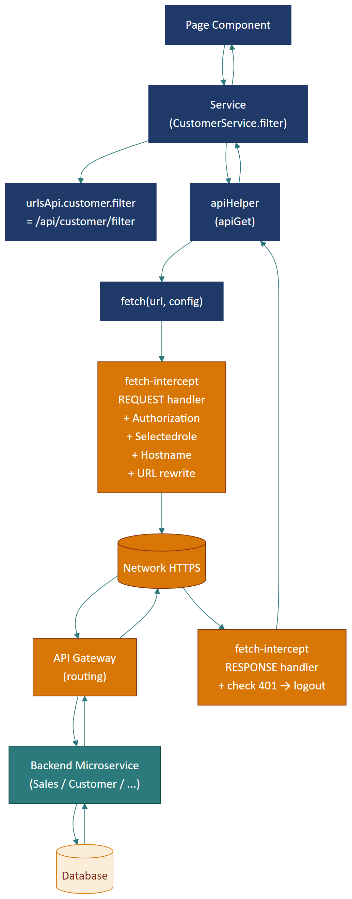
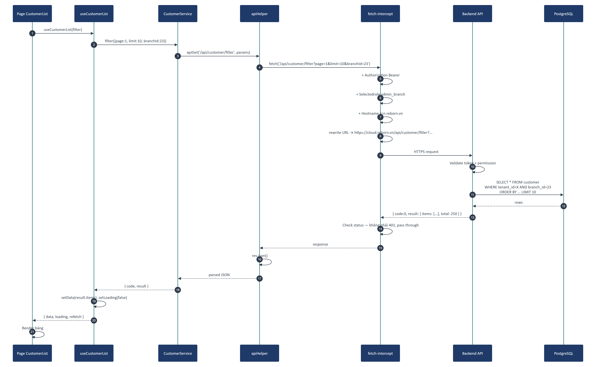

# Part 06 — Service Layer & API Contract

## Executive Summary

Frontend có **240 service files** trong `src/services/`, mỗi file đóng gói các API call cho 1 domain. Tất cả service đều dùng **`apiHelper` wrapper** trên `fetch`, lấy URL từ **`urlsApi` catalog** (3757 dòng), và đi qua **fetch interceptor** để tự động thêm `Authorization: Bearer`, `Selectedrole`, `Hostname`, và route URL theo prefix sang đúng microservice. **API contract**: REST + JSON, response dạng `{ code, result, message }`, `code === 0` = success.

---

## 1. Tổng quan service layer

### 1.1. Sơ đồ luồng request



### 1.2. Các bước khi page gọi 1 API

1. **Page** import service: `import CustomerService from "services/CustomerService"`
2. **Page** gọi method: `CustomerService.filter({ branchId: 23 })`
3. **Service** lookup URL: `urlsApi.customer.filter` → `"/api/customer/filter"`
4. **Service** gọi `apiGet(url, params)` từ `apiHelper`
5. **apiHelper** tạo `fetch(url + queryString)`
6. **fetch-intercept** middleware:
   - Đọc cookie `token` → set `Authorization: Bearer <token>`
   - Đọc localStorage `SelectedRole` → set header `Selectedrole`
   - Set `Hostname` header (định danh tenant)
   - Rewrite URL: `/api/...` → `https://cloud.reborn.vn/api/...`
7. **Browser** gửi HTTP request đến API gateway
8. **API gateway** routes đến đúng microservice (Sales/Finance/Inventory/...)
9. **Microservice** xử lý → trả JSON về
10. **fetch-intercept** check status code: nếu 401 → clear cookie, redirect login
11. **apiHelper** parse JSON → trả về service caller
12. **Service** trả về Promise<response> cho page
13. **Page** check `response.code === 0` → render hoặc show error

---

## 2. apiHelper (`src/services/apiHelper.ts`)

### 2.1. Mục đích

DRY wrapper cho fetch, eliminates lặp lại `fetch + JSON.stringify + .then(res => res.json())` ở 240 service file.

### 2.2. API

```ts
// GET request
apiGet(url: string, params?: Record<string, any>, signal?: AbortSignal): Promise<any>

// POST request (JSON body)
apiPost(url: string, body: any): Promise<any>

// PUT request
apiPut(url: string, body: any): Promise<any>

// DELETE request
apiDelete(url: string, params?: Record<string, any>): Promise<any>
```

### 2.3. Implementation pattern

```ts
// (giản lược)
import { convertParamsToString } from "reborn-util";

export const apiGet = (url, params, signal) => {
  const queryString = params ? convertParamsToString(params) : "";
  return fetch(`${url}${queryString ? "?" + queryString : ""}`, {
    method: "GET",
    signal,
  }).then(res => res.json());
};

export const apiPost = (url, body) => {
  return fetch(url, {
    method: "POST",
    body: JSON.stringify(body),
  }).then(res => res.json());
};
```

> **Note:** `apiHelper` **không tự** thêm header `Content-Type` hay `Authorization` — đó là việc của `fetch-intercept`. Mỗi layer có 1 trách nhiệm rõ ràng.

### 2.4. Cancellation

Một số service hỗ trợ cancel request qua `AbortSignal`:

```ts
filter: (params, signal?: AbortSignal) => apiGet(urlsApi.customer.filter, params, signal)

// Page sử dụng:
useEffect(() => {
  const controller = new AbortController();
  CustomerService.filter(params, controller.signal).then(...);
  return () => controller.abort();  // Cancel khi unmount
}, [params]);
```

---

## 3. Fetch interceptor (`src/configs/fetchConfig.ts`)

### 3.1. Mục đích

Xử lý các **cross-cutting concerns** ở mức HTTP: authentication, multi-tenant, URL rewrite, 401 handling.

### 3.2. Sơ đồ flow

```
   ┌──────────────────────────────────────────────┐
   │   fetch(url, config)                         │
   └──────────────────┬───────────────────────────┘
                      │
                      ▼
   ┌──────────────────────────────────────────────┐
   │   fetch-intercept REQUEST handler            │
   │                                              │
   │   if (token && !isPublic):                   │
   │      headers.Authorization = Bearer <token>  │
   │                                              │
   │   if (selectedRole && !isPublic):            │
   │      headers.Selectedrole = <role>           │
   │                                              │
   │   headers.Hostname = "kcn.reborn.vn"         │
   │   headers["Content-Type"] = application/json │
   │                                              │
   │   if (url.startsWith("/bizapi")):            │
   │      url = APP_BIZ_URL + url.replace(...)    │
   │   else if (url.startsWith("/api")):          │
   │      url = APP_API_URL + url                 │
   │   else:                                       │
   │      url = APP_AUTHENTICATOR_URL + url       │
   └──────────────────┬───────────────────────────┘
                      │
                      ▼
                  [Network]
                      │
                      ▼
   ┌──────────────────────────────────────────────┐
   │   fetch-intercept RESPONSE handler           │
   │                                              │
   │   if (status === 401):                       │
   │      removeCookie("token", "user")           │
   │      localStorage.removeItem("permissions")  │
   │      // → user redirect to login next render │
   │                                              │
   │   return response                            │
   └──────────────────────────────────────────────┘
```

### 3.3. Headers chuẩn

| Header | Nguồn | Mục đích |
|--------|-------|----------|
| `Authorization: Bearer <token>` | Cookie `token` | Xác thực user |
| `Selectedrole: <role>` | localStorage `SelectedRole` | Multi-role support |
| `Hostname: <tenant.domain>` | Hardcode `kcn.reborn.vn` (⚠️) | Multi-tenant routing |
| `Content-Type: application/json` | Mặc định | Body type |
| `Accept: application/json` | Mặc định | Response type |

> ⚠️ **Critical bug:** [`fetchConfig.ts:42`](../../src/configs/fetchConfig.ts#L42) hardcode `Hostname = "kcn.reborn.vn"` — đây là dev override. Nếu đẩy lên production mà chưa wire lại để đọc từ `location.hostname`, **mọi tenant sẽ load data của tenant kcn**.

### 3.4. URL rewriting

```ts
const prefixAdmin = "/adminapi";
const prefixApi = "/api";
const prefixBiz = "/bizapi";

// /bizapi/sales/invoice/create
//   → process.env.APP_BIZ_URL + "/sales/invoice/create"
//   → https://biz.reborn.vn/sales/invoice/create

// /api/customer/filter
//   → process.env.APP_API_URL + "/api/customer/filter"
//   → https://cloud.reborn.vn/api/customer/filter

// /authenticator/oauth/token
//   → process.env.APP_AUTHENTICATOR_URL + "/authenticator/oauth/token"
//   → https://sso.reborn.vn/authenticator/oauth/token
```

> Đây là **API Gateway pattern thực hiện ở client-side** (thay vì có 1 nginx/Kong gateway centralize). Trade-off: đơn giản, không cần thêm hop, nhưng client phải biết đầy đủ URL của mọi service. Xem [ADR-06](part-13-adr.md#adr-06--client-side-api-gateway).

---

## 4. URL catalog (`src/configs/urls.ts`)

### 4.1. Cấu trúc

File 3757 dòng, là **single source of truth** cho mọi endpoint backend.

```ts
export const urlsApi = {
  customer: {
    filter: prefixApi + "/customer/filter",
    detail: prefixApi + "/customer/detail",
    update: prefixApi + "/customer/update",
    delete: prefixApi + "/customer/delete",
    listshared: prefixApi + "/customer/listshared",
    viewPhone: prefixApi + "/customer/viewPhone",
    viewEmail: prefixApi + "/customer/viewEmail",
    serviceSuggestionsv2: prefixApi + "/customer/serviceSuggestionsv2",
    // ... ~50 endpoint cho customer
  },
  invoice: {
    create: prefixSales + "/invoice/create",
    filter: prefixSales + "/invoice/filter",
    cancel: prefixSales + "/invoice/cancel",
    refund: prefixSales + "/invoice/refund",
    detail: prefixSales + "/invoice/detail",
    tabCounts: prefixSales + "/invoice/tabCounts",
    // ...
  },
  shift: {
    open: prefixSales + "/shift/open",
    close: prefixSales + "/shift/close",
    current: prefixSales + "/shift/current",
    list: prefixSales + "/shift/list",
    // ...
  },
  // ... ~50 domain
};
```

### 4.2. Lợi ích

- **Đổi prefix** chỉ ở 1 nơi (ví dụ migrate từ `/sales` sang `/sale-v2`)
- **Tìm kiếm dễ**: grep `urlsApi.customer.filter` để biết endpoint nào dùng
- **Type-safe**: TypeScript autocomplete

### 4.3. Best practice

| Quy tắc | Lý do |
|---------|-------|
| **Mọi service** lấy URL từ `urlsApi.<domain>.<method>` | Tránh hardcode |
| **Tên method** trùng với tên action (filter/detail/create/update/delete) | Dễ guess |
| **Phân nhóm theo domain**, không theo HTTP verb | Đọc dễ hơn |
| **Không** ghép URL trong service (`urlsApi.customer.detail + "?id=..."`) | Dùng query string param qua apiHelper |

---

## 5. Convention cho service file

### 5.1. Anatomy chuẩn

```ts
// src/services/InvoiceService.ts
import { apiGet, apiPost, apiDelete } from "services/apiHelper";
import { urlsApi } from "configs/urls";
import {
  IInvoiceCreateRequest,
  IInvoiceFilterRequest,
  IInvoiceCancelRequest,
} from "model/invoice/InvoiceRequestModel";

export default {
  // Read
  filter: (params?: IInvoiceFilterRequest, signal?: AbortSignal) => {
    return apiGet(urlsApi.invoice.filter, params, signal);
  },
  detail: (id: number) => {
    return apiGet(urlsApi.invoice.detail, { id });
  },
  tabCounts: (params: { branchId: number }) => {
    return apiGet(urlsApi.invoice.tabCounts, params);
  },
  
  // Write
  create: (body: IInvoiceCreateRequest) => {
    return apiPost(urlsApi.invoice.create, body);
  },
  cancel: (body: IInvoiceCancelRequest) => {
    return apiPost(urlsApi.invoice.cancel, body);
  },
  refund: (id: number, body: IRefundRequest) => {
    return apiPost(`${urlsApi.invoice.refund}?id=${id}`, body);
  },
  delete: (id: number) => {
    return apiDelete(`${urlsApi.invoice.delete}?id=${id}`);
  },
};
```

### 5.2. Quy ước

| Quy ước | Áp dụng | Ví dụ |
|---------|---------|-------|
| **Default export** | Mọi service file | `export default { filter, detail, ... }` |
| **Method tên ngắn** | filter / detail / create / update / delete | `CustomerService.filter()` |
| **Param luôn là object** | Cho pagination, filter, body | `{ page, limit, keyword, branchId }` |
| **Return raw response** | Không transform | Page tự check `response.code === 0` |
| **Không** ném exception | Trả về `{ code, message }` | Page handle error qua `code` |
| **Có signal cho list call** | Cho cancel khi unmount | `filter(params, signal)` |

---

## 6. Response format chuẩn

### 6.1. Success response

```json
{
  "code": 0,
  "message": "OK",
  "result": {
    "items": [
      { "id": 1, "name": "..." },
      { "id": 2, "name": "..." }
    ],
    "total": 250,
    "page": 1,
    "limit": 10,
    "loadMoreAble": true
  }
}
```

### 6.2. Error response

```json
{
  "code": 400,
  "message": "Số điện thoại đã tồn tại",
  "error": "DUPLICATE_PHONE",
  "result": null
}
```

### 6.3. Quy ước code

| `code` | Ý nghĩa |
|--------|---------|
| `0` | Success |
| `400` | Validation error / Bad request / Quyền không đủ |
| `401` | Chưa xác thực (interceptor xử lý → logout) |
| `403` | Forbidden |
| `404` | Not found |
| `500` | Server error |

> **Pattern check ở page:**
>
> ```ts
> const res = await CustomerService.filter(params);
> if (res.code === 0) {
>   setData(res.result.items);
> } else {
>   showToast(res.error || res.message || "Có lỗi xảy ra", "error");
> }
> ```

### 6.4. Pagination format

```ts
interface PaginatedResponse<T> {
  code: 0;
  result: {
    items: T[];
    total: number;
    page: number;
    limit: number;
    loadMoreAble: boolean;  // Có còn page tiếp không
  };
}
```

> **Quy ước page bắt đầu từ 1**, không phải 0.

---

## 7. Mapping service → backend microservice (suy luận)

> 🟡 **Mức độ tự tin: Trung bình** — suy từ URL prefix trong `urlsApi`.

| Domain (Service) | Prefix | Microservice (suy luận) |
|------------------|--------|-------------------------|
| Customer, Contact | `/api` | Main API service |
| Invoice (sale), Shift, BoughtProduct, BoughtService, BoughtCard | `/bizapi/sales` | Sales Service |
| Cashbook, Fund, Debt, FinanceCategory, PaymentControl | `/bizapi/finance` | Finance Service |
| Material, NCC | `/bizapi/inventory` | Inventory Service |
| Warehouse, StockReceipt, StockIssue, InventoryChecking | `/bizapi/warehouse` | Warehouse Service |
| CustomerCare, CareHistory, Ticket | `/bizapi/care` + `/cs` | Care Service + CS Service |
| InvoiceVAT | `/bizapi/billing` | Billing Service |
| Shipping, Logistics | `/bizapi/logistics` | Logistics Service |
| Integration, Webhook | `/bizapi/integration` | Integration Service |
| Campaign, Promotion, MarketingAutomation | `/bizapi/market` | Marketing Service |
| Notification, AppNotification | `/bizapi/notification` | Notification Service |
| Auth, OAuth, RefreshToken | `/authenticator` | Auth Service (SSO) |
| BPM, BusinessProcess, Form | `/bpmapi` (external) | BPM Service (Camunda) |
| User, Role, Permission, Department | `/api` (đoán) hoặc `/bizapi/hr` | HR Service |
| ApplicationService, Extension | `/application` | Application Marketplace |
| File upload | external `process.env.APP_UPLOAD_URL` | Upload Service |
| Analytics | external `process.env.APP_ATHENA_URL` | Athena Analytics |

---

## 8. Sequence — Cuộc gọi API tiêu biểu

### 8.1. GET danh sách khách



### 8.2. POST tạo đơn (POS)

```
Page CounterSales      Service Invoice    apiHelper       Interceptor      Backend Sales
      │                       │              │                │                │
      │ create(body)          │              │                │                │
      ├──────────────────────►│              │                │                │
      │                       │ apiPost(url, body)            │                │
      │                       ├─────────────►│                │                │
      │                       │              │ fetch(url)     │                │
      │                       │              ├───────────────►│                │
      │                       │              │                │ + Auth header  │
      │                       │              │                │ + Selectedrole │
      │                       │              │                │ + Hostname     │
      │                       │              │                │ + URL rewrite  │
      │                       │              │                ├───────────────►│
      │                       │              │                │                │ Validate
      │                       │              │                │                │ Save DB
      │                       │              │                │                │ Trừ kho
      │                       │              │                │                │ Sinh phiếu thu
      │                       │              │                │ {code:0, result}
      │                       │              │                │◄───────────────┤
      │                       │              │ JSON parse     │                │
      │                       │              │◄───────────────┤                │
      │                       │ Promise<res> │                │                │
      │                       │◄─────────────┤                │                │
      │ res.code === 0?       │              │                │                │
      │ setInvoiceId(...)     │              │                │                │
      │ openReceiptModal()    │              │                │                │
```

---

## 9. Error handling chuẩn

### 9.1. Network error

```ts
try {
  const res = await CustomerService.filter(params);
  // ...
} catch (e) {
  // Network error, không có response
  showToast("Lỗi kết nối mạng. Vui lòng thử lại.", "error");
}
```

### 9.2. Business error (code !== 0)

```ts
const res = await CustomerService.update(body);
if (res.code === 0) {
  showToast("Cập nhật thành công", "success");
} else if (res.code === 400) {
  showToast(res.error || res.message || "Dữ liệu không hợp lệ", "error");
} else {
  showToast("Có lỗi xảy ra. Vui lòng thử lại sau.", "error");
}
```

### 9.3. Auth error (401)

Tự động xử lý ở interceptor — không cần code ở page. User sẽ được redirect về login ở next render.

### 9.4. Permission error (403)

```ts
if (res.code === 400 && res.message?.includes("không có quyền")) {
  showToast("Bạn không có quyền thực hiện thao tác này", "error");
}
```

> ⚠️ **Anti-pattern:** Một số service đang check 403 bằng `code === 400` + parse message. Nên có code error rõ ràng (vd `code === 403`) thay vì parse text.

---

## 10. Public API (cho 3rd party tích hợp)

> ⚠️ **Mức độ tự tin: Trung bình** — không có public API documentation chính thức trong repo.

Frontend dùng các URL chứa `/public/` để gọi API không cần auth (vd public lookup, share link). Backend có thể có **public API surface** cho 3rd party tích hợp:

- **Endpoint pattern:** `/public/api/v1/...`
- **Auth:** API Key header thay vì Bearer token
- **Rate limit:** chặt hơn endpoint nội bộ
- **Versioning:** trong URL path

> Đề xuất: Tách riêng OpenAPI spec cho public API và publish thành portal (Swagger UI / Redoc) cho đối tác tích hợp.

---

## 11. API versioning strategy

> ⚠️ **Quan sát:** Frontend dùng URL không có version (vd `/api/customer/filter`, không phải `/api/v1/customer/filter`). Đây là **single-version implicit**.

**Hậu quả:**
- Backend đổi response format → break frontend ngay
- Không có gradual rollout

**Đề xuất:**
- Áp dụng URL versioning: `/api/v1/...`, `/api/v2/...`
- Khi đổi shape, deprecate v1 dần
- Frontend dùng env var để switch version

Xem [ADR-15](part-13-adr.md#adr-15--api-versioning).

---

## 12. Best practice service layer

| Quy tắc | Lý do |
|---------|-------|
| **Page không gọi `fetch()` trực tiếp** | Tránh duplicate logic + bypass interceptor |
| **Service không hardcode URL** | Đổi backend dễ, dùng `urlsApi` |
| **Không transform response trong service** | Service "trong suốt", page tự xử lý |
| **Cancellable cho list call** | Tránh race condition khi user gõ search nhanh |
| **Error message bằng tiếng Việt** từ backend | UX nhất quán |
| **Tránh gọi service trong useEffect không dependency** | Vô hạn loop |
| **Wrap service trong custom hook** nếu dùng > 2 nơi | Tái dụng |

---

*Hết Part 06.*
