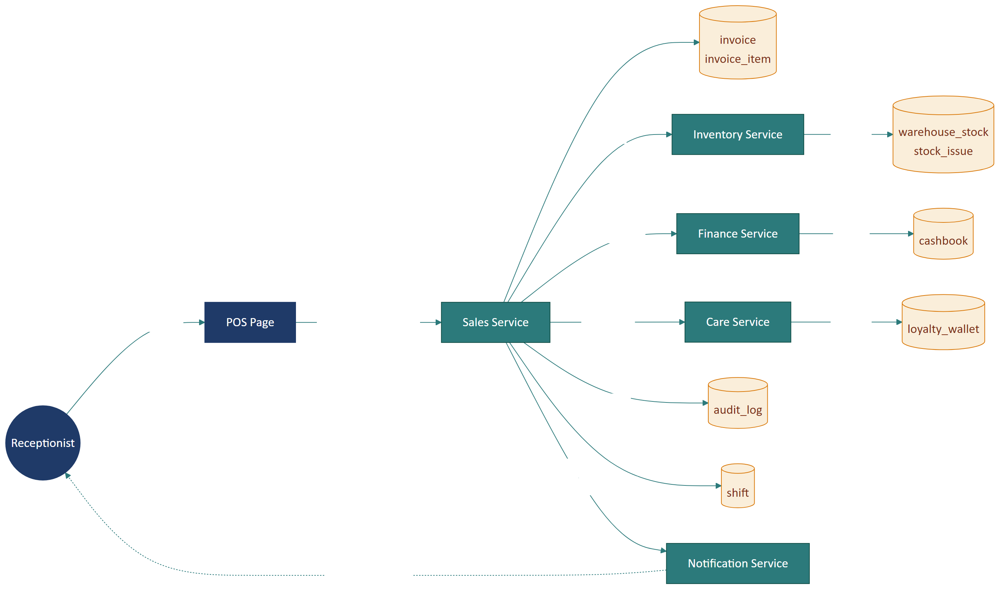

# Part 07 — Data Architecture

## Executive Summary

Mô hình dữ liệu Reborn CRM là **multi-tenant với row-level isolation** — mọi entity có cột `tenantId` + `branchId`. Cấu trúc đa tầng phân cấp: `Tenant → Branch → (Shift, Customer, Invoice, Warehouse, ...)`. Áp dụng **soft delete** cho hầu hết entity nghiệp vụ. **Audit trail** ghi mọi thay đổi quan trọng. Dữ liệu chính lưu **PostgreSQL** (suy luận), file/ảnh lưu **S3-compatible**, cache + queue dùng **Redis**.

---

## 1. Mô hình ERD chi tiết

> Tái sử dụng ERD đã làm cho URD Part 14, mở rộng thêm các entity quan trọng.


### 1.1. Phân nhóm entity

| Nhóm | Entity chính | Phân hệ |
|------|-------------|---------|
| **Tenancy & Org** | Tenant, Branch, Department, Role, Permission, User | Identity & Org |
| **Customer** | Customer, CustomerExtraInfo, Card, LoyaltyWallet, CheckinLog, CustomerSource, CustomerGroup | CRM Core |
| **Catalog** | Category, Product, ProductVariant, MembershipPlan, PlanService, Combo | Catalog |
| **Sales** | Invoice, InvoiceItem, BoughtProduct, BoughtService, BoughtCard, ReturnInvoice, Shift, ShiftConfig, OrderRequest | Sales |
| **Inventory** | Material, Supplier, Warehouse, StockReceipt, StockIssue, InventoryChecking, AdjustmentSlip, DestroySlip | Warehouse |
| **Finance** | Cashbook, Fund, FinanceCategory, DebtCustomer, DebtSupplier, PaymentControl | Finance |
| **Marketing** | Promotion, Voucher, Campaign, CampaignDelivery, MarketingAutomation, Coupon | Marketing |
| **Care & Support** | Feedback, Ticket, CareTask, CareHistory, Note | Care |
| **Workflow** | BusinessProcess, BpmForm, FormArtifact, ProcessInstance | BPM |
| **Integration** | Webhook, IntegrationConfig, ExternalToken | Integration |

### 1.2. Số lượng entity ước tính

- **Tổng**: ~120-150 entity (suy từ `model/` directory + service file count)
- **Top 10 entity quan trọng nhất**: Customer, Invoice, Product, Shift, Material, Cashbook, MembershipPlan, Promotion, User, Branch

---

## 2. Multi-tenant strategy

### 2.1. Lựa chọn mô hình

Có 4 mô hình multi-tenant phổ biến:

| Mô hình | Mô tả | Ưu | Nhược |
|---------|-------|----|-------|
| **Database per tenant** | Mỗi tenant 1 DB riêng | Cô lập tuyệt đối, scale dễ | Tốn tài nguyên, phức tạp ops |
| **Schema per tenant** | Mỗi tenant 1 schema trong cùng DB | Cô lập tốt, chia sẻ tài nguyên | Số schema giới hạn |
| **Row-level (shared schema)** | Mọi tenant chung table, phân biệt qua `tenantId` | Đơn giản, scale tốt | Dễ leak nếu code lỗi |
| **Hybrid** | Tenant lớn dùng DB riêng, tenant nhỏ shared | Linh hoạt | Ops phức tạp |

> 🟡 **Suy luận:** Reborn CRM dùng **Row-level isolation** vì:
>
> - Mọi response/request đều có `branchId`/`tenantId`
> - Header `Hostname` để định danh tenant ở mức request
> - Có hàng nghìn tenant → nếu mỗi tenant 1 DB sẽ không scale

### 2.2. Cơ chế cô lập

```sql
-- Mọi query phải có WHERE tenant_id = :current_tenant_id
SELECT * FROM customer 
WHERE tenant_id = $1 
  AND branch_id = $2 
  AND deleted_at IS NULL;
```

> ⚠️ **Critical risk:** Nếu **một query nào đó** quên `WHERE tenant_id`, tenant A có thể đọc data tenant B. Đây là **lỗi bảo mật nghiêm trọng**. Backend phải có middleware/ORM-level enforcement.

### 2.3. Đề xuất chống leak

| Pattern | Mô tả |
|---------|-------|
| **Row Level Security (RLS)** | PostgreSQL native — mỗi connection set `SET app.current_tenant = ...`, query tự inject WHERE |
| **ORM scope global** | Override default scope của ORM (vd Sequelize `defaultScope`, Hibernate `@Filter`) |
| **Code review checklist** | Mọi query mới phải có review tenant_id |
| **Test tenant isolation** | E2E test với 2 tenant, đảm bảo không thấy data của nhau |

---

## 3. Soft delete

### 3.1. Áp dụng cho

Hầu hết entity nghiệp vụ:

- Customer
- Invoice (CN-03: đơn đã thanh toán không thể xóa)
- Product, Material
- User (nghỉ việc → status="inactive" thay vì xóa)
- Promotion (kết thúc → status="finished")

### 3.2. Schema chuẩn

```sql
CREATE TABLE customer (
  id            BIGSERIAL PRIMARY KEY,
  tenant_id     BIGINT NOT NULL,
  branch_id     BIGINT NOT NULL,
  -- ... business columns
  created_at    TIMESTAMPTZ NOT NULL DEFAULT NOW(),
  created_by    BIGINT,
  updated_at    TIMESTAMPTZ,
  updated_by    BIGINT,
  deleted_at    TIMESTAMPTZ,                  -- soft delete
  deleted_by    BIGINT
);

CREATE INDEX idx_customer_tenant_branch ON customer (tenant_id, branch_id) WHERE deleted_at IS NULL;
```

### 3.3. Hard delete áp dụng cho

- Notification > 90 ngày
- Session log > 6 tháng
- Audit log > 5 năm (theo retention)
- Temp file upload chưa attach vào entity

---

## 4. Audit trail

### 4.1. Audit log table

```sql
CREATE TABLE audit_log (
  id            BIGSERIAL PRIMARY KEY,
  tenant_id     BIGINT NOT NULL,
  user_id       BIGINT NOT NULL,
  action        VARCHAR(50) NOT NULL,    -- CREATE, UPDATE, DELETE, LOGIN, LOGOUT, CANCEL, REFUND
  entity_type   VARCHAR(50) NOT NULL,    -- 'customer', 'invoice', 'shift', ...
  entity_id     BIGINT,
  before_data   JSONB,                    -- snapshot trước
  after_data    JSONB,                    -- snapshot sau
  ip_address    INET,
  user_agent    TEXT,
  created_at    TIMESTAMPTZ NOT NULL DEFAULT NOW()
);

CREATE INDEX idx_audit_tenant_entity ON audit_log (tenant_id, entity_type, entity_id);
CREATE INDEX idx_audit_user ON audit_log (user_id, created_at DESC);
```

### 4.2. Action cần audit

Theo URD NFR-SEC-04:

- Đăng nhập / đăng xuất
- Đổi mật khẩu / quyền
- Tạo / sửa / xóa khách / nhân viên
- Thanh toán / hoàn / hủy đơn
- Phát hành / hủy hóa đơn VAT
- Mở / đóng ca
- Đối soát thanh toán
- Điều chỉnh điểm thủ công

### 4.3. Retention

- **Audit log**: ≥ 2 năm (theo NFR-LEGAL-02)
- **Đặc biệt**: log liên quan tài chính giữ ≥ 5 năm

---

## 5. Indexing strategy

### 5.1. Tenant + Branch index

Mọi entity nghiệp vụ nên có composite index:

```sql
CREATE INDEX idx_<table>_tenant_branch ON <table> (tenant_id, branch_id);
```

### 5.2. Soft delete partial index

```sql
CREATE INDEX idx_customer_tenant_branch_active 
  ON customer (tenant_id, branch_id) 
  WHERE deleted_at IS NULL;
```

> Partial index nhỏ hơn (chỉ cover row chưa xóa), query fast hơn.

### 5.3. Search field

```sql
-- Full-text search cho tên khách
CREATE INDEX idx_customer_name_trgm 
  ON customer USING gin (lower(name) gin_trgm_ops);

-- Hoặc cho phone
CREATE UNIQUE INDEX idx_customer_phone_branch 
  ON customer (tenant_id, branch_id, phone) 
  WHERE deleted_at IS NULL;
```

### 5.4. Foreign key indexes

PostgreSQL **không tự** index FK → phải tạo manual:

```sql
CREATE INDEX idx_invoice_customer ON invoice (customer_id);
CREATE INDEX idx_invoice_shift ON invoice (shift_id);
```

---

## 6. Storage tiers

### 6.1. Hot storage — PostgreSQL chính

- Toàn bộ dữ liệu nghiệp vụ
- Index đầy đủ
- Read replica cho query report (không hit master)

### 6.2. Cold storage — Object storage (S3)

- Ảnh upload (avatar khách, ảnh sản phẩm, ảnh chứng từ)
- File CMND/CCCD scan (cho lưu trú)
- Excel xuất ra
- Backup PostgreSQL dạng dump
- Log archive

### 6.3. Cache layer — Redis

- Session data
- Permission cache (lookup quyền)
- Filter dropdown options (categories, sources...)
- Rate limit counter
- Queue cho background job

### 6.4. Search index — Elasticsearch (đề xuất)

> 🔴 **Suy luận** — không quan sát được trong codebase, nhưng với 100k+ khách/tenant lớn cần full-text search nhanh, ES là lựa chọn phổ biến.

- Full-text search khách hàng
- Search sản phẩm theo nhiều field
- Aggregation cho báo cáo

---

## 7. Data flow chính

### 7.1. Sơ đồ data flow — Bán hàng



### 7.2. Các transaction quan trọng

#### Tạo đơn POS

Đây là **transaction phức tạp nhất** vì chạm nhiều entity:

```
BEGIN;
  -- 1. Insert invoice header
  INSERT INTO invoice (...) RETURNING id;
  
  -- 2. Insert invoice items
  INSERT INTO invoice_item (invoice_id, ...) VALUES ...;
  
  -- 3. Trừ tồn kho cho từng sản phẩm
  UPDATE warehouse_stock 
    SET quantity = quantity - :qty 
    WHERE product_id = :pid AND warehouse_id = :wid;
  
  -- 4. Sinh phiếu xuất kho
  INSERT INTO stock_issue (...);
  
  -- 5. Sinh phiếu thu trong sổ thu chi
  INSERT INTO cashbook (type, amount, ...) VALUES ('INCOME', :total, ...);
  
  -- 6. Cộng điểm tích lũy cho khách (nếu có)
  UPDATE loyalty_wallet 
    SET points = points + :earnedPoints 
    WHERE customer_id = :cid;
  
  -- 7. Ghi log
  INSERT INTO audit_log (...) VALUES (...);
  
  -- 8. Cập nhật ca làm việc
  UPDATE shift 
    SET total_revenue = total_revenue + :total 
    WHERE id = :shiftId;
COMMIT;
```

> ⚠️ Đây là 8 thao tác trong 1 transaction. Cần **timeout phù hợp** và **isolation level** cẩn thận để tránh lock contention khi đông khách.

#### Đóng ca

```
BEGIN;
  UPDATE shift 
    SET status = 'closed', closing_cash = :cash, closed_at = NOW() 
    WHERE id = :shiftId;
  
  INSERT INTO shift_report (shift_id, ...) VALUES (...);
  
  INSERT INTO audit_log (...);
COMMIT;
```

---

## 8. Backup & Disaster Recovery

### 8.1. Backup strategy

> 🔴 **Đề xuất** — chi tiết ở [Part 12](part-12-deployment.md).

| Loại | Tần suất | Lưu giữ |
|------|---------|---------|
| **Full backup** | Hằng đêm 02:00 | 30 bản gần nhất |
| **Incremental** | Mỗi giờ | 7 ngày |
| **WAL archive** | Continuous | 30 ngày |
| **Snapshot S3** | Hằng tuần | 12 tuần |
| **Off-site copy** | Hằng tuần | 1 năm |

### 8.2. RTO / RPO

- **RTO** (Recovery Time Objective): ≤ 4 giờ
- **RPO** (Recovery Point Objective): ≤ 1 giờ

### 8.3. Test restore

- **Hằng tháng**: restore staging từ backup mới nhất, verify integrity
- **Hằng quý**: full DR drill với failover sang region phụ

---

## 9. Data retention

| Loại data | Thời gian giữ | Lý do |
|-----------|---------------|-------|
| **Customer master** | Vĩnh viễn (soft delete) | Audit + analytics |
| **Invoice + items** | Vĩnh viễn | Pháp luật + audit |
| **Cashbook** | Vĩnh viễn | Pháp luật |
| **Audit log** | ≥ 2 năm | NFR-SEC-04 |
| **Audit log tài chính** | ≥ 5 năm | TT78 e-invoice |
| **CMND/CCCD lưu trú** | ≥ 5 năm | TT06/2017 |
| **Notification** | 90 ngày, archive sau | UX |
| **Session log** | 6 tháng | Debug |
| **Tempfile upload** | 24 giờ chưa attach → xóa | Cleanup |

---

## 10. Mã hóa dữ liệu

### 10.1. At rest

- **DB column-level**: API key, secret key, refresh token (AES-256)
- **DB whole**: PostgreSQL có thể bật transparent disk encryption (TDE)
- **S3**: Server-side encryption (SSE-S3 hoặc SSE-KMS)
- **Backup file**: encrypt trước khi đưa lên S3

### 10.2. In transit

- **Client ↔ API**: TLS 1.2+
- **API ↔ DB**: TLS bắt buộc trong production
- **API ↔ external (payment, e-invoice)**: TLS + (nếu có) VPN/IPsec

### 10.3. Hashing

- **Password**: bcrypt (cost factor ≥ 10)
- **Webhook signature**: HMAC-SHA256
- **Idempotency key**: SHA-256 của payload + timestamp

---

## 11. Migration & Schema versioning

> 🔴 **Mức độ tự tin: Thấp** — không thấy folder migration trong frontend repo.

Đề xuất:

- **Tool**: Liquibase / Flyway / alembic / Prisma migrate
- **File migration** trong backend repo: `migrations/V001__init.sql`, `V002__add_customer_extra.sql`, ...
- **Mỗi migration** chỉ thực hiện 1 thay đổi
- **Up + Down**: rollback được
- **Schema version table**: lưu version hiện tại
- **Áp dụng ở pipeline CD**: tự run migration trước khi deploy

---

## 12. Reporting database (đề xuất)

Với báo cáo phức tạp hằng ngày (top dịch vụ, MRR, retention...), việc query trên DB transactional có thể chậm. Đề xuất:

- **Read replica chuyên cho báo cáo** — không lock master
- **Hoặc OLAP DB riêng** (ClickHouse / BigQuery) sync từ master mỗi giờ qua CDC
- **Hoặc materialized view** refresh định kỳ

> Hiện tại frontend gọi vào `/bizapi/sales` cho cả OLTP và OLAP — cần verify backend phân biệt được.

---

*Hết Part 07.*
