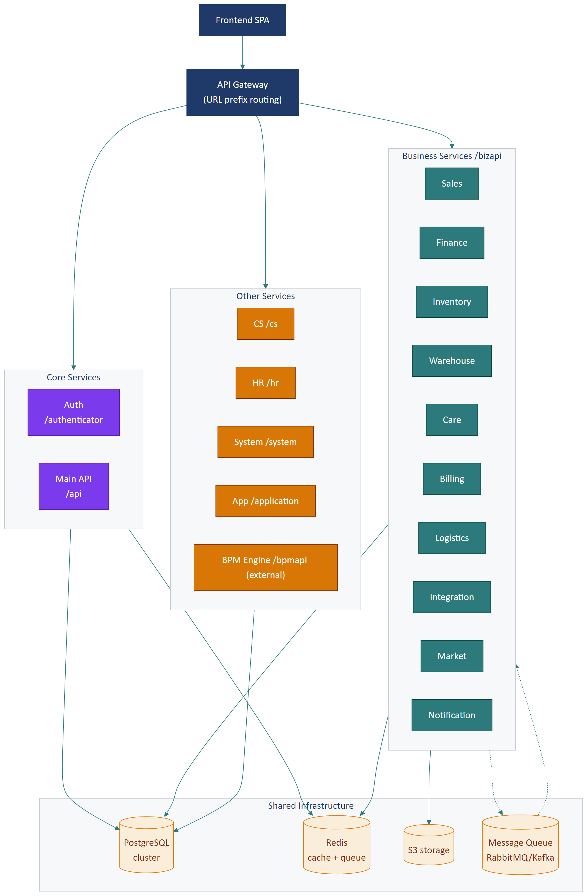

# Part 08 — Backend Architecture (suy luận)

> ⚠️ **Mức độ tự tin: THẤP** — Toàn bộ Part này là **suy luận** dựa trên:
> - URL prefix trong [`src/configs/urls.ts`](../../src/configs/urls.ts)
> - Pattern HTTP request/response qua [`src/configs/fetchConfig.ts`](../../src/configs/fetchConfig.ts)
> - Naming convention của 240 service files
> - Best practice cho stack tương đương
>
> **Đội backend cần xác nhận hoặc cập nhật từng mục.** Có những phần đoán hoàn toàn (vd ngôn ngữ backend, database engine, message queue) — đánh dấu rõ.

## Executive Summary

Backend của Reborn CRM được suy luận là **kiến trúc microservices** với ~14 bounded context, mỗi context là 1 service riêng. Frontend giao tiếp qua **API gateway pattern** (URL prefix routing, có thể implement client-side hoặc server-side). Auth tập trung qua **SSO Reborn**. Multi-tenant qua **header `Hostname` + cột `tenantId`**. Các microservice giao tiếp với nhau qua **HTTP REST hoặc message queue** (đoán). Có một **BPM engine** (Camunda?) deploy riêng cho workflow.

---

## 1. Bằng chứng từ codebase

### 1.1. URL prefix → suy ra service

```ts
// configs/urls.ts
const prefixApi = "/api";                    // → API service chính
const prefixAdmin = "/adminapi";              // → Admin service
const prefixBiz = "/bizapi";                  // → Business gateway
const prefixSales = prefixBiz + "/sales";     // → Sales service
const prefixFinance = prefixBiz + "/finance"; // → Finance service
const prefixInventory = prefixBiz + "/inventory";
const prefixWarehouse = prefixBiz + "/warehouse";
const prefixCare = prefixBiz + "/care";
const prefixBilling = prefixBiz + "/billing";
const prefixLogistics = prefixBiz + "/logistics";
const prefixIntegration = prefixBiz + "/integration";
const prefixMarket = prefixBiz + "/market";
const prefixNotification = prefixBiz + "/notification";
const prefixCs = "/cs";                       // → Customer service
const prefixHr = "/hr";                       // → HR service
const prefixSystem = "/system";               // → System service
const prefixApplication = "/application";     // → App marketplace
const prefixBpm = process.env.APP_BPM_URL + "/bpmapi";  // → BPM (external host)
const prefixAuthenticator = "/authenticator"; // → Auth/SSO
```

→ **Suy ra ít nhất 14 service riêng biệt**.

### 1.2. Header gửi từ client

```ts
config.headers["Authorization"] = `Bearer <token>`;
config.headers["Selectedrole"] = <selectedRole>;
config.headers["Hostname"] = "kcn.reborn.vn";
```

→ Backend phải:
- Validate JWT
- Đọc `Selectedrole` để áp quyền
- Đọc `Hostname` để biết tenant nào

### 1.3. Response format

```json
{ "code": 0, "result": {...}, "message": "OK" }
```

→ Quy ước response chuẩn cho mọi service (likely shared library hoặc API gateway transform).

---

## 2. Sơ đồ kiến trúc backend (đề xuất)



---

## 3. Bounded contexts (microservices)

> 🟡 **Suy luận** — mỗi bounded context có thể là 1 service hoặc gộp vài context vào 1 service tùy quy mô đội.

### 3.1. Auth Service (`/authenticator`)

| Trách nhiệm | Endpoint điển hình |
|------------|-------------------|
| OAuth/OIDC flow | `/oauth/authorize`, `/oauth/token`, `/oauth/userinfo` |
| Refresh token | `/oauth/refresh` |
| Logout | `/oauth/logout` |
| Password reset | `/auth/forgot-password`, `/auth/reset-password` |
| 2FA | `/auth/2fa/enable`, `/auth/2fa/verify` |
| User session management | `/auth/sessions` |

**Đặc điểm:**
- Stateless với JWT
- Có refresh token rotation
- Kết nối với database User
- Có thể là OpenID Connect provider

### 3.2. Main API Service (`/api`)

| Trách nhiệm |
|------------|
| Customer CRUD |
| Contact CRUD |
| User management |
| Department / Role / Permission |
| Tenant config |
| Generic catalog |

**Đoán:** Có thể là **API gateway + thin business logic** routes vào các service nhỏ hơn, hoặc là **service core** chứa shared concerns.

### 3.3. Sales Service (`/bizapi/sales`)

| Trách nhiệm | Endpoint |
|------------|----------|
| POS invoice CRUD | `invoice/create`, `invoice/filter`, `invoice/cancel`, `invoice/refund` |
| Shift management | `shift/open`, `shift/close`, `shift/current` |
| Bought items (product/service/card) | `boughtProduct/*`, `boughtService/*`, `boughtCard/*` |
| Order tracking | `order/list`, `order/tracking` |
| Sales report | `report/revenue`, `report/topProducts` |

### 3.4. Finance Service (`/bizapi/finance`)

| Trách nhiệm |
|------------|
| Cashbook (sổ thu chi) |
| Fund management |
| Finance category |
| Debt management (cả phải thu + phải trả) |
| Payment control / reconciliation |
| Internal transfer giữa quỹ |

### 3.5. Inventory Service (`/bizapi/inventory`)

| Trách nhiệm |
|------------|
| Material catalog (CRUD NVL) |
| Supplier catalog |
| Stock balance per warehouse |

### 3.6. Warehouse Service (`/bizapi/warehouse`)

| Trách nhiệm |
|------------|
| Warehouse master |
| Stock receipt (phiếu nhập) |
| Stock issue (phiếu xuất) |
| Stock transfer giữa kho |
| Inventory checking (kiểm kê) |
| Adjustment slip |
| Destroy slip |
| Warehouse report |

### 3.7. Care Service (`/bizapi/care`)

| Trách nhiệm |
|------------|
| Customer Care task |
| Care history log |
| Loyalty wallet (ví điểm) |
| Card service (thẻ thành viên) |
| Membership plan + quota tracking |
| Check-in log |

### 3.8. Billing Service (`/bizapi/billing`)

| Trách nhiệm |
|------------|
| E-invoice issuing |
| Tích hợp với CA + nhà cung cấp e-invoice (Viettel, VNPT, Misa) |
| Lookup hóa đơn đã phát hành |
| Cancel hóa đơn |

### 3.9. Logistics Service (`/bizapi/logistics`)

| Trách nhiệm |
|------------|
| Tích hợp shipping carriers (GHN, GHTK, J&T, Viettel Post, ShopeeExpress) |
| Tạo đơn giao |
| Track trạng thái |
| Webhook callback từ carriers |

### 3.10. Integration Service (`/bizapi/integration`)

| Trách nhiệm |
|------------|
| Tích hợp 3rd party generic |
| Webhook outbound dispatcher |
| External API credentials vault |
| Monitoring tích hợp |

### 3.11. Market Service (`/bizapi/market`)

| Trách nhiệm |
|------------|
| Promotion / Voucher |
| Marketing campaign (SMS / Email / Zalo / Push) |
| Marketing automation rules |
| Coupon |
| Lead management |

### 3.12. Notification Service (`/bizapi/notification`)

| Trách nhiệm |
|------------|
| In-app notification |
| Push notification (Firebase) |
| Email transactional |
| SMS transactional |

### 3.13. Customer Service (CS) Service (`/cs`)

| Trách nhiệm |
|------------|
| Ticket management |
| Feedback intake |
| SLA tracking |

### 3.14. BPM Service (`/bpmapi` — external)

| Trách nhiệm |
|------------|
| Camunda BPMN engine |
| Process instance management |
| Form rendering |
| Task assignment |
| Workflow execution |

> Đây là **service riêng biệt host trên domain khác** (`process.env.APP_BPM_URL`). Frontend gọi trực tiếp vào BPM API thay vì proxy qua main API.

### 3.15. HR Service (`/hr`)

| Trách nhiệm |
|------------|
| Employee profile |
| Department |
| Shift schedule |
| Attendance / timekeeping |

### 3.16. Application Marketplace (`/application`)

| Trách nhiệm |
|------------|
| Danh sách app/extension có thể cài |
| Cài / gỡ extension cho tenant |
| Permission cho extension |

---

## 4. Tech stack backend (suy luận)

### 4.1. Đoán ngôn ngữ + framework

> 🔴 **Hoàn toàn đoán** — không có evidence cứng.

Khả năng cao:

| Khả năng | Đặc điểm gợi ý |
|----------|---------------|
| **Java + Spring Boot** | Camunda BPM (`/bpmapi`) thường đi với Java; pattern endpoint `/api/customer/filter` rất Java-style |
| **Node.js + Express/NestJS** | Cũng phổ biến cho microservices; phù hợp với ecosystem JS Reborn |
| **Hybrid** | BPM service Java, các service khác Node.js |

**Cách verify**: hỏi đội backend hoặc xem header `Server` của response.

### 4.2. Database

> 🔴 **Đoán**

- **PostgreSQL** rất khả năng (open-source, mature, support JSON, RLS)
- Hoặc **MySQL/MariaDB**
- Mỗi microservice **có thể có DB riêng** (database-per-service pattern), hoặc **shared DB** với schema riêng

### 4.3. Cache + Queue

> 🔴 **Đoán**

- **Redis**: cache + queue
- **RabbitMQ** hoặc **Kafka**: message broker giữa các service (nếu có async pattern)
- **Bull/BullMQ**: nếu Node.js

### 4.4. Search

> 🔴 **Đoán**

- **Elasticsearch** cho full-text search khách hàng / sản phẩm
- Hoặc **PostgreSQL full-text search** (`tsvector`) nếu chưa cần ES

### 4.5. File storage

- **S3-compatible** (AWS S3 / DigitalOcean Spaces / MinIO)
- Có thể có **CDN** trước (CloudFlare / CloudFront)
- Service `process.env.APP_UPLOAD_URL` riêng cho file upload

---

## 5. Communication patterns giữa các service

### 5.1. Sync REST (HTTP)

Phổ biến nhất. Mỗi service expose REST API, các service khác gọi qua HTTP:

```
Sales Service → calls → Inventory Service (kiểm tra tồn trước khi tạo đơn)
Sales Service → calls → Care Service (cộng điểm khách)
Sales Service → calls → Finance Service (sinh phiếu thu)
```

### 5.2. Async event/message

> 🔴 **Đoán**

Cho các luồng không cần response ngay:

- **Webhook outbound**: tạo invoice xong → emit `invoice.created` → service Integration push tới webhook đăng ký
- **Marketing campaign**: queue gửi 10000 SMS — Marketing service đẩy job vào queue → Worker xử lý
- **Notification**: send email không block business logic → push vào queue → Notification worker

### 5.3. Synchronous chained calls

⚠️ **Risk**: nếu Sales gọi Inventory, Inventory gọi Catalog, Catalog gọi DB → chain 3 service. Lỗi 1 mắt xích → toàn bộ fail. Nên có:

- **Circuit breaker** (Hystrix / Resilience4j)
- **Retry với backoff**
- **Timeout** chặt
- **Fallback** khi service down

---

## 6. API Gateway pattern

### 6.1. Hai cách implement

#### Cách A — Client-side gateway (hiện tại)

```
Browser → Cloud A.com/api/... → Cloud A backend
       → Cloud B.com/bizapi/... → Cloud B backend (Sales)
       → Cloud C.com/bpmapi/... → Cloud C backend (BPM)
```

Frontend tự routing qua các URL khác nhau. Đơn giản nhưng:
- ❌ CORS phải config nhiều subdomain
- ❌ Browser phải open nhiều TCP connection
- ❌ Khó áp common policy (rate limit, logging)

#### Cách B — Server-side gateway

```
Browser → gateway.reborn.vn/api/...      ─┐
       → gateway.reborn.vn/bizapi/...     │   1 entry point
       → gateway.reborn.vn/bpmapi/...     ─┘
              │
              ▼
         [API Gateway: Kong/nginx/Traefik]
              │
              ├─→ Sales Service
              ├─→ Finance Service
              └─→ BPM Service
```

Frontend chỉ cần 1 host. Gateway xử lý:
- Authentication
- Rate limit
- Logging
- CORS
- SSL termination

### 6.2. Đề xuất: Migrate sang Cách B

Vì Reborn có hàng chục service, không scale với client-side. **Đề xuất** triển khai gateway centralize. Xem [ADR-06](part-13-adr.md#adr-06--client-side-api-gateway).

---

## 7. Authentication chi tiết

### 7.1. SSO flow (đoán OAuth 2.0 Authorization Code)

```
1. User → CRM frontend (hub.reborn.vn/crm/)
2. CRM phát hiện chưa login → redirect:
   sso.reborn.vn/oauth/authorize?
     client_id=crm
     redirect_uri=hub.reborn.vn/crm/login
     response_type=code
     state=<random>
3. User nhập email + password
4. SSO redirect về:
   hub.reborn.vn/crm/login?code=<authcode>&state=<random>
5. CRM gửi POST sso.reborn.vn/oauth/token với code
6. SSO trả về { access_token, refresh_token, expires_in }
7. CRM lưu access_token vào cookie `token`
8. CRM gọi GET sso.reborn.vn/oauth/userinfo với Bearer token
9. SSO trả về { id, name, email, roles, ... }
10. CRM redirect user vào Dashboard
```

### 7.2. Token refresh

Khi access_token hết hạn (401):
1. Frontend interceptor catch 401
2. Gọi POST `/oauth/refresh` với `refresh_token`
3. Nếu thành công → retry original request
4. Nếu thất bại → logout + redirect login

> ⚠️ Hiện tại interceptor chưa có logic refresh — chỉ logout. Đây là **UX gap** — user bị logout giữa chừng phải login lại.

---

## 8. Multi-tenant routing trong backend

Khi backend nhận request với header `Hostname: kcn.reborn.vn`:

```python
# pseudocode middleware
def tenant_middleware(request):
    hostname = request.headers["Hostname"]
    tenant = Tenant.query.filter_by(domain=hostname).first()
    if not tenant:
        return 404
    request.tenant_id = tenant.id
    # Set DB session to RLS context
    db.execute(f"SET app.current_tenant = {tenant.id}")
```

Sau đó mọi query trong request scope đều tự động filter theo `tenant_id`.

---

## 9. Background workers (đề xuất)

Service nào cần background worker?

| Service | Job worker |
|---------|-----------|
| **Marketing** | Gửi mass SMS/Email/Zalo (queue based) |
| **Notification** | Push notification batches |
| **Care** | Cron sinh task chăm sóc tự động (sinh nhật, sắp hết hạn gói) |
| **Sales** | Đối soát thanh toán end-of-day |
| **Finance** | Tính số dư cuối ngày, generate báo cáo |
| **Integration** | Webhook outbound dispatcher với retry |
| **Billing** | Retry phát hành VAT khi nhà cung cấp e-invoice down |

### 9.1. Pattern background job

```
Service API → push job to Redis queue (key: "queue:sms")
                         │
                         ▼
              [Worker pool subscribe queue]
                         │
                         ▼
                  Process job (call SMS gateway)
                         │
                         ▼
                  Update job status
                         │
                         ▼
                  If fail → exponential backoff → retry up to 5 times
                         │
                         ▼
                  If still fail → dead letter queue
```

---

## 10. Service discovery (đề xuất)

> 🔴 **Đoán**

Với nhiều microservice, cần cách để biết "Sales service đang chạy ở IP nào, port nào". Lựa chọn:

| Cách | Mô tả |
|------|-------|
| **DNS** | Mỗi service có domain `sales.internal.reborn.vn` |
| **Kubernetes service** | `sales-service.default.svc.cluster.local` |
| **Consul** | Service registry + health check |
| **Eureka** | Java-based service discovery |
| **Hardcode IP** | Trong env var (đơn giản nhưng không scale) |

---

## 11. Database per service vs shared DB

### 11.1. Database per service

- Mỗi microservice 1 DB riêng
- Pros: cô lập, scale độc lập, đổi schema không ảnh hưởng service khác
- Cons: cross-service join phải qua API, eventual consistency, distributed transaction phức tạp

### 11.2. Shared DB

- Mọi service connect cùng 1 DB (có thể schema riêng)
- Pros: query join dễ, transaction đơn giản
- Cons: coupling, scale chung, schema change ảnh hưởng nhiều service

### 11.3. Reborn dùng cách nào?

> 🔴 **Đoán** — không biết chắc.

Có thể là **shared DB với schema-per-service** hoặc **database per service** với một số shared "common" schema (vd User, Tenant).

---

## 12. Risks & gaps

| Risk | Mức | Mô tả |
|------|-----|-------|
| **Distributed transaction** | High | Tạo đơn POS chạm 8 entity ở nhiều service — rất khó đảm bảo ACID. Cần dùng **Saga pattern** |
| **Circular dependency** | Med | Sales gọi Inventory, Inventory gọi Catalog... có thể dẫn đến cycle nếu không kiểm soát |
| **Network latency** | Med | Mỗi cross-service call thêm ~50-200ms |
| **Cascading failure** | High | Service core (Auth, Customer) down → mọi service khác fail |
| **Data consistency** | High | Eventual consistency giữa các service — phải design cẩn thận |
| **Versioning** | Med | Backend đổi shape → frontend break — cần API versioning |
| **Monitoring complexity** | High | Trace 1 request qua nhiều service cần distributed tracing (Jaeger/Zipkin) |

---

## 13. Đề xuất cho đội backend xác nhận

Để Part này chính xác, đội backend trả lời:

1. **Số lượng service thực tế** là bao nhiêu? Service nào shared DB?
2. **Ngôn ngữ + framework** chính của mỗi service?
3. **Database engine** (PostgreSQL? MySQL?)
4. **Cache + queue** dùng gì?
5. **Service discovery** ra sao?
6. **API Gateway** hiện có chưa?
7. **Distributed tracing** đã setup?
8. **Saga pattern** đã áp dụng cho transaction phức tạp?
9. **Circuit breaker** đã có?
10. **Multi-tenant isolation** dùng RLS hay app-level filter?

Sau khi có câu trả lời → cập nhật Part 08 với mức tự tin 🟢.

---

*Hết Part 08.*
