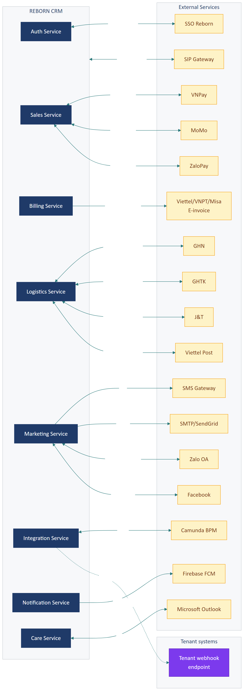
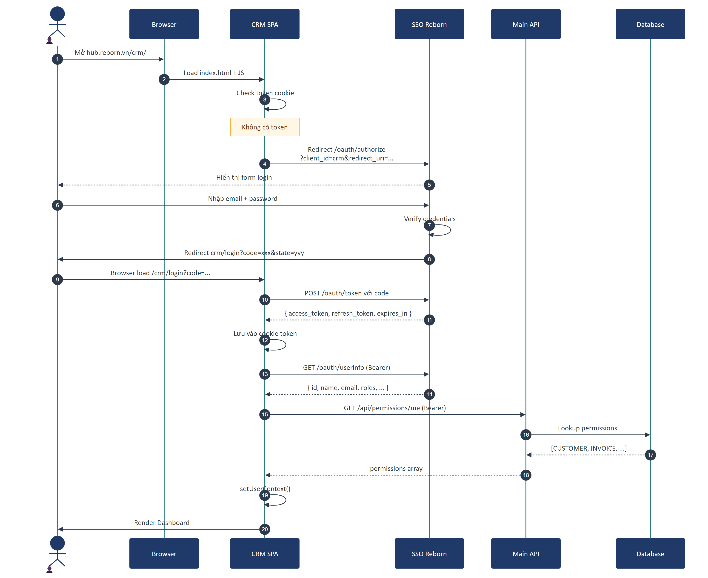
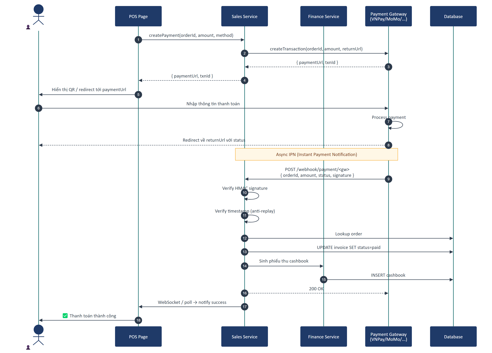
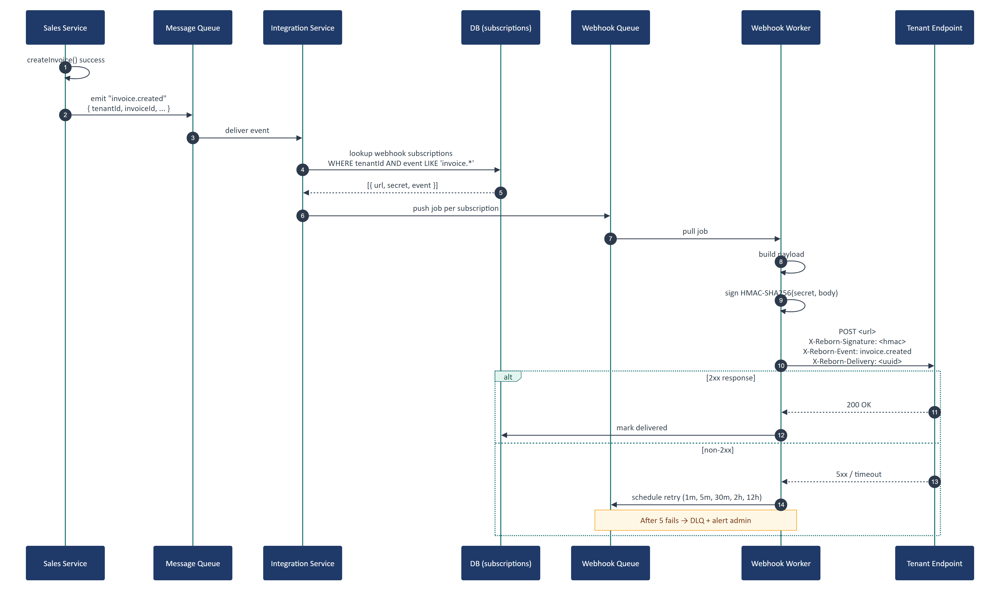

# Part 09 — Integration Architecture

## Executive Summary

Reborn CRM tích hợp với **10+ hệ thống bên ngoài**: SSO Reborn, payment gateway (VNPay/MoMo/ZaloPay/OnePay), e-invoice provider (Viettel/VNPT/Misa), shipping carrier (GHN/GHTK/J&T/Viettel Post), SMS gateway (Viettel/eSMS), email (SMTP/SendGrid), Zalo OA, Facebook Messenger, Microsoft (Outlook/Teams) qua MSAL, Firebase Cloud Messaging, BPM engine (Camunda). Hỗ trợ **webhook hai chiều** — inbound từ payment/shipping/e-invoice + outbound cho tenant tự đăng ký nhận event.

---

## 1. Sơ đồ tổng quan integration



---

## 2. Phân loại tích hợp

| Loại | Hướng | Ví dụ |
|------|-------|-------|
| **AuthN/AuthZ** | Inbound (SSO) | SSO Reborn (OAuth/OIDC) |
| **Payment** | Bi-directional | VNPay, MoMo, ZaloPay, OnePay |
| **Invoicing** | Outbound (call API) | Viettel E-invoice, VNPT eInvoice |
| **Logistics** | Bi-directional | GHN, GHTK, J&T, Viettel Post |
| **Messaging** | Outbound | SMS, Email, Zalo OA, Facebook Messenger |
| **Push notification** | Outbound | Firebase Cloud Messaging |
| **Communication (VoIP)** | Bi-directional | SIP gateway (jssip, sip.js) |
| **Productivity** | Outbound | Microsoft Outlook (qua MSAL), Google Calendar |
| **Workflow** | Internal external | BPM (Camunda) |
| **Webhook outbound** | Outbound | Tenant tự đăng ký URL |
| **Analytics** | Outbound | Athena (process.env.APP_ATHENA_URL) |

---

## 3. SSO (Identity & Access)

> Đã mô tả chi tiết ở [Part 08 §7](part-08-backend-architecture.md#7-authentication-chi-tiết). Tóm tắt sequence:



**Tóm lược:**
- Frontend redirect tới SSO khi chưa có token
- SSO trả `code` sau khi user login
- Frontend exchange `code` → `access_token`
- Token lưu trong cookie, dùng cho mọi request về sau
- 401 → clear cookie + redirect login

---

## 4. Payment Gateway

### 4.1. Sơ đồ flow tổng quan



### 4.2. Pattern integration

#### Cách A — Redirect-based (truyền thống)

```
1. User bấm Thanh toán ở POS
2. Frontend → API: createPayment(orderId, amount, method)
3. API → Payment Gateway: createTransaction → trả paymentUrl
4. API → Frontend: redirect tới paymentUrl
5. User nhập thông tin thanh toán trên trang gateway
6. Gateway redirect ngược về Reborn (return URL) với status
7. Gateway gọi webhook IPN tới API → API verify chữ ký → update DB
```

#### Cách B — Inline (modal/iframe)

Một số gateway hỗ trợ inline qua SDK JS — embed vào trang Reborn không phải redirect.

#### Cách C — QR code

```
1. POS yêu cầu tạo QR
2. Backend gọi gateway → trả QR string
3. POS hiển thị QR
4. Khách quét bằng app → thanh toán
5. Gateway gọi webhook IPN → backend update
6. POS poll status → hiển thị "Đã thanh toán"
```

### 4.3. Webhook IPN handling

```
Payment Gateway → POST /webhook/payment/<gateway_name>
                  Headers: signature, timestamp
                  Body: { orderId, amount, status, ... }

Backend:
  1. Verify HMAC signature với secret
  2. Verify timestamp không quá cũ (replay attack)
  3. Lookup order trong DB
  4. Update status invoice + sinh phiếu thu trong cashbook
  5. Trả 200 (gateway sẽ retry nếu khác)
```

### 4.4. Ví dụ gateway hỗ trợ

| Gateway | Loại | API doc |
|---------|------|---------|
| **VNPay** | Bank gateway | sandbox.vnpayment.vn |
| **MoMo** | E-wallet | developers.momo.vn |
| **ZaloPay** | E-wallet | developers.zalopay.vn |
| **OnePay** | Bank gateway | onepay.vn |
| **Stripe** | International (cho tenant quốc tế) | stripe.com |

### 4.5. Reconciliation

Không phải lúc nào IPN cũng đến. Cần đối soát định kỳ:

- **Daily reconciliation job**: pull sao kê từ gateway → so với cashbook → flag mismatch
- **Manual reconciliation page**: [`/payment_control`](../../src/pages/PaymentControl/) — kế toán xử lý các dòng lệch

---

## 5. E-invoice (Hóa đơn điện tử VAT)

### 5.1. Sequence

> Đã có ở URD: [`urd/diagrams/14-sequence-vat.png`](../urd/diagrams/14-sequence-vat.png).

### 5.2. Nhà cung cấp

| Provider | Đặc điểm |
|----------|----------|
| **Viettel E-invoice** | Phổ biến, tích hợp REST API |
| **VNPT eInvoice** | Tích hợp Web Service (SOAP cũ) hoặc REST mới |
| **Misa meInvoice** | Tích hợp REST API, có sandbox |
| **EasyInvoice** | |

### 5.3. Yêu cầu tích hợp

1. **Chứng thư số CA** — file `.pfx` hoặc HSM
2. **API credentials** từ provider
3. **Mã số doanh nghiệp** đã đăng ký với cơ quan thuế
4. **Template hóa đơn** đã được duyệt

### 5.4. Lưu trữ chữ ký số

> 🔴 **Critical**: Chứng thư số là tài sản pháp lý — phải lưu trong **vault** (HashiCorp Vault, AWS KMS, hoặc HSM), KHÔNG phải file system thường.

### 5.5. Retry strategy

E-invoice provider có thể down. Backend cần:
- Lưu hóa đơn ở trạng thái "pending"
- Background job retry mỗi 5 phút × 12 lần
- Sau 1 giờ vẫn fail → thông báo admin

---

## 6. Shipping carriers

### 6.1. Carriers hỗ trợ

| Carrier | API |
|---------|-----|
| **GHN** (Giao Hàng Nhanh) | `api.ghn.vn` |
| **GHTK** (Giao Hàng Tiết Kiệm) | `services.giaohangtietkiem.vn` |
| **J&T Express** | API doc của J&T |
| **Viettel Post** | `partner.viettelpost.vn` |
| **ShopeeExpress** | API Shopee |
| **Ahamove** | `api.ahamove.com` (cho intra-city) |

### 6.2. Flow tạo đơn giao

```
1. POS thanh toán xong, khách chọn "Giao tận nơi"
2. Frontend → Logistics Service: createShipment(invoiceId, address, carrier)
3. Logistics → Carrier API: createOrder
4. Carrier trả về: trackingNumber, estimatedDeliveryDate, fee
5. Logistics lưu vào DB → trả về frontend
6. Frontend hiển thị mã vận đơn
```

### 6.3. Tracking via webhook

```
Carrier → POST /webhook/shipping/<carrier_name>
          Body: { trackingNumber, status, location, timestamp }

Backend:
  1. Verify signature
  2. Update shipment status
  3. (Optional) Gửi notification cho khách
```

### 6.4. Sync polling fallback

Nếu carrier không có webhook, backend phải poll status:

```
Cron job mỗi 30 phút:
  for each shipment with status != 'delivered':
    GET carrier.api/track/{trackingNumber}
    update local status
```

---

## 7. SMS Gateway

### 7.1. Providers

| Provider | Đặc điểm |
|----------|----------|
| **Viettel SMS Brand** | Phổ biến VN, có brandname |
| **VinaSMS** | Alternative |
| **eSMS.vn** | API REST đơn giản |
| **Twilio** | International |

### 7.2. Use cases

| Use case | Loại |
|----------|------|
| **OTP login** | Transactional |
| **Booking confirm** | Transactional |
| **Marketing campaign** | Marketing (cần đăng ký brandname) |
| **Nhắc gia hạn gói** | Reminder |
| **Xác minh check-in** | Transactional |

### 7.3. Pattern gửi

```
Marketing Service → push job vào queue:sms
                  │
                  ▼
              [SMS Worker]
                  │
                  ▼
            Get next batch (vd 100 SMS/phút theo throttle)
                  │
                  ▼
              For each SMS:
                Try gateway A → if fail → try gateway B (failover)
                  │
                  ▼
              Update delivery status
                  │
                  ▼
              Webhook callback từ gateway → update final status
```

### 7.4. Cost optimization

- **Tin tiếng Việt có dấu** = 70 ký tự → quá thì chia nhiều part = đắt hơn
- **Tin không dấu** = 160 ký tự
- Cần **template engine** giúp marketer biết tin sẽ chiếm bao nhiêu part

---

## 8. Email service

### 8.1. SMTP providers

| Provider | Đặc điểm |
|----------|----------|
| **Gmail SMTP** | Free 500 email/day, app password |
| **Office365 SMTP** | Doanh nghiệp |
| **SendGrid** | API + SMTP, tracking, template |
| **Mailgun** | Tương tự |
| **AWS SES** | Rẻ nhất cho volume lớn |

### 8.2. Use cases

- Hóa đơn điện tử
- Xác nhận đặt phòng
- Email marketing campaign
- Reset password
- Báo cáo định kỳ

### 8.3. Email template

> Frontend có folder `src/template/` — có thể chứa email HTML template. Backend cần template engine (Handlebars, Nunjucks, Jinja...) render với dữ liệu.

### 8.4. Bounce + complaint handling

- **Bounce**: email trả về (sai địa chỉ, mailbox full) → đánh dấu `email_invalid` trên customer
- **Complaint**: user mark spam → đánh dấu `email_unsubscribed` → không gửi marketing nữa

---

## 9. Zalo OA

### 9.1. API

Zalo Open API: `openapi.zalo.me`

### 9.2. Setup

1. Doanh nghiệp đăng ký Zalo Official Account
2. Cấp quyền cho ứng dụng Reborn qua OAuth Zalo
3. Lấy `access_token` (long-lived)
4. Cấu hình webhook URL trên Zalo Developer

### 9.3. Use cases

- Gửi tin nhắn cá nhân hóa cho khách đã follow OA
- Notification booking, đơn hàng
- Marketing campaign (theo policy Zalo — chỉ gửi cho follower)

### 9.4. Hạn chế

- Chỉ gửi được cho khách đã follow OA
- Có quota daily message
- Một số loại tin (vd promotion) cần Zalo duyệt template

---

## 10. Facebook Messenger

### 10.1. API

Facebook Graph API + Send API

### 10.2. Setup

1. Tạo Facebook App
2. Connect Fanpage với app
3. Lấy Page Access Token (long-lived)
4. Cấu hình webhook subscribe events: `messages`, `messaging_postbacks`, `messaging_optins`
5. Verify webhook với token tự đặt

### 10.3. Use cases

- Inbox từ Fanpage → hiển thị trong Reborn CRM
- Auto reply
- Bot conversation flow
- Đẩy notification (theo policy 24+1 giờ)

---

## 11. Firebase Cloud Messaging (FCM)

### 11.1. File config

- `src/firebase-config.ts`: client SDK setup
- `src/firebase-messaging-sw.js`: service worker nhận push background

### 11.2. Use case

- Push notification vào browser desktop khi có:
  - Đơn hàng mới
  - Thông báo hệ thống
  - Nhắc lịch
  - Chat message

### 11.3. Setup

1. Tạo Firebase project
2. Enable Cloud Messaging
3. Lấy `apiKey`, `authDomain`, `projectId`, `messagingSenderId`, `appId`
4. Frontend init Firebase + request permission
5. Đăng ký device token với backend
6. Backend dùng FCM Admin SDK để push

---

## 12. Microsoft Integration (Outlook, Teams)

### 12.1. Library

`@azure/msal-browser` + `@azure/msal-react`

### 12.2. Use cases

- Đăng nhập bằng Microsoft account
- Sync calendar Outlook (đặt lịch hẹn 2 chiều)
- Gửi email qua Outlook
- Collaboration trong Teams

### 12.3. Auth flow

OAuth 2.0 Authorization Code with PKCE.

---

## 13. Call Center / VoIP

### 13.1. Library

- `jssip` (SIP signaling)
- `sip.js` (alternative)

### 13.2. Use cases

- Click-to-call từ hồ sơ khách hàng
- Hiển thị popup khi có cuộc gọi đến (caller ID + match khách)
- Ghi âm cuộc gọi
- Auto log call vào CareHistory

### 13.3. Backend phụ thuộc

- **SIP Server** (FreeSWITCH, Asterisk, hoặc dịch vụ Viettel/FPT)
- **WebRTC gateway** để browser kết nối SIP
- **Recording storage** trên S3

---

## 14. BPM Engine (Camunda)

### 14.1. URL

`process.env.APP_BPM_URL` → service riêng biệt

### 14.2. Library frontend

- `bpmn-js` 17.x (BPMN diagram editor + viewer)
- `bpmn-js-properties-panel` 5.x
- `@bpmn-io/form-js` 1.x (form builder)
- `camunda-bpmn-moddle` 7.x

### 14.3. Pattern

```
Frontend (BPM page)
  ↓ REST
BPM Engine (Camunda)
  ↓ Internal API call
Reborn CRM Services
  - Sales (tạo đơn từ workflow)
  - Care (gán task chăm sóc)
  - Notification (gửi tin)
```

> Một workflow điển hình: *"Phê duyệt chiết khấu lớn"* — Sales user tạo đơn → BPM sinh task gán Manager → Manager duyệt → Sales user nhận thông báo → in hóa đơn.

---

## 15. Webhook outbound (cho tenant)

### 15.1. Mục đích

Tenant tự đăng ký URL nhận event từ CRM để tích hợp với app riêng (vd app khách hàng, dashboard tự build, công cụ kế toán).

### 15.2. Sequence



### 15.3. Implementation

```
Sales Service: tạo invoice xong
   │
   ▼
Emit event "invoice.created" with payload
   │
   ▼
Integration Service: subscribe events
   │
   ▼
Lookup webhook subscriptions for tenant
   │
   ▼
For each subscription:
   Push job to queue:webhook
   │
   ▼
[Webhook Worker]
   POST <url> with payload
   Header: X-Reborn-Signature: HMAC-SHA256(secret, body)
   Header: X-Reborn-Event: invoice.created
   Header: X-Reborn-Delivery: <uuid>
   │
   ▼
   if response.status in [200..299]:
       mark delivered
   else:
       retry with exponential backoff (1m, 5m, 30m, 2h, 12h)
       after 5 fails → mark failed → notify admin
```

### 15.4. Events publish

Theo URD IR-09:

- `customer.created`, `customer.updated`
- `invoice.created`, `invoice.paid`, `invoice.cancelled`, `invoice.refunded`
- `checkin.created`, `checkin.completed`
- `shift.opened`, `shift.closed`
- `member.tier_changed`
- `payment.received`

### 15.5. Security

- **HMAC signature** — tenant verify để chắc message từ Reborn
- **HTTPS only** — không cho HTTP
- **Replay protection** — header `X-Reborn-Timestamp`, tenant check delta
- **Rate limit** — không spam tenant

### 15.6. Monitoring

Trang `/integrated_monitoring` cho admin tenant:
- Số webhook đã gửi thành công / thất bại
- Log từng request
- Manual retry

---

## 16. Webhook inbound (từ external services)

CRM nhận webhook từ:

| Source | Endpoint pattern |
|--------|------------------|
| **VNPay IPN** | `/api/webhook/payment/vnpay` |
| **MoMo IPN** | `/api/webhook/payment/momo` |
| **ZaloPay** | `/api/webhook/payment/zalopay` |
| **GHN tracking** | `/api/webhook/shipping/ghn` |
| **GHTK tracking** | `/api/webhook/shipping/ghtk` |
| **Viettel E-invoice status** | `/api/webhook/billing/viettel` |
| **Zalo OA messages** | `/api/webhook/zalo` |
| **Facebook Page** | `/api/webhook/facebook` |
| **SMS delivery report** | `/api/webhook/sms/<provider>` |

### Common pattern

```python
def webhook_handler(request):
    # 1. Verify source
    if not verify_signature(request):
        return 401
    
    # 2. Parse payload
    payload = request.json
    
    # 3. Idempotency check (đã xử lý request này chưa)
    if redis.get(f"webhook:{payload['id']}"):
        return 200  # already processed
    
    # 4. Process (in transaction)
    process_event(payload)
    
    # 5. Mark processed
    redis.setex(f"webhook:{payload['id']}", 86400, "1")
    
    return 200
```

---

## 17. Integration testing strategy

### 17.1. Unit test

- Mock external API trong unit test (vd dùng `nock` cho Node.js, `WireMock` cho Java)

### 17.2. Integration test

- Provider có **sandbox environment** → test thật ở sandbox
- Verify webhook flow end-to-end

### 17.3. Contract testing

Sử dụng **Pact** hoặc **OpenAPI Schema validation** để đảm bảo:
- Provider không break consumer
- Consumer dùng đúng schema provider expose

### 17.4. Health check

Mỗi tích hợp có endpoint `/health/integration/<name>` ping provider để biết status. Hiển thị trên trang Monitoring.

---

## 18. Failure modes & mitigation

| Failure | Mitigation |
|---------|-----------|
| **Provider down** | Circuit breaker + queue retry + fallback provider |
| **Provider rate limit** | Throttle local, queue, batch requests |
| **Webhook signature invalid** | Reject 401 + alert |
| **Replay attack** | Idempotency key + timestamp window |
| **Slow response** | Timeout 30s + async processing |
| **Schema change** | Version pinning + monitoring schema diff |
| **Credentials leak** | Vault + rotation + audit log |
| **Cost overrun** (SMS/email) | Daily budget + alert khi vượt |

---

*Hết Part 09.*
