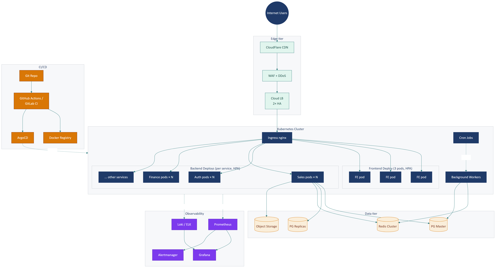

# Part 12 — Deployment & Infrastructure

> ⚠️ **Mức độ tự tin: THẤP** — Toàn bộ Part này là **đề xuất** dựa trên best practice. Đội DevOps cần thay bằng infrastructure thực tế.

## Executive Summary

Đề xuất triển khai Reborn CRM theo mô hình **multi-environment** (dev/staging/production) trên hạ tầng cloud, sử dụng **container orchestration** (Kubernetes hoặc Docker Swarm), với **API gateway**, **load balancer**, **multiple API instances stateless**, **PostgreSQL HA** (master + read replicas), **Redis cluster**, **S3-compatible object storage**, và **CI/CD pipeline tự động**. Có **3 môi trường** với strategy promote code dần dần.

---

## 1. Sơ đồ deployment đề xuất



---

## 2. Environments

### 2.1. Strategy 3 môi trường

| Env | Mục đích | URL pattern | Data |
|-----|---------|-------------|------|
| **Development** | Dev tự test | `dev.reborn.vn` hoặc localhost | Mock + sample |
| **Staging** | QA + UAT | `staging.reborn.vn` | Realistic, có thể anonymize từ prod |
| **Production** | Customer thật | `*.reborn.vn` (tenant subdomain) | Live |

### 2.2. Build pipeline

```
┌─────────────┐   git push    ┌─────────────┐
│  Developer  ├──────────────►│   GitHub    │
└─────────────┘   (feature)   │   GitLab    │
                              └──────┬──────┘
                                     │ webhook
                                     ▼
                              ┌─────────────┐
                              │     CI      │
                              │  (Actions/  │
                              │  GitLab CI) │
                              └──────┬──────┘
                                     │
              ┌──────────────────────┼──────────────────────┐
              ▼                      ▼                      ▼
       ┌───────────┐         ┌──────────────┐       ┌─────────────┐
       │   Lint    │         │  Unit test   │       │  Build prod │
       └─────┬─────┘         └──────┬───────┘       └──────┬──────┘
             │                      │                       │
             └──────────┬───────────┴───────────┬──────────┘
                        │                       │
                        ▼                       ▼
                ┌──────────────┐         ┌──────────────┐
                │ Pass? Merge  │         │ Build Docker │
                │ to develop   │         │ image        │
                └──────┬───────┘         └──────┬───────┘
                       │                        │
                       ▼                        ▼
                ┌──────────────┐         ┌──────────────┐
                │ Auto deploy  │         │ Push to ECR  │
                │ to dev env   │         │ /Harbor      │
                └──────────────┘         └──────┬───────┘
                                                │
                                                ▼
                                         ┌──────────────┐
                                         │ Manual deploy│
                                         │ to staging/  │
                                         │ production   │
                                         └──────────────┘
```

### 2.3. Branch strategy

- **`main`** (hoặc `master`): luôn deployable, là code đang chạy production
- **`develop`**: integration branch, auto deploy to dev env
- **`feature/*`**: feature branch, merge vào develop qua PR
- **`release/*`**: chuẩn bị release, deploy lên staging để UAT
- **`hotfix/*`**: bug fix khẩn cấp, branch từ main

### 2.4. Promote code

```
feature → develop → release/v1.2.0 → main → tag v1.2.0
   ↓         ↓             ↓           ↓
  CI       Dev env      Staging    Production
```

---

## 3. Container strategy

### 3.1. Dockerfile (đề xuất frontend)

```dockerfile
# Build stage
FROM node:20-alpine AS builder
WORKDIR /app
COPY package.json yarn.lock ./
RUN yarn install --frozen-lockfile
COPY . .
RUN yarn build

# Production stage
FROM nginx:alpine
COPY --from=builder /app/bundle /usr/share/nginx/html
COPY nginx.conf /etc/nginx/conf.d/default.conf
EXPOSE 80
CMD ["nginx", "-g", "daemon off;"]
```

### 3.2. nginx.conf

```nginx
server {
  listen 80;
  root /usr/share/nginx/html;
  index index.html;
  
  # SPA fallback
  location / {
    try_files $uri $uri/ /index.html;
    
    # Cache control
    add_header Cache-Control "no-cache, no-store, must-revalidate";
  }
  
  # Static assets - cache aggressive
  location ~* \.(?:css|js|jpg|jpeg|gif|png|ico|svg|woff|woff2|ttf)$ {
    expires 1y;
    add_header Cache-Control "public, immutable";
  }
  
  # Security headers
  add_header X-Frame-Options "DENY";
  add_header X-Content-Type-Options "nosniff";
  add_header Referrer-Policy "strict-origin-when-cross-origin";
  add_header Strict-Transport-Security "max-age=63072000; includeSubDomains; preload";
  
  # Gzip
  gzip on;
  gzip_types text/css application/javascript application/json;
}
```

### 3.3. Image registry

- **Self-hosted**: Harbor, GitLab Registry
- **Managed**: AWS ECR, Docker Hub Pro, GCR

---

## 4. Kubernetes deployment (đề xuất)

### 4.1. Deployment YAML (frontend)

```yaml
apiVersion: apps/v1
kind: Deployment
metadata:
  name: cloud-crm-frontend
  namespace: production
spec:
  replicas: 3
  selector:
    matchLabels:
      app: cloud-crm-frontend
  template:
    metadata:
      labels:
        app: cloud-crm-frontend
    spec:
      containers:
      - name: frontend
        image: harbor.reborn.vn/cloud-crm:v1.2.0
        ports:
        - containerPort: 80
        resources:
          requests:
            memory: "128Mi"
            cpu: "100m"
          limits:
            memory: "256Mi"
            cpu: "500m"
        livenessProbe:
          httpGet:
            path: /
            port: 80
          initialDelaySeconds: 10
          periodSeconds: 30
        readinessProbe:
          httpGet:
            path: /
            port: 80
          initialDelaySeconds: 5
          periodSeconds: 10
---
apiVersion: v1
kind: Service
metadata:
  name: cloud-crm-frontend
spec:
  type: ClusterIP
  selector:
    app: cloud-crm-frontend
  ports:
  - port: 80
    targetPort: 80
---
apiVersion: networking.k8s.io/v1
kind: Ingress
metadata:
  name: cloud-crm-ingress
  annotations:
    cert-manager.io/cluster-issuer: "letsencrypt-prod"
    nginx.ingress.kubernetes.io/proxy-body-size: "100m"
spec:
  tls:
  - hosts:
    - "*.reborn.vn"
    secretName: reborn-tls
  rules:
  - host: hub.reborn.vn
    http:
      paths:
      - path: /crm
        pathType: Prefix
        backend:
          service:
            name: cloud-crm-frontend
            port:
              number: 80
```

### 4.2. Auto-scaling

```yaml
apiVersion: autoscaling/v2
kind: HorizontalPodAutoscaler
metadata:
  name: cloud-crm-hpa
spec:
  scaleTargetRef:
    apiVersion: apps/v1
    kind: Deployment
    name: cloud-crm-frontend
  minReplicas: 3
  maxReplicas: 20
  metrics:
  - type: Resource
    resource:
      name: cpu
      target:
        type: Utilization
        averageUtilization: 70
```

---

## 5. Database HA

### 5.1. PostgreSQL topology

```
                    ┌─────────────────┐
                    │     Master      │
                    │   (read-write)  │
                    └────────┬────────┘
                             │ streaming
                             │ replication
              ┌──────────────┼──────────────┐
              ▼              ▼              ▼
       ┌──────────┐   ┌──────────┐   ┌──────────┐
       │ Replica1 │   │ Replica2 │   │ Replica3 │
       │ (R/O)    │   │ (R/O)    │   │ (Reports)│
       └──────────┘   └──────────┘   └──────────┘
```

- **Master**: chỉ nhận write
- **Replica 1+2**: read replicas cho query bình thường
- **Replica 3**: dành cho query report (heavy, không ảnh hưởng OLTP)

### 5.2. Failover

- **Manual**: DBA promote replica thành master khi master fail
- **Auto**: dùng tool như Patroni / repmgr để auto failover

### 5.3. Connection pool

App dùng connection pool (PgBouncer) để tránh exhaust connection:

```
App pods → PgBouncer (transaction mode) → PostgreSQL
```

### 5.4. Backup

- **pgBackRest** hoặc **wal-g** cho continuous archiving
- Snapshot lên S3 hằng đêm
- Test restore hằng tháng

---

## 6. Redis cluster

### 6.1. Topology

```
        ┌────────┐
        │ Sentinel│ × 3 (HA)
        └────┬───┘
             │
        ┌────▼────┐
        │ Master  │
        └────┬────┘
             │
       ┌─────┴─────┐
       ▼           ▼
   ┌───────┐   ┌───────┐
   │Slave 1│   │Slave 2│
   └───────┘   └───────┘
```

- **3 Sentinel** quản lý failover
- **1 Master + 2 Slave** cho HA

### 6.2. Use case

- Cache session, permission
- Queue cho background job
- Rate limit counter
- Pub/sub cho real-time event

---

## 7. Object storage

### 7.1. Lựa chọn

| Option | Pros | Cons |
|--------|------|------|
| **AWS S3** | Most mature, ecosystem | Vendor lock-in |
| **MinIO** (self-hosted) | Free, S3-compatible | Phải tự ops |
| **DigitalOcean Spaces** | Rẻ, S3-compatible | Limited region |
| **Cloudflare R2** | Không tính egress | Mới, ít feature |

### 7.2. Bucket structure

```
reborn-crm-files/
├── tenants/
│   ├── <tenant_id>/
│   │   ├── customer-avatars/
│   │   ├── product-images/
│   │   ├── invoice-attachments/
│   │   ├── id-card-scans/        ← nhạy cảm, encrypt
│   │   └── exports/
├── public/
│   └── shared-assets/
└── backups/
    ├── db-daily/
    └── db-weekly/
```

### 7.3. Access control

- **Bucket policy**: deny public access by default
- **Pre-signed URL**: cho download tạm thời (1h)
- **CDN**: CloudFront/CloudFlare in front cho static asset
- **Encryption**: SSE-S3 mặc định, SSE-KMS cho file nhạy cảm

---

## 8. CI/CD pipeline

### 8.1. Tools

| Stage | Tool |
|-------|------|
| **CI** | GitHub Actions / GitLab CI / Jenkins |
| **Build** | Docker / Buildah |
| **Registry** | Harbor / ECR / GCR |
| **Deploy** | ArgoCD / FluxCD / Helm |
| **Secret** | Vault / Sealed Secrets / AWS Secrets Manager |

### 8.2. Pipeline stages

```yaml
stages:
  - lint           # ESLint + Prettier
  - test           # Unit + integration tests
  - security_scan  # Snyk / Trivy / SonarQube
  - build          # vite build
  - dockerize      # docker build
  - push           # docker push to registry
  - deploy_dev     # auto deploy to dev
  - e2e_test       # Playwright E2E on dev
  - deploy_staging # manual approval → staging
  - smoke_test     # quick health check
  - deploy_prod    # manual approval → production
  - smoke_test_prod
  - notify         # Slack notification
```

### 8.3. Rollback strategy

- **Blue-green deployment**: deploy version mới → switch traffic → giữ bản cũ standby
- **Rolling update**: từng pod update, có thể pause/rollback
- **Canary**: 5% traffic → 25% → 50% → 100%, monitor error rate
- **Helm rollback**: `helm rollback cloud-crm <prev-version>`

---

## 9. Network topology

### 9.1. Public + Private subnet

```
Internet
    │
    ▼
[ Cloud Provider ]
    │
    ├── Public subnet (10.0.1.0/24)
    │   ├── ALB / Cloud Load Balancer
    │   └── NAT Gateway
    │
    ├── Private subnet (10.0.2.0/24) — App tier
    │   ├── K8s worker nodes
    │   ├── API server pods
    │   └── Worker pods
    │
    ├── Private subnet (10.0.3.0/24) — Data tier
    │   ├── PostgreSQL master + replicas
    │   ├── Redis cluster
    │   └── ElasticSearch
    │
    └── Private subnet (10.0.4.0/24) — Bastion / VPN
        └── Bastion host (SSH access)
```

### 9.2. Security groups

| Tier | Inbound | Outbound |
|------|---------|----------|
| **Public** | 80, 443 from 0.0.0.0/0 | All to private |
| **App** | 80 from public LB | 5432 to data tier; 443 to internet |
| **Data** | 5432 from app tier | None (or via NAT) |
| **Bastion** | 22 from office IP | 22 to private |

### 9.3. CDN

```
User → CloudFlare (edge) → Origin (LB)
       ├── Cache static: 1 year
       ├── Cache HTML: 5 minutes
       ├── WAF rules
       └── DDoS protection
```

---

## 10. Domain & DNS

### 10.1. Domain structure

```
*.reborn.vn       → tenant subdomain (vd: kcn.reborn.vn, viettelstore.reborn.vn)
hub.reborn.vn     → main hub
sso.reborn.vn     → SSO
api.reborn.vn     → API gateway
admin.reborn.vn   → admin portal
status.reborn.vn  → status page
```

### 10.2. SSL certificate

- **Let's Encrypt** (free, auto-renew via cert-manager)
- **Wildcard cert** cho `*.reborn.vn`
- Renew tự động 60 ngày trước expiry

---

## 11. Monitoring & Alerting infra

### 11.1. Stack đề xuất

```
[App] → emit metrics → [Prometheus] → [Grafana dashboard]
         emit logs   → [Loki/ELK]   → [Grafana/Kibana]
         emit traces → [Jaeger]     → [Jaeger UI]
                                          │
                                          ▼
                                   [Alertmanager]
                                          │
                                          ▼
                                  [Slack/PagerDuty/Email]
```

### 11.2. Health check endpoints

Mỗi service expose:

```
GET /health            → 200 OK if alive
GET /health/ready      → 200 OK if ready to serve
GET /health/dependencies → check DB, Redis, external APIs
GET /metrics           → Prometheus format
```

K8s liveness/readiness probe gọi vào.

---

## 12. Disaster Recovery

### 12.1. RTO + RPO

- **RTO** (Recovery Time): ≤ 4h
- **RPO** (Recovery Point): ≤ 1h

### 12.2. DR site

- **Hot standby**: replica region đồng bộ liên tục, switch sang trong vài phút (đắt)
- **Warm standby**: snapshot mỗi 1h, restore trong 1-2h (cân bằng)
- **Cold standby**: backup off-site, restore trong 4-8h (rẻ)

### 12.3. DR drill

- **Hằng quý**: full failover sang DR site
- **Document runbook**: ai làm gì khi có sự cố
- **Post-mortem**: sau mỗi drill / incident → cập nhật runbook

---

## 13. Cost optimization

### 13.1. Reserved instances

Cho các VM/DB chạy 24/7 → mua reserved 1-3 năm để giảm 30-60% chi phí.

### 13.2. Spot instances

Cho background worker không critical → dùng spot/preemptible instance để giảm 60-90%.

### 13.3. Right-sizing

- Monitor CPU/RAM thực tế
- Down-size nếu < 30% utilization

### 13.4. Object storage tier

- **Hot**: file < 30 ngày
- **Warm**: 30-90 ngày → S3 IA
- **Cold**: > 90 ngày → S3 Glacier

### 13.5. Database

- Upgrade chỉ khi cần (storage, IOPS, CPU)
- Periodic vacuum, cleanup old data
- Archive cold data sang S3

---

## 14. Compliance & Data sovereignty

### 14.1. Data location

Theo Luật ANM VN 2018: dữ liệu công dân VN **lưu tại VN**.

→ **Đề xuất**: deploy ở Việt Nam (VNPT/Viettel/FPT cloud) hoặc AWS/GCP region Singapore với contract có cam kết.

### 14.2. Audit log

- Lưu nơi không thể tamper (write-once storage hoặc block chain)
- Retention ≥ 12 tháng (Luật ANM)

---

## 15. Deployment runbook (template)

### 15.1. Pre-deploy

- [ ] Code merged to main
- [ ] CI all green
- [ ] Migration scripts reviewed
- [ ] Backup taken
- [ ] On-call notified
- [ ] Status page updated

### 15.2. Deploy

- [ ] Run migration (downtime ≤ 0)
- [ ] Deploy new image (rolling)
- [ ] Monitor error rate (Grafana)
- [ ] Smoke test critical flows

### 15.3. Post-deploy

- [ ] Verify business metrics OK
- [ ] Update changelog
- [ ] Notify team
- [ ] Tag release in git

### 15.4. Rollback

- [ ] Identify issue
- [ ] Decide: rollback or fix forward
- [ ] If rollback: helm rollback or revert image tag
- [ ] Verify back to stable
- [ ] Post-mortem

---

## 16. Câu hỏi cho đội DevOps xác nhận

1. Cloud provider hiện dùng?
2. Container orchestration: K8s? Docker Swarm? VM?
3. Database engine + version?
4. Backup strategy hiện tại + RTO/RPO thực tế?
5. CI/CD tool?
6. Monitoring stack?
7. Domain/DNS provider?
8. CDN provider?
9. Số env hiện có (dev/staging/prod)?
10. DR plan đã có chưa?

---

*Hết Part 12.*
