# Tài liệu Yêu cầu Người dùng — Reborn CRM

**User Requirement Document (URD)** — biên soạn ngược (reverse-engineered) từ codebase và hành vi thực tế của hệ thống Reborn CRM (biến thể Cửa hàng / Spa / Cộng đồng).

> **Mục đích:** Đây là tài liệu **mô tả yêu cầu** mà hệ thống đã/đang đáp ứng. Khác với HDSD (hướng dẫn cách dùng), URD trả lời câu hỏi *"Hệ thống PHẢI làm được những gì?"* — dùng làm:
> - Cơ sở so sánh khi thay đổi nghiệp vụ.
> - Tài liệu bàn giao cho khách hàng / đội mới.
> - Đầu vào cho test case, kế hoạch QA, hợp đồng triển khai.
> - Tham chiếu khi lên scope cho phiên bản kế tiếp.

## Cấu trúc tài liệu

| Part | Tiêu đề | Nội dung |
|------|---------|----------|
| [Part 00](part-00-gioi-thieu.md) | Giới thiệu & Tổng quan | Mục đích, phạm vi, stakeholder, actor, glossary, MoSCoW |
| [Part 01](part-01-truy-cap.md) | Truy cập hệ thống | Đăng nhập SSO, phân quyền, giao diện, Dashboard |
| [Part 02](part-02-le-tan.md) | Lễ tân | Quản lý ca, POS, Check-in, Trừ quota |
| [Part 03](part-03-thanh-vien.md) | Quản lý Thành viên | CRUD khách, trường tùy chỉnh, danh mục liên quan |
| [Part 04](part-04-giao-dich.md) | Giao dịch | Đơn hàng, hóa đơn VAT, vận chuyển, trả hàng |
| [Part 05](part-05-luu-tru.md) | Lưu trú | Booking, check-in/out phòng, công suất |
| [Part 06](part-06-tai-chinh.md) | Tài chính & Thanh toán | Sổ thu chi, quỹ, công nợ, đối soát |
| [Part 07](part-07-doi-tac-phan-hoi.md) | Đối tác & Phản hồi | KOL/PO, hoa hồng, ticket phản hồi |
| [Part 08](part-08-bao-cao.md) | Báo cáo | 6 loại báo cáo + xuất / lịch tự động |
| [Part 09](part-09-uu-dai-cham-soc.md) | Ưu đãi & Chăm sóc | Khuyến mãi, loyalty, marketing automation |
| [Part 10](part-10-kho.md) | Kho & Nguyên vật liệu | Tồn kho, NCC, kiểm kê, báo cáo kho |
| [Part 11](part-11-cai-dat-co-ban.md) | Cài đặt cơ bản | Tenant config, danh mục SP/DV, gói TV, vận hành |
| [Part 12](part-12-cai-dat-nang-cao.md) | Cài đặt nâng cao | Phân quyền, kênh, tích hợp, bảo mật, ticket |
| [Part 13](part-13-phi-chuc-nang.md) | Yêu cầu phi chức năng | Performance, security, usability, reliability, i18n |
| [Part 14](part-14-tich-hop-du-lieu.md) | Tích hợp & Dữ liệu | API, webhook, import/export, mô hình dữ liệu |

## Quy ước

### Mã định danh yêu cầu (Requirement ID)

```
UR-<MODULE>-<NN>
```

Trong đó:
- `UR` = User Requirement
- `<MODULE>` = mã viết tắt phân hệ (vd: `RECEPTION`, `MEMBER`, `SALE`, `FIN`, `INV`, `MKT`, `SET`, `NFR`)
- `<NN>` = số thứ tự 2 chữ số trong phân hệ

Ví dụ: `UR-RECEPTION-03` = Yêu cầu số 3 trong phân hệ Lễ tân.

### Cấu trúc một yêu cầu

Mỗi yêu cầu được mô tả theo template:

| Trường | Ý nghĩa |
|--------|---------|
| **ID** | Mã định danh |
| **Tên yêu cầu** | Mô tả ngắn (≤ 1 dòng) |
| **Actor** | Vai trò người dùng / hệ thống ngoại vi liên quan |
| **Mô tả** | Mô tả chi tiết hành vi mong đợi |
| **Tiền điều kiện** | Điều kiện phải thỏa trước khi thực hiện |
| **Đầu vào** | Dữ liệu / ràng buộc cụ thể |
| **Đầu ra / Hậu điều kiện** | Trạng thái sau khi thực hiện |
| **Tiêu chí chấp nhận** | Cách kiểm chứng yêu cầu đã được đáp ứng |
| **Mức ưu tiên** | M (Must) / S (Should) / C (Could) / W (Won't) |
| **Ghi chú** | Phụ thuộc, ràng buộc kỹ thuật, rủi ro |

### Mức ưu tiên (MoSCoW)

| Ký hiệu | Ý nghĩa | Hành vi nếu không có |
|---------|---------|----------------------|
| **M** — Must have | Bắt buộc, thiếu là không launch được | Hệ thống không thể vận hành đúng nghiệp vụ chính |
| **S** — Should have | Quan trọng, nên có ngay từ phiên bản đầu | Có thể hoạt động nhưng giảm hiệu quả đáng kể |
| **C** — Could have | Có thì tốt, không có cũng được | Trải nghiệm kém hơn, không chặn nghiệp vụ |
| **W** — Won't have *(this release)* | Đồng ý không làm trong phiên bản hiện tại | Chuyển sang backlog |

### Phân loại yêu cầu

- **FR** (Functional Requirement) — yêu cầu chức năng (mặc định ở Part 01–12)
- **NFR** (Non-Functional Requirement) — yêu cầu phi chức năng (Part 13)
- **IR** (Integration Requirement) — yêu cầu tích hợp (Part 14)
- **DR** (Data Requirement) — yêu cầu dữ liệu (Part 14)

## Tài liệu tham chiếu

- **HDSD** (Hướng dẫn sử dụng): `docs/userguides/HDSD-full-final.md` — viết từ góc nhìn người dùng, nội dung của HDSD chính là implementation của các yêu cầu trong URD này.
- **Codebase**: `src/pages/`, `src/services/`, `src/components/` — source code phản ánh hành vi thực tế.

## Đối tượng đọc tài liệu này

| Đối tượng | Sử dụng URD để |
|-----------|----------------|
| **Khách hàng / Chủ doanh nghiệp** | Hiểu hệ thống đáp ứng nghiệp vụ gì, kiểm tra trước khi nghiệm thu |
| **PM / BA** | Trao đổi yêu cầu với khách, lên scope phiên bản tiếp theo |
| **Dev / Architect** | Bám yêu cầu khi refactor / thêm tính năng |
| **QA / Tester** | Sinh test case từ Tiêu chí chấp nhận |
| **DevOps / SRE** | Hiểu yêu cầu phi chức năng (Part 13) để cấu hình hạ tầng |
| **Đối tác triển khai** | Nắm scope khi nhận dự án |

---

# Toàn bộ nội dung URD

---

# Part 00 — Giới thiệu & Tổng quan

## 1. Mục đích tài liệu

Tài liệu **User Requirement Document (URD)** này mô tả **đầy đủ các yêu cầu nghiệp vụ và chức năng** mà hệ thống **Reborn CRM** — biến thể *Cửa hàng / Spa / Cộng đồng* — phải đáp ứng. Tài liệu được biên soạn ngược (reverse-engineered) từ:

1. **Source code** hiện có trong repository `cloud-crm` (React + TypeScript, ~167 trang).
2. **Hành vi thực tế** quan sát được khi vận hành hệ thống tại tenant test (`localhost:4000` + SSO `localhost:8080`).
3. **Tài liệu HDSD** (`docs/userguides/HDSD-full-final.md`) đã được biên soạn trước cho người dùng cuối.

URD KHÔNG hướng dẫn thao tác (đó là việc của HDSD). URD trả lời câu hỏi **"Hệ thống PHẢI làm được những gì?"** ở mức yêu cầu nghiệp vụ và chức năng, kèm tiêu chí nghiệm thu rõ ràng.

## 2. Phạm vi hệ thống

### 2.1. Trong phạm vi (In-scope)

Reborn CRM phục vụ các loại hình kinh doanh sau:

- **Spa, thẩm mỹ viện** — bán dịch vụ theo gói + sản phẩm chăm sóc.
- **Phòng tập / fitness club** — gói thành viên có quota dịch vụ.
- **Co-working space / community hub** — check-in theo ngày + dịch vụ kèm.
- **Homestay / căn hộ dịch vụ** — đặt phòng + lưu trú.
- **Cửa hàng bán lẻ kết hợp dịch vụ** — sản phẩm + dịch vụ trong cùng một điểm bán.
- **Trung tâm chăm sóc sức khỏe / clinic nhỏ** — đặt lịch + lịch sử bệnh nhân (ở mức cơ bản).

Hệ thống bao phủ các nhóm chức năng:

1. Quản lý khách hàng (CRM cốt lõi)
2. Bán hàng tại quầy (POS)
3. Quản lý ca làm việc & quỹ tiền mặt
4. Đặt lịch / Booking / Lưu trú
5. Quản lý kho & nguyên vật liệu
6. Tài chính & Công nợ
7. Marketing automation đa kênh (SMS / Email / Zalo / Facebook)
8. Loyalty & khuyến mãi
9. Báo cáo phân tích kinh doanh
10. Cấu hình tenant đa cơ sở
11. Phân quyền & bảo mật
12. Tích hợp bên thứ ba (thanh toán, vận chuyển, hóa đơn điện tử)

### 2.2. Ngoài phạm vi (Out-of-scope)

URD này KHÔNG bao phủ:

- Hệ thống **kế toán đầy đủ** theo chuẩn Việt Nam (chỉ ghi nhận thu chi cơ bản, không đáp ứng báo cáo tài chính theo TT200 / TT133).
- Hệ thống **HRM / chấm công** đầy đủ (chỉ có ca làm việc cơ bản, không tính lương theo công thức phức tạp).
- Hệ thống **ERP sản xuất** (chỉ có nhập xuất tồn, không có MRP / BOM phức tạp).
- **Mobile app cho khách hàng** (chỉ có giao diện web, có thể tích hợp với app riêng qua API).
- **AI / Machine Learning** dự đoán hành vi khách (có thể có ở phiên bản tương lai).

## 3. Stakeholders & Actors

### 3.1. Stakeholders (bên liên quan)

| Stakeholder | Vai trò trong dự án | Mối quan tâm chính |
|-------------|---------------------|--------------------|
| **Chủ doanh nghiệp / Founder** | Người đầu tư, quyết định mua/thuê hệ thống | ROI, doanh thu, mức độ tự động hóa |
| **Quản lý cơ sở** | Vận hành hằng ngày, ra quyết định ngắn hạn | Báo cáo, KPI nhân viên, công cụ điều phối |
| **Nhân viên lễ tân / thu ngân** | Người dùng chính tại quầy | Tốc độ thao tác, dễ dùng, ít lỗi |
| **Kỹ thuật viên / nhân viên dịch vụ** | Người trực tiếp cung cấp dịch vụ | Lịch làm việc, lịch khách, hoa hồng |
| **Kế toán nội bộ** | Theo dõi tiền, thuế, công nợ | Sổ thu chi đầy đủ, đối soát chính xác |
| **Marketing / CSKH** | Lên chiến dịch, chăm sóc khách | Phân khúc, automation, tỷ lệ chuyển đổi |
| **Đội triển khai Reborn** | Setup tenant, đào tạo, hỗ trợ | Cài đặt linh hoạt, dễ tùy biến |
| **Đội phát triển Reborn** | Bảo trì, nâng cấp | Kiến trúc rõ, dễ mở rộng |

### 3.1. Sơ đồ ngữ cảnh hệ thống

Sơ đồ dưới đây minh họa Reborn CRM ở vị trí trung tâm, kết nối với các nhóm người dùng nội bộ, khách hàng và các hệ thống bên ngoài.

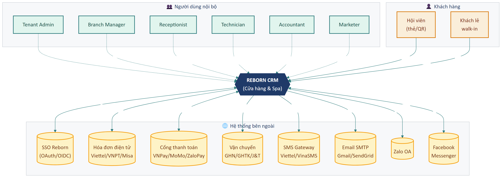

### 3.2. Actors (vai trò trong hệ thống)

URD dùng các Actor sau xuyên suốt:

| Actor | Mô tả | Quyền cốt lõi |
|-------|-------|---------------|
| **Khách (Guest)** | Người chưa đăng nhập | Không có (chỉ thấy trang login) |
| **Nhân viên (Staff)** | Đăng nhập với vai trò thường | Bán hàng, check-in, xem khách |
| **Lễ tân (Receptionist)** | Staff chuyên trực quầy | + mở/đóng ca, in hóa đơn |
| **Kỹ thuật viên (Technician)** | Staff cung cấp dịch vụ | + xem lịch của mình, trừ quota |
| **Kế toán (Accountant)** | Staff phụ trách tài chính | + thu chi, công nợ, đối soát |
| **Marketing (Marketer)** | Staff phụ trách MKT | + tạo chiến dịch, gửi mass message |
| **Quản lý cơ sở (Branch Manager)** | Quản lý cấp cơ sở | + xem báo cáo cơ sở, duyệt phiếu |
| **Quản lý tenant (Tenant Admin)** | Admin của đơn vị thuê | + cấu hình toàn cục, phân quyền |
| **Super Admin (Reborn)** | Đội Reborn vận hành SaaS | + quản lý nhiều tenant, monitor hệ thống |
| **Hệ thống (System)** | Tác nhân tự động (cron, automation) | Chạy job định kỳ, gửi notification |
| **Bên thứ ba (Third-party)** | API ngoại — payment, SMS, vận chuyển… | Webhook, callback |

### 3.3. Sơ đồ phân cấp Actor

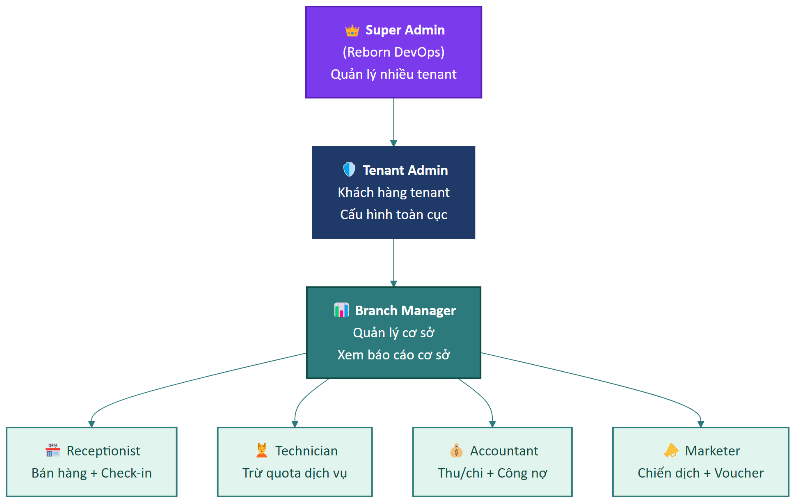

Mỗi cấp **kế thừa quyền** của cấp dưới (cấu hình ở Part 12).

## 4. Glossary — Thuật ngữ

| Thuật ngữ | Định nghĩa |
|-----------|------------|
| **Tenant** | Một đơn vị thuê hệ thống (1 doanh nghiệp khách hàng), có dữ liệu cô lập với tenant khác |
| **Cơ sở (Branch)** | Một điểm bán/cửa hàng vật lý của tenant. 1 tenant có thể có nhiều cơ sở |
| **Ca làm việc (Shift)** | Khoảng thời gian nhân viên trực quầy có ghi nhận dòng tiền độc lập |
| **POS** | Point of Sale — màn hình bán hàng tại quầy |
| **Quota** | Số lượt dịch vụ trong gói thành viên mà khách được dùng |
| **Gói thành viên (Plan)** | Sản phẩm bán theo dạng gói có thời hạn + quota dịch vụ |
| **Hạng thẻ (Tier)** | Cấp độ thành viên (Basic/Silver/Gold/Diamond) lên theo tổng chi tiêu |
| **MRR** | Monthly Recurring Revenue — doanh thu định kỳ hằng tháng |
| **AOV** | Average Order Value — giá trị đơn hàng trung bình |
| **ARPU** | Average Revenue Per User — doanh thu trung bình / khách |
| **Churn** | Khách rời bỏ hệ thống (không quay lại trong N ngày) |
| **Retention** | Tỷ lệ khách giữ chân được |
| **KOL** | Key Opinion Leader — người ảnh hưởng giới thiệu khách |
| **PO (đối tác)** | Purchase Order — đơn đặt hàng từ đại lý sỉ |
| **SLA** | Service Level Agreement — cam kết thời gian xử lý |
| **SSO** | Single Sign-On — đăng nhập một lần dùng cho nhiều ứng dụng |
| **2FA** | Two-Factor Authentication — xác thực hai bước |
| **Webhook** | Cơ chế callback HTTP từ hệ thống ra bên ngoài khi có sự kiện |
| **VAT** | Thuế giá trị gia tăng |
| **MST** | Mã số thuế |
| **NCC** | Nhà cung cấp |
| **NVL** | Nguyên vật liệu |
| **CRUD** | Create / Read / Update / Delete — 4 thao tác cơ bản trên dữ liệu |
| **MoSCoW** | Phương pháp xếp ưu tiên: Must / Should / Could / Won't |

## 5. Giả định & Ràng buộc

### 5.1. Giả định (Assumptions)

| ID | Giả định |
|----|----------|
| AS-01 | Mỗi tenant có ít nhất 1 cơ sở vật lý hoặc 1 cơ sở "ảo" để gán dữ liệu |
| AS-02 | Người dùng có máy tính chạy trình duyệt hiện đại (Chrome / Edge / Safari ≥ 2 phiên bản gần nhất) |
| AS-03 | Có internet ổn định khi vận hành (hệ thống không hỗ trợ offline) |
| AS-04 | Số điện thoại Việt Nam là phương tiện định danh chính của khách hàng |
| AS-05 | Tiền tệ mặc định là VND, có thể đổi sang USD/EUR cho các tenant quốc tế |
| AS-06 | Mọi dữ liệu nhạy cảm (mật khẩu, token, API key) được mã hóa khi lưu |
| AS-07 | Dữ liệu được backup định kỳ bởi đội Reborn (không phải tenant tự backup) |

### 5.2. Ràng buộc (Constraints)

| ID | Ràng buộc | Lý do |
|----|-----------|-------|
| CN-01 | Số điện thoại trong cùng một cơ sở phải duy nhất | Dùng làm khóa định danh khách |
| CN-02 | Một nhân viên không thể mở 2 ca cùng lúc trên cùng cơ sở | Tránh tranh chấp quỹ |
| CN-03 | Đơn hàng đã thanh toán không thể xóa, chỉ có thể hoàn / hủy | Bảo toàn audit trail |
| CN-04 | Hóa đơn VAT đã phát hành không sửa được, chỉ có thể hủy + phát hành lại | Theo quy định Tổng cục Thuế |
| CN-05 | Mật khẩu phải ≥ 8 ký tự, có chữ hoa + thường + số | Chính sách bảo mật |
| CN-06 | Phiếu đối soát thanh toán đã chốt không sửa được trong cùng kỳ | Audit |
| CN-07 | Trường tùy chỉnh (custom field) đã tạo không đổi mã (`fieldCode`) | Backend dùng làm khóa |
| CN-08 | Số lượng cơ sở / nhân viên / khách bị giới hạn theo gói SaaS đã thuê | Mô hình thương mại |

## 6. Cấu trúc tài liệu

URD chia thành **15 part**, được phân nhóm như sau:

- **Tổng quan** (Part này): mục đích, scope, actor, glossary
- **Chức năng** (Part 01–12): tương ứng 12 mục trên Menu chính
- **Phi chức năng** (Part 13): performance, security, usability, reliability
- **Tích hợp & dữ liệu** (Part 14): API, webhook, mô hình dữ liệu

Mỗi Part chức năng mở đầu bằng **mô tả phân hệ + danh sách actor liên quan**, rồi liệt kê **các yêu cầu (UR)** theo template chuẩn (xem README).

## 7. Lịch sử phiên bản

| Phiên bản | Ngày | Người soạn | Mô tả |
|-----------|------|------------|-------|
| 1.0 | 2026-04-14 | Reborn (reverse-engineered từ codebase + HDSD) | Bản đầu tiên, biên soạn ngược từ hệ thống đang chạy |

## 8. Phê duyệt

| Vai trò | Họ tên | Chữ ký | Ngày |
|---------|--------|--------|------|
| Đại diện Khách hàng | | | |
| PM Reborn | | | |
| Tech Lead Reborn | | | |
| QA Lead Reborn | | | |

---

*Hết Part 00.*

---

# Part 01 — Truy cập hệ thống

## Phạm vi

Phân hệ này bao phủ **truy cập, định danh, giao diện chung và Dashboard**. Đây là điểm chạm đầu tiên của mọi người dùng với hệ thống.

**Các module liên quan:** Login, SSO, Layout chung (Header/Sidebar), Dashboard, Switcher cơ sở, Menu người dùng.

**Actors chính:** Guest, Staff, Receptionist, Branch Manager, Tenant Admin.

---

## UR-ACCESS-01 — Đăng nhập qua SSO

| Trường | Nội dung |
|--------|----------|
| **ID** | UR-ACCESS-01 |
| **Tên** | Đăng nhập tập trung qua SSO |
| **Actor** | Guest, Staff, Branch Manager, Tenant Admin |
| **Mô tả** | Người dùng phải đăng nhập một lần qua trang SSO chung để truy cập CRM cũng như các sản phẩm khác trong hệ sinh thái Reborn. Sau khi đăng nhập, session phải được duy trì để chuyển qua lại giữa các sản phẩm mà không cần nhập lại mật khẩu. |
| **Tiền điều kiện** | Người dùng có tài khoản hợp lệ (do admin tenant tạo). |
| **Đầu vào** | • SĐT / Email / ID nhân viên<br>• Mật khẩu<br>• Tùy chọn "Ghi nhớ" |
| **Đầu ra** | • Token phiên được lưu vào cookie/localStorage<br>• Người dùng được chuyển vào trang mặc định (Dashboard hoặc landing tùy cấu hình)<br>• Nếu tài khoản có nhiều vai trò → hiện modal "Chọn vai trò" |
| **Tiêu chí chấp nhận** | 1. Đúng SĐT + đúng mật khẩu → đăng nhập thành công.<br>2. Sai mật khẩu → hiện thông báo lỗi rõ ràng, không tiết lộ tài khoản tồn tại hay không.<br>3. Tick "Ghi nhớ" → phiên kéo dài tối thiểu 7 ngày trên trình duyệt đó.<br>4. Đăng nhập một lần → mở các sản phẩm Reborn khác trong cùng SSO không cần nhập lại. |
| **Mức ưu tiên** | **M** — Must |
| **Ghi chú** | URL SSO mặc định `localhost:8080` cho dev, `https://sso.reborn.vn` cho production. Hỗ trợ cả `Đăng nhập với Google` và `Đăng nhập với AppHub`. |

---

## UR-ACCESS-02 — Đăng nhập đa vai trò

| Trường | Nội dung |
|--------|----------|
| **ID** | UR-ACCESS-02 |
| **Tên** | Chọn vai trò khi tài khoản có nhiều quyền |
| **Actor** | Staff có nhiều vai trò |
| **Mô tả** | Một tài khoản có thể được gán đồng thời nhiều vai trò ở nhiều cơ sở. Sau khi đăng nhập, hệ thống phải hỏi người dùng chọn vai trò + cơ sở muốn làm việc trong phiên hiện tại. |
| **Tiền điều kiện** | UR-ACCESS-01 đã thực hiện thành công. |
| **Đầu vào** | Lựa chọn vai trò và cơ sở từ danh sách. |
| **Đầu ra** | Phiên làm việc gắn với vai trò + cơ sở đã chọn; mọi truy vấn dữ liệu sau đó bị scope theo cơ sở đó. |
| **Tiêu chí chấp nhận** | 1. Tài khoản 1 vai trò, 1 cơ sở → bỏ qua bước này, vào thẳng Dashboard.<br>2. Tài khoản nhiều vai trò → hiện modal chọn.<br>3. Sau khi chọn, có thể đổi qua menu **Avatar → Vai trò**. |
| **Mức ưu tiên** | **M** |
| **Ghi chú** | Mặc định ghi nhớ vai trò + cơ sở đã chọn cho lần đăng nhập sau (cấu hình được). |

---

## UR-ACCESS-03 — Quên mật khẩu / Reset mật khẩu

| Trường | Nội dung |
|--------|----------|
| **ID** | UR-ACCESS-03 |
| **Tên** | Khôi phục mật khẩu |
| **Actor** | Staff (đã có tài khoản nhưng quên mật khẩu) |
| **Mô tả** | Người dùng phải có cách lấy lại quyền truy cập khi quên mật khẩu, qua kênh email hoặc SMS đã đăng ký với admin tenant. |
| **Tiền điều kiện** | Tài khoản tồn tại; có email hoặc SĐT hợp lệ. |
| **Đầu vào** | SĐT hoặc email đăng ký. |
| **Đầu ra** | • Email/SMS chứa link/OTP reset được gửi.<br>• Sau khi đặt lại, session cũ bị hủy. |
| **Tiêu chí chấp nhận** | 1. OTP/Link có hiệu lực ≤ 15 phút.<br>2. Mật khẩu mới phải khác mật khẩu cũ và đáp ứng chính sách (≥ 8 ký tự, hoa + thường + số).<br>3. Mọi phiên cũ trên thiết bị khác bị đăng xuất. |
| **Mức ưu tiên** | **M** |

---

## UR-ACCESS-04 — Đăng xuất an toàn

| Trường | Nội dung |
|--------|----------|
| **ID** | UR-ACCESS-04 |
| **Tên** | Đăng xuất khỏi hệ thống |
| **Actor** | Staff |
| **Mô tả** | Người dùng có nút Đăng xuất trong menu cá nhân. Sau khi đăng xuất, mọi token bị xóa, người dùng quay về trang đăng nhập. |
| **Tiêu chí chấp nhận** | 1. Bấm **Đăng xuất** → cookie/token bị xóa.<br>2. Bấm Back của trình duyệt sau đó → KHÔNG xem được dữ liệu nội bộ.<br>3. Nếu cấu hình SSO logout, mọi sản phẩm Reborn khác cũng bị đăng xuất theo. |
| **Mức ưu tiên** | **M** |

---

## UR-ACCESS-05 — Layout chung: Sidebar + Header

| Trường | Nội dung |
|--------|----------|
| **ID** | UR-ACCESS-05 |
| **Tên** | Cung cấp giao diện điều hướng nhất quán |
| **Actor** | Staff (mọi vai trò) |
| **Mô tả** | Mọi trang trong hệ thống phải có cùng thanh bên trái (Sidebar) chứa danh sách phân hệ, và thanh trên cùng (Header) chứa các công cụ chung: tìm kiếm toàn cục, switcher cơ sở, ngôn ngữ, thông báo, menu cá nhân. |
| **Tiêu chí chấp nhận** | 1. Sidebar hiển thị các nhóm phân hệ theo cấu hình tenant + vai trò người dùng.<br>2. Sidebar có nút **thu gọn** để tăng diện tích nội dung.<br>3. Mục đang truy cập được làm nổi bật trong sidebar.<br>4. Header hiển thị: tên gói thuê, tên cơ sở hiện tại, ngôn ngữ, chuông thông báo (kèm số chưa đọc), avatar.<br>5. Tìm kiếm toàn cục match với tên thành viên, mã đơn, mã sản phẩm, không phân biệt dấu/hoa thường. |
| **Mức ưu tiên** | **M** |

---

## UR-ACCESS-06 — Phân quyền theo Menu

| Trường | Nội dung |
|--------|----------|
| **ID** | UR-ACCESS-06 |
| **Tên** | Ẩn/hiện các mục Menu theo quyền của vai trò |
| **Actor** | Staff |
| **Mô tả** | Sidebar phải tự động ẩn các mục mà vai trò hiện tại không có quyền truy cập. Nếu người dùng cố vào URL trực tiếp, hệ thống chặn truy cập. |
| **Tiêu chí chấp nhận** | 1. Vai trò không có quyền `customer.view` → mục **Thành viên** không hiện trong sidebar.<br>2. Truy cập URL `/customer_list` trực tiếp → hiện trang 403 hoặc redirect về Dashboard.<br>3. Việc thay đổi quyền (Part 12) áp dụng ngay khi người dùng đăng nhập lại lần sau. |
| **Mức ưu tiên** | **M** |

---

## UR-ACCESS-07 — Chuyển đổi cơ sở

| Trường | Nội dung |
|--------|----------|
| **ID** | UR-ACCESS-07 |
| **Tên** | Đổi cơ sở làm việc trong phiên |
| **Actor** | Staff được gán nhiều cơ sở |
| **Mô tả** | Trên Header có dropdown cho phép đổi cơ sở. Mọi dữ liệu hiển thị (khách, đơn, kho, báo cáo…) sau đó tự lọc theo cơ sở mới. |
| **Tiêu chí chấp nhận** | 1. Dropdown chỉ liệt kê các cơ sở mà tài khoản được phép.<br>2. Sau khi đổi, mọi list/report tự refresh.<br>3. Cơ sở đang chọn được lưu vào session, dùng làm context mặc định. |
| **Mức ưu tiên** | **M** |

---

## UR-ACCESS-08 — Đa ngôn ngữ (i18n)

| Trường | Nội dung |
|--------|----------|
| **ID** | UR-ACCESS-08 |
| **Tên** | Hỗ trợ tiếng Việt và tiếng Anh |
| **Actor** | Staff |
| **Mô tả** | Người dùng có thể chọn ngôn ngữ giao diện. Lựa chọn ngôn ngữ được ghi nhớ cho lần đăng nhập sau. |
| **Tiêu chí chấp nhận** | 1. Tối thiểu 2 ngôn ngữ: Tiếng Việt (mặc định), English.<br>2. Đổi ngôn ngữ áp dụng ngay không cần reload trang.<br>3. Mọi label, button, message hệ thống đều đổi theo ngôn ngữ.<br>4. Định dạng số / ngày / tiền tệ đổi theo locale tương ứng. |
| **Mức ưu tiên** | **S** — Should |

---

## UR-ACCESS-09 — Thông báo trong app

| Trường | Nội dung |
|--------|----------|
| **ID** | UR-ACCESS-09 |
| **Tên** | Trung tâm thông báo cho người dùng |
| **Actor** | Staff |
| **Mô tả** | Hệ thống phải hiển thị các thông báo được gửi cho người dùng (đơn mới, yêu cầu phê duyệt, lịch sắp tới, alert quota…) ở chuông trên Header. Thông báo có badge số chưa đọc. |
| **Tiêu chí chấp nhận** | 1. Bấm chuông → mở dropdown danh sách thông báo, mới nhất ở trên.<br>2. Bấm vào một thông báo → điều hướng đến đối tượng liên quan + đánh dấu đã đọc.<br>3. Có nút **Đánh dấu tất cả đã đọc**.<br>4. Số trên badge cập nhật real-time hoặc near-real-time (poll ≤ 30 giây). |
| **Mức ưu tiên** | **S** |

---

## UR-ACCESS-10 — Dashboard tổng quan

| Trường | Nội dung |
|--------|----------|
| **ID** | UR-ACCESS-10 |
| **Tên** | Trang Dashboard hiển thị KPI tức thời |
| **Actor** | Staff (tùy quyền), Branch Manager |
| **Mô tả** | Sau khi đăng nhập, người dùng được đưa đến (hoặc có thể vào) trang Dashboard hiển thị các chỉ số quan trọng nhất theo cơ sở đang chọn. |
| **Đầu ra** | Hiển thị: số thành viên active vs giới hạn gói, lượt check-in hôm nay, số thành viên sắp hết hạn, doanh thu kỳ, biểu đồ top dịch vụ bán chạy, sự kiện sắp tới, cảnh báo quota, các nút truy cập nhanh. |
| **Tiêu chí chấp nhận** | 1. Mọi số liệu thuộc cơ sở đang chọn (UR-ACCESS-07).<br>2. Số liệu được tính từ dữ liệu thật, không hardcode.<br>3. Bấm vào một KPI → điều hướng đến trang chi tiết tương ứng.<br>4. Trang Dashboard load ≤ 3 giây với cơ sở < 10.000 khách. |
| **Mức ưu tiên** | **M** |

---

## UR-ACCESS-11 — Tìm kiếm toàn cục

| Trường | Nội dung |
|--------|----------|
| **ID** | UR-ACCESS-11 |
| **Tên** | Ô tìm kiếm trên Header |
| **Actor** | Staff |
| **Mô tả** | Người dùng có thể tìm nhanh khách hàng / sản phẩm / dịch vụ / đơn hàng từ ô tìm kiếm trên Header mà không cần vào từng phân hệ. |
| **Tiêu chí chấp nhận** | 1. Gõ ≥ 2 ký tự → hiện gợi ý dropdown (debounce 300ms).<br>2. Kết quả nhóm theo loại đối tượng (Khách / Đơn / Sản phẩm).<br>3. Bấm vào kết quả → điều hướng đến chi tiết.<br>4. Nhấn **Enter** → mở trang kết quả tìm kiếm đầy đủ. |
| **Mức ưu tiên** | **S** |

---

## UR-ACCESS-12 — Phiên hết hạn (Session Timeout)

| Trường | Nội dung |
|--------|----------|
| **ID** | UR-ACCESS-12 |
| **Tên** | Tự động đăng xuất khi không hoạt động |
| **Actor** | Hệ thống |
| **Mô tả** | Để bảo mật, sau N phút không có thao tác (cấu hình ở Part 11), phiên người dùng tự động hết hạn và yêu cầu đăng nhập lại. |
| **Tiêu chí chấp nhận** | 1. Mặc định N = 60 phút, có thể đổi 15–480 phút.<br>2. Trước khi hết hạn 2 phút, hệ thống hiện modal cảnh báo cho người dùng tiếp tục.<br>3. Khi hết hạn, mọi tác vụ đang gõ bị mất, người dùng phải đăng nhập lại.<br>4. Nếu tick "Ghi nhớ", thời gian này được nhân đôi. |
| **Mức ưu tiên** | **S** |

---

## Tóm tắt yêu cầu Part 01

| ID | Tên | Ưu tiên |
|----|-----|:-------:|
| UR-ACCESS-01 | Đăng nhập SSO | M |
| UR-ACCESS-02 | Chọn vai trò sau đăng nhập | M |
| UR-ACCESS-03 | Khôi phục mật khẩu | M |
| UR-ACCESS-04 | Đăng xuất an toàn | M |
| UR-ACCESS-05 | Layout chung Sidebar + Header | M |
| UR-ACCESS-06 | Phân quyền theo Menu | M |
| UR-ACCESS-07 | Chuyển đổi cơ sở | M |
| UR-ACCESS-08 | Đa ngôn ngữ Vi/En | S |
| UR-ACCESS-09 | Trung tâm thông báo | S |
| UR-ACCESS-10 | Dashboard tổng quan | M |
| UR-ACCESS-11 | Tìm kiếm toàn cục | S |
| UR-ACCESS-12 | Session Timeout | S |

**Tổng:** 12 yêu cầu — 8 Must, 4 Should.

---

*Hết Part 01.*

---

# Part 02 — Lễ tân

## Phạm vi

Phân hệ **Lễ tân** là hub vận hành hằng ngày tại quầy. Bao gồm 4 module: **Quản lý ca làm việc**, **Bán hàng tại quầy (POS)**, **Check-in/Cửa vào**, **Trừ quota dịch vụ**.

**Actors chính:** Receptionist (chính), Branch Manager (giám sát), Technician (trừ quota).

**Phụ thuộc nghiệp vụ:**
- Để bán hàng → phải có ca đang mở.
- Để check-in → khách phải có gói thành viên còn hạn.
- Để trừ quota → khách phải có quota còn dư trong gói.

### Sơ đồ Use Case

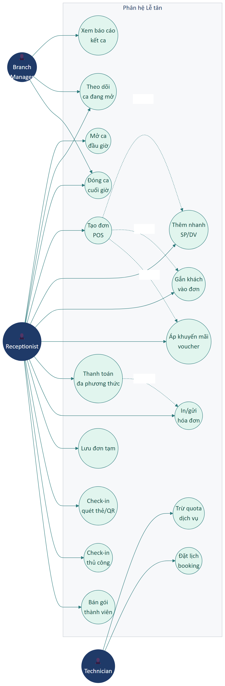

### Vòng đời Ca làm việc (State Machine)

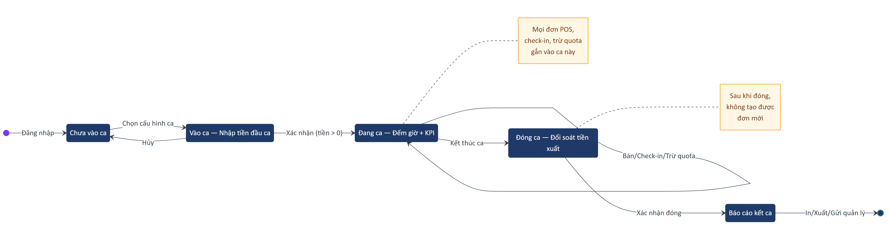

### Workflow một ngày làm việc

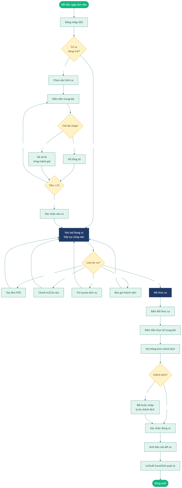

---

## A. Quản lý ca làm việc

### UR-RECEPTION-01 — Mở ca đầu giờ

| Trường | Nội dung |
|--------|----------|
| **ID** | UR-RECEPTION-01 |
| **Tên** | Cho phép nhân viên mở ca làm việc |
| **Actor** | Receptionist |
| **Mô tả** | Trước khi bán hàng, nhân viên phải mở một ca làm việc bằng cách chọn cấu hình ca (đã setup trước ở Part 11) và khai báo số tiền mặt thực tế đang có trong két. |
| **Tiền điều kiện** | • Đã đăng nhập (UR-ACCESS-01).<br>• Đang ở cơ sở có cấu hình ca.<br>• Không có ca khác đang mở của chính mình tại cơ sở này (CN-02). |
| **Đầu vào** | Chọn cấu hình ca + nhập tiền đầu ca theo 1 trong 2 chế độ:<br>• **Tổng tiền**: 1 ô số duy nhất<br>• **Theo mệnh giá**: bảng 9 mệnh giá VNĐ (500k → 1k) với số tờ |
| **Ràng buộc đầu vào** | • Tiền > 0 (bắt buộc)<br>• Số nguyên, không thập phân<br>• Format hiển thị có dấu phẩy ngăn cách nghìn |
| **Đầu ra** | • Trạng thái cơ sở: có ca đang mở, gắn với userId<br>• Lưu thời điểm bắt đầu, người mở, tiền đầu ca<br>• Người dùng được chuyển sang tab "Đang ca" |
| **Tiêu chí chấp nhận** | 1. Bỏ trống tiền → báo lỗi *"Vui lòng nhập số tiền đầu ca"*.<br>2. Tiền = 0 → cho phép nếu cấu hình ca cho phép, ngược lại báo lỗi.<br>3. Sau khi mở, các tác vụ Bán hàng, Check-in, Trừ quota mới được phép.<br>4. Nếu đã có ca đang mở của user này → không cho mở thêm, redirect về tab "Đang ca". |
| **Mức ưu tiên** | **M** |

### UR-RECEPTION-02 — Theo dõi ca đang mở

| Trường | Nội dung |
|--------|----------|
| **ID** | UR-RECEPTION-02 |
| **Tên** | Hiển thị trạng thái thời gian thực của ca |
| **Actor** | Receptionist, Branch Manager |
| **Mô tả** | Trong khi ca đang mở, người dùng phải xem được: thời gian đã trôi, tiền đầu ca, tổng thu thực tế trong ca, tổng tất cả phương thức thanh toán, chênh lệch (sẽ tính lúc đóng ca). Có nút truy cập nhanh đến POS và danh sách đơn trong ca. |
| **Tiêu chí chấp nhận** | 1. Đồng hồ đếm giờ định dạng `HH:MM:SS`, refresh mỗi giây.<br>2. Các thẻ KPI cập nhật real-time hoặc near-real-time (≤ 30s) sau mỗi giao dịch.<br>3. Có nút **Bán hàng tại POS** mở thẳng /create_sale_add.<br>4. Có nút **Danh sách đơn trong ca** chuyển sang tab Đơn trong ca.<br>5. Có nút **Kết thúc ca** (đỏ) để chuyển sang flow đóng ca. |
| **Mức ưu tiên** | **M** |

### UR-RECEPTION-03 — Xem đơn trong ca

| Trường | Nội dung |
|--------|----------|
| **ID** | UR-RECEPTION-03 |
| **Tên** | Liệt kê các đơn được tạo trong ca hiện tại |
| **Actor** | Receptionist |
| **Mô tả** | Người dùng có thể xem nhanh tất cả đơn đã tạo từ lúc mở ca, kèm các chỉ số tổng (số đơn, tổng doanh thu, công nợ phát sinh, giờ trung bình giữa các đơn). |
| **Tiêu chí chấp nhận** | 1. Filter theo trạng thái thanh toán + trạng thái xử lý.<br>2. Search theo mã đơn.<br>3. Bấm vào đơn → mở chi tiết đơn (như Part 04).<br>4. Khi chưa có đơn → empty state thân thiện. |
| **Mức ưu tiên** | **S** |

### UR-RECEPTION-04 — Đóng ca cuối giờ

| Trường | Nội dung |
|--------|----------|
| **ID** | UR-RECEPTION-04 |
| **Tên** | Đóng ca và đối soát quỹ |
| **Actor** | Receptionist, Branch Manager |
| **Mô tả** | Cuối ca, nhân viên phải kiểm két thực tế, nhập số tiền hệ thống tính được vs số tiền thực tế, ghi chú chênh lệch nếu có. |
| **Đầu vào** | Tiền mặt xuất ca (theo tổng hoặc mệnh giá) + ghi chú lý do nếu chênh lệch ≠ 0. |
| **Đầu ra** | • Ca chuyển sang trạng thái "Đã đóng".<br>• Sinh báo cáo kết ca.<br>• Sau khi đóng, không thể tạo đơn mới với ca này.<br>• Mọi giao dịch tiền mặt được "chốt" vào ca. |
| **Tiêu chí chấp nhận** | 1. Chênh lệch ≠ 0 → bắt buộc nhập ghi chú lý do.<br>2. Cho phép đóng ca có chênh lệch (không chặn cứng) nhưng audit lại.<br>3. Sau khi đóng, hệ thống tự chuyển sang tab Báo cáo kết ca.<br>4. Người dùng không thể "mở lại" ca đã đóng (chỉ admin tenant có quyền force-reopen, nếu được cấp). |
| **Mức ưu tiên** | **M** |

### UR-RECEPTION-05 — Báo cáo kết ca

| Trường | Nội dung |
|--------|----------|
| **ID** | UR-RECEPTION-05 |
| **Tên** | Sinh báo cáo chi tiết sau đóng ca |
| **Actor** | Receptionist, Branch Manager |
| **Mô tả** | Sau khi đóng ca, hệ thống tự sinh báo cáo gồm: 4 chỉ số tổng (Tiền mặt / NH / Thẻ / Ví), bảng chi tiết các khoản, thông tin ca (mã ca, ngày, giờ vào/ra, nhân viên, chênh lệch). |
| **Tiêu chí chấp nhận** | 1. Có nút **In bảng cáo** (in trực tiếp ra máy in).<br>2. Có nút **Xuất Excel** tải `.xlsx`.<br>3. Có nút **Gửi Quản lý** đẩy báo cáo vào hộp thư của người quản lý cơ sở.<br>4. Báo cáo lưu vĩnh viễn, có thể tra cứu sau qua **Báo cáo tổng quan**. |
| **Mức ưu tiên** | **M** |

### UR-RECEPTION-06 — Báo cáo tổng quan ca

| Trường | Nội dung |
|--------|----------|
| **ID** | UR-RECEPTION-06 |
| **Tên** | Thống kê tổng hợp các ca đã đóng |
| **Actor** | Branch Manager, Tenant Admin |
| **Mô tả** | Quản lý phải xem được tổng hợp các ca đã đóng theo ngày/tuần/tháng: số ca, số nhân viên trực, chênh lệch tích lũy, hiện trạng ca đang mở. |
| **Tiêu chí chấp nhận** | 1. Filter theo cơ sở, theo nhân viên, theo kỳ.<br>2. Bấm vào một ca → mở báo cáo kết ca chi tiết của ca đó.<br>3. Xuất Excel tổng hợp. |
| **Mức ưu tiên** | **S** |

---

## B. Bán hàng tại quầy (POS)

### UR-RECEPTION-07 — Tạo đơn bán hàng tại POS

| Trường | Nội dung |
|--------|----------|
| **ID** | UR-RECEPTION-07 |
| **Tên** | Bán sản phẩm/dịch vụ qua màn POS |
| **Actor** | Receptionist |
| **Mô tả** | Nhân viên có một màn hình POS chia 2 cột: bên trái là lưới sản phẩm/dịch vụ có lọc theo danh mục + ô tìm kiếm + máy quét mã vạch; bên phải là giỏ hàng + thông tin khách + nút thanh toán. |
| **Tiền điều kiện** | Có ca đang mở (UR-RECEPTION-01). |
| **Tiêu chí chấp nhận** | 1. Lưới sản phẩm hiển thị tên, ảnh, giá, badge khuyến mãi.<br>2. Bấm card → thêm vào giỏ; nếu có biến thể → mở modal chọn biến thể.<br>3. Trong giỏ: cho phép thay đổi số lượng, xóa món.<br>4. Tự động tính tổng tiền hàng + thuế + chiết khấu = tổng thanh toán.<br>5. Hỗ trợ máy quét mã vạch (cắm USB) — focus vào ô tìm + quét → sản phẩm tự nhảy vào giỏ. |
| **Mức ưu tiên** | **M** |

### UR-RECEPTION-08 — Thêm nhanh sản phẩm/dịch vụ

| Trường | Nội dung |
|--------|----------|
| **ID** | UR-RECEPTION-08 |
| **Tên** | Quick Add — thêm mặt hàng phát sinh không có trong danh mục |
| **Actor** | Receptionist |
| **Mô tả** | Khi khách yêu cầu một dịch vụ/phụ thu chưa có trong danh mục, nhân viên có thể thêm nhanh trực tiếp vào giỏ mà không phải tạo trong danh mục chính. |
| **Đầu vào** | Tên (bắt buộc, không trống), Đơn giá (bắt buộc, > 0), Đơn vị (chọn từ 10 lựa chọn: Cái/Chiếc/Hộp/Kg/Gram/Lít/Bộ/Dịch vụ/Giờ/Lần). |
| **Tiêu chí chấp nhận** | 1. Validation đầy đủ với thông báo lỗi rõ ràng.<br>2. Mặt hàng quick add KHÔNG được lưu vào danh mục chính.<br>3. Mặt hàng quick add KHÔNG trừ tồn kho.<br>4. Có preview trước khi xác nhận thêm vào giỏ. |
| **Mức ưu tiên** | **S** |
| **Ghi chú** | Để phân biệt với sản phẩm chính, ID có prefix `quick_`. |

### UR-RECEPTION-09 — Gắn khách vào đơn POS

| Trường | Nội dung |
|--------|----------|
| **ID** | UR-RECEPTION-09 |
| **Tên** | Liên kết khách hàng với đơn để tích điểm + lịch sử |
| **Actor** | Receptionist |
| **Mô tả** | Khi đơn bán cho hội viên, nhân viên có thể tìm khách hiện có hoặc thêm mới ngay trong giỏ hàng (qua slide panel "Thêm nhanh thành viên"). |
| **Tiêu chí chấp nhận** | 1. Search khách theo tên/SĐT/mã, có debounce.<br>2. Hiển thị card khách kèm tên, gói, công nợ, điểm tích lũy hiện tại.<br>3. Có nút **+ Thêm mới** mở slide panel với form ngắn (xem UR-MEMBER-02).<br>4. Sau khi gắn khách, đơn được ghi nhận vào lịch sử của khách. |
| **Mức ưu tiên** | **M** |

### UR-RECEPTION-10 — Áp dụng khuyến mãi/voucher cho đơn

| Trường | Nội dung |
|--------|----------|
| **ID** | UR-RECEPTION-10 |
| **Tên** | Áp khuyến mãi và voucher giấy lên đơn POS |
| **Actor** | Receptionist |
| **Mô tả** | Trong giỏ hàng, có nút mở modal khuyến mãi liệt kê các chương trình KM đủ điều kiện và chưa đủ điều kiện; có ô nhập mã voucher rời. |
| **Tiêu chí chấp nhận** | 1. Modal hiện 2 nhóm rõ ràng: **Đủ điều kiện** + **Chưa đủ điều kiện** (kèm lý do).<br>2. Bấm **Chọn** → áp KM → giỏ cập nhật dòng giảm giá.<br>3. Voucher sai/hết hạn/đã dùng → hiện thông báo lỗi cụ thể.<br>4. Có thể áp đồng thời nhiều KM nếu cấu hình cho phép (xem UR-MKT-01). |
| **Mức ưu tiên** | **S** |

### UR-RECEPTION-11 — Thanh toán đa phương thức

| Trường | Nội dung |
|--------|----------|
| **ID** | UR-RECEPTION-11 |
| **Tên** | Hỗ trợ nhiều phương thức thanh toán trong cùng một đơn |
| **Actor** | Receptionist |
| **Mô tả** | Modal thanh toán cho phép chọn nhiều phương thức cùng lúc (vd nửa cash, nửa CK), tính tiền thừa, tùy chọn ghi nợ. |
| **Đầu vào** | Phương thức + số tiền cho mỗi phương thức + tùy chọn ghi nợ + ghi chú. |
| **Tiêu chí chấp nhận** | 1. Cho phép thanh toán Tiền mặt / Chuyển khoản / Thẻ / Ví điện tử (theo cấu hình tenant).<br>2. Tổng tiền các phương thức = Tổng đơn (nếu không ghi nợ) hoặc < Tổng đơn (nếu ghi nợ).<br>3. Tự tính tiền thừa với tiền mặt.<br>4. Khi ghi nợ → BẮT BUỘC đã gắn khách vào đơn (UR-RECEPTION-09).<br>5. Sau khi xác nhận → in hóa đơn, reset giỏ, sẵn sàng cho đơn mới. |
| **Mức ưu tiên** | **M** |

### UR-RECEPTION-12 — Lưu đơn tạm

| Trường | Nội dung |
|--------|----------|
| **ID** | UR-RECEPTION-12 |
| **Tên** | Lưu đơn nháp để xử lý sau |
| **Actor** | Receptionist |
| **Mô tả** | Khi khách bỏ ngang hoặc nhân viên cần xử lý khách khác trước, có thể lưu giỏ hàng hiện tại làm đơn tạm và tiếp tục sau. |
| **Tiêu chí chấp nhận** | 1. Đơn tạm KHÔNG trừ tồn, KHÔNG ghi doanh thu.<br>2. Có tab riêng **Đơn tạm** để xem danh sách.<br>3. Bấm **Tiếp tục** → load lại giỏ vào màn POS.<br>4. Đơn tạm tự xóa sau N ngày không xử lý (cấu hình ở Part 11). |
| **Mức ưu tiên** | **S** |

### UR-RECEPTION-13 — In hóa đơn nhiệt / A4

| Trường | Nội dung |
|--------|----------|
| **ID** | UR-RECEPTION-13 |
| **Tên** | In hóa đơn sau thanh toán |
| **Actor** | Receptionist |
| **Mô tả** | Sau khi xác nhận thanh toán, hệ thống mở dialog in hóa đơn theo khổ giấy đã cấu hình (A4 / A5 / 80mm / 58mm). Có thể gửi qua SMS/Email thay vì in. |
| **Tiêu chí chấp nhận** | 1. Hóa đơn chứa: header tenant, mã đơn, ngày giờ, tên nhân viên, danh sách item, tổng tiền, phương thức thanh toán, footer, QR tra cứu (nếu bật).<br>2. Hỗ trợ in trực tiếp qua máy in nhiệt 80mm/58mm.<br>3. Tùy chọn gửi PDF qua email khách.<br>4. Tùy chọn gửi link tra cứu qua SMS. |
| **Mức ưu tiên** | **M** |

---

## C. Check-in / Cửa vào

### UR-RECEPTION-14 — Check-in qua quét thẻ/QR

| Trường | Nội dung |
|--------|----------|
| **ID** | UR-RECEPTION-14 |
| **Tên** | Ghi nhận khách đến qua thiết bị đọc thẻ/QR |
| **Actor** | Receptionist |
| **Mô tả** | Khách hội viên đến cơ sở quét thẻ RFID hoặc QR trên app điện thoại để check-in. Hệ thống hiện popup thông tin khách + quota còn lại. |
| **Tiêu chí chấp nhận** | 1. Hỗ trợ thiết bị đọc USB tiêu chuẩn HID (giả lập gõ phím).<br>2. Popup hiện: avatar, tên, gói thành viên, ngày hết hạn, danh sách quota theo dịch vụ.<br>3. Trạng thái thẻ:<br>   • ✅ Active → cho phép check-in<br>   • ⚠️ Sắp hết hạn / sắp hết quota → cho phép nhưng cảnh báo<br>   • ❌ Expired → chặn, gợi ý gia hạn.<br>4. Có nút giả lập quét cho môi trường test/đào tạo. |
| **Mức ưu tiên** | **M** |

### UR-RECEPTION-15 — Check-in thủ công

| Trường | Nội dung |
|--------|----------|
| **ID** | UR-RECEPTION-15 |
| **Tên** | Tìm khách thủ công khi không có thẻ |
| **Actor** | Receptionist |
| **Mô tả** | Khi khách quên thẻ / điện thoại hết pin, nhân viên có thể tìm khách bằng SĐT, tên, mã thành viên trong ô **Tìm thủ công**. |
| **Tiêu chí chấp nhận** | 1. Search có debounce.<br>2. Nhiều kết quả → list chọn.<br>3. Sau khi chọn → popup giống quét thẻ. |
| **Mức ưu tiên** | **M** |

### UR-RECEPTION-16 — Chọn khu vực sử dụng dịch vụ

| Trường | Nội dung |
|--------|----------|
| **ID** | UR-RECEPTION-16 |
| **Tên** | Phân loại check-in theo khu vực |
| **Actor** | Receptionist |
| **Mô tả** | Sau khi xác nhận khách, nhân viên chọn khu vực khách sẽ vào (Co-working / Spa / Phòng riêng / khác). Hệ thống ghi nhận để báo cáo lưu lượng. |
| **Tiêu chí chấp nhận** | 1. Danh sách khu vực do tenant cấu hình.<br>2. Mỗi check-in có 1 record với (khách, khu vực, hướng IN/OUT, thời gian, người ghi nhận).<br>3. Có thể check-out (ghi nhận khách rời) bằng nút riêng. |
| **Mức ưu tiên** | **S** |

### UR-RECEPTION-17 — Lịch sử check-in gần đây

| Trường | Nội dung |
|--------|----------|
| **ID** | UR-RECEPTION-17 |
| **Tên** | Hiển thị các lượt check-in gần nhất |
| **Actor** | Receptionist |
| **Mô tả** | Trên màn check-in, phần dưới hiển thị 15 lượt check-in/check-out gần nhất trong ngày hiện tại để nhân viên biết ai đang ở trong cơ sở. |
| **Tiêu chí chấp nhận** | 1. Mỗi dòng: giờ, tên, hướng (▶ Vào / ◀ Ra), khu vực.<br>2. Cập nhật real-time hoặc poll ≤ 30 giây. |
| **Mức ưu tiên** | **C** — Could |

---

## D. Trừ quota dịch vụ

### UR-RECEPTION-18 — Trừ một suất dịch vụ trong gói

| Trường | Nội dung |
|--------|----------|
| **ID** | UR-RECEPTION-18 |
| **Tên** | Ghi nhận khách đã sử dụng 1 suất dịch vụ trong gói |
| **Actor** | Receptionist, Technician |
| **Mô tả** | Sau khi khách dùng xong dịch vụ thuộc gói thành viên (vd 1 lần massage), nhân viên trừ suất khỏi quota. |
| **Tiền điều kiện** | Khách có gói còn hiệu lực + dịch vụ đó còn quota > 0. |
| **Tiêu chí chấp nhận** | 1. Tìm khách → chọn dịch vụ từ lưới icon → bấm **Xác nhận trừ quota**.<br>2. Nếu quota dịch vụ đó = 0 → nút bị mờ, không cho thực hiện.<br>3. Hệ thống ghi log: khách, dịch vụ, thời gian, người trừ.<br>4. Quota của khách giảm 1 ngay lập tức trong hệ thống.<br>5. Toast confirm sau khi thành công. |
| **Mức ưu tiên** | **M** |

### UR-RECEPTION-19 — Đặt lịch booking

| Trường | Nội dung |
|--------|----------|
| **ID** | UR-RECEPTION-19 |
| **Tên** | Đặt slot giờ cho dịch vụ có lịch |
| **Actor** | Receptionist, Technician |
| **Mô tả** | Cho các dịch vụ cần giữ slot giờ (massage 60 phút, lớp yoga…), nhân viên chọn dịch vụ → xem lưới slot trống → đặt cho khách cụ thể. |
| **Tiêu chí chấp nhận** | 1. Lưới slot hiển thị theo ngày + theo dịch vụ.<br>2. Slot trống có thể đặt; slot đã có khách hiển thị tên khách (read-only).<br>3. Đặt thành công → khi khách đến đúng giờ, check-in bình thường (UR-RECEPTION-14).<br>4. Có thể hủy đặt nếu chưa đến giờ. |
| **Mức ưu tiên** | **S** |

### UR-RECEPTION-20 — Bán thẻ / gói thành viên tại quầy

| Trường | Nội dung |
|--------|----------|
| **ID** | UR-RECEPTION-20 |
| **Tên** | POS-style để bán gói thành viên cho khách mới/gia hạn |
| **Actor** | Receptionist |
| **Mô tả** | Màn riêng để bán gói thành viên: lưới các gói (đã định nghĩa ở Part 11) bên trái + cột thanh toán bên phải gồm chọn khách + chọn gói + phương thức thanh toán. |
| **Tiêu chí chấp nhận** | 1. Mỗi card gói hiển thị: tên, giá, thời hạn, mô tả ngắn, danh sách dịch vụ kèm + quota.<br>2. Có thể chọn khách hiện có hoặc tạo mới qua slide panel.<br>3. Sau khi xác nhận → tạo thẻ mới (hoặc gia hạn thẻ cũ), cộng quota dịch vụ, in hóa đơn.<br>4. Toast hiển thị: tên gói, giá, thời hạn. |
| **Mức ưu tiên** | **M** |

---

## Tóm tắt yêu cầu Part 02

| ID | Tên | Ưu tiên |
|----|-----|:-------:|
| UR-RECEPTION-01 | Mở ca đầu giờ | M |
| UR-RECEPTION-02 | Theo dõi ca đang mở | M |
| UR-RECEPTION-03 | Xem đơn trong ca | S |
| UR-RECEPTION-04 | Đóng ca cuối giờ | M |
| UR-RECEPTION-05 | Báo cáo kết ca | M |
| UR-RECEPTION-06 | Báo cáo tổng quan ca | S |
| UR-RECEPTION-07 | Tạo đơn POS | M |
| UR-RECEPTION-08 | Quick add sản phẩm | S |
| UR-RECEPTION-09 | Gắn khách vào đơn | M |
| UR-RECEPTION-10 | Áp khuyến mãi/voucher | S |
| UR-RECEPTION-11 | Thanh toán đa phương thức | M |
| UR-RECEPTION-12 | Lưu đơn tạm | S |
| UR-RECEPTION-13 | In hóa đơn | M |
| UR-RECEPTION-14 | Check-in quét thẻ/QR | M |
| UR-RECEPTION-15 | Check-in thủ công | M |
| UR-RECEPTION-16 | Chọn khu vực check-in | S |
| UR-RECEPTION-17 | Lịch sử check-in gần đây | C |
| UR-RECEPTION-18 | Trừ quota dịch vụ | M |
| UR-RECEPTION-19 | Đặt lịch booking | S |
| UR-RECEPTION-20 | Bán gói thành viên | M |

**Tổng:** 20 yêu cầu — 11 Must, 8 Should, 1 Could.

---

*Hết Part 02.*

---

# Part 03 — Quản lý Thành viên

## Phạm vi

Phân hệ **Quản lý Thành viên** là kho dữ liệu khách hàng trung tâm. Bao phủ CRUD khách, tìm kiếm/lọc nâng cao, import/export, hồ sơ chi tiết, các danh mục liên quan (thẻ, nhóm, nguồn, nghề nghiệp, mối quan hệ, trường tùy chỉnh), và cấu trúc hiển thị.

**Actors chính:** Receptionist (xem/tạo nhanh), Marketer (lọc/xuất), Branch Manager (xem chi tiết), Tenant Admin (cấu hình danh mục).

**Phụ thuộc nghiệp vụ:**
- Phần lớn các phân hệ khác (POS, Check-in, Hóa đơn, Marketing) đều tham chiếu đến khách hàng → đây là phân hệ "nền".

### Sơ đồ Use Case

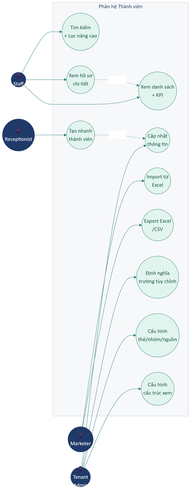

---

## A. Quản lý danh sách thành viên

### UR-MEMBER-01 — Danh sách thành viên với KPI

| Trường | Nội dung |
|--------|----------|
| **ID** | UR-MEMBER-01 |
| **Tên** | Hiển thị danh sách + chỉ số tổng hợp |
| **Actor** | Staff (theo quyền) |
| **Mô tả** | Trang chính phải hiển thị danh sách thành viên dạng bảng có phân trang, kèm thanh KPI: tổng thành viên, thành viên mới trong kỳ, tổng doanh thu liên quan, thành viên sắp hết hạn. |
| **Tiêu chí chấp nhận** | 1. Bảng có cột: STT, Họ tên + avatar, Mã thành viên/Nhóm, Hạng/Tag, Công nợ, Điểm tích lũy, Số đơn hàng.<br>2. Phân trang server-side, mặc định 10/trang.<br>3. Sắp xếp được theo từng cột (asc/desc).<br>4. KPI tự refresh sau khi có thao tác CRUD.<br>5. Dữ liệu scope theo cơ sở đang chọn (UR-ACCESS-07). |
| **Mức ưu tiên** | **M** |

### UR-MEMBER-02 — Tạo nhanh thành viên

| Trường | Nội dung |
|--------|----------|
| **ID** | UR-MEMBER-02 |
| **Tên** | Slide panel thêm nhanh |
| **Actor** | Receptionist, Staff |
| **Mô tả** | Cung cấp slide panel ngắn để thêm khách trong < 10 giây với các trường tối thiểu: tên, SĐT, email tùy chọn, giới tính, ghi chú. Hỗ trợ 2 loại: Cá nhân và Doanh nghiệp. |
| **Đầu vào — Cá nhân** | • **Họ tên** (bắt buộc, text, trim space)<br>• **Số điện thoại** (bắt buộc, regex VN/quốc tế)<br>• **Email** (tùy chọn, regex email)<br>• **Giới tính** (radio Nam/Nữ/Khác)<br>• **Ghi chú** (textarea ≤ 500) |
| **Đầu vào — Doanh nghiệp** | Như Cá nhân nhưng đổi "Họ tên" → "Tên công ty", không có Giới tính. |
| **Tiêu chí chấp nhận** | 1. Validation client-side ngay khi rời khỏi ô.<br>2. Bỏ trống tên → toast *"Vui lòng nhập tên thành viên"*.<br>3. Bỏ trống SĐT → toast *"Vui lòng nhập số điện thoại"*.<br>4. SĐT trùng trong cùng cơ sở → backend trả lỗi *"Số điện thoại đã tồn tại"*.<br>5. Có nút **Nhập đầy đủ →** chuyển sang form chi tiết (UR-MEMBER-04).<br>6. Sau khi tạo thành công → khách xuất hiện ở đầu danh sách. |
| **Mức ưu tiên** | **M** |

### UR-MEMBER-03 — Tìm kiếm và lọc nâng cao

| Trường | Nội dung |
|--------|----------|
| **ID** | UR-MEMBER-03 |
| **Tên** | Tìm và lọc danh sách thành viên |
| **Actor** | Staff |
| **Mô tả** | Người dùng có thể tìm kiếm tự do (tên/SĐT/mã/email) và lọc theo nhiều điều kiện đồng thời (trạng thái, nhóm, badge nhanh, nguồn, người phụ trách, trường tùy chỉnh). |
| **Tiêu chí chấp nhận** | 1. Search debounce 300ms, không phân biệt dấu/hoa thường.<br>2. Badge nhanh: 🏷️ Nhóm, ⭐ VIP, 🔴 Có nợ, 📅 Mới (N ngày).<br>3. Modal **Lọc nâng cao** cho phép tổ hợp nhiều điều kiện.<br>4. Bộ lọc đã áp hiển thị thành chip có thể bỏ riêng.<br>5. Lọc xong, có thể **Xuất danh sách** (UR-MEMBER-08) chỉ phần đã lọc. |
| **Mức ưu tiên** | **M** |

### UR-MEMBER-04 — Hồ sơ chi tiết thành viên

| Trường | Nội dung |
|--------|----------|
| **ID** | UR-MEMBER-04 |
| **Tên** | Trang chi tiết với toàn bộ thông tin và lịch sử |
| **Actor** | Staff (theo quyền), Branch Manager |
| **Mô tả** | Trang chi tiết hiển thị toàn bộ thông tin hồ sơ + các tab nội dung: Hóa đơn mua, Thẻ dịch vụ, Lịch hẹn, Công việc chăm sóc, Lịch sử giao tiếp, Ghi chú. |
| **Cấu trúc trường** | Xem mục B bên dưới (UR-MEMBER-05 → UR-MEMBER-08 chi tiết các nhóm trường). |
| **Tiêu chí chấp nhận** | 1. Cột trái (≈30%) hiển thị thông tin cơ bản + tag.<br>2. Cột phải (≈70%) là vùng tab.<br>3. Trên cùng có 5 nút hành động nhanh: Đặt lịch hẹn, Tạo công việc, Call, Email, SMS.<br>4. Mọi thay đổi phải qua form sửa, không inline edit (trừ tag).<br>5. Audit trail: ghi log mọi thay đổi quan trọng. |
| **Mức ưu tiên** | **M** |

### UR-MEMBER-05 — Trường thông tin cơ bản

| Trường | Nội dung |
|--------|----------|
| **ID** | UR-MEMBER-05 |
| **Tên** | Validation các trường cốt lõi của hồ sơ thành viên |
| **Actor** | Staff |
| **Mô tả** | Các trường sau phải có trên form hồ sơ chi tiết với validation đầy đủ. |
| **Danh sách trường** | • **Phân loại**: Cá nhân / Doanh nghiệp (M, không đổi sau khi tạo)<br>• **Loại thành viên**: Nội bộ / Ngoài (S)<br>• **Chi nhánh** (M, chỉ admin đổi được)<br>• **Tên** (M, text)<br>• **Mã thành viên** (S, có thể tự sinh theo cấu hình)<br>• **Số điện thoại** (M, regex, có icon ẩn/hiện)<br>• **Email** (S, regex, có icon ẩn/hiện)<br>• **Giới tính** (M, radio)<br>• **Ngày sinh** (S, date)<br>• **Địa chỉ** (S, text)<br>• **Chiều cao (cm)** (C, number) — cho spa/fitness<br>• **Cân nặng (kg)** (C, number) — cho spa/fitness |
| **Tiêu chí chấp nhận** | 1. Mỗi trường hiển thị icon `*` đỏ nếu bắt buộc.<br>2. SĐT/Email có icon con mắt ẩn/hiện, chỉ dùng được nếu vai trò có quyền `customer.viewPhone` / `customer.viewEmail`.<br>3. Sai regex → hiện thông báo dưới ô input ngay khi rời khỏi ô.<br>4. Submit lỗi → focus về ô đầu tiên bị lỗi. |
| **Mức ưu tiên** | **M** |

### UR-MEMBER-06 — Trường thông tin bổ sung (cố định)

| Trường | Nội dung |
|--------|----------|
| **ID** | UR-MEMBER-06 |
| **Tên** | Các trường mở rộng trong nhóm "Thông tin bổ sung" |
| **Actor** | Staff |
| **Mô tả** | Form chi tiết phải có nhóm "Thông tin bổ sung" với các trường có sẵn (không phải custom field). |
| **Danh sách trường** | • **Điện thoại người giới thiệu** (S, regex)<br>• **Nguồn thành viên** (S, select từ danh mục Nguồn)<br>• **Nghề nghiệp** (S, multi-select từ danh mục Nghề)<br>• **Nhóm thành viên** (S, select từ danh mục Nhóm)<br>• **Người phụ trách** (S, select nhân viên)<br>• **Tình trạng cuộc gọi đầu tiên** (C, text)<br>• **Thành viên liên quan** (C, multi-select khách kèm loại quan hệ) |
| **Mức ưu tiên** | **S** |

### UR-MEMBER-07 — Trường tùy chỉnh động

| Trường | Nội dung |
|--------|----------|
| **ID** | UR-MEMBER-07 |
| **Tên** | Hỗ trợ trường tùy chỉnh do tenant định nghĩa |
| **Actor** | Tenant Admin (cấu hình), Staff (nhập dữ liệu) |
| **Mô tả** | Tenant có thể tự định nghĩa các trường mở rộng (custom fields) cho hồ sơ khách. Form chi tiết tự động hiển thị các trường này theo cấu hình. |
| **Tiêu chí chấp nhận** | 1. Hỗ trợ kiểu: Text / Number / Date / Select / Multi-select / Radio / Checkbox / Textarea / File upload.<br>2. Trường được tag là "Bắt buộc" → form yêu cầu điền khi submit.<br>3. Mã trường (`fieldCode`) không đổi được sau khi tạo (CN-07).<br>4. Xóa trường → backend cảnh báo + xóa toàn bộ dữ liệu trường đó trên mọi khách.<br>5. Trường textarea có giới hạn 459 ký tự mặc định. |
| **Mức ưu tiên** | **S** |
| **Ghi chú** | Cấu hình trường nằm ở UR-MEMBER-15 (Cài đặt thành viên → Trường thông tin bổ sung). |

### UR-MEMBER-08 — Import danh sách từ Excel

| Trường | Nội dung |
|--------|----------|
| **ID** | UR-MEMBER-08 |
| **Tên** | Nhập khách hàng hàng loạt từ file Excel |
| **Actor** | Tenant Admin, Branch Manager |
| **Mô tả** | Cho phép import danh sách khách từ file `.xlsx` mẫu, có xem trước, kiểm tra mapping cột, xử lý dòng trùng/ghi đè, sinh báo cáo lỗi chi tiết. |
| **Tiêu chí chấp nhận** | 1. Có nút **Tải mẫu Excel** với các cột yêu cầu.<br>2. Upload file → hiển thị 10 dòng đầu để preview.<br>3. Tùy chọn: **Bỏ qua dòng trùng** / **Ghi đè**.<br>4. Sau khi chạy → báo cáo: thành công X, bỏ qua Y, lỗi Z (kèm dòng + lý do).<br>5. Tải được file kết quả `.xlsx` chi tiết các dòng lỗi.<br>6. Trường bắt buộc trong file: Họ tên, SĐT, Giới tính. |
| **Mức ưu tiên** | **S** |

### UR-MEMBER-09 — Export danh sách

| Trường | Nội dung |
|--------|----------|
| **ID** | UR-MEMBER-09 |
| **Tên** | Xuất danh sách thành viên ra Excel/CSV |
| **Actor** | Marketer, Branch Manager, Tenant Admin |
| **Mô tả** | Cho phép xuất danh sách khách (toàn bộ / theo bộ lọc / đã chọn) với các cột tùy chọn. |
| **Tiêu chí chấp nhận** | 1. Modal cho chọn: phạm vi (Tất cả / Theo lọc / Đã chọn), cột muốn xuất, định dạng (xlsx/csv).<br>2. File tải về có encoding UTF-8 BOM (mở Excel không lỗi tiếng Việt).<br>3. Có log audit ai xuất, lúc nào, bao nhiêu bản ghi.<br>4. Xuất > 10.000 bản ghi chạy nền + thông báo khi xong. |
| **Mức ưu tiên** | **S** |

---

## B. Cài đặt thành viên (danh mục liên quan)

### UR-MEMBER-10 — Danh mục thẻ thành viên (hạng/tier)

| Trường | Nội dung |
|--------|----------|
| **ID** | UR-MEMBER-10 |
| **Tên** | Định nghĩa hạng thẻ thành viên |
| **Actor** | Tenant Admin |
| **Mô tả** | Tenant có thể định nghĩa các hạng thẻ (vd Diamond/Gold/Silver/Basic) với mốc tiêu chuẩn từ - đến (tổng chi tiêu), tỷ lệ tích điểm, ảnh, mô tả. |
| **Tiêu chí chấp nhận** | 1. CRUD đầy đủ.<br>2. Không cho xóa thẻ đang có khách sử dụng.<br>3. Khách tự lên hạng dựa vào tổng chi tiêu (cơ chế ở Part 09).<br>4. Có thể đổi tên/mô tả/ảnh sau khi tạo. |
| **Mức ưu tiên** | **S** |

### UR-MEMBER-11 — Danh mục nguồn thành viên

| Trường | Nội dung |
|--------|----------|
| **ID** | UR-MEMBER-11 |
| **Tên** | Quản lý kênh thu hút khách |
| **Actor** | Tenant Admin, Marketer |
| **Mô tả** | Cấu hình danh sách nguồn (FB, Zalo, Giới thiệu, Walk-in, Quảng cáo, YouTube...) để gắn khi tạo khách và phục vụ báo cáo marketing. |
| **Tiêu chí chấp nhận** | 1. CRUD đầy đủ.<br>2. Có nhóm nguồn (Online/Offline/Giới thiệu/Khác).<br>3. Sắp xếp được theo thứ tự hiển thị. |
| **Mức ưu tiên** | **S** |

### UR-MEMBER-12 — Danh mục nhóm thành viên

| Trường | Nội dung |
|--------|----------|
| **ID** | UR-MEMBER-12 |
| **Tên** | Phân nhóm khách để áp chính sách giá/ưu đãi |
| **Actor** | Tenant Admin, Marketer |
| **Mô tả** | Tạo các nhóm khách (VIP, Mới, Trung thành, Doanh nghiệp...) với màu nhãn để hiển thị trong danh sách. |
| **Tiêu chí chấp nhận** | 1. CRUD.<br>2. Mỗi nhóm có màu picker.<br>3. Có thể link sang chính sách giá (Part 11).<br>4. Hiển thị badge màu trong UR-MEMBER-01. |
| **Mức ưu tiên** | **S** |

### UR-MEMBER-13 — Danh mục ngành nghề

| Trường | Nội dung |
|--------|----------|
| **ID** | UR-MEMBER-13 |
| **Tên** | Phân khúc khách theo nghề nghiệp |
| **Actor** | Tenant Admin |
| **Mô tả** | Cho phép tạo danh mục ngành nghề và gán nhiều ngành cho mỗi khách (multi-select). |
| **Tiêu chí chấp nhận** | 1. CRUD.<br>2. Có phân nhóm cha-con. |
| **Mức ưu tiên** | **C** |

### UR-MEMBER-14 — Danh mục mối quan hệ

| Trường | Nội dung |
|--------|----------|
| **ID** | UR-MEMBER-14 |
| **Tên** | Định nghĩa loại quan hệ giữa khách |
| **Actor** | Tenant Admin |
| **Mô tả** | Định nghĩa các loại quan hệ (Vợ/chồng, Anh chị em, Đồng nghiệp, Người giới thiệu...) để gắn vào trường "Thành viên liên quan" của hồ sơ. |
| **Tiêu chí chấp nhận** | 1. CRUD.<br>2. Hỗ trợ 2 chiều của quan hệ (vd "Người giới thiệu" / "Được giới thiệu bởi"). |
| **Mức ưu tiên** | **C** |

### UR-MEMBER-15 — Định nghĩa trường thông tin bổ sung

| Trường | Nội dung |
|--------|----------|
| **ID** | UR-MEMBER-15 |
| **Tên** | Quản lý custom field cho hồ sơ thành viên |
| **Actor** | Tenant Admin |
| **Mô tả** | Giao diện cho phép tenant tự tạo các trường mở rộng cho form thành viên (UR-MEMBER-07). |
| **Đầu vào (form định nghĩa trường)** | • **Tên hiển thị** (M, text)<br>• **Mã field** (M, slug, không đổi sau khi lưu)<br>• **Loại dữ liệu** (M, 9 kiểu)<br>• **Bắt buộc?** (toggle)<br>• **Giá trị mặc định** (tùy kiểu)<br>• **Giới hạn độ dài** (number)<br>• **Danh sách option** (cho Select/Multi/Radio)<br>• **Nhóm hiển thị** (gán vào nhóm trường)<br>• **Thứ tự hiển thị** (number) |
| **Tiêu chí chấp nhận** | 1. Sau khi lưu, trường hiển thị ngay trên form thêm/sửa thành viên.<br>2. Đổi trường từ "không bắt buộc" → "bắt buộc": cảnh báo các khách hiện tại có dữ liệu trống sẽ không sửa được nếu không điền.<br>3. Xóa trường: cảnh báo mất toàn bộ dữ liệu trường đó. |
| **Mức ưu tiên** | **S** |

### UR-MEMBER-16 — Cấu trúc xem hồ sơ theo vai trò

| Trường | Nội dung |
|--------|----------|
| **ID** | UR-MEMBER-16 |
| **Tên** | Tùy biến layout hồ sơ theo vai trò người dùng |
| **Actor** | Tenant Admin |
| **Mô tả** | Cho phép sắp xếp các trường nào hiển thị, ẩn hiện, thứ tự hiển thị trên form chi tiết — khác nhau theo vai trò xem. |
| **Tiêu chí chấp nhận** | 1. Chọn vai trò → list trường + toggle hiển thị + ô thứ tự.<br>2. Drag-and-drop sắp xếp.<br>3. Lưu cấu hình → áp dụng ngay khi vai trò đó mở form chi tiết. |
| **Mức ưu tiên** | **C** |

---

## Tóm tắt yêu cầu Part 03

| ID | Tên | Ưu tiên |
|----|-----|:-------:|
| UR-MEMBER-01 | Danh sách + KPI | M |
| UR-MEMBER-02 | Tạo nhanh thành viên | M |
| UR-MEMBER-03 | Tìm + lọc nâng cao | M |
| UR-MEMBER-04 | Hồ sơ chi tiết | M |
| UR-MEMBER-05 | Trường cơ bản | M |
| UR-MEMBER-06 | Trường thông tin bổ sung | S |
| UR-MEMBER-07 | Trường tùy chỉnh động | S |
| UR-MEMBER-08 | Import Excel | S |
| UR-MEMBER-09 | Export Excel/CSV | S |
| UR-MEMBER-10 | Hạng thẻ thành viên | S |
| UR-MEMBER-11 | Nguồn thành viên | S |
| UR-MEMBER-12 | Nhóm thành viên | S |
| UR-MEMBER-13 | Ngành nghề | C |
| UR-MEMBER-14 | Mối quan hệ | C |
| UR-MEMBER-15 | Định nghĩa trường tùy chỉnh | S |
| UR-MEMBER-16 | Cấu trúc xem theo vai trò | C |

**Tổng:** 16 yêu cầu — 5 Must, 8 Should, 3 Could.

---

*Hết Part 03.*

---

# Part 04 — Giao dịch

## Phạm vi

Phân hệ **Giao dịch** quản lý vòng đời sau-bán: tra cứu đơn đã tạo, in/gửi lại hóa đơn, phát hành hóa đơn VAT điện tử, xử lý vận chuyển, trả/đổi hàng. Phân hệ này KHÔNG tạo đơn mới (đó là việc của POS Part 02).

**Actors chính:** Receptionist (xử lý thường ngày), Accountant (VAT, đối soát), Branch Manager (giám sát), Tenant Admin (cấu hình).

### Sơ đồ Use Case

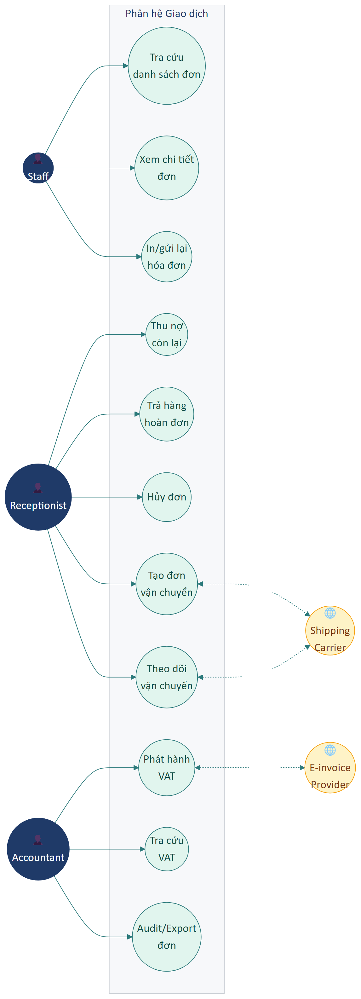

### Vòng đời Đơn hàng (State Machine)

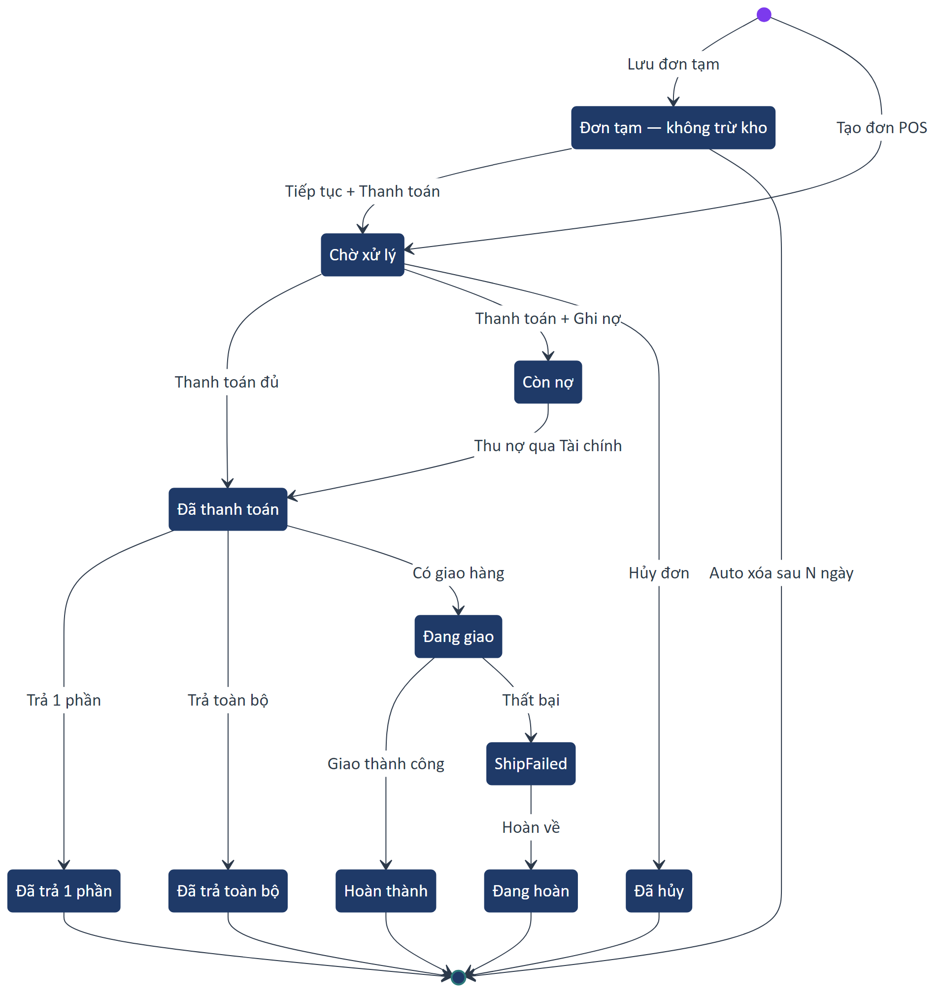

### Sequence — Phát hành Hóa đơn VAT

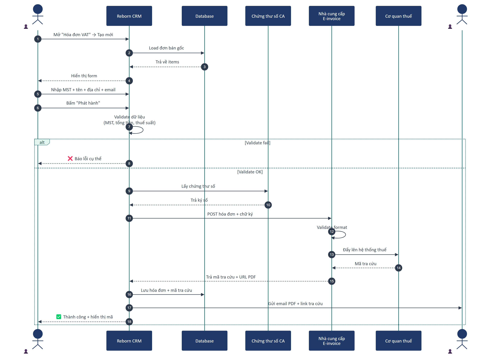

---

## A. Danh sách đơn

### UR-SALE-01 — Danh sách đơn theo kỳ với panel chi tiết

| Trường | Nội dung |
|--------|----------|
| **ID** | UR-SALE-01 |
| **Tên** | Tra cứu đơn hàng đã tạo |
| **Actor** | Staff |
| **Mô tả** | Hiển thị danh sách đơn theo cơ sở đang chọn, có lọc khoảng thời gian và tab trạng thái. Click vào đơn → mở panel chi tiết bên phải. |
| **Đầu vào** | • Từ ngày — Đến ngày (mặc định hôm nay)<br>• Tab trạng thái: Tất cả / Chờ xử lý / Đang giao / Hoàn thành / Đã hủy<br>• Search: mã đơn / tên khách / SĐT |
| **Tiêu chí chấp nhận** | 1. Card mỗi đơn hiển thị: mã, tên khách, tổng tiền, trạng thái, giờ.<br>2. Panel chi tiết hiển thị: thông tin khách, danh sách item, tổng tiền + giảm + VAT, lịch sử thanh toán, trạng thái.<br>3. Khoảng tối đa 365 ngày (CN performance).<br>4. Audit Excel button xuất danh sách hiện tại. |
| **Mức ưu tiên** | **M** |

### UR-SALE-02 — Hành động trên đơn

| Trường | Nội dung |
|--------|----------|
| **ID** | UR-SALE-02 |
| **Tên** | Các thao tác trên một đơn cụ thể |
| **Actor** | Staff (theo quyền) |
| **Mô tả** | Trên panel chi tiết hoặc menu 3-chấm của card, người dùng có các hành động: in lại, gửi lại, thu nợ, trả hàng, xuất VAT, hủy. |
| **Tiêu chí chấp nhận** | 1. **In hóa đơn** — mở preview, cho chọn máy in.<br>2. **Gửi SMS/Email** — gửi lại hóa đơn cho khách.<br>3. **Thanh toán còn nợ** — mở modal thu nợ (gọi UR-FIN-09).<br>4. **Trả hàng** — mở form hoàn (UR-SALE-08).<br>5. **Xuất hóa đơn VAT** — chuyển sang Part 04.B.<br>6. **Hủy đơn** — chỉ cho phép khi chưa thanh toán; ghi log lý do.<br>7. CN-03: đơn đã thanh toán không thể xóa, chỉ có thể hoàn / hủy. |
| **Mức ưu tiên** | **M** |

### UR-SALE-03 — Audit/Export đơn theo kỳ

| Trường | Nội dung |
|--------|----------|
| **ID** | UR-SALE-03 |
| **Tên** | Xuất file kiểm toán đơn hàng |
| **Actor** | Accountant, Branch Manager |
| **Mô tả** | Xuất `.xlsx` chứa toàn bộ đơn trong khoảng thời gian đã lọc, mỗi dòng = 1 đơn (hoặc 1 dòng/sản phẩm tùy tùy chọn), kèm cột phương thức thanh toán, công nợ, nhân viên tạo, ca. |
| **Tiêu chí chấp nhận** | 1. Filter trước khi xuất.<br>2. Tùy chọn: 1 dòng/đơn hoặc 1 dòng/sản phẩm.<br>3. Nén file nếu > 50.000 dòng. |
| **Mức ưu tiên** | **S** |

---

## B. Hóa đơn VAT

### UR-SALE-04 — Phát hành hóa đơn VAT từ đơn bán

| Trường | Nội dung |
|--------|----------|
| **ID** | UR-SALE-04 |
| **Tên** | Sinh và gửi hóa đơn điện tử VAT |
| **Actor** | Accountant, Receptionist (theo quyền) |
| **Mô tả** | Cho phép phát hành hóa đơn VAT điện tử bằng cách chọn đơn bán đã có hoặc nhập thủ công. Hệ thống tự ký số + đẩy lên cơ quan thuế qua nhà cung cấp đã tích hợp. |
| **Đầu vào — Người mua** | • **Tên người mua/công ty** (M)<br>• **MST** (M nếu doanh nghiệp, 10 hoặc 13 chữ số)<br>• **Địa chỉ** (M, ≤ 255)<br>• **Email nhận hóa đơn** (M, valid)<br>• **Hình thức thanh toán** (M, Tiền mặt/CK/Thẻ/TM+CK) |
| **Tiền điều kiện** | Tenant đã cấu hình tích hợp hóa đơn điện tử (UR-INT-XX) + có chứng thư số còn hạn. |
| **Tiêu chí chấp nhận** | 1. Nguồn tạo: từ đơn bán (copy info) hoặc nhập thủ công.<br>2. Bảng hàng hóa cho phép chỉnh thuế suất 0/5/8/10%.<br>3. Sau phát hành: trả về mã tra cứu, gửi email cho khách tự động.<br>4. Lỗi *"Chữ ký số không hợp lệ"*, *"MST không tồn tại"*, *"Tổng tiền không khớp"* phải được hiển thị rõ ràng. |
| **Mức ưu tiên** | **M** |
| **Ghi chú** | CN-04: hóa đơn VAT đã phát hành không sửa được, chỉ hủy + phát hành lại. |

### UR-SALE-05 — Tra cứu hóa đơn VAT đã phát hành

| Trường | Nội dung |
|--------|----------|
| **ID** | UR-SALE-05 |
| **Tên** | Danh sách hóa đơn VAT theo kỳ |
| **Actor** | Accountant |
| **Mô tả** | Hiển thị danh sách hóa đơn VAT đã phát hành để tra cứu, kèm trạng thái (Đã phát hành / Đã hủy / Lỗi), in lại, gửi lại email. |
| **Tiêu chí chấp nhận** | 1. Filter theo kỳ + người mua + MST.<br>2. Bấm vào hóa đơn → xem PDF nhúng trực tiếp.<br>3. Có nút **In** và **Gửi lại email**.<br>4. Có nút **Hủy hóa đơn** (chỉ với hóa đơn không quá hạn quy định pháp luật). |
| **Mức ưu tiên** | **M** |

---

## C. Vận chuyển

### UR-SALE-06 — Tích hợp đơn vị vận chuyển

| Trường | Nội dung |
|--------|----------|
| **ID** | UR-SALE-06 |
| **Tên** | Tạo đơn giao và push sang đơn vị vận chuyển |
| **Actor** | Receptionist, Branch Manager |
| **Mô tả** | Khi khách chọn "Giao tận nơi", hệ thống tạo đơn giao và push sang đơn vị vận chuyển đã cấu hình (GHN, GHTK, J&T, ViettelPost, ShopeeExpress) qua API, lấy về mã vận đơn. |
| **Tiêu chí chấp nhận** | 1. Tạo từ POS lúc thanh toán (auto) hoặc từ danh sách đơn (thủ công).<br>2. Cho phép chọn đơn vị, dịch vụ, lấy phí dự kiến từ API.<br>3. Sau khi gửi → lưu mã vận đơn, cập nhật trạng thái qua webhook callback. |
| **Mức ưu tiên** | **S** |

### UR-SALE-07 — Theo dõi trạng thái vận chuyển

| Trường | Nội dung |
|--------|----------|
| **ID** | UR-SALE-07 |
| **Tên** | Bảng theo dõi đơn đang giao |
| **Actor** | Receptionist, CSKH |
| **Mô tả** | Trang riêng hiển thị các đơn đang giao với cập nhật real-time / poll từ đơn vị vận chuyển. |
| **Tiêu chí chấp nhận** | 1. Cột: mã đơn, khách nhận, địa chỉ, đơn vị vận chuyển, mã vận đơn, trạng thái, ngày dự kiến.<br>2. Trạng thái: Chờ lấy / Đang giao / Giao thành công / Giao thất bại / Đã hoàn.<br>3. Bấm vào → xem tracking chi tiết.<br>4. Có alert khi đơn ở trạng thái "Giao thất bại". |
| **Mức ưu tiên** | **S** |

---

## D. Trả hàng / Hoàn đơn

### UR-SALE-08 — Tạo phiếu hoàn hàng

| Trường | Nội dung |
|--------|----------|
| **ID** | UR-SALE-08 |
| **Tên** | Xử lý trả/đổi hàng |
| **Actor** | Receptionist, Branch Manager |
| **Mô tả** | Từ một đơn bán đã thanh toán, nhân viên có thể tạo phiếu hoàn từng phần hoặc toàn bộ, chọn cách hoàn tiền và lý do. |
| **Đầu vào** | Bảng item của đơn gốc, với:<br>• **Số lượng trả** (M, > 0 và ≤ số đã mua)<br>• **Lý do** (M, dropdown: Không vừa ý / Lỗi sản phẩm / Đổi sang sản phẩm khác / Khác)<br>• **Ghi chú** (tùy chọn)<br>• **Cách hoàn**: Tiền mặt / Chuyển khoản (kèm STK) / Tín dụng cửa hàng |
| **Tiêu chí chấp nhận** | 1. Phiếu hoàn có mã riêng (vd `RT00001`) và liên kết đơn gốc.<br>2. Đơn gốc hiển thị badge "Đã trả một phần" hoặc "Đã trả toàn bộ".<br>3. Sản phẩm vật lý được cộng lại tồn kho tự động (trừ khi chọn "không nhập kho").<br>4. Tiền mặt được xuất khỏi quỹ (sinh phiếu chi tự động ở Part 06).<br>5. Tích hợp với "Tạo đơn mới thay thế" — checkbox để mở luôn POS với danh sách thay thế.<br>6. CN-03: không thể xóa, chỉ có thể hủy phiếu hoàn (ghi audit). |
| **Mức ưu tiên** | **M** |

---

## Tóm tắt yêu cầu Part 04

| ID | Tên | Ưu tiên |
|----|-----|:-------:|
| UR-SALE-01 | Danh sách đơn + chi tiết | M |
| UR-SALE-02 | Hành động trên đơn | M |
| UR-SALE-03 | Audit/Export đơn | S |
| UR-SALE-04 | Phát hành hóa đơn VAT | M |
| UR-SALE-05 | Tra cứu hóa đơn VAT | M |
| UR-SALE-06 | Tích hợp vận chuyển | S |
| UR-SALE-07 | Theo dõi vận chuyển | S |
| UR-SALE-08 | Trả hàng / Hoàn đơn | M |

**Tổng:** 8 yêu cầu — 5 Must, 3 Should.

---

*Hết Part 04.*

---

# Part 05 — Lưu trú

## Phạm vi

Phân hệ **Lưu trú** chỉ áp dụng cho tenant có loại hình kinh doanh có **lưu trú qua đêm**: homestay, căn hộ dịch vụ, co-living, phòng riêng, mini-hostel. Các tenant chỉ bán dịch vụ theo giờ có thể tắt phân hệ này.

**Actors chính:** Receptionist, Branch Manager, Housekeeping (vai trò nhân viên dọn phòng).

### Vòng đời trạng thái Phòng

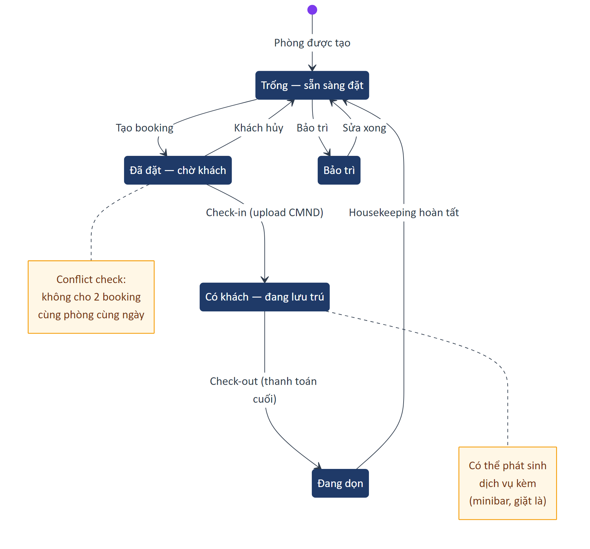

### Workflow Đặt phòng → Lưu trú → Trả phòng

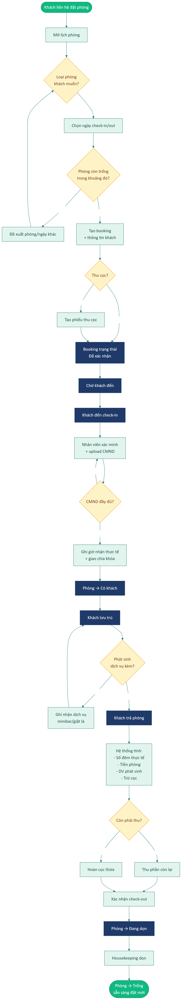

---

## UR-STAY-01 — Lịch phòng dạng ma trận

| Trường | Nội dung |
|--------|----------|
| **ID** | UR-STAY-01 |
| **Tên** | Hiển thị lịch các phòng theo thời gian |
| **Actor** | Receptionist |
| **Mô tả** | Trang chính của phân hệ là một lịch dạng ma trận: trục ngang = ngày, trục dọc = từng phòng/căn hộ. Mỗi ô là một slot đặt với màu trạng thái (trống / đã đặt / có khách / đang dọn / bảo trì). |
| **Tiêu chí chấp nhận** | 1. Filter theo loại phòng, tầng, trạng thái.<br>2. Drag-to-create: kéo qua nhiều ngày để tạo nhanh booking.<br>3. Bấm vào ô đã đặt → mở chi tiết booking ở panel.<br>4. Cuộn thông minh — load thêm theo nhu cầu. |
| **Mức ưu tiên** | **M** |

## UR-STAY-02 — Tạo đặt phòng

| Trường | Nội dung |
|--------|----------|
| **ID** | UR-STAY-02 |
| **Tên** | Booking phòng cho khách |
| **Actor** | Receptionist |
| **Mô tả** | Modal để đặt phòng cho khách hàng cụ thể với các trường thông tin đầy đủ. |
| **Đầu vào** | • **Khách hàng** (M, search hoặc thêm mới)<br>• **Phòng** (M, chỉ liệt kê phòng còn trống)<br>• **Check-in date** (M, ≥ hôm nay)<br>• **Check-out date** (M, > Check-in)<br>• **Số người lớn** (M, 1 ≤ x ≤ sức chứa)<br>• **Số trẻ em** (S, ≥ 0)<br>• **Giá/đêm** (M, mặc định từ cấu hình phòng, override được)<br>• **Dịch vụ kèm** (multi-select)<br>• **Ghi chú** (textarea ≤ 500)<br>• **Trạng thái đặt** (Đã xác nhận / Chờ xác nhận / Tạm giữ) |
| **Tiêu chí chấp nhận** | 1. Khi chọn phòng + ngày, hệ thống chặn slot đó trên lịch ngay.<br>2. Conflict (phòng bị đặt bởi booking khác) → báo lỗi *"Phòng đã được đặt trong khoảng thời gian này"*.<br>3. Có thể thu cọc ngay sau khi tạo booking (gọi UR-FIN-01).<br>4. Booking có mã duy nhất (vd `BK00001`). |
| **Mức ưu tiên** | **M** |

## UR-STAY-03 — Check-in khách lưu trú

| Trường | Nội dung |
|--------|----------|
| **ID** | UR-STAY-03 |
| **Tên** | Ghi nhận khách đến nhận phòng |
| **Actor** | Receptionist |
| **Mô tả** | Khi khách đến đúng ngày đã đặt (hoặc walk-in), nhân viên check-in: xác nhận thông tin, upload CMND/CCCD theo quy định lưu trú, ghi giờ nhận thực tế. |
| **Đầu vào** | • **Ảnh CMND/CCCD/Hộ chiếu** (M, JPG/PNG ≤ 5MB)<br>• **Giờ nhận phòng thực tế** (M, datetime)<br>• **Số phòng cụ thể** (M nếu loại phòng có nhiều room)<br>• **Số khách thực tế** (M, ≤ số đăng ký) |
| **Tiêu chí chấp nhận** | 1. Phòng chuyển trạng thái "Đã đặt" → "Có khách".<br>2. Tuân thủ Thông tư 06/2017/TT-BVHTTDL: lưu thông tin giấy tờ tối thiểu N năm.<br>3. Thiếu CMND → chặn check-in, hiện *"Thiếu CMND"*.<br>4. Tự gửi thông báo cho khách (SMS/Zalo) sau khi check-in nếu cấu hình bật. |
| **Mức ưu tiên** | **M** |

## UR-STAY-04 — Check-out và tính tiền

| Trường | Nội dung |
|--------|----------|
| **ID** | UR-STAY-04 |
| **Tên** | Trả phòng và thanh toán cuối kỳ |
| **Actor** | Receptionist |
| **Mô tả** | Khi khách trả phòng, hệ thống tính: số đêm thực tế, tiền phòng, dịch vụ phát sinh, trừ cọc, ra số tiền còn phải thu (hoặc hoàn). |
| **Tiêu chí chấp nhận** | 1. Tự tính số đêm dựa vào check-in/check-out thực tế (không dựa booking gốc).<br>2. Cộng đầy đủ phụ thu: dịch vụ kèm, minibar, giặt là, late check-out.<br>3. Cho phép chỉnh giá dịch vụ kèm trước khi xác nhận.<br>4. Sau xác nhận → phòng chuyển sang "Đang dọn"; tự tạo task cho housekeeping. |
| **Mức ưu tiên** | **M** |

## UR-STAY-05 — Quản lý trạng thái phòng

| Trường | Nội dung |
|--------|----------|
| **ID** | UR-STAY-05 |
| **Tên** | Vòng đời trạng thái phòng |
| **Actor** | Housekeeping, Receptionist |
| **Mô tả** | Mỗi phòng có vòng đời trạng thái: Trống → Đã đặt → Có khách → Đang dọn → Trống. Ngoài ra có trạng thái Bảo trì (do quản lý chủ động chuyển). |
| **Tiêu chí chấp nhận** | 1. Housekeeping có app/màn hình riêng để cập nhật "Đã dọn xong" → phòng về Trống.<br>2. Branch Manager có thể chuyển phòng sang "Bảo trì" để chặn đặt.<br>3. Mọi chuyển trạng thái có log: ai, khi nào, lý do. |
| **Mức ưu tiên** | **S** |

## UR-STAY-06 — Cấu hình loại phòng & phòng cụ thể

| Trường | Nội dung |
|--------|----------|
| **ID** | UR-STAY-06 |
| **Tên** | Setup phòng và loại phòng |
| **Actor** | Tenant Admin, Branch Manager |
| **Mô tả** | Tenant phải có giao diện cấu hình các loại phòng (Đơn, Đôi, VIP, Suite) với sức chứa, giá/đêm, tiện nghi, ảnh; sau đó tạo các phòng cụ thể (101, 102, 201...) gán vào loại. |
| **Tiêu chí chấp nhận** | 1. CRUD loại phòng và phòng cụ thể.<br>2. Một loại phòng có nhiều phòng cụ thể.<br>3. Cấu hình giờ check-in / check-out chuẩn (vd 14:00 / 12:00).<br>4. Cấu hình phụ thu: late check-out, vượt khách, cuối tuần. |
| **Mức ưu tiên** | **M** |
| **Ghi chú** | Cấu hình thực tế nằm trong Part 11 (Cài đặt cơ bản → Vận hành cơ sở). |

## UR-STAY-07 — Báo cáo lưu trú

| Trường | Nội dung |
|--------|----------|
| **ID** | UR-STAY-07 |
| **Tên** | KPI vận hành lưu trú |
| **Actor** | Branch Manager, Tenant Admin |
| **Mô tả** | Hệ thống phải tính các chỉ số chuẩn ngành lưu trú: Occupancy %, ADR (Average Daily Rate), RevPAR, doanh thu phòng vs dịch vụ kèm. |
| **Tiêu chí chấp nhận** | 1. Có sẵn trong Part 08 — Báo cáo (mục Check-in / Lưu trú).<br>2. Filter theo cơ sở, theo kỳ.<br>3. Biểu đồ xu hướng theo thời gian.<br>4. Xuất Excel. |
| **Mức ưu tiên** | **S** |

---

## Tóm tắt yêu cầu Part 05

| ID | Tên | Ưu tiên |
|----|-----|:-------:|
| UR-STAY-01 | Lịch phòng ma trận | M |
| UR-STAY-02 | Tạo đặt phòng | M |
| UR-STAY-03 | Check-in lưu trú | M |
| UR-STAY-04 | Check-out + tính tiền | M |
| UR-STAY-05 | Quản lý trạng thái phòng | S |
| UR-STAY-06 | Cấu hình loại phòng | M |
| UR-STAY-07 | Báo cáo lưu trú | S |

**Tổng:** 7 yêu cầu — 5 Must, 2 Should.

---

*Hết Part 05.*

---

# Part 06 — Tài chính & Thanh toán

## Phạm vi

Phân hệ **Tài chính & Thanh toán** quản lý dòng tiền của tenant: thu chi, quỹ, khoản mục, công nợ, đối soát thanh toán online. Đây KHÔNG phải hệ thống kế toán đầy đủ (xem Part 00 — Out-of-scope) — chỉ bao quát ở mức "sổ quỹ + công nợ" cho doanh nghiệp nhỏ.

**Actors chính:** Accountant (chính), Branch Manager, Tenant Admin (cấu hình quỹ).

### Sơ đồ Use Case

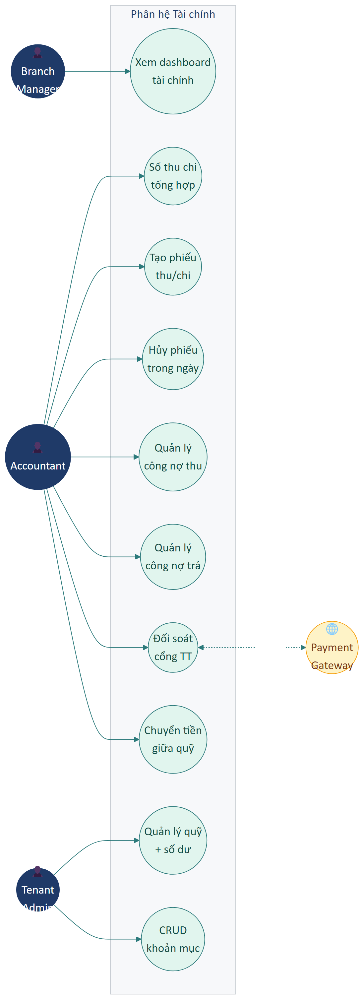

---

## A. Tổng quan tài chính

### UR-FIN-01 — Dashboard tài chính

| Trường | Nội dung |
|--------|----------|
| **ID** | UR-FIN-01 |
| **Tên** | Dashboard chỉ số dòng tiền |
| **Actor** | Branch Manager, Accountant |
| **Mô tả** | Trang tổng quan hiển thị: tổng thu / tổng chi / chênh lệch (lãi-lỗ), biểu đồ dòng tiền theo ngày, top khoản thu/chi, số dư các quỹ. |
| **Tiêu chí chấp nhận** | 1. Filter kỳ: Hôm nay / Tuần / Tháng / Năm / Tùy chọn.<br>2. Số liệu real-time hoặc near-real-time.<br>3. Biểu đồ xu hướng 30 ngày gần nhất.<br>4. Pie chart top khoản. |
| **Mức ưu tiên** | **M** |

---

## B. Sổ thu chi (Cashbook)

### UR-FIN-02 — Sổ thu chi tổng hợp

| Trường | Nội dung |
|--------|----------|
| **ID** | UR-FIN-02 |
| **Tên** | Bảng giao dịch thu chi tổng hợp |
| **Actor** | Accountant |
| **Mô tả** | Bảng liệt kê mọi giao dịch thu/chi (cả tự động từ POS lẫn thủ công), filter và search được. |
| **Tiêu chí chấp nhận** | 1. Cột: Mã phiếu, Ngày giờ, Loại (Thu/Chi), Khoản mục, Đối tượng, Số tiền, Quỹ, Mô tả, Trạng thái.<br>2. Filter theo kỳ + loại + khoản mục + quỹ + nhân viên.<br>3. Mã phiếu tự sinh dạng `PT0000001` (thu) / `PC0000001` (chi).<br>4. Tổng số tiền thu/chi hiển thị ở cuối bảng theo bộ lọc hiện tại. |
| **Mức ưu tiên** | **M** |

### UR-FIN-03 — Tạo phiếu thu/chi thủ công

| Trường | Nội dung |
|--------|----------|
| **ID** | UR-FIN-03 |
| **Tên** | Ghi nhận giao dịch tài chính ngoài POS |
| **Actor** | Accountant |
| **Mô tả** | Form tạo phiếu thu hoặc phiếu chi cho các giao dịch không đến từ bán hàng (lương, điện nước, thu cọc khách, mua NVL ngoài...). |
| **Đầu vào** | • **Loại** (M, Thu/Chi)<br>• **Ngày giao dịch** (M, mặc định hôm nay)<br>• **Khoản mục** (M, từ danh mục Part 06.D)<br>• **Quỹ** (M, từ danh sách quỹ)<br>• **Đối tượng** (S, Khách/NCC/Nhân viên/Khác)<br>• **Số tiền** (M, > 0, tối đa 14 chữ số)<br>• **Mô tả/lý do** (S, ≤ 500 ký tự)<br>• **Chứng từ đính kèm** (C, file ≤ 10MB) |
| **Tiêu chí chấp nhận** | 1. Sau khi lưu, số dư quỹ cập nhật ngay.<br>2. Phiếu hiển thị trong sổ thu chi.<br>3. Audit trail: ai tạo, lúc nào.<br>4. Cho phép upload nhiều chứng từ. |
| **Mức ưu tiên** | **M** |

### UR-FIN-04 — Hủy phiếu

| Trường | Nội dung |
|--------|----------|
| **ID** | UR-FIN-04 |
| **Tên** | Hủy phiếu đã tạo (trong ngày) |
| **Actor** | Accountant, Branch Manager |
| **Mô tả** | Cho phép hủy phiếu thu/chi nếu phát hiện sai, nhưng chỉ trong ngày tạo phiếu. |
| **Tiêu chí chấp nhận** | 1. Hủy phiếu sẽ đảo số dư quỹ.<br>2. Phiếu vẫn hiện trong sổ với badge ❌ Đã hủy + lý do hủy bắt buộc.<br>3. Không cho hủy phiếu khác ngày — phải dùng phiếu điều chỉnh ngược lại.<br>4. Yêu cầu quyền `finance.cancel`. |
| **Mức ưu tiên** | **S** |

---

## C. Quản lý quỹ

### UR-FIN-05 — Danh sách quỹ với số dư

| Trường | Nội dung |
|--------|----------|
| **ID** | UR-FIN-05 |
| **Tên** | Quản lý nhiều quỹ tài chính |
| **Actor** | Accountant, Tenant Admin |
| **Mô tả** | Tenant có thể có nhiều quỹ: tiền mặt tại quầy, ngân hàng A, ngân hàng B, MoMo, ZaloPay, quỹ dự phòng. Mỗi quỹ có loại + số dư + biến động trong ngày. |
| **Tiêu chí chấp nhận** | 1. Bảng cột: Tên quỹ, Loại (Cash/Bank/E-wallet), Số dư hiện tại, Biến động hôm nay, Trạng thái.<br>2. Số dư tự tính từ tổng thu - tổng chi của quỹ.<br>3. Bấm vào quỹ → xem lịch sử giao dịch của riêng quỹ đó. |
| **Mức ưu tiên** | **M** |

### UR-FIN-06 — Thêm quỹ mới

| Trường | Nội dung |
|--------|----------|
| **ID** | UR-FIN-06 |
| **Tên** | Tạo một quỹ tài chính |
| **Actor** | Tenant Admin |
| **Mô tả** | Form thêm quỹ với các trường tùy theo loại. |
| **Đầu vào** | • **Tên quỹ** (M, ≤ 100)<br>• **Loại** (M, Cash/Bank/E-wallet)<br>• **Số dư khởi tạo** (M, ≥ 0) — sinh phiếu thu "Số dư ban đầu" tự động<br>• **Số tài khoản** (S, nếu Bank)<br>• **Tên ngân hàng** (S, select)<br>• **Chủ tài khoản** (S)<br>• **Mã ví** (S, nếu E-wallet) |
| **Tiêu chí chấp nhận** | 1. Tạo xong quỹ xuất hiện trong danh sách dropdown khi tạo phiếu thu/chi.<br>2. Số dư khởi tạo có thể là 0 (tạo quỹ rỗng). |
| **Mức ưu tiên** | **M** |

### UR-FIN-07 — Chuyển tiền giữa các quỹ

| Trường | Nội dung |
|--------|----------|
| **ID** | UR-FIN-07 |
| **Tên** | Internal transfer giữa quỹ |
| **Actor** | Accountant |
| **Mô tả** | Cho phép chuyển tiền giữa các quỹ (vd rút tiền mặt từ ATM về két, hoặc chuyển tiền mặt vào tài khoản ngân hàng). |
| **Tiêu chí chấp nhận** | 1. Modal chọn: quỹ gửi, quỹ nhận, số tiền, ghi chú.<br>2. Hệ thống tạo đồng thời 1 phiếu chi (quỹ gửi) + 1 phiếu thu (quỹ nhận) cùng mã liên kết.<br>3. Số dư cả 2 quỹ cập nhật đồng thời. |
| **Mức ưu tiên** | **S** |

---

## D. Quản lý khoản mục thu/chi

### UR-FIN-08 — CRUD khoản mục

| Trường | Nội dung |
|--------|----------|
| **ID** | UR-FIN-08 |
| **Tên** | Danh mục phân loại các giao dịch tài chính |
| **Actor** | Tenant Admin |
| **Mô tả** | Tenant cấu hình các khoản mục thu (vd Doanh thu bán hàng, Doanh thu dịch vụ, Cọc khách, Hoa hồng, Khác) và khoản mục chi (Lương, Điện nước, Mua NVL, Thuê mặt bằng, Marketing, Thuế, Khác). |
| **Đầu vào** | • **Tên khoản mục** (M, ≤ 100)<br>• **Loại** (M, Thu/Chi)<br>• **Mã** (S, auto gen)<br>• **Khoản mục cha** (S, để tạo cây phân cấp)<br>• **Mô tả** (S) |
| **Tiêu chí chấp nhận** | 1. CRUD đầy đủ.<br>2. Hỗ trợ phân cấp cha-con (tối đa 3 cấp).<br>3. Không cho xóa khoản mục đã được dùng. |
| **Mức ưu tiên** | **M** |

---

## E. Quản lý công nợ

### UR-FIN-09 — Công nợ phải thu (khách)

| Trường | Nội dung |
|--------|----------|
| **ID** | UR-FIN-09 |
| **Tên** | Quản lý các khoản khách đang nợ |
| **Actor** | Accountant, Receptionist |
| **Mô tả** | Bảng liệt kê khách đang nợ tiền cửa hàng, hỗ trợ thu nợ một phần hoặc toàn bộ. |
| **Tiêu chí chấp nhận** | 1. Cột: Tên khách, SĐT, Tổng nợ hiện tại, Số ngày nợ, Cờ "Quá hạn".<br>2. Bấm vào khách → xem chi tiết các đơn nợ + lịch sử thanh toán từng phần.<br>3. Nút **Thu nợ** → modal chọn đơn cần thu + nhập số tiền + chọn quỹ nhận → xác nhận.<br>4. Sau thu: tự sinh phiếu thu trong sổ thu chi (UR-FIN-02), công nợ giảm tương ứng. |
| **Mức ưu tiên** | **M** |

### UR-FIN-10 — Công nợ phải trả (NCC)

| Trường | Nội dung |
|--------|----------|
| **ID** | UR-FIN-10 |
| **Tên** | Quản lý nợ với nhà cung cấp |
| **Actor** | Accountant |
| **Mô tả** | Tab thứ 2 hiển thị các NCC mà cửa hàng đang nợ tiền (từ phiếu nhập kho chưa trả đủ — Part 10). Có nút trả nợ. |
| **Tiêu chí chấp nhận** | 1. Cột tương tự công nợ phải thu nhưng đối tượng là NCC.<br>2. Trả nợ: chọn đơn nhập + nhập số tiền + chọn quỹ chi → xác nhận → sinh phiếu chi tự động.<br>3. Có cảnh báo khi vượt hạn mức tín dụng đã cấu hình với NCC. |
| **Mức ưu tiên** | **M** |

---

## F. Đối soát thanh toán online

### UR-FIN-11 — Đối soát với cổng thanh toán

| Trường | Nội dung |
|--------|----------|
| **ID** | UR-FIN-11 |
| **Tên** | Đối soát giao dịch online với sao kê từ kênh |
| **Actor** | Accountant |
| **Mô tả** | Khi tenant nhận thanh toán qua VNPay/MoMo/ZaloPay/Bank gateway, có độ trễ về tiền (1-3 ngày). Module này so khớp giao dịch trong CRM với sao kê thực tế từ kênh. |
| **Tiêu chí chấp nhận** | 1. Chọn kênh + khoảng thời gian.<br>2. Upload file sao kê CSV/Excel hoặc auto fetch qua API (nếu có).<br>3. Bảng so khớp với 4 nhóm: ✅ Khớp / ⚠️ Lệch / ❓ Thiếu CRM / ❓ Thiếu sao kê.<br>4. Cho phép xử lý từng dòng lệch (tạo phiếu thu bù, đánh dấu pending...).<br>5. Sau khi xác nhận → kỳ đó được "chốt" — không cho sửa nữa.<br>6. CN-06: phiếu đối soát đã chốt không sửa được. |
| **Mức ưu tiên** | **S** |

---

## Tóm tắt yêu cầu Part 06

| ID | Tên | Ưu tiên |
|----|-----|:-------:|
| UR-FIN-01 | Dashboard tài chính | M |
| UR-FIN-02 | Sổ thu chi | M |
| UR-FIN-03 | Tạo phiếu thu/chi thủ công | M |
| UR-FIN-04 | Hủy phiếu | S |
| UR-FIN-05 | Danh sách quỹ | M |
| UR-FIN-06 | Thêm quỹ mới | M |
| UR-FIN-07 | Chuyển tiền giữa quỹ | S |
| UR-FIN-08 | CRUD khoản mục | M |
| UR-FIN-09 | Công nợ phải thu | M |
| UR-FIN-10 | Công nợ phải trả | M |
| UR-FIN-11 | Đối soát thanh toán | S |

**Tổng:** 11 yêu cầu — 8 Must, 3 Should.

---

*Hết Part 06.*

---

# Part 07 — Đối tác & Phản hồi

## Phạm vi

Part này gom 2 mục độc lập trên Menu vì cùng phục vụ "đối tượng không phải khách lẻ":

- **Đối tác (KOL/PO)**: KOL, người giới thiệu, đại lý sỉ (Purchase Order), đối tác dịch vụ.
- **Phản hồi**: thu thập + xử lý phản hồi/khiếu nại/góp ý của khách hàng từ nhiều kênh.

**Actors chính:** Marketer (đối tác), CSKH (phản hồi), Branch Manager, Accountant (trả hoa hồng).

---

## A. Đối tác (KOL / PO / Đại lý)

### UR-PARTNER-01 — Quản lý danh sách đối tác

| Trường | Nội dung |
|--------|----------|
| **ID** | UR-PARTNER-01 |
| **Tên** | CRUD đối tác kèm chỉ số hiệu quả |
| **Actor** | Marketer, Branch Manager |
| **Mô tả** | Bảng liệt kê các đối tác (KOL, người giới thiệu, đại lý sỉ, đối tác dịch vụ) với chỉ số: số khách giới thiệu, doanh thu mang về, hoa hồng đã trả, hoa hồng phải trả. |
| **Tiêu chí chấp nhận** | 1. Cột: Mã, Tên, Loại (KOL/Referral/PO/Service), SĐT/Email, Nhóm ngành, Số khách giới thiệu, Doanh thu, Hoa hồng đã trả, Hoa hồng phải trả.<br>2. Filter theo loại + nhóm.<br>3. Chỉ số tự cập nhật từ các đơn có gắn đối tác (UR-PARTNER-03). |
| **Mức ưu tiên** | **S** |

### UR-PARTNER-02 — Thêm/sửa đối tác

| Trường | Nội dung |
|--------|----------|
| **ID** | UR-PARTNER-02 |
| **Tên** | Form đối tác đầy đủ |
| **Actor** | Marketer, Tenant Admin |
| **Mô tả** | Form thêm/sửa đối tác với thông tin định danh, thanh toán, hợp đồng, hoa hồng. |
| **Đầu vào** | • **Tên đối tác** (M, ≤ 255)<br>• **Loại** (M, KOL/Referral/PO/Service)<br>• **SĐT** (M)<br>• **Email** (S)<br>• **Địa chỉ** (S)<br>• **MST** (S, 10/13 số nếu PO)<br>• **STK ngân hàng + Tên NH + Chủ TK** (S, để trả hoa hồng)<br>• **Tỷ lệ hoa hồng** (S, %, hoặc số cố định/đơn)<br>• **Hạn hợp đồng** (S, date)<br>• **Ghi chú** (S)<br>• **Logo/Avatar** (S, ≤ 5MB) |
| **Tiêu chí chấp nhận** | 1. CRUD đầy đủ.<br>2. Validation: SĐT đúng format, MST 10/13 số, email valid.<br>3. Tỷ lệ hoa hồng có thể là % hoặc số cố định/đơn (radio chọn). |
| **Mức ưu tiên** | **S** |

### UR-PARTNER-03 — Gắn đối tác vào đơn hàng

| Trường | Nội dung |
|--------|----------|
| **ID** | UR-PARTNER-03 |
| **Tên** | Liên kết đối tác giới thiệu với đơn POS |
| **Actor** | Receptionist |
| **Mô tả** | Khi tạo đơn ở POS, có ô **Người giới thiệu** để chọn đối tác. Khi đơn được xác nhận, hệ thống tự tính hoa hồng theo tỷ lệ đã cấu hình. |
| **Tiêu chí chấp nhận** | 1. Ô "Người giới thiệu" trong giỏ hàng / modal thanh toán.<br>2. Search đối tác theo tên/SĐT.<br>3. Hoa hồng được tính tự động và lưu vào trạng thái "phải trả" của đối tác.<br>4. Một đơn chỉ gắn được 1 đối tác giới thiệu (CN). |
| **Mức ưu tiên** | **S** |

### UR-PARTNER-04 — Trả hoa hồng cho đối tác

| Trường | Nội dung |
|--------|----------|
| **ID** | UR-PARTNER-04 |
| **Tên** | Thanh toán hoa hồng tích lũy |
| **Actor** | Accountant |
| **Mô tả** | Trên trang chi tiết đối tác, tab **Hoa hồng** liệt kê các đơn đã sinh hoa hồng (chưa trả). Người dùng tick các đơn cần trả → chọn quỹ chi → xác nhận. |
| **Tiêu chí chấp nhận** | 1. Liệt kê các đơn với cột: mã đơn, ngày, doanh thu, hoa hồng.<br>2. Tổng các đơn được chọn hiển thị real-time.<br>3. Sau xác nhận → tự sinh phiếu chi trong sổ thu chi (UR-FIN-03), đánh dấu các đơn "Đã trả hoa hồng".<br>4. Có audit ai trả, lúc nào, qua quỹ nào. |
| **Mức ưu tiên** | **S** |

---

## B. Phản hồi khách hàng

### UR-FEEDBACK-01 — Thu thập phản hồi đa kênh

| Trường | Nội dung |
|--------|----------|
| **ID** | UR-FEEDBACK-01 |
| **Tên** | Tập trung phản hồi từ nhiều nguồn |
| **Actor** | Hệ thống, CSKH |
| **Mô tả** | Hệ thống phải nhận và lưu phản hồi từ các kênh: Form web/app, khảo sát SMS/Email sau dịch vụ, chat bot, nhân viên nhập tay, comment Facebook/Zalo (nếu tích hợp). Tất cả đổ về 1 inbox thống nhất. |
| **Tiêu chí chấp nhận** | 1. Mỗi phản hồi có nguồn (channel) rõ ràng.<br>2. Phản hồi được gắn với khách hàng (nếu xác định được).<br>3. Phản hồi từ kênh tự động (form/khảo sát) tạo record với trạng thái "Mới". |
| **Mức ưu tiên** | **S** |

### UR-FEEDBACK-02 — Phân loại và quản lý phản hồi

| Trường | Nội dung |
|--------|----------|
| **ID** | UR-FEEDBACK-02 |
| **Tên** | Workflow xử lý phản hồi |
| **Actor** | CSKH, Branch Manager |
| **Mô tả** | Mỗi phản hồi có loại (Khen/Góp ý/Khiếu nại), mức độ (Nhẹ/Trung bình/Nghiêm trọng), trạng thái xử lý (Mới/Đang xử lý/Đã xử lý/Bỏ qua), người phụ trách. |
| **Tiêu chí chấp nhận** | 1. Cột bảng: Mã, Ngày, Khách, Kênh, Loại, Mức độ, Nội dung, Trạng thái, Người phụ trách.<br>2. Filter mạnh theo từng cột.<br>3. Bấm vào → mở panel chi tiết với lịch sử xử lý.<br>4. Có thể assign nhanh người phụ trách từ menu 3-chấm. |
| **Mức ưu tiên** | **S** |

### UR-FEEDBACK-03 — Tạo phản hồi thủ công

| Trường | Nội dung |
|--------|----------|
| **ID** | UR-FEEDBACK-03 |
| **Tên** | Form ghi nhận phản hồi nhân viên nghe trực tiếp |
| **Actor** | Receptionist, CSKH |
| **Mô tả** | Khi khách phản hồi bằng miệng tại quầy, nhân viên có thể ghi vào form thủ công. |
| **Đầu vào** | • **Khách hàng** (S, có thể để trống nếu vô danh)<br>• **Kênh** (M, dropdown)<br>• **Loại** (M, Khen/Góp ý/Khiếu nại)<br>• **Mức độ** (M, Nhẹ/TB/Nghiêm trọng)<br>• **Nội dung** (M, textarea ≤ 2000)<br>• **Ảnh đính kèm** (S, max 5 file × 5MB)<br>• **Ngày phát sinh** (M, date) |
| **Tiêu chí chấp nhận** | 1. Validation đầy đủ.<br>2. Tự gán người phụ trách = người tạo (override được). |
| **Mức ưu tiên** | **S** |

### UR-FEEDBACK-04 — Lịch sử xử lý phản hồi

| Trường | Nội dung |
|--------|----------|
| **ID** | UR-FEEDBACK-04 |
| **Tên** | Audit trail cho mỗi phản hồi |
| **Actor** | CSKH, Branch Manager |
| **Mô tả** | Mỗi lần xử lý phản hồi (chuyển trạng thái, ghi note, gọi điện, gửi voucher), hành động được ghi vào lịch sử của phản hồi đó. |
| **Tiêu chí chấp nhận** | 1. Mỗi entry: thời gian, người, hành động, ghi chú.<br>2. Có thể xem toàn bộ timeline trong panel chi tiết.<br>3. Khi chuyển sang "Đã xử lý" → bắt buộc nhập kết quả cuối. |
| **Mức ưu tiên** | **S** |

### UR-FEEDBACK-05 — Báo cáo phản hồi

| Trường | Nội dung |
|--------|----------|
| **ID** | UR-FEEDBACK-05 |
| **Tên** | Phân tích chất lượng dịch vụ qua phản hồi |
| **Actor** | Branch Manager, Tenant Admin |
| **Mô tả** | Báo cáo định kỳ với các chỉ số: số phản hồi/tháng, tỷ lệ Khen/Góp ý/Khiếu nại, thời gian xử lý trung bình, top nhân viên xử lý nhanh, khu vực bị khiếu nại nhiều. |
| **Tiêu chí chấp nhận** | 1. Filter theo kỳ + cơ sở.<br>2. Có biểu đồ pie + cột.<br>3. Drill-down từ chỉ số → list phản hồi cụ thể.<br>4. Xuất Excel. |
| **Mức ưu tiên** | **C** |

---

## Tóm tắt yêu cầu Part 07

| ID | Tên | Ưu tiên |
|----|-----|:-------:|
| UR-PARTNER-01 | Danh sách đối tác | S |
| UR-PARTNER-02 | Thêm/sửa đối tác | S |
| UR-PARTNER-03 | Gắn đối tác vào đơn | S |
| UR-PARTNER-04 | Trả hoa hồng | S |
| UR-FEEDBACK-01 | Thu phản hồi đa kênh | S |
| UR-FEEDBACK-02 | Workflow phản hồi | S |
| UR-FEEDBACK-03 | Tạo phản hồi thủ công | S |
| UR-FEEDBACK-04 | Lịch sử xử lý | S |
| UR-FEEDBACK-05 | Báo cáo phản hồi | C |

**Tổng:** 9 yêu cầu — 0 Must, 8 Should, 1 Could.

---

*Hết Part 07.*

---

# Part 08 — Báo cáo

## Phạm vi

Phân hệ **Báo cáo** cung cấp bộ báo cáo phân tích kinh doanh, phục vụ cho quản lý ra quyết định. Đây là phân hệ chỉ-đọc (read-only) — không nhập liệu. Bao gồm 6 báo cáo chính: Doanh thu & MRR, Thành viên, Check-in, Dịch vụ, Đối tác, Tài chính & Công nợ.

**Actors chính:** Branch Manager (chính), Tenant Admin, Marketer, Accountant.

**Yêu cầu chung cho mọi báo cáo:** filter kỳ + so sánh kỳ trước + xuất Excel + có thể gửi định kỳ qua email.

---

## A. Yêu cầu chung

### UR-REPORT-01 — Khung báo cáo chuẩn

| Trường | Nội dung |
|--------|----------|
| **ID** | UR-REPORT-01 |
| **Tên** | Cấu trúc chung cho mọi báo cáo |
| **Actor** | Mọi báo cáo viewer |
| **Mô tả** | Mọi báo cáo phải có khung chung: bộ lọc kỳ, so sánh kỳ trước, xuất file, gửi định kỳ. |
| **Tiêu chí chấp nhận** | 1. **Filter kỳ**: Hôm nay / Tuần này / Tháng này / Quý / Năm / Tùy chọn (date range).<br>2. **So sánh**: với cùng kỳ trước (tỷ lệ tăng/giảm %, mũi tên ↑↓ màu).<br>3. **Filter cơ sở**: nếu tenant nhiều cơ sở.<br>4. **Xuất Excel**: nút trên cùng, tải `.xlsx`.<br>5. **Gửi định kỳ**: cấu hình lịch (hằng ngày/tuần/tháng) + danh sách email nhận.<br>6. Số liệu được tính từ DB thật, không hardcode.<br>7. Báo cáo load ≤ 5 giây với khoảng dữ liệu 1 tháng. |
| **Mức ưu tiên** | **M** |

---

## B. Báo cáo Doanh thu & MRR

### UR-REPORT-02 — Báo cáo Doanh thu tổng hợp

| Trường | Nội dung |
|--------|----------|
| **ID** | UR-REPORT-02 |
| **Tên** | Doanh thu tổng + chỉ số định kỳ |
| **Actor** | Branch Manager, Tenant Admin |
| **Mô tả** | Báo cáo doanh thu với các chỉ số chính: tổng doanh thu, MRR, ARPU, AOV, số đơn, tỷ lệ tăng trưởng. |
| **Tiêu chí chấp nhận** | 1. **Tổng doanh thu** theo kỳ (từ POS + bán gói + bán lẻ).<br>2. **MRR** = doanh thu định kỳ tháng (từ gói thành viên có thời hạn — chia đều theo tháng).<br>3. **ARPU** = Doanh thu / số khách trong kỳ.<br>4. **AOV** = Doanh thu / số đơn.<br>5. **Tăng trưởng** so kỳ trước (%).<br>6. Biểu đồ doanh thu theo ngày (cột).<br>7. Biểu đồ doanh thu theo nguồn (pie: bán hàng/dịch vụ/gói).<br>8. Top 10 sản phẩm/dịch vụ.<br>9. Doanh thu theo nhân viên.<br>10. Doanh thu theo nhóm khách. |
| **Mức ưu tiên** | **M** |

---

## C. Báo cáo Thành viên

### UR-REPORT-03 — Báo cáo tăng trưởng và giữ chân thành viên

| Trường | Nội dung |
|--------|----------|
| **ID** | UR-REPORT-03 |
| **Tên** | Phân tích base thành viên |
| **Actor** | Branch Manager, Marketer |
| **Mô tả** | Báo cáo các chỉ số về thành viên: tổng số, mới, active, churn, retention, phân bố. |
| **Tiêu chí chấp nhận** | 1. **Tổng thành viên** cuối kỳ.<br>2. **Thành viên mới** đăng ký trong kỳ.<br>3. **Active** = có check-in/mua trong N ngày (cấu hình tenant).<br>4. **Churned** = không hoạt động > N ngày.<br>5. **Retention rate** + **Churn rate** (%).<br>6. Biểu đồ tăng trưởng theo thời gian.<br>7. Phân bố theo: hạng thẻ, giới tính, độ tuổi, nghề nghiệp, nguồn.<br>8. **Sắp hết hạn** (7/15/30 ngày tới) — list khách + xuất nhanh sang chiến dịch MKT (Part 09). |
| **Mức ưu tiên** | **M** |

---

## D. Báo cáo Check-in

### UR-REPORT-04 — Phân tích lưu lượng

| Trường | Nội dung |
|--------|----------|
| **ID** | UR-REPORT-04 |
| **Tên** | Báo cáo check-in / lưu lượng khách |
| **Actor** | Branch Manager |
| **Mô tả** | Số lượt check-in, khách duy nhất, heatmap giờ cao điểm, top khách trung thành. |
| **Tiêu chí chấp nhận** | 1. **Tổng lượt check-in** trong kỳ.<br>2. **Khách duy nhất** (deduplicated).<br>3. **TB lượt/khách**.<br>4. **Heatmap** giờ × ngày trong tuần.<br>5. **Top khách** theo số lượt.<br>6. **Phân bố theo khu vực** (Co-working/Spa/Phòng riêng).<br>7. **Xu hướng theo tuần** (line chart). |
| **Mức ưu tiên** | **S** |

---

## E. Báo cáo Dịch vụ

### UR-REPORT-05 — Hiệu quả từng dịch vụ/sản phẩm

| Trường | Nội dung |
|--------|----------|
| **ID** | UR-REPORT-05 |
| **Tên** | Phân tích hiệu quả dịch vụ |
| **Actor** | Branch Manager, Tenant Admin |
| **Mô tả** | Top dịch vụ bán chạy, dịch vụ "chết", hiệu quả combo, tỷ lệ sử dụng quota gói. |
| **Tiêu chí chấp nhận** | 1. **Top dịch vụ** theo doanh thu và theo lượt.<br>2. **Dịch vụ ít/không dùng** trong kỳ.<br>3. **Combo** vs **lẻ** — so sánh doanh thu và margin.<br>4. **Tỷ lệ sử dụng quota** theo từng gói thành viên.<br>5. **Thời gian TB giữa lần dùng** của một khách. |
| **Mức ưu tiên** | **S** |

---

## F. Báo cáo Đối tác

### UR-REPORT-06 — ROI đối tác

| Trường | Nội dung |
|--------|----------|
| **ID** | UR-REPORT-06 |
| **Tên** | Đo lường hiệu quả các đối tác giới thiệu |
| **Actor** | Marketer, Branch Manager |
| **Mô tả** | Top đối tác, doanh thu mang về, hoa hồng đã chi, ROI = doanh thu/hoa hồng. |
| **Tiêu chí chấp nhận** | 1. **Top đối tác** theo số khách mang về.<br>2. **Doanh thu / đối tác**.<br>3. **Hoa hồng đã chi / đối tác**.<br>4. **ROI** từng đối tác.<br>5. **Tỷ lệ chuyển đổi**: số khách giới thiệu thực sự mua / tổng giới thiệu. |
| **Mức ưu tiên** | **S** |

---

## G. Báo cáo Tài chính & Công nợ

### UR-REPORT-07 — Báo cáo dòng tiền và P&L cơ bản

| Trường | Nội dung |
|--------|----------|
| **ID** | UR-REPORT-07 |
| **Tên** | Báo cáo tài chính cơ bản |
| **Actor** | Branch Manager, Accountant, Tenant Admin |
| **Mô tả** | Tổng thu/chi, lãi gộp/ròng, số dư các quỹ đầu/cuối kỳ, công nợ phải thu/trả đầu/cuối kỳ. |
| **Tiêu chí chấp nhận** | 1. **Tổng thu / chi** kỳ.<br>2. **Lãi gộp** (Doanh thu − Giá vốn).<br>3. **Lãi ròng** (Lãi gộp − chi phí).<br>4. **Số dư quỹ** đầu vs cuối kỳ.<br>5. **Công nợ phải thu/phải trả** đầu vs cuối kỳ.<br>6. Biểu đồ thu/chi theo ngày (cột đôi).<br>7. Pie cơ cấu chi.<br>8. **Tỷ lệ thu hồi nợ** trong kỳ. |
| **Mức ưu tiên** | **M** |

---

## H. Tự động hóa báo cáo

### UR-REPORT-08 — Gửi báo cáo định kỳ

| Trường | Nội dung |
|--------|----------|
| **ID** | UR-REPORT-08 |
| **Tên** | Schedule gửi báo cáo qua email |
| **Actor** | Branch Manager, Tenant Admin |
| **Mô tả** | Cho phép cấu hình gửi tự động báo cáo (PDF hoặc Excel) tới danh sách email theo lịch (ngày/tuần/tháng). |
| **Đầu vào** | • Báo cáo cần gửi (M)<br>• Danh sách email (M, cách nhau dấu phẩy)<br>• Tần suất (M, Hằng ngày / Hằng tuần + thứ / Hằng tháng + ngày)<br>• Giờ gửi (M)<br>• Định dạng (M, PDF / Excel) |
| **Tiêu chí chấp nhận** | 1. Sau khi cấu hình → hệ thống chạy job tự động.<br>2. Gửi xong có log: thời gian, ai nhận, thành công/thất bại.<br>3. Có thể bật/tắt từng schedule. |
| **Mức ưu tiên** | **C** |

---

## Tóm tắt yêu cầu Part 08

| ID | Tên | Ưu tiên |
|----|-----|:-------:|
| UR-REPORT-01 | Khung báo cáo chuẩn | M |
| UR-REPORT-02 | Doanh thu & MRR | M |
| UR-REPORT-03 | Thành viên | M |
| UR-REPORT-04 | Check-in | S |
| UR-REPORT-05 | Dịch vụ | S |
| UR-REPORT-06 | Đối tác | S |
| UR-REPORT-07 | Tài chính & Công nợ | M |
| UR-REPORT-08 | Gửi báo cáo định kỳ | C |

**Tổng:** 8 yêu cầu — 4 Must, 3 Should, 1 Could.

---

*Hết Part 08.*

---

# Part 09 — Ưu đãi & Chăm sóc

## Phạm vi

Phân hệ **Ưu đãi & Chăm sóc** là công cụ giữ chân khách và kéo khách mới. Bao gồm: **Khuyến mãi & Voucher**, **Tích điểm hội viên (loyalty)**, **Chiến dịch marketing đa kênh**, **Chăm sóc thành viên (task automation)**.

**Actors chính:** Marketer (chính), Branch Manager (duyệt), Receptionist (thực hiện task chăm sóc), CSKH.

### Sơ đồ Use Case

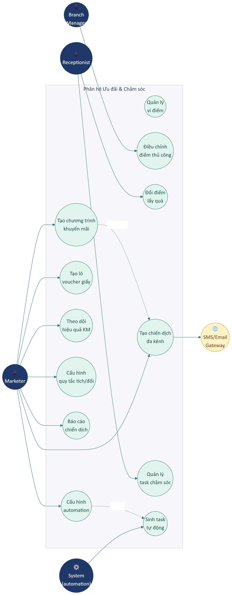

---

## A. Khuyến mãi & Voucher

### UR-MKT-01 — Tạo chương trình khuyến mãi

| Trường | Nội dung |
|--------|----------|
| **ID** | UR-MKT-01 |
| **Tên** | Cấu hình chương trình giảm giá |
| **Actor** | Marketer, Branch Manager |
| **Mô tả** | Tenant phải tạo được nhiều loại khuyến mãi: giảm theo %, giảm theo số tiền, mua N tặng M, combo giá, flash sale, voucher code, freebies (tặng quà). |
| **Đầu vào** | • **Tên CT** (M, ≤ 255)<br>• **Mã CT** (S, slug)<br>• **Loại** (M, 6 loại: %/Tiền/Mua tặng/Combo/Flash sale/Voucher)<br>• **Giá trị giảm** (M, theo loại)<br>• **Áp dụng cho** (M, Toàn bộ/Danh mục/Sản phẩm)<br>• **Điều kiện tối thiểu** (S, đơn ≥ X)<br>• **Giới hạn giảm tối đa** (S, ≤ Y)<br>• **Đối tượng khách** (M, Tất cả/Theo hạng/Theo nhóm/Khách mới)<br>• **Ngày bắt đầu/kết thúc** (M, datetime, end > start)<br>• **Giới hạn lượt dùng tổng** (S)<br>• **Giới hạn lượt dùng/khách** (S)<br>• **Mã voucher** (S, ≤ 20 ký tự, in hoa, không dấu)<br>• **Mô tả/Điều khoản** (S, ≤ 2000)<br>• **Ảnh banner** (S, ≤ 5MB)<br>• **Trạng thái** (M, Nháp/Đang chạy/Đã kết thúc/Tạm dừng) |
| **Tiêu chí chấp nhận** | 1. Validation đầy đủ.<br>2. Cho phép lưu Nháp (chưa kích hoạt).<br>3. Có nút **Kích hoạt** chuyển sang Đang chạy.<br>4. Hệ thống tự chuyển sang Đã kết thúc khi quá ngày kết thúc.<br>5. Modal Khuyến mãi trên POS (UR-RECEPTION-10) chỉ hiện CT có status = Đang chạy + đủ điều kiện. |
| **Mức ưu tiên** | **M** |

### UR-MKT-02 — Tạo lô voucher giấy

| Trường | Nội dung |
|--------|----------|
| **ID** | UR-MKT-02 |
| **Tên** | Sinh hàng loạt mã voucher để in giấy |
| **Actor** | Marketer |
| **Mô tả** | Trong một chương trình khuyến mãi có sẵn, tenant có thể sinh lô voucher (vd 1000 mã) với prefix riêng để in lên giấy phát cho khách. |
| **Tiêu chí chấp nhận** | 1. Số lượng + prefix + thời hạn từng voucher.<br>2. Mỗi voucher có mã unique.<br>3. Xuất Excel danh sách mã để in.<br>4. Audit ai sinh, lúc nào, bao nhiêu mã. |
| **Mức ưu tiên** | **C** |

### UR-MKT-03 — Theo dõi hiệu quả khuyến mãi

| Trường | Nội dung |
|--------|----------|
| **ID** | UR-MKT-03 |
| **Tên** | KPI cho mỗi chương trình KM |
| **Actor** | Marketer, Branch Manager |
| **Mô tả** | Trong danh sách chương trình, mỗi CT hiển thị: số lượt dùng/giới hạn, doanh thu sinh ra, chi phí giảm giá, ROI. |
| **Tiêu chí chấp nhận** | 1. Cập nhật real-time hoặc near-real-time.<br>2. Bấm vào CT → drill-down các đơn cụ thể đã dùng. |
| **Mức ưu tiên** | **S** |

---

## B. Tích điểm hội viên (Loyalty)

### UR-MKT-04 — Quản lý ví điểm khách hàng

| Trường | Nội dung |
|--------|----------|
| **ID** | UR-MKT-04 |
| **Tên** | Lưu trữ + hiển thị điểm tích lũy mỗi khách |
| **Actor** | Receptionist (xem), Marketer (cấu hình quy tắc) |
| **Mô tả** | Mỗi khách có một ví điểm với số dư hiện tại, lịch sử các giao dịch tích/đổi điểm, điểm đã hết hạn (nếu có cấu hình hạn dùng điểm). |
| **Tiêu chí chấp nhận** | 1. Trên hồ sơ khách hiển thị điểm hiện có.<br>2. Có tab **Lịch sử điểm**: ngày, loại (Tích/Đổi/Điều chỉnh), giá trị (+/-), số dư sau, lý do.<br>3. Có thể điều chỉnh thủ công (UR-MKT-06). |
| **Mức ưu tiên** | **S** |

### UR-MKT-05 — Cấu hình quy tắc tích/đổi điểm

| Trường | Nội dung |
|--------|----------|
| **ID** | UR-MKT-05 |
| **Tên** | Định nghĩa cách khách kiếm và đổi điểm |
| **Actor** | Marketer, Tenant Admin |
| **Mô tả** | Tenant cấu hình các quy tắc: mua bao nhiêu được bao nhiêu điểm, đổi điểm lấy gì, áp dụng cho ai, hiệu lực. |
| **Đầu vào** | • **Tên quy tắc** (M)<br>• **Loại** (M, Tích/Đổi)<br>• **Điều kiện áp dụng** (M, vd "Đơn ≥ 100k")<br>• **Tỷ lệ** (M, vd "10.000đ = 1 điểm" hoặc "100 điểm = 10.000đ giảm")<br>• **Nhóm khách áp dụng** (S)<br>• **Thời gian hiệu lực** (S)<br>• **Mức trần / đơn** (S, max điểm tích cho 1 đơn) |
| **Tiêu chí chấp nhận** | 1. Có thể có nhiều quy tắc đồng thời.<br>2. Khi đơn được tạo ở POS với khách đã gắn → tự cộng điểm theo quy tắc.<br>3. Khi khách dùng điểm đổi giảm giá → tự trừ điểm. |
| **Mức ưu tiên** | **S** |

### UR-MKT-06 — Điều chỉnh điểm thủ công

| Trường | Nội dung |
|--------|----------|
| **ID** | UR-MKT-06 |
| **Tên** | Cộng/trừ điểm thủ công cho khách |
| **Actor** | Branch Manager, Marketer |
| **Mô tả** | Trong các trường hợp khiếu nại, tặng điểm khuyến mãi, sai sót... tenant có thể điều chỉnh điểm thủ công. |
| **Tiêu chí chấp nhận** | 1. Form: số điểm (+/-), lý do (M, ≤ 500), tham chiếu phiếu (S).<br>2. Yêu cầu quyền `loyalty.adjust`.<br>3. Ghi log vĩnh viễn, không xóa được. |
| **Mức ưu tiên** | **S** |

### UR-MKT-07 — Đổi điểm lấy quà

| Trường | Nội dung |
|--------|----------|
| **ID** | UR-MKT-07 |
| **Tên** | Khách đổi điểm tại quầy |
| **Actor** | Receptionist |
| **Mô tả** | Tenant cấu hình danh mục quà có thể đổi (sản phẩm, voucher, dịch vụ). Khi khách yêu cầu, nhân viên xác minh và đổi. |
| **Tiêu chí chấp nhận** | 1. Có catalog quà với tên, ảnh, số điểm cần.<br>2. Search khách → xem điểm còn → chọn quà → xác nhận → trừ điểm + xuất phiếu quà.<br>3. Không cho đổi nếu điểm không đủ. |
| **Mức ưu tiên** | **C** |

---

## C. Chiến dịch marketing đa kênh

### UR-MKT-08 — Tạo chiến dịch SMS / Email / Zalo / Push / Facebook

| Trường | Nội dung |
|--------|----------|
| **ID** | UR-MKT-08 |
| **Tên** | Cấu hình chiến dịch gửi tin hàng loạt |
| **Actor** | Marketer |
| **Mô tả** | Tenant tạo chiến dịch chọn kênh + đối tượng + nội dung + thời gian gửi. Hệ thống đẩy vào hàng đợi và gửi dần theo throttle của kênh. |
| **Đầu vào** | • **Tên chiến dịch** (M)<br>• **Kênh** (M, SMS/Email/Zalo OA/Push/Facebook)<br>• **Đối tượng** (M, Tất cả/Theo nhóm/Theo hạng/Theo bộ lọc)<br>• **Mục đích** (S, KM/Nhắc gia hạn/Sinh nhật/Winback/Cảm ơn)<br>• **Tiêu đề** (M nếu Email)<br>• **Nội dung** (M; SMS ≤ 160; Zalo ≤ 500; Email HTML đầy đủ)<br>• **Biến thay thế** (S, vd `{{tên_khách}}`, `{{điểm}}`, `{{gói}}`)<br>• **Thời gian gửi** (M, Gửi ngay / Lên lịch)<br>• **Giới hạn/kỳ** (S, max tin/khách/N ngày) |
| **Tiêu chí chấp nhận** | 1. Validation đầy đủ.<br>2. **Xem trước** với 1 mẫu khách thực.<br>3. **Test gửi** sang 1 SĐT cụ thể trước khi gửi mass.<br>4. Sau khi xác nhận → đẩy vào queue, gửi theo throttle (vd 100 SMS/phút).<br>5. Có thể **Hủy chiến dịch** đang chạy. |
| **Mức ưu tiên** | **M** |

### UR-MKT-09 — Báo cáo chiến dịch

| Trường | Nội dung |
|--------|----------|
| **ID** | UR-MKT-09 |
| **Tên** | KPI cho mỗi chiến dịch sau khi chạy |
| **Actor** | Marketer |
| **Mô tả** | Tab Báo cáo của mỗi chiến dịch hiển thị: gửi thành công, thất bại, tỷ lệ mở (email), tỷ lệ click, conversion (khách mua sau khi nhận), ROI. |
| **Tiêu chí chấp nhận** | 1. Số liệu cập nhật real-time hoặc near-real-time.<br>2. Có cột chi phí (theo tariff của kênh).<br>3. ROI = doanh thu sinh ra từ chiến dịch / chi phí gửi. |
| **Mức ưu tiên** | **S** |

---

## D. Chăm sóc thành viên (Task automation)

### UR-MKT-10 — Quản lý nhiệm vụ chăm sóc khách

| Trường | Nội dung |
|--------|----------|
| **ID** | UR-MKT-10 |
| **Tên** | Hệ thống task chăm sóc gắn với khách hàng |
| **Actor** | Receptionist, CSKH, Branch Manager |
| **Mô tả** | Tenant có thể tạo task chăm sóc thủ công hoặc tự động (sinh từ event), gán cho nhân viên, theo dõi tiến độ. |
| **Tiêu chí chấp nhận** | 1. Cột bảng: Khách, Loại, Người phụ trách, Hạn, Trạng thái, Kết quả.<br>2. Filter theo người phụ trách (mặc định = tôi), theo loại, theo trạng thái.<br>3. Trạng thái: Mới / Đang làm / Đã xong / Bỏ qua.<br>4. Bấm vào task → mở chi tiết với hướng dẫn (template) + ô ghi kết quả. |
| **Mức ưu tiên** | **S** |

### UR-MKT-11 — Tự động sinh task chăm sóc theo event

| Trường | Nội dung |
|--------|----------|
| **ID** | UR-MKT-11 |
| **Tên** | Automation rules cho task chăm sóc |
| **Actor** | Marketer, Tenant Admin |
| **Mô tả** | Tenant cấu hình quy tắc tự động để sinh task khi có event xảy ra (vd "khi đơn > 1tr → tạo task gọi hỏi thăm sau 3 ngày"). |
| **Đầu vào** | • Tên quy tắc<br>• Event trigger (Đơn mới / Sinh nhật / Gói sắp hết hạn / Khách không đến > N ngày...)<br>• Điều kiện thêm (vd "đơn ≥ X")<br>• Loại task sinh ra<br>• Người được giao (cá nhân hoặc nhóm)<br>• Hạn (sau N ngày kể từ event)<br>• Template hướng dẫn |
| **Tiêu chí chấp nhận** | 1. Có thể bật/tắt từng quy tắc.<br>2. Hệ thống chạy quét định kỳ (vd mỗi 1 giờ) sinh task tự động.<br>3. Task tự động cũng có thể cấu hình **Tự gửi tin** (gắn với UR-MKT-08).<br>4. Audit trail: quy tắc nào sinh task nào. |
| **Mức ưu tiên** | **S** |

### UR-MKT-12 — Sinh nhật & các sự kiện khách

| Trường | Nội dung |
|--------|----------|
| **ID** | UR-MKT-12 |
| **Tên** | Tự động chăm sóc theo sự kiện cá nhân khách |
| **Actor** | Hệ thống |
| **Mô tả** | Hệ thống tự nhận diện sinh nhật / ngày kỷ niệm / mốc hạng thẻ và sinh task hoặc tin nhắn chúc mừng. |
| **Tiêu chí chấp nhận** | 1. Quét hằng ngày.<br>2. Tích hợp với quy tắc automation (UR-MKT-11).<br>3. Có thể tự gửi voucher tặng cho khách sinh nhật (gắn với KM ở UR-MKT-01). |
| **Mức ưu tiên** | **C** |

---

## Tóm tắt yêu cầu Part 09

| ID | Tên | Ưu tiên |
|----|-----|:-------:|
| UR-MKT-01 | Tạo chương trình KM | M |
| UR-MKT-02 | Tạo lô voucher giấy | C |
| UR-MKT-03 | Theo dõi hiệu quả KM | S |
| UR-MKT-04 | Ví điểm khách | S |
| UR-MKT-05 | Quy tắc tích/đổi điểm | S |
| UR-MKT-06 | Điều chỉnh điểm thủ công | S |
| UR-MKT-07 | Đổi điểm lấy quà | C |
| UR-MKT-08 | Chiến dịch đa kênh | M |
| UR-MKT-09 | Báo cáo chiến dịch | S |
| UR-MKT-10 | Quản lý task chăm sóc | S |
| UR-MKT-11 | Automation task | S |
| UR-MKT-12 | Tự chăm sóc theo sự kiện | C |

**Tổng:** 12 yêu cầu — 2 Must, 7 Should, 3 Could.

---

*Hết Part 09.*

---

# Part 10 — Kho & Nguyên vật liệu

## Phạm vi

Phân hệ **Kho & Nguyên vật liệu** quản lý vòng đời sản phẩm vật lý của tenant: nguyên vật liệu, nhà cung cấp, kho vật lý, sổ kho (nhập/xuất), kiểm kê định kỳ, báo cáo tồn kho. Đây KHÔNG phải hệ thống ERP đầy đủ (xem Out-of-scope Part 00) — chỉ quản lý ở mức cơ bản phù hợp doanh nghiệp dịch vụ + bán lẻ nhỏ.

**Actors chính:** Kho thủ (Warehouse Staff), Branch Manager, Accountant (đối chiếu), Tenant Admin.

### Sơ đồ Use Case


---

## A. Nguyên vật liệu (Material catalog)

### UR-INV-01 — Quản lý danh mục NVL

| Trường | Nội dung |
|--------|----------|
| **ID** | UR-INV-01 |
| **Tên** | CRUD nguyên vật liệu / sản phẩm vật lý |
| **Actor** | Warehouse Staff, Tenant Admin |
| **Mô tả** | Tenant quản lý danh sách NVL với thông tin cốt lõi: mã, tên, danh mục, đơn vị, giá nhập trung bình, tồn hiện tại, tồn tối thiểu, NCC ưa dùng. |
| **Đầu vào** | • **Mã NVL** (S, ≤ 50, auto gen)<br>• **Tên NVL** (M, ≤ 255)<br>• **Danh mục** (M, select)<br>• **Đơn vị tính** (M)<br>• **Đơn vị quy đổi** (S, vd "1 hộp = 12 chai")<br>• **Giá nhập** (M, ≥ 0)<br>• **Giá bán** (S, nếu cũng bán lẻ)<br>• **Tồn tối thiểu** (S, ngưỡng cảnh báo)<br>• **NCC ưa dùng** (S)<br>• **Mô tả** (S)<br>• **Ảnh** (S, ≤ 5MB) |
| **Tiêu chí chấp nhận** | 1. CRUD đầy đủ.<br>2. Tồn hiện tại tự tính từ phiếu nhập − phiếu xuất.<br>3. Khi tồn < tồn tối thiểu → cảnh báo trong báo cáo.<br>4. Hỗ trợ nhiều đơn vị quy đổi (mua theo hộp, dùng theo cái). |
| **Mức ưu tiên** | **M** |

---

## B. Nhà cung cấp (Supplier)

### UR-INV-02 — Quản lý danh sách nhà cung cấp

| Trường | Nội dung |
|--------|----------|
| **ID** | UR-INV-02 |
| **Tên** | CRUD NCC kèm thông tin thanh toán và công nợ |
| **Actor** | Warehouse Staff, Accountant |
| **Mô tả** | Bảng liệt kê NCC với các thông tin liên hệ + thanh toán + công nợ phải trả. |
| **Đầu vào** | • **Tên NCC / Công ty** (M, ≤ 255)<br>• **MST** (S, 10/13 số)<br>• **Người liên hệ** (S)<br>• **SĐT** (M)<br>• **Email** (S)<br>• **Địa chỉ** (S)<br>• **Ngân hàng / STK** (S, để trả nợ qua CK)<br>• **Hạn mức tín dụng** (S, được nợ tối đa bao nhiêu)<br>• **Thời hạn nợ** (S, vd 30 ngày)<br>• **Mô tả** (S) |
| **Tiêu chí chấp nhận** | 1. Cột bảng: Mã, Tên, Người liên hệ, SĐT, Email, Địa chỉ, Công nợ phải trả.<br>2. Bấm vào → xem chi tiết với tab Lịch sử nhập + Lịch sử trả nợ.<br>3. Cảnh báo khi vượt hạn mức tín dụng. |
| **Mức ưu tiên** | **M** |

---

## C. Kho vật lý

### UR-INV-03 — Quản lý nhiều kho

| Trường | Nội dung |
|--------|----------|
| **ID** | UR-INV-03 |
| **Tên** | Tenant có thể có nhiều kho vật lý |
| **Actor** | Tenant Admin, Branch Manager |
| **Mô tả** | Tenant tạo các kho như Kho chính, Kho bán lẻ, Kho sử dụng tại phòng dịch vụ. Mỗi NVL có thể tồn ở nhiều kho khác nhau. |
| **Đầu vào** | • **Tên kho** (M)<br>• **Mã** (S, auto)<br>• **Cơ sở** (M)<br>• **Địa chỉ vật lý** (S)<br>• **Người phụ trách** (S, select nhân viên)<br>• **Trạng thái** (M, Đang dùng/Tạm khóa) |
| **Tiêu chí chấp nhận** | 1. CRUD đầy đủ.<br>2. Mỗi kho thuộc 1 cơ sở cụ thể.<br>3. Có thể chuyển NVL giữa các kho (UR-INV-05 với loại "Chuyển kho"). |
| **Mức ưu tiên** | **M** |

---

## D. Sổ kho (Nhập / Xuất)

### UR-INV-04 — Tạo phiếu nhập kho

| Trường | Nội dung |
|--------|----------|
| **ID** | UR-INV-04 |
| **Tên** | Ghi nhận hàng nhập từ NCC |
| **Actor** | Warehouse Staff |
| **Mô tả** | Form nhập kho với các trường thông tin và bảng hàng. Sau khi lưu, hệ thống cộng số lượng vào kho và (nếu trả tiền) sinh phiếu chi. |
| **Đầu vào (header)** | • **Mã phiếu** (S, auto)<br>• **Ngày nhập** (M)<br>• **Nhà cung cấp** (M, select)<br>• **Kho nhận** (M, select)<br>• **Phí vận chuyển** (S)<br>• **Chiết khấu** (S, số hoặc %)<br>• **Đã trả** (S, số tiền trả ngay)<br>• **Quỹ chi** (M nếu Đã trả > 0)<br>• **Ghi chú** (S)<br>• **Chứng từ đính kèm** (S) |
| **Đầu vào (mỗi dòng hàng)** | • **NVL** (M, search)<br>• **Số lượng** (M, > 0)<br>• **Đơn giá nhập** (M, ≥ 0)<br>• **Thuế VAT** (S, 0/5/8/10%)<br>• **Thành tiền** (auto = SL × Đơn giá) |
| **Tiêu chí chấp nhận** | 1. Tổng tiền hàng + phí − chiết khấu = Tổng cộng (auto tính).<br>2. Còn nợ = Tổng cộng − Đã trả (auto).<br>3. Sau lưu:<br>   • Cộng SL vào kho nhận<br>   • Cập nhật giá nhập trung bình của NVL<br>   • Sinh phiếu chi nếu có trả (UR-FIN-03)<br>   • Tăng công nợ NCC nếu còn nợ (UR-FIN-10)<br>4. Phiếu lưu vĩnh viễn, có thể in ra và xem lại. |
| **Mức ưu tiên** | **M** |

### UR-INV-05 — Tạo phiếu xuất kho

| Trường | Nội dung |
|--------|----------|
| **ID** | UR-INV-05 |
| **Tên** | Ghi nhận xuất kho |
| **Actor** | Warehouse Staff |
| **Mô tả** | Tương tự phiếu nhập nhưng cho việc xuất hàng. Loại xuất gồm: Xuất bán, Xuất sử dụng nội bộ, Xuất chuyển kho, Xuất tiêu hủy. |
| **Tiêu chí chấp nhận** | 1. Form tương tự phiếu nhập.<br>2. Loại xuất "Chuyển kho" → tự sinh phiếu nhập tương ứng ở kho nhận.<br>3. Loại xuất "Bán" → ghi nhận doanh thu (gắn với đơn POS).<br>4. Trừ số lượng ở kho xuất.<br>5. Không cho xuất quá số tồn (trừ khi NVL được đánh dấu "Cho phép âm kho"). |
| **Mức ưu tiên** | **M** |

### UR-INV-06 — Tự động xuất kho từ POS

| Trường | Nội dung |
|--------|----------|
| **ID** | UR-INV-06 |
| **Tên** | Trừ tồn tự động khi bán hàng tại POS |
| **Actor** | Hệ thống |
| **Mô tả** | Khi đơn POS được thanh toán xác nhận, các sản phẩm vật lý trong giỏ tự động sinh phiếu xuất kho (loại "Bán") tương ứng. |
| **Tiêu chí chấp nhận** | 1. Liên kết phiếu xuất với mã đơn POS.<br>2. Sản phẩm dạng "Dịch vụ" KHÔNG sinh phiếu xuất.<br>3. Sản phẩm Quick Add (UR-RECEPTION-08) KHÔNG sinh phiếu xuất.<br>4. Hủy đơn POS → tự đảo phiếu xuất (cộng lại tồn).<br>5. Trả hàng → cộng lại tồn (UR-SALE-08). |
| **Mức ưu tiên** | **M** |

---

## E. Kiểm kê (Inventory checking)

### UR-INV-07 — Tạo phiếu kiểm kê định kỳ

| Trường | Nội dung |
|--------|----------|
| **ID** | UR-INV-07 |
| **Tên** | Quy trình kiểm kê và sinh phiếu điều chỉnh |
| **Actor** | Warehouse Staff, Branch Manager |
| **Mô tả** | Định kỳ (tuần/tháng/quý), nhân viên kho đếm thực tế và so với hệ thống. Hệ thống sinh phiếu điều chỉnh dư/thiếu. |
| **Tiêu chí chấp nhận** | 1. Tạo phiếu với: Kho, Ngày kiểm kê, Người kiểm kê.<br>2. Hệ thống load bảng tồn theo sổ (snapshot tại thời điểm kiểm kê).<br>3. Cột "Tồn thực tế" để nhân viên gõ.<br>4. Cột "Chênh lệch" tự tính.<br>5. Khi xác nhận → tự sinh phiếu điều chỉnh:<br>   • NVL dư → cộng vào kho<br>   • NVL thiếu → trừ bớt<br>6. Mỗi dòng chênh lệch yêu cầu nhập **lý do** (M).<br>7. Phiếu kiểm kê lưu vĩnh viễn để audit. |
| **Mức ưu tiên** | **M** |

### UR-INV-08 — Tính giá trị hao hụt

| Trường | Nội dung |
|--------|----------|
| **ID** | UR-INV-08 |
| **Tên** | Báo cáo hao hụt sau kiểm kê |
| **Actor** | Branch Manager, Accountant |
| **Mô tả** | Sau kiểm kê, hệ thống tính tổng giá trị NVL dư/thiếu, tỷ lệ hao hụt = giá trị thiếu / tổng giá trị tồn. |
| **Tiêu chí chấp nhận** | 1. Hiển thị chỉ số tổng ngay sau khi xác nhận kiểm kê.<br>2. Cảnh báo nếu tỷ lệ > ngưỡng cấu hình (mặc định 5%).<br>3. Lưu lịch sử kiểm kê để so sánh giữa các kỳ. |
| **Mức ưu tiên** | **S** |

---

## F. Báo cáo kho

### UR-INV-09 — Bộ báo cáo tồn kho

| Trường | Nội dung |
|--------|----------|
| **ID** | UR-INV-09 |
| **Tên** | Báo cáo tồn, nhập/xuất, sắp hết, hạn dùng |
| **Actor** | Warehouse Staff, Branch Manager |
| **Mô tả** | Bộ báo cáo tổng hợp về tồn kho. |
| **Tiêu chí chấp nhận** | 1. **Tồn kho hiện tại** — toàn bộ NVL với SL theo từng kho.<br>2. **Sắp hết hàng** — NVL có tồn < tồn tối thiểu (gợi ý nhập).<br>3. **Nhập – Xuất – Tồn** — bảng tổng hợp theo kỳ.<br>4. **Giá trị tồn kho** — tổng tiền đang nằm trong kho.<br>5. **NVL luân chuyển nhanh / chậm** — theo tốc độ xuất.<br>6. **Hạn sử dụng sắp hết** — nếu NVL có quản lý lô + hạn dùng.<br>7. **Lịch sử giá nhập** — biến động giá theo thời gian.<br>8. Mọi báo cáo có Filter kỳ + Xuất Excel. |
| **Mức ưu tiên** | **M** |

---

## Tóm tắt yêu cầu Part 10

| ID | Tên | Ưu tiên |
|----|-----|:-------:|
| UR-INV-01 | CRUD NVL | M |
| UR-INV-02 | CRUD NCC | M |
| UR-INV-03 | Quản lý kho | M |
| UR-INV-04 | Phiếu nhập kho | M |
| UR-INV-05 | Phiếu xuất kho | M |
| UR-INV-06 | Tự động xuất khi POS | M |
| UR-INV-07 | Kiểm kê định kỳ | M |
| UR-INV-08 | Báo cáo hao hụt | S |
| UR-INV-09 | Báo cáo tồn kho | M |

**Tổng:** 9 yêu cầu — 8 Must, 1 Should.

---

*Hết Part 10.*

---

# Part 11 — Cài đặt cơ bản

## Phạm vi

Phân hệ **Cài đặt cơ bản** chứa các cấu hình mà tenant cài **một lần khi mới triển khai** và **thi thoảng chỉnh khi có thay đổi nghiệp vụ**. Bao gồm 4 nhóm chính.

**Actors chính:** Tenant Admin (chính), Branch Manager (cấu hình cơ sở mình quản lý).

---

## A. Cấu hình toàn cục (Tenant Config)

### UR-SETUP-01 — Cấu hình thông tin đơn vị

| Trường | Nội dung |
|--------|----------|
| **ID** | UR-SETUP-01 |
| **Tên** | Cài đặt thông tin định danh tenant |
| **Actor** | Tenant Admin |
| **Mô tả** | Tenant phải cài thông tin định danh chung: tên đơn vị, logo, MST, địa chỉ, liên hệ. Các thông tin này được hiển thị trên hóa đơn, header, cover báo cáo. |
| **Đầu vào** | • **Tên đơn vị** (M, ≤ 255)<br>• **Tên viết tắt** (S, ≤ 20)<br>• **Logo** (S, JPG/PNG ≤ 2MB, khuyến nghị 512×512)<br>• **Slogan** (S, ≤ 255)<br>• **MST** (S, 10/13 số)<br>• **Địa chỉ đăng ký** (S)<br>• **SĐT** (S)<br>• **Email liên hệ** (S)<br>• **Website** (S, URL valid) |
| **Tiêu chí chấp nhận** | 1. Validation đầy đủ.<br>2. Lưu xong thông tin tự cập nhật ở header + hóa đơn ngay.<br>3. Logo upload thành công có preview. |
| **Mức ưu tiên** | **M** |

### UR-SETUP-02 — Cấu hình định dạng hệ thống

| Trường | Nội dung |
|--------|----------|
| **ID** | UR-SETUP-02 |
| **Tên** | Locale, ngôn ngữ, định dạng số/ngày/tiền |
| **Actor** | Tenant Admin |
| **Mô tả** | Cài đặt các định dạng chung: múi giờ, ngôn ngữ mặc định, đơn vị tiền tệ, định dạng ngày, định dạng số, ngày bắt đầu tuần. |
| **Tiêu chí chấp nhận** | 1. **Múi giờ**: mặc định `Asia/Ho_Chi_Minh`, có thể đổi.<br>2. **Ngôn ngữ**: VI/EN.<br>3. **Tiền tệ**: VND/USD/EUR.<br>4. **Định dạng ngày**: dd/MM/yyyy / MM/dd/yyyy / yyyy-MM-dd.<br>5. **Định dạng số**: 1,000,000.00 / 1.000.000,00.<br>6. **Tuần bắt đầu**: Thứ Hai / Chủ Nhật.<br>7. Mọi định dạng áp dụng cho toàn bộ hệ thống và mọi báo cáo. |
| **Mức ưu tiên** | **M** |

### UR-SETUP-03 — Cấu hình in ấn

| Trường | Nội dung |
|--------|----------|
| **ID** | UR-SETUP-03 |
| **Tên** | Cấu hình mẫu in hóa đơn |
| **Actor** | Tenant Admin |
| **Mô tả** | Cài cấu hình in: khổ giấy, header/footer hóa đơn, có in logo không, có in QR tra cứu không. |
| **Đầu vào** | • **Khổ giấy** (M, A4/A5/80mm/58mm)<br>• **Header hóa đơn** (S, text + biến `{{tên_đơn_vị}}`, `{{địa_chỉ}}`)<br>• **Footer hóa đơn** (S)<br>• **In logo** (toggle)<br>• **In QR tra cứu** (toggle) |
| **Tiêu chí chấp nhận** | 1. Có nút **Xem thử** mở preview hóa đơn mẫu.<br>2. Mỗi loại khổ giấy có template riêng. |
| **Mức ưu tiên** | **S** |

### UR-SETUP-04 — Cấu hình mã tự động

| Trường | Nội dung |
|--------|----------|
| **ID** | UR-SETUP-04 |
| **Tên** | Định nghĩa quy tắc sinh mã |
| **Actor** | Tenant Admin |
| **Mô tả** | Cho phép cấu hình quy tắc sinh mã tự động cho các đối tượng (khách, đơn, NVL, NCC, kiểm kê...) theo prefix + năm + số tự tăng. |
| **Tiêu chí chấp nhận** | 1. Mỗi đối tượng có 1 cấu hình riêng.<br>2. Format: `{prefix}{year}{seq:0N}` vd `KH2026000001`.<br>3. Tự reset chuỗi seq theo năm hoặc tháng (tùy).<br>4. Có thể tắt auto-gen, cho người dùng tự nhập. |
| **Mức ưu tiên** | **S** |

### UR-SETUP-05 — Cấu hình làm tròn giá

| Trường | Nội dung |
|--------|----------|
| **ID** | UR-SETUP-05 |
| **Tên** | Quy tắc làm tròn tiền |
| **Actor** | Tenant Admin |
| **Mô tả** | Tenant chọn cách làm tròn cho các đơn POS: làm tròn đến 1000đ / 500đ / 100đ / không làm tròn. |
| **Tiêu chí chấp nhận** | 1. Áp dụng ở mức tổng đơn (không từng dòng).<br>2. Có 2 mode: làm tròn lên / xuống / chuẩn.<br>3. Hiển thị dòng "Làm tròn" trong giỏ hàng để minh bạch. |
| **Mức ưu tiên** | **C** |

---

## B. Danh mục dịch vụ

### UR-SETUP-06 — Quản lý cây danh mục sản phẩm/dịch vụ

| Trường | Nội dung |
|--------|----------|
| **ID** | UR-SETUP-06 |
| **Tên** | Cấu trúc cây danh mục cấp 1/2/3 |
| **Actor** | Tenant Admin, Branch Manager |
| **Mô tả** | Tenant tạo cấu trúc danh mục sản phẩm/dịch vụ theo cây phân cấp. |
| **Tiêu chí chấp nhận** | 1. CRUD cây 3 cấp.<br>2. Drag-and-drop để sắp xếp lại.<br>3. Đổi tên / xóa / di chuyển nhánh.<br>4. Không cho xóa danh mục đang chứa item. |
| **Mức ưu tiên** | **M** |

### UR-SETUP-07 — Tạo / sửa sản phẩm hoặc dịch vụ

| Trường | Nội dung |
|--------|----------|
| **ID** | UR-SETUP-07 |
| **Tên** | Quản lý từng item trong danh mục |
| **Actor** | Tenant Admin, Branch Manager |
| **Mô tả** | Form chi tiết để tạo/sửa item với loại Sản phẩm / Dịch vụ / Combo. |
| **Đầu vào** | • **Tên** (M, ≤ 255)<br>• **Mã** (S, ≤ 50, auto)<br>• **Mã vạch** (S, cho máy quét)<br>• **Danh mục** (M)<br>• **Loại** (M, Sản phẩm/Dịch vụ/Combo)<br>• **Đơn vị tính** (M)<br>• **Giá bán** (M, ≥ 0)<br>• **Giá vốn** (S)<br>• **Giá khuyến mãi** (S)<br>• **VAT** (S, 0/5/8/10%)<br>• **Mô tả ngắn / đầy đủ** (S)<br>• **Ảnh** (S)<br>• **Biến thể** (S, table size/màu/...)<br>• **Thời lượng dịch vụ** (S nếu là dịch vụ có booking, phút)<br>• **Số nhân viên cần** (S)<br>• **Tồn kho ban đầu** (S, nếu sản phẩm)<br>• **Tồn tối thiểu** (S)<br>• **Cho phép bán khi hết** (toggle)<br>• **Nhóm thuộc gói TV** (S, multi-select)<br>• **Trạng thái** (M, Đang bán/Ngừng bán) |
| **Tiêu chí chấp nhận** | 1. Sản phẩm: trừ kho khi bán + trừ kho khi dùng combo.<br>2. Dịch vụ: không trừ kho.<br>3. Combo: tự gộp các item con + cho phép giá riêng (khác tổng giá lẻ).<br>4. Item Đang bán xuất hiện trong POS; Ngừng bán → ẩn nhưng vẫn xem được trong lịch sử. |
| **Mức ưu tiên** | **M** |

### UR-SETUP-08 — Tạo combo

| Trường | Nội dung |
|--------|----------|
| **ID** | UR-SETUP-08 |
| **Tên** | Đóng gói nhiều item thành 1 combo bán chung |
| **Actor** | Tenant Admin |
| **Mô tả** | Combo là item đặc biệt gộp nhiều sản phẩm/dịch vụ với giá ưu đãi (rẻ hơn tổng các item lẻ). |
| **Tiêu chí chấp nhận** | 1. Form thêm combo có bảng "Thành phần" với SL + item.<br>2. Khi bán combo: hệ thống ghi nhận từng thành phần (cho báo cáo) nhưng tính tổng giá theo combo.<br>3. Sản phẩm trong combo vẫn trừ kho. |
| **Mức ưu tiên** | **S** |

### UR-SETUP-09 — Import sản phẩm hàng loạt

| Trường | Nội dung |
|--------|----------|
| **ID** | UR-SETUP-09 |
| **Tên** | Import sản phẩm/dịch vụ từ Excel |
| **Actor** | Tenant Admin |
| **Mô tả** | Cho phép nhập hàng trăm item từ file Excel mẫu. |
| **Tiêu chí chấp nhận** | 1. Tải file mẫu.<br>2. Upload + preview + kiểm tra mapping cột.<br>3. Báo cáo dòng lỗi.<br>4. Hỗ trợ cập nhật (có cột "Mã" thì update, không có thì tạo mới). |
| **Mức ưu tiên** | **S** |

---

## C. Quản lý gói thành viên

### UR-SETUP-10 — Tạo / sửa gói thành viên

| Trường | Nội dung |
|--------|----------|
| **ID** | UR-SETUP-10 |
| **Tên** | Định nghĩa các gói thẻ/quota khách có thể mua |
| **Actor** | Tenant Admin |
| **Mô tả** | Tenant cấu hình các gói (Basic, Premium, Standard...) với giá, thời hạn, danh sách dịch vụ kèm + quota. |
| **Đầu vào** | • **Tên gói** (M)<br>• **Mã gói** (S, auto)<br>• **Màu chủ đạo** (S, color picker)<br>• **Giá** (M, ≥ 0)<br>• **Giá khuyến mãi** (S, hiển thị giá gốc gạch ngang)<br>• **Thời hạn** (M, số tháng ≥ 1)<br>• **Mô tả ngắn** (M, ≤ 500)<br>• **Danh sách dịch vụ kèm** (M, table với cột: Dịch vụ, Số lượt, Đơn vị)<br>• **Ưu đãi bổ sung** (S, vd "Giảm 10% spa khác ngoài gói")<br>• **Ảnh** (S)<br>• **Badge** (S, "Phổ biến", "Mới", "Giảm 20%")<br>• **Trạng thái** (M, Đang bán/Ngừng bán)<br>• **Thứ tự hiển thị** (S) |
| **Tiêu chí chấp nhận** | 1. CRUD đầy đủ.<br>2. Gói Đang bán hiển thị trong màn Bán thẻ thành viên (UR-RECEPTION-20).<br>3. Khi khách mua gói → tự cộng quota tương ứng vào ví dịch vụ của khách.<br>4. Quota tự giảm khi nhân viên trừ ở UR-RECEPTION-18.<br>5. Hỗ trợ quota "không giới hạn" (∞). |
| **Mức ưu tiên** | **M** |

---

## D. Vận hành cơ sở (Branch Operations)

### UR-SETUP-11 — Quản lý cơ sở / chi nhánh

| Trường | Nội dung |
|--------|----------|
| **ID** | UR-SETUP-11 |
| **Tên** | CRUD cơ sở vật lý của tenant |
| **Actor** | Tenant Admin |
| **Mô tả** | Tenant tạo các cơ sở (chi nhánh) là điểm bán vật lý. Mỗi cơ sở có dữ liệu cô lập. |
| **Đầu vào** | • **Tên cơ sở** (M)<br>• **Mã** (S, auto)<br>• **Địa chỉ** (M)<br>• **SĐT** (S)<br>• **Quản lý phụ trách** (S)<br>• **Múi giờ** (S, nếu khác default)<br>• **Trạng thái** (M, Đang hoạt động/Tạm đóng) |
| **Tiêu chí chấp nhận** | 1. CRUD đầy đủ.<br>2. Một tenant tối thiểu 1 cơ sở.<br>3. Khách hàng, đơn, kho... đều scope theo cơ sở.<br>4. Switcher cơ sở trên Header (UR-ACCESS-07). |
| **Mức ưu tiên** | **M** |

### UR-SETUP-12 — Cấu hình ca làm việc mẫu

| Trường | Nội dung |
|--------|----------|
| **ID** | UR-SETUP-12 |
| **Tên** | Setup các template ca cho cơ sở |
| **Actor** | Tenant Admin, Branch Manager |
| **Mô tả** | Tenant định nghĩa các mẫu ca (Ca sáng, Ca chiều, Ca toàn thời...) để khi mở ca ở Part 02 nhân viên chỉ cần chọn. |
| **Đầu vào** | • **Tên ca** (M)<br>• **Giờ bắt đầu** (M)<br>• **Giờ kết thúc** (M)<br>• **Tiền mặt mặc định đầu ca** (S)<br>• **Bắt buộc đếm mệnh giá** (toggle)<br>• **Cho phép mở nhiều ca đồng thời** (toggle) |
| **Tiêu chí chấp nhận** | 1. Mỗi cơ sở có cấu hình riêng.<br>2. Sửa cấu hình không ảnh hưởng các ca đã đóng. |
| **Mức ưu tiên** | **M** |

### UR-SETUP-13 — Cấu hình phương thức thanh toán

| Trường | Nội dung |
|--------|----------|
| **ID** | UR-SETUP-13 |
| **Tên** | Bật/tắt và cấu hình từng phương thức |
| **Actor** | Tenant Admin |
| **Mô tả** | Tenant chọn các phương thức thanh toán nào dùng + cấu hình credentials cho từng cái. |
| **Tiêu chí chấp nhận** | 1. **Tiền mặt** — mặc định bật, không cần config.<br>2. **Chuyển khoản** — STK, NH, chủ TK, QR tĩnh.<br>3. **Thẻ** — máy POS bank (chỉ ghi nhận, không integrate).<br>4. **Ví điện tử** — link sang Part 12 (tích hợp).<br>5. **Công nợ** — cho phép bán chịu hay không. |
| **Mức ưu tiên** | **M** |

### UR-SETUP-14 — Cấu hình giao diện POS

| Trường | Nội dung |
|--------|----------|
| **ID** | UR-SETUP-14 |
| **Tên** | Tùy biến màn POS theo nhu cầu |
| **Actor** | Tenant Admin, Branch Manager |
| **Mô tả** | Cho phép bật/tắt các tab trên POS, chọn danh mục mặc định, hành vi sau thanh toán. |
| **Tiêu chí chấp nhận** | 1. Bật/tắt tabs: Bán hàng / Bán thẻ / Bán LP / Đơn tạm / Đơn hàng / Báo cáo.<br>2. Chọn danh mục mặc định khi mở POS.<br>3. Cho phép Quick Add hay không.<br>4. Tự động in hóa đơn sau thanh toán hay không. |
| **Mức ưu tiên** | **S** |

---

## Tóm tắt yêu cầu Part 11

| ID | Tên | Ưu tiên |
|----|-----|:-------:|
| UR-SETUP-01 | Thông tin đơn vị | M |
| UR-SETUP-02 | Định dạng hệ thống | M |
| UR-SETUP-03 | Cấu hình in | S |
| UR-SETUP-04 | Mã tự động | S |
| UR-SETUP-05 | Làm tròn giá | C |
| UR-SETUP-06 | Cây danh mục SP/DV | M |
| UR-SETUP-07 | Tạo/sửa sản phẩm/dịch vụ | M |
| UR-SETUP-08 | Tạo combo | S |
| UR-SETUP-09 | Import hàng loạt | S |
| UR-SETUP-10 | Gói thành viên | M |
| UR-SETUP-11 | Quản lý cơ sở | M |
| UR-SETUP-12 | Cấu hình ca làm việc | M |
| UR-SETUP-13 | Cấu hình phương thức TT | M |
| UR-SETUP-14 | Cấu hình POS | S |

**Tổng:** 14 yêu cầu — 8 Must, 5 Should, 1 Could.

---

*Hết Part 11.*

---

# Part 12 — Cài đặt nâng cao

## Phạm vi

Phân hệ **Cài đặt nâng cao** chứa các cấu hình kỹ thuật và bảo mật. Bao gồm 5 nhóm: tổ chức & phân quyền, kênh liên lạc, tích hợp, tài khoản & bảo mật, hệ thống ticket hỗ trợ.

**Actors chính:** Tenant Admin (chính), từng cá nhân (cài tài khoản riêng), Reborn DevOps (hỗ trợ tích hợp).

---

## A. Tổ chức & Phân quyền

### UR-PERM-01 — Quản lý phòng ban

| Trường | Nội dung |
|--------|----------|
| **ID** | UR-PERM-01 |
| **Tên** | Cây phòng ban tenant |
| **Actor** | Tenant Admin |
| **Mô tả** | Cấu hình cấu trúc tổ chức theo cây phân cấp: Ban giám đốc, Phòng Lễ tân, Phòng Kỹ thuật viên, Phòng Kế toán, Phòng Marketing, v.v. |
| **Đầu vào** | • **Tên phòng ban** (M, ≤ 255)<br>• **Mã** (S, auto)<br>• **Phòng ban cha** (S, để trống nếu là root)<br>• **Trưởng phòng** (S, select nhân viên)<br>• **Mô tả** (S) |
| **Tiêu chí chấp nhận** | 1. CRUD đầy đủ.<br>2. Hỗ trợ phân cấp tối đa 5 cấp.<br>3. Không cho xóa phòng ban có nhân viên trực thuộc.<br>4. Drag-and-drop sắp xếp lại cấu trúc. |
| **Mức ưu tiên** | **S** |

### UR-PERM-02 — Quản lý nhóm quyền (Role)

| Trường | Nội dung |
|--------|----------|
| **ID** | UR-PERM-02 |
| **Tên** | Định nghĩa role với tập quyền cụ thể |
| **Actor** | Tenant Admin |
| **Mô tả** | Tenant tạo các nhóm quyền (vd Admin tenant, Quản lý cửa hàng, Lễ tân, Kế toán, Kỹ thuật viên...) bằng cách tick các quyền cụ thể từ cây quyền. |
| **Tiêu chí chấp nhận** | 1. Cây quyền nhóm theo module: `customer.*`, `invoice.*`, `shift.*`, `finance.*`, `inventory.*`, `marketing.*`, `report.*`, `setting.*`.<br>2. Mỗi node là 1 quyền cụ thể (vd `customer.viewPhone` — quyền nhạy cảm, ẩn SĐT mặc định).<br>3. CRUD đầy đủ.<br>4. Có template role mẫu sẵn (Admin / Manager / Receptionist / ...). |
| **Mức ưu tiên** | **M** |

### UR-PERM-03 — Quản lý nhân viên (User)

| Trường | Nội dung |
|--------|----------|
| **ID** | UR-PERM-03 |
| **Tên** | CRUD tài khoản người dùng |
| **Actor** | Tenant Admin |
| **Mô tả** | Tenant tạo / sửa / khóa / mở khóa / xóa tài khoản nhân viên. Mỗi nhân viên gán vào phòng ban + nhóm quyền + cơ sở được phép. |
| **Đầu vào** | • **Họ tên** (M, ≤ 255)<br>• **SĐT** (M, làm username, không trùng)<br>• **Email** (M, valid, có thể là username phụ)<br>• **Mật khẩu** (M, ≥ 8 ký tự, hoa+thường+số)<br>• **Xác nhận mật khẩu** (M, khớp)<br>• **Phòng ban** (M)<br>• **Nhóm quyền** (M, multi-select — quyền là union)<br>• **Cơ sở được phép** (M, multi-select)<br>• **Mã nhân viên** (S, auto)<br>• **CCCD/CMND** (S)<br>• **Ngày sinh** (S)<br>• **Ngày vào làm** (S)<br>• **Địa chỉ** (S)<br>• **Avatar** (S, ≤ 2MB)<br>• **Trạng thái** (M, Đang làm/Nghỉ việc/Tạm khóa) |
| **Tiêu chí chấp nhận** | 1. Tạo xong gửi email/SMS thông báo đến nhân viên kèm thông tin đăng nhập.<br>2. Khi nhân viên nghỉ việc → chuyển trạng thái "Nghỉ việc" thay vì xóa, để giữ log lịch sử.<br>3. Yêu cầu quyền `user.create` / `user.update` / `user.delete`.<br>4. Mật khẩu lưu dưới dạng hash bcrypt (CN-05).<br>5. Quyền áp dụng ở lần đăng nhập tiếp theo của nhân viên. |
| **Mức ưu tiên** | **M** |

### UR-PERM-04 — Audit thay đổi quyền

| Trường | Nội dung |
|--------|----------|
| **ID** | UR-PERM-04 |
| **Tên** | Ghi log mọi thay đổi liên quan phân quyền |
| **Actor** | Tenant Admin |
| **Mô tả** | Mọi thay đổi (tạo/sửa/xóa user, gán/bỏ quyền, đổi role) đều được ghi log với thời gian, người thực hiện, trước/sau. |
| **Tiêu chí chấp nhận** | 1. Trang **Lịch sử phân quyền** với bộ lọc thời gian + đối tượng.<br>2. Chỉ Tenant Admin xem được.<br>3. Không thể xóa log. |
| **Mức ưu tiên** | **S** |

---

## B. Kênh liên lạc

### UR-CHANNEL-01 — Cấu hình SMS gateway

| Trường | Nội dung |
|--------|----------|
| **ID** | UR-CHANNEL-01 |
| **Tên** | Tích hợp nhà cung cấp SMS |
| **Actor** | Tenant Admin |
| **Mô tả** | Tenant cấu hình credentials cho nhà cung cấp SMS đã chọn (Viettel/VinaSMS/eSMS/Twilio). |
| **Đầu vào** | • **Nhà cung cấp** (M, dropdown)<br>• **API Key / Username** (M)<br>• **API Secret / Password** (M, lưu mã hóa)<br>• **Brand name** (M, hiển thị khi khách nhận SMS)<br>• **Loại tin** (M, OTP / Marketing / CSKH) |
| **Tiêu chí chấp nhận** | 1. Có nút **Test gửi** sang 1 SĐT trước khi lưu.<br>2. Credentials lưu mã hóa (AES-256).<br>3. Nếu test fail → không cho lưu.<br>4. Sau lưu → các chiến dịch SMS (UR-MKT-08) dùng được. |
| **Mức ưu tiên** | **M** |

### UR-CHANNEL-02 — Cấu hình SMTP Email

| Trường | Nội dung |
|--------|----------|
| **ID** | UR-CHANNEL-02 |
| **Tên** | Tích hợp gửi email |
| **Actor** | Tenant Admin |
| **Mô tả** | Tenant cài máy chủ SMTP để gửi email từ hệ thống. |
| **Đầu vào** | • **Máy chủ SMTP** (M, vd `smtp.gmail.com`)<br>• **Cổng** (M, 587/465)<br>• **Username/Email** (M)<br>• **Password / App Password** (M)<br>• **Email gửi (From)** (M)<br>• **Tên hiển thị (From name)** (M)<br>• **Reply-to** (S) |
| **Tiêu chí chấp nhận** | 1. Có nút **Test gửi**.<br>2. Hỗ trợ TLS/SSL.<br>3. Dùng cho: hóa đơn điện tử, chiến dịch email, thông báo hệ thống. |
| **Mức ưu tiên** | **M** |

### UR-CHANNEL-03 — Cấu hình Zalo OA

| Trường | Nội dung |
|--------|----------|
| **ID** | UR-CHANNEL-03 |
| **Tên** | Tích hợp Zalo Official Account |
| **Actor** | Tenant Admin |
| **Mô tả** | Tenant kết nối Zalo OA của mình để gửi tin Zalo. |
| **Đầu vào** | • **OA ID** (M)<br>• **Access Token** (M)<br>• **Secret Key** (M)<br>• **Webhook URL** (auto, copy-able) |
| **Tiêu chí chấp nhận** | 1. Test gửi tin sang số Zalo cụ thể.<br>2. Webhook URL được tự động sinh, tenant copy vào trang Zalo Developer. |
| **Mức ưu tiên** | **S** |

### UR-CHANNEL-04 — Cấu hình Facebook Messenger

| Trường | Nội dung |
|--------|----------|
| **ID** | UR-CHANNEL-04 |
| **Tên** | Tích hợp Fanpage Facebook |
| **Actor** | Tenant Admin |
| **Mô tả** | Tenant kết nối Fanpage để: nhận inbox, gửi tin chiến dịch (theo policy của Facebook). |
| **Đầu vào** | • **Page ID** (M)<br>• **Page Access Token** (M, long-lived)<br>• **App Secret** (M)<br>• **Webhook Verify Token** (M, do tenant tự đặt) |
| **Tiêu chí chấp nhận** | 1. Verify webhook hai chiều với Facebook.<br>2. Inbox đến từ Fanpage hiển thị trong Phản hồi (UR-FEEDBACK-01). |
| **Mức ưu tiên** | **C** |

---

## C. Tích hợp & Kết nối

### UR-INTEG-01 — Cấu hình payment gateway

| Trường | Nội dung |
|--------|----------|
| **ID** | UR-INTEG-01 |
| **Tên** | Tích hợp cổng thanh toán online |
| **Actor** | Tenant Admin |
| **Mô tả** | Tenant kết nối các cổng thanh toán online: VNPay, MoMo, ZaloPay, OnePay. |
| **Tiêu chí chấp nhận** | 1. Mỗi cổng có form riêng cho merchant ID, secret, callback URL.<br>2. Có nút **Test kết nối**.<br>3. Sau khi bật → POS hiển thị các phương thức online tương ứng.<br>4. Webhook callback từ cổng được xử lý đúng vào sổ thu chi (UR-FIN-02). |
| **Mức ưu tiên** | **S** |

### UR-INTEG-02 — Tích hợp hóa đơn điện tử

| Trường | Nội dung |
|--------|----------|
| **ID** | UR-INTEG-02 |
| **Tên** | Tích hợp E-invoice provider |
| **Actor** | Tenant Admin, Accountant |
| **Mô tả** | Tenant kết nối với nhà cung cấp hóa đơn điện tử (Viettel E-invoice, VNPT, Misa meInvoice). |
| **Tiêu chí chấp nhận** | 1. Form: API endpoint, username, password, chứng thư số (file upload).<br>2. Test kết nối + test phát hành 1 hóa đơn nháp.<br>3. Sau khi bật → tab "Hóa đơn VAT" Part 04 hoạt động. |
| **Mức ưu tiên** | **M** (nếu tenant cần xuất VAT) |

### UR-INTEG-03 — Tích hợp đơn vị vận chuyển

| Trường | Nội dung |
|--------|----------|
| **ID** | UR-INTEG-03 |
| **Tên** | Kết nối GHN/GHTK/J&T/Viettel Post |
| **Actor** | Tenant Admin |
| **Mô tả** | Tenant kết nối API các hãng vận chuyển để tạo đơn giao tự động. |
| **Tiêu chí chấp nhận** | 1. Mỗi đơn vị có form credentials riêng.<br>2. Test API lấy phí.<br>3. Có thể bật nhiều đơn vị cùng lúc — POS cho khách chọn. |
| **Mức ưu tiên** | **S** |

### UR-INTEG-04 — Webhook outbound

| Trường | Nội dung |
|--------|----------|
| **ID** | UR-INTEG-04 |
| **Tên** | Tenant tự cấu hình webhook để nhận event |
| **Actor** | Tenant Admin (developer) |
| **Mô tả** | Tenant đăng ký webhook để app/tool bên ngoài nhận event từ CRM (đơn mới, khách mới, check-in...). |
| **Đầu vào** | • **URL đích** (M, HTTPS)<br>• **Sự kiện muốn nhận** (M, multi-select: `invoice.created`, `customer.created`, `checkin.created`, `shift.closed`, ...)<br>• **HMAC secret** (M, để verify chữ ký) |
| **Tiêu chí chấp nhận** | 1. CRUD webhook.<br>2. Mỗi sự kiện POST JSON sang URL với header `X-Reborn-Signature` (HMAC-SHA256 của body).<br>3. Retry tối đa 5 lần với exponential backoff nếu URL trả ≠ 2xx.<br>4. Có trang **Giám sát webhook** xem log + manual retry. |
| **Mức ưu tiên** | **S** |

### UR-INTEG-05 — Giám sát webhook

| Trường | Nội dung |
|--------|----------|
| **ID** | UR-INTEG-05 |
| **Tên** | Trang theo dõi tình trạng các webhook |
| **Actor** | Tenant Admin |
| **Mô tả** | Hiển thị log mỗi request webhook đã gửi, thành công/thất bại, response, thời gian. |
| **Tiêu chí chấp nhận** | 1. Filter theo webhook + thời gian + status.<br>2. Bấm vào → xem chi tiết payload + response.<br>3. Nút **Retry** cho request thất bại. |
| **Mức ưu tiên** | **C** |

---

## D. Tài khoản & Bảo mật cá nhân

### UR-SECURITY-01 — Hồ sơ cá nhân

| Trường | Nội dung |
|--------|----------|
| **ID** | UR-SECURITY-01 |
| **Tên** | Mỗi cá nhân tự cập nhật hồ sơ |
| **Actor** | Staff (chính họ) |
| **Mô tả** | Người dùng tự sửa: họ tên, avatar, SĐT, email cá nhân (khác email đăng nhập). |
| **Tiêu chí chấp nhận** | 1. Validation đầy đủ.<br>2. Đổi SĐT → cần xác thực OTP qua SĐT mới.<br>3. Đổi email → gửi link xác thực. |
| **Mức ưu tiên** | **S** |

### UR-SECURITY-02 — Đổi mật khẩu

| Trường | Nội dung |
|--------|----------|
| **ID** | UR-SECURITY-02 |
| **Tên** | Người dùng tự đổi mật khẩu |
| **Actor** | Staff |
| **Đầu vào** | • **Mật khẩu hiện tại** (M, đúng mật khẩu đang dùng)<br>• **Mật khẩu mới** (M, ≥ 8 ký tự, hoa+thường+số, khác mật khẩu cũ)<br>• **Xác nhận mật khẩu mới** (M, khớp) |
| **Tiêu chí chấp nhận** | 1. Validation đầy đủ.<br>2. Sai mật khẩu hiện tại → báo lỗi, đếm số lần thử.<br>3. Sau N lần sai (cấu hình tenant, mặc định 5) → khóa tạm tài khoản 15 phút.<br>4. Hiển thị thanh "Độ mạnh mật khẩu" (Yếu/TB/Mạnh/Rất mạnh).<br>5. Sau đổi thành công → mọi phiên đăng nhập khác bị logout. |
| **Mức ưu tiên** | **M** |

### UR-SECURITY-03 — Xác thực 2 bước (2FA)

| Trường | Nội dung |
|--------|----------|
| **ID** | UR-SECURITY-03 |
| **Tên** | Bật 2FA bằng Google Authenticator |
| **Actor** | Staff |
| **Mô tả** | Người dùng có thể bật 2FA cho tài khoản; tenant có thể cấu hình **bắt buộc 2FA** với một số role (vd Tenant Admin). |
| **Tiêu chí chấp nhận** | 1. Hiển thị QR code để app authenticator quét.<br>2. Nhập mã 6 số xác nhận setup.<br>3. Cấp **backup codes** (10 mã) để dùng khi mất điện thoại.<br>4. Khi đăng nhập, sau khi nhập đúng mật khẩu → yêu cầu mã 6 số.<br>5. Có thể tắt 2FA (yêu cầu nhập mật khẩu hiện tại + mã 2FA). |
| **Mức ưu tiên** | **S** |

### UR-SECURITY-04 — Quản lý phiên đăng nhập

| Trường | Nội dung |
|--------|----------|
| **ID** | UR-SECURITY-04 |
| **Tên** | Xem và đăng xuất các thiết bị khác |
| **Actor** | Staff |
| **Mô tả** | Người dùng xem danh sách thiết bị đang đăng nhập với cùng tài khoản, có thể đăng xuất từ xa. |
| **Tiêu chí chấp nhận** | 1. Liệt kê: thiết bị, IP, thời gian đăng nhập, thao tác cuối.<br>2. Có nút **Đăng xuất** từng thiết bị riêng.<br>3. Có nút **Đăng xuất toàn bộ thiết bị khác**. |
| **Mức ưu tiên** | **S** |

### UR-SECURITY-05 — Nhật ký hoạt động cá nhân

| Trường | Nội dung |
|--------|----------|
| **ID** | UR-SECURITY-05 |
| **Tên** | Audit trail của chính tài khoản |
| **Actor** | Staff |
| **Mô tả** | Hiển thị lịch sử hoạt động của tài khoản: đăng nhập, đổi mật khẩu, các thay đổi nhạy cảm. |
| **Tiêu chí chấp nhận** | 1. Filter theo loại + thời gian.<br>2. Chỉ chính tài khoản đó xem được. |
| **Mức ưu tiên** | **C** |

### UR-SECURITY-06 — Xem gói dịch vụ tenant

| Trường | Nội dung |
|--------|----------|
| **ID** | UR-SECURITY-06 |
| **Tên** | Hiển thị thông tin gói thuê SaaS |
| **Actor** | Tenant Admin |
| **Mô tả** | Hiển thị tenant đang dùng gói SaaS nào, hạn đến khi nào, các tính năng bao gồm, giới hạn (số cơ sở, số nhân viên, số khách). |
| **Tiêu chí chấp nhận** | 1. Có nút **Gia hạn** / **Nâng cấp gói** (mở trang khác hoặc liên hệ Reborn).<br>2. Cảnh báo trước khi gói hết hạn 7/15/30 ngày. |
| **Mức ưu tiên** | **S** |

---

## E. Hỗ trợ thành viên (Ticket System)

### UR-TICKET-01 — Cấu hình loại ticket

| Trường | Nội dung |
|--------|----------|
| **ID** | UR-TICKET-01 |
| **Tên** | Định nghĩa các loại ticket hỗ trợ |
| **Actor** | Tenant Admin |
| **Mô tả** | Tenant cấu hình các loại ticket: Khiếu nại chất lượng / Đổi-trả / Hỏi thông tin / Báo lỗi / Gợi ý cải thiện. |
| **Tiêu chí chấp nhận** | 1. Mỗi loại có: Tên, Mô tả, **SLA** (thời gian xử lý), **Đội phụ trách** (route tự động), **Mức ưu tiên mặc định**.<br>2. CRUD đầy đủ. |
| **Mức ưu tiên** | **S** |

### UR-TICKET-02 — Cấu hình trạng thái và workflow

| Trường | Nội dung |
|--------|----------|
| **ID** | UR-TICKET-02 |
| **Tên** | Trạng thái lifecycle ticket |
| **Actor** | Tenant Admin |
| **Mô tả** | Cấu hình các trạng thái: Mới → Đang xử lý → Chờ phản hồi → Đã xử lý → Đóng. Có thể thêm trạng thái tùy chỉnh. |
| **Tiêu chí chấp nhận** | 1. Mỗi trạng thái có: Tên, Màu, Vị trí trong workflow.<br>2. Cho phép định nghĩa các chuyển trạng thái hợp lệ. |
| **Mức ưu tiên** | **C** |

### UR-TICKET-03 — Template phản hồi nhanh

| Trường | Nội dung |
|--------|----------|
| **ID** | UR-TICKET-03 |
| **Tên** | Template trả lời khách |
| **Actor** | Tenant Admin, CSKH |
| **Mô tả** | Tenant tạo các template phản hồi để CSKH chèn nhanh khi reply ticket. Hỗ trợ biến thay thế. |
| **Tiêu chí chấp nhận** | 1. Rich text editor.<br>2. Hỗ trợ biến: `{{tên_khách}}`, `{{mã_ticket}}`, `{{tên_nhân_viên}}`, ...<br>3. Sắp xếp theo nhóm. |
| **Mức ưu tiên** | **C** |

### UR-TICKET-04 — QR code gửi ticket

| Trường | Nội dung |
|--------|----------|
| **ID** | UR-TICKET-04 |
| **Tên** | Sinh QR code dẫn về form gửi ticket |
| **Actor** | Tenant Admin |
| **Mô tả** | Tenant tạo QR code để in lên tờ rơi / menu / hóa đơn. Khách quét QR → vào form gửi ticket nhanh. |
| **Tiêu chí chấp nhận** | 1. QR có thể có size + format khác nhau.<br>2. URL QR có tham số tracking để biết QR ở đâu được quét.<br>3. Form ticket cho khách điền không cần đăng nhập. |
| **Mức ưu tiên** | **C** |

---

## Tóm tắt yêu cầu Part 12

| ID | Tên | Ưu tiên |
|----|-----|:-------:|
| UR-PERM-01 | Quản lý phòng ban | S |
| UR-PERM-02 | Quản lý nhóm quyền | M |
| UR-PERM-03 | Quản lý nhân viên | M |
| UR-PERM-04 | Audit phân quyền | S |
| UR-CHANNEL-01 | SMS gateway | M |
| UR-CHANNEL-02 | SMTP Email | M |
| UR-CHANNEL-03 | Zalo OA | S |
| UR-CHANNEL-04 | Facebook Messenger | C |
| UR-INTEG-01 | Payment gateway | S |
| UR-INTEG-02 | Hóa đơn điện tử | M |
| UR-INTEG-03 | Vận chuyển | S |
| UR-INTEG-04 | Webhook outbound | S |
| UR-INTEG-05 | Giám sát webhook | C |
| UR-SECURITY-01 | Hồ sơ cá nhân | S |
| UR-SECURITY-02 | Đổi mật khẩu | M |
| UR-SECURITY-03 | 2FA | S |
| UR-SECURITY-04 | Quản lý phiên đăng nhập | S |
| UR-SECURITY-05 | Nhật ký cá nhân | C |
| UR-SECURITY-06 | Xem gói dịch vụ | S |
| UR-TICKET-01 | Cấu hình loại ticket | S |
| UR-TICKET-02 | Cấu hình trạng thái | C |
| UR-TICKET-03 | Template phản hồi | C |
| UR-TICKET-04 | QR code ticket | C |

**Tổng:** 23 yêu cầu — 6 Must, 11 Should, 6 Could.

---

*Hết Part 12.*

---

# Part 13 — Yêu cầu phi chức năng (NFR)

## Phạm vi

Phần này mô tả các **yêu cầu phi chức năng (Non-Functional Requirements)** — những thuộc tính chất lượng mà hệ thống phải đáp ứng, không liên quan trực tiếp đến chức năng cụ thể nào.

Các nhóm NFR:
- A. Hiệu năng (Performance)
- B. Khả dụng & Độ tin cậy (Availability & Reliability)
- C. Bảo mật (Security)
- D. Khả năng sử dụng (Usability)
- E. Khả năng mở rộng (Scalability)
- F. Khả năng tương thích (Compatibility)
- G. Quốc tế hóa (Internationalization)
- H. Khả năng bảo trì (Maintainability)
- I. Tuân thủ pháp luật (Compliance)
- J. Hỗ trợ vận hành (Operational)

---

## A. Hiệu năng

### NFR-PERF-01 — Thời gian phản hồi UI

| Trường | Nội dung |
|--------|----------|
| **ID** | NFR-PERF-01 |
| **Tên** | Thời gian phản hồi giao diện |
| **Mô tả** | Mọi trang chính phải load và render ≤ 3 giây với điều kiện mạng broadband (≥ 10 Mbps) và dữ liệu cơ sở < 10.000 khách. |
| **Đo lường** | • Trang Dashboard: ≤ 3s<br>• Danh sách khách (10/trang): ≤ 2s<br>• POS: ≤ 2s lần đầu, ≤ 500ms khi thêm sản phẩm vào giỏ<br>• Báo cáo 1 tháng: ≤ 5s<br>• Submit form CRUD: ≤ 1s |
| **Mức ưu tiên** | **M** |

### NFR-PERF-02 — Throughput POS

| Trường | Nội dung |
|--------|----------|
| **ID** | NFR-PERF-02 |
| **Tên** | Khả năng xử lý đơn hàng |
| **Mô tả** | POS phải hỗ trợ 1 nhân viên tạo ≥ 60 đơn/giờ (tức 1 đơn/phút) trong điều kiện đông khách, không bị nghẽn. |
| **Mức ưu tiên** | **M** |

### NFR-PERF-03 — Tải đồng thời

| Trường | Nội dung |
|--------|----------|
| **ID** | NFR-PERF-03 |
| **Tên** | Số người dùng đồng thời mỗi tenant |
| **Mô tả** | Hệ thống phải hỗ trợ tối thiểu 50 người dùng đồng thời cho 1 tenant trung bình (tổng nhân viên < 200) mà không suy giảm hiệu năng. |
| **Mức ưu tiên** | **S** |

### NFR-PERF-04 — Báo cáo lớn

| Trường | Nội dung |
|--------|----------|
| **ID** | NFR-PERF-04 |
| **Tên** | Báo cáo quy mô lớn chạy nền |
| **Mô tả** | Báo cáo / xuất file > 10.000 bản ghi phải chạy nền (background job) và thông báo khi xong, không block giao diện. |
| **Mức ưu tiên** | **S** |

---

## B. Khả dụng & Độ tin cậy

### NFR-AVAIL-01 — Uptime SLA

| Trường | Nội dung |
|--------|----------|
| **ID** | NFR-AVAIL-01 |
| **Tên** | Cam kết uptime 99.5% |
| **Mô tả** | Hệ thống production phải có uptime ≥ 99.5% mỗi tháng (downtime ≤ 3.6 giờ/tháng). |
| **Đo lường** | Monitor qua Pingdom / UptimeRobot. |
| **Mức ưu tiên** | **M** |

### NFR-AVAIL-02 — Backup dữ liệu

| Trường | Nội dung |
|--------|----------|
| **ID** | NFR-AVAIL-02 |
| **Tên** | Backup tự động hằng ngày |
| **Mô tả** | Database tenant phải được backup tự động ít nhất 1 lần/ngày, lưu giữ tối thiểu 30 ngày, có thể restore trong vòng 4 giờ khi có sự cố. |
| **Mức ưu tiên** | **M** |

### NFR-AVAIL-03 — Disaster Recovery

| Trường | Nội dung |
|--------|----------|
| **ID** | NFR-AVAIL-03 |
| **Tên** | RTO + RPO chỉ tiêu |
| **Mô tả** | Khi có sự cố nghiêm trọng:<br>• **RTO** (Recovery Time Objective) ≤ 4 giờ<br>• **RPO** (Recovery Point Objective) ≤ 1 giờ |
| **Mức ưu tiên** | **S** |

### NFR-AVAIL-04 — Bảo trì có kế hoạch

| Trường | Nội dung |
|--------|----------|
| **ID** | NFR-AVAIL-04 |
| **Tên** | Maintenance window |
| **Mô tả** | Mọi đợt bảo trì có kế hoạch phải được thông báo trước ≥ 48 giờ qua email và banner trong app. Thực hiện trong khung giờ 02:00–05:00 (giờ VN) để giảm ảnh hưởng. |
| **Mức ưu tiên** | **S** |

---

## C. Bảo mật

### NFR-SEC-01 — Mã hóa dữ liệu

| Trường | Nội dung |
|--------|----------|
| **ID** | NFR-SEC-01 |
| **Tên** | Mã hóa data ở rest và in-transit |
| **Mô tả** | • **In-transit**: tất cả request/response qua HTTPS với TLS 1.2+.<br>• **At-rest**: mật khẩu hash bcrypt, các credentials nhạy cảm (API key, token) mã hóa AES-256.<br>• File upload (CMND, chứng từ) lưu trên S3 với encryption mặc định. |
| **Mức ưu tiên** | **M** |

### NFR-SEC-02 — Chính sách mật khẩu

| Trường | Nội dung |
|--------|----------|
| **ID** | NFR-SEC-02 |
| **Tên** | Yêu cầu mật khẩu mạnh |
| **Mô tả** | • ≥ 8 ký tự<br>• Có chữ hoa + thường + số<br>• Không trùng với 5 mật khẩu gần nhất<br>• Không phải các mật khẩu phổ biến (12345678, password, qwerty...) |
| **Mức ưu tiên** | **M** |

### NFR-SEC-03 — Bảo vệ chống brute force

| Trường | Nội dung |
|--------|----------|
| **ID** | NFR-SEC-03 |
| **Tên** | Rate limit và lockout |
| **Mô tả** | • Sai mật khẩu 5 lần liên tiếp → khóa tài khoản 15 phút.<br>• API endpoint quan trọng có rate limit (vd login: 10 req/phút/IP). |
| **Mức ưu tiên** | **M** |

### NFR-SEC-04 — Audit trail

| Trường | Nội dung |
|--------|----------|
| **ID** | NFR-SEC-04 |
| **Tên** | Log mọi thao tác nhạy cảm |
| **Mô tả** | Mọi thao tác sau phải được ghi log không xóa được:<br>• Đăng nhập / đăng xuất<br>• Đổi mật khẩu / quyền<br>• Tạo / sửa / xóa khách / nhân viên<br>• Thanh toán / hoàn / hủy đơn<br>• Phát hành / hủy hóa đơn VAT<br>• Mở / đóng ca<br>• Đối soát thanh toán |
| **Lưu trữ** | Tối thiểu 2 năm (audit log). |
| **Mức ưu tiên** | **M** |

### NFR-SEC-05 — Phân quyền cô lập tenant

| Trường | Nội dung |
|--------|----------|
| **ID** | NFR-SEC-05 |
| **Tên** | Tenant isolation tuyệt đối |
| **Mô tả** | Dữ liệu của tenant A không bao giờ được truy cập bởi user của tenant B, kể cả khi có lỗi hoặc cố tình bypass URL. Mọi query DB phải scope theo `tenantId`. |
| **Mức ưu tiên** | **M** |

### NFR-SEC-06 — Bảo vệ OWASP Top 10

| Trường | Nội dung |
|--------|----------|
| **ID** | NFR-SEC-06 |
| **Tên** | Phòng tránh các lỗ hổng OWASP Top 10 |
| **Mô tả** | Hệ thống phải có biện pháp phòng tránh: SQL Injection, XSS, CSRF, Insecure Deserialization, Broken Auth, IDOR, SSRF, security misconfiguration. |
| **Mức ưu tiên** | **M** |

### NFR-SEC-07 — Quyền nhạy cảm

| Trường | Nội dung |
|--------|----------|
| **ID** | NFR-SEC-07 |
| **Tên** | Ẩn dữ liệu nhạy cảm theo quyền |
| **Mô tả** | • Số điện thoại khách hiển thị mặc định dạng che (`090***1234`).<br>• Chỉ user có quyền `customer.viewPhone` mới xem được đầy đủ.<br>• Tương tự với email, CCCD, STK ngân hàng. |
| **Mức ưu tiên** | **M** |

---

## D. Khả năng sử dụng

### NFR-USE-01 — Trải nghiệm trên trình duyệt

| Trường | Nội dung |
|--------|----------|
| **ID** | NFR-USE-01 |
| **Tên** | Hỗ trợ trình duyệt phổ biến |
| **Mô tả** | Hệ thống chạy mượt trên 2 phiên bản gần nhất của: Chrome, Edge, Safari, Firefox. Không cần hỗ trợ IE11. |
| **Mức ưu tiên** | **M** |

### NFR-USE-02 — Đáp ứng (Responsive)

| Trường | Nội dung |
|--------|----------|
| **ID** | NFR-USE-02 |
| **Tên** | Responsive cho desktop và tablet |
| **Mô tả** | Layout thích ứng với:<br>• Desktop: 1280px – 1920px (chính)<br>• Tablet: 768px – 1280px<br>• Mobile: 360px – 768px (basic, không tối ưu cho POS)<br>POS chỉ tối ưu cho desktop / tablet. |
| **Mức ưu tiên** | **S** |

### NFR-USE-03 — Onboarding cho người mới

| Trường | Nội dung |
|--------|----------|
| **ID** | NFR-USE-03 |
| **Tên** | Tour hướng dẫn lần đầu |
| **Mô tả** | Người dùng mới (lần đầu vào màn quan trọng) được hiển thị tour overlay với các bước hướng dẫn nhanh. Có thể skip và không hiện lại. |
| **Mức ưu tiên** | **C** |

### NFR-USE-04 — Phím tắt

| Trường | Nội dung |
|--------|----------|
| **ID** | NFR-USE-04 |
| **Tên** | Hỗ trợ phím tắt cho thao tác hay dùng |
| **Mô tả** | • POS: Enter để xác nhận, Esc để đóng modal, F2 để search nhanh, F4 để thanh toán.<br>• Toàn cục: Ctrl+K để mở tìm kiếm. |
| **Mức ưu tiên** | **C** |

### NFR-USE-05 — Thông báo lỗi rõ ràng

| Trường | Nội dung |
|--------|----------|
| **ID** | NFR-USE-05 |
| **Tên** | Error message thân thiện |
| **Mô tả** | Mọi lỗi hiển thị cho người dùng phải:<br>• Bằng tiếng Việt rõ ràng (không phải stack trace)<br>• Có gợi ý cách khắc phục (nếu có)<br>• Có mã lỗi để báo support khi cần |
| **Mức ưu tiên** | **M** |

---

## E. Khả năng mở rộng

### NFR-SCALE-01 — Hỗ trợ nhiều tenant

| Trường | Nội dung |
|--------|----------|
| **ID** | NFR-SCALE-01 |
| **Tên** | Multi-tenant SaaS |
| **Mô tả** | Hệ thống phải hỗ trợ ≥ 1.000 tenant đồng thời trên cùng hạ tầng, mỗi tenant có dữ liệu cô lập. |
| **Mức ưu tiên** | **M** |

### NFR-SCALE-02 — Quy mô dữ liệu / tenant

| Trường | Nội dung |
|--------|----------|
| **ID** | NFR-SCALE-02 |
| **Tên** | Hỗ trợ quy mô dữ liệu tenant lớn |
| **Mô tả** | 1 tenant lớn có thể có:<br>• 100.000 khách hàng<br>• 1.000.000 đơn hàng/năm<br>• 50 cơ sở<br>• 500 nhân viên<br>Mọi truy vấn phải vẫn nằm trong giới hạn NFR-PERF-01. |
| **Mức ưu tiên** | **S** |

### NFR-SCALE-03 — Horizontal scaling

| Trường | Nội dung |
|--------|----------|
| **ID** | NFR-SCALE-03 |
| **Tên** | Kiến trúc cho phép scale ngang |
| **Mô tả** | Backend phải stateless để có thể scale horizontal qua container orchestration (K8s/Docker Swarm). Database hỗ trợ read replica. |
| **Mức ưu tiên** | **S** |

---

## F. Khả năng tương thích

### NFR-COMP-01 — Tương thích thiết bị POS

| Trường | Nội dung |
|--------|----------|
| **ID** | NFR-COMP-01 |
| **Tên** | Hỗ trợ thiết bị ngoại vi POS |
| **Mô tả** | Hỗ trợ:<br>• Máy in nhiệt USB 80mm/58mm (ESC/POS)<br>• Máy in laser/inkjet A4/A5<br>• Máy quét mã vạch HID (USB hoặc Bluetooth)<br>• Đầu đọc thẻ RFID HID<br>• Két thu ngân (cash drawer) qua máy in nhiệt |
| **Mức ưu tiên** | **S** |

### NFR-COMP-02 — Tương thích với hệ sinh thái Reborn

| Trường | Nội dung |
|--------|----------|
| **ID** | NFR-COMP-02 |
| **Tên** | SSO + chia sẻ user với các sản phẩm Reborn khác |
| **Mô tả** | Hệ thống dùng chung SSO với các sản phẩm Reborn khác (Hub, AppHub...). User đăng nhập 1 lần dùng cho mọi sản phẩm. |
| **Mức ưu tiên** | **M** |

---

## G. Quốc tế hóa

### NFR-I18N-01 — Hỗ trợ tiếng Việt và tiếng Anh

| Trường | Nội dung |
|--------|----------|
| **ID** | NFR-I18N-01 |
| **Tên** | i18n cho UI |
| **Mô tả** | Mọi label/button/message hệ thống có ít nhất 2 ngôn ngữ: Tiếng Việt (default), English. Locale có thể thêm sau. |
| **Mức ưu tiên** | **S** |

### NFR-I18N-02 — Hỗ trợ định dạng địa phương

| Trường | Nội dung |
|--------|----------|
| **ID** | NFR-I18N-02 |
| **Tên** | Locale-aware formatting |
| **Mô tả** | Số, ngày, tiền tệ hiển thị theo locale của tenant (UR-SETUP-02). |
| **Mức ưu tiên** | **S** |

---

## H. Khả năng bảo trì

### NFR-MAINT-01 — Logging tập trung

| Trường | Nội dung |
|--------|----------|
| **ID** | NFR-MAINT-01 |
| **Tên** | Centralized logging cho debug |
| **Mô tả** | Tất cả log của các service được tập trung vào hệ thống logging (vd ELK, Loki) để đội DevOps tra cứu khi có sự cố. |
| **Mức ưu tiên** | **S** |

### NFR-MAINT-02 — Monitoring + Alert

| Trường | Nội dung |
|--------|----------|
| **ID** | NFR-MAINT-02 |
| **Tên** | Hệ thống monitoring real-time |
| **Mô tả** | Có dashboard monitor (CPU, RAM, response time, error rate, queue depth) và alert qua Slack/Email khi có chỉ số vượt ngưỡng. |
| **Mức ưu tiên** | **S** |

### NFR-MAINT-03 — CI/CD

| Trường | Nội dung |
|--------|----------|
| **ID** | NFR-MAINT-03 |
| **Tên** | Pipeline tự động hóa |
| **Mô tả** | Code mới được build, test, deploy tự động qua pipeline CI/CD. Có môi trường staging riêng để test trước khi lên production. |
| **Mức ưu tiên** | **S** |

---

## I. Tuân thủ pháp luật

### NFR-LEGAL-01 — Tuân thủ Luật An ninh mạng VN

| Trường | Nội dung |
|--------|----------|
| **ID** | NFR-LEGAL-01 |
| **Tên** | Tuân thủ Luật ANM 2018 |
| **Mô tả** | • Dữ liệu cá nhân của công dân Việt Nam được lưu trữ tại Việt Nam.<br>• Có cơ chế cho phép cơ quan chức năng yêu cầu cung cấp dữ liệu khi cần. |
| **Mức ưu tiên** | **M** |

### NFR-LEGAL-02 — Tuân thủ Luật Bảo vệ dữ liệu cá nhân

| Trường | Nội dung |
|--------|----------|
| **ID** | NFR-LEGAL-02 |
| **Tên** | Tuân thủ Nghị định 13/2023/NĐ-CP |
| **Mô tả** | • Có cam kết bảo mật dữ liệu cho khách hàng.<br>• Cho phép khách yêu cầu xem/sửa/xóa dữ liệu cá nhân của họ.<br>• Có thông báo khi dữ liệu bị thu thập. |
| **Mức ưu tiên** | **M** |

### NFR-LEGAL-03 — Tuân thủ thuế

| Trường | Nội dung |
|--------|----------|
| **ID** | NFR-LEGAL-03 |
| **Tên** | Tuân thủ Thông tư hóa đơn điện tử |
| **Mô tả** | Phát hành hóa đơn VAT đúng theo Thông tư 78/2021/TT-BTC và các văn bản liên quan. |
| **Mức ưu tiên** | **M** |

### NFR-LEGAL-04 — Tuân thủ lưu trú

| Trường | Nội dung |
|--------|----------|
| **ID** | NFR-LEGAL-04 |
| **Tên** | Tuân thủ Thông tư về quản lý lưu trú |
| **Mô tả** | Với tenant có lưu trú: lưu thông tin CMND/CCCD theo Thông tư 06/2017/TT-BVHTTDL ít nhất 5 năm, có thể xuất báo cáo gửi công an khi cần. |
| **Mức ưu tiên** | **M** (nếu tenant có lưu trú) |

---

## J. Hỗ trợ vận hành

### NFR-OPS-01 — Tài liệu hướng dẫn

| Trường | Nội dung |
|--------|----------|
| **ID** | NFR-OPS-01 |
| **Tên** | HDSD đầy đủ cho người dùng cuối |
| **Mô tả** | Có HDSD viết cho khách hàng (xem `docs/userguides/HDSD-full-final.md`) bao phủ mọi tính năng chính. |
| **Mức ưu tiên** | **M** |

### NFR-OPS-02 — Kênh hỗ trợ khách hàng

| Trường | Nội dung |
|--------|----------|
| **ID** | NFR-OPS-02 |
| **Tên** | Hỗ trợ kỹ thuật cho tenant |
| **Mô tả** | Có ít nhất 2 kênh hỗ trợ:<br>• Hotline / Zalo trong giờ hành chính<br>• Email ticket 24/7 (response trong 24h) |
| **Mức ưu tiên** | **S** |

### NFR-OPS-03 — Đào tạo

| Trường | Nội dung |
|--------|----------|
| **ID** | NFR-OPS-03 |
| **Tên** | Đào tạo người dùng khi triển khai |
| **Mô tả** | Mỗi tenant mới được đào tạo ≥ 1 buổi (online hoặc offline) cho team admin + key users. |
| **Mức ưu tiên** | **S** |

---

## Tóm tắt yêu cầu Part 13

| Nhóm | Số yêu cầu | Must | Should | Could |
|------|:----------:|:----:|:------:|:-----:|
| Hiệu năng | 4 | 2 | 2 | 0 |
| Khả dụng | 4 | 2 | 2 | 0 |
| Bảo mật | 7 | 7 | 0 | 0 |
| Khả năng sử dụng | 5 | 2 | 1 | 2 |
| Mở rộng | 3 | 1 | 2 | 0 |
| Tương thích | 2 | 1 | 1 | 0 |
| Quốc tế hóa | 2 | 0 | 2 | 0 |
| Bảo trì | 3 | 0 | 3 | 0 |
| Pháp luật | 4 | 4 | 0 | 0 |
| Vận hành | 3 | 1 | 2 | 0 |
| **Tổng** | **37** | **20** | **15** | **2** |

---

*Hết Part 13.*

---

# Part 14 — Tích hợp & Dữ liệu

## Phạm vi

Phần này mô tả các **yêu cầu tích hợp (Integration Requirements)** với hệ thống bên ngoài và **yêu cầu dữ liệu (Data Requirements)** — mô hình dữ liệu cốt lõi, import/export, backup, retention.

---

## A. Tích hợp với hệ thống bên ngoài

### IR-01 — SSO (Single Sign-On)

| Trường | Nội dung |
|--------|----------|
| **ID** | IR-01 |
| **Tên** | Tích hợp với SSO của Reborn |
| **Loại** | Authentication |
| **Mô tả** | Hệ thống đăng nhập qua trang SSO chung của Reborn, không có form đăng nhập riêng. |
| **Tích hợp với** | `sso.reborn.vn` (production), `localhost:8080` (dev) |
| **Giao thức** | OAuth 2.0 / OIDC |
| **Endpoint** | • `/oauth/authorize` (redirect)<br>• `/oauth/token` (exchange code)<br>• `/oauth/userinfo` (lấy thông tin user) |
| **Mức ưu tiên** | **M** |

### IR-02 — Cổng thanh toán online

| Trường | Nội dung |
|--------|----------|
| **ID** | IR-02 |
| **Tên** | Tích hợp các payment gateway |
| **Loại** | Payment |
| **Mô tả** | Tenant có thể bật một hoặc nhiều cổng để nhận thanh toán online. |
| **Đối tác hỗ trợ** | • **VNPay** — QR + Bank gateway<br>• **MoMo** — Ví điện tử<br>• **ZaloPay** — Ví điện tử<br>• **OnePay** — Bank gateway<br>• **Stripe** (cho tenant quốc tế) |
| **Cơ chế** | Redirect-based hoặc IPN webhook callback. |
| **Yêu cầu kỹ thuật** | Mỗi cổng có credentials (merchant ID, secret) cấu hình ở UR-INTEG-01. |
| **Mức ưu tiên** | **S** |

### IR-03 — Hóa đơn điện tử

| Trường | Nội dung |
|--------|----------|
| **ID** | IR-03 |
| **Tên** | Tích hợp E-invoice provider |
| **Loại** | Invoicing |
| **Mô tả** | Phát hành hóa đơn VAT điện tử qua nhà cung cấp được Tổng cục Thuế cấp phép. |
| **Đối tác hỗ trợ** | • Viettel E-invoice<br>• VNPT eInvoice<br>• Misa meInvoice<br>• EasyInvoice |
| **Yêu cầu** | • Chứng thư số CA hợp lệ<br>• API endpoint từ NCC<br>• Credentials |
| **Mức ưu tiên** | **M** (nếu tenant cần xuất VAT) |

### IR-04 — Đơn vị vận chuyển

| Trường | Nội dung |
|--------|----------|
| **ID** | IR-04 |
| **Tên** | Tích hợp shipping carrier |
| **Loại** | Logistics |
| **Mô tả** | Tạo đơn giao tự động qua API của các đơn vị vận chuyển. |
| **Đối tác** | GHN, GHTK, J&T Express, Viettel Post, ShopeeExpress, Ahamove |
| **Cơ chế** | REST API + webhook callback cập nhật trạng thái |
| **Mức ưu tiên** | **S** |

### IR-05 — SMS gateway

| Trường | Nội dung |
|--------|----------|
| **ID** | IR-05 |
| **Tên** | Tích hợp dịch vụ gửi SMS |
| **Loại** | Messaging |
| **Mô tả** | Gửi SMS OTP, marketing, notification. |
| **Đối tác** | Viettel SMS Brand, VinaSMS, eSMS, Twilio |
| **Tariff** | Tính phí theo số tin gửi (cấu hình ở Part 12) |
| **Mức ưu tiên** | **M** |

### IR-06 — Email service

| Trường | Nội dung |
|--------|----------|
| **ID** | IR-06 |
| **Tên** | Tích hợp dịch vụ gửi email |
| **Loại** | Messaging |
| **Mô tả** | Gửi email transactional và marketing. |
| **Đối tác** | SMTP custom (Gmail, Office365), SendGrid, Mailgun, AWS SES |
| **Mức ưu tiên** | **M** |

### IR-07 — Zalo OA

| Trường | Nội dung |
|--------|----------|
| **ID** | IR-07 |
| **Tên** | Tích hợp Zalo Official Account |
| **Loại** | Messaging |
| **Mô tả** | Gửi tin Zalo OA cho khách đã follow. |
| **Đối tác** | Zalo Open API |
| **Mức ưu tiên** | **S** |

### IR-08 — Facebook Messenger

| Trường | Nội dung |
|--------|----------|
| **ID** | IR-08 |
| **Tên** | Tích hợp Facebook Messenger |
| **Loại** | Messaging + Social |
| **Mô tả** | Nhận inbox từ Fanpage và đẩy vào Phản hồi (UR-FEEDBACK-01). |
| **Đối tác** | Facebook Graph API |
| **Mức ưu tiên** | **C** |

### IR-09 — Webhook outbound

| Trường | Nội dung |
|--------|----------|
| **ID** | IR-09 |
| **Tên** | Hệ thống gửi event ra ngoài qua webhook |
| **Loại** | Integration |
| **Mô tả** | Tenant tự đăng ký URL nhận event để tích hợp với app riêng (vd app khách hàng, dashboard tự build). |
| **Sự kiện được publish** | • `customer.created` / `customer.updated`<br>• `invoice.created` / `invoice.paid` / `invoice.cancelled` / `invoice.refunded`<br>• `checkin.created` / `checkin.completed`<br>• `shift.opened` / `shift.closed`<br>• `member.tier_changed`<br>• `payment.received` |
| **Format** | JSON, HTTP POST, header `X-Reborn-Signature` HMAC-SHA256 |
| **Reliability** | Retry tối đa 5 lần với exponential backoff |
| **Mức ưu tiên** | **S** |

---

## B. Yêu cầu dữ liệu

### DR-01 — Mô hình dữ liệu cốt lõi

| Trường | Nội dung |
|--------|----------|
| **ID** | DR-01 |
| **Tên** | Các entity trung tâm |
| **Mô tả** | Hệ thống phải quản lý các entity sau (mức cốt lõi): |

**Sơ đồ ERD (Entity-Relationship Diagram):**


**Tóm tắt cây entity:**

```
Tenant (1)
├── Branch (n) — Cơ sở
│   ├── Warehouse (n) — Kho vật lý
│   ├── ShiftConfig (n) — Cấu hình ca
│   └── Shift (n) — Ca làm việc thực tế
│       └── Invoice (n) — Đơn hàng tạo trong ca
├── Department (n) — Phòng ban
├── Role (n) — Nhóm quyền
│   └── Permission (n) — Quyền cụ thể
├── User (n) — Nhân viên
├── Customer (n) — Khách hàng
│   ├── CustomerExtraInfo (n) — Trường tùy chỉnh
│   ├── Card (n) — Thẻ thành viên đang giữ
│   ├── LoyaltyWallet (1) — Ví điểm
│   └── CheckinLog (n) — Lịch sử check-in
├── Category → Product → ProductVariant
├── MembershipPlan → PlanService
├── Supplier → Material
├── Partner — Đối tác KOL/PO
├── Promotion → Voucher
├── Campaign → CampaignDelivery
├── Cashbook → Fund + FinanceCategory
├── Feedback — Phản hồi khách
└── Ticket — Ticket hỗ trợ
```

| **Mức ưu tiên** | **M** |

### DR-02 — Khóa định danh

| Trường | Nội dung |
|--------|----------|
| **ID** | DR-02 |
| **Tên** | Quy ước khóa cho các entity |
| **Mô tả** | Mọi entity phải có:<br>• `id` (BIGINT, PK, auto-increment)<br>• `tenantId` (BIGINT, NOT NULL, indexed) — để cô lập tenant<br>• `branchId` (nếu áp dụng)<br>• `createdAt`, `updatedAt` (TIMESTAMP)<br>• `createdBy`, `updatedBy` (BIGINT, FK user)<br>• `deletedAt` (TIMESTAMP NULL) — soft delete<br>• Các entity người dùng nhập có `code` (VARCHAR, unique trong scope tenant + branch) |
| **Mức ưu tiên** | **M** |

### DR-03 — Ràng buộc duy nhất

| Trường | Nội dung |
|--------|----------|
| **ID** | DR-03 |
| **Tên** | Unique constraints |
| **Mô tả** | Một số trường phải duy nhất trong scope phù hợp:<br>• Customer SĐT: unique trong (tenant, branch) — CN-01<br>• Mã sản phẩm / NVL: unique trong tenant<br>• Mã đơn / phiếu / hóa đơn: unique trong tenant<br>• Email user: unique toàn hệ thống (vì SSO) |
| **Mức ưu tiên** | **M** |

### DR-04 — Soft delete

| Trường | Nội dung |
|--------|----------|
| **ID** | DR-04 |
| **Tên** | Xóa mềm với cờ `deletedAt` |
| **Mô tả** | Hầu hết entity dùng soft delete. Hard delete chỉ áp dụng với:<br>• Phiếu / nhật ký vận hành ngắn hạn (chat, log session)<br>• Notification cũ > 90 ngày<br>Các entity nghiệp vụ cốt lõi (đơn, khách, hóa đơn, phiếu thu chi) **không bao giờ** xóa cứng để giữ audit. |
| **Mức ưu tiên** | **M** |

### DR-05 — Backup và lưu trữ

| Trường | Nội dung |
|--------|----------|
| **ID** | DR-05 |
| **Tên** | Chiến lược backup |
| **Mô tả** | • Full backup mỗi đêm (giữ 30 bản gần nhất)<br>• Incremental backup mỗi giờ (giữ 7 ngày)<br>• Backup được lưu off-site (cloud storage tách biệt với production DB)<br>• Test restore định kỳ mỗi tháng |
| **Mức ưu tiên** | **M** |

### DR-06 — Retention dữ liệu

| Trường | Nội dung |
|--------|----------|
| **ID** | DR-06 |
| **Tên** | Thời gian giữ các loại dữ liệu |
| **Mô tả** | • **Dữ liệu nghiệp vụ** (khách, đơn, hóa đơn, kho): không xóa, lưu vĩnh viễn<br>• **Audit log**: ≥ 2 năm<br>• **Session log**: ≥ 6 tháng<br>• **Notification**: 90 ngày, sau đó archive<br>• **Backup file**: theo DR-05<br>• **CMND/CCCD lưu trú**: ≥ 5 năm (NFR-LEGAL-04) |
| **Mức ưu tiên** | **M** |

### DR-07 — Migration dữ liệu khi onboard

| Trường | Nội dung |
|--------|----------|
| **ID** | DR-07 |
| **Tên** | Hỗ trợ chuyển dữ liệu từ hệ thống cũ |
| **Mô tả** | Khi tenant mới chuyển từ hệ thống khác sang Reborn CRM, đội triển khai phải có công cụ:<br>• Import khách hàng từ Excel (UR-MEMBER-08)<br>• Import sản phẩm/dịch vụ (UR-SETUP-09)<br>• Import NVL (tương tự)<br>• Có thể script tùy biến cho dữ liệu phức tạp (lịch sử đơn, công nợ) |
| **Mức ưu tiên** | **S** |

### DR-08 — Export full dữ liệu khi tenant rời đi

| Trường | Nội dung |
|--------|----------|
| **ID** | DR-08 |
| **Tên** | Quyền data portability của tenant |
| **Mô tả** | Khi tenant ngừng dịch vụ, họ có quyền yêu cầu xuất toàn bộ dữ liệu của mình ở định dạng chuẩn (Excel/CSV hoặc dump SQL). Đội Reborn cung cấp trong vòng 30 ngày kể từ ngày yêu cầu. |
| **Tuân thủ** | NFR-LEGAL-02 (Bảo vệ dữ liệu cá nhân) |
| **Mức ưu tiên** | **M** |

### DR-09 — Encryption tại nguồn

| Trường | Nội dung |
|--------|----------|
| **ID** | DR-09 |
| **Tên** | Mã hóa các trường nhạy cảm trong DB |
| **Mô tả** | Các trường sau lưu mã hóa AES-256 (column-level encryption):<br>• Mật khẩu (bcrypt, không phải AES)<br>• API key, secret key của tích hợp<br>• Token webhook, OAuth refresh token<br>• File CMND/CCCD (lưu trên S3 với SSE-S3) |
| **Mức ưu tiên** | **M** |

---

## C. Sơ đồ kiến trúc tổng quan

Sơ đồ dưới đây mô tả kiến trúc triển khai mức cao của Reborn CRM, gồm 5 tier chính (Client, Edge, Application, Data, External Services) cùng hệ thống Observability.

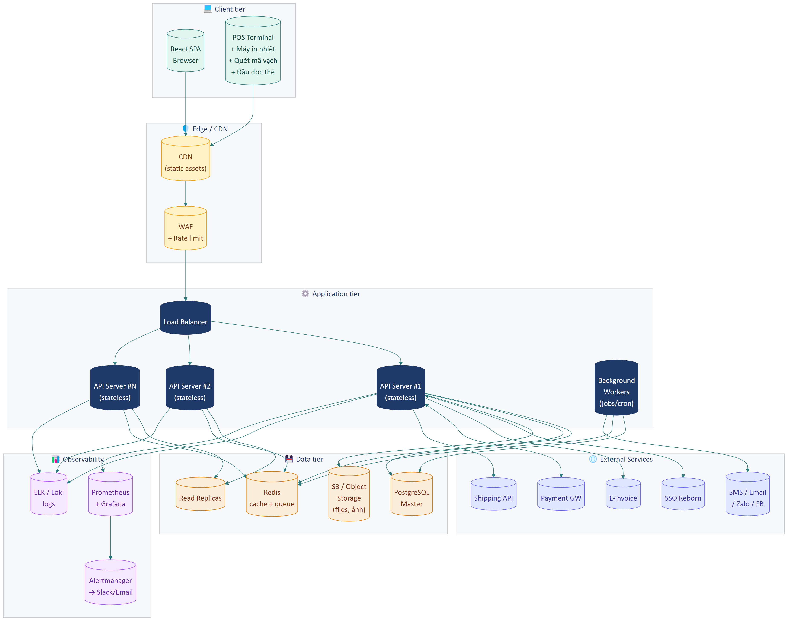

**Các tier:**

- **Client tier**: Browser SPA + POS terminal kèm các thiết bị ngoại vi.
- **Edge / CDN**: CDN cho static assets + WAF với rate limit.
- **Application tier**: Load balancer + nhiều API server stateless + background workers cho job/cron.
- **Data tier**: PostgreSQL master + read replicas + Redis (cache + queue) + Object storage (S3) cho file.
- **External Services**: SSO, E-invoice, Payment Gateway, SMS/Email/Zalo/FB, Shipping APIs.
- **Observability**: ELK/Loki cho logs + Prometheus/Grafana cho metrics + Alertmanager.

---

## D. Yêu cầu API

### IR-10 — REST API cho client

| Trường | Nội dung |
|--------|----------|
| **ID** | IR-10 |
| **Tên** | Backend cung cấp REST API |
| **Mô tả** | Frontend (React app) và các app bên ngoài giao tiếp với backend qua REST API. |
| **Quy ước** | • JSON request/response<br>• Authentication qua Bearer token (JWT từ SSO)<br>• Versioning qua URL prefix `/api/v1/`<br>• Pagination chuẩn: `?page=1&limit=20`<br>• Filter: `?filter[field]=value`<br>• Sort: `?sort=field,-createdAt`<br>• Error format: `{ code, message, details? }` |
| **Mức ưu tiên** | **M** |

### IR-11 — API Documentation

| Trường | Nội dung |
|--------|----------|
| **ID** | IR-11 |
| **Tên** | Có tài liệu API tự động |
| **Mô tả** | Backend phải có Swagger/OpenAPI spec public (cho dev nội bộ và khách hàng có quyền dev). |
| **Mức ưu tiên** | **S** |

### IR-12 — Rate limiting

| Trường | Nội dung |
|--------|----------|
| **ID** | IR-12 |
| **Tên** | API rate limit |
| **Mô tả** | Mỗi tenant có quota request/phút. Mặc định 600 req/phút. Có thể nâng theo gói SaaS. Khi vượt → trả HTTP 429. |
| **Mức ưu tiên** | **S** |

---

## E. Hỗ trợ thiết bị ngoại vi

### IR-13 — Máy in nhiệt POS

| Trường | Nội dung |
|--------|----------|
| **ID** | IR-13 |
| **Tên** | In trực tiếp qua máy in nhiệt |
| **Mô tả** | Hỗ trợ in hóa đơn qua máy in nhiệt 80mm/58mm cắm USB. |
| **Cơ chế** | Print qua trình duyệt (nếu driver hệ điều hành nhận) hoặc qua extension/agent client riêng. |
| **Mức ưu tiên** | **M** |

### IR-14 — Máy quét mã vạch

| Trường | Nội dung |
|--------|----------|
| **ID** | IR-14 |
| **Tên** | Hỗ trợ máy quét mã vạch USB |
| **Mô tả** | Máy quét USB tiêu chuẩn HID (giả lập gõ phím) — chỉ cần focus vào ô tìm và quét. |
| **Mức ưu tiên** | **M** |

### IR-15 — Đầu đọc thẻ RFID/QR

| Trường | Nội dung |
|--------|----------|
| **ID** | IR-15 |
| **Tên** | Đọc thẻ RFID hoặc camera quét QR cho check-in |
| **Mô tả** | Hỗ trợ thiết bị RFID HID (giả lập gõ phím) hoặc kết nối camera USB để quét QR. |
| **Mức ưu tiên** | **S** |

### IR-16 — Két thu ngân (Cash drawer)

| Trường | Nội dung |
|--------|----------|
| **ID** | IR-16 |
| **Tên** | Mở két tự động khi thanh toán tiền mặt |
| **Mô tả** | Két thu ngân kết nối qua máy in nhiệt (cable RJ11), tự mở khi in hóa đơn tiền mặt. |
| **Mức ưu tiên** | **S** |

---

## Tóm tắt yêu cầu Part 14

| Nhóm | Số yêu cầu | Must | Should | Could |
|------|:----------:|:----:|:------:|:-----:|
| Tích hợp ngoại vi | 9 | 4 | 4 | 1 |
| Yêu cầu dữ liệu | 9 | 8 | 1 | 0 |
| Yêu cầu API | 3 | 1 | 2 | 0 |
| Thiết bị ngoại vi | 4 | 2 | 2 | 0 |
| **Tổng** | **25** | **15** | **9** | **1** |

---

## Tổng kết toàn bộ URD

### Số lượng yêu cầu theo Part

| Part | Phân hệ | Tổng | M | S | C |
|------|---------|:----:|:-:|:-:|:-:|
| 01 | Truy cập hệ thống | 12 | 8 | 4 | 0 |
| 02 | Lễ tân | 20 | 11 | 8 | 1 |
| 03 | Thành viên | 16 | 5 | 8 | 3 |
| 04 | Giao dịch | 8 | 5 | 3 | 0 |
| 05 | Lưu trú | 7 | 5 | 2 | 0 |
| 06 | Tài chính | 11 | 8 | 3 | 0 |
| 07 | Đối tác & Phản hồi | 9 | 0 | 8 | 1 |
| 08 | Báo cáo | 8 | 4 | 3 | 1 |
| 09 | Ưu đãi & Chăm sóc | 12 | 2 | 7 | 3 |
| 10 | Kho & NVL | 9 | 8 | 1 | 0 |
| 11 | Cài đặt cơ bản | 14 | 8 | 5 | 1 |
| 12 | Cài đặt nâng cao | 23 | 6 | 11 | 6 |
| 13 | Phi chức năng | 37 | 20 | 15 | 2 |
| 14 | Tích hợp & Dữ liệu | 25 | 15 | 9 | 1 |
| **Tổng** | | **211** | **105** | **87** | **19** |

### Phân bổ ưu tiên

- **Must (M):** 105 yêu cầu — ~50%. Là tập tối thiểu cần đáp ứng cho phiên bản đầu.
- **Should (S):** 87 yêu cầu — ~41%. Quan trọng, nên có sớm.
- **Could (C):** 19 yêu cầu — ~9%. Tốt để có, có thể đẩy sang phiên bản sau.

### Trace từ HDSD ↔ URD

Mỗi mục trong HDSD (`docs/userguides/`) tương ứng với một hoặc nhiều yêu cầu trong URD này. Khi cần cập nhật:
- Thay đổi nghiệp vụ → cập nhật cả HDSD lẫn URD.
- Phát hiện lỗi → tham chiếu Tiêu chí chấp nhận trong URD để xác định behavior đúng.
- Lên scope phiên bản mới → review các yêu cầu Could/Won't và promote lên Should/Must.

---

*Hết Part 14 — Hết URD.*
