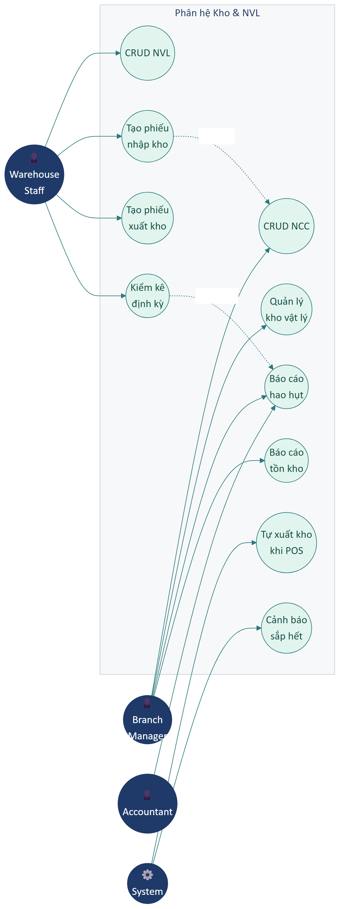

# Part 10 — Kho & Nguyên vật liệu

## Phạm vi

Phân hệ **Kho & Nguyên vật liệu** quản lý vòng đời sản phẩm vật lý của tenant: nguyên vật liệu, nhà cung cấp, kho vật lý, sổ kho (nhập/xuất), kiểm kê định kỳ, báo cáo tồn kho. Đây KHÔNG phải hệ thống ERP đầy đủ (xem Out-of-scope Part 00) — chỉ quản lý ở mức cơ bản phù hợp doanh nghiệp dịch vụ + bán lẻ nhỏ.

**Actors chính:** Kho thủ (Warehouse Staff), Branch Manager, Accountant (đối chiếu), Tenant Admin.

### Sơ đồ Use Case

---

## A. Nguyên vật liệu (Material catalog)

### UR-INV-01 — Quản lý danh mục NVL

| Trường | Nội dung |
|--------|----------|
| **ID** | UR-INV-01 |
| **Tên** | CRUD nguyên vật liệu / sản phẩm vật lý |
| **Actor** | Warehouse Staff, Tenant Admin |
| **Mô tả** | Tenant quản lý danh sách NVL với thông tin cốt lõi: mã, tên, danh mục, đơn vị, giá nhập trung bình, tồn hiện tại, tồn tối thiểu, NCC ưa dùng. |
| **Đầu vào** | • **Mã NVL** (S, ≤ 50, auto gen) • **Tên NVL** (M, ≤ 255) • **Danh mục** (M, select) • **Đơn vị tính** (M) • **Đơn vị quy đổi** (S, vd "1 hộp = 12 chai") • **Giá nhập** (M, ≥ 0) • **Giá bán** (S, nếu cũng bán lẻ) • **Tồn tối thiểu** (S, ngưỡng cảnh báo) • **NCC ưa dùng** (S) • **Mô tả** (S) • **Ảnh** (S, ≤ 5MB) |
| **Tiêu chí chấp nhận** | 1. CRUD đầy đủ. 2. Tồn hiện tại tự tính từ phiếu nhập − phiếu xuất. 3. Khi tồn < tồn tối thiểu → cảnh báo trong báo cáo. 4. Hỗ trợ nhiều đơn vị quy đổi (mua theo hộp, dùng theo cái). |
| **Mức ưu tiên** | **M** |

---

## B. Nhà cung cấp (Supplier)

### UR-INV-02 — Quản lý danh sách nhà cung cấp

| Trường | Nội dung |
|--------|----------|
| **ID** | UR-INV-02 |
| **Tên** | CRUD NCC kèm thông tin thanh toán và công nợ |
| **Actor** | Warehouse Staff, Accountant |
| **Mô tả** | Bảng liệt kê NCC với các thông tin liên hệ + thanh toán + công nợ phải trả. |
| **Đầu vào** | • **Tên NCC / Công ty** (M, ≤ 255) • **MST** (S, 10/13 số) • **Người liên hệ** (S) • **SĐT** (M) • **Email** (S) • **Địa chỉ** (S) • **Ngân hàng / STK** (S, để trả nợ qua CK) • **Hạn mức tín dụng** (S, được nợ tối đa bao nhiêu) • **Thời hạn nợ** (S, vd 30 ngày) • **Mô tả** (S) |
| **Tiêu chí chấp nhận** | 1. Cột bảng: Mã, Tên, Người liên hệ, SĐT, Email, Địa chỉ, Công nợ phải trả. 2. Bấm vào → xem chi tiết với tab Lịch sử nhập + Lịch sử trả nợ. 3. Cảnh báo khi vượt hạn mức tín dụng. |
| **Mức ưu tiên** | **M** |

---

## C. Kho vật lý

### UR-INV-03 — Quản lý nhiều kho

| Trường | Nội dung |
|--------|----------|
| **ID** | UR-INV-03 |
| **Tên** | Tenant có thể có nhiều kho vật lý |
| **Actor** | Tenant Admin, Branch Manager |
| **Mô tả** | Tenant tạo các kho như Kho chính, Kho bán lẻ, Kho sử dụng tại phòng dịch vụ. Mỗi NVL có thể tồn ở nhiều kho khác nhau. |
| **Đầu vào** | • **Tên kho** (M) • **Mã** (S, auto) • **Cơ sở** (M) • **Địa chỉ vật lý** (S) • **Người phụ trách** (S, select nhân viên) • **Trạng thái** (M, Đang dùng/Tạm khóa) |
| **Tiêu chí chấp nhận** | 1. CRUD đầy đủ. 2. Mỗi kho thuộc 1 cơ sở cụ thể. 3. Có thể chuyển NVL giữa các kho (UR-INV-05 với loại "Chuyển kho"). |
| **Mức ưu tiên** | **M** |

---

## D. Sổ kho (Nhập / Xuất)

### UR-INV-04 — Tạo phiếu nhập kho

| Trường | Nội dung |
|--------|----------|
| **ID** | UR-INV-04 |
| **Tên** | Ghi nhận hàng nhập từ NCC |
| **Actor** | Warehouse Staff |
| **Mô tả** | Form nhập kho với các trường thông tin và bảng hàng. Sau khi lưu, hệ thống cộng số lượng vào kho và (nếu trả tiền) sinh phiếu chi. |
| **Đầu vào (header)** | • **Mã phiếu** (S, auto) • **Ngày nhập** (M) • **Nhà cung cấp** (M, select) • **Kho nhận** (M, select) • **Phí vận chuyển** (S) • **Chiết khấu** (S, số hoặc %) • **Đã trả** (S, số tiền trả ngay) • **Quỹ chi** (M nếu Đã trả > 0) • **Ghi chú** (S) • **Chứng từ đính kèm** (S) |
| **Đầu vào (mỗi dòng hàng)** | • **NVL** (M, search) • **Số lượng** (M, > 0) • **Đơn giá nhập** (M, ≥ 0) • **Thuế VAT** (S, 0/5/8/10%) • **Thành tiền** (auto = SL × Đơn giá) |
| **Tiêu chí chấp nhận** | 1. Tổng tiền hàng + phí − chiết khấu = Tổng cộng (auto tính). 2. Còn nợ = Tổng cộng − Đã trả (auto). 3. Sau lưu:    • Cộng SL vào kho nhận    • Cập nhật giá nhập trung bình của NVL    • Sinh phiếu chi nếu có trả (UR-FIN-03)    • Tăng công nợ NCC nếu còn nợ (UR-FIN-10) 4. Phiếu lưu vĩnh viễn, có thể in ra và xem lại. |
| **Mức ưu tiên** | **M** |

### UR-INV-05 — Tạo phiếu xuất kho

| Trường | Nội dung |
|--------|----------|
| **ID** | UR-INV-05 |
| **Tên** | Ghi nhận xuất kho |
| **Actor** | Warehouse Staff |
| **Mô tả** | Tương tự phiếu nhập nhưng cho việc xuất hàng. Loại xuất gồm: Xuất bán, Xuất sử dụng nội bộ, Xuất chuyển kho, Xuất tiêu hủy. |
| **Tiêu chí chấp nhận** | 1. Form tương tự phiếu nhập. 2. Loại xuất "Chuyển kho" → tự sinh phiếu nhập tương ứng ở kho nhận. 3. Loại xuất "Bán" → ghi nhận doanh thu (gắn với đơn POS). 4. Trừ số lượng ở kho xuất. 5. Không cho xuất quá số tồn (trừ khi NVL được đánh dấu "Cho phép âm kho"). |
| **Mức ưu tiên** | **M** |

### UR-INV-06 — Tự động xuất kho từ POS

| Trường | Nội dung |
|--------|----------|
| **ID** | UR-INV-06 |
| **Tên** | Trừ tồn tự động khi bán hàng tại POS |
| **Actor** | Hệ thống |
| **Mô tả** | Khi đơn POS được thanh toán xác nhận, các sản phẩm vật lý trong giỏ tự động sinh phiếu xuất kho (loại "Bán") tương ứng. |
| **Tiêu chí chấp nhận** | 1. Liên kết phiếu xuất với mã đơn POS. 2. Sản phẩm dạng "Dịch vụ" KHÔNG sinh phiếu xuất. 3. Sản phẩm Quick Add (UR-RECEPTION-08) KHÔNG sinh phiếu xuất. 4. Hủy đơn POS → tự đảo phiếu xuất (cộng lại tồn). 5. Trả hàng → cộng lại tồn (UR-SALE-08). |
| **Mức ưu tiên** | **M** |

---

## E. Kiểm kê (Inventory checking)

### UR-INV-07 — Tạo phiếu kiểm kê định kỳ

| Trường | Nội dung |
|--------|----------|
| **ID** | UR-INV-07 |
| **Tên** | Quy trình kiểm kê và sinh phiếu điều chỉnh |
| **Actor** | Warehouse Staff, Branch Manager |
| **Mô tả** | Định kỳ (tuần/tháng/quý), nhân viên kho đếm thực tế và so với hệ thống. Hệ thống sinh phiếu điều chỉnh dư/thiếu. |
| **Tiêu chí chấp nhận** | 1. Tạo phiếu với: Kho, Ngày kiểm kê, Người kiểm kê. 2. Hệ thống load bảng tồn theo sổ (snapshot tại thời điểm kiểm kê). 3. Cột "Tồn thực tế" để nhân viên gõ. 4. Cột "Chênh lệch" tự tính. 5. Khi xác nhận → tự sinh phiếu điều chỉnh:    • NVL dư → cộng vào kho    • NVL thiếu → trừ bớt 6. Mỗi dòng chênh lệch yêu cầu nhập **lý do** (M). 7. Phiếu kiểm kê lưu vĩnh viễn để audit. |
| **Mức ưu tiên** | **M** |

### UR-INV-08 — Tính giá trị hao hụt

| Trường | Nội dung |
|--------|----------|
| **ID** | UR-INV-08 |
| **Tên** | Báo cáo hao hụt sau kiểm kê |
| **Actor** | Branch Manager, Accountant |
| **Mô tả** | Sau kiểm kê, hệ thống tính tổng giá trị NVL dư/thiếu, tỷ lệ hao hụt = giá trị thiếu / tổng giá trị tồn. |
| **Tiêu chí chấp nhận** | 1. Hiển thị chỉ số tổng ngay sau khi xác nhận kiểm kê. 2. Cảnh báo nếu tỷ lệ > ngưỡng cấu hình (mặc định 5%). 3. Lưu lịch sử kiểm kê để so sánh giữa các kỳ. |
| **Mức ưu tiên** | **S** |

---

## F. Báo cáo kho

### UR-INV-09 — Bộ báo cáo tồn kho

| Trường | Nội dung |
|--------|----------|
| **ID** | UR-INV-09 |
| **Tên** | Báo cáo tồn, nhập/xuất, sắp hết, hạn dùng |
| **Actor** | Warehouse Staff, Branch Manager |
| **Mô tả** | Bộ báo cáo tổng hợp về tồn kho. |
| **Tiêu chí chấp nhận** | 1. **Tồn kho hiện tại** — toàn bộ NVL với SL theo từng kho. 2. **Sắp hết hàng** — NVL có tồn < tồn tối thiểu (gợi ý nhập). 3. **Nhập – Xuất – Tồn** — bảng tổng hợp theo kỳ. 4. **Giá trị tồn kho** — tổng tiền đang nằm trong kho. 5. **NVL luân chuyển nhanh / chậm** — theo tốc độ xuất. 6. **Hạn sử dụng sắp hết** — nếu NVL có quản lý lô + hạn dùng. 7. **Lịch sử giá nhập** — biến động giá theo thời gian. 8. Mọi báo cáo có Filter kỳ + Xuất Excel. |
| **Mức ưu tiên** | **M** |

---

## Tóm tắt yêu cầu Part 10

| ID | Tên | Ưu tiên |
|----|-----|:-------:|
| UR-INV-01 | CRUD NVL | M |
| UR-INV-02 | CRUD NCC | M |
| UR-INV-03 | Quản lý kho | M |
| UR-INV-04 | Phiếu nhập kho | M |
| UR-INV-05 | Phiếu xuất kho | M |
| UR-INV-06 | Tự động xuất khi POS | M |
| UR-INV-07 | Kiểm kê định kỳ | M |
| UR-INV-08 | Báo cáo hao hụt | S |
| UR-INV-09 | Báo cáo tồn kho | M |

**Tổng:** 9 yêu cầu — 8 Must, 1 Should.

---

*Hết Part 10.*
