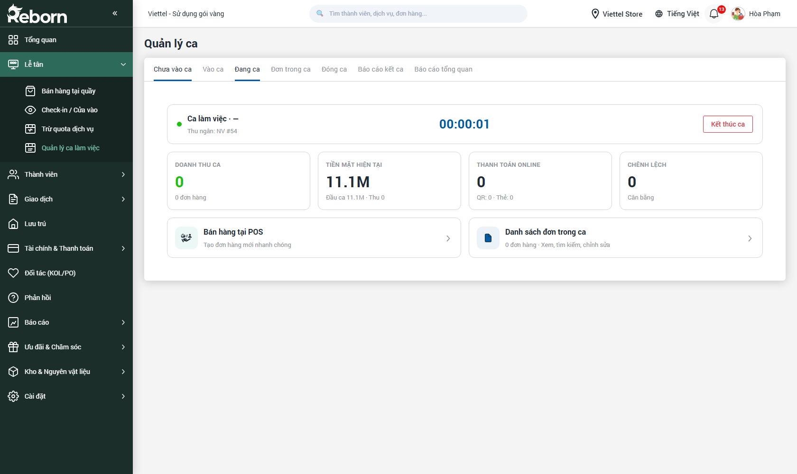
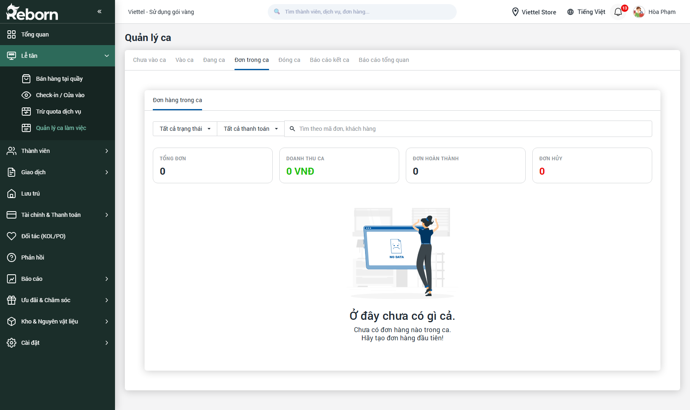
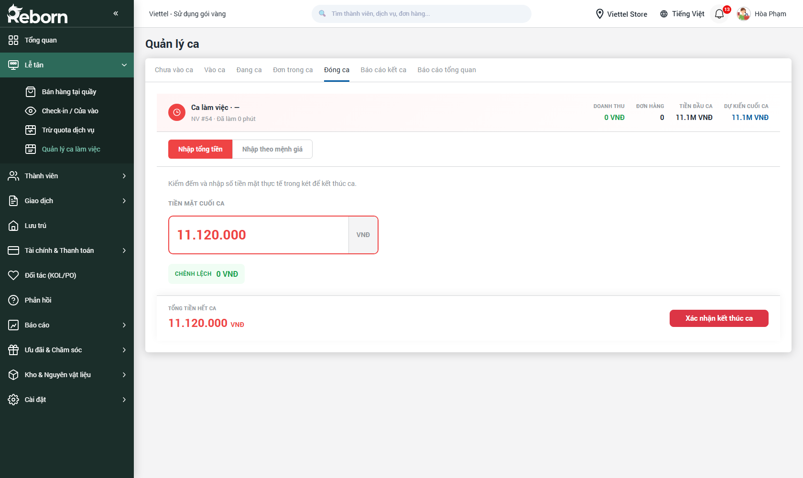
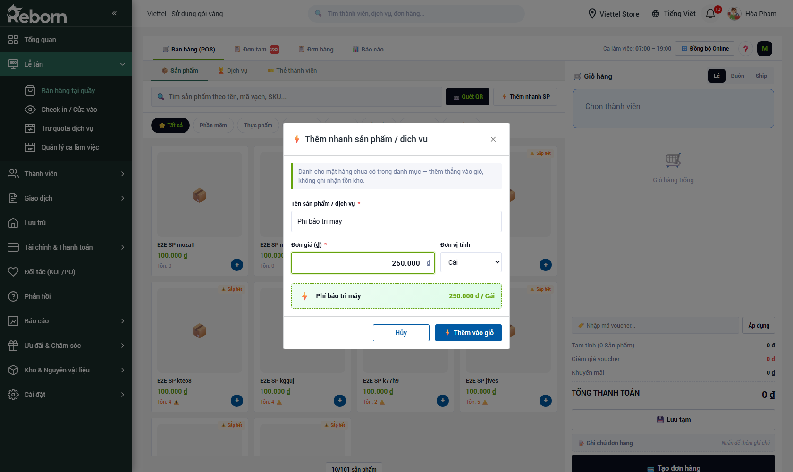
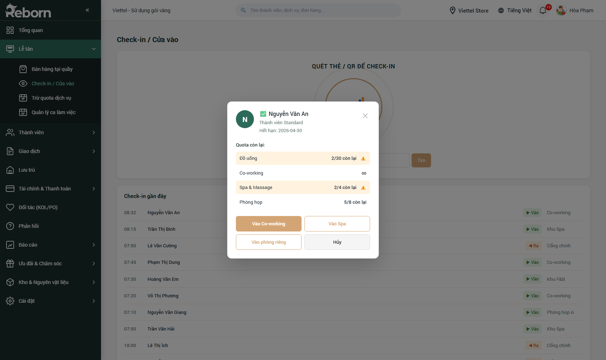
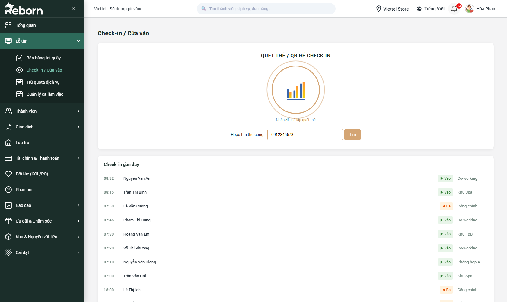
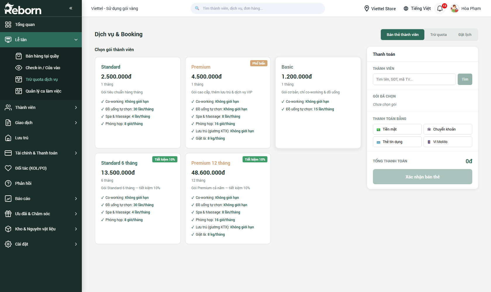
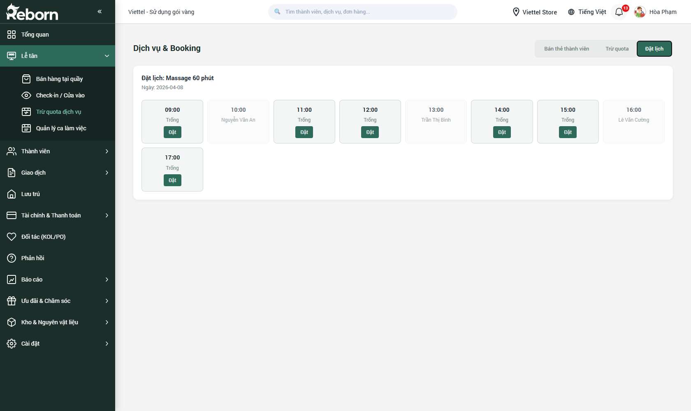

# Part 02 — Trạm FitPro 6-9h

*Phiên bản 0.6 — Tenant "FitPro"*

**Trạm FitPro 6-9h** là phân hệ bạn sẽ dùng nhiều nhất trong ngày. Đây là nơi tập trung 4 công việc "đứng chân tại trạm" của nhân viên lễ tân / huấn luyện viên trực:

1. **Quản lý ca làm việc** — mở ca đầu giờ, theo dõi ca, đóng ca cuối giờ, xem báo cáo kết ca.
2. **Bán hàng tại quầy (POS)** — tạo hóa đơn bán gói tập / sản phẩm phụ trợ cho hội viên.
3. **Check-in trạm** — ghi nhận hội viên vào trạm (quét thẻ, QR hoặc nhập tay).
4. **Trừ buổi tập** — trừ buổi tập trong gói đã mua sau khi hội viên hoàn tất buổi tập.

> **Quan trọng — thứ tự làm việc:** Bạn **phải mở ca** trước khi bán hàng tại trạm. Không có ca đang hoạt động thì hệ thống sẽ không ghi nhận hóa đơn vào ca nào, và cuối ngày không đối soát tiền mặt được. Đóng ca cuối ngày để hoàn tất báo cáo.

> **Ngữ cảnh mô hình FitPro 6-9h:** trạm hoạt động khung giờ 6h–9h sáng + 17h–21h tối, nhân viên trực theo ca. Một số trạm còn bật ca đêm (21h–24h) cho nhóm khách tập muộn. Gói tập được tính theo "buổi" — mỗi buổi là một lần vào trạm có check-in + check-out hợp lệ.

---

## Mục lục

- [A. Quản lý ca làm việc](#a-quản-lý-ca-làm-việc)
  - [A.1. Mở ca đầu ngày](#a1-mở-ca-đầu-ngày)
  - [A.2. Theo dõi ca đang mở](#a2-theo-dõi-ca-đang-mở)
  - [A.3. Xem các đơn trong ca](#a3-xem-các-đơn-trong-ca)
  - [A.4. Đóng ca / Kết toán](#a4-đóng-ca--kết-toán)
  - [A.5. Báo cáo kết ca](#a5-báo-cáo-kết-ca)
  - [A.6. Báo cáo tổng quan ca](#a6-báo-cáo-tổng-quan-ca)
- [B. Bán hàng tại quầy (POS)](#b-bán-hàng-tại-quầy-pos)
  - [B.1. Tổng quan giao diện](#b1-tổng-quan-giao-diện)
  - [B.2. Tạo một đơn bán đơn giản](#b2-tạo-một-đơn-bán-đơn-giản)
  - [B.3. Thêm mặt hàng không có trong danh mục (Thêm nhanh)](#b3-thêm-mặt-hàng-không-có-trong-danh-mục-thêm-nhanh)
  - [B.4. Gắn khách hàng cho đơn](#b4-gắn-khách-hàng-cho-đơn)
  - [B.5. Áp dụng khuyến mãi / voucher](#b5-áp-dụng-khuyến-mãi--voucher)
  - [B.6. Thanh toán](#b6-thanh-toán)
  - [B.7. Lưu đơn tạm & tiếp tục sau](#b7-lưu-đơn-tạm--tiếp-tục-sau)
- [C. Check-in / Cửa vào](#c-check-in--cửa-vào)
- [D. Trừ quota dịch vụ & Đặt lịch](#d-trừ-quota-dịch-vụ--đặt-lịch)
- [E. Luồng một ca làm việc điển hình](#e-luồng-một-ca-làm-việc-điển-hình)

---

## A. Quản lý ca làm việc

**Đường dẫn:** Sidebar → **Lễ tân** → **Quản lý ca làm việc**
**URL:** `/crm/shift_management`

Mỗi lần bạn đến quầy bắt đầu công việc, hệ thống cần biết "ca của bạn bắt đầu khi nào, trong két có bao nhiêu tiền". Cuối ngày, hệ thống cần biết "bạn đã thu thêm bao nhiêu, còn lại trong két bao nhiêu". Tất cả nằm trong phân hệ này.

Màn hình Quản lý ca có **7 tab** tương ứng 7 bước/trạng thái khác nhau của một ca:

| # | Tab | Khi nào hiện / Dùng để làm gì |
|---|-----|-------------------------------|
| 1 | **Chưa vào ca** | Chưa có ca nào đang mở. Hiển thị danh sách các cấu hình ca có thể mở và nút **Mở ca này** |
| 2 | **Vào ca** | Form nhập tiền đầu ca (tổng tiền hoặc chi tiết mệnh giá) |
| 3 | **Đang ca** | Theo dõi tình trạng ca hiện tại: thời gian, tiền mặt, giao dịch |
| 4 | **Đơn trong ca** | Danh sách các đơn bán hàng đã tạo trong ca này |
| 5 | **Đóng ca** | Nhập tiền mặt thực tế cuối ca, so với hệ thống, phát hiện chênh lệch |
| 6 | **Báo cáo kết ca** | In báo cáo kết ca ngay sau khi đóng (cho quản lý / bàn giao) |
| 7 | **Báo cáo tổng quan** | Thống kê tổng hợp của tất cả các ca (không chỉ ca hiện tại) |

> **Lưu ý:** Nếu ca đã mở từ trước mà bạn chưa đóng, khi vào lại trang Quản lý ca, hệ thống tự động đưa bạn về tab **Đang ca** để tiếp tục. Bạn không cần mở ca mới.

### A.1. Mở ca đầu ngày

**Khi nào:** Đầu giờ làm, trước khi bán hàng bất kỳ thứ gì.

**Các bước:**

1. Vào **Lễ tân → Quản lý ca làm việc**.
2. Nếu bạn đang ở tab **Chưa vào ca**, hệ thống hiển thị danh sách các cấu hình ca (ví dụ: *"Ca sáng — 8:00–14:00"*, *"Ca chiều — 14:00–22:00"*, *"Ca toàn thời gian"*). Các cấu hình này do quản lý trạm cài trước trong **Cài đặt → Vận hành cơ sở** (xem Part 11).

   

3. Bấm nút **Mở ca này** ở ca bạn muốn mở. Hệ thống chuyển sang tab **Vào ca**.

4. Trên tab **Vào ca**, bạn cần nhập **tiền mặt đầu ca** (số tiền thực tế đang có trong két khi bắt đầu ca). Có hai cách nhập:

   

   **Cách 1 — Nhập tổng tiền (nhanh):**
   - Bấm nút **Nhập tổng tiền** (mặc định đang chọn).
   - Gõ số tiền vào ô **Tiền mặt đầu ca**. Hệ thống sẽ tự động thêm dấu phẩy ngăn cách nghìn khi bạn gõ.
   - Đơn vị mặc định là **VNĐ**.
   - Nếu cấu hình ca có **tiền mặc định đầu ca**, sẽ có nút *"Dùng mặc định: X VNĐ"* — bấm để lấy nhanh.

   **Cách 2 — Nhập theo mệnh giá (chính xác):**
   - Bấm nút **Nhập theo mệnh giá**.
   - Bảng hiển thị **9 mệnh giá**: 500.000 / 200.000 / 100.000 / 50.000 / 20.000 / 10.000 / 5.000 / 2.000 / 1.000 đồng.
   - Với mỗi mệnh giá, đếm số tờ thực tế trong két rồi bấm nút **+** để tăng hoặc **−** để giảm. Có thể gõ thẳng số tờ vào ô.
   - Cột **Thành tiền** tự động tính: mệnh giá × số tờ.
   - Cột **TỔNG TIỀN ĐẦU CA** ở dưới cùng cộng lại toàn bộ.

5. Bấm **Xác nhận vào ca** để mở ca.

#### Quy định nhập liệu — Tiền mặt đầu ca

| Mục | Ràng buộc | Ghi chú |
|-----|-----------|---------|
| **Tiền mặt đầu ca** | Bắt buộc | Nếu bỏ trống hoặc = 0, hệ thống báo lỗi "Vui lòng nhập số tiền đầu ca" và không cho mở ca |
| Định dạng | Số nguyên dương, VNĐ | Không nhập số âm, không nhập số thập phân |
| Kiểu nhập | Chỉ số (ký tự khác bị loại tự động) | Dấu phẩy ngăn cách nghìn được thêm tự động khi hiển thị |
| Số tờ mệnh giá | Số nguyên ≥ 0 | Nhấn **−** khi số tờ = 0 không có tác dụng |

> **Mẹo:** Nên dùng **Nhập theo mệnh giá** đầu ngày để tránh đếm nhầm. Chế độ này giúp bạn cũng đồng thời "kiểm kê két" — phát hiện ngay nếu đêm qua có gì bất thường.

### A.2. Theo dõi ca đang mở

Sau khi xác nhận vào ca, hệ thống chuyển sang tab **Đang ca**.


Màn hình này là **bảng điều khiển thời gian thực** của ca bạn:

- **Đồng hồ bấm giờ** (format `HH:MM:SS`) — thời gian đã trôi kể từ lúc mở ca. Tự động đếm.
- **Tên ca + trạng thái** — tên ca bạn đang mở, kèm trạng thái *"Đang làm"*.
- **4 chỉ số nhanh (thẻ số)**:
  - **Tiền mặt đầu ca** — số tiền bạn đã khai báo lúc vào ca.
  - **Tổng tiền mặt thực thu** — tiền mặt thu được từ các đơn bán hàng trong ca.
  - **Tổng khoản thanh toán** — tổng tất cả phương thức (cash + chuyển khoản + thẻ + ví).
  - **Chênh lệch** — sẽ được tính lúc đóng ca.
- **Nút Kết thúc ca** (đỏ, góc trên phải) — bấm khi bạn sẵn sàng đóng ca.
- **2 ô hành động nhanh**:
  - **Bán hàng tại POS** — mở thẳng màn hình POS không cần đi qua sidebar.
  - **Danh sách đơn trong ca** — chuyển sang tab **Đơn trong ca**.

> **Lưu ý:** Nếu bạn đóng trình duyệt giữa chừng rồi mở lại, ca **vẫn giữ nguyên trạng thái đang mở** trong hệ thống (lưu trên server). Khi đăng nhập lại, vào Quản lý ca sẽ tự về tab **Đang ca**. Không cần mở ca lần nữa.

### A.3. Xem các đơn trong ca

Bấm tab **Đơn trong ca** để xem toàn bộ hóa đơn đã tạo kể từ lúc mở ca.



Màn hình gồm:

- **Bộ lọc**: Tất cả trạng thái / Tất cả thanh toán (dropdown).
- **Ô tìm kiếm**: gõ mã đơn để tìm nhanh.
- **4 chỉ số tổng hợp**: Công nợ — Doanh thu ca — Giờ trung bình — Đơn hàng.
- **Danh sách đơn**: khi chưa có đơn, hiển thị *"Ở đây chưa có gì cả. Hãy tạo đơn hàng đầu tiên!"*.

Bấm vào một đơn để xem chi tiết (sản phẩm, tiền, khách hàng, thời gian). Dùng màn này để:
- Kiểm tra nhanh tổng kết ca tạm thời trước khi đóng.
- Tìm đơn cũ để in lại hóa đơn / voucher cho khách.
- Đối chiếu khi khách thắc mắc.

### A.4. Đóng ca / Kết toán

**Khi nào:** Cuối ca / cuối ngày, trước khi ra về. Phải đóng ca mới tính đúng doanh thu và chuyển bàn giao cho ca sau.

**Các bước:**

1. Ở tab **Đang ca**, bấm nút **Kết thúc ca** (đỏ).
2. Hệ thống chuyển sang tab **Đóng ca**.

   

3. Trên màn hình Đóng ca, bạn thấy:
   - **Tổng hệ thống tính** (màu cam) — số tiền lẽ ra đang phải có trong két theo hệ thống (= Tiền đầu ca + tiền mặt thu được).
   - **Ô "Tiền mặt xuất ca"** (viền đỏ) — đây là nơi bạn gõ **số tiền thực tế** đang có trong két khi kiểm.
   - **Chênh lệch** (0 VNĐ nếu khớp, âm nếu thiếu, dương nếu dư).
   - Có 2 chế độ nhập: **Nhập tổng** hoặc **Nhập theo mệnh giá** (giống lúc mở ca).
4. Kiểm két thực tế, gõ số tiền, đối chiếu **Chênh lệch**.
5. Nếu có chênh lệch → điền lý do vào ô **Ghi chú chênh lệch** (xuất hiện khi chênh lệch ≠ 0).
6. Bấm **Đóng ca / Xác nhận kết ca**.

> **Lưu ý quan trọng:** Sau khi đóng ca, bạn **không thể tạo đơn bán hàng mới** cho đến khi mở ca tiếp theo. Vì vậy nên đóng ca **sau khi** đã chắc chắn không còn khách.

#### Quy định nhập liệu — Tiền mặt xuất ca

| Mục | Ràng buộc | Ghi chú |
|-----|-----------|---------|
| **Tiền mặt xuất ca** | Bắt buộc | Tương tự tiền đầu ca |
| Chênh lệch = 0 | Khuyến khích | Không bắt buộc, hệ thống vẫn cho đóng ca nếu chênh lệch |
| Ghi chú khi chênh lệch | Khuyến khích | Để quản lý biết nguyên nhân (hao hụt / khách trả nhầm / đổi tiền…) |

### A.5. Báo cáo kết ca

Ngay sau khi đóng ca, hệ thống chuyển sang tab **Báo cáo kết ca**.


Đây là **bản in kết ca** đầy đủ, gồm:

- **4 chỉ số tổng lớn** (trên cùng): Tiền mặt / Ngân hàng / Thẻ / Ví điện tử.
- **Danh mục chi tiết** (bảng giữa): Tiền vốn / Tiền ngân hàng / Giao dịch / Chuyển khoản / Tổng doanh thu…
- **Thẻ "BÁO CÁO KẾT CA"** (phải):
  - Mã ca, ngày, giờ vào/ra ca, nhân viên, tổng tiền đầu ca, chênh lệch.
  - **3 nút hành động**:
    - **In bảng cáo** — in ra giấy qua máy in gắn máy tính.
    - **Xuất Excel** — tải file `.xlsx` để gửi email / lưu trữ.
    - **Gửi Quản lý** — đẩy báo cáo vào hộp thư nội bộ của người quản lý.

> **Mẹo:** Nên **In bảng cáo** kèm ký tên nhân viên ở cuối, dán vào bìa kẹp ca làm việc. Đây là tài liệu bàn giao tiêu chuẩn khi có tranh chấp về tiền két.

### A.6. Báo cáo tổng quan ca

Tab **Báo cáo tổng quan** khác **Báo cáo kết ca** ở chỗ: nó không phải của **một ca** mà là **tổng hợp nhiều ca** (theo ngày / tuần / tháng). Thường quản lý trạm xem ở đây.


Gồm:
- **4 chỉ số tổng**: Tổng số ca — Nhân viên vào ca — Tổng ca bận — Chênh lệch tích lũy.
- **2 biểu đồ** (tab chuyển đổi):
  - **Trạng thái ca đang vận hành** — ai đang mở ca, ai đã đóng.
  - **Nhân viên đang mở ca** — chi tiết nhân viên nào mở ca nào, từ khi nào.

---

## B. Bán hàng tại quầy (POS)

**Đường dẫn:** Sidebar → **Lễ tân** → **Bán hàng tại quầy**
**URL:** `/crm/create_sale_add`

Đây là công cụ chính của nhân viên thu ngân. Giao diện được thiết kế theo kiểu **POS (Point of Sale)** — màn hình chia thành 2 phần lớn: bên trái là sản phẩm, bên phải là giỏ hàng.

> **Yêu cầu:** Phải có ca đang mở ([A.1](#a1-mở-ca-đầu-ngày)). Nếu chưa mở ca, hệ thống có thể vẫn cho bạn thao tác nhưng đơn sẽ không gắn vào ca nào và báo cáo cuối ngày sẽ bị lệch.

### B.1. Tổng quan giao diện


Màn hình có 5 khu vực:

| Khu vực | Vị trí | Chức năng |
|---------|--------|-----------|
| **Thanh tab công việc** | Trên cùng | **Bán hàng (POS)** / **Bán thẻ** / **Bán LP** / **Đơn tạm** / **Đơn hàng** / **Báo cáo** — chuyển giữa các chế độ. Tab **Bán hàng (POS)** là mặc định |
| **Thanh lọc danh mục** | Trên khu sản phẩm | *Tất cả sản phẩm*, *Phân loại*, *Thời giờ*, *Voucher*, *Set combo*, *Gói dịch vụ*… — lọc nhanh theo nhóm |
| **Lưới sản phẩm** | Giữa — lớn | Các card sản phẩm có hình, tên, giá. Bấm để thêm vào giỏ |
| **Giỏ hàng** | Cột phải | Chọn khách → danh sách món đã thêm → tổng tiền → nút thanh toán |
| **Ô tìm kiếm sản phẩm** | Trên lưới | Gõ tên / mã / barcode để tìm nhanh |

### B.2. Tạo một đơn bán đơn giản

**Kịch bản:** Khách đến quầy chọn 1 dịch vụ massage + 1 chai nước. Bạn cần xuất hóa đơn, thu tiền mặt.

**Các bước:**

1. Mở **Bán hàng tại quầy**. Mặc định đang ở tab **Bán hàng (POS)**.

2. **Lọc hoặc tìm sản phẩm:**
   - **Cách A — Lọc theo nhóm:** Bấm vào nhãn danh mục trên thanh lọc (*Phân loại*, *Gói dịch vụ*, v.v.) để chỉ hiện nhóm đó.
   - **Cách B — Tìm tên:** Gõ vào ô tìm kiếm (trên lưới sản phẩm). Hệ thống lọc theo thời gian thực.
   - **Cách C — Quét mã vạch:** Dùng máy quét USB cắm vào máy tính, con trỏ trong ô tìm kiếm → quét mã → sản phẩm tự nhảy vào giỏ.

3. **Bấm vào card sản phẩm** để thêm vào giỏ hàng bên phải.
   - Nếu sản phẩm có **biến thể** (ví dụ size S/M/L, màu đỏ/xanh), hệ thống sẽ mở **Modal chọn biến thể** — chọn biến thể → **Xác nhận**.
   - Nếu sản phẩm đơn giản, nhảy thẳng vào giỏ với số lượng 1.

4. **Điều chỉnh số lượng trong giỏ:**
   - Bấm **+** / **−** bên cạnh tên món.
   - Hoặc gõ thẳng số vào ô số lượng.
   - Bấm biểu tượng **thùng rác** để xóa món khỏi giỏ.

5. **Kiểm tra tổng tiền** hiển thị cuối giỏ hàng — mục **TỔNG THANH TOÁN**.

6. Bấm nút **Thanh toán** (hoặc **Tạo đơn hàng**) ở cuối cột giỏ.

7. **Modal thanh toán** hiện lên — chọn phương thức, nhập số tiền khách đưa, xác nhận. Xem chi tiết ở [B.6](#b6-thanh-toán).

8. Sau khi xác nhận, hệ thống in hóa đơn và **reset giỏ hàng** — sẵn sàng cho khách tiếp theo.

> **Mẹo làm việc nhanh:**
> - Luôn dùng máy quét mã vạch nếu có. Nhanh gấp 5 lần bấm chọn thủ công.
> - Dùng phím **Enter** thay cho bấm chuột ở hầu hết các bước (Tìm → Enter; Thanh toán → Enter → Enter).

### B.3. Thêm mặt hàng không có trong danh mục (Thêm nhanh)

**Khi nào:** Khách yêu cầu một dịch vụ phát sinh mà quản lý chưa kịp thêm vào danh mục (ví dụ *"Phí bảo trì máy"*, *"Phí giữ xe"*, một món hàng nhỏ lẻ…).

**Các bước:**

1. Trong màn **Bán hàng tại quầy**, tìm nút **Thêm nhanh** (biểu tượng ⚡) — thường nằm ở trên lưới sản phẩm hoặc trong menu "thêm" của giỏ hàng.
2. Bấm vào để mở **Modal Thêm nhanh sản phẩm / dịch vụ**.

   

3. Điền thông tin:

#### Quy định nhập liệu — Thêm nhanh sản phẩm/dịch vụ

| Trường | Bắt buộc | Định dạng | Ràng buộc | Ghi chú |
|--------|:--------:|-----------|-----------|---------|
| **Tên sản phẩm / dịch vụ** | ✓ | Chuỗi văn bản | Không được trống, tự động loại khoảng trắng đầu/cuối | Ví dụ: *"Phí lắp đặt"*, *"Cáp sạc iPhone 15"* |
| **Đơn giá (₫)** | ✓ | Số nguyên dương | > 0 | Tự động thêm dấu chấm ngăn cách nghìn khi gõ; ký tự không phải số bị loại |
| **Đơn vị tính** | — | Chọn từ danh sách | Cái / Chiếc / Hộp / Kg / Gram / Lít / Bộ / Dịch vụ / Giờ / Lần | Mặc định *"Cái"* |

**Lỗi hay gặp:**
- Bỏ trống **Tên** → báo đỏ: *"Vui lòng nhập tên sản phẩm / dịch vụ"*
- Đơn giá = 0 hoặc để trống → báo đỏ: *"Vui lòng nhập giá hợp lệ (> 0)"*

4. Xem **Preview** (hiện khi đã điền đủ Tên + Giá): đây là cách sản phẩm sẽ hiển thị trong giỏ hàng.
5. Bấm **⚡ Thêm vào giỏ** (hoặc nhấn **Enter**) — món được thêm ngay. Bấm **Hủy** để đóng modal không thêm.

> **Quan trọng:** Sản phẩm thêm nhanh chỉ có tác dụng **trong đơn này** — nó **không được lưu vào danh mục**, **không trừ tồn kho**. Nếu là mặt hàng sẽ bán nhiều lần, nên nói với quản lý thêm chính thức trong **Cài đặt → Danh mục dịch vụ** (xem Part 11).

### B.4. Gắn khách hàng cho đơn

**Khi nào:** Khách là hội viên, muốn cộng điểm / ghi nhận lịch sử mua hàng / áp dụng giá ưu đãi của gói thành viên.

**Các bước:**

1. Trong giỏ hàng (cột phải), tìm khu vực **Chọn thành viên** ở trên cùng. Bấm vào.
2. **Modal Chọn khách hàng** mở ra với 2 cách tìm:
   - **Tìm kiếm**: gõ tên / SĐT / mã thành viên → danh sách gợi ý hiện ra → bấm chọn.
   - **Thêm mới**: nếu khách chưa có trong hệ thống, bấm **+ Thêm mới thành viên** → mở **SlidePanel Thêm nhanh thành viên**.
3. Khi chọn xong, thông tin khách hiển thị ở đầu giỏ: tên, avatar, gói hiện tại, điểm tích lũy, công nợ (nếu có).

#### Quy định nhập liệu — SlidePanel Thêm nhanh thành viên

Khi bấm **+ Thêm mới** trong modal chọn khách, một panel trượt từ bên phải hiện lên:

| Trường | Bắt buộc | Định dạng | Ràng buộc | Ghi chú |
|--------|:--------:|-----------|-----------|---------|
| **Loại thành viên** | — | Radio | Cá nhân / Doanh nghiệp | Mặc định *"Cá nhân"* |
| **Họ tên** *(Cá nhân)* hoặc **Tên công ty** *(Doanh nghiệp)* | ✓ | Chuỗi | Không trống, tự loại khoảng trắng đầu/cuối | Ví dụ: *"Nguyễn Văn An"* hoặc *"Công ty TNHH ABC"* |
| **Số điện thoại** | ✓ | Số điện thoại | Không trống | Placeholder: *"0912 345 678"*. Nên nhập đúng 10 số VN |
| **Email** | — | Email | Định dạng email nếu có nhập | Có thể để trống |
| **Giới tính** *(chỉ Cá nhân)* | — | Radio | Nam / Nữ / Khác | Mặc định *"Nam"* |
| **Ghi chú** | — | Textarea 2 dòng | Tối đa không giới hạn nghiêm ngặt, nhưng nên < 500 ký tự | Để quản lý nhớ đặc điểm khách |

**Lỗi hay gặp:**
- Bỏ trống **Họ tên** → toast đỏ: *"Vui lòng nhập tên thành viên"*
- Bỏ trống **Số điện thoại** → toast đỏ: *"Vui lòng nhập số điện thoại"*
- Số điện thoại trùng với khách đã có → backend trả lỗi, hiển thị: *"Số điện thoại đã tồn tại"* (bạn sẽ cần dùng chức năng Tìm để chọn khách cũ)

**Nút hành động ở cuối panel:**
- **Nhập đầy đủ →** — đóng panel nhanh và mở trang **Chi tiết thành viên** đầy đủ (80+ trường) để nhập hồ sơ hoàn chỉnh. Dành cho trường hợp khách VIP cần lưu chi tiết.
- **Hủy** — bỏ, không tạo.
- **Tạo nhanh** — tạo khách với chỉ các trường tối thiểu.

> **Mẹo:** Ở quầy đông khách, luôn dùng **Tạo nhanh**. Các thông tin khác có thể bổ sung sau khi khách đi.

### B.5. Áp dụng khuyến mãi / voucher

**Khi nào:** Khách có voucher / mã khuyến mãi / đang trong chương trình giảm giá.

**Các bước:**

1. Sau khi đã thêm sản phẩm vào giỏ, tìm nút **Khuyến mãi / Áp mã giảm giá** trong giỏ hàng (cuối giỏ, trên mục TỔNG).
2. Bấm để mở **Modal khuyến mãi** — gồm 2 mục:
   - **Khuyến mãi đủ điều kiện** — các chương trình đang áp dụng được với giỏ hiện tại. Bấm **Chọn** để dùng.
   - **Khuyến mãi chưa đủ điều kiện** — các chương trình gần đủ (ví dụ "Mua thêm 50k để được giảm 10%"). Hiển thị lý do chưa áp được để bạn gợi ý khách mua thêm.
3. Nếu khách có **mã voucher rời** (code giấy), gõ vào ô **Nhập mã** → bấm **Áp dụng**.
4. Sau khi áp, giỏ hàng hiển thị thêm dòng **Giảm giá** với số tiền âm, và TỔNG THANH TOÁN được cập nhật.

### B.6. Thanh toán

**Các bước:**

1. Bấm **Thanh toán** ở cuối giỏ hàng.
2. **Modal Thanh toán** hiện lên với các lựa chọn phương thức:
   - **Tiền mặt** — mặc định chọn.
   - **Chuyển khoản** — kèm QR để khách quét.
   - **Thẻ** (quẹt máy POS bank).
   - **Ví điện tử** (MoMo, ZaloPay, v.v. nếu đã tích hợp).
3. Gõ **Số tiền khách đưa** vào ô tương ứng (với tiền mặt). Hệ thống tự tính **Tiền thối lại**.
4. Nếu khách muốn **thanh toán nhiều phương thức** (một nửa cash, một nửa chuyển khoản), bấm **+ Thêm phương thức** để chia nhỏ.
5. Nếu khách **nợ một phần**, tick ô **Cho phép ghi nợ** và nhập **Số còn nợ**. Hệ thống ghi công nợ cho khách này (chỉ áp dụng khi đã gắn khách vào đơn — xem [B.4](#b4-gắn-khách-hàng-cho-đơn)).
6. Bấm **Xác nhận thanh toán**.
7. **Modal Hóa đơn** (Receipt) hiện lên với đầy đủ chi tiết đơn. Bấm **In hóa đơn** (máy in gắn máy) hoặc **Gửi SMS / Email** cho khách.
8. Bấm **Đóng** để reset giỏ và sẵn sàng cho đơn tiếp theo.

#### Quy định nhập liệu — Modal Thanh toán

| Trường | Bắt buộc | Ghi chú |
|--------|:--------:|---------|
| **Phương thức** | ✓ | Chọn ít nhất 1 |
| **Số tiền đã trả** | ✓ | Phải ≥ 0. Nếu < tổng đơn và **Cho phép ghi nợ** tắt → báo lỗi |
| **Số còn nợ** | — | Tự tính = tổng đơn − đã trả. Chỉ ghi nhận khi có khách gắn vào đơn |
| **Ghi chú hóa đơn** | — | Textarea tùy chọn để in lên hóa đơn |

### B.7. Lưu đơn tạm & tiếp tục sau

**Khi nào:** Khách bỏ ngang / đang chọn hàng nhưng phải trả lời điện thoại / bạn cần xử lý khách khác trước.

**Các bước:**

1. Trong giỏ hàng, bấm nút **Lưu đơn tạm** (hoặc biểu tượng **☐** / **Lưu nháp**).
2. Giỏ hàng được lưu vào **Đơn tạm**, giỏ hiện tại trống đi để bán khách mới.
3. Muốn quay lại đơn cũ: bấm tab **Đơn tạm** trên thanh công việc trên cùng → chọn đơn → bấm **Tiếp tục**.
4. Đơn tạm có thời hạn (theo cấu hình tenant) — sau N ngày không xử lý, hệ thống tự xóa.

> **Lưu ý:** Đơn tạm **không trừ tồn kho** và **không được ghi nhận doanh thu**. Chỉ khi bấm **Thanh toán + Xác nhận** đơn mới chính thức.

---

## C. Check-in / Cửa vào

**Đường dẫn:** Sidebar → **Lễ tân** → **Check-in / Cửa vào**
**URL:** `/crm/ch_checkin`

**Khi nào dùng:** Khách là hội viên đến sử dụng dịch vụ đã mua (không phải mua mới). Check-in giúp:
- Ghi nhận khách đến → có mặt trong báo cáo lượt check-in hằng ngày.
- Kiểm tra hạn thẻ / quota còn lại trước khi cho khách vào khu dịch vụ.
- Làm dữ liệu cho báo cáo lưu lượng (giờ cao điểm, khách hay đi lúc nào).

### C.1. Tổng quan giao diện


Màn hình gồm 2 phần:

- **Khung quét (trên)**:
  - Vòng tròn lớn với icon — vùng quét thẻ RFID / QR. Bấm vào vòng tròn = **giả lập quét** (dùng khi test hoặc khi máy quét chưa gắn).
  - Dưới vòng tròn: ô **Tìm thủ công** — gõ Tên / SĐT / Mã thành viên rồi bấm **Tìm**.
- **Check-in gần đây (dưới)**: danh sách 15 lượt check-in/check-out gần nhất, hiển thị giờ — tên — hướng (▶ Vào / ◀ Ra) — khu vực.

### C.2. Quét thẻ hoặc QR

**Các bước:**

1. Khách đưa thẻ thành viên hoặc QR trên app di động.
2. Đưa thẻ/điện thoại gần **đầu đọc RFID/QR** gắn với máy tính — hệ thống tự nhận và mở popup.
   - *(Nếu chưa có máy quét, bấm vào vòng tròn trên màn hình để giả lập.)*

3. **Popup kết quả** hiển thị:

   

   - **Avatar** + **Tên khách**.
   - **Trạng thái thẻ** (màu theo trạng thái):
     - ✅ **Active** — còn hiệu lực.
     - ⚠️ **Cảnh báo** — sắp hết hạn / sắp hết quota.
     - ❌ **Expired** — đã hết hạn, không cho vào.
   - **Gói thành viên** + **Ngày hết hạn**.
   - **Quota còn lại** — danh sách các dịch vụ với số lượt còn / tổng lượt. Ví dụ *"Co-working: 18/20 còn lại"*, *"Spa & Massage: 2/6 còn lại ⚠️"*, *"Nước uống: ∞"* (không giới hạn).
   - **Các nút Vào khu**:
     - **Vào Co-working**
     - **Vào Spa**
     - **Vào phòng riêng**
     - **Hủy**

4. Bấm đúng khu vực khách sẽ vào → hệ thống ghi nhận check-in + toast *"Check-in thành công vào [khu vực]!"*.

> **Lưu ý:**
> - Nếu thẻ **hết hạn** hoặc **quota = 0**, nút Vào sẽ bị mờ và có cảnh báo. Bạn cần hướng dẫn khách mua gói mới hoặc gia hạn (xem [D.1](#d1-bán-thẻ-thành-viên)).
> - Nếu cảnh báo **sắp hết quota** (vàng), nhắc khách gia hạn nhẹ nhàng — đây là cơ hội upsell.

### C.3. Tìm khách thủ công

**Khi nào:** Khách quên thẻ / điện thoại hết pin.

**Các bước:**



1. Trong ô **Hoặc tìm thủ công**, gõ:
   - **Số điện thoại** (ưu tiên vì duy nhất) — ví dụ *"0912345678"*
   - hoặc **Tên thành viên** (ví dụ *"Nguyễn Văn A"*)
   - hoặc **Mã thành viên** (nếu nhớ)
2. Bấm **Tìm** hoặc **Enter**.
3. Nếu có khớp, popup kết quả hiện ra như trên. Nếu có nhiều khớp (ví dụ nhiều khách cùng tên), sẽ có danh sách để bạn chọn.
4. Xác minh khách bằng cách hỏi thêm (CMND / ngày sinh / số điện thoại đăng ký).

### C.4. Check-in gần đây

Phần dưới màn hình là **lịch sử check-in trong ngày** (mặc định 15 lượt mới nhất). Mỗi dòng hiển thị:

| Cột | Ví dụ |
|-----|-------|
| Giờ | `09:32` |
| Tên | Nguyễn Văn An |
| Hướng | ▶ Vào / ◀ Ra |
| Khu vực | Co-working |

Dùng danh sách này để:
- Biết hiện có ai trong khu dịch vụ.
- Tra cứu nhanh khi khách hỏi "tôi vào lúc nào?".
- Đối chiếu khi có sự cố (mất đồ, tranh chấp…).

---

## D. Trừ quota dịch vụ & Đặt lịch

**Đường dẫn:** Sidebar → **Lễ tân** → **Trừ quota dịch vụ**
**URL:** `/crm/ch_services`

Thực chất màn hình này có tên đầy đủ là **Dịch vụ & Booking** và gồm **3 tab** bạn có thể chuyển qua lại ở góc phải:

1. **Bán thẻ thành viên** — bán gói hội viên mới cho khách.
2. **Trừ quota** — trừ 1 suất dịch vụ trong gói khách đã mua.
3. **Đặt lịch** — đặt slot giờ cho các dịch vụ có lịch (ví dụ massage 60 phút).

### D.1. Bán thẻ thành viên

**Khi nào:** Khách mới, hoặc khách cũ hết thẻ muốn gia hạn / nâng gói.

**Các bước:**

1. Vào **Lễ tân → Trừ quota dịch vụ**. Tab mặc định là **Bán thẻ thành viên**.

   

2. Màn hình chia 2 cột:
   - **Trái** (lớn) — lưới các **Gói thành viên** có bán. Mỗi card gồm: tên gói, giá, số tháng, mô tả ngắn, danh sách dịch vụ đi kèm.
   - **Phải** (nhỏ) — **Thanh toán (POS-style)** — chỗ chọn khách + chọn gói + thanh toán.

3. **Chọn khách:**
   - Trong cột **Thanh toán**, tìm ô **Thành viên** → gõ SĐT / tên / mã → bấm **Tìm**.
   - Nếu khách đã có, card khách hiện lên với tên + gói hiện tại.
   - Nếu khách mới, hệ thống có thể chuyển bạn sang [SlidePanel Thêm nhanh](#quy-định-nhập-liệu--slidepanel-thêm-nhanh-thành-viên).

4. **Chọn gói:**
   - Bấm vào một card gói (ví dụ *Basic* — 1.200.000đ / 1 tháng; hoặc *Premium* — 4.500.000đ / 1 tháng; hoặc *Standard 6 tháng* — 13.500.000đ).
   - Card chuyển sang trạng thái chọn (viền đậm màu gói).
   - Cột thanh toán bên phải cập nhật: tên gói + giá + thời hạn.

5. **Chọn phương thức thanh toán** (trong cột phải): Tiền mặt / Chuyển khoản / Thẻ / Ví điện tử.

6. Bấm **Xác nhận bán thẻ**.

7. Toast hiện: *"Đã bán thẻ [Tên gói] cho [Tên khách] — Giá: X — Thời hạn: Y tháng"*.

8. Hệ thống tự động:
   - Tạo thẻ thành viên mới cho khách (hoặc gia hạn thẻ cũ).
   - Cộng quota dịch vụ đi kèm.
   - In hóa đơn thanh toán.

#### Các trường trên card gói

Mỗi card gói bạn thấy trên màn hình hiển thị:
- **Tên gói** (màu theo cấu hình).
- **Giá** (VNĐ, đã format).
- **Thời hạn** (số tháng).
- **Mô tả ngắn**.
- **Dịch vụ bao gồm** — danh sách các gạch đầu dòng dạng "Dịch vụ X: N lần" hoặc "Y: Không giới hạn".
- **Badge "Phổ biến"** (nếu quản lý đánh dấu) hoặc **Badge khuyến mãi** (nếu đang có).

### D.2. Trừ quota (trừ suất dịch vụ)

**Khi nào:** Khách đến dùng một dịch vụ đã mua sẵn trong gói, bạn ghi nhận đã dùng 1 suất.

**Các bước:**

1. Bấm tab **Trừ quota** (góc phải màn hình).

   

2. Màn hình gồm 2 phần:
   - **1. Chọn thành viên** — ô tìm kiếm khách.
   - **2. Chọn dịch vụ** — lưới icon các dịch vụ có thể trừ (Co-working, Văn phòng, Cầu lội, Phòng họp nhỏ, Co-working, Yoga, Xông hơi, Spa khác...).

3. Gõ SĐT/tên khách vào ô **Chọn thành viên** → khách hiện lên → chọn.

4. Bấm vào icon **dịch vụ** muốn trừ.

5. Bấm **Xác nhận trừ quota** ở cuối màn hình.

6. Toast: *"Đã trừ quota dịch vụ cho thành viên!"*.

> **Lưu ý:** Nếu khách không còn quota trong dịch vụ đó, nút Xác nhận sẽ mờ. Bạn cần gợi ý khách mua thêm suất lẻ hoặc nâng gói.

### D.3. Đặt lịch (Booking)

**Khi nào:** Dịch vụ cần giữ slot giờ, ví dụ Massage 60 phút — các khách không thể đặt trùng giờ.

**Các bước:**

1. Bấm tab **Đặt lịch**.

   

2. Chọn **Dịch vụ** (ví dụ *Massage 60 phút*) — lưới slot thời gian của ngày hôm nay hiện ra:
   - **Slot trống** (màu trắng / viền nhạt) — có thể đặt.
   - **Slot đã có khách** (màu đậm, có tên) — ví dụ *"09:00 — Nguyễn Văn A"*.
   - Mỗi slot gồm: giờ bắt đầu — dịch vụ — tên khách (nếu đã đặt).

3. Bấm vào **Slot trống** → modal đặt lịch hiện ra → chọn khách → **Xác nhận**.

4. Slot chuyển sang trạng thái đã đặt. Khi khách đến vào đúng giờ, bạn làm Check-in bình thường ([C](#c-check-in--cửa-vào)).

---

## E. Luồng một ca làm việc điển hình

Đây là trình tự một **ngày làm việc hoàn chỉnh** của nhân viên lễ tân — tổng hợp các mục trên để bạn hình dung toàn bộ bức tranh:

```
┌──────────────────────────────────────────────┐
│  ĐẦU CA (8:00)                               │
│  1. Đăng nhập                                │
│  2. Quản lý ca làm việc → Mở ca              │
│     → Đếm két → Nhập tiền đầu ca             │
│     → Xác nhận vào ca                        │
└────────────────┬─────────────────────────────┘
                 │
                 ▼
┌──────────────────────────────────────────────┐
│  TRONG CA (8:00 – 22:00)                     │
│  Lặp lại các công việc:                      │
│                                              │
│  • Khách MỚI → Bán thẻ thành viên (D.1)      │
│                hoặc Bán hàng tại quầy (B)    │
│                                              │
│  • Hội viên ĐẾN → Check-in / Cửa vào (C)     │
│                                              │
│  • Khách DÙNG DỊCH VỤ → Trừ quota (D.2)      │
│                                              │
│  • Khách ĐẶT LỊCH → Đặt lịch (D.3)           │
│                                              │
│  • Giữa buổi → Quản lý ca → Đơn trong ca     │
│    để kiểm tra nhanh doanh thu tạm thời      │
└────────────────┬─────────────────────────────┘
                 │
                 ▼
┌──────────────────────────────────────────────┐
│  CUỐI CA (22:00)                             │
│  1. Quản lý ca → Kết thúc ca                 │
│  2. Đếm két thật → Nhập tiền xuất ca         │
│  3. Xem chênh lệch → Ghi chú nếu có          │
│  4. Xác nhận đóng ca                         │
│  5. In Báo cáo kết ca → ký → nộp quản lý     │
│  6. Đăng xuất                                │
└──────────────────────────────────────────────┘
```

---

## F. Các lỗi hay gặp & cách xử lý

| Tình huống | Nguyên nhân khả năng cao | Xử lý |
|-----------|--------------------------|-------|
| Mở Bán hàng nhưng **danh sách sản phẩm trống** | Chưa có sản phẩm trong danh mục / sai cơ sở | Kiểm tra góc trên-phải tên cơ sở; vào Cài đặt → Danh mục dịch vụ (Part 11) để thêm |
| Thanh toán báo **"Không đủ tồn kho"** | Số lượng trong kho < số lượng đang bán | Vào **Kho & NVL → Sổ kho** để nhập bổ sung (Part 10) |
| **Không mở được ca** — báo "Đã có ca đang mở" | Có ca của nhân viên khác chưa đóng, hoặc ca cũ của bạn quên đóng | Tìm ca cũ trong Báo cáo tổng quan → đóng thủ công hoặc nhờ admin xử lý |
| **Quên đóng ca hôm qua** | | Mở Quản lý ca → vào đúng ca → Đóng → nhập số tiền ước tính + ghi chú → báo quản lý |
| Check-in nhưng popup báo **Expired** | Thẻ khách đã hết hạn | Gợi ý mua gói mới qua [D.1](#d1-bán-thẻ-thành-viên) |
| Máy quét mã vạch **không nhận** | USB chưa kết nối / driver / con trỏ không ở đúng ô | Kiểm tra USB; bấm vào ô tìm kiếm rồi quét lại |
| Nhập SĐT nhưng không tìm thấy khách | Khách chưa có trong hệ thống, hoặc ở cơ sở khác | Tạo mới qua **+ Thêm nhanh**; hoặc đổi cơ sở bằng dropdown trên header |

---

## Tiếp theo

Bạn đã nắm được toàn bộ công việc hằng ngày tại quầy. Phần tiếp theo:

- **Part 03 — Thành viên**: cách quản lý danh sách hội viên sâu hơn. Xem lịch sử mua hàng của một khách, cập nhật thông tin, đổi gói, v.v. — những thao tác **không** làm ở quầy mà ở máy quản lý.
- **Part 04 — Giao dịch**: nếu khách khiếu nại về đơn hàng, cần trả hàng, cần xuất hóa đơn VAT, đây là nơi xử lý.
- **Part 06 — Tài chính**: ngoài tiền mặt trong ca, trạm có các khoản thu/chi khác (lương, điện nước, nhập NVL…). Tất cả ghi ở đây để cuối tháng đối soát chính xác.

---

*Hết Part 02.*
