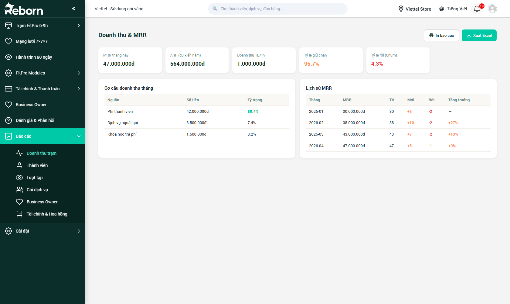
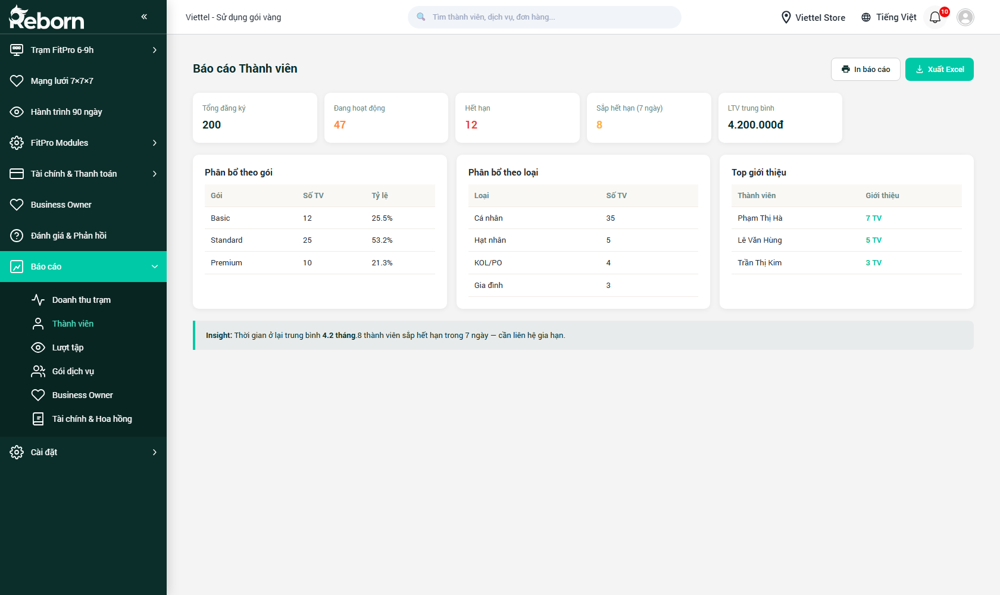
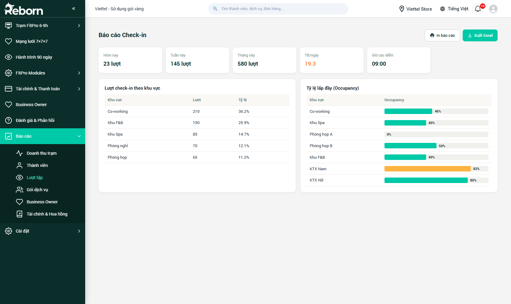
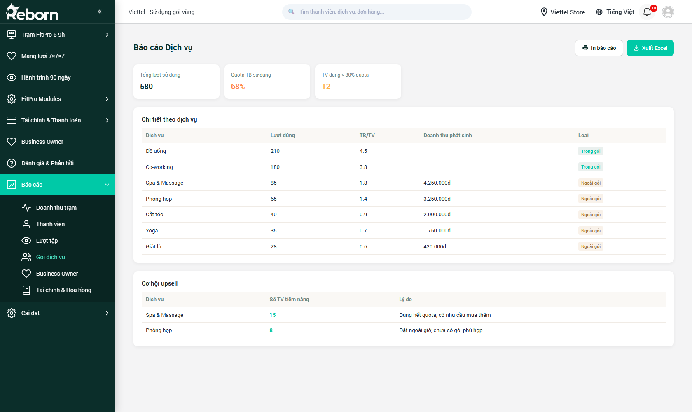
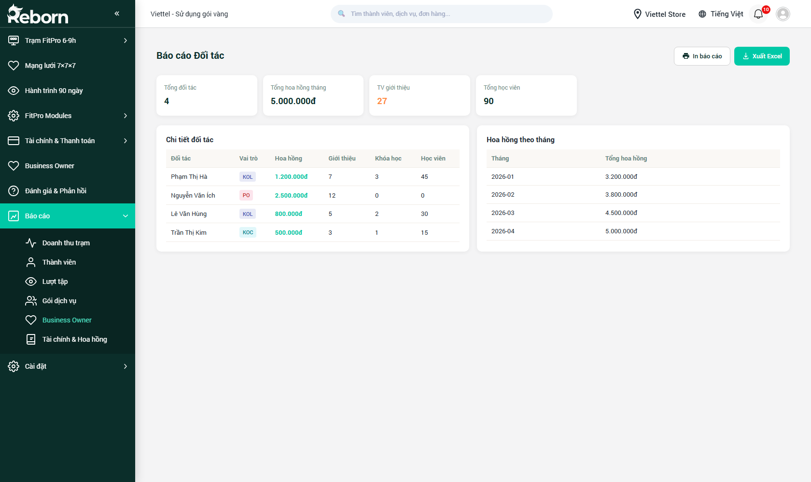
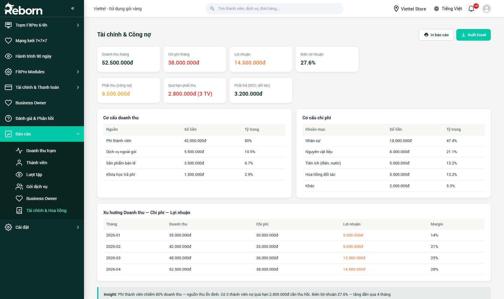

# Part 08 — Báo cáo

*Phiên bản 0.6 — Tenant "FitPro"*

**Báo cáo** là phân hệ dành chủ yếu cho **Business Owner** và **Master BO** — nơi bạn có **cái nhìn tổng hợp** về hoạt động của trạm / toàn mạng lưới qua các bộ biểu đồ và bảng số liệu. Không dùng để nhập liệu mà chỉ để **đọc và phân tích**.

Sidebar có **6 mục con** (đã sắp xếp theo FitPro):

| # | Mục | URL | Nội dung |
|---|-----|-----|----------|
| 1 | **Doanh thu trạm** | `/crm/ch_report_revenue` | Doanh thu tổng, MRR, ARPU, doanh thu theo trạm |
| 2 | **Thành viên** | `/crm/ch_report_members` | Tăng trưởng hội viên, hạng, giữ chân, sắp hết hạn gói |
| 3 | **Lượt tập** | `/crm/ch_report_checkin` | Lượt check-in, tần suất, giờ cao điểm, buổi tập đã trừ |
| 4 | **Gói dịch vụ** | `/crm/ch_report_services` | Hiệu quả từng gói FitPro, tỷ lệ sử dụng quota |
| 5 | **Business Owner** | `/crm/ch_report_partners` | Top BO theo doanh thu, downline, hoa hồng |
| 6 | **Tài chính & Hoa hồng** | `/crm/ch_report_finance` | Dòng tiền, lãi lỗ, hoa hồng hệ thống 3 tầng |

Tất cả các báo cáo đều có:

- **Bộ lọc kỳ** — Hôm nay / Tuần / Tháng / Quý / Năm / Tùy chọn.
- **So sánh** — với cùng kỳ trước (để thấy tăng trưởng).
- **Xuất Excel** — tải báo cáo.
- **Lọc theo trạm** — chọn 1 trạm cụ thể, hoặc tất cả trạm trong mạng lưới.
- **Lọc theo tier** — chỉ Tier 1 / Tier 2 / Tier 3 hoặc tất cả.

---

## A. Báo cáo Doanh thu trạm

**URL:** `/crm/ch_report_revenue`

### A.1. Các chỉ số chính

- **Tổng doanh thu** theo kỳ — tổng tiền thu được từ bán gói FitPro, phụ trợ, dịch vụ cộng thêm.
- **MRR (Monthly Recurring Revenue)** — doanh thu định kỳ từ các gói FitPro đang active.
- **ARPU (Average Revenue Per User)** — doanh thu trung bình trên mỗi hội viên.
- **Tỷ lệ tăng trưởng** — so với kỳ trước, dạng %.
- **Số đơn hàng** — đếm đơn (gói mới + gia hạn + phụ trợ).
- **Giá trị đơn trung bình (AOV)**.

### A.2. Các biểu đồ

- **Doanh thu theo ngày** — biểu đồ cột cho cả kỳ.
- **Doanh thu theo nguồn thu** — pie: Gói tập / Phụ trợ (Herbalife, đồ ăn) / Dịch vụ (Medlatec fee) / Cross-station fee.
- **Top 10 gói FitPro bán chạy** — bar chart xếp giảm dần.
- **Doanh thu theo trạm** — ranking các trạm (cho Master BO).
- **Doanh thu theo nhóm hội viên** — hạng thẻ nào đóng góp nhiều nhất (Diamond / Gold / Silver / Basic).

### A.3. Cách đọc báo cáo MRR

MRR đặc biệt quan trọng với mô hình **bán gói tập dài hạn**:

- Nếu bạn bán gói 3 tháng giá 9 triệu (30 buổi) → MRR = 9tr / 3 = 3tr/tháng.
- Hệ thống tự chia đều doanh thu gói theo số tháng và hiển thị đúng vào tháng tương ứng.
- Chỉ số MRR **ổn định** nghĩa là hội viên trung thành, trạm kinh doanh bền vững.
- MRR **giảm** bất thường → dấu hiệu churn (hội viên không gia hạn) → kiểm tra ngay ở [Part 14](part-14-hanh-trinh-90-ngay.md) xem số lượng "Cần nhắc gia hạn".

---

## B. Báo cáo Thành viên

**URL:** `/crm/ch_report_members`

### B.1. Các chỉ số

- **Tổng thành viên** cuối kỳ.
- **Thành viên mới** — đăng ký trong kỳ.
- **Thành viên đang hoạt động** — có check-in hoặc mua trong N ngày (cấu hình tenant).
- **Thành viên không hoạt động** (churned) — không dùng trong N ngày.
- **Tỷ lệ giữ chân (Retention rate)** — %.
- **Tỷ lệ mất khách (Churn rate)** — %.

### B.2. Các biểu đồ

- **Tăng trưởng thành viên** theo thời gian (line chart).
- **Phân bố theo hạng thẻ** — pie chart (Diamond / Gold / Silver / Basic).
- **Phân bố theo giới tính / độ tuổi / nghề nghiệp**.
- **Nguồn thành viên** — FB / Zalo / Giới thiệu / Quảng cáo / Walk-in.

### B.3. Thành viên sắp hết hạn

Bảng liệt kê các khách có gói **sắp hết hạn** (trong 7/15/30 ngày tới). Từ đây bạn có thể:
- Xuất danh sách → gửi sang chiến dịch marketing nhắc gia hạn (Part 09).
- Gọi điện trực tiếp.

---

## C. Báo cáo Lượt tập

**URL:** `/crm/ch_report_checkin`

### C.1. Các chỉ số

- **Tổng lượt check-in** trong kỳ (mỗi lượt = 1 buổi tập).
- **Hội viên duy nhất** — deduplicate theo người.
- **Trung bình buổi / hội viên**.
- **Tổng buổi đã trừ khỏi gói**.
- **Lượt check-in liên thông** (từ [Part 15.2 — Thẻ liên thông](part-15-fitpro-modules.md#thẻ-liên-thông)).

### C.2. Biểu đồ

- **Heatmap giờ cao điểm** — lưới giờ × ngày trong tuần. Thường thấy peak ở khung 6-7h và 19-21h.
- **Top hội viên trung thành** — ai đến nhiều nhất.
- **Phân bố theo trạm** — trạm nào đông nhất trong mạng lưới.
- **Xu hướng theo tuần/tháng** — để nhận ra mùa vụ (VD tháng Tết giảm, tháng 1 sau Tết tăng mạnh).

### C.3. Ứng dụng

- Biết giờ cao điểm để sắp lịch HLV / lễ tân hợp lý.
- Nhận ra trạm nào đang bị bỏ trống → BO của trạm đó cần hành động.
- Phát hiện hội viên không còn đến → đưa vào danh sách "Cần nhắc gia hạn" trong [Part 14](part-14-hanh-trinh-90-ngay.md).

---

## D. Báo cáo Gói dịch vụ

**URL:** `/crm/ch_report_services`

### D.1. Các chỉ số

- **Top gói FitPro bán chạy** — theo doanh thu và theo số lượt.
- **Gói "chết"** — ít/không ai mua trong kỳ (có thể cần retire).
- **Hiệu quả combo** — doanh thu từ hội viên mua gói + phụ trợ (Herbalife) vs mua lẻ.
- **Tỷ lệ sử dụng quota** — hội viên đã dùng bao nhiêu % buổi tập trong gói.
- **Thời gian trung bình giữa các buổi**.
- **Tỷ lệ gia hạn (Renewal rate)** — hội viên hết gói có gia hạn ngay không.

### D.2. Gợi ý hành động

Báo cáo này giúp bạn quyết định:
- **Gói nào cần đẩy mạnh marketing** (đang có nhu cầu).
- **Gói nào cần tái cơ cấu / loại bỏ** (không có hội viên).
- **Giá gói có hợp lý không** — nếu tỷ lệ sử dụng quota < 50% → gói quá rộng → nên giảm giá hoặc rút số buổi.
- **Renewal rate thấp** — hội viên không hài lòng với kết quả 90 ngày → review ở [Part 14](part-14-hanh-trinh-90-ngay.md) + [Part 15.3 — Chỉ số cơ thể](part-15-fitpro-modules.md#chỉ-số-cơ-thể).

---

## E. Báo cáo Business Owner

**URL:** `/crm/ch_report_partners`

### E.1. Các chỉ số

- **Top BO theo doanh thu trạm** — ai vận hành trạm tốt nhất.
- **Top BO theo số downline** — ai phát triển mạng lưới tốt nhất.
- **Hoa hồng hệ thống trả cho từng BO** — tổng tháng này, 3 tháng gần nhất.
- **BO theo profile** — phân bố 4 profile (Dân VP / Chủ DN / PT-Yoga / Đại sứ lối sống) và doanh thu trung bình mỗi profile.
- **BO mới onboarding tháng này** — từ [Part 15.9 — Onboarding MF7](part-15-fitpro-modules.md#onboarding-mf7).

### E.2. Ứng dụng

- Biết BO nào đáng được thưởng thêm, BO nào cần kèm cặp.
- Phát hiện profile BO nào đang mang lại kết quả tốt nhất → ưu tiên tuyển loại đó.
- Theo dõi "độ khỏe" của từng nhánh mạng lưới — nếu BO Tier 1 suy giảm → cảnh báo sớm trước khi lan xuống Tier 2/3.

---

## F. Báo cáo Tài chính & Hoa hồng

**URL:** `/crm/ch_report_finance`

### F.1. Các chỉ số

- **Tổng thu / chi** trong kỳ.
- **Lãi gộp / Lãi ròng** — sau trừ chi phí vận hành trạm.
- **Số dư các quỹ** — đầu kỳ và cuối kỳ.
- **Hoa hồng hệ thống đã nhận** — từ hãng Herbalife 5% × 3 tầng (xem [Part 15.6](part-15-fitpro-modules.md#hoa-hồng-hệ-thống)).
- **Hoa hồng nội bộ đã chi** — cho các BO downline (ngoài luồng Herbalife).
- **Thuế VAT + TNCN đã tạm nộp** — kết nối với [Part 15.8 — Khai thuế từng trạm](part-15-fitpro-modules.md#khai-thuế-từng-trạm).

### F.2. Biểu đồ

- **Biểu đồ thu chi theo ngày** — cột đôi (thu màu xanh, chi màu đỏ).
- **Cơ cấu hoa hồng 3 tầng** — stacked bar: Tầng 1 / Tầng 2 / Tầng 3.
- **Cơ cấu chi** — pie chart: thuê mặt bằng / nhân sự / marketing / hoa hồng BO / NVL / khác.
- **Xu hướng tiền mặt** — line chart số dư các quỹ qua thời gian.

---

## G. Xuất báo cáo & Gửi định kỳ

### G.1. Xuất thủ công

Mọi báo cáo đều có nút **Xuất Excel** ở góc phải — tải file `.xlsx` ngay.

### G.2. Gửi email định kỳ

Với các báo cáo quan trọng (Doanh thu, Tài chính), bạn có thể cài **Gửi tự động**:

1. Bấm **🔔 Gửi định kỳ**.
2. Điền:
   - **Danh sách email nhận** (cách nhau bằng dấu phẩy).
   - **Tần suất**: Hàng ngày / Hàng tuần (chọn thứ) / Hàng tháng (chọn ngày).
   - **Giờ gửi**.
   - **Định dạng**: PDF / Excel.
3. **Lưu**. Hệ thống sẽ gửi tự động theo lịch.

---

## H. Đọc báo cáo — Các chỉ số quan trọng nhất cho Business Owner

Nếu bạn chỉ có 5 phút mỗi sáng, hãy xem 5 chỉ số này:

1. **Doanh thu hôm qua vs hôm qua của tuần trước** — tăng hay giảm?
2. **Số lượt check-in hôm qua** — trạm có đông hội viên không?
3. **MRR tháng hiện tại** — doanh thu định kỳ có bền không?
4. **Số hội viên "Cần nhắc gia hạn"** — có đang tăng nhanh không (dấu hiệu churn)?
5. **Top 3 gói FitPro bán chạy tuần này** — để tập trung upsell / chuẩn bị NVL Herbalife.

Master BO thêm 3 chỉ số toàn mạng lưới:

6. **Tổng hoa hồng 3 tầng tháng này** — số tiền thu nhập thụ động về Master.
7. **Số BO mới onboarding thành công tuần này** — tốc độ tăng trưởng mạng lưới.
8. **Điểm SOP trung bình toàn mạng lưới** — chất lượng vận hành (mục tiêu ≥ 85/100).

---

*Hết Part 08.*
