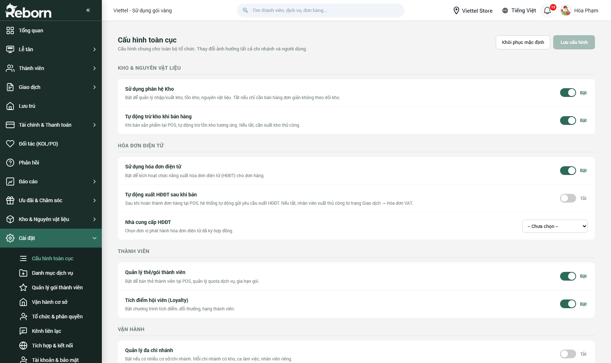

# Part 11 — Cài đặt cơ bản

*Phiên bản 0.6 — Tenant "FitPro"*

Phân hệ **Cài đặt** chia làm 2 Part:
- **Part 11 (phần này)** — các cài đặt **cơ bản** mà quản lý cửa hàng hoặc admin tenant cài **một lần khi mới triển khai** và **thi thoảng chỉnh khi có thay đổi nghiệp vụ**.
- **Part 12** — các cài đặt **nâng cao** liên quan đến phân quyền, tích hợp, bảo mật.

Part 11 bao phủ 4 mục đầu trong nhóm Cài đặt của sidebar:

| # | Mục | URL | Dùng để |
|---|-----|-----|---------|
| 1 | **Cấu hình toàn cục** | `/crm/ch_tenant_config` | Thông tin cơ sở, logo, múi giờ, đơn vị tiền tệ... |
| 2 | **Danh mục dịch vụ** | `/crm/setting_sell` | Sản phẩm / dịch vụ / combo — danh mục chính |
| 3 | **Quản lý gói thành viên** | `/crm/ch_membership_plans` | Các gói thành viên (Basic, Premium...) |
| 4 | **Vận hành cơ sở** | `/crm/setting_basis` | Ca làm, phương thức thanh toán, cấu hình POS |

> **Đối tượng:** Các mục Part 11 nên do **quản lý cửa hàng** hoặc **admin tenant** cài. Nhân viên thường không cần đụng vào.

---

## A. Cấu hình toàn cục

**URL:** `/crm/ch_tenant_config`



### A.1. Mục đích

Cài **thông tin định danh và định dạng chung** của tenant (đơn vị thuê), áp dụng cho toàn bộ hệ thống.

### A.2. Các nhóm cấu hình

#### Thông tin đơn vị

| Trường | Bắt buộc | Kiểu | Ghi chú |
|--------|:--------:|------|---------|
| **Tên đơn vị** | ✓ | Text ≤ 255 | Hiển thị trên hóa đơn, header |
| **Tên viết tắt** | — | Text ≤ 20 | |
| **Logo** | — | Upload JPG/PNG ≤ 2MB, khuyến nghị 512×512 | |
| **Slogan** | — | Text ≤ 255 | |
| **Mã số thuế** | — | Text 10 hoặc 13 số | |
| **Địa chỉ đăng ký** | — | Text | |
| **Số điện thoại** | — | Tel | |
| **Email liên hệ** | — | Email | |
| **Website** | — | URL | |

#### Định dạng hệ thống

| Trường | Bắt buộc | Ghi chú |
|--------|:--------:|---------|
| **Múi giờ** | ✓ | Mặc định `GMT+7 Asia/Ho_Chi_Minh` |
| **Ngôn ngữ mặc định** | ✓ | Tiếng Việt / English |
| **Đơn vị tiền tệ** | ✓ | VND / USD / EUR |
| **Định dạng ngày** | ✓ | `dd/MM/yyyy` / `MM/dd/yyyy` / `yyyy-MM-dd` |
| **Định dạng số** | ✓ | `1,000,000.00` / `1.000.000,00` |
| **Ngày bắt đầu tuần** | — | Thứ Hai / Chủ Nhật |

#### Cấu hình in ấn

| Trường | Ghi chú |
|--------|---------|
| **Khổ giấy in hóa đơn** | A4 / A5 / 80mm / 58mm (máy in nhiệt) |
| **Header hóa đơn** | Text tự do, hỗ trợ biến `{{tên_đơn_vị}}`, `{{địa_chỉ}}` |
| **Footer hóa đơn** | Text tự do |
| **In logo** | Bật/tắt |
| **QR mã tra cứu** | Có/không in QR để khách quét xem online |

#### Các cấu hình khác

- **Mã tự động**: cấu hình quy tắc sinh mã khách hàng, mã đơn, mã NVL, v.v.
- **Làm tròn giá**: làm tròn đến 1000đ / 500đ / không làm tròn.
- **Thời gian session**: bao lâu không thao tác thì tự logout.

### A.3. Các bước cấu hình lần đầu

1. Vào **Cấu hình toàn cục** → tab **Thông tin đơn vị**.
2. Điền đầy đủ tên, logo, địa chỉ, MST → **Lưu**.
3. Chuyển tab **Định dạng hệ thống** → chọn múi giờ, ngôn ngữ, tiền tệ → **Lưu**.
4. Chuyển tab **In ấn** → chọn khổ giấy theo máy in bạn có → nhập header/footer → **Lưu**.
5. Kiểm tra bằng cách tạo thử một đơn ở Part 02 → In → xem đúng không.

---

## B. Danh mục dịch vụ

**URL:** `/crm/setting_sell`


### B.1. Mục đích

Quản lý toàn bộ **sản phẩm** và **dịch vụ** mà cửa hàng bán. Đây là **nguồn cấp dữ liệu chính** cho màn hình POS (Part 02).

### B.2. Phân nhóm

Hệ thống hỗ trợ nhiều cấp:

- **Danh mục cấp 1**: *"Dịch vụ"*, *"Sản phẩm"*.
- **Danh mục cấp 2**: Spa / Massage / Facial / Combo... hoặc Mỹ phẩm / Thực phẩm...
- **Danh mục cấp 3**: cụ thể hơn.

Quản lý cấu trúc cây này trước, rồi mới thêm từng item.

### B.3. Thêm sản phẩm / dịch vụ

**Các bước:**

1. Bấm **+ Thêm mới** → chọn loại (Sản phẩm / Dịch vụ / Combo).
2. Điền form:

#### Quy định nhập liệu — Sản phẩm / Dịch vụ

| Trường | Bắt buộc | Kiểu | Ràng buộc / Ghi chú |
|--------|:--------:|------|---------------------|
| **Tên** | ✓ | Text ≤ 255 | Hiển thị trên POS, hóa đơn |
| **Mã** | — | Text ≤ 50 | Auto gen nếu trống; nên có để quét mã vạch |
| **Mã vạch (barcode)** | — | Text | Cho máy quét |
| **Danh mục** | ✓ | Select | Chọn từ cây danh mục |
| **Loại** | ✓ | Sản phẩm / Dịch vụ / Combo | Sản phẩm: trừ kho; Dịch vụ: không kho; Combo: gộp nhiều item |
| **Đơn vị tính** | ✓ | Chọn / nhập | |
| **Giá bán** | ✓ | Number ≥ 0 | |
| **Giá vốn** | — | Number ≥ 0 | Để tính lãi gộp |
| **Giá khuyến mãi** | — | Number ≥ 0 | Nếu có |
| **VAT** | — | 0/5/8/10% | |
| **Mô tả ngắn** | — | Textarea ≤ 500 | |
| **Mô tả đầy đủ** | — | Rich text | Dùng cho website/app |
| **Ảnh chính** | — | Upload ≤ 5MB | Vuông, khuyến nghị 800×800 |
| **Ảnh phụ** | — | Upload nhiều | |
| **Biến thể (variants)** | — | Table | Size S/M/L, Màu đỏ/xanh... mỗi biến thể có mã + giá riêng |
| **Thời lượng (dịch vụ)** | — (✓ nếu dịch vụ có booking) | Number (phút) | Vd 60 phút cho massage |
| **Số nhân viên cần** | — | Number | Dùng cho quản lý lịch |
| **Tồn kho ban đầu (sản phẩm)** | — | Number | |
| **Tồn tối thiểu** | — | Number | Cảnh báo |
| **Cho phép bán khi hết** | — | Bool | Cho phép tạo đơn dù tồn = 0 |
| **Nhóm thuộc gói TV** | — | Multi-select | Các gói thành viên có item này |
| **Trạng thái** | ✓ | Đang bán / Ngừng bán | |

3. **Lưu** — item xuất hiện trong POS ngay.

### B.4. Tạo combo

Combo là **nhóm nhiều sản phẩm/dịch vụ** bán theo gói giá cố định. Ví dụ combo "Massage 60p + Xông hơi 30p + Nước detox = 500k" thay vì bán lẻ 650k.

1. Thêm mới → chọn **Loại: Combo**.
2. Các trường thông thường (tên, giá combo, ảnh, mô tả).
3. Bảng **Thành phần combo**: thêm từng item (SL, SP/DV nào).
4. **Lưu**.

### B.5. Import hàng loạt

Nếu có hàng trăm item, dùng **Nhập Excel**:
1. Tải mẫu → điền → upload.
2. Kiểm tra mapping cột → **Nhập**.

---

## C. Quản lý gói thành viên

**URL:** `/crm/ch_membership_plans`


### C.1. Gói thành viên là gì?

Khác với **sản phẩm/dịch vụ đơn lẻ**, **gói thành viên** là **gói thẻ có thời hạn** mà khách mua một lần để được dùng dịch vụ nhiều lần trong một khoảng thời gian. Ví dụ:

- **Basic 1 tháng — 1.200.000đ**: 4 lần massage 60p + 8 lần co-working ngày + nước miễn phí.
- **Premium 1 tháng — 4.500.000đ**: massage không giới hạn + phòng riêng 10 giờ + ăn sáng.
- **Standard 6 tháng — 13.500.000đ**: tương tự Basic nhưng rẻ hơn /tháng nếu mua dài hạn.

### C.2. Tạo gói mới

#### Quy định nhập liệu — Gói thành viên

| Trường | Bắt buộc | Ghi chú |
|--------|:--------:|---------|
| **Tên gói** | ✓ | Vd *"Premium 1 tháng"* |
| **Mã gói** | — | Auto |
| **Màu chủ đạo** | — | Color picker — hiển thị trên card |
| **Giá** | ✓ | Number ≥ 0 VNĐ |
| **Giá khuyến mãi** | — | Để hiển thị giá gốc gạch ngang |
| **Thời hạn (tháng)** | ✓ | Number ≥ 1 |
| **Mô tả ngắn** | ✓ | ≤ 500 ký tự |
| **Danh sách dịch vụ đi kèm** | ✓ | Bảng với cột: Dịch vụ, Số lượt (quota), Đơn vị |
| **Ưu đãi bổ sung** | — | Vd *"Giảm 10% spa khác ngoài gói"* |
| **Ảnh** | — | Upload |
| **Badge đặc biệt** | — | *"Phổ biến"*, *"Mới"*, *"Giảm 20%"* |
| **Trạng thái** | ✓ | Đang bán / Ngừng bán |
| **Mục hiển thị thứ tự** | — | Số |

### C.3. Quản lý hạng thẻ (tier)

Khác với "gói" (là sản phẩm cụ thể bán), **hạng thẻ** là **cấp độ thành viên** (Basic/Silver/Gold/Diamond) mà khách lên tự động theo tổng chi tiêu. Quản lý hạng thẻ ở [Part 03 → Cài đặt thành viên → Danh sách thẻ](part-03-thanh-vien.md#b1-danh-sách-thẻ-thành-viên).

---

## D. Vận hành cơ sở

**URL:** `/crm/setting_basis`


### D.1. Cấu trúc

Màn hình này gộp **nhiều nhóm cấu hình vận hành**:

- **Cơ sở / Chi nhánh** — danh sách các điểm bán
- **Cấu hình ca làm việc** — tạo mẫu ca (ca sáng, ca chiều...)
- **Phương thức thanh toán** — bật/tắt cash, CK, ví, thẻ
- **Cấu hình POS** — tuỳ chỉnh màn bán hàng (tab nào bật, tab nào tắt)
- **Cấu hình kho mặc định** — kho nào trừ khi bán
- **Phòng / Bàn** — (nếu có lưu trú, xem Part 05)

### D.2. Cơ sở / Chi nhánh

Mỗi cửa hàng vật lý = 1 cơ sở. Hệ thống cho phép nhiều cơ sở dưới 1 tenant.

#### Quy định nhập liệu — Cơ sở

| Trường | Bắt buộc | Ghi chú |
|--------|:--------:|---------|
| **Tên cơ sở** | ✓ | Vd *"Viettel Store — Cầu Giấy"* |
| **Mã cơ sở** | — | Auto |
| **Địa chỉ** | ✓ | Text |
| **SĐT** | — | Tel |
| **Quản lý phụ trách** | — | Select nhân viên |
| **Múi giờ** | — | Nếu khác default |
| **Trạng thái** | ✓ | Đang hoạt động / Tạm đóng |

### D.3. Cấu hình ca làm việc

Cài **mẫu ca** để sau này nhân viên mở ca nhanh:

| Trường | Bắt buộc | Ghi chú |
|--------|:--------:|---------|
| **Tên ca** | ✓ | Vd *"Ca sáng"*, *"Ca chiều"*, *"Ca toàn thời"* |
| **Giờ bắt đầu** | ✓ | 08:00 |
| **Giờ kết thúc** | ✓ | 14:00 |
| **Tiền mặt mặc định đầu ca** | — | Number |
| **Bắt buộc đếm mệnh giá** | — | Bool |
| **Cho phép mở nhiều ca đồng thời** | — | Bool |

### D.4. Phương thức thanh toán

Bật/tắt các phương thức trên POS. Với mỗi phương thức có thể có config phụ:

- **Tiền mặt** — không cần cấu hình.
- **Chuyển khoản** — nhập STK, tên NH, chủ TK, tạo QR tĩnh.
- **Thẻ** — nếu dùng máy POS ngân hàng.
- **Ví điện tử**: MoMo, ZaloPay, VNPay — cần API key (xem Part 12).
- **Công nợ** — cho phép bán chịu không.

### D.5. Cấu hình POS

Tuỳ biến màn Bán hàng tại quầy (Part 02):

- Bật/tắt các tab: Bán hàng / Bán thẻ / Bán LP / Đơn tạm / Đơn hàng / Báo cáo.
- Hiển thị danh mục nào mặc định.
- Cho phép **Thêm nhanh** (quick add) hay không.
- Mặc định in hóa đơn sau thanh toán / không in tự động.

---

## E. Thứ tự cài đặt ban đầu (setup mới)

Khi bạn nhận tenant mới, làm theo thứ tự này để tiết kiệm thời gian nhất:

```
1. Cấu hình toàn cục
   ├── Thông tin đơn vị (tên, logo, MST)
   └── Định dạng (múi giờ, ngôn ngữ, tiền tệ)

2. Vận hành cơ sở
   ├── Tạo Cơ sở đầu tiên
   ├── Tạo Ca làm việc mẫu
   └── Bật Phương thức thanh toán

3. Danh mục dịch vụ
   ├── Tạo cây danh mục
   ├── Thêm sản phẩm / dịch vụ
   └── Tạo combo (nếu có)

4. Quản lý gói thành viên
   └── Tạo các gói Basic / Premium / Standard

5. Part 03 — Cài đặt thành viên
   ├── Thẻ thành viên (Diamond/Gold/Silver)
   ├── Nguồn thành viên
   ├── Nhóm thành viên
   └── Trường bổ sung (nếu cần)

6. Part 12 — Cài đặt nâng cao
   ├── Tổ chức & phân quyền
   └── Tích hợp kênh (SMS, Email, Zalo)
```

Sau các bước trên, bạn có thể bắt đầu bán hàng ngay ở Part 02.

---

*Hết Part 11.*
