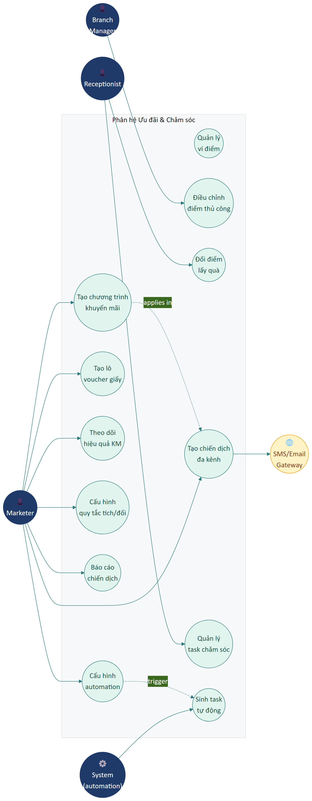

# Part 09 — Ưu đãi & Chăm sóc

## Phạm vi

Phân hệ **Ưu đãi & Chăm sóc** là công cụ giữ chân khách và kéo khách mới. Bao gồm: **Khuyến mãi & Voucher**, **Tích điểm hội viên (loyalty)**, **Chiến dịch marketing đa kênh**, **Chăm sóc thành viên (task automation)**, **Quản lý Sự kiện (Community Hub Events)**.

**Actors chính:** Marketer (chính), Branch Manager (duyệt), Receptionist (thực hiện task chăm sóc), CSKH.

### Sơ đồ Use Case

---

## A. Khuyến mãi & Voucher

### UR-MKT-01 — Tạo chương trình khuyến mãi

| Trường | Nội dung |
|--------|----------|
| **ID** | UR-MKT-01 |
| **Tên** | Cấu hình chương trình giảm giá |
| **Actor** | Marketer, Branch Manager |
| **Mô tả** | Tenant phải tạo được nhiều loại khuyến mãi: giảm theo %, giảm theo số tiền, mua N tặng M, combo giá, flash sale, voucher code, freebies (tặng quà). |
| **Đầu vào** | • **Tên CT** (M, ≤ 255) • **Mã CT** (S, slug) • **Loại** (M, 6 loại: %/Tiền/Mua tặng/Combo/Flash sale/Voucher) • **Giá trị giảm** (M, theo loại) • **Áp dụng cho** (M, Toàn bộ/Danh mục/Sản phẩm) • **Điều kiện tối thiểu** (S, đơn ≥ X) • **Giới hạn giảm tối đa** (S, ≤ Y) • **Đối tượng khách** (M, Tất cả/Theo hạng/Theo nhóm/Khách mới) • **Ngày bắt đầu/kết thúc** (M, datetime, end > start) • **Giới hạn lượt dùng tổng** (S) • **Giới hạn lượt dùng/khách** (S) • **Mã voucher** (S, ≤ 20 ký tự, in hoa, không dấu) • **Mô tả/Điều khoản** (S, ≤ 2000) • **Ảnh banner** (S, ≤ 5MB) • **Trạng thái** (M, Nháp/Đang chạy/Đã kết thúc/Tạm dừng) |
| **Tiêu chí chấp nhận** | 1. Validation đầy đủ. 2. Cho phép lưu Nháp (chưa kích hoạt). 3. Có nút **Kích hoạt** chuyển sang Đang chạy. 4. Hệ thống tự chuyển sang Đã kết thúc khi quá ngày kết thúc. 5. Modal Khuyến mãi trên POS (UR-RECEPTION-10) chỉ hiện CT có status = Đang chạy + đủ điều kiện. |
| **Mức ưu tiên** | **M** |

### UR-MKT-02 — Tạo lô voucher giấy

| Trường | Nội dung |
|--------|----------|
| **ID** | UR-MKT-02 |
| **Tên** | Sinh hàng loạt mã voucher để in giấy |
| **Actor** | Marketer |
| **Mô tả** | Trong một chương trình khuyến mãi có sẵn, tenant có thể sinh lô voucher (vd 1000 mã) với prefix riêng để in lên giấy phát cho khách. |
| **Tiêu chí chấp nhận** | 1. Số lượng + prefix + thời hạn từng voucher. 2. Mỗi voucher có mã unique. 3. Xuất Excel danh sách mã để in. 4. Audit ai sinh, lúc nào, bao nhiêu mã. |
| **Mức ưu tiên** | **C** |

### UR-MKT-03 — Theo dõi hiệu quả khuyến mãi

| Trường | Nội dung |
|--------|----------|
| **ID** | UR-MKT-03 |
| **Tên** | KPI cho mỗi chương trình KM |
| **Actor** | Marketer, Branch Manager |
| **Mô tả** | Trong danh sách chương trình, mỗi CT hiển thị: số lượt dùng/giới hạn, doanh thu sinh ra, chi phí giảm giá, ROI. |
| **Tiêu chí chấp nhận** | 1. Cập nhật real-time hoặc near-real-time. 2. Bấm vào CT → drill-down các đơn cụ thể đã dùng. |
| **Mức ưu tiên** | **S** |

---

## B. Tích điểm hội viên (Loyalty)

### UR-MKT-04 — Quản lý ví điểm khách hàng

| Trường | Nội dung |
|--------|----------|
| **ID** | UR-MKT-04 |
| **Tên** | Lưu trữ + hiển thị điểm tích lũy mỗi khách |
| **Actor** | Receptionist (xem), Marketer (cấu hình quy tắc) |
| **Mô tả** | Mỗi khách có một ví điểm với số dư hiện tại, lịch sử các giao dịch tích/đổi điểm, điểm đã hết hạn (nếu có cấu hình hạn dùng điểm). |
| **Tiêu chí chấp nhận** | 1. Trên hồ sơ khách hiển thị điểm hiện có. 2. Có tab **Lịch sử điểm**: ngày, loại (Tích/Đổi/Điều chỉnh), giá trị (+/-), số dư sau, lý do. 3. Có thể điều chỉnh thủ công (UR-MKT-06). |
| **Mức ưu tiên** | **S** |

### UR-MKT-05 — Cấu hình quy tắc tích/đổi điểm

| Trường | Nội dung |
|--------|----------|
| **ID** | UR-MKT-05 |
| **Tên** | Định nghĩa cách khách kiếm và đổi điểm |
| **Actor** | Marketer, Tenant Admin |
| **Mô tả** | Tenant cấu hình các quy tắc: mua bao nhiêu được bao nhiêu điểm, đổi điểm lấy gì, áp dụng cho ai, hiệu lực. |
| **Đầu vào** | • **Tên quy tắc** (M) • **Loại** (M, Tích/Đổi) • **Điều kiện áp dụng** (M, vd "Đơn ≥ 100k") • **Tỷ lệ** (M, vd "10.000đ = 1 điểm" hoặc "100 điểm = 10.000đ giảm") • **Nhóm khách áp dụng** (S) • **Thời gian hiệu lực** (S) • **Mức trần / đơn** (S, max điểm tích cho 1 đơn) |
| **Tiêu chí chấp nhận** | 1. Có thể có nhiều quy tắc đồng thời. 2. Khi đơn được tạo ở POS với khách đã gắn → tự cộng điểm theo quy tắc. 3. Khi khách dùng điểm đổi giảm giá → tự trừ điểm. |
| **Mức ưu tiên** | **S** |

### UR-MKT-06 — Điều chỉnh điểm thủ công

| Trường | Nội dung |
|--------|----------|
| **ID** | UR-MKT-06 |
| **Tên** | Cộng/trừ điểm thủ công cho khách |
| **Actor** | Branch Manager, Marketer |
| **Mô tả** | Trong các trường hợp khiếu nại, tặng điểm khuyến mãi, sai sót... tenant có thể điều chỉnh điểm thủ công. |
| **Tiêu chí chấp nhận** | 1. Form: số điểm (+/-), lý do (M, ≤ 500), tham chiếu phiếu (S). 2. Yêu cầu quyền `loyalty.adjust`. 3. Ghi log vĩnh viễn, không xóa được. |
| **Mức ưu tiên** | **S** |

### UR-MKT-07 — Đổi điểm lấy quà

| Trường | Nội dung |
|--------|----------|
| **ID** | UR-MKT-07 |
| **Tên** | Khách đổi điểm tại quầy |
| **Actor** | Receptionist |
| **Mô tả** | Tenant cấu hình danh mục quà có thể đổi (sản phẩm, voucher, dịch vụ). Khi khách yêu cầu, nhân viên xác minh và đổi. |
| **Tiêu chí chấp nhận** | 1. Có catalog quà với tên, ảnh, số điểm cần. 2. Search khách → xem điểm còn → chọn quà → xác nhận → trừ điểm + xuất phiếu quà. 3. Không cho đổi nếu điểm không đủ. |
| **Mức ưu tiên** | **C** |

---

## C. Chiến dịch marketing đa kênh

### UR-MKT-08 — Tạo chiến dịch SMS / Email / Zalo / Push / Facebook

| Trường | Nội dung |
|--------|----------|
| **ID** | UR-MKT-08 |
| **Tên** | Cấu hình chiến dịch gửi tin hàng loạt |
| **Actor** | Marketer |
| **Mô tả** | Tenant tạo chiến dịch chọn kênh + đối tượng + nội dung + thời gian gửi. Hệ thống đẩy vào hàng đợi và gửi dần theo throttle của kênh. |
| **Đầu vào** | • **Tên chiến dịch** (M) • **Kênh** (M, SMS/Email/Zalo OA/Push/Facebook) • **Đối tượng** (M, Tất cả/Theo nhóm/Theo hạng/Theo bộ lọc) • **Mục đích** (S, KM/Nhắc gia hạn/Sinh nhật/Winback/Cảm ơn) • **Tiêu đề** (M nếu Email) • **Nội dung** (M; SMS ≤ 160; Zalo ≤ 500; Email HTML đầy đủ) • **Biến thay thế** (S, vd `{{tên_khách}}`, `{{điểm}}`, `{{gói}}`) • **Thời gian gửi** (M, Gửi ngay / Lên lịch) • **Giới hạn/kỳ** (S, max tin/khách/N ngày) |
| **Tiêu chí chấp nhận** | 1. Validation đầy đủ. 2. **Xem trước** với 1 mẫu khách thực. 3. **Test gửi** sang 1 SĐT cụ thể trước khi gửi mass. 4. Sau khi xác nhận → đẩy vào queue, gửi theo throttle (vd 100 SMS/phút). 5. Có thể **Hủy chiến dịch** đang chạy. |
| **Mức ưu tiên** | **M** |

### UR-MKT-09 — Báo cáo chiến dịch

| Trường | Nội dung |
|--------|----------|
| **ID** | UR-MKT-09 |
| **Tên** | KPI cho mỗi chiến dịch sau khi chạy |
| **Actor** | Marketer |
| **Mô tả** | Tab Báo cáo của mỗi chiến dịch hiển thị: gửi thành công, thất bại, tỷ lệ mở (email), tỷ lệ click, conversion (khách mua sau khi nhận), ROI. |
| **Tiêu chí chấp nhận** | 1. Số liệu cập nhật real-time hoặc near-real-time. 2. Có cột chi phí (theo tariff của kênh). 3. ROI = doanh thu sinh ra từ chiến dịch / chi phí gửi. |
| **Mức ưu tiên** | **S** |

---

## D. Chăm sóc thành viên (Task automation)

### UR-MKT-10 — Quản lý nhiệm vụ chăm sóc khách

| Trường | Nội dung |
|--------|----------|
| **ID** | UR-MKT-10 |
| **Tên** | Hệ thống task chăm sóc gắn với khách hàng |
| **Actor** | Receptionist, CSKH, Branch Manager |
| **Mô tả** | Tenant có thể tạo task chăm sóc thủ công hoặc tự động (sinh từ event), gán cho nhân viên, theo dõi tiến độ. |
| **Tiêu chí chấp nhận** | 1. Cột bảng: Khách, Loại, Người phụ trách, Hạn, Trạng thái, Kết quả. 2. Filter theo người phụ trách (mặc định = tôi), theo loại, theo trạng thái. 3. Trạng thái: Mới / Đang làm / Đã xong / Bỏ qua. 4. Bấm vào task → mở chi tiết với hướng dẫn (template) + ô ghi kết quả. |
| **Mức ưu tiên** | **S** |

### UR-MKT-11 — Tự động sinh task chăm sóc theo event

| Trường | Nội dung |
|--------|----------|
| **ID** | UR-MKT-11 |
| **Tên** | Automation rules cho task chăm sóc |
| **Actor** | Marketer, Tenant Admin |
| **Mô tả** | Tenant cấu hình quy tắc tự động để sinh task khi có event xảy ra (vd "khi đơn > 1tr → tạo task gọi hỏi thăm sau 3 ngày"). |
| **Đầu vào** | • Tên quy tắc • Event trigger (Đơn mới / Sinh nhật / Gói sắp hết hạn / Khách không đến > N ngày...) • Điều kiện thêm (vd "đơn ≥ X") • Loại task sinh ra • Người được giao (cá nhân hoặc nhóm) • Hạn (sau N ngày kể từ event) • Template hướng dẫn |
| **Tiêu chí chấp nhận** | 1. Có thể bật/tắt từng quy tắc. 2. Hệ thống chạy quét định kỳ (vd mỗi 1 giờ) sinh task tự động. 3. Task tự động cũng có thể cấu hình **Tự gửi tin** (gắn với UR-MKT-08). 4. Audit trail: quy tắc nào sinh task nào. |
| **Mức ưu tiên** | **S** |

### UR-MKT-12 — Sinh nhật & các sự kiện khách

| Trường | Nội dung |
|--------|----------|
| **ID** | UR-MKT-12 |
| **Tên** | Tự động chăm sóc theo sự kiện cá nhân khách |
| **Actor** | Hệ thống |
| **Mô tả** | Hệ thống tự nhận diện sinh nhật / ngày kỷ niệm / mốc hạng thẻ và sinh task hoặc tin nhắn chúc mừng. |
| **Tiêu chí chấp nhận** | 1. Quét hằng ngày. 2. Tích hợp với quy tắc automation (UR-MKT-11). 3. Có thể tự gửi voucher tặng cho khách sinh nhật (gắn với KM ở UR-MKT-01). |
| **Mức ưu tiên** | **C** |

---

## Tóm tắt yêu cầu Part 09

| ID | Tên | Ưu tiên |
|----|-----|:-------:|
| UR-MKT-01 | Tạo chương trình KM | M |
| UR-MKT-02 | Tạo lô voucher giấy | C |
| UR-MKT-03 | Theo dõi hiệu quả KM | S |
| UR-MKT-04 | Ví điểm khách | S |
| UR-MKT-05 | Quy tắc tích/đổi điểm | S |
| UR-MKT-06 | Điều chỉnh điểm thủ công | S |
| UR-MKT-07 | Đổi điểm lấy quà | C |
| UR-MKT-08 | Chiến dịch đa kênh | M |
| UR-MKT-09 | Báo cáo chiến dịch | S |
| UR-MKT-10 | Quản lý task chăm sóc | S |
| UR-MKT-11 | Automation task | S |
| UR-MKT-12 | Tự chăm sóc theo sự kiện | C |

**Tổng:** 12 yêu cầu — 2 Must, 7 Should, 3 Could.

---

## E. Quản lý Sự kiện — Community Hub Events

Phân hệ **Sự kiện (Events)** thuộc nhóm Community Hub — cho phép tenant tổ chức workshop, hội thảo, lớp học, networking... với quy trình từ tạo sự kiện → đăng ký công khai → duyệt → check-in → chuyển thành hội viên.

**Actors chính:** Marketer (tạo/quản lý sự kiện), Branch Manager (duyệt), Receptionist/Staff (check-in), Khách hàng ẩn danh (đăng ký công khai), Hệ thống (tự động tính toán, phát hành vé).

### UR-EVT-01 — Quản lý sự kiện (CRUD, publish/unpublish)

| Trường | Nội dung |
|--------|----------|
| **ID** | UR-EVT-01 |
| **Tên** | Tạo, sửa, xoá, công bố / ẩn sự kiện |
| **Actor** | Marketer, Branch Manager |
| **Mô tả** | Tenant tạo sự kiện với đầy đủ thông tin: tiêu đề, nội dung chi tiết (HTML editor), ảnh bìa, gallery ảnh, thời gian tổ chức, thời gian mở/đóng đăng ký, địa điểm (offline hoặc online), thông tin liên hệ, sức chứa, giá vé, danh mục, tags. Sự kiện có thể ở trạng thái Nháp → Đã công bố → Đang diễn ra → Đã kết thúc / Đã huỷ. Hỗ trợ sự kiện nhiều ngày (multi-day) với danh sách ngày chọn được. |
| **Tiền điều kiện** | Người dùng có quyền `EVENTS_CREATE` / `EVENTS_EDIT` / `EVENTS_PUBLISH`. |
| **Đầu vào** | • **Tiêu đề** (M, 3–255 ký tự) • **Mô tả ngắn** (M, text thuần cho SEO/preview) • **Nội dung chi tiết** (S, HTML từ RebornEditor) • **Ảnh bìa** (S, URL, ≤ 5 MB) • **Gallery ảnh** (S, JSON array URL) • **Ngày bắt đầu / kết thúc** (M, datetime, end > start) • **Ngày mở / đóng đăng ký** (M, datetime, close > open) • **Ngày chọn được** (S, JSON array date — cho event multi-day) • **Địa điểm** (M nếu offline: tên + địa chỉ + thành phố; M nếu online: URL) • **Người liên hệ** (M: tên + SĐT; S: email, vai trò) • **Sức chứa** (S, NULL = không giới hạn) • **Giá vé** (M, VND, 0 = miễn phí) • **Danh mục** (S, workshop/hội thảo/lớp học/networking/training/khác) • **Tags** (S, JSON array string) • **Trạng thái** (M, draft/published — khi tạo chỉ 2 giá trị) |
| **Đầu ra** | Sự kiện được lưu với slug tự sinh (URL-safe, unique per tenant). Trạng thái `ongoing`/`ended` được tính runtime từ ngày hiện tại. |
| **Tiêu chí chấp nhận** | 1. CRUD đầy đủ với soft delete. 2. Slug auto-gen từ title, unique per tenant. 3. Nút **Công bố** chuyển draft → published, ghi `published_at`. 4. Nút **Ẩn** chuyển published → draft (cảnh báo nếu đã có đăng ký). 5. Nút **Huỷ sự kiện** → gửi thông báo cho tất cả người đã đăng ký. 6. Không cho xoá sự kiện đã có đăng ký (suggest huỷ thay vì xoá). 7. Không cho chuyển cancelled/ended → published. |
| **Mức ưu tiên** | **M** |

### UR-EVT-02 — Form đăng ký công khai (public share link)

| Trường | Nội dung |
|--------|----------|
| **ID** | UR-EVT-02 |
| **Tên** | Trang đăng ký sự kiện công khai qua share link |
| **Actor** | Khách hàng ẩn danh (không cần đăng nhập) |
| **Mô tả** | Mỗi sự kiện đã công bố có một URL công khai dạng `/share_event?slug=xxx`. Khách truy cập xem thông tin sự kiện + điền form đăng ký. Đăng ký tạo ra bản ghi trạng thái `pending`, chờ admin duyệt. Đăng ký = **lead** (chưa phải customer). |
| **Tiền điều kiện** | Sự kiện có status = published hoặc ongoing; thời gian hiện tại nằm trong khung đăng ký (open ≤ now ≤ close); chưa đầy sức chứa. |
| **Đầu vào** | • **Họ tên** (M, ≥ 2 ký tự) • **Số điện thoại** (M, regex VN: 09/08/07/03/05xx × 10 số) • **Email** (S, nếu có phải đúng format) • **Công ty** (S) • **Ghi chú** (S) • **Trường tùy biến** (theo cấu hình UR-EVT-03) • **Sản phẩm bổ sung** (theo cấu hình UR-EVT-04) • **Ngày tham gia** (S, nếu event multi-day) • UTM params (S, auto-capture) |
| **Đầu ra** | Bản ghi đăng ký trạng thái `pending`. Thông báo "BTC sẽ liên hệ xác nhận". |
| **Tiêu chí chấp nhận** | 1. Trang public KHÔNG yêu cầu đăng nhập. 2. Chặn đăng ký trùng (cùng event + cùng phone → 409). 3. Chặn đăng ký khi event đã đầy / hết hạn / chưa mở. 4. Rate limit 5 request/phút/IP chống spam. 5. Không trả về PII của người đăng ký khác. 6. Hiển thị số chỗ còn lại (currentAttendees / maxAttendees). |
| **Mức ưu tiên** | **M** |

### UR-EVT-03 — Dynamic fields (trường tùy biến trên form đăng ký)

| Trường | Nội dung |
|--------|----------|
| **ID** | UR-EVT-03 |
| **Tên** | Admin cấu hình trường tuỳ biến trên form đăng ký |
| **Actor** | Marketer, Tenant Admin |
| **Mô tả** | Khi tạo/sửa sự kiện, admin có thể thêm các trường tuỳ biến (dynamic fields) để thu thập thông tin bổ sung từ người đăng ký. Mỗi trường có: label, kiểu dữ liệu, bắt buộc/không, options (cho select), placeholder, giá trị mặc định, thứ tự hiển thị. Ví dụ: "Size áo", "Bữa ăn ưa thích", "Level kinh nghiệm". |
| **Tiền điều kiện** | Có quyền `EVENTS_CREATE` hoặc `EVENTS_EDIT`. |
| **Đầu vào** | Mảng JSON cấu hình trường: `[{ id, label, type, required, options?, placeholder?, defaultValue?, order }]` • **type** ∈ `text | textarea | number | select | checkbox | date | email | phone` |
| **Đầu ra** | Cấu hình lưu vào `marketing_events.dynamic_fields`. Form đăng ký public tự render các trường này. Giá trị người đăng ký nhập lưu vào `marketing_event_registrations.dynamic_field_values` dạng `{ fieldId: value }`. |
| **Tiêu chí chấp nhận** | 1. Admin thêm/xoá/sắp xếp trường ngay trên form tạo sự kiện. 2. Trường `required` → BE validate khi register, trả lỗi nếu thiếu. 3. Trường `select` → giá trị phải nằm trong danh sách `options`. 4. Trang public tự render đúng type (text input, dropdown, checkbox...). 5. Giá trị hiển thị trong danh sách người đăng ký (admin view). |
| **Mức ưu tiên** | **M** |

### UR-EVT-04 — Sản phẩm / dịch vụ bổ sung (add-on items)

| Trường | Nội dung |
|--------|----------|
| **ID** | UR-EVT-04 |
| **Tên** | Cấu hình sản phẩm / dịch vụ bán thêm khi đăng ký |
| **Actor** | Marketer, Tenant Admin |
| **Mô tả** | Admin cấu hình danh sách sản phẩm/dịch vụ bổ sung (add-on) cho sự kiện, vd: "Bữa trưa 65.000đ", "Áo event 120.000đ", "Massage 250.000đ". Khách chọn add-on + nhập số lượng khi đăng ký. Hệ thống tự tính tổng tiền = giá vé + tổng add-on. |
| **Tiền điều kiện** | Có quyền `EVENTS_CREATE` hoặc `EVENTS_EDIT`. |
| **Đầu vào** | Cấu hình trên event: `[{ id, name, description?, unitPrice, unit, maxQty?, imageUrl? }]` Khi đăng ký: `[{ addOnId, qty }]` |
| **Đầu ra** | Tổng tiền (`totalAmount`) được BE tính server-side: `ticketPrice + Σ(unitPrice × qty)`. Lưu `selected_add_ons` + `total_amount` vào registration. |
| **Tiêu chí chấp nhận** | 1. Admin thêm/xoá add-on trên form sự kiện. 2. Trang public hiển thị add-on với giá, ảnh (nếu có), cho chọn số lượng. 3. **BE tính lại totalAmount** — KHÔNG tin giá trị từ FE (chống giả mạo). 4. Validate: qty ≤ maxQty (nếu có), addOnId phải tồn tại trong event config. 5. Tổng tiền hiển thị trong danh sách đăng ký. |
| **Mức ưu tiên** | **M** |

### UR-EVT-05 — Upload bằng chứng thanh toán

| Trường | Nội dung |
|--------|----------|
| **ID** | UR-EVT-05 |
| **Tên** | Người đăng ký upload ảnh hoá đơn chuyển khoản, admin duyệt |
| **Actor** | Khách hàng (upload), Marketer/Branch Manager (duyệt) |
| **Mô tả** | Khi sự kiện bật tuỳ chọn "Yêu cầu bằng chứng thanh toán", sau đăng ký khách phải upload ảnh chuyển khoản. Admin xem ảnh và duyệt (approve) hoặc từ chối (reject + lý do). Trạng thái bằng chứng: `not_required → pending → submitted → approved / rejected`. |
| **Tiền điều kiện** | Event có `require_payment_proof = true`. Người đăng ký đã có bản ghi registration. |
| **Đầu vào** | • **Ảnh bằng chứng** (M, URL sau khi upload, ≤ 5 MB) • **Duyệt/Từ chối** (admin): approved (boolean) + rejectReason (S, nếu từ chối) |
| **Đầu ra** | Cập nhật `payment_proof_url`, `payment_proof_status`, timestamps, `reviewed_by`. |
| **Tiêu chí chấp nhận** | 1. Khách upload ảnh → status chuyển sang `submitted`. 2. Admin xem ảnh trong chi tiết đăng ký. 3. Admin approve → status = `approved`, ghi thời gian + người duyệt. 4. Admin reject → status = `rejected`, bắt buộc nhập lý do. 5. Có quyền `EVENTS_MANAGE_PAYMENT` mới được duyệt. |
| **Mức ưu tiên** | **S** |

### UR-EVT-06 — Check-in / check-out tại sự kiện

| Trường | Nội dung |
|--------|----------|
| **ID** | UR-EVT-06 |
| **Tên** | Điểm danh khách tại sự kiện bằng mã vé hoặc thủ công |
| **Actor** | Receptionist, Staff tại sự kiện |
| **Mô tả** | Nhân viên BTC check-in khách bằng cách scan QR vé hoặc nhập mã thủ công. Hệ thống cập nhật trạng thái registration → `checked_in`, ghi thời gian. Hỗ trợ check-out để tính thời gian tham gia. Với sự kiện multi-day, mỗi ngày ghi nhận check-in riêng (bảng `marketing_event_checkins`). |
| **Tiền điều kiện** | Người đăng ký đã được xác nhận (status = confirmed). Có quyền `EVENTS_CHECKIN`. |
| **Đầu vào** | • **Mã vé** (ticketCode) hoặc **ID đăng ký** • **Ngày check-in** (S, cho event multi-day) |
| **Đầu ra** | Bản ghi check-in trong `marketing_event_checkins`. Registration status → `checked_in`. |
| **Tiêu chí chấp nhận** | 1. Scan QR → tra mã vé → nếu hợp lệ thì check-in thành công. 2. Chặn check-in trùng (mã đã check-in → lỗi `ALREADY_CHECKED_IN`). 3. Chặn check-in vé đã huỷ (`CANCELLED`). 4. Multi-day: mỗi ngày có bản ghi riêng, không trùng. 5. Check-out: ghi `checked_out_at` vào bản ghi cuối cùng chưa có. |
| **Mức ưu tiên** | **M** |

### UR-EVT-07 — Tracking dịch vụ sử dụng (đặc thù ngành)

| Trường | Nội dung |
|--------|----------|
| **ID** | UR-EVT-07 |
| **Tên** | Ghi nhận dịch vụ khách sử dụng trong sự kiện |
| **Actor** | Staff, Receptionist |
| **Mô tả** | Đặc thù ngành fitness/spa/wellness — ghi nhận dịch vụ khách sử dụng trong khuôn khổ sự kiện (vd: massage, tập thử, tư vấn da...). Dữ liệu dùng để phân tích quan tâm của khách và upsell sau event. Lưu trong bảng riêng `marketing_event_service_usage`. |
| **Tiền điều kiện** | Người đăng ký đã check-in. Có quyền `EVENTS_SERVICE_USAGE`. |
| **Đầu vào** | • **registrationId** (M) • **serviceId** (M, từ service catalog) • **serviceName** (M, denormalized) • **Số lượng** (M, default 1) • **Đơn giá** (M, VND) |
| **Đầu ra** | Bản ghi trong `marketing_event_service_usage` với `recorded_at`, `recorded_by`. |
| **Tiêu chí chấp nhận** | 1. Thêm/xoá bản ghi dịch vụ cho mỗi người đăng ký. 2. Hiển thị danh sách dịch vụ đã dùng trong chi tiết đăng ký. 3. Tổng giá trị dịch vụ hiển thị trên dashboard event. 4. Có thể tắt tính năng này nếu deploy cho ngành không cần. |
| **Mức ưu tiên** | **C** |

### UR-EVT-08 — Tích hợp API cho sự kiện

| Trường | Nội dung |
|--------|----------|
| **ID** | UR-EVT-08 |
| **Tên** | Tích hợp liên hệ thống: Sales, Customer, Notification |
| **Actor** | Hệ thống (Marketing service ↔ Sales service ↔ Customer service) |
| **Mô tả** | Sự kiện tích hợp với các microservice khác: (1) **Sales** — tạo đơn hàng khi sự kiện có giá vé/add-on, nhận webhook khi thanh toán xong; (2) **Customer** — chuyển đổi người đăng ký thành hội viên (convert-to-member), check phone dedupe; (3) **Notification** — gửi email/SMS vé, thông báo huỷ. Dùng domain event bus hoặc direct HTTP call. |
| **Tiền điều kiện** | Sales service, Customer service, Notification service đã deploy và có endpoint tương ứng. |
| **Đầu vào** | • Khi confirm paid ticket: gọi `POST /sales/orders` với `orderType: "event_ticket"` • Khi convert to member: gọi `POST /customers/add-other` với thông tin người đăng ký • Webhook: `POST /marketing/webhooks/sales-order-paid` khi thanh toán xong |
| **Đầu ra** | Registration được link với `order_id` (Sales) và `converted_to_customer_id` (Customer). Domain events: `event.registration.created`, `event.registration.confirmed`, `event.registration.converted_to_member`. |
| **Tiêu chí chấp nhận** | 1. Vé có giá → tự tạo order trong Sales, lưu `order_id`. 2. Thanh toán xong (webhook) → auto-confirm + phát hành vé. 3. Convert to member → tạo customer mới hoặc link customer cũ (nếu phone đã tồn tại). 4. Import CSV/Excel → bulk tạo đăng ký. 5. Permission `EVENTS_CONVERT_TO_MEMBER` gate thao tác chuyển đổi. 6. Audit trail đầy đủ cho mọi thao tác cross-service. |
| **Mức ưu tiên** | **S** |

---

## Tóm tắt yêu cầu Events (phần E)

| ID | Tên | Ưu tiên |
|----|-----|:-------:|
| UR-EVT-01 | Quản lý sự kiện (CRUD, publish/unpublish) | M |
| UR-EVT-02 | Form đăng ký công khai (public share link) | M |
| UR-EVT-03 | Dynamic fields (trường tùy biến) | M |
| UR-EVT-04 | Sản phẩm/dịch vụ bổ sung (add-on) | M |
| UR-EVT-05 | Upload bằng chứng thanh toán | S |
| UR-EVT-06 | Check-in/check-out tại sự kiện | M |
| UR-EVT-07 | Tracking dịch vụ sử dụng | C |
| UR-EVT-08 | Tích hợp API cho sự kiện | S |

**Tổng Events:** 8 yêu cầu — 5 Must, 2 Should, 1 Could.

---

## Tóm tắt toàn bộ Part 09

| ID | Tên | Ưu tiên |
|----|-----|:-------:|
| UR-MKT-01 | Tạo chương trình KM | M |
| UR-MKT-02 | Tạo lô voucher giấy | C |
| UR-MKT-03 | Theo dõi hiệu quả KM | S |
| UR-MKT-04 | Ví điểm khách | S |
| UR-MKT-05 | Quy tắc tích/đổi điểm | S |
| UR-MKT-06 | Điều chỉnh điểm thủ công | S |
| UR-MKT-07 | Đổi điểm lấy quà | C |
| UR-MKT-08 | Chiến dịch đa kênh | M |
| UR-MKT-09 | Báo cáo chiến dịch | S |
| UR-MKT-10 | Quản lý task chăm sóc | S |
| UR-MKT-11 | Automation task | S |
| UR-MKT-12 | Tự chăm sóc theo sự kiện | C |
| UR-EVT-01 | Quản lý sự kiện | M |
| UR-EVT-02 | Form đăng ký công khai | M |
| UR-EVT-03 | Dynamic fields | M |
| UR-EVT-04 | Add-on items | M |
| UR-EVT-05 | Bằng chứng thanh toán | S |
| UR-EVT-06 | Check-in/check-out | M |
| UR-EVT-07 | Tracking dịch vụ | C |
| UR-EVT-08 | Tích hợp API | S |

**Tổng Part 09:** 20 yêu cầu — 7 Must, 9 Should, 4 Could.

---

*Hết Part 09.*
