# Hướng dẫn sử dụng Reborn CRM — Cửa hàng & Spa

Tài liệu HDSD dành cho khách hàng sử dụng Reborn CRM (Quản lý khách hàng/sản phẩm/dịch vụ). Được biên soạn theo hướng **task-based**: bạn muốn làm gì → đi qua các bước nào → kết thúc ở đâu.

## Cấu trúc tài liệu

Tài liệu chia thành nhiều Part. Mỗi Part là một phân hệ độc lập trên Menu bên trái, kèm các chức năng liên quan (dependencies) mà phân hệ đó liên kết tới.

| Part | Phân hệ | Nội dung chính |
|------|---------|----------------|
| [Part 01](part-01-bat-dau.md) | Bắt đầu | Đăng nhập, tổng quan giao diện, Dashboard, thanh công cụ |
| [Part 02](part-02-le-tan.md) | Lễ tân | Bán hàng tại quầy, Check-in khách, Trừ quota dịch vụ, Quản lý ca làm việc |
| [Part 03](part-03-thanh-vien.md) | Thành viên | Danh sách thành viên, Tạo/sửa thành viên, Cấu hình trường dữ liệu, Hạng thành viên |
| [Part 04](part-04-giao-dich.md) | Giao dịch | Danh sách đơn, Hóa đơn VAT, Xử lý trả hàng |
| [Part 05](part-05-luu-tru.md) | Lưu trú | Check-in phòng, Đặt phòng, Quản lý lưu trú |
| [Part 06](part-06-tai-chinh.md) | Tài chính & Thanh toán | Tổng quan, Sổ thu chi, Quản lý quỹ, Khoản mục, Công nợ, Đối soát thanh toán |
| [Part 07](part-07-doi-tac-phan-hoi.md) | Đối tác & Phản hồi | KOL/PO, Phản hồi khách hàng |
| [Part 08](part-08-bao-cao.md) | Báo cáo | Doanh thu & MRR, Thành viên, Check-in, Dịch vụ, Đối tác, Tài chính & Công nợ |
| [Part 09](part-09-uu-dai-cham-soc.md) | Ưu đãi & Chăm sóc | Khuyến mãi & Voucher, Tích điểm hội viên, Chiến dịch marketing, Chăm sóc thành viên |
| [Part 10](part-10-kho.md) | Kho & Nguyên vật liệu | NVL, Nhà cung cấp, Kho, Sổ kho, Quản lý kho, Báo cáo kho |
| [Part 11](part-11-cai-dat-co-ban.md) | Cài đặt cơ bản | Cấu hình toàn cục, Danh mục dịch vụ, Gói thành viên, Vận hành cơ sở |
| [Part 12](part-12-cai-dat-nang-cao.md) | Cài đặt nâng cao | Tổ chức & phân quyền, Kênh liên lạc, Tích hợp, Tài khoản & bảo mật, Hỗ trợ |

## Quy ước

- **Ảnh chụp**: tất cả ảnh chụp nhằm mục đích minh họa chức năng, vị trí chức năng ứng dụng
- **Đường dẫn (URL)**: các đường dẫn trong hướng dẫn đều bắt đầu bằng `/crm/` — đó là đường dẫn của ứng dụng trên tên miền của bạn (ví dụ: `https://hub.reborn.vn/crm/dashboard`).
- **"Bấm"** và **"Nhấp"** dùng thay thế nhau, chỉ hành động click chuột trái.
- **Phím tắt** được in đậm, ví dụ: **Esc**, **Enter**.
- Hộp thoại lưu ý / cảnh báo được đánh dấu với tiền tố **Lưu ý:** / **Quan trọng:**.

## Cập nhật sau mỗi phiên

Mỗi Part được biên soạn trong một phiên riêng biệt với Claude. Khi tất cả Part hoàn tất, một phiên tổng hợp cuối sẽ gộp thành file `HDSD-full.md` để bạn chuyển đổi sang DOCX (khuyến nghị dùng chính Claude web để format đẹp, kèm theo upload thư mục `images/`).

---

# Toàn bộ nội dung HDSD


---

# Part 01 — Bắt đầu sử dụng Reborn CRM

*Phiên bản: Cửa hàng & Spa — Tenant "Viettel Store"*

Phần này hướng dẫn bạn những thao tác đầu tiên khi mở ứng dụng: đăng nhập, làm quen với giao diện, nhận diện các khu vực chính trên màn hình, và biết cách đi tới từng phân hệ công việc.

> **Đối tượng đọc:** Người dùng mới hoặc quản lý vừa nhận tài khoản. Sau khi đọc xong, bạn sẽ tự tin đăng nhập, di chuyển giữa các mục, và biết "vào đâu để làm gì".

---

## 1. Mở ứng dụng và đăng nhập

### 1.1. Mở trang đăng nhập

Mở trình duyệt (khuyên dùng **Google Chrome** hoặc **Microsoft Edge** phiên bản mới), nhập địa chỉ hệ thống mà đơn vị cung cấp cho bạn. Ví dụ:

```
https://<ten-mien-cua-ban>/crm/
```

Khi vào lần đầu, hệ thống sẽ tự chuyển sang trang đăng nhập thống nhất (Single Sign-On).


Trang đăng nhập gồm:

| Ô / Nút | Ý nghĩa |
|---------|---------|
| **SĐT/Email/ID** | Nhập số điện thoại, email hoặc ID nhân viên mà đơn vị cấp cho bạn |
| **Nhập mật khẩu** | Nhập mật khẩu của bạn. Bấm biểu tượng con mắt ở cuối ô để hiện/ẩn mật khẩu |
| **Ghi nhớ** | Tick vào nếu bạn dùng máy tính cá nhân, lần sau sẽ không cần đăng nhập lại trong thời gian nhất định |
| **Đăng nhập** (nút xanh) | Gửi thông tin đăng nhập |
| **Google / AppHub** | Các cách đăng nhập thay thế nếu được cấu hình |

> **Lưu ý:** Trên máy tính công cộng, **không** tick "Ghi nhớ" để bảo vệ tài khoản của bạn.

### 1.2. Nhập thông tin và đăng nhập

1. Nhấp vào ô **SĐT/Email/ID** rồi nhập thông tin đăng nhập.
2. Nhấp vào ô **Nhập mật khẩu** rồi gõ mật khẩu.
3. Kiểm tra lại lần nữa.


4. Bấm nút **Đăng nhập** (hoặc nhấn phím **Enter** trên bàn phím).

Hệ thống sẽ xác thực và đưa bạn vào màn hình làm việc.

### 1.3. Nếu hệ thống hỏi vai trò

Khi tài khoản của bạn được cấp nhiều vai trò khác nhau (ví dụ vừa là nhân viên bán hàng, vừa tham gia ban quản lý), hệ thống sẽ hiện một cửa sổ **Chọn vai trò** ngay sau khi đăng nhập.

- Chọn vai trò bạn muốn sử dụng trong phiên này.
- Bấm **Xác nhận / Tiếp tục**.

> **Mẹo:** Nếu công việc hằng ngày chỉ dùng một vai trò, bạn có thể bỏ qua bước này ở các lần sau bằng cách nhờ quản trị viên tắt các vai trò không dùng.

### 1.4. Tôi quên mật khẩu thì làm thế nào?

Hiện tại mật khẩu do đơn vị (admin) của bạn quản lý qua hệ thống SSO. Liên hệ:

- Người phụ trách CNTT / admin hệ thống tại đơn vị → yêu cầu **reset mật khẩu**.
- Sau khi được cấp lại, đăng nhập và nên đổi mật khẩu ngay trong mục **Tài khoản & bảo mật** (xem Part 12).

---

## 2. Tổng quan giao diện làm việc

Sau khi đăng nhập thành công, bạn sẽ thấy màn hình chính **Tổng quan** (Dashboard). Giao diện chia làm 3 khu vực:

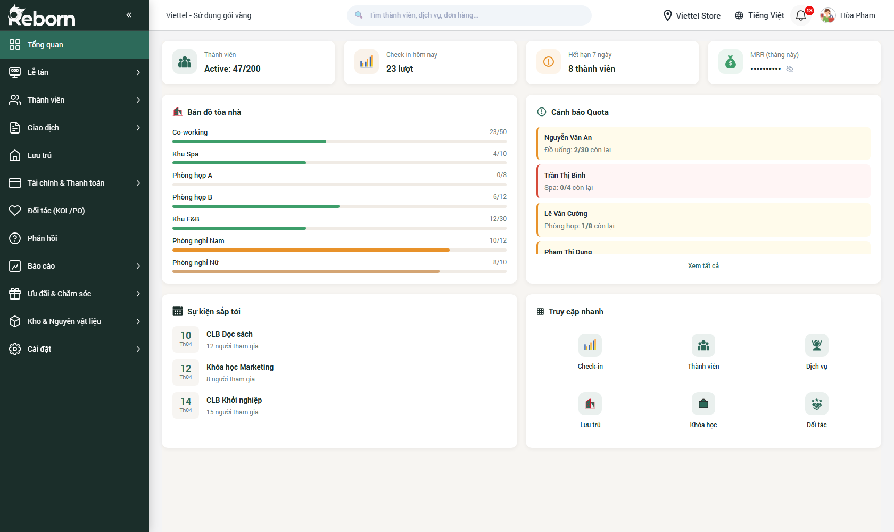

| Khu vực | Vị trí | Chức năng |
|---------|--------|-----------|
| **Thanh bên trái (Sidebar)** | Dọc cột trái | Điều hướng giữa các phân hệ |
| **Thanh trên cùng (Header)** | Ngang trên cùng | Tên tenant, tìm kiếm toàn cục, thông báo, chọn ngôn ngữ, tài khoản |
| **Vùng nội dung** | Phần còn lại | Hiển thị nội dung của phân hệ bạn đang chọn |

### 2.1. Thanh trên cùng (Header)


Từ trái sang phải:

1. **Logo Reborn + Nút thu gọn sidebar (« »)**
   Bấm vào biểu tượng `«` để **thu gọn** thanh bên trái (còn lại các icon nhỏ), giúp có nhiều diện tích hơn cho vùng nội dung. Bấm lại để mở rộng.

2. **Tên gói đang dùng**
   Ví dụ hiển thị *"Viettel - Sử dụng gói vàng"*. Đây là tên tenant (đơn vị) và gói dịch vụ bạn đang thuê.

3. **Thanh tìm kiếm toàn cục**
   Gõ tên thành viên, dịch vụ hoặc mã đơn hàng để tìm nhanh mà không cần vào từng phân hệ.

4. **Tên cơ sở (ví dụ: Viettel Store)**
   Nếu đơn vị bạn có nhiều cơ sở / cửa hàng, bấm vào đây để chuyển đổi cơ sở làm việc. Mọi số liệu hiển thị sau đó sẽ theo cơ sở bạn vừa chọn.

5. **Chọn ngôn ngữ (Tiếng Việt / English)**

   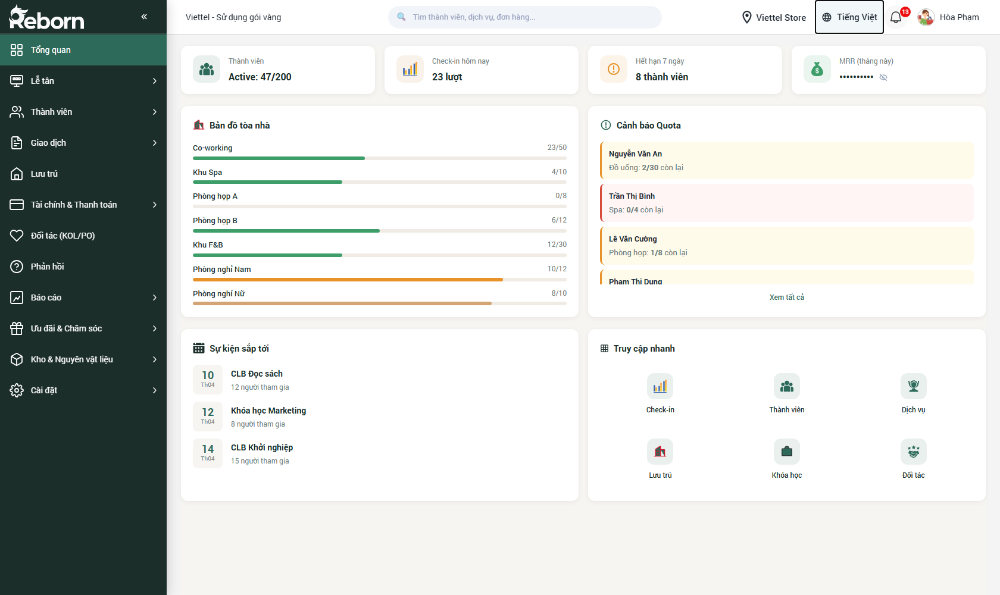

   Bấm để mở menu và chọn ngôn ngữ hiển thị. Lựa chọn này được ghi nhớ cho các lần đăng nhập sau.

6. **Chuông thông báo 🔔 (kèm số lượng chưa đọc)**
   Bấm để xem các thông báo hệ thống gửi cho bạn: đơn hàng mới, yêu cầu phê duyệt, lịch công việc, v.v.

7. **Avatar + tên người dùng**

   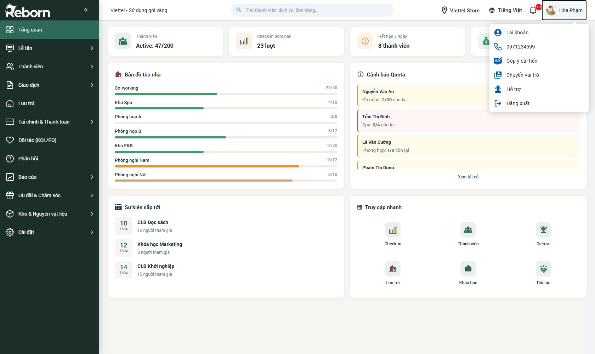

   Bấm vào avatar/tên để mở menu cá nhân gồm:
   - **Hồ sơ** — xem/chỉnh thông tin cá nhân.
   - **Vai trò** — chuyển đổi vai trò nếu tài khoản có nhiều vai trò.
   - **Đăng xuất** — thoát khỏi hệ thống.

### 2.2. Thanh bên trái (Sidebar)


Thanh bên trái là "mục lục" của toàn bộ ứng dụng. Nó gồm 12 mục lớn, mỗi mục tương ứng với một phân hệ công việc:

| # | Mục | Mô tả ngắn | Part liên quan |
|---|-----|------------|----------------|
| 1 | **Tổng quan** | Dashboard chính với chỉ số tức thời | Part 01 (mục 3) |
| 2 | **Lễ tân** | Bán hàng tại quầy, check-in khách, trừ quota, quản lý ca | Part 02 |
| 3 | **Thành viên** | Danh sách khách hàng là hội viên, cài đặt | Part 03 |
| 4 | **Giao dịch** | Danh sách đơn hàng, hóa đơn VAT | Part 04 |
| 5 | **Lưu trú** | Quản lý lưu trú / phòng (nếu kinh doanh có dịch vụ lưu trú) | Part 05 |
| 6 | **Tài chính & Thanh toán** | Sổ thu chi, quỹ, công nợ, đối soát | Part 06 |
| 7 | **Đối tác (KOL/PO)** | Đối tác giới thiệu / KOL / purchase order | Part 07 |
| 8 | **Phản hồi** | Phản hồi / khiếu nại của khách | Part 07 |
| 9 | **Báo cáo** | Báo cáo doanh thu, thành viên, check-in, dịch vụ, đối tác, tài chính | Part 08 |
| 10 | **Ưu đãi & Chăm sóc** | Khuyến mãi/voucher, tích điểm, chiến dịch marketing, chăm sóc thành viên | Part 09 |
| 11 | **Kho & Nguyên vật liệu** | Nguyên vật liệu, nhà cung cấp, kho, kiểm kê | Part 10 |
| 12 | **Cài đặt** | Cấu hình tenant, danh mục dịch vụ, tổ chức & phân quyền, tích hợp | Part 11 + Part 12 |

#### Mở rộng một nhóm để xem các mục con

Các nhóm có dấu `›` ở cuối dòng là **nhóm có mục con**. Bấm vào tên nhóm (ví dụ *"Lễ tân"*) hoặc vào dấu `›` để mở rộng. Sau khi mở, các mục con hiện bên dưới thụt vào và bạn có thể bấm trực tiếp vào mục cần dùng.

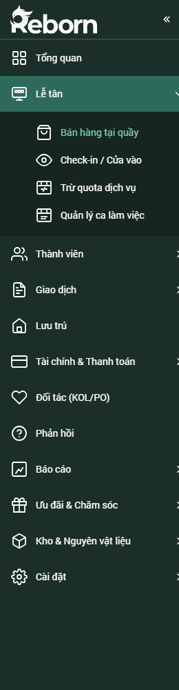

Trong ảnh trên, nhóm **Lễ tân** đã được mở rộng, cho thấy 4 mục con:

- **Bán hàng tại quầy** — tạo hóa đơn bán hàng / dịch vụ ngay tại quầy.
- **Check-in / Cửa vào** — ghi nhận khách vào sử dụng dịch vụ.
- **Trừ quota dịch vụ** — trừ suất dịch vụ của gói thành viên.
- **Quản lý ca làm việc** — mở/đóng ca, bàn giao, kiểm quỹ.

Mục đang chọn sẽ được làm nổi bật màu xanh đậm, giúp bạn luôn biết mình đang ở đâu.

> **Mẹo:** Nếu bạn chỉ thấy icon mà không thấy chữ, có nghĩa là sidebar đang ở chế độ thu gọn. Bấm nút `«` ở góc trên-trái để mở rộng trở lại.

### 2.3. Vùng nội dung

Vùng bên phải là nơi bạn thực hiện công việc thực tế. Nội dung ở đây **thay đổi** theo mục bạn chọn ở thanh bên trái. Ở màn hình **Tổng quan**, vùng này hiển thị các ô số liệu kinh doanh tức thời.

---

## 3. Đọc nhanh màn hình Tổng quan

Màn hình **Tổng quan** (Dashboard) là nơi đầu tiên bạn nhìn thấy sau khi đăng nhập. Nó cung cấp một "ảnh chụp nhanh" tình hình kinh doanh của cơ sở bạn đang làm việc.

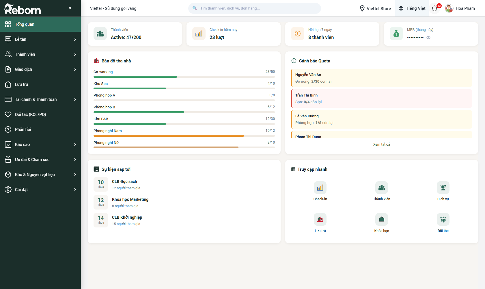

Dashboard gồm 4 loại ô thông tin:

### 3.1. Các chỉ số tổng hợp (ô thẻ — KPI)

Hàng trên cùng hiển thị các chỉ số quan trọng:

- **Thành viên đang hoạt động** (ví dụ *"Active: 47/200"*) — số hội viên còn hiệu lực so với tổng số cho phép của gói dịch vụ.
- **Check-in hôm nay** — số lượt khách đã check-in trong ngày.
- **Hội viên sắp hết hạn** — số lượng cần nhắc gia hạn.
- **Doanh thu** — số liệu doanh thu trong kỳ (ngày / tháng, tùy cấu hình).

> **Lưu ý:** Các chỉ số này là con số tức thời, được hệ thống tính lại mỗi khi bạn mở lại màn hình hoặc làm mới trình duyệt (F5).

### 3.2. Biểu đồ "Bán tốt nhà"

Hiển thị các dịch vụ/sản phẩm bán chạy nhất trong kỳ, dạng thanh ngang có phần trăm. Dùng để biết nhanh mặt hàng nào đang là "xương sống doanh thu" của bạn.

### 3.3. Sự kiện sắp tới

Liệt kê các mốc thời gian quan trọng: đợt khai trương, các lớp sắp tổ chức, các chiến dịch chuẩn bị chạy. Nhắc bạn không bỏ lỡ.

### 3.4. Cảnh báo Quota

Bảng bên phải nhắc tên những hội viên có quota dịch vụ sắp hết / đã hết. Từ đây bạn có thể bấm vào tên để đi thẳng đến hồ sơ thành viên và nhắc khách gia hạn.

### 3.5. Truy cập nhanh

Các nút vuông như **Check-in**, **Trạm trả**, **Lớp lô**, **Lưu trú**, **Phản hồi**, **Lịch lớp**, v.v. là **lối tắt** để mở nhanh màn hình công việc hay dùng nhất, không cần qua sidebar.

---

## 4. Các luồng công việc cơ bản

Để giúp bạn hình dung, dưới đây là bản đồ "Tôi muốn làm... → vào đâu". Chi tiết từng luồng sẽ được hướng dẫn ở các Part tiếp theo.

| Tôi muốn... | Đi tới mục | Part hướng dẫn chi tiết |
|-------------|-----------|-------------------------|
| Mở ca làm việc đầu ngày | **Lễ tân → Quản lý ca làm việc** | Part 02 |
| Bán một gói dịch vụ cho khách mới | **Lễ tân → Bán hàng tại quầy** | Part 02 |
| Check-in cho khách đến sử dụng dịch vụ | **Lễ tân → Check-in / Cửa vào** | Part 02 |
| Tìm hồ sơ một hội viên | **Thành viên → Thành viên** | Part 03 |
| Thêm một hội viên mới (ngoài luồng bán hàng) | **Thành viên → Thành viên → Thêm mới** | Part 03 |
| Xem lại các hóa đơn bán hàng hôm nay | **Giao dịch → Danh sách đơn** | Part 04 |
| Hoàn tiền / trả hàng cho khách | **Giao dịch → Danh sách đơn → Chi tiết đơn** | Part 04 |
| Ghi nhận một khoản thu/chi ngoài bán hàng | **Tài chính & Thanh toán → Sổ thu chi** | Part 06 |
| Đối soát tiền mặt cuối ca | **Tài chính & Thanh toán → Đối soát thanh toán** | Part 06 |
| Tạo chương trình khuyến mãi | **Ưu đãi & Chăm sóc → Khuyến mãi & Voucher** | Part 09 |
| Nhập kho nguyên vật liệu mới | **Kho & Nguyên vật liệu → Sổ kho** | Part 10 |
| Thêm tài khoản nhân viên mới | **Cài đặt → Tổ chức & phân quyền** | Part 12 |
| Cấu hình danh mục dịch vụ / sản phẩm | **Cài đặt → Danh mục dịch vụ** | Part 11 |
| Đổi mật khẩu của tôi | **Avatar → Hồ sơ → Đổi mật khẩu** | Part 12 |

---

## 5. Các phím tắt và mẹo dùng nhanh

| Thao tác | Cách làm |
|----------|----------|
| Quay lại màn trước | Dùng nút **Back** của trình duyệt hoặc nút mũi tên ở góc trên-trái của màn hình nội dung |
| Đóng cửa sổ (popup / modal) | Phím **Esc** hoặc bấm dấu **×** ở góc trên-phải của popup |
| Mở nhanh màn Tổng quan | Bấm biểu tượng **Tổng quan** ở đầu thanh bên trái |
| Tìm nhanh thành viên / đơn hàng | Dùng ô tìm kiếm trên thanh trên cùng |
| Thu gọn/mở rộng thanh bên trái | Bấm nút `«` / `»` ở đầu sidebar |
| Làm mới dữ liệu mà không mất đăng nhập | **F5** hoặc **Ctrl + R** |

---

## 6. Đăng xuất

Khi kết thúc ca làm việc, bạn nên đăng xuất để bảo vệ dữ liệu:

1. Bấm vào **avatar** (hoặc tên bạn) ở góc trên-phải.
2. Trong menu thả xuống, bấm **Đăng xuất**.
3. Hệ thống sẽ đưa bạn về trang đăng nhập.

> **Quan trọng:** Trên các máy tính dùng chung (máy tại quầy lễ tân), hãy đăng xuất sau mỗi ca làm việc. Đừng chỉ đóng trình duyệt — người khác mở lại trình duyệt có thể vào nguyên phiên làm việc của bạn nếu có tick "Ghi nhớ".

---

## 7. Tiếp theo cần đọc gì?

Bạn đã sẵn sàng bắt đầu công việc hằng ngày:

- **Part 02 — Lễ tân**: chính là nơi bạn sẽ dành thời gian nhiều nhất trong ngày. Từ mở ca, bán hàng, check-in khách, cho đến đóng ca cuối ngày.
- **Part 03 — Thành viên**: cách quản lý danh sách khách hàng hội viên, xem lịch sử sử dụng dịch vụ.
- **Part 12 — Cài đặt nâng cao**: chỉ đọc nếu bạn là người quản trị, cần cấp tài khoản / đổi phân quyền cho nhân viên.

---

*Hết Part 01.*

---

# Part 02 — Lễ tân

*Phiên bản: Cửa hàng & Spa — Tenant "Viettel Store"*

**Lễ tân** là phân hệ bạn sẽ dùng nhiều nhất trong ngày. Đây là nơi tập trung 4 công việc "đứng chân tại quầy" của nhân viên lễ tân / thu ngân:

1. **Quản lý ca làm việc** — mở ca đầu giờ, theo dõi ca, đóng ca cuối giờ, xem báo cáo kết ca.
2. **Bán hàng tại quầy (POS)** — tạo hóa đơn bán sản phẩm / dịch vụ cho khách đến quầy.
3. **Check-in / Cửa vào** — ghi nhận khách hội viên đến sử dụng dịch vụ (quét thẻ, QR hoặc nhập tay).
4. **Trừ quota dịch vụ** — trừ suất dịch vụ trong gói thành viên sau khi khách sử dụng.

> **Quan trọng — thứ tự làm việc:** Bạn **phải mở ca** trước khi bán hàng. Không có ca đang hoạt động thì hệ thống sẽ không ghi nhận hóa đơn vào ca nào, và cuối ngày không đối soát tiền mặt được. Đóng ca cuối ngày để hoàn tất báo cáo.

---

## Mục lục

- [A. Quản lý ca làm việc](#a-quản-lý-ca-làm-việc)
  - [A.1. Mở ca đầu ngày](#a1-mở-ca-đầu-ngày)
  - [A.2. Theo dõi ca đang mở](#a2-theo-dõi-ca-đang-mở)
  - [A.3. Xem các đơn trong ca](#a3-xem-các-đơn-trong-ca)
  - [A.4. Đóng ca / Kết toán](#a4-đóng-ca--kết-toán)
  - [A.5. Báo cáo kết ca](#a5-báo-cáo-kết-ca)
  - [A.6. Báo cáo tổng quan ca](#a6-báo-cáo-tổng-quan-ca)
- [B. Bán hàng tại quầy (POS)](#b-bán-hàng-tại-quầy-pos)
  - [B.1. Tổng quan giao diện](#b1-tổng-quan-giao-diện)
  - [B.2. Tạo một đơn bán đơn giản](#b2-tạo-một-đơn-bán-đơn-giản)
  - [B.3. Thêm mặt hàng không có trong danh mục (Thêm nhanh)](#b3-thêm-mặt-hàng-không-có-trong-danh-mục-thêm-nhanh)
  - [B.4. Gắn khách hàng cho đơn](#b4-gắn-khách-hàng-cho-đơn)
  - [B.5. Áp dụng khuyến mãi / voucher](#b5-áp-dụng-khuyến-mãi--voucher)
  - [B.6. Thanh toán](#b6-thanh-toán)
  - [B.7. Lưu đơn tạm & tiếp tục sau](#b7-lưu-đơn-tạm--tiếp-tục-sau)
- [C. Check-in / Cửa vào](#c-check-in--cửa-vào)
- [D. Trừ quota dịch vụ & Đặt lịch](#d-trừ-quota-dịch-vụ--đặt-lịch)
- [E. Luồng một ca làm việc điển hình](#e-luồng-một-ca-làm-việc-điển-hình)

---

## A. Quản lý ca làm việc

**Đường dẫn:** Sidebar → **Lễ tân** → **Quản lý ca làm việc**
**URL:** `/crm/shift_management`

Mỗi lần bạn đến quầy bắt đầu công việc, hệ thống cần biết "ca của bạn bắt đầu khi nào, trong két có bao nhiêu tiền". Cuối ngày, hệ thống cần biết "bạn đã thu thêm bao nhiêu, còn lại trong két bao nhiêu". Tất cả nằm trong phân hệ này.

Màn hình Quản lý ca có **7 tab** tương ứng 7 bước/trạng thái khác nhau của một ca:

| # | Tab | Khi nào hiện / Dùng để làm gì |
|---|-----|-------------------------------|
| 1 | **Chưa vào ca** | Chưa có ca nào đang mở. Hiển thị danh sách các cấu hình ca có thể mở và nút **Mở ca này** |
| 2 | **Vào ca** | Form nhập tiền đầu ca (tổng tiền hoặc chi tiết mệnh giá) |
| 3 | **Đang ca** | Theo dõi tình trạng ca hiện tại: thời gian, tiền mặt, giao dịch |
| 4 | **Đơn trong ca** | Danh sách các đơn bán hàng đã tạo trong ca này |
| 5 | **Đóng ca** | Nhập tiền mặt thực tế cuối ca, so với hệ thống, phát hiện chênh lệch |
| 6 | **Báo cáo kết ca** | In báo cáo kết ca ngay sau khi đóng (cho quản lý / bàn giao) |
| 7 | **Báo cáo tổng quan** | Thống kê tổng hợp của tất cả các ca (không chỉ ca hiện tại) |

> **Lưu ý:** Nếu ca đã mở từ trước mà bạn chưa đóng, khi vào lại trang Quản lý ca, hệ thống tự động đưa bạn về tab **Đang ca** để tiếp tục. Bạn không cần mở ca mới.

### A.1. Mở ca đầu ngày

**Khi nào:** Đầu giờ làm, trước khi bán hàng bất kỳ thứ gì.

**Các bước:**

1. Vào **Lễ tân → Quản lý ca làm việc**.
2. Nếu bạn đang ở tab **Chưa vào ca**, hệ thống hiển thị danh sách các cấu hình ca (ví dụ: *"Ca sáng — 8:00–14:00"*, *"Ca chiều — 14:00–22:00"*, *"Ca toàn thời gian"*). Các cấu hình này do quản lý cửa hàng cài trước trong **Cài đặt → Vận hành cơ sở** (xem Part 11).

   

3. Bấm nút **Mở ca này** ở ca bạn muốn mở. Hệ thống chuyển sang tab **Vào ca**.

4. Trên tab **Vào ca**, bạn cần nhập **tiền mặt đầu ca** (số tiền thực tế đang có trong két khi bắt đầu ca). Có hai cách nhập:

   

   **Cách 1 — Nhập tổng tiền (nhanh):**
   - Bấm nút **Nhập tổng tiền** (mặc định đang chọn).
   - Gõ số tiền vào ô **Tiền mặt đầu ca**. Hệ thống sẽ tự động thêm dấu phẩy ngăn cách nghìn khi bạn gõ.
   - Đơn vị mặc định là **VNĐ**.
   - Nếu cấu hình ca có **tiền mặc định đầu ca**, sẽ có nút *"Dùng mặc định: X VNĐ"* — bấm để lấy nhanh.

   **Cách 2 — Nhập theo mệnh giá (chính xác):**
   - Bấm nút **Nhập theo mệnh giá**.
   - Bảng hiển thị **9 mệnh giá**: 500.000 / 200.000 / 100.000 / 50.000 / 20.000 / 10.000 / 5.000 / 2.000 / 1.000 đồng.
   - Với mỗi mệnh giá, đếm số tờ thực tế trong két rồi bấm nút **+** để tăng hoặc **−** để giảm. Có thể gõ thẳng số tờ vào ô.
   - Cột **Thành tiền** tự động tính: mệnh giá × số tờ.
   - Cột **TỔNG TIỀN ĐẦU CA** ở dưới cùng cộng lại toàn bộ.

5. Bấm **Xác nhận vào ca** để mở ca.

#### Quy định nhập liệu — Tiền mặt đầu ca

| Mục | Ràng buộc | Ghi chú |
|-----|-----------|---------|
| **Tiền mặt đầu ca** | Bắt buộc | Nếu bỏ trống hoặc = 0, hệ thống báo lỗi "Vui lòng nhập số tiền đầu ca" và không cho mở ca |
| Định dạng | Số nguyên dương, VNĐ | Không nhập số âm, không nhập số thập phân |
| Kiểu nhập | Chỉ số (ký tự khác bị loại tự động) | Dấu phẩy ngăn cách nghìn được thêm tự động khi hiển thị |
| Số tờ mệnh giá | Số nguyên ≥ 0 | Nhấn **−** khi số tờ = 0 không có tác dụng |

> **Mẹo:** Nên dùng **Nhập theo mệnh giá** đầu ngày để tránh đếm nhầm. Chế độ này giúp bạn cũng đồng thời "kiểm kê két" — phát hiện ngay nếu đêm qua có gì bất thường.

### A.2. Theo dõi ca đang mở

Sau khi xác nhận vào ca, hệ thống chuyển sang tab **Đang ca**.

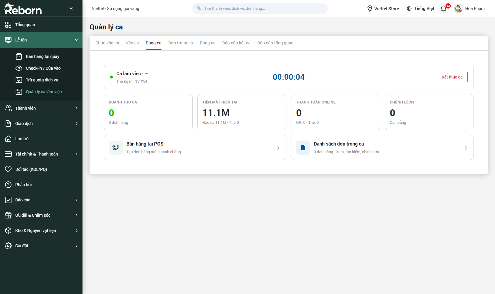

Màn hình này là **bảng điều khiển thời gian thực** của ca bạn:

- **Đồng hồ bấm giờ** (format `HH:MM:SS`) — thời gian đã trôi kể từ lúc mở ca. Tự động đếm.
- **Tên ca + trạng thái** — tên ca bạn đang mở, kèm trạng thái *"Đang làm"*.
- **4 chỉ số nhanh (thẻ số)**:
  - **Tiền mặt đầu ca** — số tiền bạn đã khai báo lúc vào ca.
  - **Tổng tiền mặt thực thu** — tiền mặt thu được từ các đơn bán hàng trong ca.
  - **Tổng khoản thanh toán** — tổng tất cả phương thức (cash + chuyển khoản + thẻ + ví).
  - **Chênh lệch** — sẽ được tính lúc đóng ca.
- **Nút Kết thúc ca** (đỏ, góc trên phải) — bấm khi bạn sẵn sàng đóng ca.
- **2 ô hành động nhanh**:
  - **Bán hàng tại POS** — mở thẳng màn hình POS không cần đi qua sidebar.
  - **Danh sách đơn trong ca** — chuyển sang tab **Đơn trong ca**.

> **Lưu ý:** Nếu bạn đóng trình duyệt giữa chừng rồi mở lại, ca **vẫn giữ nguyên trạng thái đang mở** trong hệ thống (lưu trên server). Khi đăng nhập lại, vào Quản lý ca sẽ tự về tab **Đang ca**. Không cần mở ca lần nữa.

### A.3. Xem các đơn trong ca

Bấm tab **Đơn trong ca** để xem toàn bộ hóa đơn đã tạo kể từ lúc mở ca.


Màn hình gồm:

- **Bộ lọc**: Tất cả trạng thái / Tất cả thanh toán (dropdown).
- **Ô tìm kiếm**: gõ mã đơn để tìm nhanh.
- **4 chỉ số tổng hợp**: Công nợ — Doanh thu ca — Giờ trung bình — Đơn hàng.
- **Danh sách đơn**: khi chưa có đơn, hiển thị *"Ở đây chưa có gì cả. Hãy tạo đơn hàng đầu tiên!"*.

Bấm vào một đơn để xem chi tiết (sản phẩm, tiền, khách hàng, thời gian). Dùng màn này để:
- Kiểm tra nhanh tổng kết ca tạm thời trước khi đóng.
- Tìm đơn cũ để in lại hóa đơn / voucher cho khách.
- Đối chiếu khi khách thắc mắc.

### A.4. Đóng ca / Kết toán

**Khi nào:** Cuối ca / cuối ngày, trước khi ra về. Phải đóng ca mới tính đúng doanh thu và chuyển bàn giao cho ca sau.

**Các bước:**

1. Ở tab **Đang ca**, bấm nút **Kết thúc ca** (đỏ).
2. Hệ thống chuyển sang tab **Đóng ca**.

   

3. Trên màn hình Đóng ca, bạn thấy:
   - **Tổng hệ thống tính** (màu cam) — số tiền lẽ ra đang phải có trong két theo hệ thống (= Tiền đầu ca + tiền mặt thu được).
   - **Ô "Tiền mặt xuất ca"** (viền đỏ) — đây là nơi bạn gõ **số tiền thực tế** đang có trong két khi kiểm.
   - **Chênh lệch** (0 VNĐ nếu khớp, âm nếu thiếu, dương nếu dư).
   - Có 2 chế độ nhập: **Nhập tổng** hoặc **Nhập theo mệnh giá** (giống lúc mở ca).
4. Kiểm két thực tế, gõ số tiền, đối chiếu **Chênh lệch**.
5. Nếu có chênh lệch → điền lý do vào ô **Ghi chú chênh lệch** (xuất hiện khi chênh lệch ≠ 0).
6. Bấm **Đóng ca / Xác nhận kết ca**.

> **Lưu ý quan trọng:** Sau khi đóng ca, bạn **không thể tạo đơn bán hàng mới** cho đến khi mở ca tiếp theo. Vì vậy nên đóng ca **sau khi** đã chắc chắn không còn khách.

#### Quy định nhập liệu — Tiền mặt xuất ca

| Mục | Ràng buộc | Ghi chú |
|-----|-----------|---------|
| **Tiền mặt xuất ca** | Bắt buộc | Tương tự tiền đầu ca |
| Chênh lệch = 0 | Khuyến khích | Không bắt buộc, hệ thống vẫn cho đóng ca nếu chênh lệch |
| Ghi chú khi chênh lệch | Khuyến khích | Để quản lý biết nguyên nhân (hao hụt / khách trả nhầm / đổi tiền…) |

### A.5. Báo cáo kết ca

Ngay sau khi đóng ca, hệ thống chuyển sang tab **Báo cáo kết ca**.

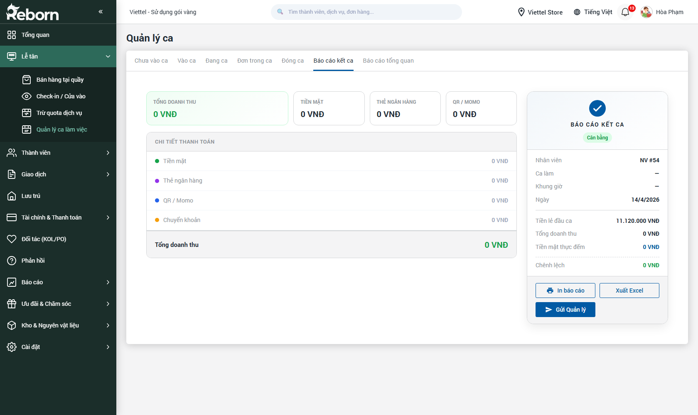

Đây là **bản in kết ca** đầy đủ, gồm:

- **4 chỉ số tổng lớn** (trên cùng): Tiền mặt / Ngân hàng / Thẻ / Ví điện tử.
- **Danh mục chi tiết** (bảng giữa): Tiền vốn / Tiền ngân hàng / Giao dịch / Chuyển khoản / Tổng doanh thu…
- **Thẻ "BÁO CÁO KẾT CA"** (phải):
  - Mã ca, ngày, giờ vào/ra ca, nhân viên, tổng tiền đầu ca, chênh lệch.
  - **3 nút hành động**:
    - **In bảng cáo** — in ra giấy qua máy in gắn máy tính.
    - **Xuất Excel** — tải file `.xlsx` để gửi email / lưu trữ.
    - **Gửi Quản lý** — đẩy báo cáo vào hộp thư nội bộ của người quản lý.

> **Mẹo:** Nên **In bảng cáo** kèm ký tên nhân viên ở cuối, dán vào bìa kẹp ca làm việc. Đây là tài liệu bàn giao tiêu chuẩn khi có tranh chấp về tiền két.

### A.6. Báo cáo tổng quan ca

Tab **Báo cáo tổng quan** khác **Báo cáo kết ca** ở chỗ: nó không phải của **một ca** mà là **tổng hợp nhiều ca** (theo ngày / tuần / tháng). Thường quản lý cửa hàng xem ở đây.

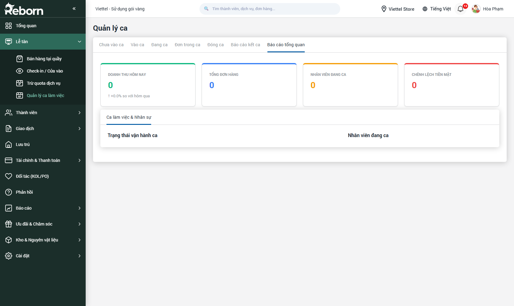

Gồm:
- **4 chỉ số tổng**: Tổng số ca — Nhân viên vào ca — Tổng ca bận — Chênh lệch tích lũy.
- **2 biểu đồ** (tab chuyển đổi):
  - **Trạng thái ca đang vận hành** — ai đang mở ca, ai đã đóng.
  - **Nhân viên đang mở ca** — chi tiết nhân viên nào mở ca nào, từ khi nào.

---

## B. Bán hàng tại quầy (POS)

**Đường dẫn:** Sidebar → **Lễ tân** → **Bán hàng tại quầy**
**URL:** `/crm/create_sale_add`

Đây là công cụ chính của nhân viên thu ngân. Giao diện được thiết kế theo kiểu **POS (Point of Sale)** — màn hình chia thành 2 phần lớn: bên trái là sản phẩm, bên phải là giỏ hàng.

> **Yêu cầu:** Phải có ca đang mở ([A.1](#a1-mở-ca-đầu-ngày)). Nếu chưa mở ca, hệ thống có thể vẫn cho bạn thao tác nhưng đơn sẽ không gắn vào ca nào và báo cáo cuối ngày sẽ bị lệch.

### B.1. Tổng quan giao diện

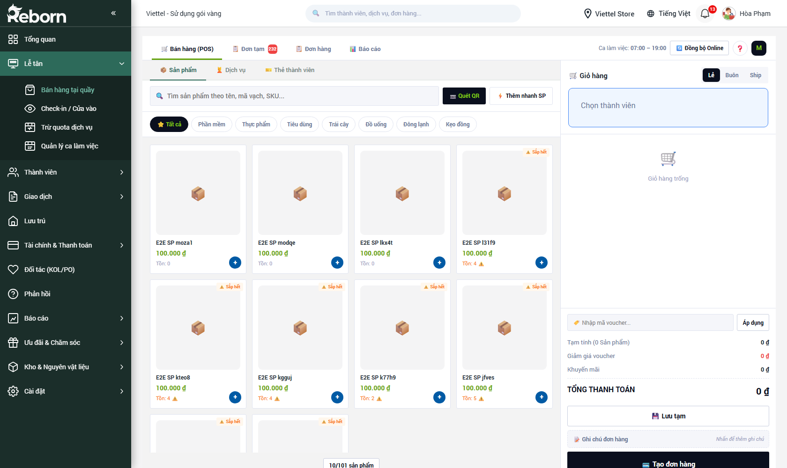

Màn hình có 5 khu vực:

| Khu vực | Vị trí | Chức năng |
|---------|--------|-----------|
| **Thanh tab công việc** | Trên cùng | **Bán hàng (POS)** / **Bán thẻ** / **Bán LP** / **Đơn tạm** / **Đơn hàng** / **Báo cáo** — chuyển giữa các chế độ. Tab **Bán hàng (POS)** là mặc định |
| **Thanh lọc danh mục** | Trên khu sản phẩm | *Tất cả sản phẩm*, *Phân loại*, *Thời giờ*, *Voucher*, *Set combo*, *Gói dịch vụ*… — lọc nhanh theo nhóm |
| **Lưới sản phẩm** | Giữa — lớn | Các card sản phẩm có hình, tên, giá. Bấm để thêm vào giỏ |
| **Giỏ hàng** | Cột phải | Chọn khách → danh sách món đã thêm → tổng tiền → nút thanh toán |
| **Ô tìm kiếm sản phẩm** | Trên lưới | Gõ tên / mã / barcode để tìm nhanh |

### B.2. Tạo một đơn bán đơn giản

**Kịch bản:** Khách đến quầy chọn 1 dịch vụ massage + 1 chai nước. Bạn cần xuất hóa đơn, thu tiền mặt.

**Các bước:**

1. Mở **Bán hàng tại quầy**. Mặc định đang ở tab **Bán hàng (POS)**.

2. **Lọc hoặc tìm sản phẩm:**
   - **Cách A — Lọc theo nhóm:** Bấm vào nhãn danh mục trên thanh lọc (*Phân loại*, *Gói dịch vụ*, v.v.) để chỉ hiện nhóm đó.
   - **Cách B — Tìm tên:** Gõ vào ô tìm kiếm (trên lưới sản phẩm). Hệ thống lọc theo thời gian thực.
   - **Cách C — Quét mã vạch:** Dùng máy quét USB cắm vào máy tính, con trỏ trong ô tìm kiếm → quét mã → sản phẩm tự nhảy vào giỏ.

3. **Bấm vào card sản phẩm** để thêm vào giỏ hàng bên phải.
   - Nếu sản phẩm có **biến thể** (ví dụ size S/M/L, màu đỏ/xanh), hệ thống sẽ mở **Modal chọn biến thể** — chọn biến thể → **Xác nhận**.
   - Nếu sản phẩm đơn giản, nhảy thẳng vào giỏ với số lượng 1.

4. **Điều chỉnh số lượng trong giỏ:**
   - Bấm **+** / **−** bên cạnh tên món.
   - Hoặc gõ thẳng số vào ô số lượng.
   - Bấm biểu tượng **thùng rác** để xóa món khỏi giỏ.

5. **Kiểm tra tổng tiền** hiển thị cuối giỏ hàng — mục **TỔNG THANH TOÁN**.

6. Bấm nút **Thanh toán** (hoặc **Tạo đơn hàng**) ở cuối cột giỏ.

7. **Modal thanh toán** hiện lên — chọn phương thức, nhập số tiền khách đưa, xác nhận. Xem chi tiết ở [B.6](#b6-thanh-toán).

8. Sau khi xác nhận, hệ thống in hóa đơn và **reset giỏ hàng** — sẵn sàng cho khách tiếp theo.

> **Mẹo làm việc nhanh:**
> - Luôn dùng máy quét mã vạch nếu có. Nhanh gấp 5 lần bấm chọn thủ công.
> - Dùng phím **Enter** thay cho bấm chuột ở hầu hết các bước (Tìm → Enter; Thanh toán → Enter → Enter).

### B.3. Thêm mặt hàng không có trong danh mục (Thêm nhanh)

**Khi nào:** Khách yêu cầu một dịch vụ phát sinh mà quản lý chưa kịp thêm vào danh mục (ví dụ *"Phí bảo trì máy"*, *"Phí giữ xe"*, một món hàng nhỏ lẻ…).

**Các bước:**

1. Trong màn **Bán hàng tại quầy**, tìm nút **Thêm nhanh** (biểu tượng ⚡) — thường nằm ở trên lưới sản phẩm hoặc trong menu "thêm" của giỏ hàng.
2. Bấm vào để mở **Modal Thêm nhanh sản phẩm / dịch vụ**.

   

3. Điền thông tin:

#### Quy định nhập liệu — Thêm nhanh sản phẩm/dịch vụ

| Trường | Bắt buộc | Định dạng | Ràng buộc | Ghi chú |
|--------|:--------:|-----------|-----------|---------|
| **Tên sản phẩm / dịch vụ** | ✓ | Chuỗi văn bản | Không được trống, tự động loại khoảng trắng đầu/cuối | Ví dụ: *"Phí lắp đặt"*, *"Cáp sạc iPhone 15"* |
| **Đơn giá (₫)** | ✓ | Số nguyên dương | > 0 | Tự động thêm dấu chấm ngăn cách nghìn khi gõ; ký tự không phải số bị loại |
| **Đơn vị tính** | — | Chọn từ danh sách | Cái / Chiếc / Hộp / Kg / Gram / Lít / Bộ / Dịch vụ / Giờ / Lần | Mặc định *"Cái"* |

**Lỗi hay gặp:**
- Bỏ trống **Tên** → báo đỏ: *"Vui lòng nhập tên sản phẩm / dịch vụ"*
- Đơn giá = 0 hoặc để trống → báo đỏ: *"Vui lòng nhập giá hợp lệ (> 0)"*

4. Xem **Preview** (hiện khi đã điền đủ Tên + Giá): đây là cách sản phẩm sẽ hiển thị trong giỏ hàng.
5. Bấm **⚡ Thêm vào giỏ** (hoặc nhấn **Enter**) — món được thêm ngay. Bấm **Hủy** để đóng modal không thêm.

> **Quan trọng:** Sản phẩm thêm nhanh chỉ có tác dụng **trong đơn này** — nó **không được lưu vào danh mục**, **không trừ tồn kho**. Nếu là mặt hàng sẽ bán nhiều lần, nên nói với quản lý thêm chính thức trong **Cài đặt → Danh mục dịch vụ** (xem Part 11).

### B.4. Gắn khách hàng cho đơn

**Khi nào:** Khách là hội viên, muốn cộng điểm / ghi nhận lịch sử mua hàng / áp dụng giá ưu đãi của gói thành viên.

**Các bước:**

1. Trong giỏ hàng (cột phải), tìm khu vực **Chọn thành viên** ở trên cùng. Bấm vào.
2. **Modal Chọn khách hàng** mở ra với 2 cách tìm:
   - **Tìm kiếm**: gõ tên / SĐT / mã thành viên → danh sách gợi ý hiện ra → bấm chọn.
   - **Thêm mới**: nếu khách chưa có trong hệ thống, bấm **+ Thêm mới thành viên** → mở **SlidePanel Thêm nhanh thành viên**.
3. Khi chọn xong, thông tin khách hiển thị ở đầu giỏ: tên, avatar, gói hiện tại, điểm tích lũy, công nợ (nếu có).

#### Quy định nhập liệu — SlidePanel Thêm nhanh thành viên

Khi bấm **+ Thêm mới** trong modal chọn khách, một panel trượt từ bên phải hiện lên:

| Trường | Bắt buộc | Định dạng | Ràng buộc | Ghi chú |
|--------|:--------:|-----------|-----------|---------|
| **Loại thành viên** | — | Radio | Cá nhân / Doanh nghiệp | Mặc định *"Cá nhân"* |
| **Họ tên** *(Cá nhân)* hoặc **Tên công ty** *(Doanh nghiệp)* | ✓ | Chuỗi | Không trống, tự loại khoảng trắng đầu/cuối | Ví dụ: *"Nguyễn Văn An"* hoặc *"Công ty TNHH ABC"* |
| **Số điện thoại** | ✓ | Số điện thoại | Không trống | Placeholder: *"0912 345 678"*. Nên nhập đúng 10 số VN |
| **Email** | — | Email | Định dạng email nếu có nhập | Có thể để trống |
| **Giới tính** *(chỉ Cá nhân)* | — | Radio | Nam / Nữ / Khác | Mặc định *"Nam"* |
| **Ghi chú** | — | Textarea 2 dòng | Tối đa không giới hạn nghiêm ngặt, nhưng nên < 500 ký tự | Để quản lý nhớ đặc điểm khách |

**Lỗi hay gặp:**
- Bỏ trống **Họ tên** → toast đỏ: *"Vui lòng nhập tên thành viên"*
- Bỏ trống **Số điện thoại** → toast đỏ: *"Vui lòng nhập số điện thoại"*
- Số điện thoại trùng với khách đã có → backend trả lỗi, hiển thị: *"Số điện thoại đã tồn tại"* (bạn sẽ cần dùng chức năng Tìm để chọn khách cũ)

**Nút hành động ở cuối panel:**
- **Nhập đầy đủ →** — đóng panel nhanh và mở trang **Chi tiết thành viên** đầy đủ (80+ trường) để nhập hồ sơ hoàn chỉnh. Dành cho trường hợp khách VIP cần lưu chi tiết.
- **Hủy** — bỏ, không tạo.
- **Tạo nhanh** — tạo khách với chỉ các trường tối thiểu.

> **Mẹo:** Ở quầy đông khách, luôn dùng **Tạo nhanh**. Các thông tin khác có thể bổ sung sau khi khách đi.

### B.5. Áp dụng khuyến mãi / voucher

**Khi nào:** Khách có voucher / mã khuyến mãi / đang trong chương trình giảm giá.

**Các bước:**

1. Sau khi đã thêm sản phẩm vào giỏ, tìm nút **Khuyến mãi / Áp mã giảm giá** trong giỏ hàng (cuối giỏ, trên mục TỔNG).
2. Bấm để mở **Modal khuyến mãi** — gồm 2 mục:
   - **Khuyến mãi đủ điều kiện** — các chương trình đang áp dụng được với giỏ hiện tại. Bấm **Chọn** để dùng.
   - **Khuyến mãi chưa đủ điều kiện** — các chương trình gần đủ (ví dụ "Mua thêm 50k để được giảm 10%"). Hiển thị lý do chưa áp được để bạn gợi ý khách mua thêm.
3. Nếu khách có **mã voucher rời** (code giấy), gõ vào ô **Nhập mã** → bấm **Áp dụng**.
4. Sau khi áp, giỏ hàng hiển thị thêm dòng **Giảm giá** với số tiền âm, và TỔNG THANH TOÁN được cập nhật.

### B.6. Thanh toán

**Các bước:**

1. Bấm **Thanh toán** ở cuối giỏ hàng.
2. **Modal Thanh toán** hiện lên với các lựa chọn phương thức:
   - **Tiền mặt** — mặc định chọn.
   - **Chuyển khoản** — kèm QR để khách quét.
   - **Thẻ** (quẹt máy POS bank).
   - **Ví điện tử** (MoMo, ZaloPay, v.v. nếu đã tích hợp).
3. Gõ **Số tiền khách đưa** vào ô tương ứng (với tiền mặt). Hệ thống tự tính **Tiền thối lại**.
4. Nếu khách muốn **thanh toán nhiều phương thức** (một nửa cash, một nửa chuyển khoản), bấm **+ Thêm phương thức** để chia nhỏ.
5. Nếu khách **nợ một phần**, tick ô **Cho phép ghi nợ** và nhập **Số còn nợ**. Hệ thống ghi công nợ cho khách này (chỉ áp dụng khi đã gắn khách vào đơn — xem [B.4](#b4-gắn-khách-hàng-cho-đơn)).
6. Bấm **Xác nhận thanh toán**.
7. **Modal Hóa đơn** (Receipt) hiện lên với đầy đủ chi tiết đơn. Bấm **In hóa đơn** (máy in gắn máy) hoặc **Gửi SMS / Email** cho khách.
8. Bấm **Đóng** để reset giỏ và sẵn sàng cho đơn tiếp theo.

#### Quy định nhập liệu — Modal Thanh toán

| Trường | Bắt buộc | Ghi chú |
|--------|:--------:|---------|
| **Phương thức** | ✓ | Chọn ít nhất 1 |
| **Số tiền đã trả** | ✓ | Phải ≥ 0. Nếu < tổng đơn và **Cho phép ghi nợ** tắt → báo lỗi |
| **Số còn nợ** | — | Tự tính = tổng đơn − đã trả. Chỉ ghi nhận khi có khách gắn vào đơn |
| **Ghi chú hóa đơn** | — | Textarea tùy chọn để in lên hóa đơn |

### B.7. Lưu đơn tạm & tiếp tục sau

**Khi nào:** Khách bỏ ngang / đang chọn hàng nhưng phải trả lời điện thoại / bạn cần xử lý khách khác trước.

**Các bước:**

1. Trong giỏ hàng, bấm nút **Lưu đơn tạm** (hoặc biểu tượng **☐** / **Lưu nháp**).
2. Giỏ hàng được lưu vào **Đơn tạm**, giỏ hiện tại trống đi để bán khách mới.
3. Muốn quay lại đơn cũ: bấm tab **Đơn tạm** trên thanh công việc trên cùng → chọn đơn → bấm **Tiếp tục**.
4. Đơn tạm có thời hạn (theo cấu hình tenant) — sau N ngày không xử lý, hệ thống tự xóa.

> **Lưu ý:** Đơn tạm **không trừ tồn kho** và **không được ghi nhận doanh thu**. Chỉ khi bấm **Thanh toán + Xác nhận** đơn mới chính thức.

---

## C. Check-in / Cửa vào

**Đường dẫn:** Sidebar → **Lễ tân** → **Check-in / Cửa vào**
**URL:** `/crm/ch_checkin`

**Khi nào dùng:** Khách là hội viên đến sử dụng dịch vụ đã mua (không phải mua mới). Check-in giúp:
- Ghi nhận khách đến → có mặt trong báo cáo lượt check-in hằng ngày.
- Kiểm tra hạn thẻ / quota còn lại trước khi cho khách vào khu dịch vụ.
- Làm dữ liệu cho báo cáo lưu lượng (giờ cao điểm, khách hay đi lúc nào).

### C.1. Tổng quan giao diện


Màn hình gồm 2 phần:

- **Khung quét (trên)**:
  - Vòng tròn lớn với icon — vùng quét thẻ RFID / QR. Bấm vào vòng tròn = **giả lập quét** (dùng khi test hoặc khi máy quét chưa gắn).
  - Dưới vòng tròn: ô **Tìm thủ công** — gõ Tên / SĐT / Mã thành viên rồi bấm **Tìm**.
- **Check-in gần đây (dưới)**: danh sách 15 lượt check-in/check-out gần nhất, hiển thị giờ — tên — hướng (▶ Vào / ◀ Ra) — khu vực.

### C.2. Quét thẻ hoặc QR

**Các bước:**

1. Khách đưa thẻ thành viên hoặc QR trên app di động.
2. Đưa thẻ/điện thoại gần **đầu đọc RFID/QR** gắn với máy tính — hệ thống tự nhận và mở popup.
   - *(Nếu chưa có máy quét, bấm vào vòng tròn trên màn hình để giả lập.)*

3. **Popup kết quả** hiển thị:

   

   - **Avatar** + **Tên khách**.
   - **Trạng thái thẻ** (màu theo trạng thái):
     - ✅ **Active** — còn hiệu lực.
     - ⚠️ **Cảnh báo** — sắp hết hạn / sắp hết quota.
     - ❌ **Expired** — đã hết hạn, không cho vào.
   - **Gói thành viên** + **Ngày hết hạn**.
   - **Quota còn lại** — danh sách các dịch vụ với số lượt còn / tổng lượt. Ví dụ *"Co-working: 18/20 còn lại"*, *"Spa & Massage: 2/6 còn lại ⚠️"*, *"Nước uống: ∞"* (không giới hạn).
   - **Các nút Vào khu**:
     - **Vào Co-working**
     - **Vào Spa**
     - **Vào phòng riêng**
     - **Hủy**

4. Bấm đúng khu vực khách sẽ vào → hệ thống ghi nhận check-in + toast *"Check-in thành công vào [khu vực]!"*.

> **Lưu ý:**
> - Nếu thẻ **hết hạn** hoặc **quota = 0**, nút Vào sẽ bị mờ và có cảnh báo. Bạn cần hướng dẫn khách mua gói mới hoặc gia hạn (xem [D.1](#d1-bán-thẻ-thành-viên)).
> - Nếu cảnh báo **sắp hết quota** (vàng), nhắc khách gia hạn nhẹ nhàng — đây là cơ hội upsell.

### C.3. Tìm khách thủ công

**Khi nào:** Khách quên thẻ / điện thoại hết pin.

**Các bước:**


1. Trong ô **Hoặc tìm thủ công**, gõ:
   - **Số điện thoại** (ưu tiên vì duy nhất) — ví dụ *"0912345678"*
   - hoặc **Tên thành viên** (ví dụ *"Nguyễn Văn A"*)
   - hoặc **Mã thành viên** (nếu nhớ)
2. Bấm **Tìm** hoặc **Enter**.
3. Nếu có khớp, popup kết quả hiện ra như trên. Nếu có nhiều khớp (ví dụ nhiều khách cùng tên), sẽ có danh sách để bạn chọn.
4. Xác minh khách bằng cách hỏi thêm (CMND / ngày sinh / số điện thoại đăng ký).

### C.4. Check-in gần đây

Phần dưới màn hình là **lịch sử check-in trong ngày** (mặc định 15 lượt mới nhất). Mỗi dòng hiển thị:

| Cột | Ví dụ |
|-----|-------|
| Giờ | `09:32` |
| Tên | Nguyễn Văn An |
| Hướng | ▶ Vào / ◀ Ra |
| Khu vực | Co-working |

Dùng danh sách này để:
- Biết hiện có ai trong khu dịch vụ.
- Tra cứu nhanh khi khách hỏi "tôi vào lúc nào?".
- Đối chiếu khi có sự cố (mất đồ, tranh chấp…).

---

## D. Trừ quota dịch vụ & Đặt lịch

**Đường dẫn:** Sidebar → **Lễ tân** → **Trừ quota dịch vụ**
**URL:** `/crm/ch_services`

Thực chất màn hình này có tên đầy đủ là **Dịch vụ & Booking** và gồm **3 tab** bạn có thể chuyển qua lại ở góc phải:

1. **Bán thẻ thành viên** — bán gói hội viên mới cho khách.
2. **Trừ quota** — trừ 1 suất dịch vụ trong gói khách đã mua.
3. **Đặt lịch** — đặt slot giờ cho các dịch vụ có lịch (ví dụ massage 60 phút).

### D.1. Bán thẻ thành viên

**Khi nào:** Khách mới, hoặc khách cũ hết thẻ muốn gia hạn / nâng gói.

**Các bước:**

1. Vào **Lễ tân → Trừ quota dịch vụ**. Tab mặc định là **Bán thẻ thành viên**.

   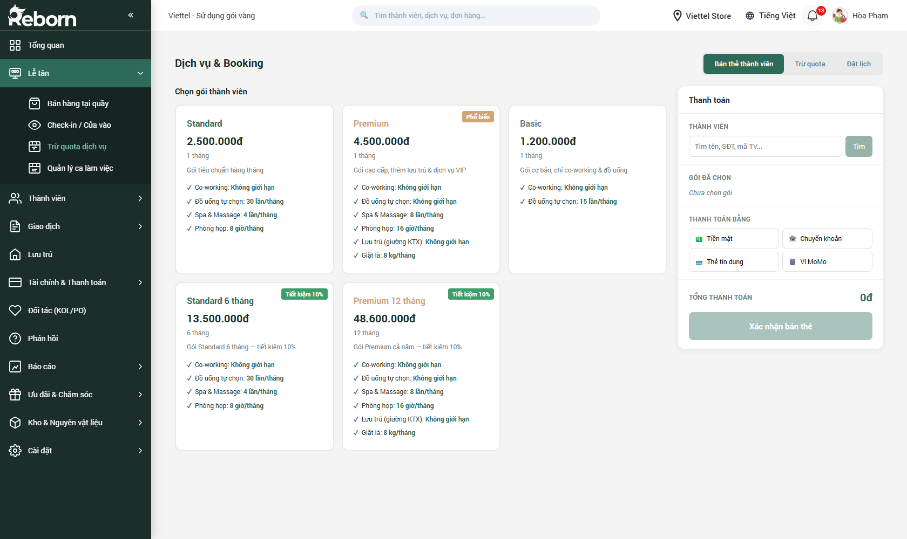

2. Màn hình chia 2 cột:
   - **Trái** (lớn) — lưới các **Gói thành viên** có bán. Mỗi card gồm: tên gói, giá, số tháng, mô tả ngắn, danh sách dịch vụ đi kèm.
   - **Phải** (nhỏ) — **Thanh toán (POS-style)** — chỗ chọn khách + chọn gói + thanh toán.

3. **Chọn khách:**
   - Trong cột **Thanh toán**, tìm ô **Thành viên** → gõ SĐT / tên / mã → bấm **Tìm**.
   - Nếu khách đã có, card khách hiện lên với tên + gói hiện tại.
   - Nếu khách mới, hệ thống có thể chuyển bạn sang [SlidePanel Thêm nhanh](#quy-định-nhập-liệu--slidepanel-thêm-nhanh-thành-viên).

4. **Chọn gói:**
   - Bấm vào một card gói (ví dụ *Basic* — 1.200.000đ / 1 tháng; hoặc *Premium* — 4.500.000đ / 1 tháng; hoặc *Standard 6 tháng* — 13.500.000đ).
   - Card chuyển sang trạng thái chọn (viền đậm màu gói).
   - Cột thanh toán bên phải cập nhật: tên gói + giá + thời hạn.

5. **Chọn phương thức thanh toán** (trong cột phải): Tiền mặt / Chuyển khoản / Thẻ / Ví điện tử.

6. Bấm **Xác nhận bán thẻ**.

7. Toast hiện: *"Đã bán thẻ [Tên gói] cho [Tên khách] — Giá: X — Thời hạn: Y tháng"*.

8. Hệ thống tự động:
   - Tạo thẻ thành viên mới cho khách (hoặc gia hạn thẻ cũ).
   - Cộng quota dịch vụ đi kèm.
   - In hóa đơn thanh toán.

#### Các trường trên card gói

Mỗi card gói bạn thấy trên màn hình hiển thị:
- **Tên gói** (màu theo cấu hình).
- **Giá** (VNĐ, đã format).
- **Thời hạn** (số tháng).
- **Mô tả ngắn**.
- **Dịch vụ bao gồm** — danh sách các gạch đầu dòng dạng "Dịch vụ X: N lần" hoặc "Y: Không giới hạn".
- **Badge "Phổ biến"** (nếu quản lý đánh dấu) hoặc **Badge khuyến mãi** (nếu đang có).

### D.2. Trừ quota (trừ suất dịch vụ)

**Khi nào:** Khách đến dùng một dịch vụ đã mua sẵn trong gói, bạn ghi nhận đã dùng 1 suất.

**Các bước:**

1. Bấm tab **Trừ quota** (góc phải màn hình).

   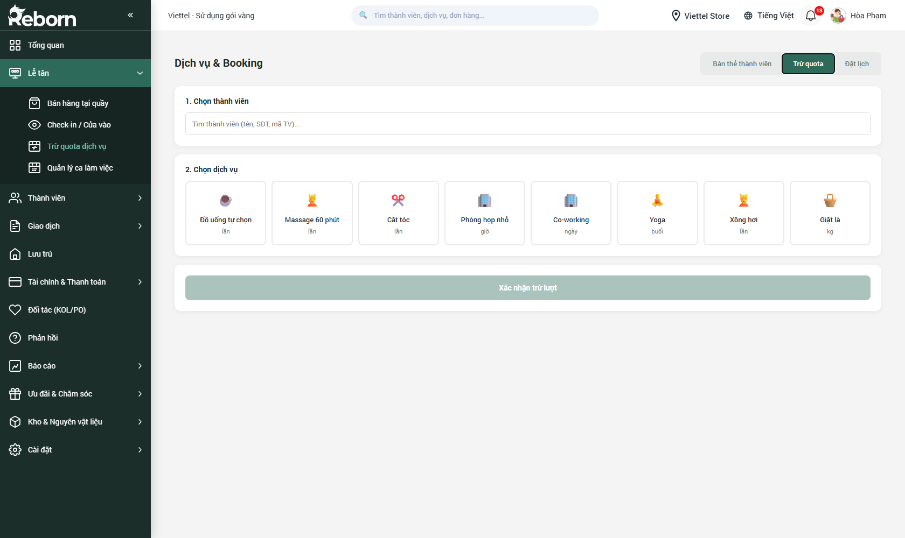

2. Màn hình gồm 2 phần:
   - **1. Chọn thành viên** — ô tìm kiếm khách.
   - **2. Chọn dịch vụ** — lưới icon các dịch vụ có thể trừ (Co-working, Văn phòng, Cầu lội, Phòng họp nhỏ, Co-working, Yoga, Xông hơi, Spa khác...).

3. Gõ SĐT/tên khách vào ô **Chọn thành viên** → khách hiện lên → chọn.

4. Bấm vào icon **dịch vụ** muốn trừ.

5. Bấm **Xác nhận trừ quota** ở cuối màn hình.

6. Toast: *"Đã trừ quota dịch vụ cho thành viên!"*.

> **Lưu ý:** Nếu khách không còn quota trong dịch vụ đó, nút Xác nhận sẽ mờ. Bạn cần gợi ý khách mua thêm suất lẻ hoặc nâng gói.

### D.3. Đặt lịch (Booking)

**Khi nào:** Dịch vụ cần giữ slot giờ, ví dụ Massage 60 phút — các khách không thể đặt trùng giờ.

**Các bước:**

1. Bấm tab **Đặt lịch**.

   

2. Chọn **Dịch vụ** (ví dụ *Massage 60 phút*) — lưới slot thời gian của ngày hôm nay hiện ra:
   - **Slot trống** (màu trắng / viền nhạt) — có thể đặt.
   - **Slot đã có khách** (màu đậm, có tên) — ví dụ *"09:00 — Nguyễn Văn A"*.
   - Mỗi slot gồm: giờ bắt đầu — dịch vụ — tên khách (nếu đã đặt).

3. Bấm vào **Slot trống** → modal đặt lịch hiện ra → chọn khách → **Xác nhận**.

4. Slot chuyển sang trạng thái đã đặt. Khi khách đến vào đúng giờ, bạn làm Check-in bình thường ([C](#c-check-in--cửa-vào)).

---

## E. Luồng một ca làm việc điển hình

Đây là trình tự một **ngày làm việc hoàn chỉnh** của nhân viên lễ tân — tổng hợp các mục trên để bạn hình dung toàn bộ bức tranh:

```
┌──────────────────────────────────────────────┐
│  ĐẦU CA (8:00)                               │
│  1. Đăng nhập                                │
│  2. Quản lý ca làm việc → Mở ca              │
│     → Đếm két → Nhập tiền đầu ca             │
│     → Xác nhận vào ca                        │
└────────────────┬─────────────────────────────┘
                 │
                 ▼
┌──────────────────────────────────────────────┐
│  TRONG CA (8:00 – 22:00)                     │
│  Lặp lại các công việc:                      │
│                                              │
│  • Khách MỚI → Bán thẻ thành viên (D.1)      │
│                hoặc Bán hàng tại quầy (B)    │
│                                              │
│  • Hội viên ĐẾN → Check-in / Cửa vào (C)     │
│                                              │
│  • Khách DÙNG DỊCH VỤ → Trừ quota (D.2)      │
│                                              │
│  • Khách ĐẶT LỊCH → Đặt lịch (D.3)           │
│                                              │
│  • Giữa buổi → Quản lý ca → Đơn trong ca     │
│    để kiểm tra nhanh doanh thu tạm thời      │
└────────────────┬─────────────────────────────┘
                 │
                 ▼
┌──────────────────────────────────────────────┐
│  CUỐI CA (22:00)                             │
│  1. Quản lý ca → Kết thúc ca                 │
│  2. Đếm két thật → Nhập tiền xuất ca         │
│  3. Xem chênh lệch → Ghi chú nếu có          │
│  4. Xác nhận đóng ca                         │
│  5. In Báo cáo kết ca → ký → nộp quản lý     │
│  6. Đăng xuất                                │
└──────────────────────────────────────────────┘
```

---

## F. Các lỗi hay gặp & cách xử lý

| Tình huống | Nguyên nhân khả năng cao | Xử lý |
|-----------|--------------------------|-------|
| Mở Bán hàng nhưng **danh sách sản phẩm trống** | Chưa có sản phẩm trong danh mục / sai cơ sở | Kiểm tra góc trên-phải tên cơ sở; vào Cài đặt → Danh mục dịch vụ (Part 11) để thêm |
| Thanh toán báo **"Không đủ tồn kho"** | Số lượng trong kho < số lượng đang bán | Vào **Kho & NVL → Sổ kho** để nhập bổ sung (Part 10) |
| **Không mở được ca** — báo "Đã có ca đang mở" | Có ca của nhân viên khác chưa đóng, hoặc ca cũ của bạn quên đóng | Tìm ca cũ trong Báo cáo tổng quan → đóng thủ công hoặc nhờ admin xử lý |
| **Quên đóng ca hôm qua** | | Mở Quản lý ca → vào đúng ca → Đóng → nhập số tiền ước tính + ghi chú → báo quản lý |
| Check-in nhưng popup báo **Expired** | Thẻ khách đã hết hạn | Gợi ý mua gói mới qua [D.1](#d1-bán-thẻ-thành-viên) |
| Máy quét mã vạch **không nhận** | USB chưa kết nối / driver / con trỏ không ở đúng ô | Kiểm tra USB; bấm vào ô tìm kiếm rồi quét lại |
| Nhập SĐT nhưng không tìm thấy khách | Khách chưa có trong hệ thống, hoặc ở cơ sở khác | Tạo mới qua **+ Thêm nhanh**; hoặc đổi cơ sở bằng dropdown trên header |

---

## Tiếp theo

Bạn đã nắm được toàn bộ công việc hằng ngày tại quầy. Phần tiếp theo:

- **Part 03 — Thành viên**: cách quản lý danh sách hội viên sâu hơn. Xem lịch sử mua hàng của một khách, cập nhật thông tin, đổi gói, v.v. — những thao tác **không** làm ở quầy mà ở máy quản lý.
- **Part 04 — Giao dịch**: nếu khách khiếu nại về đơn hàng, cần trả hàng, cần xuất hóa đơn VAT, đây là nơi xử lý.
- **Part 06 — Tài chính**: ngoài tiền mặt trong ca, cửa hàng có các khoản thu/chi khác (lương, điện nước, nhập NVL…). Tất cả ghi ở đây để cuối tháng đối soát chính xác.

---

*Hết Part 02.*

---

# Part 03 — Thành viên

*Phiên bản: Cửa hàng & Spa — Tenant "Viettel Store"*

Phân hệ **Thành viên** là nơi bạn quản lý "trái tim" của hệ thống — **danh sách khách hàng hội viên** và **cấu hình các danh mục liên quan** (thẻ, nhóm, nguồn, nghề nghiệp, mối quan hệ, trường tùy chỉnh, cấu trúc hiển thị).

Sidebar có **2 mục con**:

| Mục | URL | Nội dung |
|-----|-----|----------|
| **Thành viên** | `/crm/customer_list` | Danh sách toàn bộ khách hàng, thêm/sửa/xóa, import/export, lọc nâng cao, xem chi tiết |
| **Cài đặt thành viên** | `/crm/setting_customer` | 7 tab cấu hình: thẻ, nguồn, nhóm, nghề nghiệp, mối quan hệ, trường bổ sung, cấu trúc xem |

> **Khác biệt so với Part 02:** Ở Part 02 (Lễ tân) bạn đã biết cách **thêm nhanh** một khách ngay khi bán hàng. Ở Part 03, chúng ta đi sâu hơn — quản lý hồ sơ khách đầy đủ, xem lịch sử giao dịch, áp dụng chính sách, cấu hình trường dữ liệu tùy theo đặc thù cửa hàng của bạn.

---

## Mục lục

- [A. Danh sách thành viên](#a-danh-sách-thành-viên)
  - [A.1. Tổng quan giao diện](#a1-tổng-quan-giao-diện)
  - [A.2. Tìm kiếm nhanh](#a2-tìm-kiếm-nhanh)
  - [A.3. Lọc nâng cao](#a3-lọc-nâng-cao)
  - [A.4. Thêm thành viên mới](#a4-thêm-thành-viên-mới)
  - [A.5. Xem & chỉnh sửa chi tiết](#a5-xem--chỉnh-sửa-chi-tiết)
  - [A.6. Nhập danh sách (Import)](#a6-nhập-danh-sách-import)
  - [A.7. Xuất danh sách (Export)](#a7-xuất-danh-sách-export)
- [B. Cài đặt thành viên](#b-cài-đặt-thành-viên)
  - [B.1. Danh sách thẻ thành viên](#b1-danh-sách-thẻ-thành-viên)
  - [B.2. Danh sách nguồn thành viên](#b2-danh-sách-nguồn-thành-viên)
  - [B.3. Danh sách nhóm thành viên](#b3-danh-sách-nhóm-thành-viên)
  - [B.4. Danh sách ngành nghề](#b4-danh-sách-ngành-nghề)
  - [B.5. Danh sách mối quan hệ](#b5-danh-sách-mối-quan-hệ)
  - [B.6. Định nghĩa trường thông tin bổ sung](#b6-định-nghĩa-trường-thông-tin-bổ-sung)
  - [B.7. Định nghĩa cấu trúc xem thông tin](#b7-định-nghĩa-cấu-trúc-xem-thông-tin)
- [C. Luồng công việc thường gặp](#c-luồng-công-việc-thường-gặp)

---

## A. Danh sách thành viên

**Đường dẫn:** Sidebar → **Thành viên** → **Thành viên**
**URL:** `/crm/customer_list`

### A.1. Tổng quan giao diện

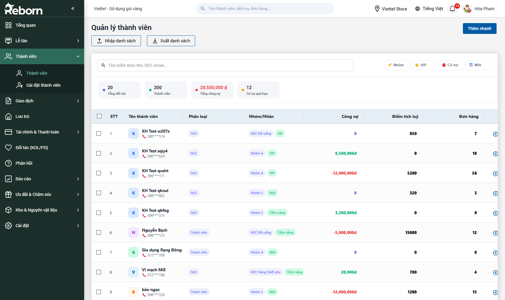

Màn hình chia 4 khu vực:

| Khu vực | Vị trí | Chức năng |
|---------|--------|-----------|
| **Thanh tiêu đề** | Trên cùng | "Quản lý thành viên" + 3 nút: **Nhập danh sách**, **Xuất danh sách**, **Thêm nhanh** |
| **Thanh chỉ số** | Dưới tiêu đề | 4 thẻ: Thành viên mới / Tổng thành viên / Tổng doanh thu / Thành viên sắp hết hạn |
| **Thanh lọc** | Trên bảng | Ô tìm kiếm + filter: *Cả 4 danh sách còn hoạt động*, *Chọn nhóm*, các badge nhanh (*🏷️ Nhóm*, *⭐ VIP*, *🔴 Có nợ*, *📅 Mới*) |
| **Bảng danh sách** | Giữa – lớn | Danh sách khách với 7 cột: #, Họ và tên, Mã/Nhóm, Nhóm/Khác, Công nợ, Điểm tích lũy, Đơn hàng |
| **Thanh phân trang** | Dưới cùng | Số dòng / trang + điều hướng |

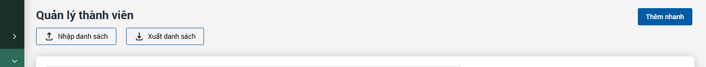

### A.2. Tìm kiếm nhanh

**Các bước:**

1. Nhấp vào ô tìm kiếm trên cùng (placeholder *"Tên, SĐT, mã thành viên..."*).
2. Gõ từ khóa. Hệ thống lọc theo **thời gian thực** — sau 300ms không gõ thêm, danh sách tự cập nhật.
3. Kết quả sẽ match với:
   - Họ và tên
   - Số điện thoại (hoặc số đã che — vd `090xxx***`)
   - Mã thành viên
   - Email (tùy cấu hình)

**Mẹo:**
- Gõ `091` để lọc theo nhà mạng.
- Gõ `@gmail.com` để lọc theo domain email.
- Dấu cách giữa các từ: tất cả các từ phải khớp.

### A.3. Lọc nâng cao

Ngoài ô tìm, bạn có các bộ lọc khác:

- **Dropdown trạng thái** (*Cả 4 danh sách còn hoạt động*) — lọc theo trạng thái hội viên: Mới / Đang hoạt động / Hết hạn / Đã hủy.
- **Dropdown nhóm** (*Chọn nhóm*) — lọc theo nhóm thành viên (xem [B.3](#b3-danh-sách-nhóm-thành-viên)).
- **Badge nhanh**:
  - 🏷️ **Nhóm** — mở bộ chọn nhóm nhiều lựa chọn.
  - ⭐ **VIP** — chỉ hiện khách có tag VIP.
  - 🔴 **Có nợ** — chỉ hiện khách đang nợ tiền.
  - 📅 **Mới** — chỉ hiện khách tạo trong N ngày gần đây (N do quản lý cài).
- **Biểu tượng phễu 🔽** (*Lọc nâng cao* — chỉ có ở một số tenant) — mở modal lọc đa điều kiện:
  - Nguồn thành viên (nhiều lựa chọn)
  - Người phụ trách (nhiều lựa chọn)
  - Trạng thái cuộc gọi
  - Các trường thông tin bổ sung (do bạn cấu hình ở [B.6](#b6-định-nghĩa-trường-thông-tin-bổ-sung))

Bộ lọc đã áp dụng sẽ hiện thành các **chip** ở trên bảng, có dấu **×** để bỏ nhanh từng điều kiện.

### A.4. Thêm thành viên mới

**Các bước:**

1. Trên thanh tiêu đề, bấm nút **Thêm nhanh** (màu xanh).
2. Một **slide panel** trượt từ phải với tiêu đề *"Thêm nhanh thành viên"*.

   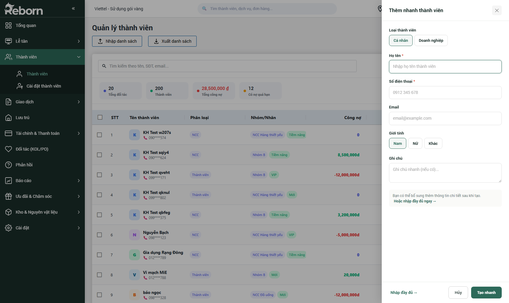

3. Ở đầu panel có hai tab:
   - **Cá nhân** (mặc định).
   - **Doanh nghiệp** — khi chọn, các trường sẽ đổi (Họ và tên → Tên công ty, không còn Giới tính, v.v.).

4. Điền các trường:

   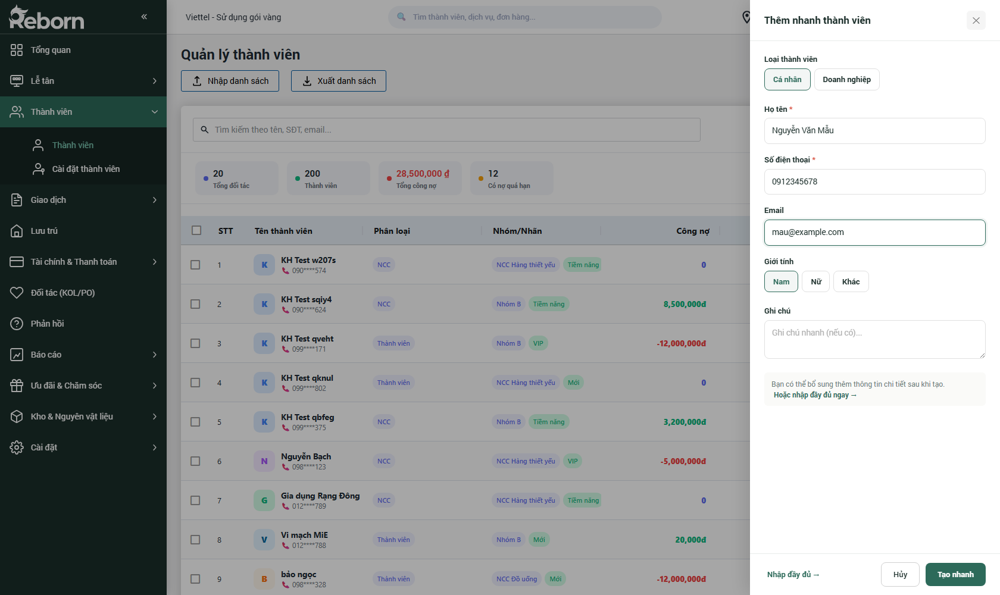

#### Quy định nhập liệu — Thêm nhanh thành viên (Cá nhân)

| Trường | Bắt buộc | Kiểu | Ràng buộc / Định dạng | Ghi chú |
|--------|:--------:|------|------------------------|---------|
| **Họ và tên** | ✓ | Text | Không trống; tự loại khoảng trắng đầu/cuối | Ví dụ: *"Nguyễn Văn An"* |
| **Số điện thoại** | ✓ | Tel | Phải khớp 1 trong 4 định dạng: `0xxxxxxxxx` (10 số), `xxx-xxx-xxxx`, `(xxx) xxx-xxxx`, hoặc `+84xxxxxxxxx` | Sai format → báo đỏ *"Số điện thoại không đúng định dạng"* |
| **Email** | — | Email | Nếu có nhập, phải đúng format `name@domain.tld` | Sai format → *"Email không đúng định dạng"* |
| **Giới tính** | ✓ (ở form đầy đủ) / — (ở thêm nhanh) | Radio | Nam / Nữ / Khác | Mặc định: không chọn |
| **Ghi chú** | — | Textarea | Không giới hạn độ dài nghiêm ngặt; khuyến nghị < 500 ký tự | |

**Lỗi thường gặp (toast đỏ):**

- *"Vui lòng nhập tên thành viên"* — bỏ trống ô **Họ và tên**.
- *"Vui lòng nhập số điện thoại"* — bỏ trống ô **Số điện thoại**.
- *"Số điện thoại không đúng định dạng"* — sai regex PHONE_REGEX.
- *"Email không đúng định dạng"* — sai regex EMAIL_REGEX.
- *"Số điện thoại đã tồn tại"* — trùng với khách khác trong cùng cơ sở.

#### Quy định nhập liệu — Thêm nhanh (Doanh nghiệp)

| Trường | Bắt buộc | Ghi chú |
|--------|:--------:|---------|
| **Tên công ty** | ✓ | Thay cho "Họ và tên" |
| **Số điện thoại** | ✓ | Có thể là SĐT người đại diện |
| **Email** | — | Email liên hệ |
| **Ghi chú** | — | |

> **Không hiện Giới tính** khi chọn Doanh nghiệp.

5. Bấm nút ở cuối panel:
   - **Hủy** — đóng, không lưu.
   - **Nhập đầy đủ →** — đóng panel và chuyển sang trang **Chi tiết thành viên** đầy đủ với 80+ trường (xem [A.5](#a5-xem--chỉnh-sửa-chi-tiết)).
   - **Tạo nhanh** — lưu ngay, đóng panel, khách xuất hiện ở đầu danh sách.

### A.5. Xem & chỉnh sửa chi tiết

**Khi nào:** Cần xem đầy đủ thông tin một khách, bao gồm lịch sử mua hàng, lịch sử check-in, điểm tích lũy, công nợ, ghi chú chăm sóc…

**Các bước:**

1. Trong danh sách, bấm vào **Họ và tên** (hoặc icon **Xem** / **Chỉnh sửa** ở cuối dòng).
2. Trình duyệt điều hướng sang trang **Chi tiết thành viên** (`/crm/detail_person/customerId/<id>/purchase_invoice`).

   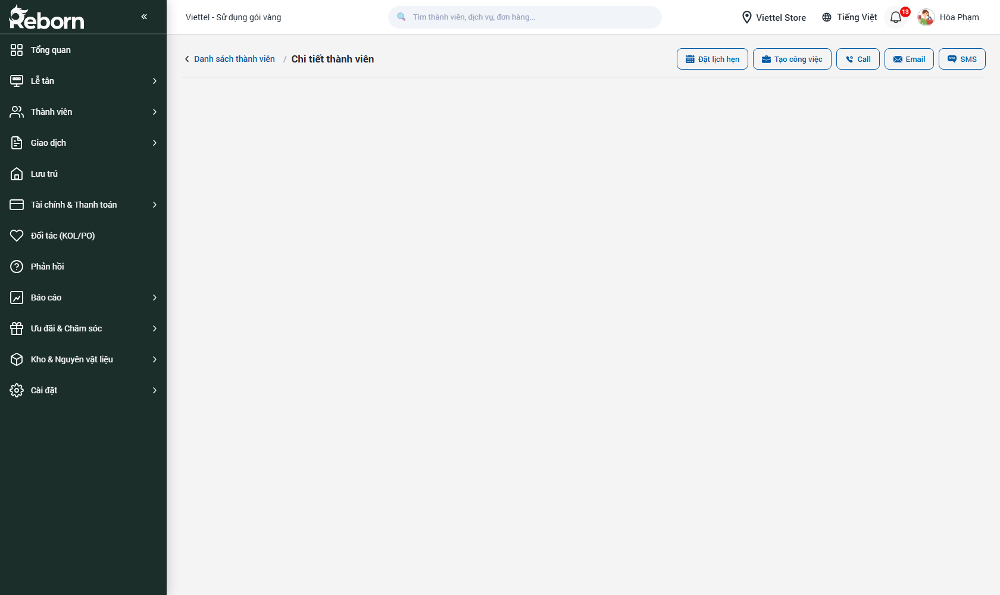

3. Thanh tiêu đề của trang có:
   - **Breadcrumb**: *Danh sách thành viên › Chi tiết thành viên*.
   - **5 nút hành động nhanh** (góc phải):
     - 📅 **Đặt lịch hẹn** — tạo booking cho khách này.
     - ✅ **Tạo công việc** — giao công việc chăm sóc.
     - 📞 **Call** — gọi qua tổng đài ảo (nếu đã tích hợp Viettel/VoIP).
     - ✉️ **Email** — soạn email gửi khách.
     - 💬 **SMS** — gửi SMS (nếu đã tích hợp).

4. Trang chia thành nhiều **tab nội dung** (phụ thuộc cấu hình, thường có):
   - **Hóa đơn mua** — danh sách đơn khách đã mua.
   - **Thẻ dịch vụ** — các thẻ/gói đang có hiệu lực.
   - **Lịch hẹn** — các booking tương lai.
   - **Công việc chăm sóc** — task đã/đang làm cho khách.
   - **Lịch sử giao tiếp** — call log, email, SMS, chat.
   - **Ghi chú** — note riêng về khách.

5. **Cột trái** (thường là 30% chiều ngang) là **Thông tin thành viên** — gồm:

#### Các trường ở hồ sơ chi tiết thành viên

| Nhóm | Trường | Bắt buộc | Kiểu | Ghi chú |
|------|--------|:--------:|------|---------|
| **Phân loại** | Khách hàng (Cá nhân/Doanh nghiệp) | ✓ | Radio | Không đổi được sau khi đã tạo |
| | Loại thành viên (Nội bộ/Ngoài) | — | Radio | |
| **Thông tin cơ bản** | Chi nhánh | ✓ | Select | Chỉ admin mới đổi được |
| | Tên thành viên | ✓ | Text | |
| | Mã thành viên | — | Text | Có thể tự sinh theo cấu hình mã |
| | Số điện thoại | ✓ | Text + regex | Có icon con mắt để ẩn/hiện (quyền xem chi tiết) |
| | Email | — | Text + regex | Cũng có icon ẩn/hiện |
| | Giới tính | ✓ | Radio | Nam/Nữ |
| | Ngày sinh | — | Date | Chọn từ lịch |
| | Địa chỉ | — | Text | Một dòng |
| | Chiều cao (cm) | — | Number | Dành cho spa/fitness |
| | Cân nặng (kg) | — | Number | Dành cho spa/fitness |
| **Thông tin bổ sung** | Điện thoại người giới thiệu | — | Text + regex | |
| | Nguồn thành viên | — | Select | Danh mục ở [B.2](#b2-danh-sách-nguồn-thành-viên) |
| | Nghề nghiệp | — | Multi-select | Danh mục ở [B.4](#b4-danh-sách-ngành-nghề) |
| | Nhóm thành viên | — | Select | Danh mục ở [B.3](#b3-danh-sách-nhóm-thành-viên) |
| | Người phụ trách | — | Select | Chọn từ danh sách nhân viên |
| | Tình trạng cuộc gọi đầu tiên | — | Text | Ghi chú telesale |
| | Thành viên liên quan | — | Multi-select | Gán các khách có liên quan (gia đình, công ty...) |
| **Trường tùy chỉnh** | *(thay đổi theo cấu hình)* | Tùy cấu hình | Tùy kiểu | Các trường bạn tự tạo ở [B.6](#b6-định-nghĩa-trường-thông-tin-bổ-sung) |

#### Quy tắc validation chi tiết

1. **Họ tên** — bắt buộc, trim space. Nếu trống báo *"Vui lòng nhập tên thành viên"*.
2. **Số điện thoại** — phải khớp pattern `PHONE_REGEX` (10 số VN, hoặc các biến thể có dấu cách/ngoặc, hoặc quốc tế `+84...`). Lỗi hiện ngay dưới ô input.
3. **Email** — không bắt buộc, nhưng nếu nhập phải khớp `EMAIL_REGEX` (RFC 5322 cơ bản).
4. **Điện thoại người giới thiệu** — cùng regex như số điện thoại chính.
5. **Giới tính** — bắt buộc chọn khi tạo mới.
6. **Trường tùy chỉnh bắt buộc** — nếu ở [B.6](#b6-định-nghĩa-trường-thông-tin-bổ-sung) bạn đã cài một trường là "Bắt buộc", khi tạo/sửa khách sẽ được kiểm tra. Nếu bỏ trống, báo *"Các trường thông tin bổ sung bắt buộc không được để trống"*.
7. **Trường text mở rộng** — có giới hạn độ dài phía backend (thường 459 ký tự với textarea tùy chỉnh).

6. **Hành động** ở cuối form:
   - **Hủy** — quay về danh sách. Nếu có thay đổi chưa lưu, hệ thống hỏi xác nhận *"Bạn có chắc muốn hủy các thay đổi?"*.
   - **Cập nhật** / **Tạo mới** — lưu vào hệ thống.

### A.6. Nhập danh sách (Import)

**Khi nào:** Bạn chuyển dữ liệu từ Excel cũ (sau khi chuyển hệ thống) sang CRM, hoặc nhập lô khách từ form đăng ký.

**Các bước:**

1. Trên thanh tiêu đề, bấm **Nhập danh sách**.
2. Modal **Nhập khách hàng** mở:
   - **Tải mẫu Excel** — file `.xlsx` mẫu với các cột yêu cầu.
   - **Chọn file** — upload file đã điền.
   - **Xem trước** — bảng hiển thị 10 dòng đầu để bạn kiểm tra mapping cột đúng chưa.
   - **Tùy chọn**:
     - ☐ **Bỏ qua dòng trùng** — dòng có SĐT trùng khách cũ thì không ghi đè.
     - ☐ **Ghi đè** — cho phép cập nhật khách đã tồn tại.
3. Bấm **Nhập**. Hệ thống chạy nền, hiển thị tiến độ `X/Y`. Kết thúc hiện báo cáo:
   - ✅ Thành công: n khách
   - ⚠️ Bỏ qua: n dòng (lý do: trùng SĐT / thiếu tên / sai SĐT)
   - ❌ Lỗi: n dòng (kèm dòng số và lý do)
4. Bấm **Tải kết quả** để tải file Excel chi tiết các dòng lỗi.

> **Lưu ý:** Các trường bắt buộc trong file Excel: **Họ tên**, **Số điện thoại**, **Giới tính**. Các trường khác là tùy chọn. Với trường dropdown (Nhóm, Nguồn, Nghề nghiệp), bạn điền **tên chính xác** — hệ thống tự match.

### A.7. Xuất danh sách (Export)

**Khi nào:** Cần báo cáo cho sếp, hoặc gửi danh sách cho đối tác marketing (sau khi che số nhạy cảm).

**Các bước:**

1. **Lọc** trước ở danh sách (nếu bạn chỉ muốn xuất một tập con) — xem [A.2](#a2-tìm-kiếm-nhanh) và [A.3](#a3-lọc-nâng-cao).
2. Bấm **Xuất danh sách** trên thanh tiêu đề.
3. Modal **Xuất khách hàng** hiện với các tùy chọn:
   - **Phạm vi**: Tất cả / Theo bộ lọc hiện tại / Đã chọn ở bảng.
   - **Cột xuất**: tick các cột muốn có trong file.
   - **Định dạng**: `.xlsx` (Excel) / `.csv`.
4. Bấm **Xuất**. Hệ thống tạo file và trigger tải về.
5. Toast *"Xuất file thành công"* khi xong.

---

## B. Cài đặt thành viên

**Đường dẫn:** Sidebar → **Thành viên** → **Cài đặt thành viên**
**URL:** `/crm/setting_customer`

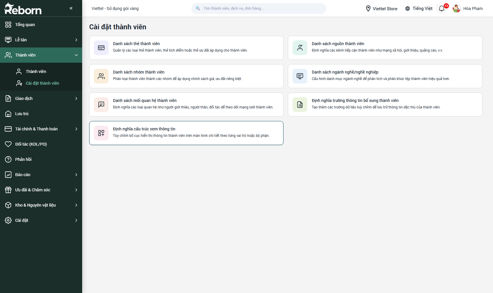

Màn hình là một **lưới 7 ô** (mỗi ô là một danh mục/tab). Bấm vào ô để vào màn hình quản lý của danh mục đó.

| Ô | Màu nền | Mô tả |
|---|---------|-------|
| 1. Danh sách thẻ thành viên | Tím nhạt | Các loại thẻ/hạng thành viên (Diamond, Gold, Silver...) |
| 2. Danh sách nguồn thành viên | Xanh lá | Kênh khách biết đến bạn (FB, Zalo, giới thiệu…) |
| 3. Danh sách nhóm thành viên | Vàng | Phân loại theo chính sách giá/ưu đãi |
| 4. Danh sách ngành nghề/nghề nghiệp | Xanh biển | Phân khúc theo nghề của khách |
| 5. Danh sách mối quan hệ | Cam | Loại quan hệ (người thân, đồng nghiệp…) |
| 6. Định nghĩa trường thông tin bổ sung | Xanh lá nhạt | **Quan trọng** — thêm trường tùy chỉnh cho form thành viên |
| 7. Định nghĩa cấu trúc xem thông tin | Hồng | Sắp xếp layout màn chi tiết thành viên |

### B.1. Danh sách thẻ thành viên

**Mục đích:** Định nghĩa **các hạng thẻ thành viên** của cửa hàng bạn.

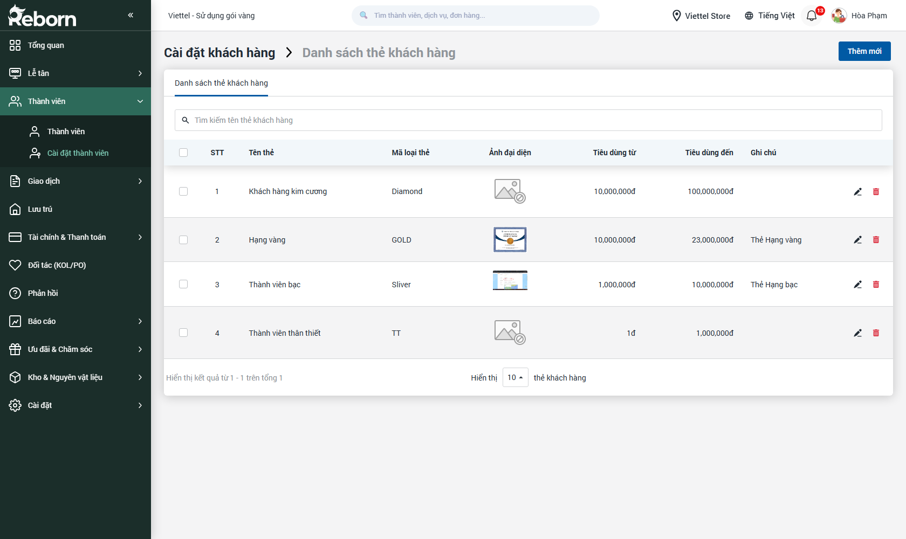

**Các cột trong bảng:**

| Cột | Ghi chú |
|-----|---------|
| STT | Số thứ tự |
| Tên thẻ | Vd: *"Hạng khách hàng cường"*, *"Thành viên vip"* |
| Mã loại thẻ | Vd: *"Diamond"*, *"Gold"*, *"Silver"* |
| Ảnh thẻ | Ảnh đại diện thẻ |
| Tiêu chuẩn từ | Mốc tiền tối thiểu để lên hạng |
| Tiêu chuẩn đến | Mốc trần của hạng này |
| Mô tả | Ngắn gọn |

**Thao tác:**
- **Thêm thẻ** (nút góc trên phải) → modal form với các trường: Tên thẻ, Mã, Ảnh upload, Tiêu chuẩn từ/đến, Tỷ lệ tích điểm, Mô tả.
- **Sửa** (icon bút) → mở modal như thêm mới.
- **Xóa** (icon thùng rác) → xác nhận. Nếu thẻ đang có khách sử dụng, hệ thống từ chối xóa.

### B.2. Danh sách nguồn thành viên

**Mục đích:** Khi tạo khách, bạn chọn "nguồn" để biết khách đến từ đâu. Báo cáo marketing dựa vào trường này.

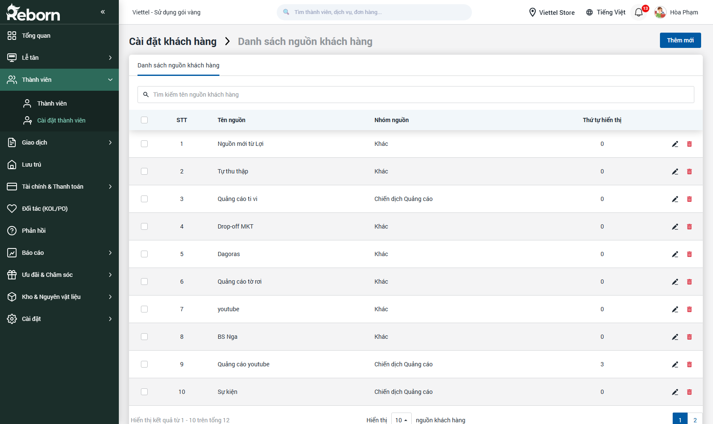

**Các cột:** STT | Tên nguồn | Nhóm nguồn | Thứ tự hiển thị.

**Ví dụ nguồn đã có sẵn:** *Tư vấn*, *Facebook*, *Zalo*, *Quảng cáo*, *Giới thiệu*, *YouTube*, *TikTok*, *Google*, *Báo chí*, *Sagawa*.

**Thao tác:**
- **Thêm mới** → form: Tên nguồn (bắt buộc, text), Nhóm nguồn (select: Online/Offline/Giới thiệu/Khác), Thứ tự hiển thị (số).
- Sửa / Xóa (tương tự B.1).

### B.3. Danh sách nhóm thành viên

**Mục đích:** Phân loại khách vào các **nhóm** để áp dụng chính sách giá/ưu đãi riêng.

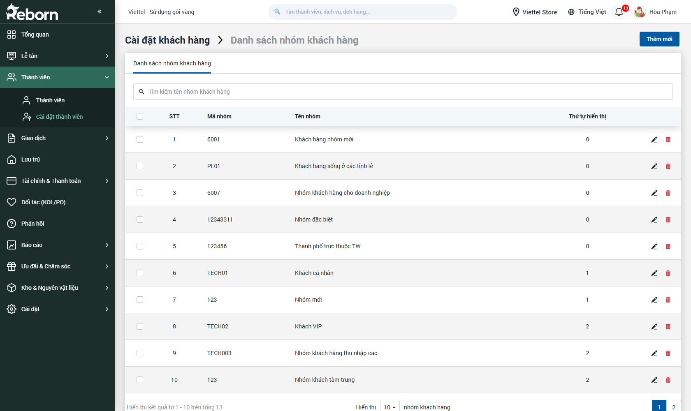

Ví dụ: *"Khách VIP"*, *"Khách mới"*, *"Khách trung thành"*, *"Khách doanh nghiệp"*.

**Form thêm/sửa:**
- **Tên nhóm** ✓ — bắt buộc, text ≤ 100 ký tự.
- **Mô tả** — textarea.
- **Màu nhãn** — color picker (hiển thị dạng badge trong danh sách thành viên).
- **Chính sách giá** — link sang cấu hình giá gắn với nhóm (xem Part 11).

### B.4. Danh sách ngành nghề/nghề nghiệp

**Mục đích:** Phân khúc khách theo nghề để làm marketing nhắm đúng đối tượng.

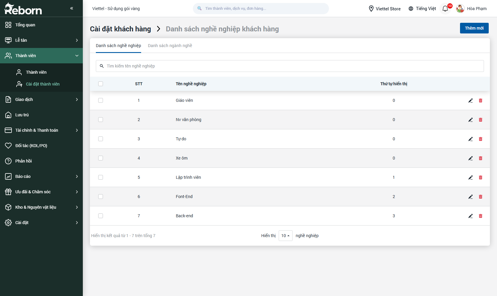

**Thao tác:** Thêm / Sửa / Xóa với các trường: Tên ngành nghề (text bắt buộc), Phân nhóm, Thứ tự hiển thị.

### B.5. Danh sách mối quan hệ

**Mục đích:** Định nghĩa loại quan hệ giữa các khách (người giới thiệu, người thân, đối tác…) để tạo mạng lưới.

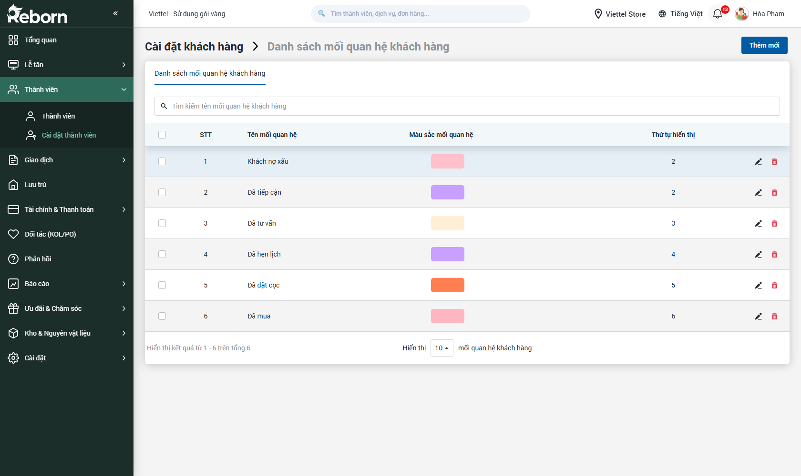

Ví dụ: *"Vợ / chồng"*, *"Anh chị em"*, *"Đồng nghiệp"*, *"Người giới thiệu"*.

Khi tạo/sửa khách, trường **Thành viên liên quan** sẽ cho chọn nhiều khách + kèm loại quan hệ từ danh mục này.

### B.6. Định nghĩa trường thông tin bổ sung

**Mục đích (quan trọng nhất):** Mở rộng form thành viên với **trường tùy chỉnh** đặc thù ngành nghề của bạn. Ví dụ:

- Spa: *Loại da*, *Tình trạng tóc*, *Dị ứng*.
- Gym: *Mục tiêu tập*, *Bệnh lý cần lưu ý*, *PT đang tập*.
- Co-working: *Công ty*, *Vai trò*, *Kích thước team*.

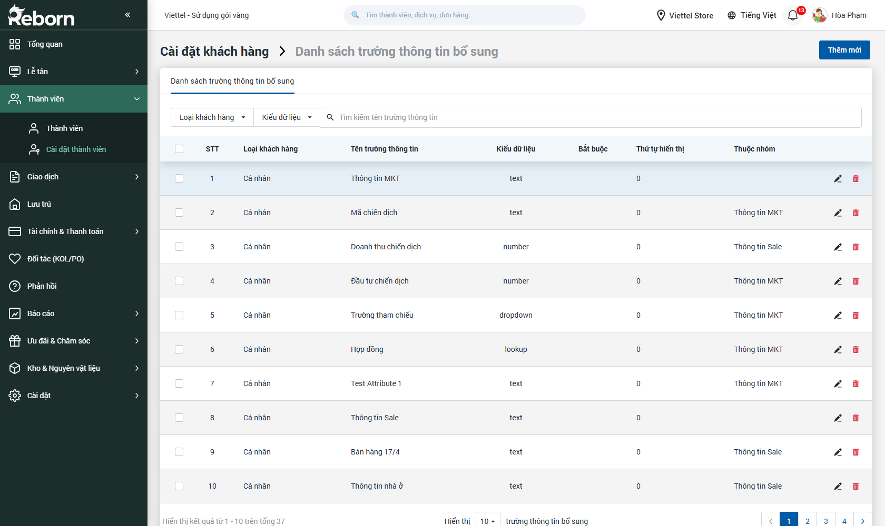

**Các bước thêm một trường:**

1. Bấm **Thêm trường**.
2. Điền form:

#### Quy định nhập liệu — Định nghĩa trường bổ sung

| Trường | Bắt buộc | Kiểu | Ghi chú |
|--------|:--------:|------|---------|
| **Tên hiển thị** | ✓ | Text | Nhãn mà người nhập sẽ thấy (vd *"Loại da"*) |
| **Mã field** | ✓ | Text slug | Tự sinh từ tên hiển thị, dạng `loai_da`. Không đổi được sau khi lưu |
| **Loại dữ liệu** | ✓ | Select | Text / Number / Date / Select (dropdown) / Multi-select / Radio / Checkbox / Textarea / File upload |
| **Bắt buộc?** | — | Toggle | Nếu bật, form thêm/sửa khách yêu cầu điền |
| **Giá trị mặc định** | — | Tùy kiểu | Áp dụng khi tạo mới |
| **Ràng buộc độ dài (text)** | — | Number | `maxLength` cho input |
| **Giới hạn dạng textarea** | — | Number | Backend mặc định giới hạn 459 ký tự |
| **Danh sách option (với Select/Multi-select/Radio)** | ✓ khi dùng | Text[] | Mỗi dòng một option |
| **Nhóm hiển thị** | — | Select | Gán vào nhóm (ví dụ *"Thông tin sức khỏe"*) |
| **Thứ tự hiển thị** | — | Number | Số nhỏ hiện trước |

3. Bấm **Lưu**. Trường mới tự động xuất hiện trong form **Thêm/Sửa thành viên** ở khu vực **Thông tin bổ sung**.

> **Lưu ý quan trọng:**
> - **Mã field không đổi được** sau khi đã tạo, vì backend dùng để lưu dữ liệu. Đặt tên cẩn thận.
> - **Xóa một trường sẽ xóa tất cả dữ liệu** đã nhập ở trường đó trên mọi khách. Hệ thống cảnh báo trước.
> - Nếu đổi **Bắt buộc** từ `Tắt` sang `Bật`, các khách đã có dữ liệu trống sẽ bị "gãy" — không edit được nếu không điền trường này.

### B.7. Định nghĩa cấu trúc xem thông tin

**Mục đích:** Sắp xếp **layout hiển thị** trên màn Chi tiết thành viên theo **vai trò** người dùng. Ví dụ nhân viên bán hàng chỉ thấy tên + SĐT + điểm tích, còn quản lý thấy đầy đủ cả địa chỉ + nguồn + người phụ trách.

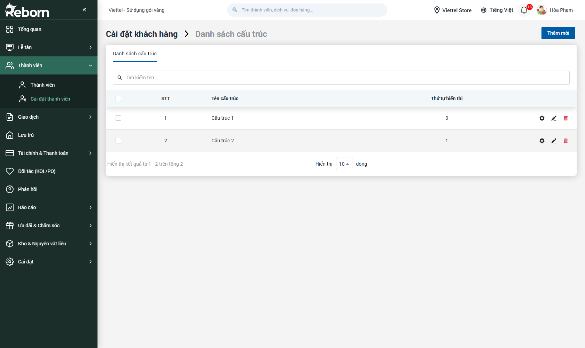

**Thao tác cơ bản:**

1. Chọn **Vai trò** cần cấu hình (dropdown).
2. Danh sách trường hiện ra với toggle **Hiển thị / Ẩn** và ô **Thứ tự**.
3. Kéo thả để sắp xếp.
4. Bấm **Lưu cấu trúc**.

> Phần này là dành cho **admin tenant**, không phải nhân viên thường dùng hằng ngày.

---

## C. Luồng công việc thường gặp

### C.1. "Khách mới đến lần đầu"

1. Nhân viên lễ tân dùng **Bán hàng tại quầy** (Part 02) → bấm **+ Thêm mới thành viên** trong modal chọn khách → điền 3 trường (Tên, SĐT, Giới tính) → bấm **Tạo nhanh** → gắn vào đơn → bán hàng bình thường.
2. Sau khi khách rời, nếu cần bổ sung thông tin (nguồn, nghề nghiệp, ghi chú) → vào **Thành viên → Thành viên**, tìm khách, mở Chi tiết → điền tiếp.

### C.2. "Sếp bảo gửi danh sách khách VIP cho marketing"

1. Vào **Thành viên → Thành viên**.
2. Lọc bằng badge **⭐ VIP**.
3. Bấm **Xuất danh sách** → tick các cột cần (Họ tên, SĐT, Email, Nhóm) → Xuất `.xlsx`.
4. Gửi file cho marketing.

### C.3. "Chuyển dữ liệu từ Excel cũ sang"

1. Vào **Thành viên → Cài đặt thành viên → Định nghĩa trường bổ sung**.
2. Tạo các trường tùy chỉnh khớp với cột Excel của bạn.
3. Tải file Excel mẫu từ **Nhập danh sách** → copy dữ liệu cũ vào đúng format.
4. Upload → kiểm tra báo cáo → sửa các dòng lỗi → re-upload nếu cần.

### C.4. "Thiết lập các hạng thẻ đầu tiên"

1. Vào **Cài đặt thành viên → Danh sách thẻ thành viên**.
2. Thêm các hạng: *Basic* (từ 0đ), *Silver* (từ 2tr), *Gold* (từ 10tr), *Diamond* (từ 50tr).
3. Cài tỷ lệ tích điểm và ảnh cho từng hạng.
4. Khách mua sẽ tự lên hạng dựa vào tổng chi tiêu (xem thêm Part 09 — Ưu đãi & Chăm sóc).

---

## D. Lỗi thường gặp & cách xử lý

| Lỗi | Nguyên nhân | Cách xử lý |
|-----|-------------|------------|
| *"Số điện thoại đã tồn tại"* khi thêm mới | SĐT trùng với khách cũ trong cùng cơ sở | Tìm khách cũ bằng SĐT trong danh sách → chọn thay vì tạo mới |
| *"Bạn không có quyền xem số điện thoại !"* khi bấm icon con mắt | Vai trò của bạn không được cấp quyền `customer.viewPhone` | Liên hệ quản lý để cấp quyền (xem Part 12) |
| Không thấy nút **Thêm nhanh** ở danh sách | Vai trò không có quyền `CUSTOMER` | Liên hệ admin |
| Import Excel báo *"Nhiều dòng lỗi"* | Sai format SĐT, thiếu tên, hoặc ngày sinh sai định dạng | Tải file kết quả → xem cột *"Lý do lỗi"* → sửa lại → upload lại |
| Trường tùy chỉnh đã tạo nhưng không thấy trên form | Trường chưa được gán nhóm hiển thị, hoặc thuộc vai trò không được bật | Kiểm tra ở [B.7](#b7-định-nghĩa-cấu-trúc-xem-thông-tin) |

---

## Tiếp theo

- **Part 04 — Giao dịch**: từ khách hàng → đi xem lịch sử giao dịch của họ. Chi tiết xử lý đơn, hóa đơn VAT, trả hàng.
- **Part 06 — Tài chính**: quản lý công nợ của khách (đã nhắc ở Part 02 và Part 03 — công nợ).
- **Part 09 — Ưu đãi & Chăm sóc**: áp dụng chính sách điểm tích lũy, voucher, chiến dịch gửi tin nhắn cho một nhóm khách.

---

*Hết Part 03.*

---

# Part 04 — Giao dịch

*Phiên bản: Cửa hàng & Spa — Tenant "Viettel Store"*

**Giao dịch** là nơi bạn tra cứu, quản lý **các đơn hàng / hóa đơn đã tạo**. Khác với Part 02 (bán hàng — tạo đơn mới), phần này tập trung vào **xem lại và xử lý** đơn đã có: tra cứu, trả hàng, đổi hàng, xuất hóa đơn VAT, theo dõi trạng thái giao hàng.

Sidebar có **2 mục con**:

| Mục | URL | Dùng để |
|-----|-----|---------|
| **Danh sách đơn** | `/crm/sale_invoice` | Tra cứu toàn bộ hóa đơn bán hàng đã tạo |
| **Hóa đơn VAT** | `/crm/invoiceVAT` | Phát hành / tra cứu hóa đơn điện tử có VAT |

Các màn hình liên quan mà bạn có thể đi tới từ đây:

- **Theo dõi vận chuyển** (`/order_tracking`) — nếu có bán hàng kèm giao hàng.
- **Trả hàng** (`/return_invoice`) — xử lý khi khách trả lại sản phẩm.

---

## Mục lục

- [A. Danh sách đơn](#a-danh-sách-đơn)
- [B. Hóa đơn VAT](#b-hóa-đơn-vat)
- [C. Theo dõi vận chuyển](#c-theo-dõi-vận-chuyển)
- [D. Trả hàng / Hoàn đơn](#d-trả-hàng--hoàn-đơn)
- [E. Luồng công việc thường gặp](#e-luồng-công-việc-thường-gặp)

---

## A. Danh sách đơn

**Đường dẫn:** Sidebar → **Giao dịch** → **Danh sách đơn**
**URL:** `/crm/sale_invoice`

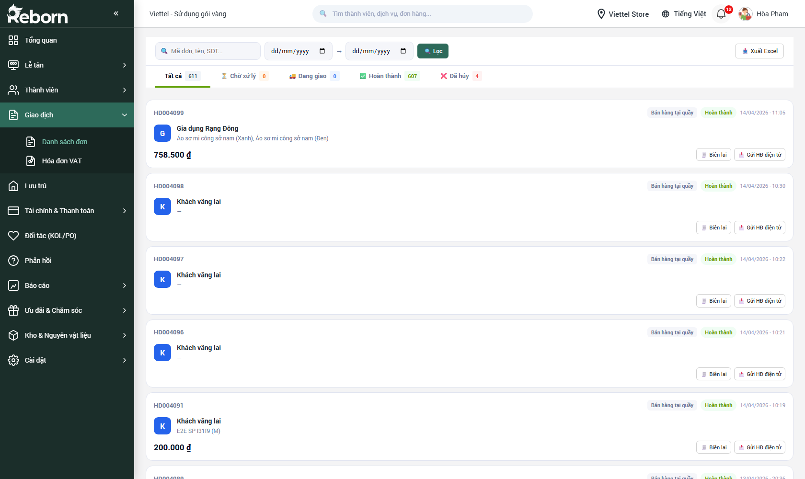

### A.1. Tổng quan giao diện

Màn hình gồm:

| Khu vực | Chức năng |
|---------|-----------|
| **Bộ lọc thời gian** | 2 ô: Từ ngày / Đến ngày. Mặc định hôm nay. Bấm biểu tượng 📅 để mở lịch |
| **Nút Lọc** | Áp dụng bộ lọc thời gian |
| **Thanh tab trạng thái** | **Tất cả** / **Chờ xử lý** / **Đang giao** / **Hoàn thành** / **Đã hủy** |
| **Nút Audit Excel** | Xuất báo cáo kiểm toán đơn hàng |
| **Danh sách đơn** (bên trái) | Card mỗi đơn với mã, tên khách, tổng tiền, trạng thái |
| **Panel chi tiết** (bên phải) | Khi click 1 đơn, panel hiện: sản phẩm, số lượng, đơn giá, thanh toán, lịch sử |

### A.2. Tra cứu một đơn cụ thể

**Các bước:**

1. Chọn **khoảng thời gian** (Từ ngày → Đến ngày).
2. Bấm **Lọc**.
3. Trên danh sách card, cuộn tìm hoặc dùng **ô tìm kiếm** ở đầu (gõ mã đơn / tên khách / SĐT).
4. Bấm vào card để mở **panel chi tiết** bên phải.

Panel chi tiết hiển thị:

- **Mã đơn** (vd `H0000001`), **Ngày giờ tạo**, **Nhân viên tạo**, **Ca**.
- **Thông tin khách hàng**: tên, SĐT, địa chỉ.
- **Danh sách sản phẩm**: từng dòng hiển thị Tên — Số lượng — Đơn giá — Thành tiền.
- **Tổng tiền hàng** — **Giảm giá** — **VAT** — **TỔNG THANH TOÁN**.
- **Lịch sử thanh toán**: các lần thu tiền (vd *"Cash — 500,000đ — 09:32 hôm nay"*, *"Chuyển khoản — 258,000đ — 09:32 hôm nay"*).
- **Trạng thái**: Chờ xác nhận / Đã thanh toán / Còn nợ / Đã hủy.

### A.3. Xử lý nhanh trên một đơn

Ở panel chi tiết hoặc menu 3-chấm của card, bạn có các hành động:

- **In hóa đơn** — mở preview để in ra giấy.
- **Gửi SMS/Email** — gửi hóa đơn điện tử cho khách.
- **Thanh toán còn nợ** — nếu đơn còn công nợ, bấm để thu tiếp.
- **Trả hàng / Hoàn đơn** — mở form hoàn đơn (xem [D](#d-trả-hàng--hoàn-đơn)).
- **Xuất hóa đơn VAT** — chuyển đơn này thành hóa đơn VAT điện tử (xem [B](#b-hóa-đơn-vat)).
- **Hủy đơn** — chỉ cho phép khi đơn chưa thanh toán.

### A.4. Quy định nhập liệu — Bộ lọc

| Trường | Kiểu | Ràng buộc |
|--------|------|-----------|
| **Từ ngày** | Date | Phải ≤ Đến ngày |
| **Đến ngày** | Date | Tối đa 365 ngày so với Từ ngày |
| **Tìm kiếm** | Text | Không giới hạn; match theo mã, tên khách, SĐT |

---

## B. Hóa đơn VAT

**Đường dẫn:** Sidebar → **Giao dịch** → **Hóa đơn VAT**
**URL:** `/crm/invoiceVAT`

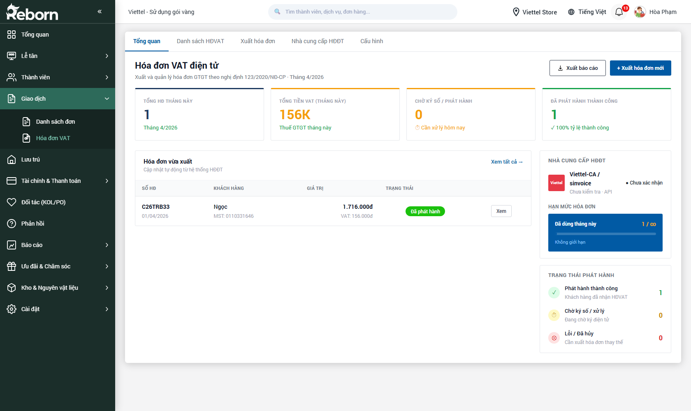

### B.1. Mục đích

Phát hành **hóa đơn điện tử có VAT** theo quy định của Tổng cục Thuế. Chỉ dùng khi:

- Khách yêu cầu hóa đơn đỏ / hóa đơn VAT.
- Đơn vị bạn đã **đăng ký chữ ký số** và **kết nối** với nhà cung cấp hóa đơn điện tử (Viettel, VNPT, Misa, v.v. — cài trong Part 12).

### B.2. Các bước phát hành hóa đơn VAT

1. Vào **Giao dịch → Hóa đơn VAT**.
2. Bấm **+ Tạo hóa đơn VAT**.
3. Chọn nguồn:
   - **Từ đơn bán hàng** — chọn đơn đã có, hệ thống copy thông tin.
   - **Nhập thủ công** — tự nhập danh sách hàng.
4. Điền **Thông tin người mua** (tất cả dùng cho hóa đơn VAT):

#### Quy định nhập liệu — Thông tin người mua hóa đơn VAT

| Trường | Bắt buộc | Định dạng | Ghi chú |
|--------|:--------:|-----------|---------|
| **Tên người mua / công ty** | ✓ | Text | Khách doanh nghiệp điền tên công ty đầy đủ |
| **Mã số thuế (MST)** | ✓ cho doanh nghiệp | Số, 10 hoặc 13 chữ số | Hệ thống có thể auto fetch tên từ MST |
| **Địa chỉ người mua** | ✓ | Text ≤ 255 ký tự | Phải khớp địa chỉ đăng ký kinh doanh |
| **Email nhận hóa đơn** | ✓ | Email | Bắt buộc để gửi hóa đơn điện tử |
| **Hình thức thanh toán** | ✓ | Select | Tiền mặt / Chuyển khoản / Thẻ / TM+CK |

5. Kiểm tra **bảng hàng hóa** — số lượng, đơn giá, thành tiền, % thuế suất (0% / 5% / 8% / 10%).
6. Bấm **Xác nhận phát hành** → hệ thống ký số + gửi lên cơ quan thuế → trả về **mã tra cứu**.
7. Hệ thống gửi hóa đơn qua email tự động.

### B.3. Lỗi thường gặp khi phát hành VAT

| Lỗi | Nguyên nhân | Xử lý |
|-----|-------------|-------|
| *"Chữ ký số không hợp lệ"* | Chữ ký đã hết hạn / chưa cài | Liên hệ đơn vị CA gia hạn, vào Part 12 → Tích hợp để update |
| *"MST không tồn tại"* | MST sai hoặc công ty đã đóng cửa | Xác minh với khách |
| *"Tổng tiền không khớp"* | Sau thuế không bằng tổng dòng | Kiểm tra lại bảng hàng + thuế suất |

---

## C. Theo dõi vận chuyển

**URL:** `/crm/order_tracking`

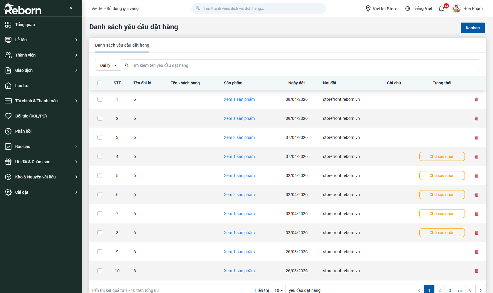

### C.1. Khi nào dùng

Khi cửa hàng bạn có kênh bán hàng **giao tận nơi**, không chỉ khách đến quầy. Ví dụ: gửi gói quà tặng sinh nhật, giao sản phẩm mua online.

### C.2. Các thông tin hiển thị

- **Mã đơn giao**, **Khách nhận**, **Địa chỉ**, **Số điện thoại**.
- **Đơn vị vận chuyển** (GHN, GHTK, J&T, Viettel Post, ShopeeExpress...).
- **Mã vận đơn** (tracking number).
- **Trạng thái**: Chờ lấy hàng / Đang giao / Giao thành công / Giao thất bại / Đã hoàn.
- **Ngày giao dự kiến**, **Ngày cập nhật gần nhất**.

### C.3. Tạo đơn giao

Thường được tạo **tự động** từ màn Bán hàng tại quầy khi khách chọn *"Giao tận nơi"*. Nếu cần tạo thủ công:

1. Bấm **+ Tạo đơn giao**.
2. Chọn đơn bán hàng gốc từ danh sách.
3. Điền địa chỉ giao (mặc định lấy từ hồ sơ khách).
4. Chọn đơn vị vận chuyển.
5. Bấm **Gửi sang đơn vị vận chuyển** — hệ thống tự push API tới đối tác, lấy về mã vận đơn.

---

## D. Trả hàng / Hoàn đơn

**URL:** `/crm/return_invoice`

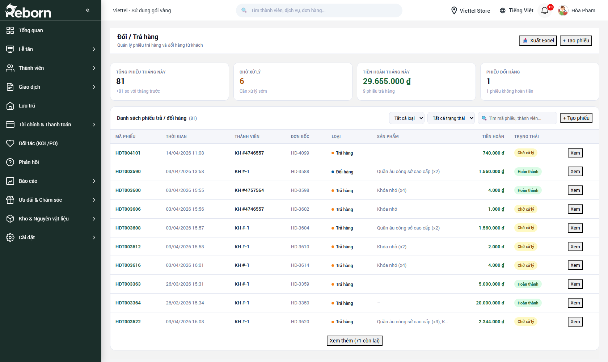

### D.1. Khi nào dùng

Khi khách:
- Trả lại sản phẩm (không vừa ý / lỗi).
- Đổi sang sản phẩm khác.
- Hủy dịch vụ chưa sử dụng.

### D.2. Các bước xử lý trả hàng

1. Vào **Danh sách đơn** ([A](#a-danh-sách-đơn)), tìm đơn gốc.
2. Trong panel chi tiết, bấm **Trả hàng / Hoàn đơn**.
3. Form **Trả hàng** hiện lên:
   - Bảng các sản phẩm trong đơn gốc.
   - Cột **Số lượng trả** — nhập số lượng (≤ số đã mua).
   - Cột **Lý do** — dropdown: *Không vừa ý / Lỗi sản phẩm / Đổi sang sản phẩm khác / Khác*.
4. Chọn **Cách hoàn tiền**:
   - **Tiền mặt** — trả ngay khỏi két (ca làm việc sẽ ghi nhận chi).
   - **Chuyển khoản** — nhập STK khách.
   - **Tín dụng cửa hàng** — cộng vào ví khách, trừ dần ở đơn sau.
5. Nếu là **đổi hàng**, tick *"Tạo đơn mới thay thế"* — hệ thống mở luôn màn Bán hàng tại quầy với danh sách sản phẩm mới.
6. Bấm **Xác nhận hoàn**.
7. Hệ thống ghi nhận phiếu hoàn với mã riêng (vd `RT00001`) và liên kết tới đơn gốc.

#### Quy định nhập liệu — Phiếu hoàn hàng

| Trường | Bắt buộc | Ràng buộc |
|--------|:--------:|-----------|
| **Số lượng trả** | ✓ | > 0 và ≤ số lượng đã mua |
| **Lý do** | ✓ | Chọn từ dropdown |
| **Ghi chú** | — | Text |
| **Cách hoàn tiền** | ✓ | Tiền mặt / Chuyển khoản / Tín dụng cửa hàng |
| **STK hoàn** | ✓ nếu chọn Chuyển khoản | Số STK + tên chủ TK |

> **Lưu ý:** Sau khi hoàn, đơn gốc sẽ hiển thị badge *"Đã trả một phần"* hoặc *"Đã trả toàn bộ"*. Sản phẩm được **cộng lại vào tồn kho** tự động (trừ khi là dịch vụ hoặc hoàn "không nhập kho").

---

## E. Luồng công việc thường gặp

### E.1. "Khách yêu cầu xuất lại hóa đơn mua hôm qua"

1. Vào **Danh sách đơn** → chọn ngày hôm qua → tìm theo tên khách.
2. Bấm vào đơn → panel chi tiết → nút **In hóa đơn**.
3. Chọn máy in → In.

### E.2. "Khách trả 1 sản phẩm trong đơn mua hôm qua"

1. Vào **Danh sách đơn** → tìm đơn gốc.
2. Bấm **Trả hàng / Hoàn đơn** → nhập số lượng trả = 1 cho sản phẩm đó → lý do → cách hoàn.
3. Xác nhận → tiền mặt được xuất khỏi két, sản phẩm được cộng lại vào kho.

### E.3. "Doanh nghiệp mua đợt lớn, cần hóa đơn VAT"

1. Bán hàng bình thường ở **Bán hàng tại quầy**.
2. Sau khi thanh toán, vào **Giao dịch → Hóa đơn VAT** → **+ Tạo hóa đơn VAT**.
3. Chọn **Từ đơn bán hàng** → chọn đơn vừa tạo.
4. Điền MST + địa chỉ + email của công ty khách.
5. **Xác nhận phát hành** → hóa đơn gửi vào email khách.

---

*Hết Part 04.*

---

# Part 05 — Lưu trú

*Phiên bản: Cửa hàng & Spa — Tenant "Viettel Store"*

Phân hệ **Lưu trú** chỉ áp dụng khi cửa hàng / cơ sở của bạn có loại hình dịch vụ **lưu trú qua đêm** như phòng riêng, phòng ngủ, căn hộ dịch vụ, homestay, co-living... Nếu cơ sở chỉ bán lẻ hoặc spa theo giờ, bạn có thể bỏ qua Part này.

**Đường dẫn:** Sidebar → **Lưu trú**
**URL:** `/crm/ch_accommodation`

---

## A. Tổng quan giao diện

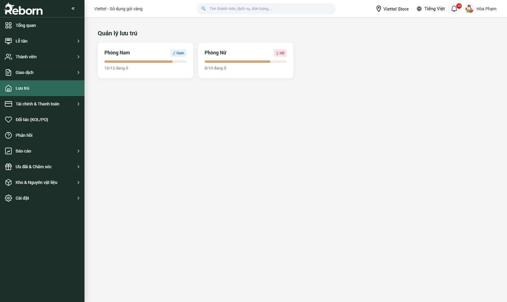

Màn hình thường chia thành:

| Khu vực | Chức năng |
|---------|-----------|
| **Lịch phòng (Room Calendar)** | Ma trận theo thời gian: trục ngang = ngày, trục dọc = từng phòng/căn hộ. Mỗi ô là một slot đặt |
| **Danh sách phòng** | Tên phòng, loại, giá/đêm, trạng thái (trống / có khách / đang dọn / bảo trì) |
| **Bộ lọc** | Theo loại phòng, tầng, trạng thái |
| **Nút hành động** | *+ Tạo đặt phòng mới*, *Check-in nhanh*, *Check-out* |

---

## B. Các loại thao tác chính

### B.1. Tạo đặt phòng (Booking)

**Các bước:**

1. Trên lịch phòng, bấm vào **ô trống** tại ngày + phòng muốn đặt. Hoặc bấm **+ Tạo đặt phòng mới**.
2. Modal **Đặt phòng** hiện lên với các trường:

#### Quy định nhập liệu — Đặt phòng

| Trường | Bắt buộc | Kiểu | Ràng buộc / Ghi chú |
|--------|:--------:|------|---------------------|
| **Khách hàng** | ✓ | Select tìm kiếm | Gõ SĐT/tên để tìm; có thể **+ Thêm mới** nếu khách chưa có |
| **Phòng** | ✓ | Select | Danh sách phòng còn trống trong khoảng thời gian |
| **Ngày nhận phòng (Check-in)** | ✓ | Date | Không được trong quá khứ |
| **Ngày trả phòng (Check-out)** | ✓ | Date | Phải > Check-in. Tối thiểu 1 đêm |
| **Số người lớn** | ✓ | Number | ≥ 1, ≤ sức chứa của phòng |
| **Số trẻ em** | — | Number | ≥ 0 |
| **Giá/đêm** | ✓ | Number (VNĐ) | Mặc định lấy từ cấu hình phòng, cho phép override |
| **Dịch vụ kèm** | — | Multi-select | Ăn sáng / Giặt ủi / Đưa đón… |
| **Ghi chú** | — | Textarea ≤ 500 ký tự | |
| **Trạng thái đặt** | ✓ | Select | Đã xác nhận / Chờ xác nhận / Tạm giữ |

3. Bấm **Lưu đặt phòng**. Hệ thống chặn slot đó trên lịch.
4. Thu **cọc** (nếu có) bằng cách chọn **+ Thu cọc** — mở modal nhập số tiền, phương thức.

### B.2. Check-in khách đến

**Khi nào:** Khách đến đúng ngày/giờ đã đặt hoặc walk-in.

**Các bước:**

1. Trên lịch phòng, bấm vào booking của khách → panel chi tiết bên phải.
2. Bấm nút **Check-in**.
3. Form check-in hiện:
   - Xác nhận thông tin khách.
   - Upload **CMND/CCCD/Hộ chiếu** (bắt buộc theo quy định lưu trú).
   - Nhập số phòng cụ thể (nếu chưa chọn trước).
   - Nhập **giờ nhận thực tế**.
4. Bấm **Xác nhận check-in**.
5. Trạng thái phòng chuyển từ *"Đã đặt"* → *"Có khách"*.

#### Quy định nhập liệu — Check-in

| Trường | Bắt buộc | Ghi chú |
|--------|:--------:|---------|
| **Ảnh CMND/CCCD** | ✓ | Upload ảnh, định dạng JPG/PNG, ≤ 5MB |
| **Giờ nhận phòng thực tế** | ✓ | Datetime, mặc định bằng giờ hiện tại |
| **Số phòng** | ✓ | Nếu loại phòng có nhiều room cụ thể |
| **Số khách check-in thực tế** | ✓ | Thường ≤ số người đăng ký |

### B.3. Check-out

**Các bước:**

1. Chọn booking đang "Có khách" → bấm **Check-out**.
2. Hệ thống tính:
   - Số đêm thực tế.
   - Tổng tiền phòng.
   - Dịch vụ phát sinh (ăn uống, minibar...).
   - Trừ cọc đã thu.
   - **Còn lại khách phải trả** / **Hoàn lại cho khách**.
3. Thu phần còn lại / hoàn cọc.
4. Bấm **Xác nhận check-out**.
5. Phòng chuyển sang *"Đang dọn"* (chờ nhân viên dọn xong mới về *"Trống"*).

---

## C. Cấu hình phòng & loại phòng

Cấu hình ban đầu (thường do admin làm một lần) nằm trong **Cài đặt → Vận hành cơ sở → Phòng** (xem Part 11).

Các thứ cần cài:

- **Loại phòng**: Tên (Phòng đơn / Phòng đôi / VIP / Suite), Sức chứa, Giá/đêm, Mô tả, Tiện nghi.
- **Danh sách phòng cụ thể**: Số phòng 101, 102, 201... gán vào loại phòng.
- **Giờ check-in / check-out chuẩn**: vd 14:00 / 12:00.
- **Phụ thu**: Giờ trễ, số khách vượt chuẩn, phụ thu cuối tuần.

---

## D. Báo cáo lưu trú

Liên quan tới **Báo cáo → Check-in** ở Part 08 — hiển thị:

- **Công suất phòng (Occupancy %)** theo ngày / tuần / tháng.
- **Doanh thu phòng** vs **Doanh thu dịch vụ kèm**.
- **ADR (Average Daily Rate)** — giá phòng trung bình.
- **RevPAR** — doanh thu trên mỗi phòng khả dụng.

---

## E. Lỗi thường gặp

| Lỗi | Nguyên nhân | Xử lý |
|-----|-------------|-------|
| *"Phòng đã được đặt trong khoảng thời gian này"* | Conflict với booking khác | Chọn phòng khác hoặc đổi ngày |
| *"Không tìm thấy loại phòng"* | Chưa cấu hình loại phòng | Vào **Cài đặt → Vận hành cơ sở** |
| Check-in báo *"Thiếu CMND"* | Chưa upload giấy tờ | Upload rồi bấm lại |
| Check-out tính tiền sai | Giá phụ thu / dịch vụ kèm chưa cập nhật | Kiểm tra panel chi tiết đặt phòng |

---

*Hết Part 05.*

---

# Part 06 — Tài chính & Thanh toán

*Phiên bản: Cửa hàng & Spa — Tenant "Viettel Store"*

**Tài chính & Thanh toán** là phân hệ theo dõi **dòng tiền** của cơ sở bạn: tiền đã thu (doanh thu), tiền đã chi (chi phí), tiền còn trong quỹ, công nợ với khách và nhà cung cấp, đối soát với các kênh thanh toán online.

Sidebar có **6 mục con** — mỗi mục là một góc nhìn khác của cùng một bức tranh:

| # | Mục | URL | Dùng để |
|---|-----|-----|---------|
| 1 | **Tổng quan tài chính** | `/crm/finance_management/dashboard` | Dashboard các chỉ số dòng tiền |
| 2 | **Sổ thu chi** | `/crm/finance_management/cashbook` | Ghi nhận từng giao dịch thu/chi |
| 3 | **Quản lý quỹ** | `/crm/finance_management/fund_management` | Các quỹ (tiền mặt, ngân hàng, ví điện tử) |
| 4 | **Quản lý khoản mục** | `/crm/finance_management/category_management` | Danh mục loại thu / chi |
| 5 | **Quản lý công nợ** | `/crm/finance_management/debt_management` | Công nợ khách hàng + nhà cung cấp |
| 6 | **Đối soát thanh toán** | `/crm/payment_control` | Đối soát với kênh thanh toán online |

---

## A. Tổng quan tài chính

**URL:** `/crm/finance_management/dashboard`

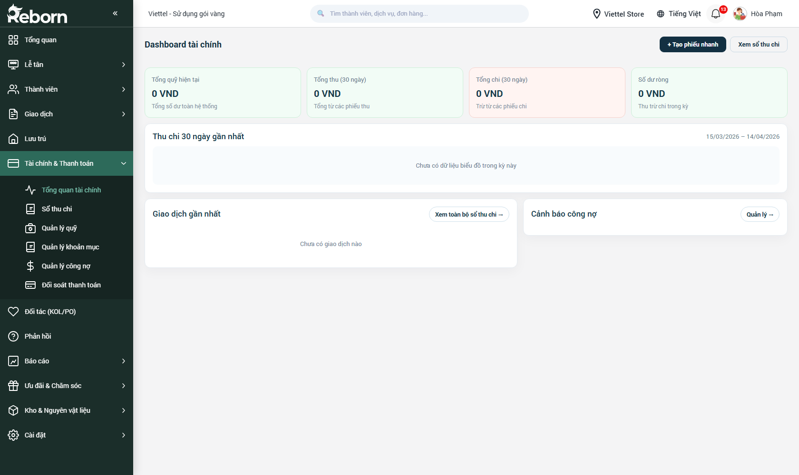

Màn hình hiển thị các chỉ số tổng hợp:

- **Tổng thu** (theo kỳ) — tổng tiền đã thu từ tất cả nguồn.
- **Tổng chi** — tổng tiền đã chi.
- **Chênh lệch thu – chi** — dương = lãi, âm = lỗ.
- **Dòng tiền theo ngày** — biểu đồ cột 30 ngày gần nhất.
- **Top khoản thu** — biểu đồ pie các khoản thu lớn nhất.
- **Top khoản chi** — tương tự cho chi.
- **Số dư các quỹ** — list các quỹ với số dư hiện tại.

**Bộ lọc kỳ:** *Hôm nay / Tuần này / Tháng này / Năm nay / Tùy chọn*.

---

## B. Sổ thu chi (Cashbook)

**URL:** `/crm/finance_management/cashbook`

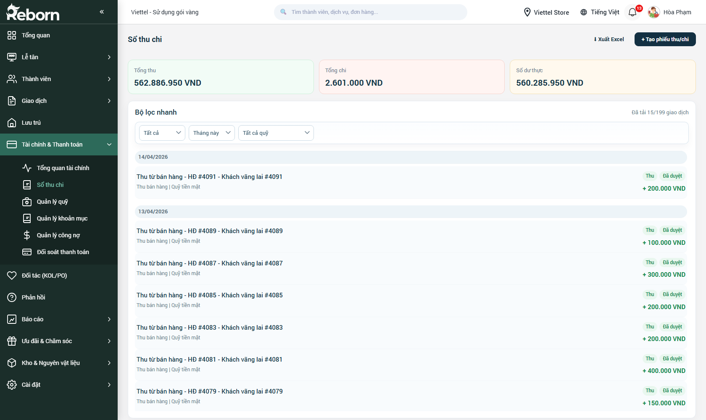

### B.1. Mục đích

Ghi nhận **từng giao dịch thu hoặc chi** — bao gồm cả tự động (từ bán hàng, trả hàng) và thủ công (lương, điện nước, nhập nguyên vật liệu ngoài hệ thống...).

### B.2. Các cột trong bảng

| Cột | Ghi chú |
|-----|---------|
| **Mã phiếu** | Tự sinh (vd `PT0000001` cho thu, `PC0000001` cho chi) |
| **Ngày giờ** | Thời điểm giao dịch |
| **Loại** | Thu / Chi |
| **Khoản mục** | Danh mục (xem [D](#d-quản-lý-khoản-mục-thu-chi)) |
| **Đối tượng** | Khách / NCC / Nhân viên / Khác |
| **Số tiền** | VNĐ |
| **Quỹ** | Tiền mặt / NH A / NH B / Ví MoMo... |
| **Mô tả** | Ghi chú |
| **Trạng thái** | Đã ghi / Chờ duyệt / Đã hủy |

### B.3. Tạo phiếu thu thủ công

**Các bước:**

1. Bấm **+ Tạo phiếu thu**.
2. Điền form:

#### Quy định nhập liệu — Phiếu thu / chi

| Trường | Bắt buộc | Kiểu | Ràng buộc |
|--------|:--------:|------|-----------|
| **Loại phiếu** | ✓ | Radio | Thu / Chi |
| **Ngày giao dịch** | ✓ | Date | Mặc định hôm nay |
| **Khoản mục** | ✓ | Select | Chọn từ danh mục (xem [D](#d-quản-lý-khoản-mục-thu-chi)) |
| **Quỹ** | ✓ | Select | Chọn từ danh sách quỹ (xem [C](#c-quản-lý-quỹ)) |
| **Đối tượng** | — | Select | Khách / NCC / Nhân viên — tùy khoản mục |
| **Số tiền** | ✓ | Number > 0 | Tối đa 14 chữ số (99.999.999.999.999 đ) |
| **Mô tả / lý do** | — | Textarea ≤ 500 ký tự | Nên điền để audit sau |
| **Chứng từ đính kèm** | — | File upload | Ảnh biên lai / PDF, ≤ 10 MB |

3. Bấm **Lưu phiếu**. Phiếu hiện trong sổ thu chi và **cập nhật số dư quỹ** tức thời.

### B.4. Hủy phiếu

- Chỉ cho phép hủy phiếu **trong ngày tạo**.
- Hủy sẽ đảo số dư quỹ và ghi thêm dòng *"Đã hủy"* vào log.
- Phiếu hủy **không bị xóa** khỏi sổ — vẫn hiện với badge ❌ Hủy.

---

## C. Quản lý quỹ

**URL:** `/crm/finance_management/fund_management`

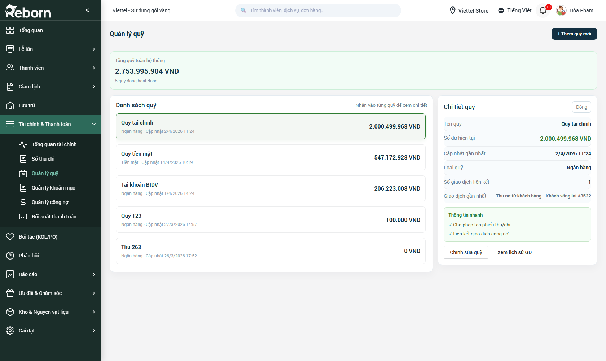

### C.1. Quỹ là gì?

**Quỹ** = một "ví" chứa tiền. Mỗi cơ sở thường có nhiều quỹ:
- **Tiền mặt tại két** (cash box)
- **Ngân hàng chính** — TK công ty
- **Ngân hàng phụ** — TK ví trả góp
- **MoMo / ZaloPay / VNPay** — các ví điện tử
- **Quỹ dự phòng** — tiền riêng không liên quan kinh doanh

### C.2. Các thông tin hiển thị

Với mỗi quỹ, bảng hiển thị:

| Cột | Ghi chú |
|-----|---------|
| **Tên quỹ** | Vd *"Tiền mặt tại quầy"* |
| **Loại** | Cash / Bank / E-wallet |
| **Số dư hiện tại** | Tự tính từ các giao dịch |
| **Biến động hôm nay** | Tổng thu – tổng chi của ngày |
| **Trạng thái** | Đang dùng / Tạm khóa |

### C.3. Thêm quỹ mới

1. Bấm **+ Thêm quỹ**.
2. Điền form:

#### Quy định nhập liệu — Quỹ

| Trường | Bắt buộc | Ghi chú |
|--------|:--------:|---------|
| **Tên quỹ** | ✓ | Text ≤ 100 ký tự |
| **Loại quỹ** | ✓ | Cash / Bank / E-wallet |
| **Số dư khởi tạo** | ✓ | Number ≥ 0. Ghi nhận phiếu thu ảo "Số dư ban đầu" |
| **Số tài khoản** *(nếu Bank)* | — | Text |
| **Tên ngân hàng** *(nếu Bank)* | — | Select từ danh mục NH |
| **Chủ tài khoản** *(nếu Bank)* | — | Text |
| **Mã ví** *(nếu E-wallet)* | — | Text |

### C.4. Chuyển tiền giữa các quỹ

**Các bước:**

1. Bấm **Chuyển quỹ** (nút góc phải).
2. Chọn **Quỹ gửi** + **Quỹ nhận** + **Số tiền**.
3. Ghi chú (vd *"Rút tiền mặt từ ATM sang két"*).
4. **Xác nhận**. Hệ thống tạo 1 phiếu chi ở quỹ gửi + 1 phiếu thu ở quỹ nhận, số dư 2 quỹ cập nhật đồng thời.

---

## D. Quản lý khoản mục (thu/chi)

**URL:** `/crm/finance_management/category_management`

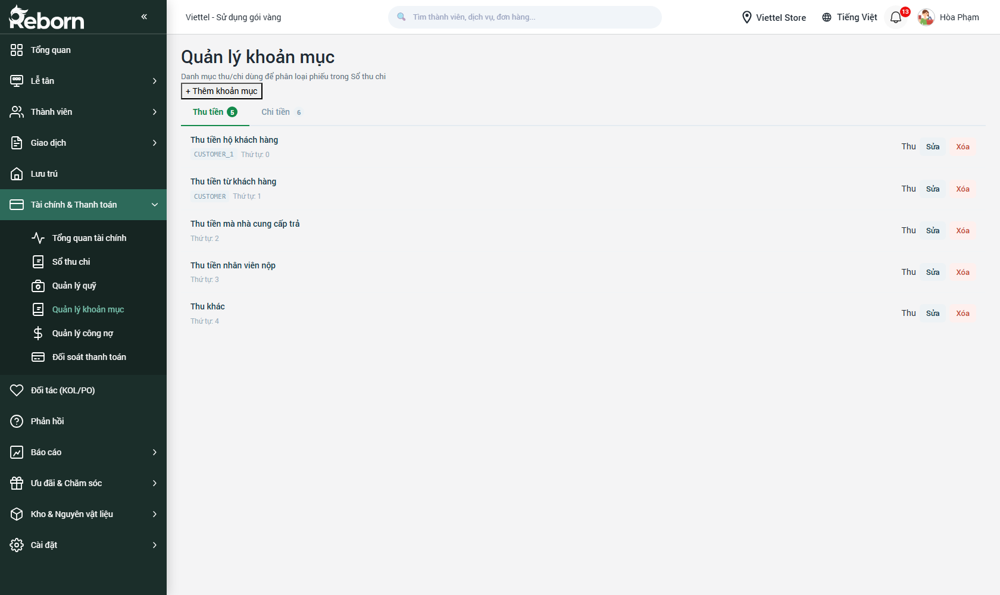

### D.1. Mục đích

**Khoản mục** là **danh mục phân loại** các giao dịch thu chi. Báo cáo tài chính dựa vào khoản mục để biết "tiền vào/ra từ đâu".

**Ví dụ khoản mục thu:**
- Doanh thu bán hàng
- Doanh thu dịch vụ
- Tiền cọc khách
- Tiền hoa hồng
- Thu khác

**Ví dụ khoản mục chi:**
- Lương nhân viên
- Tiền điện nước
- Mua nguyên vật liệu
- Thuê mặt bằng
- Marketing / quảng cáo
- Thuế
- Chi khác

### D.2. Thêm / Sửa / Xóa khoản mục

Tương tự các danh mục khác, với các trường:

| Trường | Bắt buộc | Ghi chú |
|--------|:--------:|---------|
| **Tên khoản mục** | ✓ | Text ≤ 100 |
| **Loại** | ✓ | Thu / Chi |
| **Mã** | — | Tự sinh nếu bỏ trống |
| **Khoản mục cha** | — | Để tạo cây phân cấp |
| **Mô tả** | — | Text |

---

## E. Quản lý công nợ

**URL:** `/crm/finance_management/debt_management`

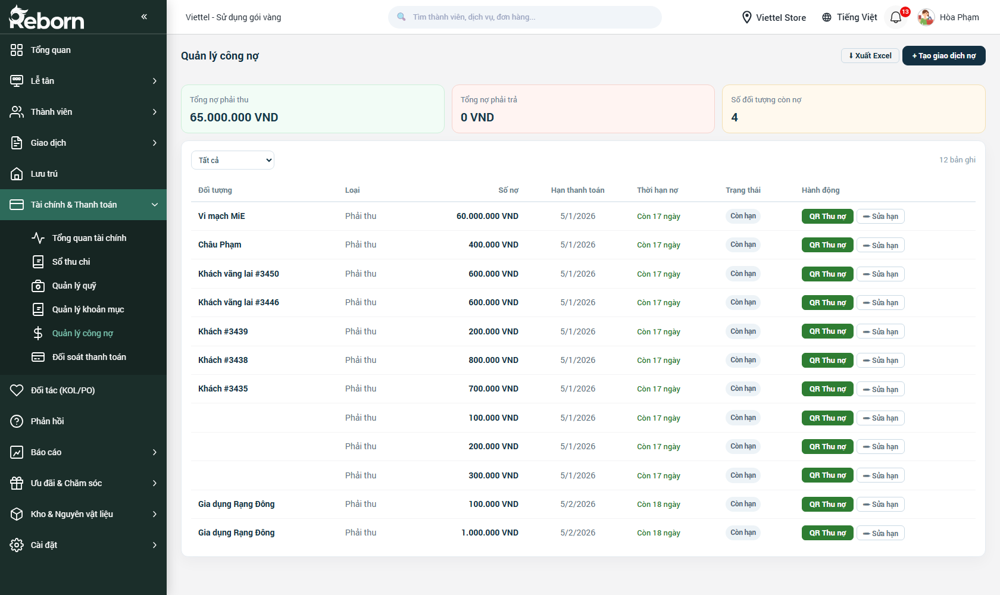

### E.1. Công nợ khách hàng

Liệt kê các khách **đang nợ cửa hàng**:

- Tên khách, SĐT, Tổng nợ hiện tại, Số ngày nợ, Nợ quá hạn?
- Bấm vào để xem **chi tiết công nợ**: danh sách các đơn nợ + các lần thanh toán từng phần.

**Thu nợ:**
1. Chọn khách → **Thu nợ**.
2. Chọn đơn cần thu (hoặc thu một phần).
3. Nhập số tiền + quỹ nhận.
4. Xác nhận → hệ thống tự tạo phiếu thu ở sổ thu chi.

### E.2. Công nợ phải trả (NCC)

Tab thứ 2 — liệt kê **tiền cửa hàng đang nợ nhà cung cấp** (từ các đơn nhập kho chưa trả đủ).

**Trả nợ NCC:**
1. Chọn NCC → **Trả nợ**.
2. Chọn đơn nhập → nhập số tiền → chọn quỹ.
3. Xác nhận → phiếu chi tạo tự động.

#### Quy định nhập liệu — Phiếu thu/trả nợ

| Trường | Bắt buộc | Ghi chú |
|--------|:--------:|---------|
| **Đối tượng** | ✓ | Khách / NCC |
| **Đơn công nợ** | ✓ | Chọn 1 hoặc nhiều |
| **Số tiền** | ✓ | > 0 và ≤ số nợ còn |
| **Quỹ** | ✓ | Chọn từ danh sách |
| **Ghi chú** | — | |

---

## F. Đối soát thanh toán

**URL:** `/crm/payment_control`

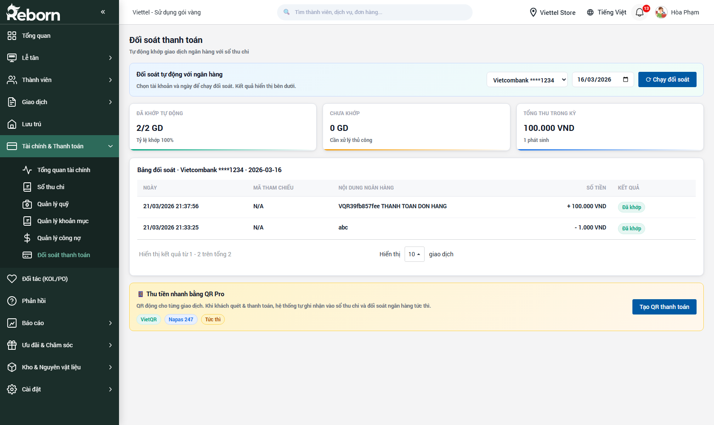

### F.1. Mục đích

Khi cửa hàng nhận thanh toán qua **cổng online** (VNPay, MoMo, ZaloPay, các bank gateway), số tiền thật về tài khoản thường **trễ 1–3 ngày**. Module này giúp bạn đối soát:

- **Giao dịch đã ghi trong CRM** vs
- **Giao dịch thật sự có trên sao kê** của kênh thanh toán.

### F.2. Các bước đối soát

1. Chọn **kênh** (VNPay / MoMo / ZaloPay / Bank gateway).
2. Chọn **khoảng thời gian**.
3. Bấm **Tải sao kê** — upload file CSV/Excel từ kênh, hoặc hệ thống tự fetch qua API (nếu đã tích hợp).
4. Bảng **So khớp** hiện ra:
   - Dòng **khớp** ✅ — CRM có, sao kê có, số tiền khớp.
   - Dòng **lệch** ⚠️ — số tiền chênh lệch hoặc mã giao dịch khớp một phần.
   - Dòng **thiếu bên CRM** ❓ — sao kê có mà CRM chưa ghi. Hành động: tạo phiếu thu bù.
   - Dòng **thiếu bên sao kê** ❓ — CRM có mà sao kê chưa. Hành động: chờ thêm / liên hệ kênh.
5. Xử lý từng dòng lệch → **Xác nhận đối soát**.
6. Hệ thống đánh dấu kỳ đó là "Đã đối soát" — không cho sửa.

---

## G. Luồng công việc thường gặp

### G.1. "Cuối ngày đóng ca và đối soát két"

1. Làm **Đóng ca** trong Quản lý ca (Part 02).
2. Sau khi đóng, vào **Sổ thu chi** → lọc **Hôm nay** → đối chiếu với phiếu in từ POS.
3. Nếu có giao dịch online, vào **Đối soát thanh toán** (khi có sao kê).

### G.2. "Trả lương nhân viên cuối tháng"

1. Vào **Sổ thu chi** → **+ Tạo phiếu chi**.
2. Loại: *Chi* → Khoản mục: *Lương nhân viên* → Đối tượng: chọn nhân viên → Số tiền.
3. Quỹ: Ngân hàng (nếu chuyển khoản) hoặc Tiền mặt.
4. Đính kèm **bảng lương** (PDF) → Lưu.

### G.3. "Khách nợ từ tháng trước, giờ đến trả"

1. Vào **Quản lý công nợ** → tab Khách hàng → tìm tên.
2. Bấm **Thu nợ** → chọn đơn nợ cũ → nhập số tiền → chọn quỹ nhận.
3. Xác nhận. Công nợ của khách được trừ xuống, phiếu thu tự động tạo trong Sổ thu chi.

---

## H. Lỗi thường gặp

| Lỗi | Xử lý |
|-----|-------|
| Số dư quỹ âm | Có phiếu chi nhiều hơn số thực có — kiểm tra lịch sử, có thể phải điều chỉnh |
| Phiếu đã đối soát không sửa được | Đúng thiết kế — phải mở kỳ đối soát (liên hệ admin) |
| *"Khoản mục không tồn tại"* | Chưa tạo → vào **Quản lý khoản mục** tạo trước |

---

*Hết Part 06.*

---

# Part 07 — Đối tác & Phản hồi

*Phiên bản: Cửa hàng & Spa — Tenant "Viettel Store"*

Phần này gom **2 mục độc lập trên sidebar** vì chúng đều liên quan đến *"những người không phải nhân viên / không phải khách lẻ"*:

| Mục | URL | Đối tượng |
|-----|-----|-----------|
| **Đối tác (KOL/PO)** | `/crm/ch_partners` | Người giới thiệu, KOL, Purchase Order (PO), đại lý |
| **Phản hồi** | `/crm/ch_feedback` | Phản hồi / khiếu nại / góp ý của khách hàng |

---

## A. Đối tác (KOL / PO / Đại lý)

**URL:** `/crm/ch_partners`

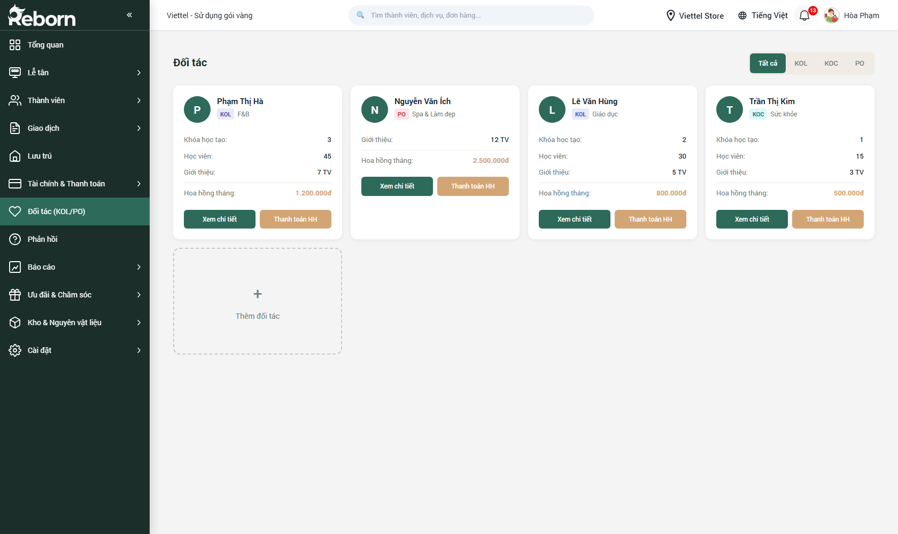

### A.1. Đối tác là gì?

**Đối tác** ở đây là những người/tổ chức có mối quan hệ kinh doanh đặc biệt với cửa hàng:

- **KOL / Influencer** — người nổi tiếng được cửa hàng thuê/mời quảng bá, có thể nhận hoa hồng từ khách họ giới thiệu.
- **Người giới thiệu (Referral)** — khách hàng hoặc cá nhân khác đã giới thiệu khách mới, được thưởng theo chính sách.
- **Purchase Order (PO) / Đại lý** — các đơn vị mua sỉ, đặt lô để bán lại.
- **Đối tác dịch vụ** — các bên thứ ba cung cấp dịch vụ kèm (vận chuyển, giặt ủi, PT...).

### A.2. Các cột trong danh sách

| Cột | Ghi chú |
|-----|---------|
| **Mã đối tác** | Tự sinh |
| **Tên** | Họ tên hoặc tên tổ chức |
| **Loại** | KOL / Referral / PO / Dịch vụ |
| **SĐT / Email** | Liên hệ |
| **Nhóm ngành** | Loại ngành hoạt động |
| **Số khách đã giới thiệu** | Đếm từ hệ thống |
| **Doanh thu mang về** | Tổng tiền từ khách do đối tác này giới thiệu |
| **Hoa hồng đã trả** | Tổng hoa hồng đã chi |
| **Hoa hồng phải trả** | Đang chờ chi |

### A.3. Thêm đối tác mới

**Các bước:**

1. Bấm **+ Thêm đối tác**.
2. Điền form:

#### Quy định nhập liệu — Đối tác

| Trường | Bắt buộc | Kiểu | Ràng buộc |
|--------|:--------:|------|-----------|
| **Tên đối tác** | ✓ | Text ≤ 255 | |
| **Loại đối tác** | ✓ | Select | KOL / Referral / PO / Dịch vụ |
| **Số điện thoại** | ✓ | Tel | Đúng định dạng VN hoặc quốc tế |
| **Email** | — | Email | |
| **Địa chỉ** | — | Text | |
| **Mã số thuế** | — | Text, 10 hoặc 13 số | Nếu là PO/doanh nghiệp |
| **Số TK ngân hàng** | — | Text | Để trả hoa hồng |
| **Tên NH** | — | Text | |
| **Chủ TK** | — | Text | |
| **Tỷ lệ hoa hồng (%)** | — | Number 0-100 | Hoặc số cố định per đơn |
| **Hạn hợp đồng** | — | Date | |
| **Ghi chú** | — | Textarea | |
| **Ảnh đại diện / Logo** | — | Upload ≤ 5MB | |

3. Bấm **Lưu**.

### A.4. Gắn đối tác vào đơn hàng

Khi tạo **đơn bán hàng** (Part 02):
- Ở modal thanh toán / giỏ hàng có ô **"Người giới thiệu"** — chọn đối tác.
- Khi đơn được xác nhận, hệ thống tự tính hoa hồng theo tỷ lệ đã cài.
- Hoa hồng được tích lũy vào trạng thái **"phải trả"** của đối tác.

### A.5. Trả hoa hồng cho đối tác

1. Vào danh sách đối tác → chọn đối tác → tab **Hoa hồng**.
2. Xem danh sách các đơn đã có hoa hồng (chưa trả).
3. Tick các đơn cần thanh toán → **Thanh toán hoa hồng**.
4. Chọn **Quỹ chi** → **Xác nhận**.
5. Hệ thống tạo phiếu chi ở **Sổ thu chi** (Part 06), đánh dấu các đơn đó là "Đã trả hoa hồng".

---

## B. Phản hồi khách hàng

**URL:** `/crm/ch_feedback`

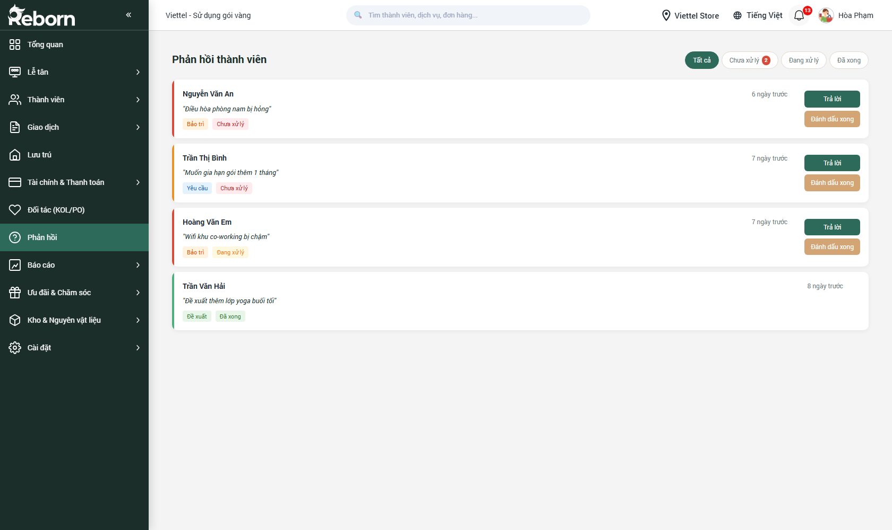

### B.1. Mục đích

Thu thập, phân loại và xử lý **phản hồi của khách**:
- **Khen ngợi** — tích cực, có thể dùng làm testimonial.
- **Góp ý** — đề xuất cải thiện, quản lý cần xem.
- **Khiếu nại** — vấn đề nghiêm trọng, cần xử lý nhanh.

### B.2. Các kênh thu thập

Phản hồi có thể đến từ nhiều nguồn, đổ về cùng một nơi để dễ quản lý:

- **Form trên app/web** của khách.
- **Khảo sát sau khi dùng dịch vụ** (gửi qua SMS/email).
- **Chat với bot** — chuyển tiếp phản hồi.
- **Nhập thủ công** — nhân viên nghe khách nói trực tiếp thì ghi vào.
- **Social media listening** — comment từ Facebook/Zalo (nếu đã tích hợp Social CRM).

### B.3. Các cột / trạng thái

| Cột | Ghi chú |
|-----|---------|
| **Mã phản hồi** | Tự sinh |
| **Ngày giờ** | |
| **Khách hàng** | Gắn vào hồ sơ khách (nếu xác định được) |
| **Kênh** | Form / SMS / App / Nhân viên / FB... |
| **Loại** | Khen / Góp ý / Khiếu nại |
| **Mức độ** | Nhẹ / Trung bình / Nghiêm trọng |
| **Nội dung** | Text khách viết |
| **Trạng thái xử lý** | Mới / Đang xử lý / Đã xử lý / Bỏ qua |
| **Người phụ trách** | Nhân viên được giao xử lý |

### B.4. Các bước xử lý một phản hồi

1. Bấm vào phản hồi ở danh sách → mở panel chi tiết.
2. **Phân loại**: chọn Loại, Mức độ.
3. **Gán người phụ trách**: chọn từ danh sách nhân viên.
4. Chuyển trạng thái sang **Đang xử lý**.
5. **Viết note**: mỗi lần có hành động, ghi vào phần **Lịch sử xử lý** (vd *"Đã gọi điện xin lỗi và tặng voucher 100k"*).
6. Khi xong, chuyển sang **Đã xử lý** + ghi kết quả cuối.

#### Quy định nhập liệu — Tạo phản hồi thủ công

| Trường | Bắt buộc | Ghi chú |
|--------|:--------:|---------|
| **Khách hàng** | — | Select hoặc để trống nếu vô danh |
| **Kênh** | ✓ | Select |
| **Loại** | ✓ | Khen / Góp ý / Khiếu nại |
| **Mức độ** | ✓ | Nhẹ / Trung bình / Nghiêm trọng |
| **Nội dung** | ✓ | Textarea ≤ 2000 ký tự |
| **Ảnh đính kèm** | — | Upload, max 5 file × 5MB |
| **Ngày phát sinh** | ✓ | Date |

### B.5. Báo cáo phản hồi

- **Số phản hồi theo tháng** — biểu đồ cột.
- **Tỷ lệ Khen / Góp ý / Khiếu nại** — pie chart.
- **Thời gian xử lý trung bình** — từ Mới → Đã xử lý.
- **Top nhân viên xử lý nhanh nhất**.
- **Khu vực / dịch vụ bị khiếu nại nhiều nhất** — alert cho quản lý cải thiện.

---

## C. Luồng công việc thường gặp

### C.1. "KOL A mang về 5 khách mới tháng này — tính hoa hồng"

1. Mỗi khi khách đến và nói *"Em biết qua chị A"*, lễ tân phải gắn **Người giới thiệu: A** vào đơn ngay khi bán hàng.
2. Cuối tháng, vào **Đối tác** → tìm A → tab **Hoa hồng** → thấy 5 đơn + tổng hoa hồng.
3. Tick tất cả → **Thanh toán hoa hồng** → chọn quỹ → xác nhận.
4. Phiếu chi tự tạo trong **Sổ thu chi**, A được đánh dấu đã nhận đủ.

### C.2. "Khách khiếu nại dịch vụ massage không đúng thời lượng"

1. Lễ tân nghe khách, vào **Phản hồi** → **+ Tạo phản hồi** → gắn khách → Loại: *Khiếu nại* → Mức độ: *Trung bình* → nội dung.
2. Gán người phụ trách: Quản lý ca.
3. Quản lý vào, xem, gọi điện xin lỗi → tặng voucher 200k → ghi note → chuyển **Đã xử lý**.
4. Cuối tháng trong báo cáo Khiếu nại, thấy đúng rằng dịch vụ này đang có vấn đề → cải thiện.

---

*Hết Part 07.*

---

# Part 08 — Báo cáo

*Phiên bản: Cửa hàng & Spa — Tenant "Viettel Store"*

**Báo cáo** là phân hệ dành chủ yếu cho **quản lý cửa hàng** — nơi bạn có **cái nhìn tổng hợp** về hoạt động kinh doanh qua các bộ biểu đồ và bảng số liệu. Không dùng để nhập liệu mà chỉ để **đọc và phân tích**.

Sidebar có **6 mục con**:

| # | Mục | URL | Nội dung |
|---|-----|-----|----------|
| 1 | **Doanh thu & MRR** | `/crm/ch_report_revenue` | Doanh thu tổng, doanh thu định kỳ (MRR) |
| 2 | **Thành viên** | `/crm/ch_report_members` | Tăng trưởng thành viên, hạng, giữ chân |
| 3 | **Check-in** | `/crm/ch_report_checkin` | Lượt sử dụng dịch vụ, tần suất, giờ cao điểm |
| 4 | **Dịch vụ** | `/crm/ch_report_services` | Hiệu quả từng dịch vụ, gói |
| 5 | **Đối tác** | `/crm/ch_report_partners` | Hoa hồng trả đối tác, nguồn khách |
| 6 | **Tài chính & Công nợ** | `/crm/ch_report_finance` | Dòng tiền, lãi lỗ, công nợ |

Tất cả các báo cáo đều có:

- **Bộ lọc kỳ** — Hôm nay / Tuần / Tháng / Quý / Năm / Tùy chọn.
- **So sánh** — với cùng kỳ trước (để thấy tăng trưởng).
- **Xuất Excel** — tải báo cáo.
- **Lọc theo cơ sở** — nếu có nhiều chi nhánh.

---

## A. Báo cáo Doanh thu & MRR

**URL:** `/crm/ch_report_revenue`

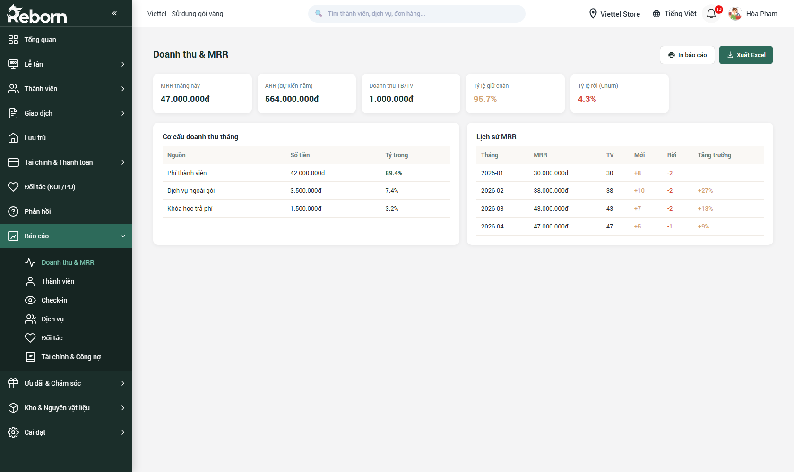

### A.1. Các chỉ số chính

- **Tổng doanh thu** theo kỳ — tổng tiền thu được từ bán hàng / dịch vụ / gói thành viên.
- **MRR (Monthly Recurring Revenue)** — doanh thu định kỳ từ các gói thành viên đang active.
- **ARPU (Average Revenue Per User)** — doanh thu trung bình trên mỗi thành viên.
- **Tỷ lệ tăng trưởng** — so với kỳ trước, dạng %.
- **Số đơn hàng** — đếm đơn.
- **Giá trị đơn trung bình (AOV)**.

### A.2. Các biểu đồ

- **Doanh thu theo ngày** — biểu đồ cột cho cả kỳ.
- **Doanh thu theo nguồn thu** — pie: bán hàng / dịch vụ / gói thành viên / bán lẻ.
- **Top 10 sản phẩm / dịch vụ** — bar chart xếp giảm dần.
- **Doanh thu theo nhân viên bán** — cho tính hoa hồng / KPI.
- **Doanh thu theo nhóm thành viên** — ai đóng góp nhiều nhất.

### A.3. Cách đọc báo cáo MRR

MRR đặc biệt quan trọng với mô hình **bán gói thành viên**:

- Nếu bạn bán gói 6 tháng giá 12 triệu → MRR = 12tr / 6 = 2tr/tháng.
- Hệ thống tự chia đều doanh thu gói theo số tháng và hiển thị đúng vào tháng tương ứng.
- Chỉ số MRR **ổn định** nghĩa là khách hàng trung thành, cơ sở kinh doanh bền vững.

---

## B. Báo cáo Thành viên

**URL:** `/crm/ch_report_members`

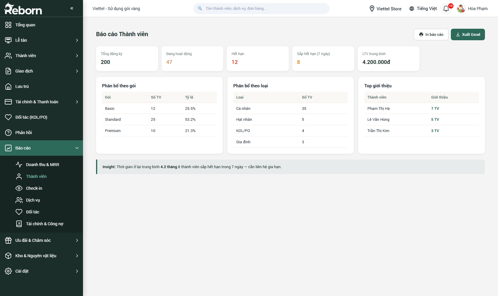

### B.1. Các chỉ số

- **Tổng thành viên** cuối kỳ.
- **Thành viên mới** — đăng ký trong kỳ.
- **Thành viên đang hoạt động** — có check-in hoặc mua trong N ngày (cấu hình tenant).
- **Thành viên không hoạt động** (churned) — không dùng trong N ngày.
- **Tỷ lệ giữ chân (Retention rate)** — %.
- **Tỷ lệ mất khách (Churn rate)** — %.

### B.2. Các biểu đồ

- **Tăng trưởng thành viên** theo thời gian (line chart).
- **Phân bố theo hạng thẻ** — pie chart (Diamond / Gold / Silver / Basic).
- **Phân bố theo giới tính / độ tuổi / nghề nghiệp**.
- **Nguồn thành viên** — FB / Zalo / Giới thiệu / Quảng cáo / Walk-in.

### B.3. Thành viên sắp hết hạn

Bảng liệt kê các khách có gói **sắp hết hạn** (trong 7/15/30 ngày tới). Từ đây bạn có thể:
- Xuất danh sách → gửi sang chiến dịch marketing nhắc gia hạn (Part 09).
- Gọi điện trực tiếp.

---

## C. Báo cáo Check-in

**URL:** `/crm/ch_report_checkin`

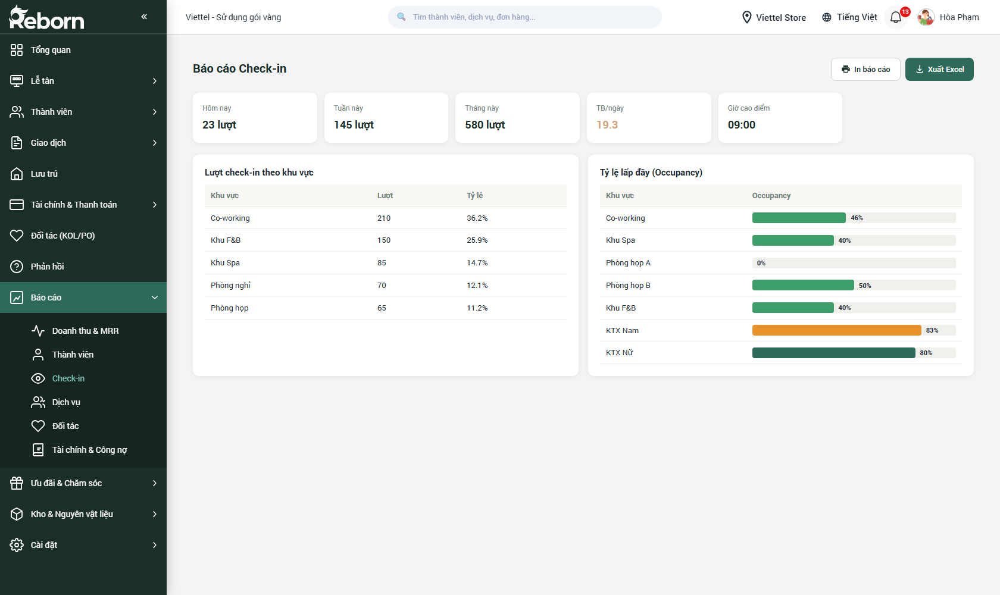

### C.1. Các chỉ số

- **Tổng lượt check-in** trong kỳ.
- **Khách duy nhất** — deduplicate theo thành viên.
- **Trung bình lượt / khách**.
- **Tổng lượt theo ngày**.

### C.2. Biểu đồ

- **Heatmap giờ cao điểm** — lưới giờ × ngày trong tuần, đậm nhạt theo mật độ.
- **Top khách trung thành** — ai đến nhiều nhất.
- **Phân bố theo khu vực** — Co-working / Spa / Phòng riêng...
- **Xu hướng theo tuần** — để nhận ra mùa vụ.

### C.3. Ứng dụng

- Biết giờ cao điểm để sắp lịch nhân viên hợp lý.
- Nhận ra khu vực nào đang bị bỏ trống → giảm giá hoặc cải thiện.
- Phát hiện khách không còn đến → đưa vào chiến dịch winback.

---

## D. Báo cáo Dịch vụ

**URL:** `/crm/ch_report_services`

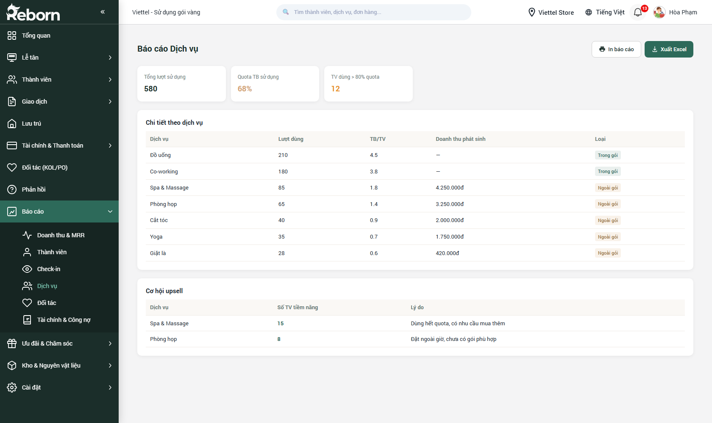

### D.1. Các chỉ số

- **Top dịch vụ bán chạy** — theo doanh thu và theo số lượt.
- **Dịch vụ "chết"** — ít/không ai dùng trong kỳ.
- **Hiệu quả combo** — doanh thu từ khách mua combo vs mua lẻ.
- **Tỷ lệ sử dụng quota** — khách có gói đã dùng bao nhiêu %.
- **Thời gian trung bình giữa các lần dùng**.

### D.2. Gợi ý hành động

Báo cáo này giúp bạn quyết định:
- **Dịch vụ nào cần đẩy mạnh marketing** (đang có nhu cầu).
- **Dịch vụ nào cần tái cơ cấu / loại bỏ** (không có khách).
- **Giá gói có hợp lý không** — nếu tỷ lệ sử dụng quota < 50% → gói quá rộng → nên giảm giá hoặc rút quota.

---

## E. Báo cáo Đối tác

**URL:** `/crm/ch_report_partners`

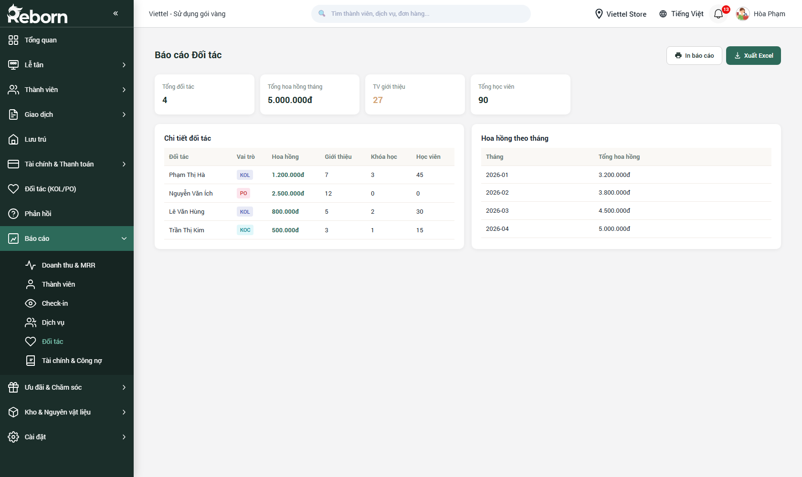

### E.1. Các chỉ số

- **Top đối tác mang về khách** — ai hiệu quả nhất.
- **Doanh thu từ đối tác** — tổng, theo từng đối tác.
- **Hoa hồng đã chi** — tổng, theo đối tác.
- **ROI đối tác** — doanh thu / hoa hồng, cho biết đối tác có lãi không.
- **KOL có tỷ lệ chuyển đổi cao nhất** — họ giới thiệu 10 khách thì bao nhiêu thực sự mua.

### E.2. Ứng dụng

- Biết đối tác nào đáng giữ, đối tác nào "ăn không" (lấy hoa hồng mà không mang khách).
- Phân bổ ngân sách marketing hợp lý.

---

## F. Báo cáo Tài chính & Công nợ

**URL:** `/crm/ch_report_finance`

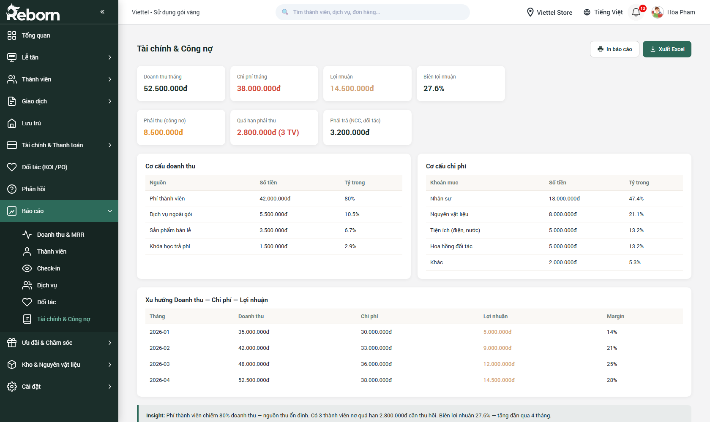

### F.1. Các chỉ số

- **Tổng thu / chi** trong kỳ.
- **Lãi gộp / Lãi ròng** — sau trừ chi phí.
- **Số dư các quỹ** — đầu kỳ và cuối kỳ.
- **Công nợ phải thu** (từ khách) — đầu kỳ vs cuối kỳ.
- **Công nợ phải trả** (cho NCC) — đầu kỳ vs cuối kỳ.

### F.2. Biểu đồ

- **Biểu đồ thu chi theo ngày** — cột đôi (thu màu xanh, chi màu đỏ).
- **Cơ cấu chi** — pie chart các khoản mục chi lớn.
- **Xu hướng công nợ** — line chart.
- **Tỷ lệ thu hồi nợ** — thu hồi được bao nhiêu % so với nợ phát sinh.

---

## G. Xuất báo cáo & Gửi định kỳ

### G.1. Xuất thủ công

Mọi báo cáo đều có nút **Xuất Excel** ở góc phải — tải file `.xlsx` ngay.

### G.2. Gửi email định kỳ

Với các báo cáo quan trọng (Doanh thu, Tài chính), bạn có thể cài **Gửi tự động**:

1. Bấm **🔔 Gửi định kỳ**.
2. Điền:
   - **Danh sách email nhận** (cách nhau bằng dấu phẩy).
   - **Tần suất**: Hàng ngày / Hàng tuần (chọn thứ) / Hàng tháng (chọn ngày).
   - **Giờ gửi**.
   - **Định dạng**: PDF / Excel.
3. **Lưu**. Hệ thống sẽ gửi tự động theo lịch.

---

## H. Đọc báo cáo — Các chỉ số quan trọng nhất cho chủ cửa hàng

Nếu bạn chỉ có 5 phút mỗi sáng, hãy xem 5 chỉ số này:

1. **Doanh thu hôm qua vs hôm qua của tuần trước** — tăng hay giảm?
2. **Số check-in hôm qua** — cơ sở có đông khách không?
3. **MRR tháng hiện tại** — doanh thu định kỳ có bền không?
4. **Công nợ phải thu** — có đang tăng nhanh không (dấu hiệu bán chịu nhiều)?
5. **Top 3 dịch vụ bán chạy tuần này** — để tập trung bổ sung hàng / nhân sự.

---

*Hết Part 08.*

---

# Part 09 — Ưu đãi & Chăm sóc

*Phiên bản: Cửa hàng & Spa — Tenant "Viettel Store"*

Phân hệ **Ưu đãi & Chăm sóc** là công cụ để bạn **giữ chân khách hàng** và **kéo khách mới**. Đây là nơi tạo ra các hoạt động "tấn công chủ động" thay vì chỉ ngồi đợi khách đến quầy.

Sidebar có **4 mục con**:

| # | Mục | URL | Dùng để |
|---|-----|-----|---------|
| 1 | **Khuyến mãi & Voucher** | `/crm/promotional_program` | Tạo chương trình khuyến mãi, mã giảm giá |
| 2 | **Tích điểm hội viên** | `/crm/member_list` | Quản lý ví điểm của khách, quy tắc tích/đổi |
| 3 | **Chiến dịch marketing** | `/crm/marketing_campaign` | Gửi SMS/Email/Zalo/thông báo đẩy hàng loạt |
| 4 | **Chăm sóc thành viên** | `/crm/customer_care_page` | Lịch công việc chăm sóc, reminder tự động |

---

## A. Khuyến mãi & Voucher

**URL:** `/crm/promotional_program`

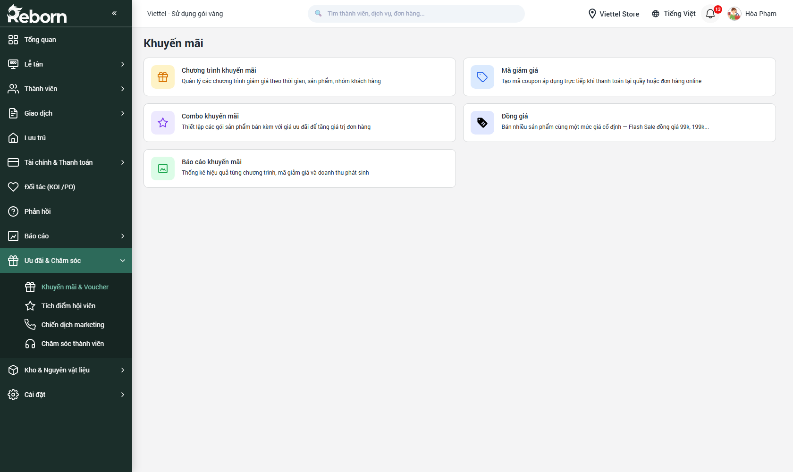

### A.1. Các loại khuyến mãi thường dùng

- **Giảm giá theo %** — vd *"Giảm 20% toàn bộ đơn"*.
- **Giảm giá theo số tiền** — vd *"Giảm 50.000đ"*.
- **Mua N tặng M** — vd *"Mua 2 tặng 1"*.
- **Combo giá** — vd *"Set 3 dịch vụ chỉ còn 500k"*.
- **Flash sale** — giảm giá trong khoảng giờ cụ thể.
- **Voucher code** — mã giấy để khách nhập khi thanh toán.
- **Freebies** — tặng quà (sản phẩm phụ) khi mua đủ ngưỡng.

### A.2. Các bước tạo chương trình khuyến mãi

1. Bấm **+ Tạo chương trình**.
2. Điền form:

#### Quy định nhập liệu — Chương trình khuyến mãi

| Trường | Bắt buộc | Kiểu | Ghi chú |
|--------|:--------:|------|---------|
| **Tên chương trình** | ✓ | Text ≤ 255 | Vd *"Black Friday — giảm 30%"* |
| **Mã chương trình** | — | Text slug | Tự sinh nếu bỏ trống |
| **Loại khuyến mãi** | ✓ | Select | Giảm % / Giảm tiền / Mua tặng / Combo / Flash sale |
| **Giá trị giảm** | ✓ | Number | Tùy loại: % (0-100) hoặc VNĐ |
| **Áp dụng cho** | ✓ | Select | Toàn bộ / Danh mục cụ thể / Sản phẩm cụ thể |
| **Điều kiện tối thiểu** | — | Number | Vd *"Đơn tối thiểu 200.000đ"* |
| **Giới hạn giảm tối đa** | — | Number | Vd *"Giảm tối đa 100.000đ"* |
| **Đối tượng khách** | ✓ | Multi-select | Tất cả / Theo hạng / Theo nhóm / Khách mới |
| **Ngày bắt đầu** | ✓ | Datetime | |
| **Ngày kết thúc** | ✓ | Datetime | Phải > Ngày bắt đầu |
| **Giới hạn số lượt dùng** | — | Number | Tổng số lượt toàn chương trình |
| **Giới hạn / khách** | — | Number | Mỗi khách dùng tối đa N lần |
| **Mã voucher (nếu có)** | — | Text ≤ 20 | In hoa, không dấu, không khoảng trắng |
| **Mô tả / Điều khoản** | — | Textarea ≤ 2000 | Hiển thị cho khách |
| **Ảnh banner** | — | Upload ≤ 5 MB | |
| **Trạng thái** | ✓ | Select | Nháp / Đang chạy / Đã kết thúc / Tạm dừng |

3. Bấm **Lưu nháp** để lưu mà chưa chạy, hoặc **Kích hoạt** để chạy ngay.

### A.3. Theo dõi hiệu quả chương trình

Sau khi chương trình chạy, trong danh sách có cột:
- **Số lượt dùng** / Tổng cho phép.
- **Doanh thu từ chương trình**.
- **Số tiền đã giảm** (chi phí khuyến mãi).
- **ROI** = Doanh thu / Chi phí giảm.

### A.4. Voucher lẻ (giấy)

Ngoài chương trình tự động, bạn có thể in **voucher giấy** phát cho khách. Mỗi voucher có mã riêng:

1. Trong chương trình, bấm **Tạo lô voucher**.
2. Số lượng, prefix mã (vd `TET2026-`), thời hạn từng voucher.
3. **Xuất** danh sách mã để in.

---

## B. Tích điểm hội viên (Loyalty)

**URL:** `/crm/member_list`

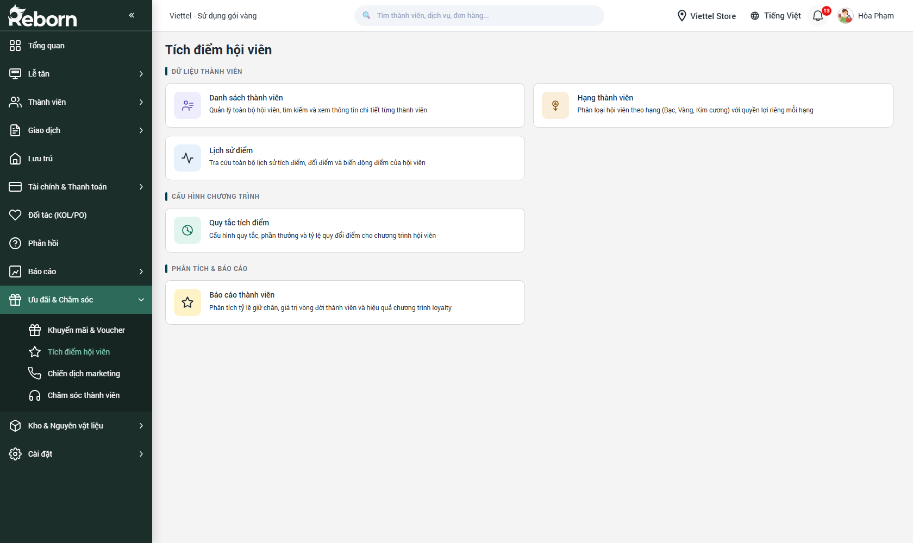

### B.1. Các thành phần

- **Ví điểm của từng khách** — xem/điều chỉnh số điểm, lịch sử tích/đổi.
- **Quy tắc tích điểm** — bao nhiêu tiền được bao nhiêu điểm.
- **Danh mục đổi quà** — khách có thể đổi điểm lấy quà/voucher.
- **Hạng thành viên** — level theo tổng điểm hoặc tổng chi tiêu (Basic/Silver/Gold/Diamond).
- **Lịch sử** — log mọi thao tác tăng/giảm điểm.

### B.2. Cấu hình quy tắc tích điểm

1. Vào tab **Quy tắc**.
2. Thêm quy tắc:

#### Quy định nhập liệu — Quy tắc tích điểm

| Trường | Bắt buộc | Ghi chú |
|--------|:--------:|---------|
| **Tên quy tắc** | ✓ | Text |
| **Loại** | ✓ | Tích / Đổi |
| **Điều kiện áp dụng** | ✓ | Vd *"Mọi đơn từ 100.000đ trở lên"* |
| **Tỷ lệ** | ✓ | Vd *"10.000đ = 1 điểm"* hoặc *"100 điểm = 10.000đ giảm giá"* |
| **Nhóm khách áp dụng** | — | All / theo hạng |
| **Thời gian hiệu lực** | — | Từ ngày – Đến ngày |
| **Mức trần / đơn** | — | Tối đa bao nhiêu điểm mỗi đơn |

3. **Lưu**.

### B.3. Điều chỉnh điểm thủ công

Khi có sự cố (khách khiếu nại, tặng điểm khuyến mãi):

1. Tìm khách → bấm **+/- điểm**.
2. Nhập số điểm + lý do bắt buộc.
3. Xác nhận → ghi log vĩnh viễn.

### B.4. Đổi điểm lấy quà

Ở quầy, khi khách muốn đổi:

1. Tìm khách → xem số điểm hiện tại.
2. Bấm **Đổi điểm** → chọn quà từ danh mục.
3. Xác nhận → trừ điểm, xuất phiếu quà.

---

## C. Chiến dịch Marketing

**URL:** `/crm/marketing_campaign`

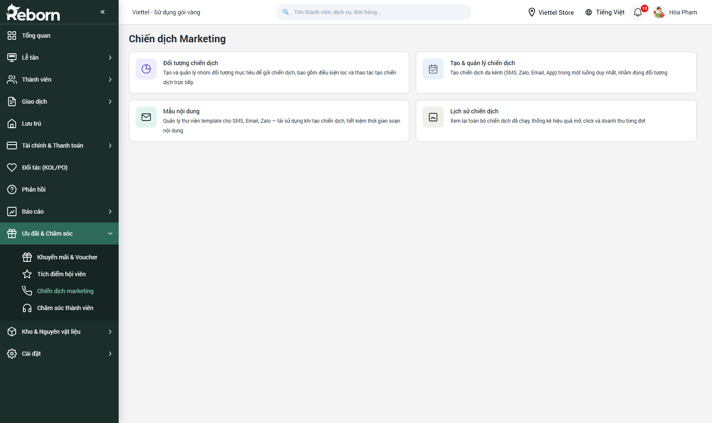

### C.1. Loại chiến dịch

- **SMS** — tin nhắn văn bản.
- **Email** — email marketing.
- **Zalo OA** — tin nhắn Zalo.
- **Thông báo đẩy (Push)** — nếu có app di động.
- **Facebook Message** — nếu đã tích hợp Fanpage.

### C.2. Các bước tạo chiến dịch

1. Bấm **+ Tạo chiến dịch**.
2. Chọn **Kênh** → chọn loại.
3. Điền **thông tin chiến dịch**:

#### Quy định nhập liệu — Chiến dịch Marketing

| Trường | Bắt buộc | Ghi chú |
|--------|:--------:|---------|
| **Tên chiến dịch** | ✓ | Text |
| **Kênh** | ✓ | SMS / Email / Zalo / Push / Facebook |
| **Đối tượng khách** | ✓ | Tất cả / Theo nhóm / Theo hạng / Theo bộ lọc nâng cao |
| **Mục đích** | — | Khuyến mãi / Nhắc gia hạn / Sinh nhật / Winback / Cảm ơn |
| **Nội dung (template)** | ✓ | Nội dung tin. SMS ≤ 160 ký tự, Email HTML đầy đủ, Zalo 500 ký tự |
| **Tiêu đề (email/push)** | ✓ (nếu email) | Text |
| **Biến thay thế** | — | `{{tên khách}}`, `{{điểm}}`, `{{gói}}` — tự động replace |
| **Thời gian gửi** | ✓ | Gửi ngay / Lên lịch |
| **Giới hạn/kỳ** | — | Số tin tối đa 1 khách nhận trong 1 khoảng thời gian |

4. **Xem trước** — kiểm tra nội dung với 1 mẫu khách.
5. **Test gửi** — gửi cho 1 số điện thoại cụ thể trước khi gửi hàng loạt.
6. **Xác nhận gửi** → hệ thống đẩy vào hàng đợi, gửi dần theo giới hạn tốc độ của kênh.

### C.3. Theo dõi kết quả

Sau khi chiến dịch chạy, tab **Báo cáo** cho biết:

- **Đã gửi thành công** / **Thất bại**.
- **Tỷ lệ mở** (email) / **Tỷ lệ click**.
- **Tỷ lệ chuyển đổi** — có bao nhiêu khách sau khi nhận đã vào mua hàng.
- **Doanh thu mang về từ chiến dịch**.
- **Chi phí** (phí gửi SMS/Zalo) → tính ROI.

---

## D. Chăm sóc thành viên

**URL:** `/crm/customer_care_page`

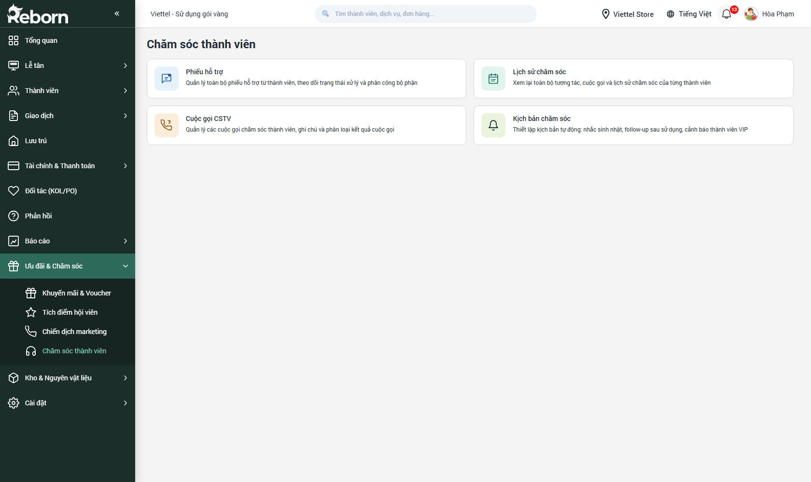

### D.1. Mục đích

Quản lý **các công việc chăm sóc khách định kỳ / sự kiện**:

- Gọi điện hỏi thăm sau lần đầu đến.
- Nhắc sinh nhật (tặng voucher).
- Nhắc ngày kỷ niệm.
- Nhắc gia hạn gói sắp hết hạn.
- Theo dõi khách không đến > 30 ngày (churn warning).

### D.2. Các cột danh sách công việc

| Cột | Ghi chú |
|-----|---------|
| **Khách hàng** | Avatar + tên |
| **Loại** | Chăm sóc sau bán / Sinh nhật / Gia hạn / Winback... |
| **Người phụ trách** | Nhân viên được giao |
| **Hạn thực hiện** | Deadline |
| **Trạng thái** | Mới / Đang làm / Đã xong / Bỏ qua |
| **Kết quả** | Ghi chú sau khi thực hiện |

### D.3. Tạo nhiệm vụ chăm sóc

**Thủ công:**
1. Bấm **+ Tạo nhiệm vụ** → chọn khách → loại → hạn → người phụ trách → mô tả.

**Tự động:**
1. Vào **Cấu hình automation** trong phân hệ này.
2. Thêm quy tắc, vd:
   - *"Sau khi bán đơn > 1tr → tạo nhiệm vụ Gọi hỏi thăm sau 3 ngày"*.
   - *"Trước sinh nhật 7 ngày → tạo nhiệm vụ Chuẩn bị voucher"*.
   - *"Gói sắp hết hạn trong 15 ngày → tạo nhiệm vụ Nhắc gia hạn"*.
3. Các nhiệm vụ tự sinh theo sự kiện.

### D.4. Thực hiện nhiệm vụ

1. Nhân viên vào danh sách → thấy nhiệm vụ của mình.
2. Bấm vào → thấy thông tin khách + hướng dẫn (nếu có trong template).
3. Thực hiện (gọi, nhắn, v.v.) → ghi **kết quả** → chuyển **Đã xong**.

---

## E. Luồng marketing điển hình

### E.1. "Gửi SMS nhắc gia hạn cho khách sắp hết thẻ"

1. Vào **Báo cáo Thành viên** → tìm danh sách **sắp hết hạn trong 15 ngày** → **Xuất** hoặc nhớ bộ lọc.
2. Vào **Chiến dịch Marketing** → **+ Tạo chiến dịch** → SMS.
3. Đối tượng: chọn **Theo bộ lọc** → *"Gói sắp hết hạn trong 15 ngày"*.
4. Nội dung: *"Xin chào {{tên}}, gói {{gói}} của bạn sẽ hết hạn vào {{ngày_hết_hạn}}. Gia hạn ngay hôm nay để được giảm 10% và duy trì ưu đãi."*
5. Lên lịch gửi 9h sáng mai → Lưu → Kích hoạt.
6. Theo dõi kết quả sau 3 ngày — xem có bao nhiêu khách gia hạn.

### E.2. "Tặng voucher sinh nhật tự động"

1. Vào **Chăm sóc → Cấu hình automation** → thêm quy tắc *"Sinh nhật khách"*.
2. Hành động: **Tạo voucher 100k** + **Gửi Zalo OA** với nội dung chúc mừng.
3. Bật automation.
4. Hệ thống tự chạy mỗi ngày, mọi khách có sinh nhật hôm đó đều nhận voucher + tin nhắn.

---

*Hết Part 09.*

---

# Part 10 — Kho & Nguyên vật liệu

*Phiên bản: Cửa hàng & Spa — Tenant "Viettel Store"*

Phân hệ **Kho & Nguyên vật liệu** quản lý toàn bộ **nguyên liệu / sản phẩm vật lý** của cửa hàng — từ nhập kho, xuất kho, kiểm kê, đến báo cáo tồn kho. Dù cơ sở bạn chủ yếu bán **dịch vụ**, phần này vẫn cần thiết để quản lý:

- Nguyên vật liệu cho dịch vụ (dầu massage, sản phẩm skincare, kim tiêm, găng tay…).
- Sản phẩm bán kèm (thực phẩm chức năng, mỹ phẩm, đồ lưu niệm…).
- Vật tư tiêu hao (khăn, nến, cồn, giấy in…).

Sidebar có **6 mục con**:

| # | Mục | URL | Chức năng |
|---|-----|-----|-----------|
| 1 | **Nguyên vật liệu** | `/crm/material` | Danh mục NVL |
| 2 | **Nhà cung cấp** | `/crm/supplier` | Danh sách NCC |
| 3 | **Danh sách kho** | `/crm/warehouse` | Các kho vật lý |
| 4 | **Sổ kho** | `/crm/inventory` | Lịch sử nhập/xuất |
| 5 | **Quản lý kho (kiểm kê)** | `/crm/inventory_checking` | Kiểm kê định kỳ |
| 6 | **Báo cáo kho** | `/crm/report_warehouse` | Báo cáo tồn kho, xuất nhập |

---

## A. Nguyên vật liệu (Danh mục)

**URL:** `/crm/material`

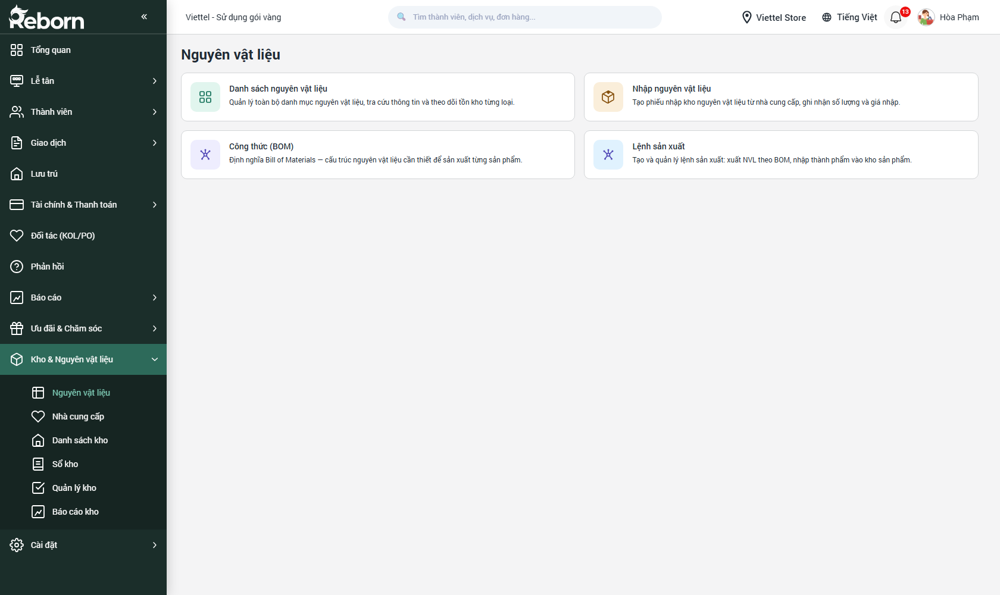

### A.1. Các cột

| Cột | Ghi chú |
|-----|---------|
| **Mã NVL** | Tự sinh hoặc tự nhập |
| **Tên NVL** | Vd *"Dầu massage lavender"* |
| **Danh mục** | Vd *"Tinh dầu"*, *"Khăn"*, *"Mỹ phẩm"* |
| **Đơn vị** | ml / lít / cái / hộp... |
| **Giá nhập TB** | Tính từ các lần nhập |
| **Tồn hiện tại** | Số lượng trên toàn bộ kho |
| **Tồn tối thiểu** | Cảnh báo khi < |
| **NCC ưa dùng** | NCC mặc định để đặt |

### A.2. Thêm NVL mới

1. Bấm **+ Thêm NVL**.
2. Điền form:

#### Quy định nhập liệu — NVL

| Trường | Bắt buộc | Kiểu | Ghi chú |
|--------|:--------:|------|---------|
| **Mã NVL** | — | Text ≤ 50 | Auto gen nếu bỏ trống |
| **Tên NVL** | ✓ | Text ≤ 255 | |
| **Danh mục** | ✓ | Select | Tạo mới được từ trong dropdown |
| **Đơn vị tính** | ✓ | Select | Từ danh sách đơn vị |
| **Đơn vị quy đổi** | — | Phép tính | Vd *1 hộp = 12 chai* |
| **Giá nhập** | ✓ | Number ≥ 0 | |
| **Giá bán** | — | Number ≥ 0 | Nếu NVL này cũng bán lẻ |
| **Tồn tối thiểu** | — | Number ≥ 0 | Ngưỡng cảnh báo |
| **NCC ưa dùng** | — | Select | Chọn từ danh sách NCC |
| **Mô tả** | — | Textarea | |
| **Ảnh NVL** | — | Upload | |

3. **Lưu**.

---

## B. Nhà cung cấp

**URL:** `/crm/supplier`

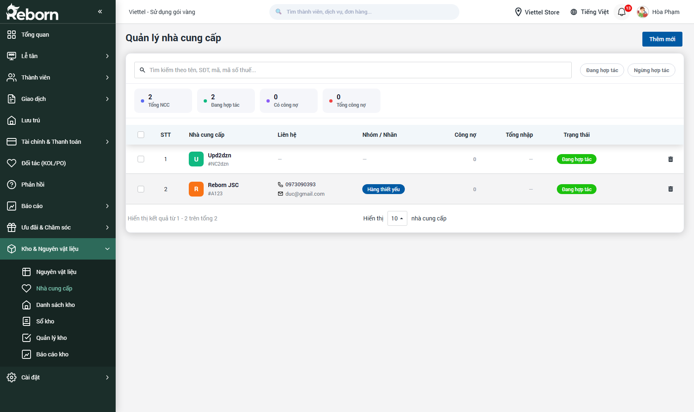

### B.1. Danh sách

Các cột: **Mã NCC**, **Tên công ty**, **Người liên hệ**, **SĐT**, **Email**, **Địa chỉ**, **Công nợ phải trả**.

### B.2. Thêm NCC

#### Quy định nhập liệu — NCC

| Trường | Bắt buộc | Kiểu | Ghi chú |
|--------|:--------:|------|---------|
| **Tên NCC / Công ty** | ✓ | Text ≤ 255 | |
| **Mã số thuế** | — | Text, 10 hoặc 13 số | |
| **Người liên hệ** | — | Text | |
| **Số điện thoại** | ✓ | Tel | |
| **Email** | — | Email | |
| **Địa chỉ** | — | Text | |
| **Ngân hàng / STK** | — | Text | Để trả nợ qua CK |
| **Hạn mức tín dụng** | — | Number | Được nợ tối đa bao nhiêu |
| **Thời hạn nợ (ngày)** | — | Number | Vd 30 ngày |
| **Mô tả** | — | Textarea | |

---

## C. Danh sách kho

**URL:** `/crm/warehouse`

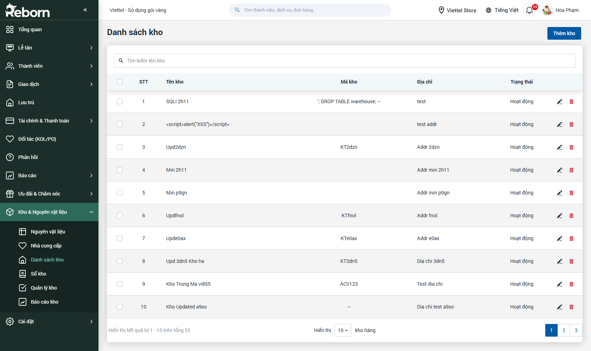

### C.1. Khái niệm

Một cửa hàng có thể có **nhiều kho vật lý** — vd:
- **Kho chính** — cất đồ dự trữ.
- **Kho bán lẻ** — đồ bày để bán.
- **Kho sử dụng** — đồ đang sử dụng ở các phòng dịch vụ.

Mỗi NVL có thể tồn ở nhiều kho khác nhau.

### C.2. Thêm kho

#### Quy định nhập liệu — Kho

| Trường | Bắt buộc | Ghi chú |
|--------|:--------:|---------|
| **Tên kho** | ✓ | Text |
| **Mã kho** | — | Auto gen |
| **Cơ sở** | ✓ | Chọn chi nhánh/cơ sở |
| **Địa chỉ vật lý** | — | Text |
| **Người phụ trách** | — | Select nhân viên |
| **Trạng thái** | ✓ | Đang dùng / Tạm khóa |

---

## D. Sổ kho (Lịch sử nhập/xuất)

**URL:** `/crm/inventory`

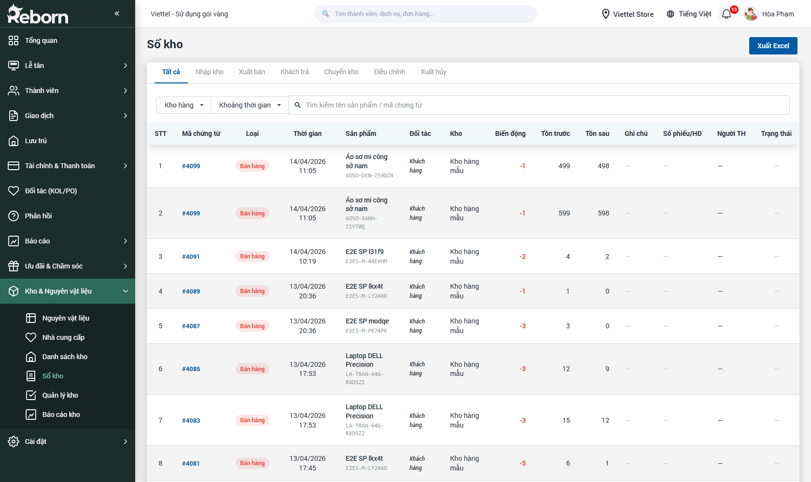

### D.1. Các loại phiếu

- **Phiếu nhập** — nhập từ NCC, hoặc nhập từ kho khác.
- **Phiếu xuất** — xuất sử dụng nội bộ, xuất bán, xuất sang kho khác.
- **Phiếu điều chỉnh** — sau khi kiểm kê phát hiện chênh lệch.

### D.2. Tạo phiếu nhập

1. Bấm **+ Tạo phiếu nhập**.
2. Điền form:

#### Quy định nhập liệu — Phiếu nhập kho

| Trường | Bắt buộc | Ghi chú |
|--------|:--------:|---------|
| **Mã phiếu** | — | Auto gen |
| **Ngày nhập** | ✓ | Date |
| **Nhà cung cấp** | ✓ | Select |
| **Kho nhận** | ✓ | Select |
| **Bảng hàng**: mỗi dòng | ✓ | |
| – NVL/Sản phẩm | ✓ | Select (tìm) |
| – Số lượng | ✓ | Number > 0 |
| – Đơn giá nhập | ✓ | Number ≥ 0 |
| – Thuế VAT | — | 0/5/8/10% |
| – Thành tiền | (tự tính) | SL × Đơn giá |
| **Tổng tiền hàng** | (tự tính) | |
| **Phí vận chuyển** | — | Number |
| **Chiết khấu** | — | Number hoặc % |
| **Tổng cộng** | (tự tính) | |
| **Đã trả** | — | Số tiền trả NCC ngay |
| **Còn nợ** | (tự tính) | Tổng - Đã trả |
| **Quỹ chi** | ✓ nếu Đã trả > 0 | |
| **Ghi chú** | — | |
| **Chứng từ** | — | Upload hóa đơn từ NCC |

3. **Lưu + Nhập kho**. Hệ thống:
   - Cộng số lượng vào kho nhận.
   - Cập nhật giá nhập trung bình.
   - Tạo phiếu chi trong Sổ thu chi (nếu có trả).
   - Cập nhật công nợ NCC (nếu còn nợ).

### D.3. Tạo phiếu xuất

Tương tự phiếu nhập, nhưng:

- **Loại xuất**: Xuất bán / Xuất sử dụng / Xuất chuyển kho / Xuất tiêu hủy.
- Trừ số lượng ở kho xuất.
- Nếu là xuất bán, ghi nhận doanh thu.
- Nếu là xuất chuyển kho, tạo phiếu nhập tương ứng ở kho nhận.

---

## E. Quản lý kho (Kiểm kê)

**URL:** `/crm/inventory_checking`

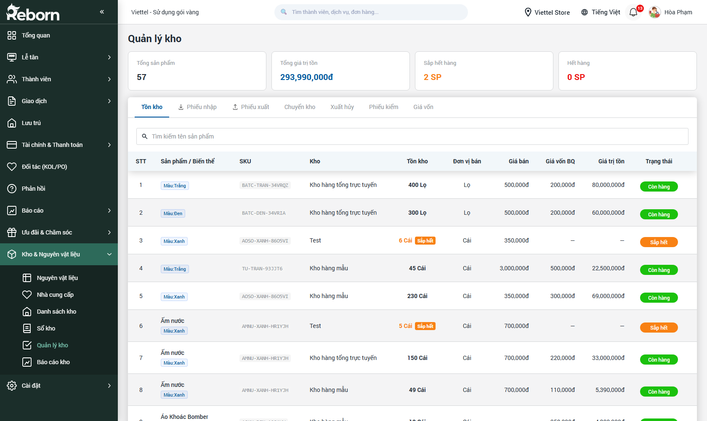

### E.1. Mục đích

Định kỳ (tuần/tháng/quý), nhân viên kho đếm **số lượng thực tế** và so sánh với **số lượng hệ thống** để phát hiện:
- Hàng bị hỏng / mất / trộm.
- Hàng ghi sai số lượng khi nhập/xuất.
- Hàng hết hạn.

### E.2. Các bước kiểm kê

1. Bấm **+ Tạo phiếu kiểm kê**.
2. Điền:
   - Kho kiểm kê
   - Ngày kiểm kê
   - Người kiểm kê
3. Hệ thống load bảng:
   - Mã NVL / Tên
   - Tồn theo sổ (hệ thống tính)
   - **Tồn thực tế** — nhân viên gõ vào sau khi đếm
   - **Chênh lệch** — tự tính
4. Sau khi đếm xong toàn bộ, bấm **Xác nhận kiểm kê**.
5. Hệ thống tự tạo **Phiếu điều chỉnh**:
   - NVL dư → cộng thêm vào kho.
   - NVL thiếu → trừ bớt.
6. Ghi chú lý do cho từng dòng chênh lệch (để audit).

### E.3. Tính hao hụt

Sau kiểm kê, hệ thống tổng kết:
- **Giá trị hao hụt** (tổng tiền NVL bị thiếu).
- **Tỷ lệ hao hụt** = Hao hụt / Tổng giá trị tồn.

Chỉ số này cao bất thường = có vấn đề: nhân viên gian lận / quy trình xuất sai / bảo quản kém.

---

## F. Báo cáo kho

**URL:** `/crm/report_warehouse`

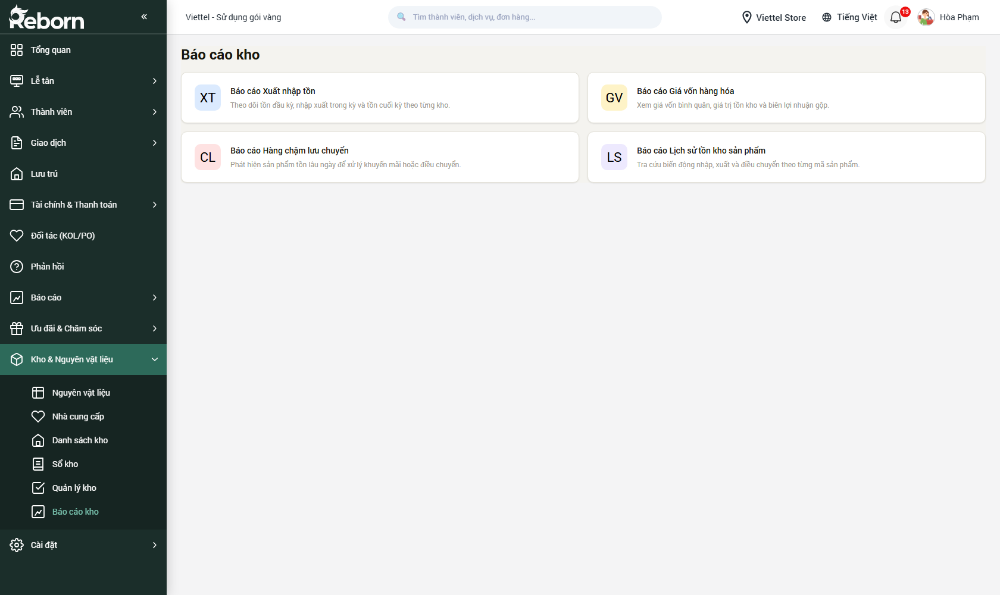

### F.1. Các báo cáo có sẵn

- **Tồn kho hiện tại** — danh sách toàn bộ NVL và số lượng.
- **Sắp hết hàng** — danh sách NVL tồn < tồn tối thiểu (gợi ý nhập).
- **Nhập – Xuất – Tồn** — bảng tổng hợp theo kỳ.
- **Giá trị tồn kho** — tổng tiền đang "ngậm" trong kho.
- **Top NVL luân chuyển nhanh / chậm** — để điều chỉnh kế hoạch mua.
- **Hạn sử dụng** — NVL sắp hết hạn.
- **Lịch sử giá nhập** — xem biến động giá theo thời gian.

---

## G. Luồng công việc thường gặp

### G.1. "Nhập lô hàng mới từ NCC"

1. NCC giao hàng kèm hóa đơn.
2. Vào **Sổ kho → + Tạo phiếu nhập** → chọn NCC → chọn kho.
3. Nhập từng dòng hàng theo hóa đơn → kiểm tra tổng tiền khớp.
4. Nếu đã trả → ghi số tiền đã trả + chọn quỹ chi.
5. Đính kèm ảnh hóa đơn → **Lưu + Nhập kho**.

### G.2. "Cuối tháng kiểm kê kho chính"

1. Vào **Quản lý kho → + Tạo phiếu kiểm kê** → Kho chính → ngày hôm nay.
2. In bảng kiểm kê → đi đếm thực tế.
3. Nhập số đếm vào các dòng có chênh lệch.
4. Ghi lý do cho từng dòng chênh lệch.
5. **Xác nhận** → phiếu điều chỉnh tự tạo.
6. Xem báo cáo **Giá trị hao hụt** → báo quản lý nếu > 5%.

### G.3. "Sản phẩm bán cho khách trong ngày"

Việc này **tự động** diễn ra khi bạn **Bán hàng tại quầy** (Part 02) — mỗi sản phẩm được chọn sẽ tự xuất kho. Không cần làm thủ công ở Part 10.

---

*Hết Part 10.*

---

# Part 11 — Cài đặt cơ bản

*Phiên bản: Cửa hàng & Spa — Tenant "Viettel Store"*

Phân hệ **Cài đặt** chia làm 2 Part:
- **Part 11 (phần này)** — các cài đặt **cơ bản** mà quản lý cửa hàng hoặc admin tenant cài **một lần khi mới triển khai** và **thi thoảng chỉnh khi có thay đổi nghiệp vụ**.
- **Part 12** — các cài đặt **nâng cao** liên quan đến phân quyền, tích hợp, bảo mật.

Part 11 bao phủ 4 mục đầu trong nhóm Cài đặt của sidebar:

| # | Mục | URL | Dùng để |
|---|-----|-----|---------|
| 1 | **Cấu hình toàn cục** | `/crm/ch_tenant_config` | Thông tin cơ sở, logo, múi giờ, đơn vị tiền tệ... |
| 2 | **Danh mục dịch vụ** | `/crm/setting_sell` | Sản phẩm / dịch vụ / combo — danh mục chính |
| 3 | **Quản lý gói thành viên** | `/crm/ch_membership_plans` | Các gói thành viên (Basic, Premium...) |
| 4 | **Vận hành cơ sở** | `/crm/setting_basis` | Ca làm, phương thức thanh toán, cấu hình POS |

> **Đối tượng:** Các mục Part 11 nên do **quản lý cửa hàng** hoặc **admin tenant** cài. Nhân viên thường không cần đụng vào.

---

## A. Cấu hình toàn cục

**URL:** `/crm/ch_tenant_config`


### A.1. Mục đích

Cài **thông tin định danh và định dạng chung** của tenant (đơn vị thuê), áp dụng cho toàn bộ hệ thống.

### A.2. Các nhóm cấu hình

#### Thông tin đơn vị

| Trường | Bắt buộc | Kiểu | Ghi chú |
|--------|:--------:|------|---------|
| **Tên đơn vị** | ✓ | Text ≤ 255 | Hiển thị trên hóa đơn, header |
| **Tên viết tắt** | — | Text ≤ 20 | |
| **Logo** | — | Upload JPG/PNG ≤ 2MB, khuyến nghị 512×512 | |
| **Slogan** | — | Text ≤ 255 | |
| **Mã số thuế** | — | Text 10 hoặc 13 số | |
| **Địa chỉ đăng ký** | — | Text | |
| **Số điện thoại** | — | Tel | |
| **Email liên hệ** | — | Email | |
| **Website** | — | URL | |

#### Định dạng hệ thống

| Trường | Bắt buộc | Ghi chú |
|--------|:--------:|---------|
| **Múi giờ** | ✓ | Mặc định `GMT+7 Asia/Ho_Chi_Minh` |
| **Ngôn ngữ mặc định** | ✓ | Tiếng Việt / English |
| **Đơn vị tiền tệ** | ✓ | VND / USD / EUR |
| **Định dạng ngày** | ✓ | `dd/MM/yyyy` / `MM/dd/yyyy` / `yyyy-MM-dd` |
| **Định dạng số** | ✓ | `1,000,000.00` / `1.000.000,00` |
| **Ngày bắt đầu tuần** | — | Thứ Hai / Chủ Nhật |

#### Cấu hình in ấn

| Trường | Ghi chú |
|--------|---------|
| **Khổ giấy in hóa đơn** | A4 / A5 / 80mm / 58mm (máy in nhiệt) |
| **Header hóa đơn** | Text tự do, hỗ trợ biến `{{tên_đơn_vị}}`, `{{địa_chỉ}}` |
| **Footer hóa đơn** | Text tự do |
| **In logo** | Bật/tắt |
| **QR mã tra cứu** | Có/không in QR để khách quét xem online |

#### Các cấu hình khác

- **Mã tự động**: cấu hình quy tắc sinh mã khách hàng, mã đơn, mã NVL, v.v.
- **Làm tròn giá**: làm tròn đến 1000đ / 500đ / không làm tròn.
- **Thời gian session**: bao lâu không thao tác thì tự logout.

### A.3. Các bước cấu hình lần đầu

1. Vào **Cấu hình toàn cục** → tab **Thông tin đơn vị**.
2. Điền đầy đủ tên, logo, địa chỉ, MST → **Lưu**.
3. Chuyển tab **Định dạng hệ thống** → chọn múi giờ, ngôn ngữ, tiền tệ → **Lưu**.
4. Chuyển tab **In ấn** → chọn khổ giấy theo máy in bạn có → nhập header/footer → **Lưu**.
5. Kiểm tra bằng cách tạo thử một đơn ở Part 02 → In → xem đúng không.

---

## B. Danh mục dịch vụ

**URL:** `/crm/setting_sell`

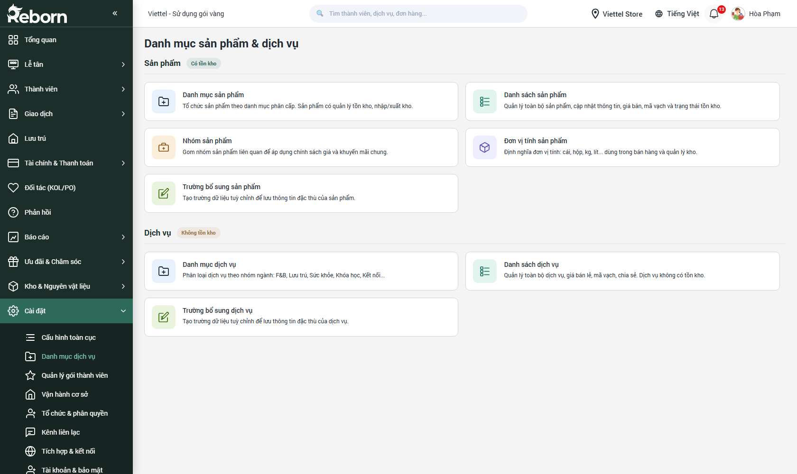

### B.1. Mục đích

Quản lý toàn bộ **sản phẩm** và **dịch vụ** mà cửa hàng bán. Đây là **nguồn cấp dữ liệu chính** cho màn hình POS (Part 02).

### B.2. Phân nhóm

Hệ thống hỗ trợ nhiều cấp:

- **Danh mục cấp 1**: *"Dịch vụ"*, *"Sản phẩm"*.
- **Danh mục cấp 2**: Spa / Massage / Facial / Combo... hoặc Mỹ phẩm / Thực phẩm...
- **Danh mục cấp 3**: cụ thể hơn.

Quản lý cấu trúc cây này trước, rồi mới thêm từng item.

### B.3. Thêm sản phẩm / dịch vụ

**Các bước:**

1. Bấm **+ Thêm mới** → chọn loại (Sản phẩm / Dịch vụ / Combo).
2. Điền form:

#### Quy định nhập liệu — Sản phẩm / Dịch vụ

| Trường | Bắt buộc | Kiểu | Ràng buộc / Ghi chú |
|--------|:--------:|------|---------------------|
| **Tên** | ✓ | Text ≤ 255 | Hiển thị trên POS, hóa đơn |
| **Mã** | — | Text ≤ 50 | Auto gen nếu trống; nên có để quét mã vạch |
| **Mã vạch (barcode)** | — | Text | Cho máy quét |
| **Danh mục** | ✓ | Select | Chọn từ cây danh mục |
| **Loại** | ✓ | Sản phẩm / Dịch vụ / Combo | Sản phẩm: trừ kho; Dịch vụ: không kho; Combo: gộp nhiều item |
| **Đơn vị tính** | ✓ | Chọn / nhập | |
| **Giá bán** | ✓ | Number ≥ 0 | |
| **Giá vốn** | — | Number ≥ 0 | Để tính lãi gộp |
| **Giá khuyến mãi** | — | Number ≥ 0 | Nếu có |
| **VAT** | — | 0/5/8/10% | |
| **Mô tả ngắn** | — | Textarea ≤ 500 | |
| **Mô tả đầy đủ** | — | Rich text | Dùng cho website/app |
| **Ảnh chính** | — | Upload ≤ 5MB | Vuông, khuyến nghị 800×800 |
| **Ảnh phụ** | — | Upload nhiều | |
| **Biến thể (variants)** | — | Table | Size S/M/L, Màu đỏ/xanh... mỗi biến thể có mã + giá riêng |
| **Thời lượng (dịch vụ)** | — (✓ nếu dịch vụ có booking) | Number (phút) | Vd 60 phút cho massage |
| **Số nhân viên cần** | — | Number | Dùng cho quản lý lịch |
| **Tồn kho ban đầu (sản phẩm)** | — | Number | |
| **Tồn tối thiểu** | — | Number | Cảnh báo |
| **Cho phép bán khi hết** | — | Bool | Cho phép tạo đơn dù tồn = 0 |
| **Nhóm thuộc gói TV** | — | Multi-select | Các gói thành viên có item này |
| **Trạng thái** | ✓ | Đang bán / Ngừng bán | |

3. **Lưu** — item xuất hiện trong POS ngay.

### B.4. Tạo combo

Combo là **nhóm nhiều sản phẩm/dịch vụ** bán theo gói giá cố định. Ví dụ combo "Massage 60p + Xông hơi 30p + Nước detox = 500k" thay vì bán lẻ 650k.

1. Thêm mới → chọn **Loại: Combo**.
2. Các trường thông thường (tên, giá combo, ảnh, mô tả).
3. Bảng **Thành phần combo**: thêm từng item (SL, SP/DV nào).
4. **Lưu**.

### B.5. Import hàng loạt

Nếu có hàng trăm item, dùng **Nhập Excel**:
1. Tải mẫu → điền → upload.
2. Kiểm tra mapping cột → **Nhập**.

---

## C. Quản lý gói thành viên

**URL:** `/crm/ch_membership_plans`

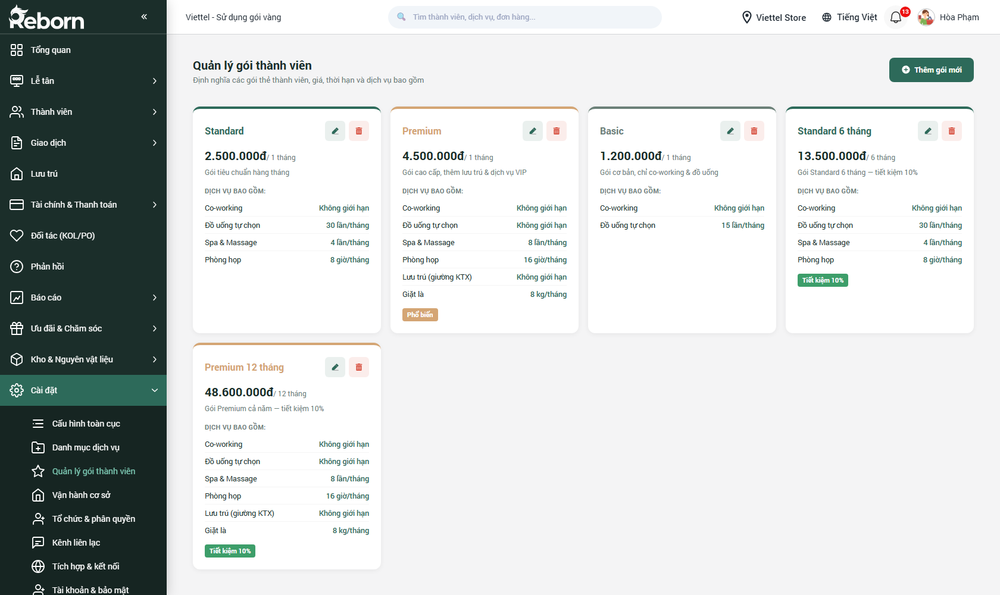

### C.1. Gói thành viên là gì?

Khác với **sản phẩm/dịch vụ đơn lẻ**, **gói thành viên** là **gói thẻ có thời hạn** mà khách mua một lần để được dùng dịch vụ nhiều lần trong một khoảng thời gian. Ví dụ:

- **Basic 1 tháng — 1.200.000đ**: 4 lần massage 60p + 8 lần co-working ngày + nước miễn phí.
- **Premium 1 tháng — 4.500.000đ**: massage không giới hạn + phòng riêng 10 giờ + ăn sáng.
- **Standard 6 tháng — 13.500.000đ**: tương tự Basic nhưng rẻ hơn /tháng nếu mua dài hạn.

### C.2. Tạo gói mới

#### Quy định nhập liệu — Gói thành viên

| Trường | Bắt buộc | Ghi chú |
|--------|:--------:|---------|
| **Tên gói** | ✓ | Vd *"Premium 1 tháng"* |
| **Mã gói** | — | Auto |
| **Màu chủ đạo** | — | Color picker — hiển thị trên card |
| **Giá** | ✓ | Number ≥ 0 VNĐ |
| **Giá khuyến mãi** | — | Để hiển thị giá gốc gạch ngang |
| **Thời hạn (tháng)** | ✓ | Number ≥ 1 |
| **Mô tả ngắn** | ✓ | ≤ 500 ký tự |
| **Danh sách dịch vụ đi kèm** | ✓ | Bảng với cột: Dịch vụ, Số lượt (quota), Đơn vị |
| **Ưu đãi bổ sung** | — | Vd *"Giảm 10% spa khác ngoài gói"* |
| **Ảnh** | — | Upload |
| **Badge đặc biệt** | — | *"Phổ biến"*, *"Mới"*, *"Giảm 20%"* |
| **Trạng thái** | ✓ | Đang bán / Ngừng bán |
| **Mục hiển thị thứ tự** | — | Số |

### C.3. Quản lý hạng thẻ (tier)

Khác với "gói" (là sản phẩm cụ thể bán), **hạng thẻ** là **cấp độ thành viên** (Basic/Silver/Gold/Diamond) mà khách lên tự động theo tổng chi tiêu. Quản lý hạng thẻ ở [Part 03 → Cài đặt thành viên → Danh sách thẻ](part-03-thanh-vien.md#b1-danh-sách-thẻ-thành-viên).

---

## D. Vận hành cơ sở

**URL:** `/crm/setting_basis`

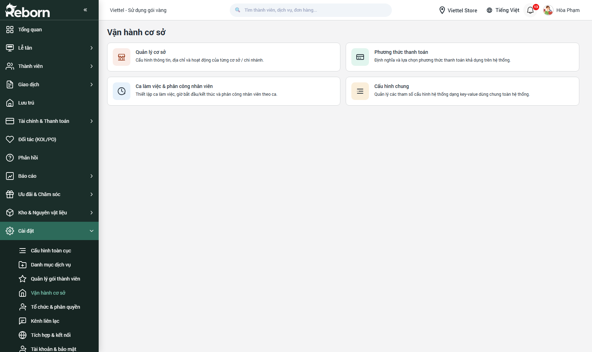

### D.1. Cấu trúc

Màn hình này gộp **nhiều nhóm cấu hình vận hành**:

- **Cơ sở / Chi nhánh** — danh sách các điểm bán
- **Cấu hình ca làm việc** — tạo mẫu ca (ca sáng, ca chiều...)
- **Phương thức thanh toán** — bật/tắt cash, CK, ví, thẻ
- **Cấu hình POS** — tuỳ chỉnh màn bán hàng (tab nào bật, tab nào tắt)
- **Cấu hình kho mặc định** — kho nào trừ khi bán
- **Phòng / Bàn** — (nếu có lưu trú, xem Part 05)

### D.2. Cơ sở / Chi nhánh

Mỗi cửa hàng vật lý = 1 cơ sở. Hệ thống cho phép nhiều cơ sở dưới 1 tenant.

#### Quy định nhập liệu — Cơ sở

| Trường | Bắt buộc | Ghi chú |
|--------|:--------:|---------|
| **Tên cơ sở** | ✓ | Vd *"Viettel Store — Cầu Giấy"* |
| **Mã cơ sở** | — | Auto |
| **Địa chỉ** | ✓ | Text |
| **SĐT** | — | Tel |
| **Quản lý phụ trách** | — | Select nhân viên |
| **Múi giờ** | — | Nếu khác default |
| **Trạng thái** | ✓ | Đang hoạt động / Tạm đóng |

### D.3. Cấu hình ca làm việc

Cài **mẫu ca** để sau này nhân viên mở ca nhanh:

| Trường | Bắt buộc | Ghi chú |
|--------|:--------:|---------|
| **Tên ca** | ✓ | Vd *"Ca sáng"*, *"Ca chiều"*, *"Ca toàn thời"* |
| **Giờ bắt đầu** | ✓ | 08:00 |
| **Giờ kết thúc** | ✓ | 14:00 |
| **Tiền mặt mặc định đầu ca** | — | Number |
| **Bắt buộc đếm mệnh giá** | — | Bool |
| **Cho phép mở nhiều ca đồng thời** | — | Bool |

### D.4. Phương thức thanh toán

Bật/tắt các phương thức trên POS. Với mỗi phương thức có thể có config phụ:

- **Tiền mặt** — không cần cấu hình.
- **Chuyển khoản** — nhập STK, tên NH, chủ TK, tạo QR tĩnh.
- **Thẻ** — nếu dùng máy POS ngân hàng.
- **Ví điện tử**: MoMo, ZaloPay, VNPay — cần API key (xem Part 12).
- **Công nợ** — cho phép bán chịu không.

### D.5. Cấu hình POS

Tuỳ biến màn Bán hàng tại quầy (Part 02):

- Bật/tắt các tab: Bán hàng / Bán thẻ / Bán LP / Đơn tạm / Đơn hàng / Báo cáo.
- Hiển thị danh mục nào mặc định.
- Cho phép **Thêm nhanh** (quick add) hay không.
- Mặc định in hóa đơn sau thanh toán / không in tự động.

---

## E. Thứ tự cài đặt ban đầu (setup mới)

Khi bạn nhận tenant mới, làm theo thứ tự này để tiết kiệm thời gian nhất:

```
1. Cấu hình toàn cục
   ├── Thông tin đơn vị (tên, logo, MST)
   └── Định dạng (múi giờ, ngôn ngữ, tiền tệ)

2. Vận hành cơ sở
   ├── Tạo Cơ sở đầu tiên
   ├── Tạo Ca làm việc mẫu
   └── Bật Phương thức thanh toán

3. Danh mục dịch vụ
   ├── Tạo cây danh mục
   ├── Thêm sản phẩm / dịch vụ
   └── Tạo combo (nếu có)

4. Quản lý gói thành viên
   └── Tạo các gói Basic / Premium / Standard

5. Part 03 — Cài đặt thành viên
   ├── Thẻ thành viên (Diamond/Gold/Silver)
   ├── Nguồn thành viên
   ├── Nhóm thành viên
   └── Trường bổ sung (nếu cần)

6. Part 12 — Cài đặt nâng cao
   ├── Tổ chức & phân quyền
   └── Tích hợp kênh (SMS, Email, Zalo)
```

Sau các bước trên, bạn có thể bắt đầu bán hàng ngay ở Part 02.

---

*Hết Part 11.*

---

# Part 12 — Cài đặt nâng cao

*Phiên bản: Cửa hàng & Spa — Tenant "Viettel Store"*

Part 12 bao phủ 5 mục cài đặt còn lại — **dành cho admin tenant** và các **cấu hình kỹ thuật**:

| # | Mục | URL | Dùng để |
|---|-----|-----|---------|
| 1 | **Tổ chức & phân quyền** | `/crm/setting_org` | Phòng ban, nhóm quyền, nhân viên |
| 2 | **Kênh liên lạc** | `/crm/setting_channels` | Cấu hình SMS, Email, Zalo OA, Facebook |
| 3 | **Tích hợp & kết nối** | `/crm/setting_integrations` | API bên thứ 3, webhook, ứng dụng |
| 4 | **Tài khoản & bảo mật** | `/crm/setting_account` | Hồ sơ cá nhân, đổi mật khẩu, 2FA |
| 5 | **Hỗ trợ thành viên** | `/crm/setting_ticket` | Cấu hình hệ thống ticket hỗ trợ |

---

## A. Tổ chức & phân quyền

**URL:** `/crm/setting_org`

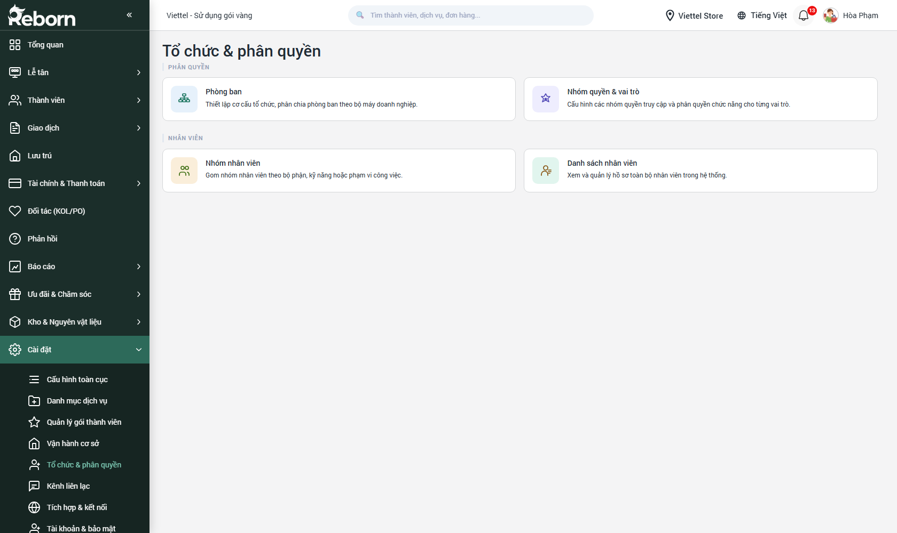

### A.1. Cấu trúc

Màn hình này gộp **3 nhóm cấu hình** có liên quan mật thiết với nhau:

1. **Phòng ban** (Department) — cấu trúc tổ chức
2. **Nhóm quyền** (Role) — tập hợp các quyền cụ thể
3. **Nhân viên** (User) — tài khoản của từng người, gán vào phòng ban + nhóm quyền

### A.2. Phòng ban

**Ví dụ cây phòng ban:**

```
Viettel Store (root)
├── Ban giám đốc
├── Phòng Lễ tân
│   ├── Ca sáng
│   └── Ca chiều
├── Phòng Kỹ thuật viên
├── Phòng Kế toán
└── Phòng Marketing
```

#### Quy định nhập liệu — Phòng ban

| Trường | Bắt buộc | Ghi chú |
|--------|:--------:|---------|
| **Tên phòng ban** | ✓ | Text ≤ 255 |
| **Mã** | — | Auto gen |
| **Phòng ban cha** | — | Select — để trống nếu là root |
| **Trưởng phòng** | — | Select nhân viên |
| **Mô tả** | — | Text |

### A.3. Nhóm quyền

Mỗi nhóm quyền là **tập hợp các quyền cụ thể** (permissions). Ví dụ:

- **Admin tenant** — toàn quyền.
- **Quản lý cửa hàng** — xem báo cáo + mở/đóng ca + xem lịch sử + không được xóa dữ liệu.
- **Nhân viên lễ tân** — bán hàng + check-in + xem khách + không vào báo cáo tiền.
- **Kế toán** — xem tiền + phiếu thu chi + công nợ + không được bán hàng.
- **Kỹ thuật viên** — chỉ xem lịch của mình, trừ quota dịch vụ.

**Tạo nhóm quyền:**

1. Bấm **+ Thêm nhóm quyền**.
2. Điền **Tên nhóm** + **Mô tả**.
3. Tick các quyền cụ thể trong **cây quyền** — thường được nhóm theo module:
   - `customer.view` / `customer.create` / `customer.update` / `customer.delete`
   - `customer.viewPhone` — quyền nhạy cảm (xem SĐT đầy đủ)
   - `invoice.create` / `invoice.cancel` / `invoice.refund`
   - `shift.open` / `shift.close` / `shift.viewAll`
   - `finance.create` / `finance.view` / `finance.approve`
   - ...
4. **Lưu**.

#### Quy định nhập liệu — Nhóm quyền

| Trường | Bắt buộc | Ghi chú |
|--------|:--------:|---------|
| **Tên nhóm quyền** | ✓ | Text |
| **Mô tả** | — | Text |
| **Cơ sở áp dụng** | — | Chỉ nhóm này ở cơ sở A, hoặc tất cả |
| **Danh sách quyền** | ✓ | Tick ít nhất 1 |

### A.4. Nhân viên (tài khoản)

**Thêm nhân viên mới:**

1. Bấm **+ Thêm nhân viên**.
2. Điền thông tin:

#### Quy định nhập liệu — Nhân viên / Tài khoản

| Trường | Bắt buộc | Kiểu | Ràng buộc |
|--------|:--------:|------|-----------|
| **Họ và tên** | ✓ | Text ≤ 255 | |
| **Số điện thoại** | ✓ | Tel | Không trùng với nhân viên khác. Dùng làm username đăng nhập |
| **Email** | ✓ | Email | Cũng có thể làm username |
| **Mật khẩu** | ✓ | Text | Yêu cầu: ≥ 8 ký tự, có chữ hoa + chữ thường + số |
| **Xác nhận mật khẩu** | ✓ | Text | Phải khớp mật khẩu |
| **Phòng ban** | ✓ | Select | Từ danh sách phòng ban |
| **Nhóm quyền** | ✓ | Multi-select | Có thể gán nhiều nhóm, quyền được union |
| **Cơ sở được phép** | ✓ | Multi-select | Nhân viên ở cơ sở nào thì thấy dữ liệu cơ sở đó |
| **Mã nhân viên** | — | Text | Auto gen |
| **CCCD/CMND** | — | Text | |
| **Ngày sinh** | — | Date | |
| **Ngày vào làm** | — | Date | |
| **Địa chỉ** | — | Text | |
| **Ảnh đại diện** | — | Upload ≤ 2MB | |
| **Trạng thái** | ✓ | Đang làm / Nghỉ việc / Tạm khóa | |

3. **Lưu**. Nhân viên nhận email/SMS kèm thông tin đăng nhập và link đăng nhập.

### A.5. Mẹo quản lý phân quyền

- **Nguyên tắc tối thiểu**: chỉ cấp quyền thực sự cần. Đừng cấp Admin cho mọi người "cho nhanh".
- **Nhân viên thu ngân không được cấp quyền Refund** — tránh gian lận.
- **Tách quyền xem báo cáo** — quản lý có, nhân viên không có.
- Khi **nhân viên nghỉ việc** → chuyển trạng thái **Nghỉ việc** (không xóa) → mọi log vẫn giữ.
- Định kỳ **review quyền** 6 tháng/lần.

---

## B. Kênh liên lạc

**URL:** `/crm/setting_channels`

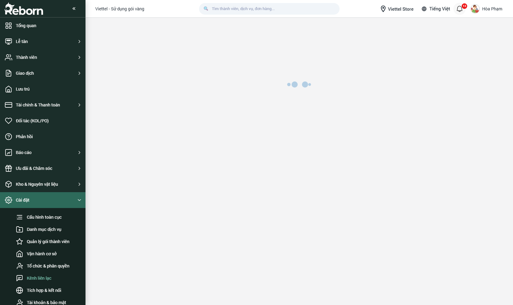

### B.1. Các kênh hỗ trợ

Landing page này gom 4 kênh chính:

- **SMS** — cổng gửi SMS (Viettel, VinaSMS, eSMS...)
- **Email** — SMTP / SendGrid / Mailgun
- **Zalo OA** — kênh Zalo Official Account
- **Facebook Messenger** — Fanpage

### B.2. SMS

#### Cấu hình cổng SMS

| Trường | Bắt buộc | Ghi chú |
|--------|:--------:|---------|
| **Nhà cung cấp** | ✓ | Viettel / VinaSMS / eSMS / Twilio |
| **API Key / Username** | ✓ | Credentials do NCC cấp |
| **API Secret / Password** | ✓ | |
| **Brand name** | ✓ | Tên hiển thị khi khách nhận SMS |
| **Loại tin** | ✓ | OTP / Marketing / Chăm sóc |

#### Test kết nối

Sau khi điền, bấm **Test gửi** → nhập 1 SĐT → gửi tin thử.

### B.3. Email (SMTP)

| Trường | Bắt buộc | Ghi chú |
|--------|:--------:|---------|
| **Máy chủ SMTP** | ✓ | Vd `smtp.gmail.com` |
| **Cổng** | ✓ | 587 (TLS) / 465 (SSL) |
| **Username / Email** | ✓ | |
| **Password / App Password** | ✓ | Với Gmail phải dùng App Password |
| **Email gửi (From)** | ✓ | |
| **Tên hiển thị (From name)** | ✓ | Vd *"Viettel Store"* |
| **Reply-to** | — | Nếu muốn khách reply về địa chỉ khác |

### B.4. Zalo OA

| Trường | Ghi chú |
|--------|---------|
| **OA ID** | Do Zalo cấp khi đăng ký OA |
| **Access Token** | Từ Zalo Developer |
| **Secret Key** | |
| **Webhook URL** | Copy URL này cấu hình vào Zalo |

### B.5. Facebook Messenger

| Trường | Ghi chú |
|--------|---------|
| **Page ID** | ID Fanpage |
| **Page Access Token** | Token long-lived từ Facebook Graph API |
| **App Secret** | |
| **Webhook Verify Token** | Do bạn tự đặt |

---

## C. Tích hợp & kết nối

**URL:** `/crm/setting_integrations`

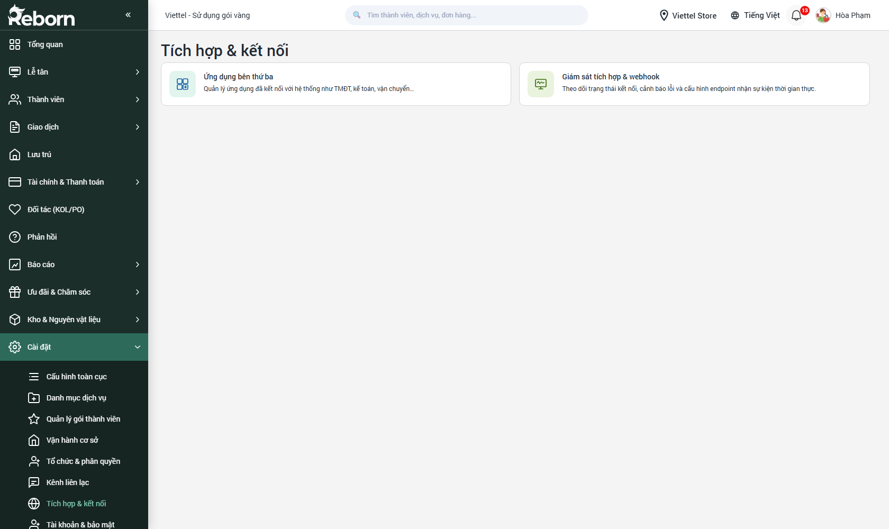

### C.1. Các loại tích hợp

- **Payment gateway**: VNPay, MoMo, ZaloPay, OnePay — để nhận thanh toán online.
- **Kế toán**: MISA, FAST, Bravo — đồng bộ hóa đơn sang phần mềm kế toán.
- **Hóa đơn điện tử**: Viettel E-invoice, VNPT, Misa meInvoice — để xuất VAT (xem Part 04).
- **Vận chuyển**: GHN, GHTK, J&T — tạo đơn giao tự động.
- **Google**: Google Calendar, Google Sheets, Google Drive — đồng bộ lịch / báo cáo.
- **Microsoft**: Outlook, Teams.
- **Ứng dụng tùy chỉnh**: webhook cho app của bạn.

### C.2. Các bước kết nối một tích hợp

1. Chọn **loại tích hợp** từ danh sách.
2. Bấm **Kết nối**.
3. Điền **credentials** (API key, secret, token…) — do nhà cung cấp cấp.
4. Bấm **Test kết nối** — hệ thống gọi API thử.
5. Nếu OK, bật **Kích hoạt** → tích hợp đi vào hoạt động.

### C.3. Webhook

Tenant có thể **gửi sự kiện** sang app của bên ngoài:

1. Bấm **+ Thêm webhook**.
2. Điền:
   - **URL đích**
   - **Sự kiện muốn nhận**: `invoice.created`, `customer.created`, `checkin.created`, `shift.closed`, v.v.
   - **Bí mật ký** (HMAC secret)
3. **Lưu**. Mỗi khi sự kiện xảy ra, CRM POST JSON sang URL đó.

### C.4. Monitoring webhook

Tab **Giám sát webhook** hiển thị:
- Số lần gửi thành công / thất bại.
- Log chi tiết mỗi request.
- Nút **Retry** cho các request thất bại.

---

## D. Tài khoản & bảo mật

**URL:** `/crm/setting_account`

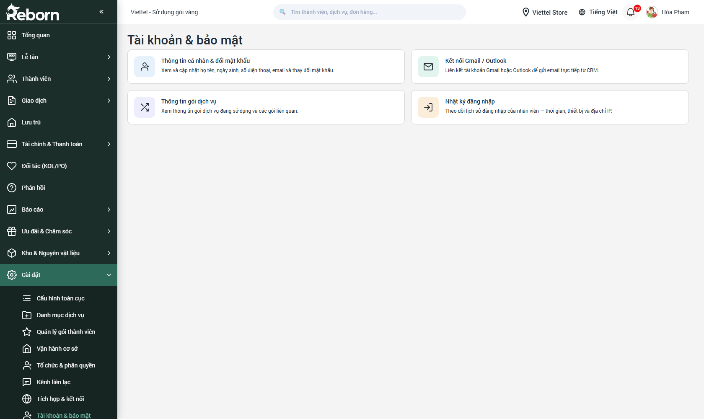

### D.1. Khác biệt so với Part 12.A

- **Part 12.A (Tổ chức & phân quyền)** → admin cấu hình **tất cả nhân viên**.
- **Part 12.D (Tài khoản & bảo mật)** → **mỗi cá nhân** tự quản lý tài khoản của chính mình.

### D.2. Các tab

#### Hồ sơ cá nhân

- Họ tên, avatar, SĐT, email
- Bấm **Cập nhật**.

#### Đổi mật khẩu

| Trường | Bắt buộc | Ràng buộc |
|--------|:--------:|-----------|
| **Mật khẩu hiện tại** | ✓ | Phải đúng mật khẩu đang dùng |
| **Mật khẩu mới** | ✓ | ≥ 8 ký tự, có chữ hoa + chữ thường + số. Không giống mật khẩu cũ |
| **Xác nhận mật khẩu mới** | ✓ | Phải khớp **Mật khẩu mới** |

**Quy tắc mạnh yếu:**
- 🔴 **Yếu** — chỉ có chữ thường
- 🟡 **Trung bình** — chữ hoa + thường
- 🟢 **Mạnh** — chữ hoa + thường + số
- 🟢🟢 **Rất mạnh** — có thêm ký tự đặc biệt + ≥ 12 ký tự

#### Xác thực 2 bước (2FA)

Nếu tenant bật 2FA, bạn phải:
1. Tải app **Google Authenticator** / **Authy**.
2. Quét QR code.
3. Nhập mã 6 số từ app để xác nhận.
4. Lưu **backup codes** để dùng khi mất điện thoại.

#### Phiên đăng nhập

Danh sách các **thiết bị đang đăng nhập** bằng tài khoản của bạn. Có thể **Đăng xuất từ xa** một thiết bị (nếu thấy lạ).

#### Nhật ký hoạt động

Log các hành động quan trọng của chính bạn: đăng nhập, đổi mật khẩu, thay đổi nhạy cảm. Dùng để kiểm tra tài khoản có bị lạ không.

#### Gói dịch vụ

Xem tenant của bạn đang dùng gói nào, hạn đến khi nào, các tính năng bao gồm. Từ đây có nút **Gia hạn** / **Nâng cấp gói**.

---

## E. Hỗ trợ thành viên (Ticket System)

**URL:** `/crm/setting_ticket`

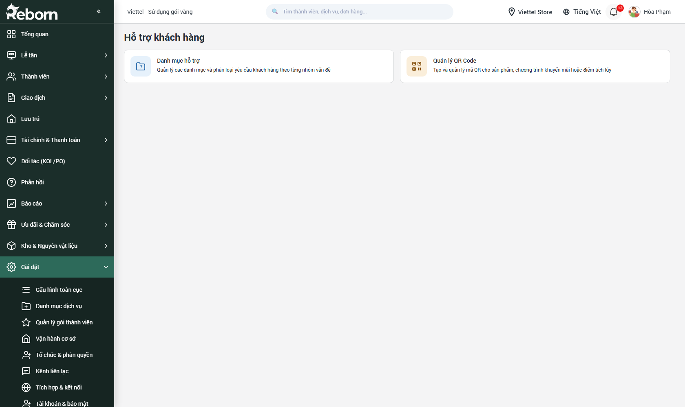

### E.1. Mục đích

Cấu hình **hệ thống ticket** để khách hàng có thể:
- Gửi yêu cầu hỗ trợ qua form / email / QR code.
- Theo dõi tiến độ xử lý.
- Nhận thông báo khi có cập nhật.

### E.2. Các nhóm cấu hình

#### Danh mục loại ticket

Vd: *Khiếu nại chất lượng*, *Yêu cầu đổi/trả*, *Hỏi thông tin*, *Báo lỗi*, *Gợi ý cải thiện*.

Mỗi loại có:
- Tên, mô tả.
- **SLA** — thời gian phải xử lý (vd 24h, 48h, 7 ngày).
- **Đội phụ trách** (route tự động).
- **Mức độ ưu tiên mặc định**.

#### Trạng thái ticket

Các trạng thái trong vòng đời: *Mới* → *Đang xử lý* → *Chờ phản hồi* → *Đã xử lý* → *Đóng*. Có thể thêm trạng thái tùy chỉnh.

#### Template phản hồi

Các mẫu reply nhanh để nhân viên không phải gõ lại, vd:

```
Xin chào {{tên_khách}},
Cảm ơn quý khách đã phản hồi. Chúng tôi đã ghi nhận và sẽ xử lý trong vòng 24 giờ. 
...
```

#### QR code hỗ trợ

Tạo **mã QR** để in lên tờ rơi / menu / hoá đơn. Khách quét QR → vào form gửi ticket nhanh.

### E.3. Kết nối với Phản hồi (Part 07)

Các ticket tạo ở đây **tự động đồng bộ** với màn **Phản hồi** (Part 07). Về bản chất là cùng một dữ liệu, chỉ khác ở góc nhìn:

- **Phản hồi** (Part 07) — góc nhìn CRM (loại, mức độ, nội dung).
- **Ticket** (Part 12.E) — góc nhìn workflow (SLA, trạng thái, người phụ trách).

---

## F. Nhóm cài đặt hay bỏ qua nhưng quan trọng

### F.1. Đổi mật khẩu mặc định ngay sau khi nhận tenant

**Rất nhiều tenant để mật khẩu mặc định nhiều tháng.** Điều này cực kỳ nguy hiểm. Admin tenant nên:
1. Đăng nhập lần đầu.
2. Vào **Tài khoản & bảo mật** → **Đổi mật khẩu** ngay.
3. Bật 2FA nếu có thể.

### F.2. Kiểm tra quyền xem SĐT

Quyền `customer.viewPhone` rất nhạy cảm. Mặc định nhiều hệ thống cấp cho tất cả nhân viên → ai cũng thấy SĐT khách đầy đủ. Nên **chỉ cấp cho quản lý và nhân viên trực tiếp cần**.

### F.3. Backup dữ liệu

Vào **Tích hợp** → kiểm tra có tích hợp **Google Drive** / **Dropbox** để backup không. Nếu không có, yêu cầu đội Reborn cấu hình.

### F.4. Giám sát webhook

Nếu bạn có app ngoài kết nối với CRM, hãy vào **Giám sát webhook** định kỳ. Webhook thất bại nhiều = dữ liệu sẽ lệch.

---

*Hết Part 12.*
